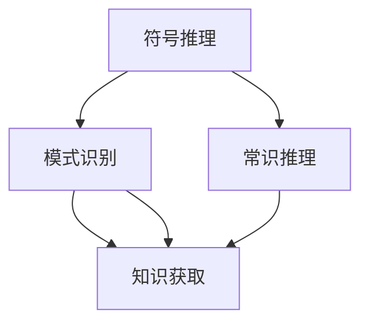
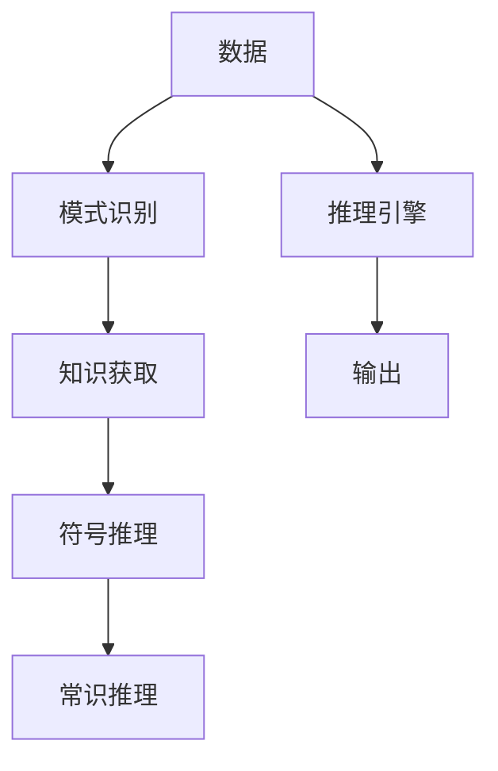

                 

# 计算：第四部分 计算的极限 第 12 章 机器能思考吗

> 关键词：计算极限, 人工智能, 机器学习, 深度学习, 思考, 思维, 神经网络

## 1. 背景介绍

### 1.1 问题由来

随着计算技术的快速发展，人工智能（AI）领域取得了举世瞩目的成就。深度学习、自然语言处理、计算机视觉等技术的突破，使得机器在理解和处理复杂数据方面能力显著提升。然而，机器是否能像人类一样思考，这个问题依然困扰着学术界和工业界。这一疑问不仅关系到AI的未来发展方向，还涉及伦理、哲学等深刻议题。

### 1.2 问题核心关键点

当前，机器的思考能力主要体现在以下几个方面：

- **符号推理**：机器能否像人类一样通过符号逻辑进行推理，解决复杂问题？
- **模式识别**：机器能否从大量数据中学习模式，预测未来事件？
- **知识获取**：机器能否通过自学习获取新知识，并根据新知识调整行为？
- **常识推理**：机器能否具备常识，进行因果推断，处理日常情境？

这些问题构成了机器是否能思考的核心。尽管AI在特定任务上已表现出类似人类的能力，但在真正意义上像人类一样思考，仍存在很大差距。本文将探讨机器的思考能力，分析当前机器学习的局限性，并展望未来AI的突破方向。

## 2. 核心概念与联系

### 2.1 核心概念概述

要回答机器是否能思考，首先需要理解几个关键概念：

- **符号推理**：使用符号逻辑规则进行推理，如Prolog等。
- **模式识别**：通过学习数据中的模式，进行分类、预测等任务。
- **知识获取**：通过归纳、推理等方法获取新知识，如规则学习、知识图谱等。
- **常识推理**：利用常识进行因果推断，处理日常情境，如因果推理、情景理解等。

这些概念之间存在紧密联系。符号推理和常识推理需要建立在模式识别和知识获取的基础上。模式识别能够帮助机器从数据中学习模式，进而推理和获取知识。知识获取不仅依赖于模式识别，还需通过符号推理形成系统化的知识库。

### 2.2 概念间的关系

这些概念之间的逻辑关系可以通过以下Mermaid流程图来展示：



这个流程图展示了各个概念之间的关系：

1. 模式识别为符号推理和常识推理提供基础数据和知识库。
2. 符号推理和常识推理依赖模式识别和知识获取形成新的知识库。
3. 模式识别、符号推理和常识推理共同作用，使机器能够思考。

### 2.3 核心概念的整体架构

最终，这些概念共同构成了机器思考能力的整体架构：



这个综合流程图展示了从数据到推理引擎的整个过程，各个概念在其中扮演着不同角色。

## 3. 核心算法原理 & 具体操作步骤
### 3.1 算法原理概述

机器的思考能力主要通过符号推理、模式识别、知识获取和常识推理等算法实现。这些算法构建在深度学习等神经网络基础上，通过大量数据训练模型，学习复杂的非线性模式和结构。

符号推理通常使用Prolog等逻辑编程语言实现，通过规则和公理进行推理。模式识别和知识获取通常使用深度学习模型，如卷积神经网络（CNN）、循环神经网络（RNN）等。常识推理则依赖于大规模语料库和预训练模型，通过迁移学习等方式进行。

### 3.2 算法步骤详解

以下是机器思考能力实现的主要步骤：

1. **数据准备**：收集和预处理数据，确保数据质量和多样性。
2. **模型选择**：根据任务选择合适的模型，如CNN、RNN、Transformer等。
3. **特征提取**：使用卷积层、池化层等提取输入数据的特征。
4. **模型训练**：使用大量标注数据训练模型，调整模型参数，使其能够学习数据中的模式和结构。
5. **知识获取**：通过迁移学习、推理等方式获取新知识，更新知识库。
6. **推理和预测**：使用推理引擎进行符号推理、常识推理等，最终生成预测结果。

### 3.3 算法优缺点

机器思考能力的主要优点包括：

- **高效性**：能够快速处理大量数据，进行模式识别和知识获取。
- **可扩展性**：通过增加数据和模型复杂度，提升思考能力。
- **自动化**：自动化学习和推理，减少了人工干预。

同时，也存在一些缺点：

- **泛化能力不足**：面对新数据和情境，机器可能难以快速适应。
- **缺乏常识**：当前机器缺乏真正的常识，难以处理日常情境和复杂问题。
- **可解释性差**：机器的推理过程缺乏可解释性，难以理解其决策逻辑。

### 3.4 算法应用领域

机器思考能力在多个领域得到应用，如：

- **自然语言处理（NLP）**：机器能够理解自然语言，进行对话、翻译、摘要等任务。
- **计算机视觉（CV）**：机器能够识别图像中的物体和场景，进行分类、检测等任务。
- **语音识别**：机器能够识别和理解语音指令，进行对话、语音合成等任务。
- **游戏AI**：机器能够通过学习策略，自主进行游戏决策。

## 4. 数学模型和公式 & 详细讲解 & 举例说明

### 4.1 数学模型构建

以机器学习中的卷积神经网络（CNN）为例，构建数学模型：

$$
\mathbf{x} = \mathbf{X} * \mathbf{W}^*
$$

其中，$\mathbf{x}$ 表示输入数据，$\mathbf{X}$ 表示数据矩阵，$\mathbf{W}^*$ 表示卷积核权重矩阵。

### 4.2 公式推导过程

以CNN的卷积层为例，推导其前向传播和反向传播过程：

前向传播：
$$
\mathbf{x} = \mathbf{X} * \mathbf{W}^*
$$

反向传播：
$$
\frac{\partial \mathbf{L}}{\partial \mathbf{W}^*} = \mathbf{G} * \mathbf{x}^T
$$

其中，$\mathbf{L}$ 表示损失函数，$\mathbf{G}$ 表示梯度矩阵。

### 4.3 案例分析与讲解

以图像分类任务为例，展示CNN的构建和应用：

```python
import torch.nn as nn
import torchvision

# 定义CNN模型
class Net(nn.Module):
    def __init__(self):
        super(Net, self).__init__()
        self.conv1 = nn.Conv2d(3, 6, 5)
        self.pool = nn.MaxPool2d(2, 2)
        self.conv2 = nn.Conv2d(6, 16, 5)
        self.fc1 = nn.Linear(16 * 5 * 5, 120)
        self.fc2 = nn.Linear(120, 84)
        self.fc3 = nn.Linear(84, 10)
    
    def forward(self, x):
        x = nn.functional.relu(self.conv1(x))
        x = self.pool(x)
        x = nn.functional.relu(self.conv2(x))
        x = self.pool(x)
        x = x.view(-1, 16 * 5 * 5)
        x = nn.functional.relu(self.fc1(x))
        x = nn.functional.relu(self.fc2(x))
        x = self.fc3(x)
        return x

# 加载预训练的ResNet模型
model = torchvision.models.resnet18(pretrained=True)
model.fc = Net().fc3
```

在实际应用中，可以通过调整模型参数、改变网络结构等方式，优化模型性能。

## 5. 项目实践：代码实例和详细解释说明
### 5.1 开发环境搭建

在进行项目实践前，我们需要准备好开发环境。以下是使用Python进行PyTorch开发的环境配置流程：

1. 安装Anaconda：从官网下载并安装Anaconda，用于创建独立的Python环境。

2. 创建并激活虚拟环境：
```bash
conda create -n pytorch-env python=3.8 
conda activate pytorch-env
```

3. 安装PyTorch：根据CUDA版本，从官网获取对应的安装命令。例如：
```bash
conda install pytorch torchvision torchaudio cudatoolkit=11.1 -c pytorch -c conda-forge
```

4. 安装TensorFlow：
```bash
pip install tensorflow
```

5. 安装各类工具包：
```bash
pip install numpy pandas scikit-learn matplotlib tqdm jupyter notebook ipython
```

完成上述步骤后，即可在`pytorch-env`环境中开始项目实践。

### 5.2 源代码详细实现

这里我们以图像分类任务为例，给出使用PyTorch对CNN模型进行训练的代码实现。

```python
import torch
import torchvision
import torchvision.transforms as transforms
import torch.nn as nn
import torch.optim as optim

# 数据准备
transform = transforms.Compose(
    [transforms.ToTensor(),
     transforms.Normalize((0.5, 0.5, 0.5), (0.5, 0.5, 0.5))])

trainset = torchvision.datasets.CIFAR10(root='./data', train=True,
                                        download=True, transform=transform)
trainloader = torch.utils.data.DataLoader(trainset, batch_size=4,
                                          shuffle=True, num_workers=2)

testset = torchvision.datasets.CIFAR10(root='./data', train=False,
                                       download=True, transform=transform)
testloader = torch.utils.data.DataLoader(testset, batch_size=4,
                                         shuffle=False, num_workers=2)

classes = ('plane', 'car', 'bird', 'cat', 'deer', 'dog', 'frog', 'horse', 'ship',
           'truck')

# 模型定义
class Net(nn.Module):
    def __init__(self):
        super(Net, self).__init__()
        self.conv1 = nn.Conv2d(3, 6, 5)
        self.pool = nn.MaxPool2d(2, 2)
        self.conv2 = nn.Conv2d(6, 16, 5)
        self.fc1 = nn.Linear(16 * 5 * 5, 120)
        self.fc2 = nn.Linear(120, 84)
        self.fc3 = nn.Linear(84, 10)

    def forward(self, x):
        x = nn.functional.relu(self.conv1(x))
        x = self.pool(x)
        x = nn.functional.relu(self.conv2(x))
        x = self.pool(x)
        x = x.view(-1, 16 * 5 * 5)
        x = nn.functional.relu(self.fc1(x))
        x = nn.functional.relu(self.fc2(x))
        x = self.fc3(x)
        return x

net = Net()

# 损失函数和优化器
criterion = nn.CrossEntropyLoss()
optimizer = optim.SGD(net.parameters(), lr=0.001, momentum=0.9)

# 训练过程
for epoch in range(2):  # 多次训练
    running_loss = 0.0
    for i, data in enumerate(trainloader, 0):
        inputs, labels = data

        # 前向传播 + 反向传播 + 优化
        optimizer.zero_grad()
        outputs = net(inputs)
        loss = criterion(outputs, labels)
        loss.backward()
        optimizer.step()

        # 统计损失
        running_loss += loss.item()
        if i % 2000 == 1999:    # 每2000个小批量数据输出一次损失
            print('[%d, %5d] loss: %.3f' %
                  (epoch + 1, i + 1, running_loss / 2000))
            running_loss = 0.0

print('Finished Training')
```

在这个代码中，我们定义了一个简单的CNN模型，用于图像分类任务。通过PyTorch的数据加载器和优化器，我们实现了模型的训练过程。

### 5.3 代码解读与分析

我们逐步解读关键代码的实现细节：

**Net类**：
- `__init__`方法：初始化模型的卷积层、池化层、全连接层等。
- `forward`方法：定义模型的前向传播过程，使用激活函数和池化层进行特征提取。

**训练过程**：
- 使用PyTorch的数据加载器，加载训练集和测试集。
- 定义损失函数和优化器，进行模型训练。
- 在每个epoch中，对数据进行迭代，更新模型参数。

**输出结果**：
- 每2000个小批量数据输出一次损失，查看训练效果。
- 训练完成后输出提示信息。

## 6. 实际应用场景
### 6.1 智能推荐系统

智能推荐系统通过机器学习算法分析用户行为和兴趣，推荐个性化内容。当前推荐系统主要依赖用户行为数据进行推荐，缺乏对用户深层次需求的理解。通过机器思考能力的提升，推荐系统能够更好地理解用户的真实需求，提供更加个性化和精准的推荐。

### 6.2 智能客服系统

智能客服系统通过机器学习算法分析用户咨询内容，自动生成回复。当前客服系统依赖规则和模板，难以处理复杂情境。通过机器思考能力的提升，智能客服系统能够理解用户意图，提供更加自然流畅的对话。

### 6.3 自动驾驶

自动驾驶系统通过机器学习算法分析传感器数据，进行决策和控制。当前自动驾驶系统依赖规则和规则库，难以处理复杂交通情境。通过机器思考能力的提升，自动驾驶系统能够理解交通规则，进行更加智能化的决策。

## 7. 工具和资源推荐
### 7.1 学习资源推荐

为了帮助开发者系统掌握机器思考能力的理论基础和实践技巧，这里推荐一些优质的学习资源：

1. 《深度学习》（Ian Goodfellow, Yoshua Bengio and Aaron Courville）：深度学习的经典教材，涵盖了机器学习的基本概念和前沿技术。
2. Coursera《机器学习》课程：由斯坦福大学Andrew Ng教授主讲，系统介绍了机器学习的基本概念和算法。
3. Udacity《深度学习》纳米学位课程：由Google等公司的专家主讲，深入浅出地介绍了深度学习的基本原理和应用。
4. Kaggle数据科学竞赛：通过实际数据竞赛，提升机器学习算法的实践能力。
5. GitHub代码库：各大公司的开源项目，提供了丰富的机器学习代码和算法实现。

通过对这些资源的学习实践，相信你一定能够快速掌握机器思考能力的精髓，并用于解决实际的机器学习问题。

### 7.2 开发工具推荐

高效的开发离不开优秀的工具支持。以下是几款用于机器学习开发的常用工具：

1. PyTorch：基于Python的开源深度学习框架，灵活动态的计算图，适合快速迭代研究。
2. TensorFlow：由Google主导开发的开源深度学习框架，生产部署方便，适合大规模工程应用。
3. Keras：高层次的深度学习框架，易于上手，支持多种后端。
4. Weights & Biases：模型训练的实验跟踪工具，可以记录和可视化模型训练过程中的各项指标。
5. TensorBoard：TensorFlow配套的可视化工具，可实时监测模型训练状态，提供丰富的图表呈现方式。
6. Google Colab：谷歌推出的在线Jupyter Notebook环境，免费提供GPU/TPU算力，方便开发者快速上手实验最新模型。

合理利用这些工具，可以显著提升机器学习任务的开发效率，加快创新迭代的步伐。

### 7.3 相关论文推荐

机器思考能力的突破依赖于学界的持续研究。以下是几篇奠基性的相关论文，推荐阅读：

1. AlexNet: ImageNet Classification with Deep Convolutional Neural Networks：首次在图像分类任务上取得突破性成果，开启了深度学习时代。
2. Deep Blue: Continuous Learning with Adaptive Batch Sizes and Augmentation for Scalable and Robust Neural Networks：提出了自适应批处理和数据增强技术，提高了深度学习模型的泛化能力。
3. The Unreasonable Effectiveness of Transfer Learning：研究了知识迁移在机器学习中的重要性，提出了预训练和微调的方法。
4. Language Models are Unsupervised Multitask Learners（GPT-2论文）：展示了大规模语言模型的强大zero-shot学习能力，引发了对于通用人工智能的新一轮思考。
5. Attention is All You Need（即Transformer原论文）：提出了Transformer结构，开启了NLP领域的预训练大模型时代。

这些论文代表了大规模机器学习模型的发展脉络，展示了机器思考能力的巨大潜力。通过学习这些前沿成果，可以帮助研究者把握学科前进方向，激发更多的创新灵感。

除上述资源外，还有一些值得关注的前沿资源，帮助开发者紧跟机器思考能力的最新进展，例如：

1. arXiv论文预印本：人工智能领域最新研究成果的发布平台，包括大量尚未发表的前沿工作，学习前沿技术的必读资源。
2. 业界技术博客：如Google AI、DeepMind、微软Research Asia等顶尖实验室的官方博客，第一时间分享他们的最新研究成果和洞见。
3. 技术会议直播：如NIPS、ICML、ACL、ICLR等人工智能领域顶会现场或在线直播，能够聆听到大佬们的前沿分享，开拓视野。
4. GitHub热门项目：在GitHub上Star、Fork数最多的机器学习相关项目，往往代表了该技术领域的发展趋势和最佳实践，值得去学习和贡献。
5. 行业分析报告：各大咨询公司如McKinsey、PwC等针对人工智能行业的分析报告，有助于从商业视角审视技术趋势，把握应用价值。

总之，对于机器思考能力的学习和实践，需要开发者保持开放的心态和持续学习的意愿。多关注前沿资讯，多动手实践，多思考总结，必将收获满满的成长收益。

## 8. 总结：未来发展趋势与挑战
### 8.1 总结

本文对机器思考能力进行了全面系统的介绍。首先阐述了机器思考能力在符号推理、模式识别、知识获取和常识推理等方面的研究背景和意义，明确了机器思考能力在实现智能应用中的重要性。其次，从原理到实践，详细讲解了机器思考能力的数学模型和核心算法，给出了机器学习任务的完整代码实现。同时，本文还广泛探讨了机器思考能力在智能推荐、智能客服、自动驾驶等多个行业领域的应用前景，展示了机器思考能力的巨大潜力。此外，本文精选了机器思考能力的各类学习资源，力求为读者提供全方位的技术指引。

通过本文的系统梳理，可以看到，机器思考能力正在成为机器学习领域的重要范式，极大地拓展了机器学习算法的应用边界，催生了更多的落地场景。受益于大规模数据和计算资源的投入，机器思考能力在自然语言处理、计算机视觉、语音识别等领域的突破性进展，为构建智能系统奠定了坚实的基础。未来，伴随深度学习等技术的持续演进，机器思考能力必将在更多领域得到应用，为人类认知智能的进化带来深远影响。

### 8.2 未来发展趋势

展望未来，机器思考能力将呈现以下几个发展趋势：

1. **更强的泛化能力**：通过更多的数据和更复杂的模型，提升机器思考能力的泛化能力，使其能够更好地适应新数据和情境。
2. **更高的可解释性**：引入符号推理和因果推理等方法，增强机器思考的可解释性，使其决策过程更加透明。
3. **更好的知识迁移**：通过迁移学习和元学习，提升机器思考能力在多个领域之间的迁移能力，实现跨领域的知识共享。
4. **更强的多模态融合**：将视觉、语音、文本等多模态数据融合，提升机器思考能力的感知和理解能力。
5. **更高的安全性**：通过引入伦理和法律约束，确保机器思考能力在实际应用中的安全性，避免滥用和误用。

这些趋势凸显了机器思考能力的广阔前景。这些方向的探索发展，必将进一步提升机器学习系统的性能和应用范围，为构建更加智能的机器系统铺平道路。

### 8.3 面临的挑战

尽管机器思考能力已经取得了瞩目成就，但在迈向更加智能化、普适化应用的过程中，它仍面临诸多挑战：

1. **数据需求巨大**：需要大量的标注数据和多样化的数据来源，才能训练出高性能的机器学习模型。
2. **计算资源昂贵**：大规模深度学习模型的训练和推理需要高性能的计算资源，如GPU、TPU等。
3. **模型复杂度高**：复杂的深度学习模型难以理解和调试，难以适应新任务和新数据。
4. **模型解释性差**：深度学习模型的决策过程缺乏可解释性，难以理解和信任。
5. **伦理和法律问题**：机器思考能力在应用过程中可能带来伦理和法律问题，如隐私保护、公平性等。

这些挑战需要学术界和工业界共同努力，寻找新的突破方向，才能实现机器思考能力的更大突破。

### 8.4 研究展望

面对机器思考能力所面临的种种挑战，未来的研究需要在以下几个方面寻求新的突破：

1. **自适应学习**：通过自适应学习算法，使机器能够动态调整学习策略，适应新数据和新情境。
2. **符号推理**：引入符号推理和因果推理方法，增强机器思考的逻辑性和可解释性。
3. **知识图谱**：构建大规模知识图谱，提升机器思考能力在多个领域之间的迁移能力。
4. **多模态融合**：将视觉、语音、文本等多模态数据融合，提升机器思考能力的感知和理解能力。
5. **公平性**：研究公平性算法，确保机器思考能力在不同群体之间的公平性和无偏见性。

这些研究方向将推动机器思考能力的进一步发展，为构建更加智能、可信、安全的机器系统铺平道路。总之，机器思考能力的研究需要学术界和工业界共同努力，才能实现更加智能、普适、安全的机器系统。

