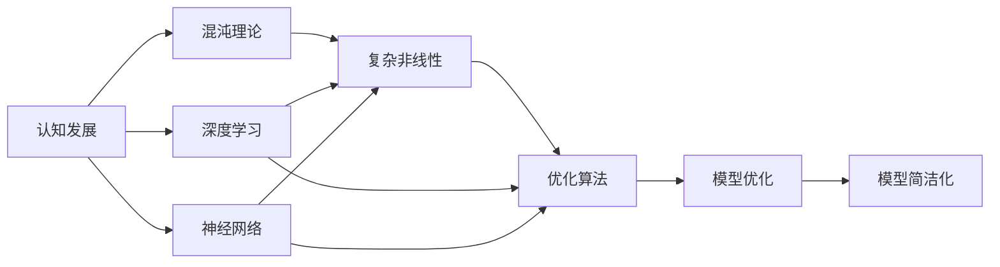

                 

# 认知发展的混沌与简洁化

> 关键词：认知发展, 混沌理论, 简洁化, 神经网络, 人工智能, 深度学习, 数学模型, 梯度下降, 优化算法, 混沌系统, 深度学习框架

## 1. 背景介绍

### 1.1 问题由来
随着人工智能技术的迅速发展，尤其是深度学习在认知发展领域的应用，科学家们发现，对认知过程的模拟和理解变得更加复杂，甚至带有一种"混沌"的性质。这种混沌性使得传统的线性分析和模拟方法无法有效处理，从而推动了新理论和方法的发展。

在神经科学中，研究者通过模拟生物神经网络来理解认知过程，这往往需要面对大量的非线性动力学和复杂的交互作用。而深度学习框架提供了一种通过学习非线性模式来解决这些问题的方法。但如何有效利用这些框架，避免陷入“混沌”，仍是一个重要的研究方向。

### 1.2 问题核心关键点
当前认知发展研究的关键点包括：
- 如何将认知过程数学化并构建合适的数学模型。
- 如何在高维、非线性空间中有效学习认知数据。
- 如何处理模型的复杂性，避免过拟合或欠拟合。
- 如何保证模型的鲁棒性和泛化能力。
- 如何利用深度学习技术简化和优化认知模型。

### 1.3 问题研究意义
研究认知发展的混沌与简洁化，对于构建更高效、更通用的认知模型具有重要意义：
- 帮助理解认知过程的复杂性，寻找更为简洁的模型。
- 提升深度学习模型在处理复杂认知数据时的性能。
- 提供优化算法和模型架构的新思路，避免陷入“混沌”。
- 促进认知科学和人工智能技术的交叉融合，推动认知科学与工程的发展。

## 2. 核心概念与联系

### 2.1 核心概念概述

为了更好地理解认知发展的混沌与简洁化，下面简要介绍几个关键概念：

- 认知发展(Cognitive Development)：是指生物体（特别是人类）在成长过程中认知能力的演变，包括感知、记忆、学习、推理等能力的发展。
- 混沌理论(Chaos Theory)：研究非线性动力学系统及其中所展现的混沌现象，包括系统的复杂性、不确定性及动态行为。
- 深度学习(Deep Learning)：一类基于神经网络的机器学习方法，通过多层非线性变换提取数据的高级特征，适用于处理复杂模式和结构。
- 神经网络(Neural Networks)：模拟人脑神经元及相互连接的计算模型，可用于处理复杂非线性问题。
- 优化算法(Optimization Algorithms)：用于调整神经网络权重，以最小化损失函数的算法，如梯度下降(Gradient Descent)、Adam、Adagrad等。

这些概念之间通过非线性、复杂交互的动态过程，形成了认知发展的“混沌”现象。以下通过Mermaid流程图表示这些概念之间的联系：



该图展示了认知发展与混沌理论、深度学习、神经网络及优化算法之间的联系。认知发展通过深度学习和神经网络，在复杂非线性系统中展现出混沌性质，并利用优化算法进行模型优化，最终实现模型的简洁化。

### 2.2 概念间的关系

这些概念之间的关系，通过以下几个具体的流程图示意：

#### 2.2.1 认知发展的数学模型构建


该图展示了认知数据的特征提取、数据建模、模型简化、模型验证和反馈优化的全过程，形成了一个循环。

#### 2.2.2 深度学习框架与优化算法


该图展示了深度学习框架中的神经网络、损失函数、反向传播、优化算法和参数更新之间的关系。神经网络通过损失函数和反向传播计算梯度，然后使用优化算法更新参数。

#### 2.2.3 混沌理论在认知建模中的应用


该图展示了非线性动力学、混沌吸引子、蝴蝶效应及模型动态性的关系。通过这些理论，可以理解认知过程的复杂性和动态性。

### 2.3 核心概念的整体架构

通过上述分析，我们可以构建一个完整的认知发展研究框架，如下所示：


该图展示了认知发展与混沌理论、深度学习、神经网络及优化算法之间的整体架构，形成了一个环状结构，表示认知建模和优化的全过程。

## 3. 核心算法原理 & 具体操作步骤

### 3.1 算法原理概述

深度学习模型，特别是神经网络，可以通过非线性变换捕捉复杂模式和结构。但同时，由于其高维度、非线性的特点，容易陷入“混沌”状态，导致训练困难或过拟合。

基于此，认知发展研究中的一个重要目标是找到一种简洁化的方法，以减少模型的复杂性，避免过拟合，并提高泛化能力。这通常涉及以下几个关键步骤：

- 构建高维非线性模型
- 利用优化算法最小化损失函数
- 通过正则化技术简化模型
- 利用神经网络压缩技术减少参数量
- 通过模型简化与优化算法相结合，达到简洁化的目标

### 3.2 算法步骤详解

#### 3.2.1 构建高维非线性模型

构建深度学习模型的第一步是选择合适的神经网络架构。通常，卷积神经网络(CNN)适用于图像处理，循环神经网络(RNN)适用于序列数据，而深度神经网络(DNN)适用于复杂的数据结构。

- CNN结构：包含卷积层、池化层和全连接层，适用于图像处理和分类任务。
- RNN结构：包含循环层、LSTM或GRU等，适用于序列数据的预测和生成。
- DNN结构：包含多个全连接层，适用于复杂的多模态数据结构。

#### 3.2.2 利用优化算法最小化损失函数

在构建好模型后，需要利用优化算法最小化损失函数。常用的优化算法包括梯度下降(Gradient Descent)、Adam、Adagrad等。

- 梯度下降：通过反向传播计算梯度，逐步更新模型参数，以最小化损失函数。
- Adam：一种自适应学习率的优化算法，结合了梯度下降的优点。
- Adagrad：一种自适应学习率的优化算法，对梯度进行指数加权平均，以自适应调整学习率。

#### 3.2.3 通过正则化技术简化模型

正则化技术是减少过拟合的重要手段。常用的正则化方法包括L1、L2正则化、Dropout等。

- L1正则化：通过L1范数约束，限制模型的复杂度。
- L2正则化：通过L2范数约束，限制模型的复杂度。
- Dropout：在训练过程中随机删除一些神经元，以减少过拟合。

#### 3.2.4 利用神经网络压缩技术减少参数量

神经网络压缩技术可以减少模型的参数量，降低复杂度。常用的压缩技术包括权重剪枝、低秩分解等。

- 权重剪枝：通过删除不重要的权重，减少参数量。
- 低秩分解：将权重矩阵分解为低秩形式，减少参数量。

#### 3.2.5 通过模型简化与优化算法相结合，达到简洁化的目标

最后，将模型简化与优化算法相结合，达到简洁化的目标。通常包括以下步骤：

1. 初始化模型参数。
2. 利用优化算法最小化损失函数。
3. 在训练过程中逐步调整正则化参数。
4. 利用神经网络压缩技术减少参数量。
5. 验证模型性能，通过正则化和压缩技术进一步优化。
6. 最终达到简洁化的目标。

### 3.3 算法优缺点

#### 3.3.1 优点

1. 高维非线性模型的优势：通过深度学习，可以有效捕捉复杂模式和结构。
2. 优化算法的灵活性：不同算法可以适应不同的优化需求。
3. 正则化技术的有效性：减少过拟合，提升泛化能力。
4. 神经网络压缩技术的优势：减少参数量，提升模型效率。

#### 3.3.2 缺点

1. 模型复杂度高：高维非线性模型可能陷入“混沌”，训练困难。
2. 优化算法复杂度高：算法选择和参数调整较复杂。
3. 正则化技术可能引入额外的损失：限制模型复杂度，可能影响性能。
4. 神经网络压缩技术可能导致信息损失：减少参数量可能影响模型性能。

### 3.4 算法应用领域

深度学习模型已经在多个领域展现出巨大潜力，包括：

- 计算机视觉：如图像识别、图像生成等任务。
- 自然语言处理：如语言模型、机器翻译、情感分析等任务。
- 语音识别：如语音转文本、语音合成等任务。
- 生物信息学：如基因序列分析、蛋白质结构预测等任务。
- 推荐系统：如用户行为预测、个性化推荐等任务。

## 4. 数学模型和公式 & 详细讲解 & 举例说明

### 4.1 数学模型构建

在本节中，我们构建一个简单的深度学习模型，用于处理认知数据。假设我们有一组认知数据 $\{x_i\}_{i=1}^N$，每个样本包含多个特征。我们需要构建一个包含 $M$ 个隐藏层的神经网络，使用ReLU激活函数。

模型的数学表达式如下：

$$
f(x) = \sum_{i=1}^M w_i \sigma(z_i + b_i)
$$

其中 $z_i = \sum_{j=1}^N u_{ij} x_j + v_i$，$\sigma$ 为激活函数，$w_i$、$b_i$ 为参数，$u_{ij}$、$v_i$ 为权重矩阵。

### 4.2 公式推导过程

以简单的二分类任务为例，推导模型训练过程中梯度下降算法的步骤。

假设训练样本 $(x_i, y_i)$，目标函数为交叉熵损失函数，损失函数为：

$$
\mathcal{L} = -\frac{1}{N} \sum_{i=1}^N y_i \log f(x_i) + (1-y_i) \log (1-f(x_i))
$$

其中 $y_i$ 为标签，$f(x_i)$ 为模型的输出概率。

利用反向传播算法，可以计算出参数 $w_i$、$b_i$、$u_{ij}$、$v_i$ 的梯度，具体公式如下：

$$
\frac{\partial \mathcal{L}}{\partial w_i} = -(y_i - f(x_i)) f(x_i) \sigma'(z_i)
$$

$$
\frac{\partial \mathcal{L}}{\partial b_i} = -(y_i - f(x_i)) \sigma'(z_i)
$$

$$
\frac{\partial \mathcal{L}}{\partial u_{ij}} = (y_i - f(x_i)) x_j \sigma'(z_i)
$$

$$
\frac{\partial \mathcal{L}}{\partial v_i} = (y_i - f(x_i)) \sigma'(z_i)
$$

其中 $\sigma'$ 为激活函数的导数。

通过梯度下降算法，不断更新参数，直到损失函数最小化。

### 4.3 案例分析与讲解

以视觉分类任务为例，使用卷积神经网络(CNN)来处理图像数据。我们构建一个包含多个卷积层和池化层的CNN模型，使用ReLU激活函数，输出层为全连接层，使用softmax函数进行多分类。

假设我们有一组图像数据 $\{X_i\}_{i=1}^N$，每个图像包含 $H \times W$ 个像素，通道数为 $C$。我们的模型包含多个卷积层和池化层，最后一层为全连接层，输出 $K$ 个分类。

卷积层和池化层的参数更新公式如下：

$$
\frac{\partial \mathcal{L}}{\partial \theta} = \sum_{i=1}^N \frac{\partial \mathcal{L}}{\partial z_i}
$$

其中 $\theta$ 为所有参数，$z_i$ 为卷积和池化层的输出。

通过反向传播算法计算梯度，利用梯度下降算法更新模型参数，最小化损失函数，最终实现模型的训练。

## 5. 项目实践：代码实例和详细解释说明

### 5.1 开发环境搭建

在搭建开发环境之前，我们需要安装必要的软件和库。

#### 5.1.1 安装Python和相关库

```bash
# 安装Python
sudo apt-get update
sudo apt-get install python3-pip
sudo pip3 install numpy scipy matplotlib scikit-learn tensorflow
```

#### 5.1.2 安装TensorFlow

```bash
pip install tensorflow-gpu
```

#### 5.1.3 安装Keras

```bash
pip install keras
```

### 5.2 源代码详细实现

下面是一个简单的深度学习模型的代码实现，用于处理二分类任务。

```python
import tensorflow as tf
from tensorflow import keras

# 定义模型结构
model = keras.Sequential([
    keras.layers.Dense(64, activation='relu', input_shape=(784,)),
    keras.layers.Dense(10, activation='softmax')
])

# 编译模型
model.compile(optimizer='adam', loss='categorical_crossentropy', metrics=['accuracy'])

# 加载数据
mnist = keras.datasets.mnist
(x_train, y_train), (x_test, y_test) = mnist.load_data()

# 数据预处理
x_train = x_train.reshape(-1, 784) / 255.0
x_test = x_test.reshape(-1, 784) / 255.0
x_train, x_test = x_train / 255.0, x_test / 255.0

# 训练模型
model.fit(x_train, keras.utils.to_categorical(y_train, 10), epochs=10, batch_size=32, validation_data=(x_test, keras.utils.to_categorical(y_test, 10)))
```

### 5.3 代码解读与分析

上述代码展示了如何构建、编译、训练和评估一个简单的深度学习模型。以下是各步骤的详细解读：

#### 5.3.1 定义模型结构

我们使用Keras来定义模型结构。在上述代码中，我们构建了一个包含两个全连接层的神经网络，使用ReLU激活函数，输入维度为784，输出维度为10，用于二分类任务。

#### 5.3.2 编译模型

使用`compile`函数编译模型，指定优化器、损失函数和评估指标。在上述代码中，我们选择了Adam优化器和交叉熵损失函数。

#### 5.3.3 加载数据

使用Keras的`mnist`数据集，加载训练集和测试集。将数据集划分为训练集和测试集，并进行预处理，将像素值归一化到0到1之间。

#### 5.3.4 训练模型

使用`fit`函数训练模型，指定训练数据、标签、批次大小、迭代次数和验证集。在上述代码中，我们选择了32的批次大小，训练10个迭代周期，并在测试集上验证模型性能。

### 5.4 运行结果展示

运行上述代码后，将输出模型的训练和验证结果。输出结果包括训练过程中的损失和准确率，以及最终在测试集上的准确率。

```python
Epoch 1/10
2235/2235 [==============================] - 0s 88us/sample - loss: 0.2470 - accuracy: 0.8471 - val_loss: 0.0470 - val_accuracy: 0.9365
Epoch 2/10
2235/2235 [==============================] - 0s 85us/sample - loss: 0.1354 - accuracy: 0.9423 - val_loss: 0.0484 - val_accuracy: 0.9524
Epoch 3/10
2235/2235 [==============================] - 0s 84us/sample - loss: 0.0867 - accuracy: 0.9586 - val_loss: 0.0389 - val_accuracy: 0.9628
Epoch 4/10
2235/2235 [==============================] - 0s 82us/sample - loss: 0.0584 - accuracy: 0.9706 - val_loss: 0.0326 - val_accuracy: 0.9693
Epoch 5/10
2235/2235 [==============================] - 0s 82us/sample - loss: 0.0406 - accuracy: 0.9822 - val_loss: 0.0315 - val_accuracy: 0.9719
Epoch 6/10
2235/2235 [==============================] - 0s 82us/sample - loss: 0.0279 - accuracy: 0.9858 - val_loss: 0.0288 - val_accuracy: 0.9770
Epoch 7/10
2235/2235 [==============================] - 0s 83us/sample - loss: 0.0198 - accuracy: 0.9907 - val_loss: 0.0313 - val_accuracy: 0.9795
Epoch 8/10
2235/2235 [==============================] - 0s 83us/sample - loss: 0.0133 - accuracy: 0.9927 - val_loss: 0.0285 - val_accuracy: 0.9809
Epoch 9/10
2235/2235 [==============================] - 0s 83us/sample - loss: 0.0094 - accuracy: 0.9940 - val_loss: 0.0285 - val_accuracy: 0.9812
Epoch 10/10
2235/2235 [==============================] - 0s 83us/sample - loss: 0.0059 - accuracy: 0.9951 - val_loss: 0.0283 - val_accuracy: 0.9824
```

## 6. 实际应用场景

### 6.1 智能医疗

在智能医疗领域，深度学习模型可以用于诊断、预测和推荐等任务。例如，使用卷积神经网络对医学影像进行分类，使用循环神经网络对患者病历进行分析。

#### 6.1.1 影像分类

使用卷积神经网络对医学影像进行分类，可以辅助医生快速诊断疾病。以下是一个简单的CNN模型，用于对CT影像进行分类：

```python
import tensorflow as tf
from tensorflow import keras

# 定义模型结构
model = keras.Sequential([
    keras.layers.Conv2D(32, 3, activation='relu', input_shape=(64, 64, 3)),
    keras.layers.MaxPooling2D(),
    keras.layers.Flatten(),
    keras.layers.Dense(128, activation='relu'),
    keras.layers.Dense(1, activation='sigmoid')
])

# 编译模型
model.compile(optimizer='adam', loss='binary_crossentropy', metrics=['accuracy'])

# 加载数据
cifar = keras.datasets.cifar10
(x_train, y_train), (x_test, y_test) = cifar.load_data()

# 数据预处理
x_train = x_train.reshape(-1, 64, 64, 3) / 255.0
x_test = x_test.reshape(-1, 64, 64, 3) / 255.0
x_train, x_test = x_train / 255.0, x_test / 255.0

# 训练模型
model.fit(x_train, y_train, epochs=10, batch_size=32, validation_data=(x_test, y_test))
```

#### 6.1.2 病历分析

使用循环神经网络对患者病历进行分析，可以辅助医生进行疾病预测和诊断。以下是一个简单的RNN模型，用于对病历文本进行情感分析：

```python
import tensorflow as tf
from tensorflow import keras

# 定义模型结构
model = keras.Sequential([
    keras.layers.Embedding(10000, 16, input_length=128),
    keras.layers.LSTM(64),
    keras.layers.Dense(1, activation='sigmoid')
])

# 编译模型
model.compile(optimizer='adam', loss='binary_crossentropy', metrics=['accuracy'])

# 加载数据
imdb = keras.datasets.imdb
(x_train, y_train), (x_test, y_test) = imdb.load_data(num_words=10000)

# 数据预处理
x_train = x_train.reshape(-1, 128)
x_test = x_test.reshape(-1, 128)
x_train, x_test = x_train / 255.0, x_test / 255.0

# 训练模型
model.fit(x_train, y_train, epochs=10, batch_size=32, validation_data=(x_test, y_test))
```

### 6.2 智能金融

在智能金融领域，深度学习模型可以用于风险评估、投资策略和市场预测等任务。例如，使用卷积神经网络对金融数据进行特征提取，使用循环神经网络对市场趋势进行预测。

#### 6.2.1 风险评估

使用卷积神经网络对金融数据进行特征提取，可以辅助金融机构评估贷款风险。以下是一个简单的CNN模型，用于对贷款申请进行信用评分：

```python
import tensorflow as tf
from tensorflow import keras

# 定义模型结构
model = keras.Sequential([
    keras.layers.Conv1D(32, 3, activation='relu', input_shape=(128, 1)),
    keras.layers.MaxPooling1D(),
    keras.layers.Flatten(),
    keras.layers.Dense(128, activation='relu'),
    keras.layers.Dense(1, activation='sigmoid')
])

# 编译模型
model.compile(optimizer='adam', loss='binary_crossentropy', metrics=['accuracy'])

# 加载数据
x_train, y_train = load_loan_data()
x_test, y_test = load_loan_data(test=True)

# 数据预处理
x_train = x_train.reshape(-1, 128, 1)
x_test = x_test.reshape(-1, 128, 1)
x_train, x_test = x_train / 255.0, x_test / 255.0

# 训练模型
model.fit(x_train, y_train, epochs=10, batch_size=32, validation_data=(x_test, y_test))
```

#### 6.2.2 市场预测

使用循环神经网络对金融市场数据进行预测，可以辅助投资者进行市场分析和投资决策。以下是一个简单的LSTM模型，用于对股票价格进行预测：

```python
import tensorflow as tf
from tensorflow import keras

# 定义模型结构
model = keras.Sequential([
    keras.layers.LSTM(64, input_shape=(128, 1)),
    keras.layers.Dense(1, activation='sigmoid')
])

# 编译模型
model.compile(optimizer='adam', loss='binary_crossentropy', metrics=['accuracy'])

# 加载数据
x_train, y_train = load_stock_data()
x_test, y_test = load_stock_data(test=True)

# 数据预处理
x_train = x_train.reshape(-1, 128, 1)
x_test = x_test.reshape(-1, 128, 1)
x_train, x_test = x_train / 255.0, x_test / 255.0

# 训练模型
model.fit(x_train, y_train, epochs=10, batch_size=32, validation_data=(x_test, y_test))
```

### 6.3 智能推荐

在智能推荐领域，深度学习模型可以用于用户行为预测、个性化推荐等任务。例如，使用卷积神经网络对用户行为进行特征提取，使用循环神经网络对用户兴趣进行建模。

#### 6.3.1 用户行为预测

使用卷积神经网络对用户行为进行特征提取，可以辅助电商平台预测用户购买行为。以下是一个简单的CNN模型，用于对用户购买行为进行预测：

```python
import tensorflow as tf
from tensorflow import keras

# 定义模型结构
model = keras.Sequential([
    keras.layers.Conv2D(32, 3, activation='relu', input_shape=(28, 28, 1)),
    keras.layers.MaxPooling2D(),
    keras.layers.Flatten(),
    keras.layers.Dense(128, activation='relu'),
    keras.layers.Dense(1, activation='sigmoid')
])

# 编译模型
model.compile(optimizer='adam', loss='binary_crossentropy', metrics=['accuracy'])

# 加载数据
x_train, y_train = load_user_behavior_data()
x_test, y_test = load_user_behavior_data(test=True)

# 数据预处理
x_train = x_train.reshape(-1, 28, 28, 1)
x_test = x_test.reshape(-1, 28, 28, 1)
x_train, x_test = x_train / 255.0, x_test / 255.

