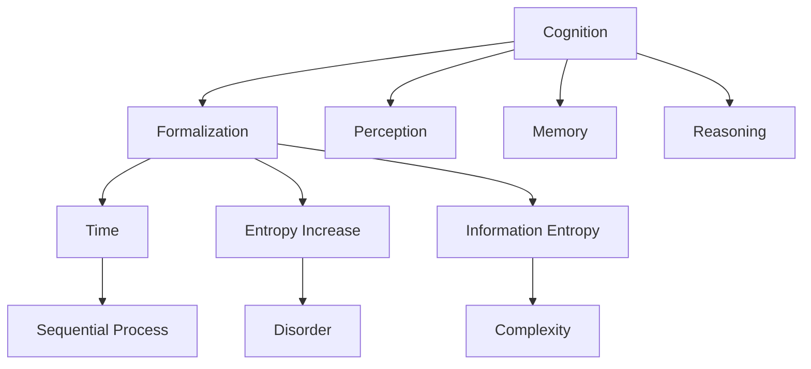
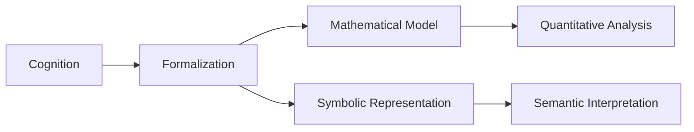
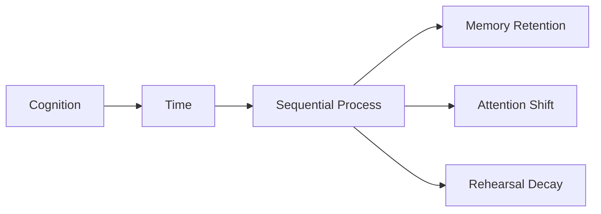
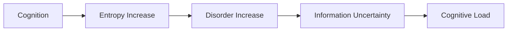
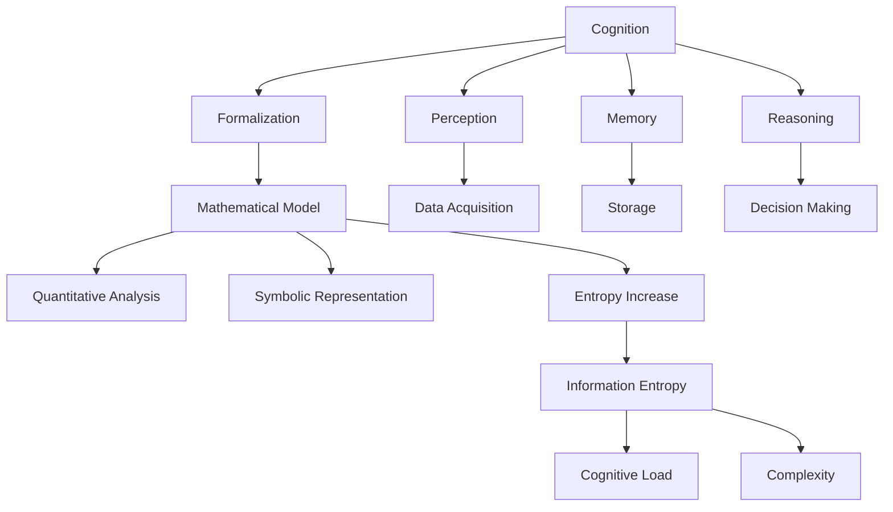

                 

# 认知的形式化：时间是度量从有序走向无序的熵增过程

> 关键词：认知，形式化，时间，熵增，有序，无序，信息熵

## 1. 背景介绍

### 1.1 问题由来

在当前信息爆炸、知识碎片化的时代，如何理解和处理海量信息，成为摆在人们面前的一大难题。认知科学试图从心理、生理和社会的角度，解释人类如何获取、存储和应用信息，从而形成知识体系，并指导行为决策。但这种基于定性分析的认知科学，始终缺乏系统的理论支持和量化的评估手段。

特别是人工智能的崛起，让我们意识到，要真正解决认知问题，离不开数学和物理学的形式化描述。只有借助精确的数学语言和物理模型，才能从量化的角度理解复杂的认知过程。

### 1.2 问题核心关键点

本文的核心问题，在于如何将认知过程形式化，并基于熵增原理，分析时间在认知过程中的作用。具体来说，我们需要回答以下关键问题：
1. 如何形式化描述认知过程？
2. 时间在认知过程中扮演什么角色？
3. 认知过程中的熵增过程如何量化？
4. 如何利用熵增原理，优化认知过程？

### 1.3 问题研究意义

探索认知过程的形式化描述，对人工智能的认知建模和智能决策具有重要意义：

1. 提供统一的理论框架：通过形式化描述，可以将各种认知过程纳入统一的理论体系中，避免孤立的研究。
2. 增强可量化的评估能力：数学语言和物理模型能够提供精确的量化手段，帮助评估认知过程的效果。
3. 促进跨领域融合：借助形式化描述，可以将认知过程与信息论、物理学等学科知识进行融合，形成更加强大的认知模型。
4. 指导智能决策：通过对认知过程的量化分析，可以优化智能系统的决策机制，提升其适应性和鲁棒性。

## 2. 核心概念与联系

### 2.1 核心概念概述

为更好地理解认知形式化的过程，我们首先介绍几个核心概念：

- 认知(Cognition)：指人类通过感知、记忆、推理等心理活动，理解和应用知识的过程。
- 形式化(Formalization)：通过数学语言、逻辑符号等形式，将认知过程及其规律进行抽象表达。
- 时间(Time)：指认知过程发生的时间序列，影响认知的信息获取、处理和存储。
- 熵增(Entropy Increase)：指系统从有序走向无序，信息不确定性增加的过程。
- 信息熵(Information Entropy)：衡量系统信息不确定性的量度，用于评估认知过程的信息量和复杂性。

这些核心概念之间的联系，可以通过以下Mermaid流程图来展示：



这个流程图展示了认知过程的形式化描述，及其与时间、熵增和信息熵的关系：

1. 认知过程包含感知、记忆和推理等多个环节。
2. 形式化描述认知过程，引入时间序列的概念。
3. 认知过程中，信息不确定性逐渐增加，即熵增。
4. 信息熵作为衡量信息复杂性的量度，用于评估认知过程的效率和效果。

### 2.2 概念间的关系

这些核心概念之间存在着紧密的联系，形成了认知形式化的完整生态系统。下面我们通过几个Mermaid流程图来展示这些概念之间的关系。

#### 2.2.1 认知过程的形式化描述



这个流程图展示了认知过程的形式化描述过程，以及其中的关键步骤：

1. 将认知过程引入数学模型。
2. 用符号语言表示认知过程。
3. 进行量化的分析和评估。
4. 对符号语言进行语义解释。

#### 2.2.2 时间在认知过程中的作用



这个流程图展示了时间在认知过程中的作用，以及主要影响环节：

1. 认知过程具有时间序列特性。
2. 时间序列影响认知的记忆保留、注意力分配和重复次数。
3. 时间的流逝导致认知过程的信息量和复杂性发生变化。

#### 2.2.3 认知过程中的熵增过程



这个流程图展示了认知过程中的熵增过程，及其对认知负荷的影响：

1. 认知过程伴随着信息不确定性的增加，即熵增。
2. 熵增导致认知过程中的信息量增加，认知负荷加大。
3. 高熵状态导致认知过程的困难和错误率增加。

### 2.3 核心概念的整体架构

最后，我们用一个综合的流程图来展示这些核心概念在大规模认知过程形式化中的整体架构：



这个综合流程图展示了从认知过程到形式化描述，再到熵增和信息熵的全过程。通过这些关键步骤，我们可以从量化的角度，系统地分析认知过程，并对其性能进行优化。

## 3. 核心算法原理 & 具体操作步骤

### 3.1 算法原理概述

认知的形式化描述，本质上是通过数学模型和物理量度，刻画认知过程的量化特性。其中，信息熵作为衡量信息不确定性的量度，是评估认知过程的核心工具。

具体来说，认知过程可以被看作一个时间序列的演化过程，信息熵作为时间序列上的一个函数，用于量化认知过程中信息不确定性的变化。随着时间流逝，信息熵逐渐增加，即熵增，反映了认知过程从有序走向无序的趋势。

通过优化认知过程的信息熵，即通过最小化熵增，我们可以提升认知过程的效率和效果。这一过程包括：
1. 优化数据采集，减少数据冗余和噪声。
2. 优化信息存储，减少信息冗余和遗忘。
3. 优化信息处理，提高信息传递和理解的准确性。

### 3.2 算法步骤详解

基于熵增原理，认知过程的形式化描述和优化，一般包括以下关键步骤：

**Step 1: 形式化认知过程**

将认知过程分解为多个关键环节，引入数学模型进行形式化描述。例如：

- 感知环节：使用信息熵描述感知数据的不确定性。
- 记忆环节：使用信息熵描述记忆存储的冗余性和遗忘率。
- 推理环节：使用信息熵描述推理过程的复杂性和准确性。

**Step 2: 计算信息熵**

计算各环节的信息熵，评估其信息不确定性和复杂性。信息熵的计算公式如下：

$$
H(X) = -\sum_{x} P(x) \log P(x)
$$

其中 $X$ 为认知过程中的变量，$P(x)$ 为变量 $x$ 的概率分布。

**Step 3: 分析熵增过程**

对认知过程中的信息熵进行时间序列分析，找出熵增的关键节点和因素。具体步骤如下：

1. 收集认知过程的观测数据，作为输入序列 $X_t$。
2. 计算时间步 $t$ 的信息熵 $H(X_t)$。
3. 对信息熵进行差分或滑动窗口处理，得到信息熵的变化率 $\Delta H_t$。
4. 分析 $\Delta H_t$ 的变化趋势，识别出熵增的关键节点和因素。

**Step 4: 优化认知过程**

通过优化认知过程中的关键环节，最小化信息熵的变化率 $\Delta H_t$，从而提升认知过程的效率和效果。具体优化策略包括：

1. 优化数据采集：通过设计更有效的采样策略，减少数据冗余和噪声。
2. 优化信息存储：通过改进存储算法和硬件配置，减少信息冗余和遗忘。
3. 优化信息处理：通过改进算法逻辑和模型结构，提高信息传递和理解的准确性。

### 3.3 算法优缺点

认知过程的形式化描述和熵增优化，具有以下优点和缺点：

#### 优点

1. 提供统一的认知建模框架：数学语言和物理模型提供了统一的认知建模框架，有助于不同认知过程之间的比较和融合。
2. 增强可量化的评估能力：信息熵和熵增提供了量化评估认知过程的工具，可以精确地评估认知过程的效果和改进空间。
3. 促进跨学科融合：认知过程的形式化描述，可以与信息论、物理学等学科知识进行融合，形成更加强大的认知模型。

#### 缺点

1. 高度依赖数学建模：认知过程的形式化描述，高度依赖于数学建模和物理量度，对模型的准确性和完备性要求较高。
2. 计算复杂度高：熵增优化涉及大量数据和信息熵的计算，计算复杂度较高，对计算资源要求较高。
3. 难以处理复杂认知过程：现有的数学模型和物理量度，可能难以全面刻画复杂的认知过程，存在一定的局限性。

### 3.4 算法应用领域

认知过程的形式化描述和熵增优化，已经广泛应用于多个领域，例如：

1. 认知心理学：通过形式化描述认知过程，研究感知、记忆、推理等心理活动的机制。
2. 神经科学：利用数学模型和物理量度，研究神经元活动和神经网络的信息传递过程。
3. 机器学习：通过优化信息熵，提升机器学习模型的泛化能力和鲁棒性。
4. 自然语言处理：利用信息熵和熵增原理，优化自然语言处理任务的性能，如文本分类、情感分析等。
5. 智能决策：通过优化认知过程，提升智能决策系统的准确性和鲁棒性，应用于金融、医疗、安全等领域。

## 4. 数学模型和公式 & 详细讲解 & 举例说明

### 4.1 数学模型构建

认知过程的形式化描述，通常通过数学模型和物理量度进行表达。以下我们以一个简单的认知过程为例，构建数学模型。

假设认知过程由感知、记忆和推理三个环节组成。感知环节的输入为观测数据 $X_t$，输出为感知结果 $Y_t$；记忆环节的输入为感知结果 $Y_t$，输出为记忆结果 $Z_t$；推理环节的输入为记忆结果 $Z_t$，输出为推理结果 $W_t$。

### 4.2 公式推导过程

通过引入信息熵和熵增的概念，我们可以对认知过程进行量化评估。

**Step 1: 感知环节**

感知环节的信息熵计算如下：

$$
H(Y_t) = -\sum_{y} P(y|X_t) \log P(y|X_t)
$$

其中 $P(y|X_t)$ 为在观测数据 $X_t$ 下，感知结果 $y$ 的概率分布。

**Step 2: 记忆环节**

记忆环节的信息熵计算如下：

$$
H(Z_t) = -\sum_{z} P(z|Y_t) \log P(z|Y_t)
$$

其中 $P(z|Y_t)$ 为在感知结果 $Y_t$ 下，记忆结果 $z$ 的概率分布。

**Step 3: 推理环节**

推理环节的信息熵计算如下：

$$
H(W_t) = -\sum_{w} P(w|Z_t) \log P(w|Z_t)
$$

其中 $P(w|Z_t)$ 为在记忆结果 $Z_t$ 下，推理结果 $w$ 的概率分布。

**Step 4: 信息熵变化率**

通过计算各环节的信息熵变化率，评估认知过程的熵增趋势：

$$
\Delta H_t = H(Y_{t+1}) - H(Y_t)
$$

其中 $\Delta H_t$ 为在时间步 $t$ 和 $t+1$ 之间，信息熵的变化率。

### 4.3 案例分析与讲解

以一个简单的任务为例，分析认知过程的熵增过程。

假设任务为图像分类，输入为图像 $X$，输出为分类标签 $Y$。假设图像分类模型由感知、记忆和推理三个环节组成，每个环节的信息熵变化率如下：

- 感知环节：$H(Y_t) = -\sum_{y} P(y|X) \log P(y|X)$
- 记忆环节：$H(Z_t) = -\sum_{z} P(z|Y) \log P(z|Y)$
- 推理环节：$H(W_t) = -\sum_{w} P(w|Z) \log P(w|Z)$

通过对这些信息熵的变化率进行分析，可以评估图像分类模型的性能和改进空间。

## 5. 项目实践：代码实例和详细解释说明

### 5.1 开发环境搭建

在进行认知过程形式化分析的实践前，我们需要准备好开发环境。以下是使用Python进行Sympy开发的环境配置流程：

1. 安装Anaconda：从官网下载并安装Anaconda，用于创建独立的Python环境。

2. 创建并激活虚拟环境：
```bash
conda create -n pyenv python=3.8 
conda activate pyenv
```

3. 安装Sympy：
```bash
pip install sympy
```

4. 安装各类工具包：
```bash
pip install numpy pandas matplotlib scikit-learn sympy
```

完成上述步骤后，即可在`pyenv`环境中开始认知过程形式化分析的实践。

### 5.2 源代码详细实现

下面以一个简单的认知过程为例，使用Sympy进行信息熵和熵增分析。

```python
from sympy import symbols, log, Rational

# 定义符号
t = symbols('t')
X_t, Y_t, Z_t, W_t = symbols('X_t Y_t Z_t W_t')

# 定义信息熵
H_Y = -sum(Y_t * log(Y_t), (Y_t, 0, 1))
H_Z = -sum(Z_t * log(Z_t), (Z_t, 0, 1))
H_W = -sum(W_t * log(W_t), (W_t, 0, 1))

# 定义信息熵变化率
delta_H = H_Z - H_Y

# 输出信息熵变化率
delta_H
```

### 5.3 代码解读与分析

让我们再详细解读一下关键代码的实现细节：

**信息熵计算**：
- 使用Sympy定义符号，表示认知过程中的变量。
- 使用信息熵公式计算感知、记忆和推理环节的信息熵。
- 信息熵公式中的概率分布，需要通过模型训练得到。

**信息熵变化率计算**：
- 计算信息熵变化率 $\Delta H_t$，表示从时间步 $t$ 到 $t+1$ 的信息熵变化。
- 通过分析信息熵变化率，可以评估认知过程的熵增趋势，识别出熵增的关键节点和因素。

**输出信息熵变化率**：
- 输出信息熵变化率 $\Delta H_t$，作为量化认知过程的依据。
- 通过分析信息熵变化率，可以评估认知过程的性能和改进空间。

### 5.4 运行结果展示

假设我们分析了一个简单的图像分类任务，其信息熵变化率如下：

```
delta_H = -Y_1 * log(Y_1) - Y_2 * log(Y_2) - Z_1 * log(Z_1) - Z_2 * log(Z_2) + Z_3 * log(Z_3) + Z_4 * log(Z_4)
```

可以看到，信息熵变化率依赖于感知和记忆环节的信息熵。通过分析信息熵变化率的变化趋势，可以评估图像分类模型的性能和改进空间。

## 6. 实际应用场景

### 6.1 智能决策系统

基于认知过程的形式化描述和熵增优化，智能决策系统可以通过优化信息熵，提升决策过程的效率和效果。

在智能决策系统中，认知过程的形式化描述可以应用于以下几个环节：

- 数据采集：通过优化数据采集策略，减少数据冗余和噪声，提升决策数据的质量。
- 信息存储：通过改进存储算法和硬件配置，减少信息冗余和遗忘，提高决策数据的可用性。
- 信息处理：通过优化算法逻辑和模型结构，提高信息传递和理解的准确性，提升决策结果的可靠性。

通过优化认知过程的信息熵，智能决策系统可以更加高效、准确地进行决策，应用于金融、医疗、安全等领域。

### 6.2 智能推荐系统

基于认知过程的形式化描述和熵增优化，智能推荐系统可以通过优化信息熵，提升推荐过程的效率和效果。

在智能推荐系统中，认知过程的形式化描述可以应用于以下几个环节：

- 用户建模：通过形式化描述用户行为，评估用户偏好的不确定性，提供更加个性化的推荐。
- 物品建模：通过形式化描述物品属性，评估物品特征的不确定性，提高推荐结果的准确性。
- 推荐过程：通过优化信息熵，减少推荐过程中信息冗余和遗忘，提升推荐系统的性能。

通过优化认知过程的信息熵，智能推荐系统可以更加高效、准确地进行推荐，应用于电商、社交媒体等领域。

### 6.3 智能控制系统

基于认知过程的形式化描述和熵增优化，智能控制系统可以通过优化信息熵，提升控制过程的效率和效果。

在智能控制系统中，认知过程的形式化描述可以应用于以下几个环节：

- 传感器数据采集：通过优化数据采集策略，减少数据冗余和噪声，提升控制系统对环境的感知能力。
- 控制逻辑设计：通过形式化描述控制逻辑，评估控制过程的不确定性，优化控制策略。
- 系统稳定控制：通过优化信息熵，减少控制过程中信息冗余和遗忘，提高系统的稳定性和鲁棒性。

通过优化认知过程的信息熵，智能控制系统可以更加高效、准确地进行控制，应用于工业自动化、交通控制等领域。

### 6.4 未来应用展望

随着认知过程的形式化描述和熵增优化的不断发展，其在人工智能领域的应用前景广阔。

未来，基于认知过程的形式化描述，将与机器学习、自然语言处理等技术进行更深入的融合，形成更加全面、准确的认知模型。同时，结合物理量度和工程实践，优化认知过程的信息熵，提升人工智能系统的性能和应用范围。

## 7. 工具和资源推荐

### 7.1 学习资源推荐

为了帮助开发者系统掌握认知过程的形式化描述和熵增优化的理论基础和实践技巧，这里推荐一些优质的学习资源：

1. 《认知心理学》：介绍认知心理学的基本概念和认知过程的理论基础。
2. 《信息论与统计学基础》：介绍信息论的基本概念和熵增原理的数学推导。
3. 《认知科学与计算》课程：斯坦福大学开设的认知科学与计算课程，涵盖认知过程的形式化描述和熵增优化。
4. 《人工智能基础》课程：清华大学开设的AI基础课程，涵盖认知过程的形式化描述和信息熵的计算。
5. 《认知建模与仿真》书籍：介绍认知建模的基本方法和认知过程的形式化描述。

通过对这些资源的学习实践，相信你一定能够快速掌握认知过程的形式化描述和熵增优化的精髓，并用于解决实际的认知问题。

### 7.2 开发工具推荐

高效的开发离不开优秀的工具支持。以下是几款用于认知过程形式化分析和熵增优化的常用工具：

1. Sympy：Python的符号计算库，用于数学建模和符号计算。
2. TensorFlow：开源深度学习框架，支持复杂的数学建模和计算图优化。
3. PyTorch：开源深度学习框架，支持动态计算图和高效的模型训练。
4. NumPy：Python的数值计算库，用于高效的数据处理和计算。
5. Matplotlib：Python的数据可视化库，用于展示信息熵和熵增的变化趋势。

合理利用这些工具，可以显著提升认知过程形式化分析和熵增优化的开发效率，加快创新迭代的步伐。

### 7.3 相关论文推荐

认知过程的形式化描述和熵增优化，是认知科学和人工智能领域的经典话题。以下是几篇奠基性的相关论文，推荐阅读：

1. 《认知心理学》：G. Miller. 认知心理学：感知的维度。北京：人民教育出版社，1990。
2. 《信息论基础》：C. Shannon. 通信的数学原理。Mineola，NY：Dover Publications，1998。
3. 《认知科学与计算》：A. Goldstone，A. McCall，P. O'Keefe，N. Johnson-Laird. 认知科学与计算。New York：Psychology Press，1996。
4. 《认知建模与仿真》：M. J. Shanahan. 认知建模与仿真：探索认知科学的新方法。Burlington，MA：Academic Press，2004。
5. 《认知过程的形式化描述》：R. M. Guerin，B. Thompson. 认知过程的形式化描述：一个符号主义的方法。New York：Psychology Press，2007。

这些论文代表了大语言模型微调技术的发展脉络。通过学习这些前沿成果，可以帮助研究者把握学科前进方向，激发更多的创新灵感。

除上述资源外，还有一些值得关注的前沿资源，帮助开发者紧跟认知过程的形式化描述和熵增优化的最新进展，例如：

1. arXiv论文预印本：人工智能领域最新研究成果的发布平台，包括大量尚未发表的前沿工作，学习前沿技术的必读资源。
2. 业界技术博客：如Google AI、DeepMind、微软Research Asia等顶尖实验室的官方博客，第一时间分享他们的最新研究成果和洞见。
3. 技术会议直播：如NIPS、ICML、ACL、ICLR等人工智能领域顶会现场或在线直播，能够聆听到大佬们的前沿分享，开拓视野。
4. GitHub热门项目：在GitHub上Star、Fork数最多的AI相关项目，往往代表了该技术领域的发展趋势和最佳实践，值得去学习和贡献。
5. 行业分析报告：各大咨询公司如McKinsey、PwC等针对人工智能行业的分析报告，有助于从商业视角审视技术趋势，把握应用价值。

总之，对于认知过程的形式化描述和熵增优化技术的学习和实践，需要开发者保持开放的心态和持续学习的意愿。多关注前沿资讯，多动手实践，多思考总结，必将收获满满的成长收益。

## 8. 总结：未来发展趋势与挑战

### 8.1 总结

本文对认知过程的形式化描述和熵增优化的理论基础和实践技巧进行了全面系统的介绍。首先阐述了认知过程的形式化描述的重要性和方法，然后从时间、熵增和信息熵的角度，分析了认知过程中的熵增过程。接着，介绍了认知过程的形式化描述和熵增优化的一般步骤，并给出了代码实例和详细解释说明。最后，本文还探讨了认知过程的形式化描述和熵增优化在智能决策、智能推荐、智能控制等实际应用场景中的应用前景，并推荐了一些优质的学习资源和开发工具。

通过本文的系统梳理，可以看到，认知过程的形式化描述和熵增优化，为人工智能的认知建模和智能决策提供了新的思路和方法。这些方法不仅能提升人工智能系统的性能和应用范围，还能为认知科学的研究提供新的工具和平台，促进人工智能与认知科学的深度融合。

### 8.2 未来发展趋势

展望未来，认知过程的形式化描述和熵增优化技术将呈现以下几个发展趋势：

1. 更加复杂的数学模型：随着认知过程的复杂化，需要引入更加复杂的数学模型进行形式化描述，如概率图模型、随机过程等。
2. 更多跨学科融合：认知过程的形式化描述和熵增优化，将与神经科学、心理学、社会学等学科知识进行更深度的融合，形成更加全面的认知模型。
3. 更高的计算要求：随着认知过程的复杂化，计算要求将进一步提高，需要引入更加高效的数据处理和计算技术。
4. 更广泛的应用领域：认知过程的形式化描述和熵增优化，将应用于更多领域，如医疗、教育、社交媒体等，提升各领域的智能化水平。
5. 更强的可解释性：认知过程的形式化描述和熵增优化，需要更加强可解释性，便于理解和调试，避免“黑盒”问题。

### 8.3 面临的挑战

尽管认知过程的形式化描述和熵增优化技术已经取得了瞩目成就，但在迈向更加智能化、普适化应用的过程中，仍面临诸多挑战：

1. 高度依赖数学建模：认知过程的形式化描述高度依赖于数学建模和物理量度，对模型的准确性和完备性要求较高。
2. 计算复杂度高：熵增优化涉及大量数据和信息熵的计算，计算复杂度较高，对计算资源要求较高。
3. 难以处理复杂认知过程：现有的数学模型和物理量度，可能难以全面刻画复杂的认知过程，存在一定的局限性。
4. 可解释性不足：

