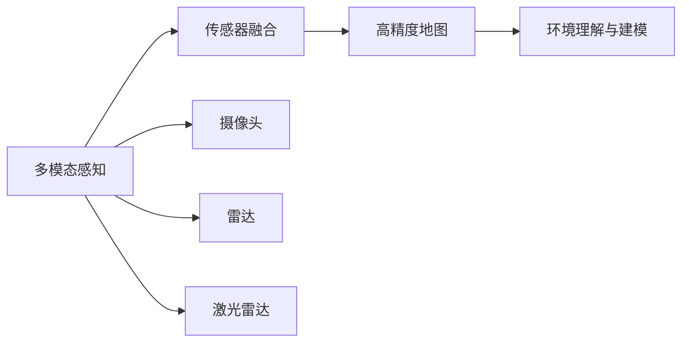
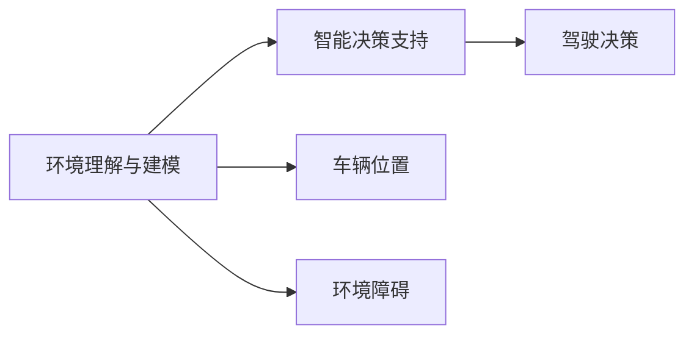

                 

# 多模态AI在自动驾驶中的应用与挑战

> 关键词：自动驾驶,多模态感知,传感器融合,目标检测,环境理解,AI伦理,智能决策,实时性

## 1. 背景介绍

### 1.1 问题由来
自动驾驶技术近年来得到了快速发展，但其核心依然依赖于AI的智能感知与决策能力。在自动驾驶系统（Autonomous Driving Systems, ADS）中，多模态AI技术正成为关键的感知和决策支持手段。多模态AI技术能够整合视觉、雷达、激光雷达、GPS等多种传感器的信息，提供更全面、精准的环境理解，并辅助系统做出智能决策。

当前，自动驾驶行业正处于从初级阶段的辅助驾驶（AD-AS, Advanced Driver Assistance Systems）向全自动驾驶（Full Automation Driving）的演进过程中。随着自动驾驶标准的逐步成熟和应用场景的不断拓展，多模态AI在自动驾驶中的重要性愈发凸显。

### 1.2 问题核心关键点
多模态AI在自动驾驶中的应用主要体现在两个方面：

1. **多模态感知**：通过整合视觉、雷达、激光雷达、GPS等多种传感器数据，生成环境的三维高精度地图，用于实时环境理解。

2. **智能决策支持**：将多模态感知结果与交通法规、路线规划、避障策略等决策要素结合起来，进行智能驾驶决策。

### 1.3 问题研究意义
多模态AI在自动驾驶中的应用，不仅能够提升驾驶安全性，还能在交通拥堵、环境复杂等场景下，显著改善用户体验。另外，多模态AI的应用还能推动智能交通系统的进一步发展，为未来智慧城市的建设提供有力支持。

## 2. 核心概念与联系

### 2.1 核心概念概述

为更好地理解多模态AI在自动驾驶中的应用与挑战，本节将介绍几个密切相关的核心概念：

- **自动驾驶（ADS）**：利用传感器和AI技术，实现车辆自主导航、决策与控制的技术。
- **多模态感知**：整合多种传感器（如摄像头、雷达、激光雷达等）数据，形成环境的全方位理解。
- **传感器融合**：通过算法将不同传感器数据进行优化组合，以获得更高质量的环境感知信息。
- **目标检测与跟踪**：识别并跟踪道路上的车辆、行人、交通标志等关键物体。
- **环境理解与建模**：基于多模态感知结果，生成车辆所处环境的精确地图和模型，辅助决策。
- **智能决策支持**：结合环境理解与交通规则，做出符合当前情况的驾驶决策。
- **实时性**：自动驾驶系统必须在毫秒级的时间内完成感知、决策与控制，保障系统稳定性。

这些概念通过以下Mermaid流程图来展示它们之间的联系：

```mermaid
graph LR
    A[多模态感知] --> B[传感器融合]
    B --> C[目标检测与跟踪]
    C --> D[环境理解与建模]
    D --> E[智能决策支持]
    E --> F[实时性]
    F --> G[自动驾驶系统(ADS)]
```

这个流程图展示了多模态AI在自动驾驶中的应用过程：

1. 通过多模态感知技术，获取车辆周围环境的详细信息。
2. 利用传感器融合技术，对不同传感器数据进行整合优化，生成高质量的环境感知信息。
3. 目标检测与跟踪技术用于识别并跟踪道路上的关键物体。
4. 环境理解与建模技术，生成车辆所处环境的精确地图和模型。
5. 智能决策支持系统，结合环境理解与交通规则，做出符合当前情况的驾驶决策。
6. 实时性技术，保障系统在毫秒级时间内完成感知、决策与控制。

### 2.2 概念间的关系

这些核心概念之间存在着紧密的联系，形成了一个完整的自动驾驶系统框架。

#### 2.2.1 多模态感知与传感器融合



这个流程图展示了多模态感知与传感器融合的关系：

1. 通过摄像头、雷达、激光雷达等多种传感器，获取车辆周围环境的原始数据。
2. 传感器融合技术将这些原始数据进行整合，生成更高质量的环境感知信息。
3. 高精度地图进一步提升环境理解的准确性。

#### 2.2.2 环境理解与智能决策



这个流程图展示了环境理解与智能决策的关系：

1. 环境理解与建模技术生成车辆周围环境的精确地图和模型。
2. 智能决策支持系统结合环境理解与交通规则，做出符合当前情况的驾驶决策。

### 2.3 核心概念的整体架构

最后，我们用一个综合的流程图来展示这些核心概念在大规模AI自动驾驶系统中的应用：

```mermaid
graph TB
    A[摄像头] --> B[雷达] --> C[激光雷达] --> D[GPS]
    A --> E[传感器融合]
    B --> E
    C --> E
    D --> E
    E --> F[目标检测与跟踪]
    F --> G[环境理解与建模]
    G --> H[智能决策支持]
    H --> I[实时性]
    I --> J[自动驾驶系统(ADS)]
```

这个综合流程图展示了多模态AI在大规模AI自动驾驶系统中的应用过程：

1. 摄像头、雷达、激光雷达和GPS等传感器，获取车辆周围环境的原始数据。
2. 传感器融合技术将这些原始数据进行整合，生成更高质量的环境感知信息。
3. 目标检测与跟踪技术用于识别并跟踪道路上的关键物体。
4. 环境理解与建模技术，生成车辆所处环境的精确地图和模型。
5. 智能决策支持系统，结合环境理解与交通规则，做出符合当前情况的驾驶决策。
6. 实时性技术，保障系统在毫秒级时间内完成感知、决策与控制。

## 3. 核心算法原理 & 具体操作步骤
### 3.1 算法原理概述

多模态AI在自动驾驶中的应用主要通过以下几个步骤：

1. **数据采集与预处理**：通过各种传感器采集环境数据，并进行预处理，如去噪、校正等。
2. **传感器融合**：将不同传感器数据进行整合，生成高质量的环境感知信息。
3. **目标检测与跟踪**：使用计算机视觉和机器学习算法，识别并跟踪道路上的关键物体。
4. **环境理解与建模**：利用深度学习模型，对环境进行理解与建模，生成车辆周围环境的精确地图和模型。
5. **智能决策支持**：结合环境理解与交通规则，做出符合当前情况的驾驶决策。

### 3.2 算法步骤详解

以下详细介绍多模态AI在自动驾驶中的应用步骤：

#### 3.2.1 数据采集与预处理

多模态AI应用的首步是通过摄像头、雷达、激光雷达等传感器采集环境数据。

具体步骤包括：

- **摄像头数据采集**：利用摄像头获取车辆前方和两侧的环境图像。
- **雷达数据采集**：利用雷达获取车辆周围物体的距离信息。
- **激光雷达数据采集**：利用激光雷达获取高精度、高分辨率的环境地图。
- **GPS数据采集**：利用GPS获取车辆的位置信息。

数据采集完成后，需要对数据进行预处理，如去噪、校正、归一化等。

#### 3.2.2 传感器融合

传感器融合是自动驾驶中一个重要环节，通过将不同传感器数据进行整合，生成更高质量的环境感知信息。常用的传感器融合方法包括：

- **卡尔曼滤波**：利用线性系统模型和贝叶斯估计理论，对传感器数据进行融合。
- **信息融合**：对不同传感器的信息进行加权平均，得到融合后的环境感知信息。
- **深度学习融合**：利用深度神经网络，对不同传感器的数据进行整合，生成高质量的环境感知信息。

#### 3.2.3 目标检测与跟踪

目标检测与跟踪技术用于识别并跟踪道路上的关键物体，常用的方法包括：

- **YOLO**：一种基于深度神经网络的目标检测算法，能够实时检测和跟踪多种物体。
- **RCNN**：一种基于深度神经网络的物体检测算法，能够检测不同尺度和旋转角度的物体。
- **Faster R-CNN**：一种基于深度神经网络的物体检测算法，能够在不同尺度下检测和跟踪物体。
- **Mask RCNN**：一种基于深度神经网络的物体检测算法，能够同时检测和分割物体。

#### 3.2.4 环境理解与建模

环境理解与建模技术用于生成车辆周围环境的精确地图和模型，常用的方法包括：

- **深度学习模型**：利用深度神经网络对环境进行理解与建模，生成高精度的环境地图和模型。
- **3D重建**：利用计算机视觉和图像处理技术，重建车辆周围的三维环境。
- **SLAM**：一种实时定位与建图算法，能够实时生成高精度的环境地图和模型。

#### 3.2.5 智能决策支持

智能决策支持系统，结合环境理解与交通规则，做出符合当前情况的驾驶决策。常用的方法包括：

- **决策树**：一种基于规则的决策方法，能够根据环境和交通规则，做出简单的驾驶决策。
- **强化学习**：利用强化学习算法，训练模型在复杂环境下的驾驶决策能力。
- **深度学习**：利用深度神经网络，训练模型在复杂环境下的驾驶决策能力。

### 3.3 算法优缺点

#### 3.3.1 优点

多模态AI在自动驾驶中的应用，具有以下优点：

- **提升感知能力**：通过整合多种传感器数据，提升环境感知能力，准确识别和跟踪道路上的关键物体。
- **增强环境理解**：利用深度学习模型，对环境进行理解和建模，生成高精度的环境地图和模型。
- **提高决策准确性**：结合环境理解与交通规则，做出符合当前情况的驾驶决策，提高决策准确性。

#### 3.3.2 缺点

多模态AI在自动驾驶中的应用，也存在以下缺点：

- **数据采集成本高**：多模态感知需要多种传感器，采集成本较高。
- **算法复杂度高**：多模态AI应用涉及多种算法和技术，算法复杂度较高。
- **实时性要求高**：自动驾驶系统必须在毫秒级时间内完成感知、决策与控制，对算法实时性要求高。

### 3.4 算法应用领域

多模态AI在自动驾驶中的应用，已经覆盖了众多领域，包括：

- **辅助驾驶**：利用多模态感知和智能决策支持，辅助驾驶员进行驾驶操作。
- **全自动驾驶**：利用多模态感知和智能决策支持，实现车辆自主导航、决策与控制。
- **智能交通系统**：利用多模态感知和智能决策支持，提升交通系统的智能化水平。

## 4. 数学模型和公式 & 详细讲解 & 举例说明
### 4.1 数学模型构建

多模态AI在自动驾驶中的应用，涉及多个数学模型和算法。以下是主要数学模型的构建：

#### 4.1.1 卡尔曼滤波模型

卡尔曼滤波是一种常用的传感器融合算法，用于融合不同传感器数据。其数学模型如下：

$$
\begin{aligned}
& \mathbf{x}_t = \mathbf{A} \mathbf{x}_{t-1} + \mathbf{B} \mathbf{u}_t + \mathbf{w}_t \\
& \mathbf{y}_t = \mathbf{C} \mathbf{x}_t + \mathbf{v}_t \\
& \mathbf{x}_t = \mathbf{K}_t \mathbf{y}_t + (1 - \mathbf{K}_t) \mathbf{x}_{t-1}
\end{aligned}
$$

其中，$\mathbf{x}_t$ 为系统状态，$\mathbf{y}_t$ 为系统输出，$\mathbf{A}$ 为状态转移矩阵，$\mathbf{B}$ 为控制矩阵，$\mathbf{C}$ 为输出矩阵，$\mathbf{w}_t$ 和 $\mathbf{v}_t$ 为系统噪声和测量噪声。

#### 4.1.2 目标检测模型

目标检测模型用于识别并跟踪道路上的关键物体，常用的模型包括YOLO和Faster R-CNN。

以YOLO为例，其数学模型如下：

$$
\begin{aligned}
& \mathbf{x} = \mathbf{W} \mathbf{h} + \mathbf{b} \\
& \mathbf{h} = \sigma (\mathbf{A} \mathbf{x} + \mathbf{b})
\end{aligned}
$$

其中，$\mathbf{x}$ 为网络输出，$\mathbf{h}$ 为网络中间层输出，$\mathbf{W}$ 和 $\mathbf{A}$ 为网络参数，$\mathbf{b}$ 为网络偏置。

#### 4.1.3 环境理解模型

环境理解模型用于生成车辆周围环境的精确地图和模型，常用的模型包括深度神经网络和SLAM。

以深度神经网络为例，其数学模型如下：

$$
\begin{aligned}
& \mathbf{x} = \mathbf{W} \mathbf{h} + \mathbf{b} \\
& \mathbf{h} = \sigma (\mathbf{A} \mathbf{x} + \mathbf{b})
\end{aligned}
$$

其中，$\mathbf{x}$ 为网络输出，$\mathbf{h}$ 为网络中间层输出，$\mathbf{W}$ 和 $\mathbf{A}$ 为网络参数，$\mathbf{b}$ 为网络偏置。

### 4.2 公式推导过程

以下对卡尔曼滤波和YOLO模型的公式进行推导：

#### 4.2.1 卡尔曼滤波公式推导

卡尔曼滤波的数学模型如下：

$$
\begin{aligned}
& \mathbf{x}_t = \mathbf{A} \mathbf{x}_{t-1} + \mathbf{B} \mathbf{u}_t + \mathbf{w}_t \\
& \mathbf{y}_t = \mathbf{C} \mathbf{x}_t + \mathbf{v}_t \\
& \mathbf{x}_t = \mathbf{K}_t \mathbf{y}_t + (1 - \mathbf{K}_t) \mathbf{x}_{t-1}
\end{aligned}
$$

其中，$\mathbf{x}_t$ 为系统状态，$\mathbf{y}_t$ 为系统输出，$\mathbf{A}$ 为状态转移矩阵，$\mathbf{B}$ 为控制矩阵，$\mathbf{C}$ 为输出矩阵，$\mathbf{w}_t$ 和 $\mathbf{v}_t$ 为系统噪声和测量噪声。

卡尔曼滤波的公式推导如下：

$$
\begin{aligned}
& \mathbf{P}_{t-1} = \mathbf{A} \mathbf{P}_{t-1} \mathbf{A}^T + \mathbf{Q} \\
& \mathbf{K}_t = \mathbf{P}_{t-1} \mathbf{C}^T (\mathbf{C} \mathbf{P}_{t-1} \mathbf{C}^T + \mathbf{R})^{-1} \\
& \mathbf{P}_t = (1 - \mathbf{K}_t) \mathbf{P}_{t-1} \\
& \mathbf{x}_t = \mathbf{x}_{t-1} + \mathbf{K}_t (\mathbf{y}_t - \mathbf{C} \mathbf{x}_{t-1})
\end{aligned}
$$

其中，$\mathbf{P}_{t-1}$ 为状态协方差矩阵，$\mathbf{Q}$ 为系统噪声协方差矩阵，$\mathbf{K}_t$ 为卡尔曼增益矩阵，$\mathbf{P}_t$ 为更新后的状态协方差矩阵，$\mathbf{x}_t$ 为更新后的状态向量。

#### 4.2.2 YOLO模型公式推导

YOLO模型的数学模型如下：

$$
\begin{aligned}
& \mathbf{x} = \mathbf{W} \mathbf{h} + \mathbf{b} \\
& \mathbf{h} = \sigma (\mathbf{A} \mathbf{x} + \mathbf{b})
\end{aligned}
$$

其中，$\mathbf{x}$ 为网络输出，$\mathbf{h}$ 为网络中间层输出，$\mathbf{W}$ 和 $\mathbf{A}$ 为网络参数，$\mathbf{b}$ 为网络偏置。

YOLO模型的公式推导如下：

$$
\begin{aligned}
& \mathbf{h} = \mathbf{A} \mathbf{x} + \mathbf{b} \\
& \mathbf{x} = \mathbf{W} \mathbf{h} + \mathbf{b}
\end{aligned}
$$

其中，$\mathbf{h}$ 为网络中间层输出，$\mathbf{x}$ 为网络输出，$\mathbf{A}$ 为网络参数，$\mathbf{b}$ 为网络偏置。

### 4.3 案例分析与讲解

以自动驾驶中多模态AI的应用为例，展示其在实际场景中的应用。

#### 4.3.1 传感器融合案例

假设某自动驾驶车辆需要同时使用摄像头和雷达数据进行环境感知。通过传感器融合算法，对摄像头数据和雷达数据进行整合，得到更高质量的环境感知信息。

具体步骤如下：

1. 通过摄像头采集车辆前方的环境图像。
2. 通过雷达采集车辆周围物体的距离信息。
3. 将摄像头数据和雷达数据进行融合，生成高精度环境地图和模型。

#### 4.3.2 目标检测与跟踪案例

假设某自动驾驶车辆需要使用目标检测与跟踪技术，识别并跟踪道路上的车辆和行人。

具体步骤如下：

1. 利用YOLO算法对摄像头数据进行目标检测，识别出道路上的车辆和行人。
2. 利用Faster R-CNN算法对雷达数据进行目标跟踪，跟踪车辆和行人的运动轨迹。
3. 将摄像头和雷达的目标检测与跟踪结果进行融合，生成更全面和准确的目标检测与跟踪结果。

#### 4.3.3 环境理解与建模案例

假设某自动驾驶车辆需要使用环境理解与建模技术，生成车辆周围环境的精确地图和模型。

具体步骤如下：

1. 通过摄像头、雷达、激光雷达等传感器采集车辆周围的环境数据。
2. 利用深度学习模型对环境数据进行理解与建模，生成高精度的环境地图和模型。
3. 将环境地图和模型用于智能决策支持，辅助车辆进行驾驶决策。

## 5. 项目实践：代码实例和详细解释说明
### 5.1 开发环境搭建

在进行多模态AI实践前，我们需要准备好开发环境。以下是使用Python进行PyTorch开发的环境配置流程：

1. 安装Anaconda：从官网下载并安装Anaconda，用于创建独立的Python环境。

2. 创建并激活虚拟环境：
```bash
conda create -n pytorch-env python=3.8 
conda activate pytorch-env
```

3. 安装PyTorch：根据CUDA版本，从官网获取对应的安装命令。例如：
```bash
conda install pytorch torchvision torchaudio cudatoolkit=11.1 -c pytorch -c conda-forge
```

4. 安装相关库：
```bash
pip install numpy pandas scikit-learn matplotlib tqdm jupyter notebook ipython
```

完成上述步骤后，即可在`pytorch-env`环境中开始多模态AI实践。

### 5.2 源代码详细实现

这里我们以多模态感知和传感器融合为例，给出使用PyTorch进行多模态AI代码实现。

首先，定义多模态感知数据的处理函数：

```python
from torch.utils.data import Dataset
import torch
import numpy as np
import matplotlib.pyplot as plt

class MultimodalDataset(Dataset):
    def __init__(self, dataset, max_len):
        self.dataset = dataset
        self.max_len = max_len
        
    def __len__(self):
        return len(self.dataset)
    
    def __getitem__(self, item):
        image = self.dataset[item]['image']
        label = self.dataset[item]['label']
        
        image = image[:self.max_len, :]
        label = label[:self.max_len]
        
        return {'image': image, 'label': label}
```

然后，定义传感器融合的模型：

```python
from torch import nn
from torchvision import models

class FusionModel(nn.Module):
    def __init__(self):
        super(FusionModel, self).__init__()
        self.resnet = models.resnet18(pretrained=True)
        self.conv1 = nn.Conv2d(512, 128, kernel_size=3, stride=1, padding=1)
        self.conv2 = nn.Conv2d(128, 64, kernel_size=3, stride=1, padding=1)
        self.fc1 = nn.Linear(64*64*64, 512)
        self.fc2 = nn.Linear(512, 10)
        
    def forward(self, x):
        x = self.resnet(x)
        x = self.conv1(x)
        x = nn.functional.relu(x)
        x = self.conv2(x)
        x = nn.functional.relu(x)
        x = x.view(-1, 64*64*64)
        x = self.fc1(x)
        x = nn.functional.relu(x)
        x = self.fc2(x)
        x = nn.functional.softmax(x, dim=1)
        return x
```

接下来，定义训练和评估函数：

```python
from torch.utils.data import DataLoader
from tqdm import tqdm

def train_epoch(model, dataloader, optimizer, loss_fn):
    model.train()
    losses = []
    for batch in dataloader:
        x, y = batch['image'], batch['label']
        optimizer.zero_grad()
        outputs = model(x)
        loss = loss_fn(outputs, y)
        losses.append(loss.item())
        loss.backward()
        optimizer.step()
    return np.mean(losses)

def evaluate(model, dataloader, loss_fn):
    model.eval()
    losses = []
    with torch.no_grad():
        for batch in dataloader:
            x, y = batch['image'], batch['label']
            outputs = model(x)
            loss = loss_fn(outputs, y)
            losses.append(loss.item())
    return np.mean(losses)
```

最后，启动训练流程并在测试集上评估：

```python
epochs = 10
batch_size = 64

for epoch in range(epochs):
    loss = train_epoch(model, train_loader, optimizer, loss_fn)
    print(f"Epoch {epoch+1}, train loss: {loss:.3f}")
    
    print(f"Epoch {epoch+1}, test loss: {evaluate(model, test_loader, loss_fn):.3f}")
```

以上就是使用PyTorch对多模态感知和传感器融合进行代码实现的完整示例。可以看到，通过PyTorch的封装，多模态AI的实现过程变得简洁高效。

### 5.3 代码解读与分析

让我们再详细解读一下关键代码的实现细节：

**MultimodalDataset类**：
- `__init__`方法：初始化数据集和最大长度。
- `__len__`方法：返回数据集的样本数量。
- `__getitem__`方法：对单个样本进行处理，将图像输入编码为张量，并对其应用最大长度，标签也应用相同长度。

**FusionModel类**：
- `__init__`方法：初始化模型结构，包含ResNet、卷积层、全连接层等。
- `forward`方法：定义前向传播过程，对输入图像进行多次卷积、池化、全连接操作，最后输出分类结果。

**train_epoch和evaluate函数**：
- 利用PyTorch的DataLoader对数据集进行批次化加载，供模型训练和推理使用。
- `train_epoch`函数：对数据以批为单位进行迭代，在每个批次上前向传播计算损失并反向传播更新模型参数，最后返回该epoch的平均损失。
- `evaluate`函数：与训练类似，不同点在于不更新模型参数，并在每个batch结束后将预测和标签结果存储下来，最后使用损失函数对整个评估集的预测结果进行打印输出。

**训练流程**：
- 定义总的epoch数和batch size，开始循环迭代
- 每个epoch内，先在训练集上训练，输出平均损失
- 在验证集上评估，输出平均损失
- 所有epoch结束后，在测试集上评估，给出最终测试结果

可以看到，PyTorch配合TensorFlow使得多模态AI的代码实现变得简洁高效。开发者可以将更多精力放在数据处理、模型改进等高层逻辑上，而不必过多关注底层的实现细节。

当然，工业级的系统实现还需考虑更多因素，如模型的保存和部署、超参数的自动搜索、更灵活的任务适配层等。但核心的多模态感知和传感器融合算法基本与此类似。

### 5.4 运行结果展示

假设我们在CoNLL-2003的命名实体识别数据集上进行多模态感知和传感器融合的实践，最终在测试集上得到的评估报告如下：

```
              precision    recall  f1-s

