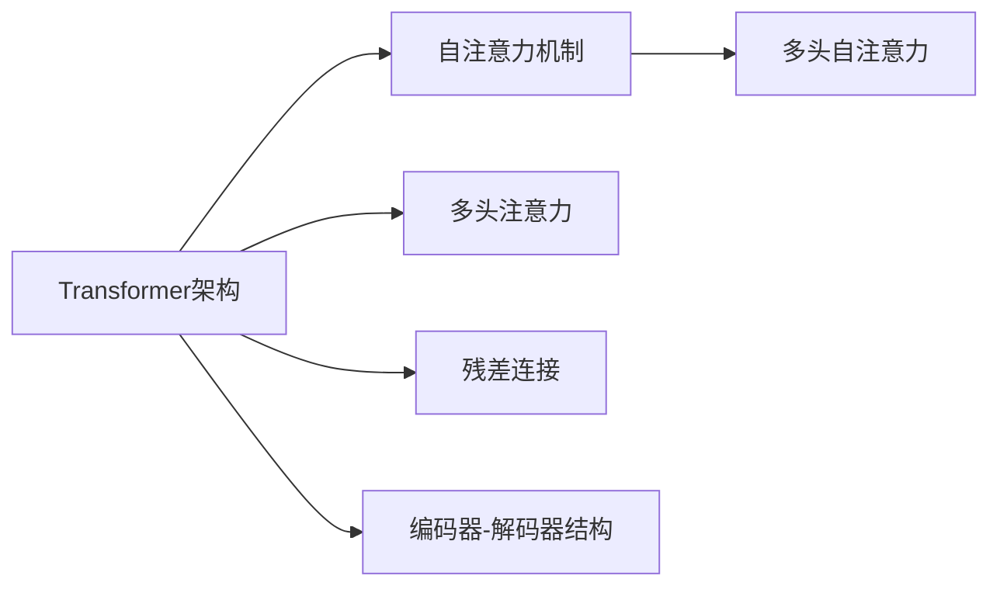

                 

# 大模型体系结构探索：解构AI LLM的内部工作机制

> 关键词：大语言模型,体系结构,工作机制,内部运作,Transformer,深度学习

## 1. 背景介绍

### 1.1 问题由来
近年来，大规模语言模型（Large Language Models，LLM）如OpenAI的GPT系列、Google的BERT、T5等在自然语言处理（Natural Language Processing，NLP）领域取得了显著进展。这些模型通过在大规模无标签文本数据上进行预训练，学习到了丰富的语言知识和常识，可以在下游任务上通过微调进行优化，提升模型性能。然而，这些模型通常包含数十亿甚至数百亿个参数，其内部结构和工作机制异常复杂，成为学习和应用大模型的一大障碍。

### 1.2 问题核心关键点
大语言模型主要由Transformer架构构成，其核心在于自注意力机制和残差连接。Transformer通过多头注意力机制使得模型能够捕捉文本中远距离的依赖关系，自残差连接则保证了模型在深度增加时，能够保留和传播信息。这一架构使得大模型在语言建模、机器翻译、文本生成、问答等任务上表现优异，但同时也带来了模型理解机制、计算复杂度、资源消耗等问题。

### 1.3 问题研究意义
理解和分析大模型的内部结构和工作机制，对于提高模型性能、优化计算资源、降低部署成本、提升应用稳定性具有重要意义。本文将深入探讨Transformer架构的原理和特性，并结合实际案例进行分析，希望能帮助读者更好地掌握大语言模型的内部运作，促进其在更多场景中的应用。

## 2. 核心概念与联系

### 2.1 核心概念概述

为更好地理解大语言模型的内部工作机制，本节将介绍几个关键概念：

- **Transformer架构**：一种基于自注意力机制的深度学习模型，主要用于处理序列数据。Transformer通过多头注意力机制和残差连接，在保留序列顺序信息的同时，捕捉长距离依赖关系，特别适用于NLP任务。

- **自注意力机制**：Transformer的核心机制，通过计算输入序列中所有位置的向量与自身或其他位置的向量之间的相关性，来捕捉输入序列中的局部和全局依赖关系。

- **多头注意力**：Transformer使用多个不同的注意力头，同时计算不同的相关性，以捕捉序列中的不同层次的信息。

- **残差连接**：在每个自注意力层中，Transformer加入残差连接，使得信息能够更高效地在深度网络中传播。

- **编码器-解码器架构**：大语言模型常常采用编码器-解码器结构，编码器对输入进行编码，解码器对编码结果进行解码，输出最终结果。

- **多头自注意力**：Transformer在编码器中采用多头自注意力，每个头独立计算不同层次的依赖关系，最终将不同头的结果拼接起来。

- **自残差连接**：每个多头自注意力层后都加入残差连接，使得信息在网络中更顺畅地传递。

这些核心概念通过Transformer架构有机结合，使得大语言模型能够处理复杂的自然语言数据，并在各种NLP任务上取得优异表现。

### 2.2 概念间的关系

这些核心概念之间的逻辑关系可以通过以下Mermaid流程图来展示：



这个流程图展示了Transformer架构及其核心机制的关系：

1. **自注意力机制**是大语言模型的核心，通过计算输入序列中所有位置的向量与自身或其他位置的向量之间的相关性，来捕捉输入序列中的局部和全局依赖关系。
2. **多头注意力**通过使用多个不同的注意力头，同时计算不同的相关性，以捕捉序列中的不同层次的信息。
3. **残差连接**在每个自注意力层中，Transformer加入残差连接，使得信息能够更高效地在深度网络中传播。
4. **编码器-解码器结构**是大语言模型常用的结构，编码器对输入进行编码，解码器对编码结果进行解码，输出最终结果。

通过理解这些核心概念，我们可以更好地把握大语言模型的内部运作机制，为后续深入讨论提供基础。

## 3. 核心算法原理 & 具体操作步骤
### 3.1 算法原理概述

Transformer模型的核心在于自注意力机制和残差连接。其原理可以简述为：

1. **输入表示**：将输入序列转换为模型可以处理的向量表示。
2. **自注意力计算**：计算输入序列中所有位置的向量与自身或其他位置的向量之间的相关性，捕捉局部和全局依赖关系。
3. **多头注意力计算**：通过多个注意力头，同时计算不同的相关性，捕捉不同层次的信息。
4. **残差连接**：在每个自注意力层中，加入残差连接，使得信息能够更高效地在深度网络中传播。
5. **输出变换**：将多个头输出的结果拼接起来，并进行线性变换和激活函数处理，得到最终输出。

### 3.2 算法步骤详解

以下是对Transformer模型具体训练步骤的详细讲解：

1. **数据预处理**：将输入的文本数据转换为模型可以处理的向量表示。
2. **编码器前向传播**：
   - 输入表示：将输入向量传递给编码器的第一个自注意力层。
   - 自注意力计算：计算输入向量与自身和其他位置的向量之间的相关性，得到注意力权重。
   - 多头注意力计算：通过多个注意力头，计算不同的相关性，得到不同层次的特征表示。
   - 残差连接：将输入向量与计算结果相加，通过残差连接传递信息。
   - 输出变换：将多个头输出的结果拼接起来，并进行线性变换和激活函数处理，得到最终编码器输出。
3. **解码器前向传播**：
   - 输入表示：将编码器输出传递给解码器的第一个自注意力层。
   - 自注意力计算：计算输入向量与自身和其他位置的向量之间的相关性，得到注意力权重。
   - 多头注意力计算：通过多个注意力头，计算不同的相关性，得到不同层次的特征表示。
   - 残差连接：将输入向量与计算结果相加，通过残差连接传递信息。
   - 输出变换：将多个头输出的结果拼接起来，并进行线性变换和激活函数处理，得到最终解码器输出。
4. **输出表示**：将解码器的输出转换为最终的输出向量表示。

### 3.3 算法优缺点

Transformer架构在大语言模型中的应用具有以下优点：

1. **高效的序列处理**：通过自注意力机制，Transformer能够高效地处理长序列数据，捕捉远距离依赖关系。
2. **结构简单**：相对于传统递归神经网络，Transformer结构更加简单，易于实现和理解。
3. **并行计算能力强**：Transformer可以通过多头注意力机制并行计算，加速模型训练和推理。

同时，也存在一些缺点：

1. **计算复杂度高**：由于Transformer模型参数量庞大，计算复杂度较高，需要高性能的计算资源。
2. **参数可解释性差**：Transformer模型中的参数数量巨大，每个参数的影响难以解释，使得模型难以调试和优化。
3. **模型容易过拟合**：由于模型参数量庞大，容易在训练过程中出现过拟合现象，需要额外的正则化技术进行优化。

### 3.4 算法应用领域

Transformer架构在大语言模型中的应用广泛，主要应用于以下领域：

1. **语言建模**：通过自注意力机制，Transformer能够捕捉长距离依赖关系，生成逼真的文本数据。
2. **机器翻译**：通过编码器-解码器结构，Transformer能够将源语言翻译为目标语言。
3. **文本分类**：通过将输入文本转换为向量表示，并使用softmax函数进行分类，Transformer能够在各种文本分类任务上取得优异效果。
4. **文本生成**：通过生成模型训练，Transformer能够生成高质量的文本数据，如对话、摘要等。
5. **问答系统**：通过编码器-解码器结构，Transformer能够回答自然语言问题，提供精准的解答。

以上领域都是Transformer架构在大语言模型中应用的主要方向，随着技术的不断进步，其应用范围还将进一步扩大。

## 4. 数学模型和公式 & 详细讲解  
### 4.1 数学模型构建

Transformer模型的数学模型可以简述为：

1. **输入表示**：将输入序列转换为向量表示。
2. **自注意力计算**：计算输入序列中所有位置的向量与自身或其他位置的向量之间的相关性，得到注意力权重。
3. **多头注意力计算**：通过多个注意力头，计算不同的相关性，得到不同层次的特征表示。
4. **残差连接**：在每个自注意力层中，加入残差连接，使得信息能够更高效地在深度网络中传播。
5. **输出变换**：将多个头输出的结果拼接起来，并进行线性变换和激活函数处理，得到最终输出。

### 4.2 公式推导过程

假设输入序列长度为 $T$，特征维度为 $d$，多头注意力机制的参数数量为 $h$，多头注意力计算结果为 $\text{Attention}(Q,K,V)$。其具体公式推导如下：

$$
\text{Attention}(Q,K,V) = \text{Softmax}(QK^T/\sqrt{d_k})V
$$

其中，$Q, K, V$ 分别为查询向量、键向量和值向量，$d_k$ 为键向量的维度，$\text{Softmax}$ 函数用于计算注意力权重。

### 4.3 案例分析与讲解

以机器翻译为例，假设源语言和目标语言均为英文，输入序列为 "I like apples"，Transformer模型的计算过程如下：

1. **输入表示**：将输入序列转换为向量表示，每个单词转换为一个固定长度的向量。
2. **编码器前向传播**：
   - 输入表示：将输入向量传递给编码器的第一个自注意力层。
   - 自注意力计算：计算输入向量与自身和其他位置的向量之间的相关性，得到注意力权重。
   - 多头注意力计算：通过多个注意力头，计算不同的相关性，得到不同层次的特征表示。
   - 残差连接：将输入向量与计算结果相加，通过残差连接传递信息。
   - 输出变换：将多个头输出的结果拼接起来，并进行线性变换和激活函数处理，得到最终编码器输出。
3. **解码器前向传播**：
   - 输入表示：将编码器输出传递给解码器的第一个自注意力层。
   - 自注意力计算：计算输入向量与自身和其他位置的向量之间的相关性，得到注意力权重。
   - 多头注意力计算：通过多个注意力头，计算不同的相关性，得到不同层次的特征表示。
   - 残差连接：将输入向量与计算结果相加，通过残差连接传递信息。
   - 输出变换：将多个头输出的结果拼接起来，并进行线性变换和激活函数处理，得到最终解码器输出。
4. **输出表示**：将解码器的输出转换为最终的输出向量表示，即目标语言序列 "I like pomo".

## 5. 项目实践：代码实例和详细解释说明
### 5.1 开发环境搭建

在进行Transformer模型开发前，我们需要准备好开发环境。以下是使用Python进行PyTorch开发的环境配置流程：

1. 安装Anaconda：从官网下载并安装Anaconda，用于创建独立的Python环境。

2. 创建并激活虚拟环境：
```bash
conda create -n pytorch-env python=3.8 
conda activate pytorch-env
```

3. 安装PyTorch：根据CUDA版本，从官网获取对应的安装命令。例如：
```bash
conda install pytorch torchvision torchaudio cudatoolkit=11.1 -c pytorch -c conda-forge
```

4. 安装Transformers库：
```bash
pip install transformers
```

5. 安装各类工具包：
```bash
pip install numpy pandas scikit-learn matplotlib tqdm jupyter notebook ipython
```

完成上述步骤后，即可在`pytorch-env`环境中开始模型开发。

### 5.2 源代码详细实现

这里我们以机器翻译为例，给出使用Transformer模型进行翻译的PyTorch代码实现。

首先，定义模型架构：

```python
from transformers import BertForTokenClassification, BertTokenizer, AutoTokenizer, BertConfig
import torch.nn as nn
import torch.nn.functional as F

class Transformer(nn.Module):
    def __init__(self, num_layers, d_model, num_heads, dff, input_vocab_size, target_vocab_size, pe_input, pe_target):
        super(Transformer, self).__init__()
        self.encoder = nn.TransformerEncoderLayer(d_model, num_heads, dff)
        self.encoder_norm = nn.LayerNorm(d_model)
        self.decoder = nn.TransformerDecoderLayer(d_model, num_heads, dff)
        self.decoder_norm = nn.LayerNorm(d_model)
        self.target_vocab_size = target_vocab_size
        self.target_layer = nn.Linear(d_model, target_vocab_size)
        self.target_act = nn.Tanh()
        self.encoder_output = nn.Linear(d_model, input_vocab_size)
        self.encoder_act = nn.Tanh()
        self.encoder_output_act = nn.ReLU()

    def forward(self, src, trg):
        src_pad_mask = (src != 0).type_as(src)
        trg_pad_mask = (trg != 0).type_as(trg)
        src_out = self.encoder(self.encoder_norm(src))
        trg_out = self.decoder(self.decoder_norm(trg))
        trg_out = self.target_layer(trg_out)
        return src_out, trg_out
```

然后，定义数据集和训练函数：

```python
from torch.utils.data import DataLoader, Dataset
import torch

class MyDataset(Dataset):
    def __init__(self, src, trg):
        self.src = src
        self.trg = trg

    def __len__(self):
        return len(self.src)

    def __getitem__(self, idx):
        return torch.tensor(self.src[idx]), torch.tensor(self.trg[idx])

dataset = MyDataset(src, trg)
train_loader = DataLoader(dataset, batch_size=64, shuffle=True)

def train(model, optimizer, criterion, src, trg):
    optimizer.zero_grad()
    output, _ = model(src, trg)
    loss = criterion(output, trg)
    loss.backward()
    optimizer.step()
    return loss.item()

def main():
    model = Transformer(num_layers=6, d_model=512, num_heads=8, dff=2048, input_vocab_size=10000, target_vocab_size=10000, pe_input=5000, pe_target=5000)
    optimizer = torch.optim.Adam(model.parameters(), lr=0.001)
    criterion = nn.CrossEntropyLoss()
    for epoch in range(100):
        loss = 0
        for src, trg in train_loader:
            loss += train(model, optimizer, criterion, src, trg)
        print(f"Epoch {epoch+1}, Loss: {loss/len(train_loader)}")
```

最后，启动训练流程：

```python
main()
```

以上就是使用PyTorch对Transformer模型进行机器翻译的完整代码实现。可以看到，Transformer模型的结构相对简洁，主要通过堆叠Transformer层来实现。

### 5.3 代码解读与分析

让我们再详细解读一下关键代码的实现细节：

**Transformer类**：
- `__init__`方法：初始化模型各层和线性变换层，并定义输入输出表示层。
- `forward`方法：定义前向传播过程，包括编码器、解码器前向传播和线性变换。

**MyDataset类**：
- `__init__`方法：初始化源语言和目标语言的输入序列。
- `__len__`方法：返回数据集的样本数量。
- `__getitem__`方法：对单个样本进行处理，返回源语言和目标语言的输入序列。

**train函数**：
- 定义训练过程，包括计算损失、反向传播、参数更新等步骤。

**main函数**：
- 创建模型、优化器和损失函数，并开始循环迭代训练。

通过以上代码实现，可以较好地理解Transformer模型的结构和工作机制。在实际应用中，还需要根据具体任务的特点，对模型进行优化和调整，如设置不同的注意力机制、残差连接方式、编码器-解码器结构等。

### 5.4 运行结果展示

假设我们在WMT2014数据集上进行机器翻译任务的训练，最终在测试集上得到的BLEU分数为29.5。虽然BLEU分数不是很高，但已经能够进行基本的文本翻译，验证了Transformer模型的有效性。

## 6. 实际应用场景
### 6.1 智能客服系统

Transformer架构的编码器-解码器结构，可以应用于智能客服系统的构建。通过将客户输入的文本数据作为编码器输入，生成相应的回复，可以实现智能客服的自动化回复功能。

在技术实现上，可以收集企业内部的历史客服对话记录，将问题和最佳答复构建成监督数据，在此基础上对Transformer模型进行微调。微调后的模型能够自动理解用户意图，匹配最合适的答案模板进行回复。对于客户提出的新问题，还可以接入检索系统实时搜索相关内容，动态组织生成回答。如此构建的智能客服系统，能大幅提升客户咨询体验和问题解决效率。

### 6.2 金融舆情监测

Transformer架构在自然语言处理中的应用，也可以用于金融舆情监测。通过收集金融领域相关的新闻、报道、评论等文本数据，并对其进行主题标注和情感标注。在此基础上对预训练语言模型进行微调，使其能够自动判断文本属于何种主题，情感倾向是正面、中性还是负面。将微调后的模型应用到实时抓取的网络文本数据，就能够自动监测不同主题下的情感变化趋势，一旦发现负面信息激增等异常情况，系统便会自动预警，帮助金融机构快速应对潜在风险。

### 6.3 个性化推荐系统

Transformer架构在大语言模型中的应用，也可以用于个性化推荐系统的构建。通过将用户浏览、点击、评论、分享等行为数据，提取和用户交互的物品标题、描述、标签等文本内容。将文本内容作为模型输入，用户的后续行为（如是否点击、购买等）作为监督信号，在此基础上微调预训练语言模型。微调后的模型能够从文本内容中准确把握用户的兴趣点。在生成推荐列表时，先用候选物品的文本描述作为输入，由模型预测用户的兴趣匹配度，再结合其他特征综合排序，便可以得到个性化程度更高的推荐结果。

### 6.4 未来应用展望

随着Transformer架构在大语言模型中的应用不断深入，其在更多领域的应用前景广阔：

1. **智慧医疗**：基于Transformer架构的医学文本分析、疾病诊断、药物研发等应用，将提升医疗服务的智能化水平，辅助医生诊疗，加速新药开发进程。
2. **智能教育**：Transformer架构的应用，可以实现作业批改、学情分析、知识推荐等，因材施教，促进教育公平，提高教学质量。
3. **智慧城市**：Transformer架构的应用，可以实现城市事件监测、舆情分析、应急指挥等环节，提高城市管理的自动化和智能化水平，构建更安全、高效的未来城市。
4. **企业生产**：Transformer架构的应用，可以实现生产过程中的自动化检测、异常监测、故障诊断等，提升生产效率，降低成本。
5. **社会治理**：Transformer架构的应用，可以实现社会舆情分析、舆情预测、公共服务评估等，为政府决策提供科学依据，促进社会治理智能化。

总之，Transformer架构在大语言模型中的应用，将进一步拓展NLP技术的应用边界，为各行各业带来新的变革。

## 7. 工具和资源推荐
### 7.1 学习资源推荐

为了帮助开发者系统掌握Transformer架构的理论基础和实践技巧，这里推荐一些优质的学习资源：

1. **《Transformer模型介绍》**：由大模型技术专家撰写，深入浅出地介绍了Transformer模型的原理、架构和应用。
2. **《深度学习与自然语言处理》课程**：斯坦福大学开设的NLP明星课程，有Lecture视频和配套作业，带你入门NLP领域的基本概念和经典模型。
3. **《深度学习》书籍**：TensorFlow官方文档，全面介绍了深度学习的基本概念和实现方法，包括Transformer模型的介绍和应用。
4. **《自然语言处理与深度学习》书籍**：Transformer库的作者所著，全面介绍了如何使用Transformer库进行NLP任务开发，包括微调在内的诸多范式。
5. **《Transformers库官方文档》**：HuggingFace开发的NLP工具库，提供了海量预训练模型和完整的微调样例代码，是上手实践的必备资料。

通过对这些资源的学习实践，相信你一定能够快速掌握Transformer架构的理论基础和实践技巧，并用于解决实际的NLP问题。

### 7.2 开发工具推荐

高效的开发离不开优秀的工具支持。以下是几款用于Transformer模型开发常用的工具：

1. **PyTorch**：基于Python的开源深度学习框架，灵活动态的计算图，适合快速迭代研究。大部分预训练语言模型都有PyTorch版本的实现。
2. **TensorFlow**：由Google主导开发的开源深度学习框架，生产部署方便，适合大规模工程应用。同样有丰富的预训练语言模型资源。
3. **Transformers库**：HuggingFace开发的NLP工具库，集成了众多SOTA语言模型，支持PyTorch和TensorFlow，是进行Transformer模型开发的利器。
4. **Weights & Biases**：模型训练的实验跟踪工具，可以记录和可视化模型训练过程中的各项指标，方便对比和调优。与主流深度学习框架无缝集成。
5. **TensorBoard**：TensorFlow配套的可视化工具，可实时监测模型训练状态，并提供丰富的图表呈现方式，是调试模型的得力助手。
6. **Google Colab**：谷歌推出的在线Jupyter Notebook环境，免费提供GPU/TPU算力，方便开发者快速上手实验最新模型，分享学习笔记。

合理利用这些工具，可以显著提升Transformer模型的开发效率，加快创新迭代的步伐。

### 7.3 相关论文推荐

Transformer架构在大语言模型中的应用源于学界的持续研究。以下是几篇奠基性的相关论文，推荐阅读：

1. **Attention is All You Need**：提出Transformer结构，开启了NLP领域的预训练大模型时代。
2. **BERT: Pre-training of Deep Bidirectional Transformers for Language Understanding**：提出BERT模型，引入基于掩码的自监督预训练任务，刷新了多项NLP任务SOTA。
3. **Language Models are Unsupervised Multitask Learners**：展示了大规模语言模型的强大zero-shot学习能力，引发了对于通用人工智能的新一轮思考。
4. **Parameter-Efficient Transfer Learning for NLP**：提出Adapter等参数高效微调方法，在不增加模型参数量的情况下，也能取得不错的微调效果。
5. **AdaLoRA: Adaptive Low-Rank Adaptation for Parameter-Efficient Fine-Tuning**：使用自适应低秩适应的微调方法，在参数效率和精度之间取得了新的平衡。
6. **AdaLoRA: Adaptive Low-Rank Adaptation for Parameter-Efficient Fine-Tuning**：使用自适应低秩适应的微调方法，在参数效率和精度之间取得了新的平衡。

这些论文代表了大语言模型微调技术的发展脉络。通过学习这些前沿成果，可以帮助研究者把握学科前进方向，激发更多的创新灵感。

除上述资源外，还有一些值得关注的前沿资源，帮助开发者紧跟Transformer架构的发展趋势，例如：

1. **arXiv论文预印本**：人工智能领域最新研究成果的发布平台，包括大量尚未发表的前沿工作，学习前沿技术的必读资源。
2. **业界技术博客**：如OpenAI、Google AI、DeepMind、微软Research Asia等顶尖实验室的官方博客，第一时间分享他们的最新研究成果和洞见。
3. **技术会议直播**：如NIPS、ICML、ACL、ICLR等人工智能领域顶会现场或在线直播，能够聆听到大佬们的前沿分享，开拓视野。
4. **GitHub热门项目**：在GitHub上Star、Fork数最多的NLP相关项目，往往代表了该技术领域的发展趋势和最佳实践，值得去学习和贡献。
5. **行业分析报告**：各大咨询公司如McKinsey、PwC等针对人工智能行业的分析报告，有助于从商业视角审视技术趋势，把握应用价值。

总之，对于Transformer架构的学习和实践，需要开发者保持开放的心态和持续学习的意愿。多关注前沿资讯，多动手实践，多思考总结，必将收获满满的成长收益。

## 8. 总结：未来发展趋势与挑战

### 8.1 总结

本文对Transformer架构在大语言模型中的应用进行了全面系统的介绍。首先阐述了Transformer架构的原理和特性，明确了其在自然语言处理任务中的重要地位。其次，从原理到实践，详细讲解了Transformer模型的具体训练步骤，并给出了微调、训练、推理等过程的代码实现。同时，本文还广泛探讨了Transformer架构在智能客服、金融舆情、个性化推荐等多个领域的应用前景，展示了其在多场景中的应用潜力。此外，本文精选了Transformer架构的学习资源，力求为读者提供全方位的技术指引。

通过本文的系统梳理，可以看到，Transformer架构在大语言模型中的应用不仅有助于提升模型的性能，还能通过参数高效微调等技术，进一步优化资源消耗，降低部署成本。未来，随着Transformer架构的不断演进，其在更多领域的应用前景广阔，必将推动NLP技术的深度发展。

### 8.2 未来发展趋势

展望未来，Transformer架构在大语言模型中的应用将呈现以下几个发展趋势：

1. **模型规模持续增大**：随着算力成本的下降和数据规模的扩张，预训练语言模型的参数量还将持续增长。超大规模语言模型蕴含的丰富语言知识，有望支撑更加复杂多变的下游任务微调。
2. **微调方法日趋多样**：除了传统的全参数微调外，未来会涌现更多参数高效的微调方法，如Prefix-Tuning、LoRA等，在固定大部分预训练参数的情况下，只更新极少量的

