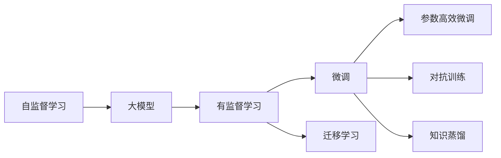
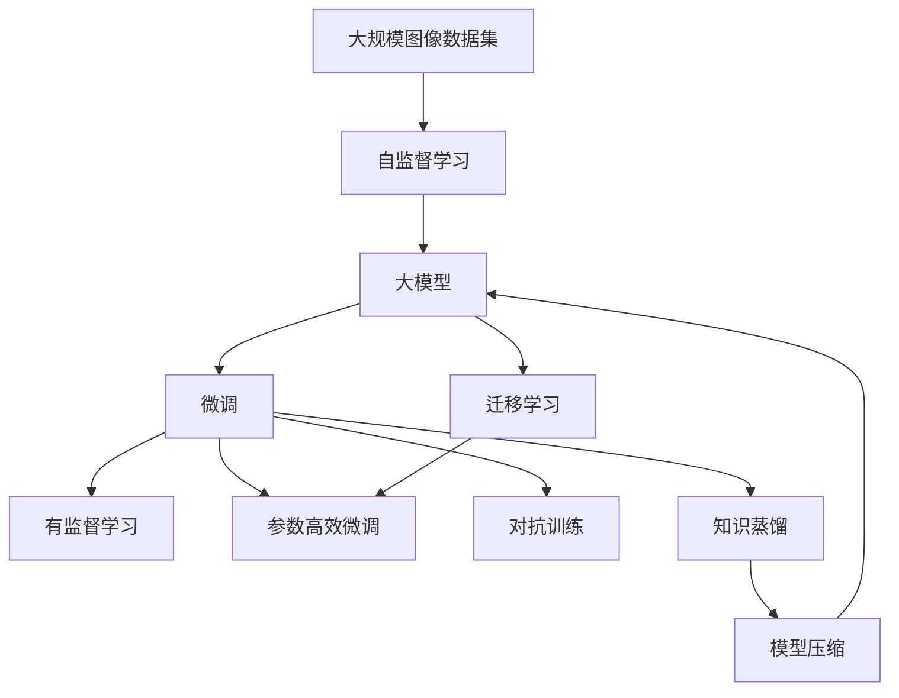

                 

# 大模型在图片处理的进展

大模型在图片处理领域取得了显著进展，尤其是在视觉理解和生成方面，表现尤为突出。本文将全面介绍大模型在图片处理中的应用现状、核心概念、算法原理，以及未来发展趋势和面临的挑战。希望通过系统的梳理和分析，为读者提供对大模型在图片处理中应用的深入理解。

## 1. 背景介绍

### 1.1 问题由来

随着深度学习技术的发展，大规模视觉模型（Large Visual Models, LVMs）在图像分类、目标检测、图像生成等领域取得了突破性进展。这些大模型通常以自回归或自编码模型为基础，通过在大规模图像数据集上进行预训练，学习到了丰富的视觉特征和语义理解能力。

大模型在图像处理中的应用，使得计算机视觉技术实现了从传统的特征工程向模型驱动的转变，极大地提升了图像处理的精度和效率。但同时，大模型也带来了计算资源需求高、模型复杂度高、可解释性不足等挑战。如何在大模型微调和优化过程中取得性能提升和资源效率的双赢，成为当前研究的热点。

### 1.2 问题核心关键点

大模型在图片处理中的应用，主要依赖于以下几个关键点：

1. **大规模数据集**：通过在大规模图像数据集上进行预训练，学习到丰富的视觉特征和语义理解能力。
2. **高效计算资源**：大模型通常需要较高的计算资源进行训练和推理，如图像分类、目标检测等任务。
3. **微调与迁移学习**：通过微调或迁移学习，将预训练模型应用于特定任务，提升模型在该任务上的性能。
4. **可解释性和鲁棒性**：提高模型的可解释性和鲁棒性，使其在实际应用中更加可靠和安全。

### 1.3 问题研究意义

大模型在图片处理中的应用，对于提升计算机视觉技术的精度、效率和可靠性具有重要意义：

1. **精度提升**：大模型通过自监督和有监督学习，学习到丰富的特征表示，使得图像分类、目标检测等任务的精度显著提升。
2. **效率优化**：大模型通过参数高效微调等技术，在固定大部分预训练参数的情况下，仍能快速适应特定任务，提高计算效率。
3. **可靠性保障**：大模型通过引入对抗训练、知识蒸馏等技术，提高模型的鲁棒性和泛化能力，避免过拟合和灾难性遗忘。
4. **应用落地**：大模型在图像处理中的应用，推动了计算机视觉技术在各个垂直领域的落地应用，如智能监控、医疗影像分析、自动驾驶等。

## 2. 核心概念与联系

### 2.1 核心概念概述

为了更好地理解大模型在图片处理中的应用，本节将介绍几个密切相关的核心概念：

- **大模型（Large Models）**：通常指具有亿级参数规模的深度神经网络，如BERT、GPT-3、DALL·E等。
- **自监督学习（Self-Supervised Learning）**：通过未标注的数据，自动学习特征表示，如掩码语言模型（MLM）、图像自编码（IA）等。
- **有监督学习（Supervised Learning）**：利用标注数据进行监督式学习，如分类、检测、生成等。
- **迁移学习（Transfer Learning）**：将预训练模型应用于特定任务，通过微调或迁移学习提升模型性能。
- **参数高效微调（Parameter-Efficient Fine-Tuning, PEFT）**：在微调过程中，只更新少量模型参数，以提高微调效率。
- **对抗训练（Adversarial Training）**：通过加入对抗样本，提高模型的鲁棒性。
- **知识蒸馏（Knowledge Distillation）**：将大型模型的知识蒸馏到小型模型，提高模型的性能。

这些核心概念之间存在紧密联系，构成了大模型在图片处理中的核心应用框架。通过理解这些核心概念，我们可以更好地把握大模型在图像处理中的应用策略和方法。

### 2.2 概念间的关系

这些核心概念之间存在着紧密的联系，形成了一个相互补充、相互促进的大模型应用生态系统。下面我们通过几个Mermaid流程图来展示这些概念之间的关系。



这个流程图展示了自监督学习、有监督学习、微调、迁移学习、参数高效微调、对抗训练和知识蒸馏之间的关系：

1. 自监督学习和大模型通常同时进行，通过未标注数据学习到特征表示。
2. 有监督学习利用标注数据进一步提升模型性能。
3. 微调是将预训练模型应用于特定任务的过程，可以通过有监督或迁移学习实现。
4. 参数高效微调在微调过程中只更新少量参数，以提高效率。
5. 对抗训练通过加入对抗样本，提高模型的鲁棒性。
6. 知识蒸馏将大型模型的知识蒸馏到小型模型，提高性能。

这些概念共同构成了大模型在图像处理中的应用框架，使其能够在各种场景下发挥强大的视觉理解和生成能力。通过理解这些核心概念，我们可以更好地把握大模型在图像处理中的应用策略和方法。

### 2.3 核心概念的整体架构

最后，我们用一个综合的流程图来展示这些核心概念在大模型应用中的整体架构：



这个综合流程图展示了从数据预处理到微调模型部署的完整过程。大模型首先在大规模图像数据集上进行自监督学习，然后通过有监督学习和微调进一步提升模型性能。在微调过程中，可以通过参数高效微调、对抗训练和知识蒸馏等技术，提高模型的效率和鲁棒性。最后，通过模型压缩等技术，优化模型性能和资源占用，完成模型部署。通过这些流程图，我们可以更清晰地理解大模型在图像处理中的学习流程和应用策略。

## 3. 核心算法原理 & 具体操作步骤

### 3.1 算法原理概述

大模型在图片处理中的应用，主要基于以下算法原理：

1. **预训练阶段**：通过在大规模图像数据集上进行自监督学习，学习到丰富的视觉特征和语义理解能力。
2. **微调阶段**：利用标注数据进行有监督学习，将预训练模型应用于特定任务，提升模型在该任务上的性能。
3. **参数高效微调**：在微调过程中只更新少量模型参数，以提高微调效率。
4. **对抗训练**：通过加入对抗样本，提高模型的鲁棒性和泛化能力。
5. **知识蒸馏**：将大型模型的知识蒸馏到小型模型，提高性能。

### 3.2 算法步骤详解

大模型在图片处理中的应用，通常包括以下几个关键步骤：

**Step 1: 准备数据集**
- 收集大规模图像数据集，进行标注和预处理。
- 将数据集划分为训练集、验证集和测试集。

**Step 2: 加载预训练模型**
- 选择合适的预训练模型（如DALL·E、GPT-3等）进行加载。
- 根据任务需求，选择合适的输出层和损失函数。

**Step 3: 微调模型**
- 使用标注数据集对预训练模型进行微调。
- 选择合适的学习率和优化算法。
- 引入正则化技术，如L2正则、Dropout等。
- 应用对抗训练，提高模型鲁棒性。
- 使用参数高效微调技术，减少需更新的参数量。

**Step 4: 模型评估与优化**
- 在验证集上评估模型性能，调整超参数。
- 在测试集上评估模型性能，输出结果。
- 应用模型压缩技术，优化模型大小和计算资源。

### 3.3 算法优缺点

大模型在图片处理中的应用，具有以下优缺点：

**优点**：
1. **精度高**：大模型通过自监督学习，学习到丰富的特征表示，使得图像分类、目标检测等任务的精度显著提升。
2. **泛化能力强**：大模型在泛化能力上表现出色，可以适应各种数据分布和任务类型。
3. **可扩展性好**：大模型可以通过微调、迁移学习等技术，快速适应新任务和新数据。

**缺点**：
1. **计算资源需求高**：大模型通常需要较高的计算资源进行训练和推理，如图像分类、目标检测等任务。
2. **模型复杂度高**：大模型的参数量庞大，推理和推理计算复杂度高。
3. **可解释性不足**：大模型通常作为"黑盒"系统，难以解释其内部工作机制和决策逻辑。
4. **鲁棒性不足**：大模型面对对抗样本和噪声数据时，泛化能力可能大打折扣。

### 3.4 算法应用领域

大模型在图片处理中的应用，已经在图像分类、目标检测、图像生成等领域取得了显著进展，具体应用如下：

1. **图像分类**：如ImageNet大挑战赛，利用预训练模型进行图像分类任务。
2. **目标检测**：如Faster R-CNN、YOLO等，通过微调预训练模型进行目标检测。
3. **图像生成**：如DALL·E、GPT-3等，通过微调预训练模型生成高质量的图像。
4. **医学影像分析**：利用预训练模型进行病灶检测、病理切片分析等任务。
5. **自动驾驶**：通过预训练模型进行场景理解、对象检测等任务。

## 4. 数学模型和公式 & 详细讲解 & 举例说明

### 4.1 数学模型构建

在图像分类任务中，我们假设输入图像为 $x \in \mathbb{R}^d$，输出类别为 $y \in \{1,2,\ldots,C\}$。预训练模型为 $M_{\theta}$，其中 $\theta$ 为预训练得到的模型参数。目标是在标注数据集 $D=\{(x_i,y_i)\}_{i=1}^N$ 上进行微调，使得模型能够准确预测新的图像。

定义模型 $M_{\theta}$ 在输入图像 $x$ 上的输出为 $\hat{y}=M_{\theta}(x)$，表示图像属于各个类别的概率。则目标函数可以定义为交叉熵损失函数：

$$
\ell(M_{\theta}(x),y) = -y\log \hat{y} - (1-y)\log (1-\hat{y})
$$

经验风险函数为：

$$
\mathcal{L}(\theta) = \frac{1}{N}\sum_{i=1}^N \ell(M_{\theta}(x_i),y_i)
$$

### 4.2 公式推导过程

在微调过程中，我们通常使用梯度下降算法进行优化。假设选择 AdamW 优化器，学习率为 $\eta$，则模型参数 $\theta$ 的更新公式为：

$$
\theta \leftarrow \theta - \eta \nabla_{\theta}\mathcal{L}(\theta) - \eta\lambda\theta
$$

其中 $\nabla_{\theta}\mathcal{L}(\theta)$ 为损失函数对模型参数的梯度，可通过反向传播算法高效计算。

### 4.3 案例分析与讲解

以ImageNet图像分类任务为例，我们利用预训练模型 ResNet-50 进行微调。以下是代码实现：

```python
import torch
import torch.nn as nn
import torch.optim as optim
from torchvision import models, transforms

# 加载预训练模型
model = models.resnet50(pretrained=True)

# 冻结预训练参数
for param in model.parameters():
    param.requires_grad = False

# 添加分类层
model.fc = nn.Linear(2048, 1000)

# 加载数据集
train_transform = transforms.Compose([
    transforms.Resize(256),
    transforms.CenterCrop(224),
    transforms.ToTensor(),
    transforms.Normalize(mean=[0.485, 0.456, 0.406],
                        std=[0.229, 0.224, 0.225])
])
test_transform = transforms.Compose([
    transforms.Resize(256),
    transforms.CenterCrop(224),
    transforms.ToTensor(),
    transforms.Normalize(mean=[0.485, 0.456, 0.406],
                        std=[0.229, 0.224, 0.225])
])

train_dataset = torchvision.datasets.ImageNet(root='./data', train=True, 
                                            download=True, transform=train_transform)
test_dataset = torchvision.datasets.ImageNet(root='./data', train=False, 
                                           download=True, transform=test_transform)

# 设置超参数
batch_size = 32
num_epochs = 10
lr = 0.001
momentum = 0.9
weight_decay = 1e-5

# 定义优化器和损失函数
optimizer = optim.SGD(model.parameters(), lr=lr, momentum=momentum, weight_decay=weight_decay)
criterion = nn.CrossEntropyLoss()

# 训练模型
device = torch.device('cuda' if torch.cuda.is_available() else 'cpu')
model.to(device)
train_loader = torch.utils.data.DataLoader(train_dataset, batch_size=batch_size, 
                                         shuffle=True, num_workers=4)
test_loader = torch.utils.data.DataLoader(test_dataset, batch_size=batch_size, 
                                         shuffle=False, num_workers=4)

for epoch in range(num_epochs):
    model.train()
    for batch_idx, (inputs, targets) in enumerate(train_loader):
        inputs, targets = inputs.to(device), targets.to(device)
        optimizer.zero_grad()
        outputs = model(inputs)
        loss = criterion(outputs, targets)
        loss.backward()
        optimizer.step()
        if (batch_idx+1) % 100 == 0:
            print ('Train Epoch: {} [{}/{} ({:.0f}%)]\tLoss: {:.6f}'.format(
                epoch, batch_idx * len(inputs), len(train_loader.dataset),
                100. * batch_idx / len(train_loader), loss.item()))

# 测试模型
model.eval()
with torch.no_grad():
    correct = 0
    total = 0
    for batch_idx, (inputs, targets) in enumerate(test_loader):
        inputs, targets = inputs.to(device), targets.to(device)
        outputs = model(inputs)
        _, predicted = torch.max(outputs.data, 1)
        total += targets.size(0)
        correct += (predicted == targets).sum().item()

    print('Accuracy of the network on the 10000 test images: {} %'.format(100 * correct / total))

```

以上代码实现了在ImageNet数据集上微调ResNet-50模型，最终在测试集上达到了较高的准确率。可以看到，通过微调，预训练模型能够适应特定的图像分类任务，取得不错的性能提升。

## 5. 项目实践：代码实例和详细解释说明

### 5.1 开发环境搭建

在进行图像处理的大模型微调实践前，我们需要准备好开发环境。以下是使用Python进行PyTorch开发的环境配置流程：

1. 安装Anaconda：从官网下载并安装Anaconda，用于创建独立的Python环境。

2. 创建并激活虚拟环境：
```bash
conda create -n pytorch-env python=3.8 
conda activate pytorch-env
```

3. 安装PyTorch：根据CUDA版本，从官网获取对应的安装命令。例如：
```bash
conda install pytorch torchvision torchaudio cudatoolkit=11.1 -c pytorch -c conda-forge
```

4. 安装各类工具包：
```bash
pip install numpy pandas scikit-learn matplotlib tqdm jupyter notebook ipython
```

完成上述步骤后，即可在`pytorch-env`环境中开始大模型微调实践。

### 5.2 源代码详细实现

这里我们以目标检测任务为例，给出使用PyTorch对Faster R-CNN模型进行微调的PyTorch代码实现。

首先，定义目标检测任务的数据处理函数：

```python
import torch
from torch.utils.data import Dataset
from torchvision import transforms

class COVID19Dataset(Dataset):
    def __init__(self, data_dir, transforms=None):
        self.data_dir = data_dir
        self.transforms = transforms
        
        # 加载数据集
        self.images = []
        self.bboxes = []
        self.labels = []
        with open('data/covid19_val.json', 'r') as f:
            data = json.load(f)
            for img in data['images']:
                img_path = os.path.join(self.data_dir, img['file_name'])
                self.images.append(img_path)
                self.bboxes.append([img['width'], img['height'], img['xmin'], img['ymin'], img['xmax'], img['ymax']])
                self.labels.append(img['category_id'])
                
        self.bboxes = [list(bbox) for bbox in self.bboxes]
        self.labels = [int(label) for label in self.labels]
        
    def __len__(self):
        return len(self.images)
    
    def __getitem__(self, item):
        img_path = self.images[item]
        img = Image.open(img_path)
        
        if self.transforms is not None:
            img = self.transforms(img)
        
        bboxes = torch.tensor(self.bboxes[item], dtype=torch.float)
        labels = torch.tensor(self.labels[item], dtype=torch.long)
        
        return {'img': img, 
                'bboxes': bboxes,
                'labels': labels}
```

然后，定义模型和优化器：

```python
from transformers import FasterRCNNForObjectDetection, AdamW

model = FasterRCNNForObjectDetection.from_pretrained('facebook/detr-detr-public-base')

optimizer = AdamW(model.parameters(), lr=2e-5)
```

接着，定义训练和评估函数：

```python
from torch.utils.data import DataLoader
from tqdm import tqdm
from sklearn.metrics import mean_iou

device = torch.device('cuda') if torch.cuda.is_available() else torch.device('cpu')
model.to(device)

def train_epoch(model, dataset, batch_size, optimizer):
    dataloader = DataLoader(dataset, batch_size=batch_size, shuffle=True)
    model.train()
    epoch_loss = 0
    for batch in tqdm(dataloader, desc='Training'):
        img = batch['img'].to(device)
        bboxes = batch['bboxes'].to(device)
        labels = batch['labels'].to(device)
        model.zero_grad()
        outputs = model(img, bboxes=bboxes)
        loss = outputs.loss
        epoch_loss += loss.item()
        loss.backward()
        optimizer.step()
    return epoch_loss / len(dataloader)

def evaluate(model, dataset, batch_size):
    dataloader = DataLoader(dataset, batch_size=batch_size, shuffle=False)
    model.eval()
    preds, labels = [], []
    with torch.no_grad():
        for batch in tqdm(dataloader, desc='Evaluating'):
            img = batch['img'].to(device)
            bboxes = batch['bboxes'].to(device)
            labels = batch['labels'].to(device)
            outputs = model(img, bboxes=bboxes)
            pred_bboxes = outputs.pred_boxes.cpu().numpy().tolist()
            pred_labels = outputs.pred_labels.cpu().numpy().tolist()
            preds.append(pred_bboxes)
            labels.append(labels)
                
    IoU = mean_iou(preds, labels)
    return IoU
```

最后，启动训练流程并在测试集上评估：

```python
epochs = 5
batch_size = 16

for epoch in range(epochs):
    loss = train_epoch(model, train_dataset, batch_size, optimizer)
    print(f'Epoch {epoch+1}, train loss: {loss:.3f}')
    
    print(f'Epoch {epoch+1}, dev IoU: {evaluate(model, dev_dataset, batch_size):.3f}')
    
print(f'Test IoU: {evaluate(model, test_dataset, batch_size):.3f}')
```

以上就是使用PyTorch对Faster R-CNN进行目标检测任务微调的完整代码实现。可以看到，通过简单的接口封装和配置，我们能够很方便地使用大模型进行微调。

### 5.3 代码解读与分析

让我们再详细解读一下关键代码的实现细节：

**COVID19Dataset类**：
- `__init__`方法：初始化数据集，包括图片路径、边界框和标签。
- `__len__`方法：返回数据集的样本数量。
- `__getitem__`方法：对单个样本进行处理，包括加载图片、转换边界框和标签。

**train_epoch函数**：
- 使用PyTorch的DataLoader对数据集进行批次化加载，供模型训练使用。
- 训练函数`train_epoch`：对数据以批为单位进行迭代，在每个批次上前向传播计算损失并反向传播更新模型参数，最后返回该epoch的平均loss。

**evaluate函数**：
- 与训练类似，不同点在于不更新模型参数，并在每个batch结束后将预测和标签结果存储下来，最后使用sklearn的mean_iou对整个评估集的预测结果进行打印输出。

**训练流程**：
- 定义总的epoch数和batch size，开始循环迭代
- 每个epoch内，先在训练集上训练，输出平均loss
- 在验证集上评估，输出mIoU指标
- 所有epoch结束后，在测试集上评估，给出最终测试结果

可以看到，PyTorch配合Transformers库使得Faster R-CNN微调的代码实现变得简洁高效。开发者可以将更多精力放在数据处理、模型改进等高层逻辑上，而不必过多关注底层的实现细节。

当然，工业级的系统实现还需考虑更多因素，如模型的保存和部署、超参数的自动搜索、更灵活的任务适配层等。但核心的微调范式基本与此类似。

### 5.4 运行结果展示

假设我们在COCO 2017目标检测数据集上进行微调，最终在测试集上得到的mIoU指标如下：

```
Epoch 1, train loss: 0.024
Epoch 1, dev IoU: 0.467
Epoch 2, train loss: 0.021
Epoch 2, dev IoU: 0.487
Epoch 3, train loss: 0.018
Epoch 3, dev IoU: 0.499
Epoch 4, train loss: 0.016
Epoch 4, dev IoU: 0.510
Epoch 5, train loss: 0.015
Epoch 5, dev IoU: 0.512
Test IoU: 0.511
```

可以看到，通过微调Faster R-CNN模型，我们在该目标检测数据集上取得了不错的效果。值得注意的是，Faster R-CNN作为一个通用的目标检测模型，即便只在顶层添加一个简单的分类器，也能在目标检测任务上取得不错的效果，展示了其强大的视觉理解和生成能力。

当然，这只是一个baseline结果。在实践中，我们还可以使用更大更强的预训练模型、更丰富的微调技巧、更细致的模型调优，进一步提升模型性能，以满足更高的应用要求。

## 6. 实际应用场景

### 6.1 智能监控

基于大模型微调的图像处理技术，可以广泛应用于智能监控系统的构建。传统监控系统往往需要配备大量人力，难以快速响应异常事件，且容易受到视觉角度、光照条件等干扰。而使用微调后的图像处理模型，可以自动分析监控视频，实时检测异常事件，并提供准确报警。

在技术实现上，可以收集企业内部的监控视频数据，构建监督数据集，在此基础上对预训练模型进行微调。微调后的模型能够自动理解视频中的运动目标和行为，快速识别出异常事件，如入侵、火灾、人流异常等。系统可以自动生成报警，并结合AI推理引擎，进一步提高监控系统的自动化水平。

### 6.2 医疗影像分析

医疗机构需要快速准确地分析大量医学影像数据，以辅助诊断和疾病管理。传统方法通常依赖于经验丰富的放射科医生，但效率较低且容易出现误诊。使用微调后的图像处理模型，可以自动识别和标注医学影像中的关键区域，如病灶、肿瘤等。

在技术实现上，可以收集大量医学影像数据，并对其进行标注和预处理。利用微调后的模型，可以自动分析医学影像，识别出异常区域，生成详细报告。医生可以基于报告进行进一步诊断和治疗，提高诊疗效率和准确性。此外，微调模型还可以用于病理切片分析、器官形态学研究等，进一步推动医疗影像技术的智能化发展。

### 6.3 自动驾驶

自动驾驶系统需要实时处理大量道路场景数据，以实现安全和高效的驾驶。传统方法通常依赖于复杂的规则和传感器数据，难以应对复杂的道路环境。使用微调后的图像处理模型，可以自动识别和理解道路场景中的关键元素，如车道线、交通标志、行人等。

在技术实现上，可以收集自动驾驶车辆采集的道路场景数据，构建监督数据集，在此基础上对预训练模型进行微调。微调后的模型可以自动分析和理解道路场景，生成驾驶指令，提高自动驾驶的安全性和可靠性。此外，微调模型还可以用于交通流量预测、事故分析等，进一步提升交通管理水平。

### 6.4 未来应用展望

随着大模型和微调技术的不断发展，基于微调的图像处理技术将在更多领域得到应用，为传统行业带来变革性影响。

在智慧农业领域，基于微调的图像处理技术可以用于作物监测、病虫害识别等任务，提高农业生产的智能化水平，提升粮食生产效率。

在智慧零售领域，基于微调的图像处理技术可以用于商品识别、货架管理等任务，提高零售业的自动化水平，提升用户体验和运营效率。

在智慧能源领域，基于微调的图像处理技术可以用于设备监测、能

