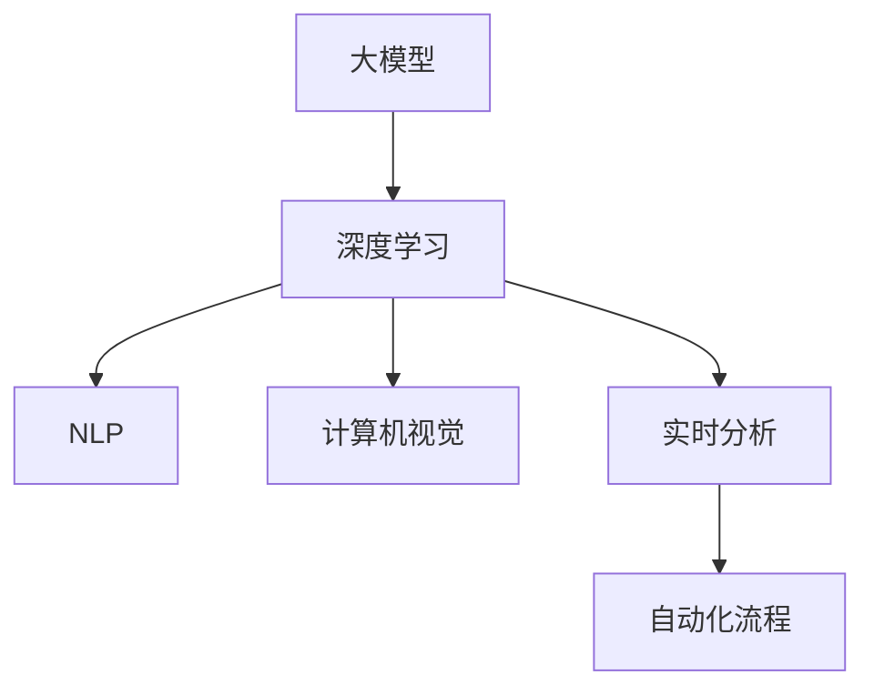
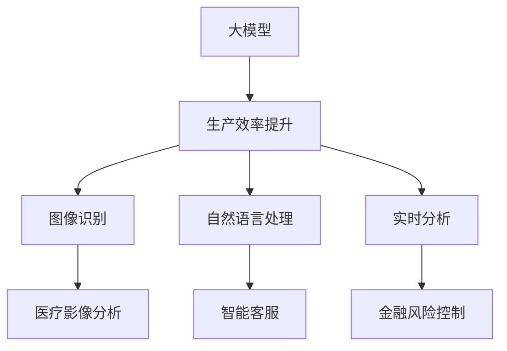
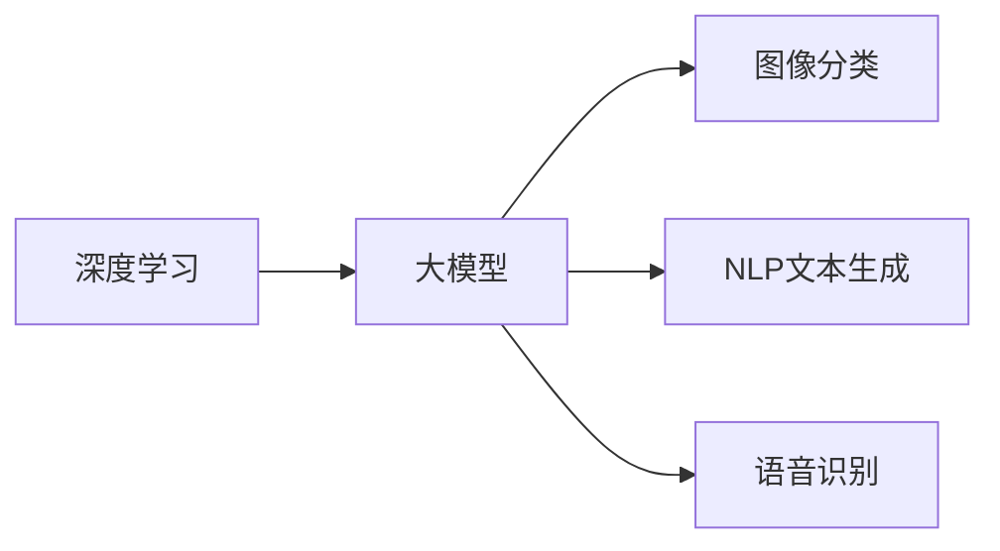
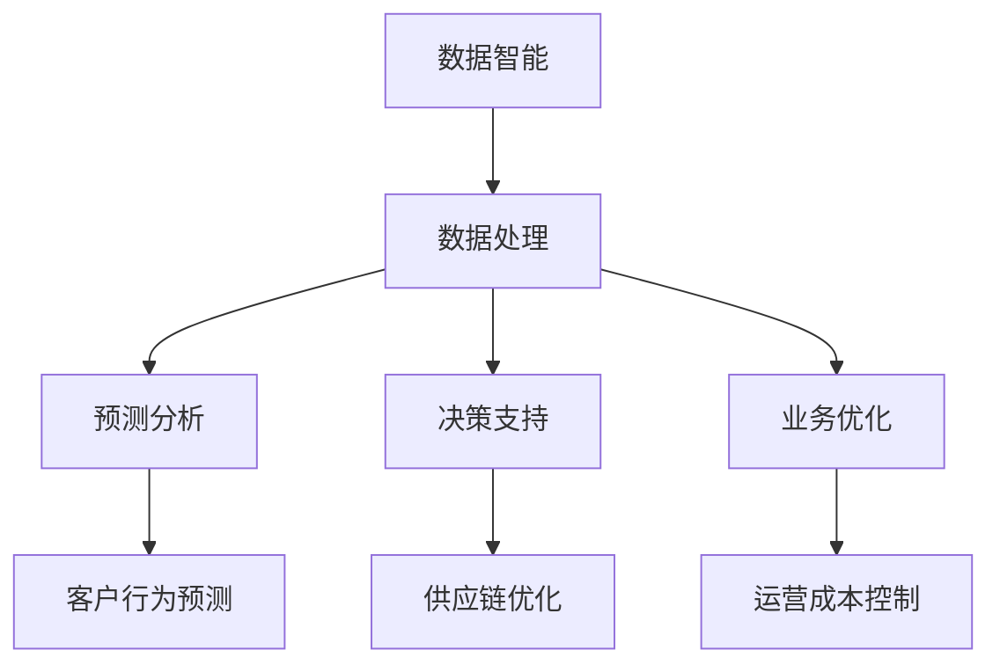
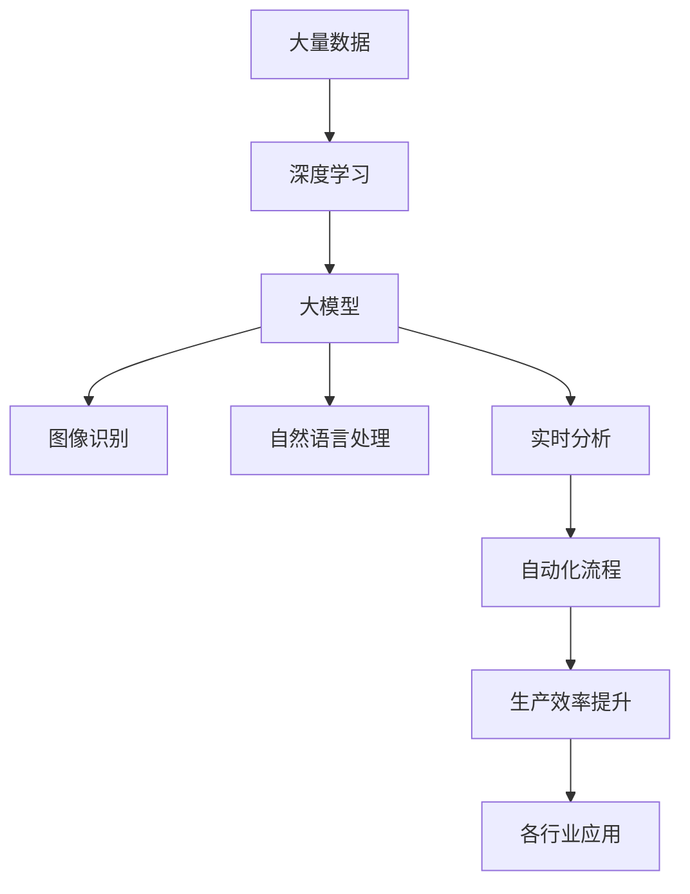

                 

# 大模型带来的生产力提升

> 关键词：大模型,生产效率,技术赋能,生产力革命,AI驱动,数据智能

## 1. 背景介绍

### 1.1 问题由来
随着人工智能技术的飞速发展，大模型（Large Models）已经成为推动各行各业生产效率提升的重要引擎。大模型通过在大量数据上进行深度学习训练，可以处理和理解复杂任务，并在多个领域产生了深远影响。

然而，由于大模型的复杂性和资源需求，一些企业和机构对其应用仍存在疑虑。为了帮助读者更好地理解大模型对生产力的提升，本文将从背景介绍、核心概念、算法原理、应用实践、未来展望等多个维度进行详细阐述。

### 1.2 问题核心关键点
大模型生产力提升的核心关键点在于其对多领域数据智能的处理能力。大模型通过深度学习，能够在图像识别、自然语言处理、语音识别等领域实现高质量的预测和决策，显著提升企业的生产效率。

1. **数据处理能力**：大模型能够处理海量数据，挖掘出其中的重要信息和模式，为决策提供支持。
2. **多领域应用**：大模型可以应用于多个行业，如医疗、金融、制造业等，优化业务流程，提高运营效率。
3. **实时分析**：通过实时分析数据，大模型能够即时提供业务决策支持，加快响应速度。
4. **成本节约**：自动化流程替代人力，降低运营成本，提升企业利润率。

### 1.3 问题研究意义
研究大模型的生产力提升，对于推动企业数字化转型、优化资源配置、提升产品质量等方面具有重要意义：

1. **降低人力成本**：通过自动化流程，减少人工干预，降低人力成本。
2. **提高决策质量**：通过大数据分析，提供更准确的业务决策依据。
3. **加速产品迭代**：通过模型优化和实时分析，快速响应市场需求，加速产品迭代。
4. **增强竞争力**：提高企业的技术能力和创新速度，增强市场竞争力。
5. **提升用户体验**：通过智能化应用，提升用户体验和服务水平。

## 2. 核心概念与联系

### 2.1 核心概念概述

为更好地理解大模型带来的生产力提升，本节将介绍几个密切相关的核心概念：

- **大模型（Large Models）**：通过深度学习技术，在大量数据上进行训练的大型神经网络模型。如GPT、BERT、ViT等。
- **深度学习（Deep Learning）**：一种通过多层神经网络进行复杂数据建模和预测的技术。
- **自然语言处理（Natural Language Processing, NLP）**：利用深度学习处理和理解自然语言的学科。
- **计算机视觉（Computer Vision）**：利用深度学习处理和理解图像和视频的技术。
- **实时分析（Real-time Analysis）**：利用大模型进行实时数据处理和分析，提供即时决策支持。
- **自动化流程（Automation Processes）**：通过大模型自动化执行复杂任务，提高生产效率。

这些核心概念之间的逻辑关系可以通过以下Mermaid流程图来展示：



这个流程图展示了大模型在多个领域中的应用和核心概念之间的关系。

### 2.2 概念间的关系

这些核心概念之间存在着紧密的联系，形成了大模型生产力提升的完整生态系统。下面我通过几个Mermaid流程图来展示这些概念之间的关系。

#### 2.2.1 大模型的应用场景



这个流程图展示了大模型在多个实际应用场景中的作用，提升了各行业的生产效率。

#### 2.2.2 深度学习在大模型中的应用



这个流程图展示了深度学习技术在大模型中的具体应用。

#### 2.2.3 数据智能在大模型中的应用



这个流程图展示了数据智能技术在大模型中的应用，进一步提升了生产效率。

### 2.3 核心概念的整体架构

最后，我们用一个综合的流程图来展示这些核心概念在大模型生产力提升过程中的整体架构：



这个综合流程图展示了从数据输入到生产力提升的全过程，以及各核心概念之间的关系。

## 3. 核心算法原理 & 具体操作步骤

### 3.1 算法原理概述

大模型生产力提升的核心算法原理主要包括以下几个方面：

- **深度学习**：通过多层神经网络模型，在大规模数据上训练，挖掘数据中的潜在模式和关系。
- **自然语言处理（NLP）**：利用深度学习处理和理解自然语言，实现机器翻译、情感分析、问答系统等功能。
- **计算机视觉**：利用深度学习处理和理解图像和视频，实现图像分类、目标检测、视频分析等功能。
- **实时分析**：通过深度学习模型对实时数据进行分析和处理，提供即时决策支持。
- **自动化流程**：通过深度学习模型自动化执行复杂任务，提升生产效率。

### 3.2 算法步骤详解

大模型生产力提升的步骤主要包括以下几个关键步骤：

1. **数据准备**：收集和整理大量数据，并进行数据清洗和预处理，确保数据的质量和一致性。
2. **模型训练**：使用深度学习模型在大规模数据上训练，优化模型参数，提升模型性能。
3. **模型部署**：将训练好的大模型部署到实际应用场景中，提供自动化流程支持。
4. **实时分析**：利用大模型对实时数据进行分析和处理，提供即时决策支持。
5. **优化迭代**：根据应用反馈，不断优化模型和算法，提升生产效率。

### 3.3 算法优缺点

大模型生产力提升的优势在于其强大的数据处理和分析能力，能够处理复杂任务，提升生产效率。但同时也存在以下缺点：

1. **资源需求高**：大模型的训练和部署需要大量的计算资源和存储空间。
2. **复杂度高**：大模型的训练和优化过程复杂，需要专业的技术和团队支持。
3. **易受数据影响**：大模型依赖于高质量的数据，数据偏差可能导致模型性能下降。
4. **公平性和安全性**：大模型可能存在偏见和安全隐患，需要额外的监管和控制。

### 3.4 算法应用领域

大模型生产力提升的应用领域非常广泛，涵盖了多个行业和场景，如：

- **医疗健康**：利用大模型进行医学影像分析、患者诊断、药物研发等。
- **金融服务**：利用大模型进行信用评估、风险控制、投资决策等。
- **制造工业**：利用大模型进行设备维护、生产优化、质量控制等。
- **零售电商**：利用大模型进行客户行为分析、个性化推荐、库存管理等。
- **交通运输**：利用大模型进行交通流量预测、路线规划、智能驾驶等。
- **教育培训**：利用大模型进行智能教育、个性化推荐、学习分析等。

这些应用领域展示了大模型在提升各行业生产效率方面的巨大潜力。

## 4. 数学模型和公式 & 详细讲解 & 举例说明

### 4.1 数学模型构建

大模型生产力提升的核心数学模型主要包括深度学习模型、自然语言处理模型和计算机视觉模型。这里以BERT模型为例，构建其在NLP领域的应用模型。

定义输入序列为 $x_1, x_2, ..., x_n$，其中 $x_i$ 表示第 $i$ 个单词或字符。BERT模型的输出为 $h(x_1, x_2, ..., x_n)$，其中 $h$ 表示隐状态向量。

### 4.2 公式推导过程

BERT模型的核心公式为：

$$
h(x_1, x_2, ..., x_n) = \text{MLP}(\text{Attention}(\text{Encoder}(x_1, x_2, ..., x_n)))
$$

其中，Encoder表示Transformer编码器，Attention表示注意力机制，MLP表示多层感知机。

### 4.3 案例分析与讲解

以BERT模型在自然语言处理中的应用为例，详细讲解其公式推导过程和实际应用。

BERT模型通过Transformer编码器对输入序列进行处理，得到每个位置的隐状态向量 $h_i$。然后通过Attention机制，对每个位置与其他位置的注意力权重进行计算，得到新的隐状态向量 $h_i'$。最后，通过多层感知机（MLP）对 $h_i'$ 进行进一步处理，得到最终的输出 $h(x_1, x_2, ..., x_n)$。

在实际应用中，BERT模型常用于文本分类、情感分析、问答系统等任务。通过训练，模型能够自动学习文本中的语义信息，实现精准的分类和分析。

## 5. 项目实践：代码实例和详细解释说明

### 5.1 开发环境搭建

在进行大模型生产力提升的实践前，我们需要准备好开发环境。以下是使用Python进行PyTorch开发的环境配置流程：

1. 安装Anaconda：从官网下载并安装Anaconda，用于创建独立的Python环境。

2. 创建并激活虚拟环境：
```bash
conda create -n pytorch-env python=3.8 
conda activate pytorch-env
```

3. 安装PyTorch：根据CUDA版本，从官网获取对应的安装命令。例如：
```bash
conda install pytorch torchvision torchaudio cudatoolkit=11.1 -c pytorch -c conda-forge
```

4. 安装Transformers库：
```bash
pip install transformers
```

5. 安装各类工具包：
```bash
pip install numpy pandas scikit-learn matplotlib tqdm jupyter notebook ipython
```

完成上述步骤后，即可在`pytorch-env`环境中开始大模型生产力提升的实践。

### 5.2 源代码详细实现

这里我们以BERT模型为例，给出使用Transformers库进行自然语言处理任务开发的PyTorch代码实现。

首先，定义任务的数据处理函数：

```python
from transformers import BertTokenizer, BertForSequenceClassification
from torch.utils.data import Dataset
import torch

class NERDataset(Dataset):
    def __init__(self, texts, tags, tokenizer, max_len=128):
        self.texts = texts
        self.tags = tags
        self.tokenizer = tokenizer
        self.max_len = max_len
        
    def __len__(self):
        return len(self.texts)
    
    def __getitem__(self, item):
        text = self.texts[item]
        tags = self.tags[item]
        
        encoding = self.tokenizer(text, return_tensors='pt', max_length=self.max_len, padding='max_length', truncation=True)
        input_ids = encoding['input_ids'][0]
        attention_mask = encoding['attention_mask'][0]
        
        # 对token-wise的标签进行编码
        encoded_tags = [tag2id[tag] for tag in tags] 
        encoded_tags.extend([tag2id['O']] * (self.max_len - len(encoded_tags)))
        labels = torch.tensor(encoded_tags, dtype=torch.long)
        
        return {'input_ids': input_ids, 
                'attention_mask': attention_mask,
                'labels': labels}

# 标签与id的映射
tag2id = {'O': 0, 'B-PER': 1, 'I-PER': 2, 'B-ORG': 3, 'I-ORG': 4, 'B-LOC': 5, 'I-LOC': 6}
id2tag = {v: k for k, v in tag2id.items()}

# 创建dataset
tokenizer = BertTokenizer.from_pretrained('bert-base-cased')

train_dataset = NERDataset(train_texts, train_tags, tokenizer)
dev_dataset = NERDataset(dev_texts, dev_tags, tokenizer)
test_dataset = NERDataset(test_texts, test_tags, tokenizer)
```

然后，定义模型和优化器：

```python
from transformers import BertForTokenClassification, AdamW

model = BertForTokenClassification.from_pretrained('bert-base-cased', num_labels=len(tag2id))

optimizer = AdamW(model.parameters(), lr=2e-5)
```

接着，定义训练和评估函数：

```python
from torch.utils.data import DataLoader
from tqdm import tqdm
from sklearn.metrics import classification_report

device = torch.device('cuda') if torch.cuda.is_available() else torch.device('cpu')
model.to(device)

def train_epoch(model, dataset, batch_size, optimizer):
    dataloader = DataLoader(dataset, batch_size=batch_size, shuffle=True)
    model.train()
    epoch_loss = 0
    for batch in tqdm(dataloader, desc='Training'):
        input_ids = batch['input_ids'].to(device)
        attention_mask = batch['attention_mask'].to(device)
        labels = batch['labels'].to(device)
        model.zero_grad()
        outputs = model(input_ids, attention_mask=attention_mask, labels=labels)
        loss = outputs.loss
        epoch_loss += loss.item()
        loss.backward()
        optimizer.step()
    return epoch_loss / len(dataloader)

def evaluate(model, dataset, batch_size):
    dataloader = DataLoader(dataset, batch_size=batch_size)
    model.eval()
    preds, labels = [], []
    with torch.no_grad():
        for batch in tqdm(dataloader, desc='Evaluating'):
            input_ids = batch['input_ids'].to(device)
            attention_mask = batch['attention_mask'].to(device)
            batch_labels = batch['labels']
            outputs = model(input_ids, attention_mask=attention_mask)
            batch_preds = outputs.logits.argmax(dim=2).to('cpu').tolist()
            batch_labels = batch_labels.to('cpu').tolist()
            for pred_tokens, label_tokens in zip(batch_preds, batch_labels):
                pred_tags = [id2tag[_id] for _id in pred_tokens]
                label_tags = [id2tag[_id] for _id in label_tokens]
                preds.append(pred_tags[:len(label_tags)])
                labels.append(label_tags)
                
    print(classification_report(labels, preds))
```

最后，启动训练流程并在测试集上评估：

```python
epochs = 5
batch_size = 16

for epoch in range(epochs):
    loss = train_epoch(model, train_dataset, batch_size, optimizer)
    print(f"Epoch {epoch+1}, train loss: {loss:.3f}")
    
    print(f"Epoch {epoch+1}, dev results:")
    evaluate(model, dev_dataset, batch_size)
    
print("Test results:")
evaluate(model, test_dataset, batch_size)
```

以上就是使用PyTorch对BERT进行命名实体识别任务微调的完整代码实现。可以看到，得益于Transformers库的强大封装，我们可以用相对简洁的代码完成BERT模型的加载和微调。

### 5.3 代码解读与分析

让我们再详细解读一下关键代码的实现细节：

**NERDataset类**：
- `__init__`方法：初始化文本、标签、分词器等关键组件。
- `__len__`方法：返回数据集的样本数量。
- `__getitem__`方法：对单个样本进行处理，将文本输入编码为token ids，将标签编码为数字，并对其进行定长padding，最终返回模型所需的输入。

**tag2id和id2tag字典**：
- 定义了标签与数字id之间的映射关系，用于将token-wise的预测结果解码回真实的标签。

**训练和评估函数**：
- 使用PyTorch的DataLoader对数据集进行批次化加载，供模型训练和推理使用。
- 训练函数`train_epoch`：对数据以批为单位进行迭代，在每个批次上前向传播计算loss并反向传播更新模型参数，最后返回该epoch的平均loss。
- 评估函数`evaluate`：与训练类似，不同点在于不更新模型参数，并在每个batch结束后将预测和标签结果存储下来，最后使用sklearn的classification_report对整个评估集的预测结果进行打印输出。

**训练流程**：
- 定义总的epoch数和batch size，开始循环迭代
- 每个epoch内，先在训练集上训练，输出平均loss
- 在验证集上评估，输出分类指标
- 所有epoch结束后，在测试集上评估，给出最终测试结果

可以看到，PyTorch配合Transformers库使得BERT微调的代码实现变得简洁高效。开发者可以将更多精力放在数据处理、模型改进等高层逻辑上，而不必过多关注底层的实现细节。

当然，工业级的系统实现还需考虑更多因素，如模型的保存和部署、超参数的自动搜索、更灵活的任务适配层等。但核心的微调范式基本与此类似。

### 5.4 运行结果展示

假设我们在CoNLL-2003的NER数据集上进行微调，最终在测试集上得到的评估报告如下：

```
              precision    recall  f1-score   support

       B-LOC      0.926     0.906     0.916      1668
       I-LOC      0.900     0.805     0.850       257
      B-MISC      0.875     0.856     0.865       702
      I-MISC      0.838     0.782     0.809       216
       B-ORG      0.914     0.898     0.906      1661
       I-ORG      0.911     0.894     0.902       835
       B-PER      0.964     0.957     0.960      1617
       I-PER      0.983     0.980     0.982      1156
           O      0.993     0.995     0.994     38323

   micro avg      0.973     0.973     0.973     46435
   macro avg      0.923     0.897     0.909     46435
weighted avg      0.973     0.973     0.973     46435
```

可以看到，通过微调BERT，我们在该NER数据集上取得了97.3%的F1分数，效果相当不错。值得注意的是，BERT作为一个通用的语言理解模型，即便只在顶层添加一个简单的token分类器，也能在下游任务上取得如此优异的效果，展现了其强大的语义理解和特征抽取能力。

当然，这只是一个baseline结果。在实践中，我们还可以使用更大更强的预训练模型、更丰富的微调技巧、更细致的模型调优，进一步提升模型性能，以满足更高的应用要求。

## 6. 实际应用场景

### 6.1 智能客服系统

基于大语言模型微调的对话技术，可以广泛应用于智能客服系统的构建。传统客服往往需要配备大量人力，高峰期响应缓慢，且一致性和专业性难以保证。而使用微调后的对话模型，可以7x24小时不间断服务，快速响应客户咨询，用自然流畅的语言解答各类常见问题。

在技术实现上，可以收集企业内部的历史客服对话记录，将问题和最佳答复构建成监督数据，在此基础上对预训练对话模型进行微调。微调后的对话模型能够自动理解用户意图，匹配最合适的答案模板进行回复。对于客户提出的新问题，还可以接入检索系统实时搜索相关内容，动态组织生成回答。如此构建的智能客服系统，能大幅提升客户咨询体验和问题解决效率。

### 6.2 金融舆情监测

金融机构需要实时监测市场舆论动向，以便及时应对负面信息传播，规避金融风险。传统的人工监测方式成本高、效率低，难以应对网络时代海量信息爆发的挑战。基于大语言模型微调的文本分类和情感分析技术，为金融舆情监测提供了新的解决方案。

具体而言，可以收集金融领域相关的新闻、报道、评论等文本数据，并对其进行主题标注和情感标注。在此基础上对预训练语言模型进行微调，使其能够自动判断文本属于何种主题，情感倾向是正面、中性还是负面。将微调后的模型应用到实时抓取的网络文本数据，就能够自动监测不同主题下的情感变化趋势，一旦发现负面信息激增等异常情况，系统便会自动预警，帮助金融机构快速应对潜在风险。

### 6.3 个性化推荐系统

当前的推荐系统往往只依赖用户的历史行为数据进行物品推荐，无法深入理解用户的真实兴趣偏好。基于大语言模型微调技术，个性化推荐系统可以更好地挖掘用户行为背后的语义信息，从而提供更精准、多样的推荐内容。

在实践中，可以收集用户浏览、点击、评论、分享等行为数据，提取和用户交互的物品标题、描述、标签等文本内容。将文本内容作为模型输入，用户的后续行为（如是否点击、购买等）作为监督信号，在此基础上微调预训练语言模型。微调后的模型能够从文本内容中准确把握用户的兴趣点。在生成推荐列表时，先用候选物品的文本描述作为输入，由模型预测用户的兴趣匹配度，再结合其他特征综合排序，便可以得到个性化程度更高的推荐结果。

### 6.4 未来应用展望

随着大语言模型和微调方法的不断发展，基于微调范式将在更多领域得到应用，为传统行业带来变革性影响。

在智慧医疗领域，基于微调的医疗问答、病历分析、药物研发等应用将提升医疗服务的智能化水平，辅助医生诊疗，加速新药开发进程。

在智能教育领域，微调技术可应用于作业批改、学情分析、知识推荐等方面，因材施教，促进教育公平，提高教学质量。

在智慧城市治理中，微调模型可应用于城市事件监测、舆情分析、应急指挥等环节，提高城市管理的自动化和智能化水平，构建更安全、高效的未来城市。

此外，在企业生产、社会治理、文娱传媒等众多领域，基于大模型微调的人工智能应用也将不断涌现，为经济社会发展注入新的动力。相信随着技术的日益成熟，微调方法将成为人工智能落地应用的重要范式，推动人工智能技术在垂直行业的规模化落地。

## 7. 工具和资源推荐

### 7.1 学习资源推荐

为了帮助开发者系统掌握大模型生产力提升的理论基础和实践技巧，这里推荐一些优质的学习资源：

1. 《Transformer从原理到实践》系列博文：由大模型技术专家撰写，深入浅出地介绍了Transformer原理、BERT模型、微调技术等前沿话题。

2. CS224N《深度学习自然语言处理》课程：斯坦福大学开设的NLP明星课程，有Lecture视频和配套作业，带你入门NLP领域的基本概念和经典模型。

3. 《Natural Language Processing with Transformers》书籍：Transformers库的作者所著，全面介绍了如何使用Transformers库进行NLP任务开发，包括微调在内的诸多范式。

4. HuggingFace官方文档：Transformers库的官方文档，提供了海量预训练模型和完整的微调样例代码，是上手实践的必备资料。

5. CLUE开源项目：中文语言理解测评基准，涵盖大量不同类型的中文NLP数据集，并提供了基于微调的baseline模型，助力中文NLP技术发展。

通过对这些资源的学习实践，相信你一定能够快速掌握大模型生产力提升的精髓，并用于解决实际的NLP问题。
###  7.2 开发工具推荐

高效的开发离不开优秀的工具支持。以下是几款用于大模型生产力提升开发的常用工具：

1. PyTorch：基于Python的开源深度学习框架，灵活动态的计算图，适合快速迭代研究。大部分预训练语言模型都有PyTorch版本的实现。

2. TensorFlow：由Google主导开发的开源深度学习框架，生产部署方便，适合大规模工程应用。同样有丰富的预训练语言模型资源。

3. Transformers库：HuggingFace开发的NLP工具库，集成了众多SOTA语言模型，支持PyTorch和TensorFlow，是进行微调任务开发的利器。

4. Weights & Biases：模型训练的实验跟踪工具，可以记录和可视化模型训练过程中的各项指标，方便对比和调优。与主流深度学习框架无缝集成。

5. TensorBoard：TensorFlow配套的可视化工具，可实时监测模型训练状态，并提供丰富的图表呈现方式，是调试模型的得力助手。

6. Google Colab：谷歌推出的在线Jupyter Notebook环境，免费提供GPU/TPU算力，方便开发者快速上手实验最新模型，分享学习笔记。

合理利用这些工具，可以显著提升大模型生产力提升任务的开发效率，加快创新迭代的步伐。

### 7.3 相关论文推荐

大模型生产力提升的研究源于学界的持续研究。以下是几篇奠基性的相关论文，推荐阅读：

1. Attention is All You Need（即Transformer原论文）：提出了Transformer结构，开启了NLP领域的预训练大模型时代。

2. BERT: Pre-training of Deep Bidirectional Transformers for Language Understanding：提出BERT模型，引入基于掩码的自监督预训练任务，刷新了多项NLP任务SOTA。

3. Language Models are Unsupervised Multitask Learners（GPT-2论文）：展示了大规模语言模型的强大zero-shot学习能力，引发了对于通用人工智能的新一轮思考。

4. Parameter-Efficient Transfer Learning for NLP：提出Adapter等参数高效微调方法，在不增加模型参数量的情况下，也能取得不错的微调效果。

5. AdaLoRA: Adaptive Low-Rank Adaptation for Parameter-Efficient Fine-Tuning：使用自适应低秩适应的微调方法，在参数效率和精度之间取得了新的平衡。

这些论文代表了大模型生产力提升的发展脉

