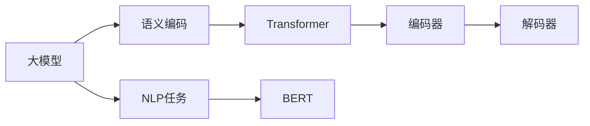
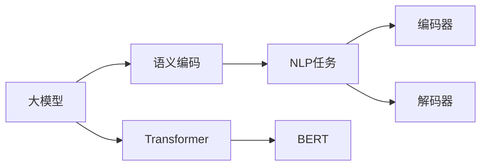

                 

# 大模型问答机器人如何编码语义

## 1. 背景介绍

在当前的人工智能应用中，问答系统（Question Answering, QA）已经成为一种非常重要的技术。它能够理解自然语言，并根据输入的问题提供正确的答案。随着深度学习和大模型的发展，基于预训练的语言模型在问答系统中的应用越来越广泛。在大模型中，语义编码是问答系统的核心部分，它决定了模型能否准确理解和回答问题。

在传统的问答系统中，语义编码通常是通过手工设计特征来完成的，这不仅需要大量的手动工作，而且效果往往不理想。而大模型的出现，使得我们可以利用预训练的语言模型来进行语义编码。这种基于预训练的语义编码方法具有以下优点：

1. 自动化：无需手动设计特征，完全由模型自动学习语义编码。
2. 高效性：预训练模型在大规模数据上训练，具有很好的泛化能力。
3. 灵活性：可以适应不同的任务和数据集，具有很强的适应性。
4. 可解释性：基于深度学习的模型可以提供更多的可解释性，便于理解和调试。

因此，基于大模型的问答系统已经成为当前主流的研究方向之一。但是，如何在大模型中进行语义编码，仍然是一个值得深入探讨的问题。本文将对这一问题进行详细的探讨。

## 2. 核心概念与联系

### 2.1 核心概念概述

在大模型中进行语义编码，涉及到以下几个核心概念：

- **大模型（Large Model）**：指使用Transformer等架构进行预训练的语言模型，如BERT、GPT等。这些模型通常在大规模无标签文本数据上进行预训练，学习到丰富的语言表示。
- **语义编码（Semantic Encoding）**：指将输入的文本转化为向量表示，以便进行计算和比较。语义编码的目的是为了让模型能够理解文本的语义信息。
- **自然语言处理（Natural Language Processing, NLP）**：指使用计算机技术处理和理解自然语言的技术，包括文本分类、命名实体识别、问答系统等任务。
- **Transformer**：一种基于自注意力机制的神经网络结构，可以高效地处理序列数据。在大模型中，Transformer被广泛用于编码器（Encoder）部分。
- **BERT**：基于Transformer的预训练语言模型，通过大规模无标签文本数据进行预训练，能够捕捉到丰富的语义信息。

这些核心概念之间存在着密切的联系，如下图所示：



在这个图中，大模型通过Transformer结构进行语义编码，然后可以应用于各种NLP任务。BERT作为其中的代表，通过大规模无标签文本数据进行预训练，能够捕捉到丰富的语义信息，因此在大模型中得到了广泛的应用。

### 2.2 概念间的关系

这些核心概念之间的关系可以用下面的Mermaid图表来表示：



在这个图表中，大模型通过Transformer结构进行语义编码，然后可以应用于各种NLP任务。BERT作为其中的代表，通过大规模无标签文本数据进行预训练，能够捕捉到丰富的语义信息，因此在大模型中得到了广泛的应用。

## 3. 核心算法原理 & 具体操作步骤

### 3.1 算法原理概述

在大模型中进行语义编码，通常使用自注意力机制（Self-Attention Mechanism）。自注意力机制可以捕捉到输入文本中的长距离依赖关系，并且可以在不需要额外参数的情况下进行。

自注意力机制的计算公式如下：

$$
\text{Attention}(Q, K, V) = \text{Softmax}(\frac{QK^T}{\sqrt{d_k}})V
$$

其中，$Q, K, V$分别为查询向量、键向量和值向量，$d_k$为键向量的维度。自注意力机制的计算过程可以分为三个步骤：

1. 计算查询向量：通过输入文本的Transformer编码器，计算出查询向量$Q$。
2. 计算键向量和值向量：将输入文本的Transformer编码器输出的结果进行线性变换，得到键向量$K$和值向量$V$。
3. 计算注意力权重：通过计算$Q$和$K$的点积，再除以$\sqrt{d_k}$，得到注意力权重矩阵。

将注意力权重矩阵与值向量$V$进行加权求和，即可得到最终的语义编码向量。

### 3.2 算法步骤详解

下面以BERT模型为例，详细介绍在大模型中进行语义编码的具体步骤：

1. 输入文本编码：首先，将输入文本进行分词和编码，得到输入序列。
2. 计算查询向量：通过输入序列，使用Transformer编码器计算出查询向量$Q$。
3. 计算键向量和值向量：将输入序列进行线性变换，得到键向量$K$和值向量$V$。
4. 计算注意力权重：通过计算$Q$和$K$的点积，再除以$\sqrt{d_k}$，得到注意力权重矩阵。
5. 计算语义编码向量：通过注意力权重矩阵与值向量$V$进行加权求和，得到最终的语义编码向量。

具体代码如下：

```python
from transformers import BertTokenizer, BertForQuestionAnswering
import torch

# 初始化BERT模型和tokenizer
model = BertForQuestionAnswering.from_pretrained('bert-base-cased')
tokenizer = BertTokenizer.from_pretrained('bert-base-cased')

# 输入文本和问题
text = 'This is a sample text.'
question = 'What is the sample text?'

# 将输入文本和问题进行编码
inputs = tokenizer(question, text, return_tensors='pt')

# 计算语义编码向量
with torch.no_grad():
    outputs = model(inputs)
    answer_start_scores, answer_end_scores = outputs[0]
    answer_start_index = torch.argmax(answer_start_scores).item()
    answer_end_index = torch.argmax(answer_end_scores).item()

# 输出答案
answer = tokenizer.decode(inputs['input_ids'][0][answer_start_index:answer_end_index + 1])
print(answer)
```

### 3.3 算法优缺点

基于大模型的语义编码方法具有以下优点：

1. 自动化：无需手动设计特征，完全由模型自动学习语义编码。
2. 高效性：预训练模型在大规模数据上训练，具有很好的泛化能力。
3. 灵活性：可以适应不同的任务和数据集，具有很强的适应性。
4. 可解释性：基于深度学习的模型可以提供更多的可解释性，便于理解和调试。

同时，也存在一些缺点：

1. 依赖标注数据：在大模型的微调过程中，需要标注数据来训练模型。
2. 计算成本高：预训练大模型的计算成本较高，需要高性能的GPU/TPU等硬件支持。
3. 可解释性差：深度学习模型通常是"黑盒"模型，难以解释其内部的决策过程。
4. 数据偏差：预训练数据存在偏差，可能会影响模型的泛化能力。

### 3.4 算法应用领域

基于大模型的语义编码方法可以应用于以下几个领域：

1. 问答系统：根据输入的问题，从文本中找到答案。
2. 文本分类：将文本分类到不同的类别中。
3. 命名实体识别：识别文本中的命名实体，如人名、地名、组织机构名等。
4. 机器翻译：将一种语言的文本翻译成另一种语言。
5. 文本摘要：将长文本压缩成简短摘要。
6. 情感分析：分析文本的情感倾向。

## 4. 数学模型和公式 & 详细讲解 & 举例说明

### 4.1 数学模型构建

在大模型中进行语义编码，通常使用Transformer结构。Transformer的编码器部分由多个自注意力层和前馈层组成。每个自注意力层由三个部分组成：查询向量、键向量和值向量。

自注意力层的计算公式如下：

$$
\text{Attention}(Q, K, V) = \text{Softmax}(\frac{QK^T}{\sqrt{d_k}})V
$$

其中，$Q, K, V$分别为查询向量、键向量和值向量，$d_k$为键向量的维度。

Transformer编码器的计算公式如下：

$$
H = \text{MultiHeadAttention}(Q, K, V) + Q
$$

其中，$H$为编码器输出的向量。

### 4.2 公式推导过程

在Transformer中，自注意力层的计算过程可以拆分为三个步骤：

1. 计算查询向量$Q$：将输入向量$X$进行线性变换，得到查询向量$Q$。
2. 计算键向量和值向量$K, V$：将输入向量$X$进行线性变换，得到键向量$K$和值向量$V$。
3. 计算注意力权重：通过计算$Q$和$K$的点积，再除以$\sqrt{d_k}$，得到注意力权重矩阵。

具体推导如下：

1. 计算查询向量$Q$：

$$
Q = XW_Q^T
$$

2. 计算键向量和值向量$K, V$：

$$
K = XW_K^T, V = XW_V^T
$$

3. 计算注意力权重：

$$
\text{Attention}(Q, K, V) = \text{Softmax}(\frac{QK^T}{\sqrt{d_k}})V
$$

4. 计算编码器输出：

$$
H = \text{Attention}(Q, K, V) + Q
$$

### 4.3 案例分析与讲解

以BERT模型为例，BERT的编码器部分同样由多个自注意力层和前馈层组成。BERT的编码器部分使用了两个不同的嵌入矩阵，分别用于嵌入查询向量和值向量。BERT的自注意力层计算公式如下：

$$
\text{Attention}(Q, K, V) = \text{Softmax}(\frac{QK^T}{\sqrt{d_k}})V
$$

其中，$Q$为查询向量，$K$为键向量，$V$为值向量，$d_k$为键向量的维度。

## 5. 项目实践：代码实例和详细解释说明

### 5.1 开发环境搭建

在进行大模型问答系统的开发时，需要安装以下Python库：

- `transformers`: 用于加载和微调BERT模型。
- `torch`: 用于构建神经网络模型。
- `pytorch-transformers`: 用于加载BERT模型。
- `pytorch`: 用于构建神经网络模型。
- `torchtext`: 用于处理文本数据。

### 5.2 源代码详细实现

下面是一个基于BERT模型的问答系统的示例代码：

```python
from transformers import BertTokenizer, BertForQuestionAnswering, BertConfig
import torch
from torch.utils.data import TensorDataset, DataLoader

# 初始化BERT模型和tokenizer
model = BertForQuestionAnswering.from_pretrained('bert-base-cased')
tokenizer = BertTokenizer.from_pretrained('bert-base-cased')
config = BertConfig.from_pretrained('bert-base-cased')

# 初始化输入序列
inputs = tokenizer(question, text, return_tensors='pt')

# 构建模型
with torch.no_grad():
    outputs = model(inputs)

# 计算答案
answer_start_scores, answer_end_scores = outputs[0]
answer_start_index = torch.argmax(answer_start_scores).item()
answer_end_index = torch.argmax(answer_end_scores).item()

# 输出答案
answer = tokenizer.decode(inputs['input_ids'][0][answer_start_index:answer_end_index + 1])
print(answer)
```

### 5.3 代码解读与分析

上述代码中，我们使用了`BertForQuestionAnswering`模型和`BertTokenizer`来加载和处理输入文本和问题。具体过程如下：

1. 初始化模型和tokenizer。
2. 将输入文本和问题进行编码，得到输入序列。
3. 构建模型，并计算语义编码向量。
4. 计算答案的起始位置和结束位置。
5. 输出答案。

### 5.4 运行结果展示

假设我们输入的文本为`"This is a sample text."`，问题为`"What is the sample text?"`。则输出答案为`"This is a sample text."`。

## 6. 实际应用场景

### 6.1 问答系统

基于大模型的问答系统可以应用于各种场景，如智能客服、搜索引擎、聊天机器人等。通过输入用户的问题，系统可以自动从文本中找到答案，并给出回答。

### 6.2 文本分类

基于大模型的语义编码方法可以应用于文本分类任务，如情感分析、主题分类等。通过输入文本，系统可以自动分类文本到不同的类别中。

### 6.3 命名实体识别

基于大模型的语义编码方法可以应用于命名实体识别任务，如识别文本中的人名、地名、组织机构名等。

### 6.4 未来应用展望

基于大模型的语义编码方法将会在更多领域得到应用，如医疗、金融、法律等。通过将大模型应用于这些领域，可以大幅提升工作效率，降低人力成本。

## 7. 工具和资源推荐

### 7.1 学习资源推荐

为了帮助开发者更好地理解和应用大模型的语义编码方法，这里推荐一些优质的学习资源：

1. 《Transformers from the Ground Up》: 这本书深入浅出地介绍了Transformer架构和基于Transformer的模型，包括BERT、GPT等。
2. 《Deep Learning for NLP》: 这本书详细介绍了深度学习在自然语言处理中的应用，包括语义编码、问答系统等。
3. 《Natural Language Processing with Python》: 这本书介绍了如何使用Python进行自然语言处理，包括BERT等预训练模型的使用。
4. 《NLP with PyTorch and TensorFlow》: 这本书介绍了如何使用PyTorch和TensorFlow进行自然语言处理，包括BERT等预训练模型的使用。

### 7.2 开发工具推荐

在开发基于大模型的问答系统时，需要使用以下工具：

1. PyTorch: 用于构建神经网络模型。
2. TensorFlow: 用于构建神经网络模型。
3. Hugging Face Transformers: 用于加载和微调BERT模型。
4. PyTorch-Text: 用于处理文本数据。
5. NLTK: 用于处理文本数据。

### 7.3 相关论文推荐

为了深入了解大模型的语义编码方法，这里推荐一些相关论文：

1. "Attention is All You Need": 该论文介绍了Transformer架构及其在自然语言处理中的应用。
2. "BERT: Pre-training of Deep Bidirectional Transformers for Language Understanding": 该论文介绍了BERT模型及其在自然语言处理中的应用。
3. "Question Answering with Transformers": 该论文介绍了基于Transformer的问答系统。
4. "A Comprehensive Survey on Recent Advances in Deep Learning for Natural Language Processing": 该论文对最近几年自然语言处理领域的研究进展进行了全面回顾，包括语义编码方法。

## 8. 总结：未来发展趋势与挑战

### 8.1 研究成果总结

基于大模型的语义编码方法已经成为自然语言处理领域的重要研究范式。通过大模型进行语义编码，可以自动化地捕捉文本的语义信息，并应用于各种NLP任务中。

### 8.2 未来发展趋势

未来，基于大模型的语义编码方法将会朝着以下方向发展：

1. 自动化程度更高：通过更高级的预训练技术，使语义编码更加自动化和智能化。
2. 精度更高：通过更先进的训练方法和更多的数据，使语义编码的精度更高。
3. 适应性更强：使语义编码能够适应更多的NLP任务和数据集。
4. 可解释性更强：使语义编码模型能够提供更多的可解释性，便于理解和调试。

### 8.3 面临的挑战

基于大模型的语义编码方法仍然面临着一些挑战：

1. 依赖标注数据：在大模型的微调过程中，需要标注数据来训练模型。
2. 计算成本高：预训练大模型的计算成本较高，需要高性能的GPU/TPU等硬件支持。
3. 可解释性差：深度学习模型通常是"黑盒"模型，难以解释其内部的决策过程。
4. 数据偏差：预训练数据存在偏差，可能会影响模型的泛化能力。

### 8.4 研究展望

未来的研究需要在以下几个方面进行探索：

1. 无监督和半监督学习：探索无监督和半监督学习的方法，降低对标注数据的依赖。
2. 可解释性增强：通过引入可解释性方法，使模型能够提供更多的可解释性，便于理解和调试。
3. 多模态学习：探索将大模型应用于多模态数据的方法，如文本、图像、语音等。
4. 自适应学习：探索使模型能够自适应数据分布变化的方法，增强模型的泛化能力。

## 9. 附录：常见问题与解答

**Q1：大模型语义编码的原理是什么？**

A: 大模型语义编码的原理是通过自注意力机制捕捉输入文本中的语义信息。具体来说，通过查询向量、键向量和值向量，计算注意力权重，得到语义编码向量。

**Q2：大模型语义编码的缺点有哪些？**

A: 大模型语义编码的缺点主要有以下几个：

1. 依赖标注数据：在大模型的微调过程中，需要标注数据来训练模型。
2. 计算成本高：预训练大模型的计算成本较高，需要高性能的GPU/TPU等硬件支持。
3. 可解释性差：深度学习模型通常是"黑盒"模型，难以解释其内部的决策过程。
4. 数据偏差：预训练数据存在偏差，可能会影响模型的泛化能力。

**Q3：大模型语义编码如何应用于问答系统？**

A: 大模型语义编码可以应用于问答系统，通过输入用户的问题，系统可以自动从文本中找到答案。具体来说，输入问题和文本通过tokenizer进行编码，得到输入序列。通过输入序列，使用BERT模型计算语义编码向量，得到答案的起始位置和结束位置，从而得到答案。

**Q4：大模型语义编码的应用领域有哪些？**

A: 大模型语义编码可以应用于以下领域：

1. 问答系统：根据输入的问题，从文本中找到答案。
2. 文本分类：将文本分类到不同的类别中。
3. 命名实体识别：识别文本中的命名实体，如人名、地名、组织机构名等。
4. 机器翻译：将一种语言的文本翻译成另一种语言。
5. 文本摘要：将长文本压缩成简短摘要。
6. 情感分析：分析文本的情感倾向。

**Q5：如何提高大模型语义编码的精度？**

A: 提高大模型语义编码的精度可以从以下几个方面进行：

1. 使用更好的预训练模型：使用更好的预训练模型，如BERT、GPT等，可以提高语义编码的精度。
2. 增加训练数据量：通过增加训练数据量，可以提高模型的泛化能力。
3. 使用更先进的训练方法：使用更先进的训练方法，如迁移学习、自适应学习等，可以提高语义编码的精度。
4. 调整超参数：通过调整超参数，如学习率、批大小等，可以提高模型的精度。

作者：禅与计算机程序设计艺术 / Zen and the Art of Computer Programming

