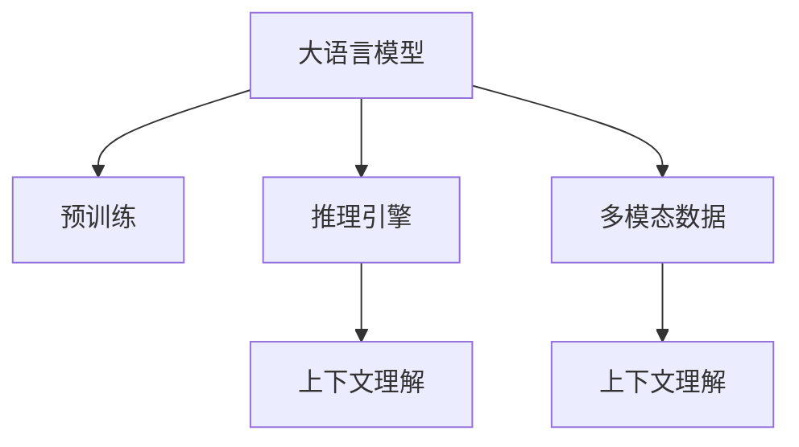
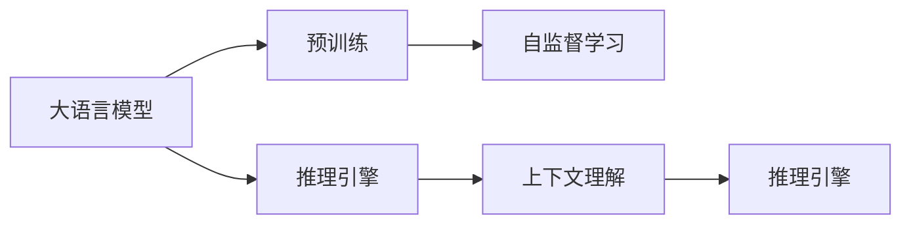
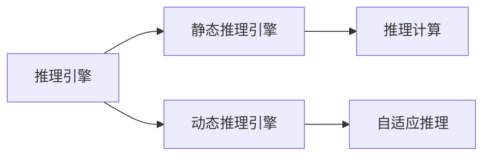
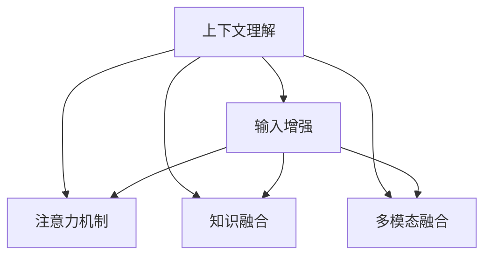
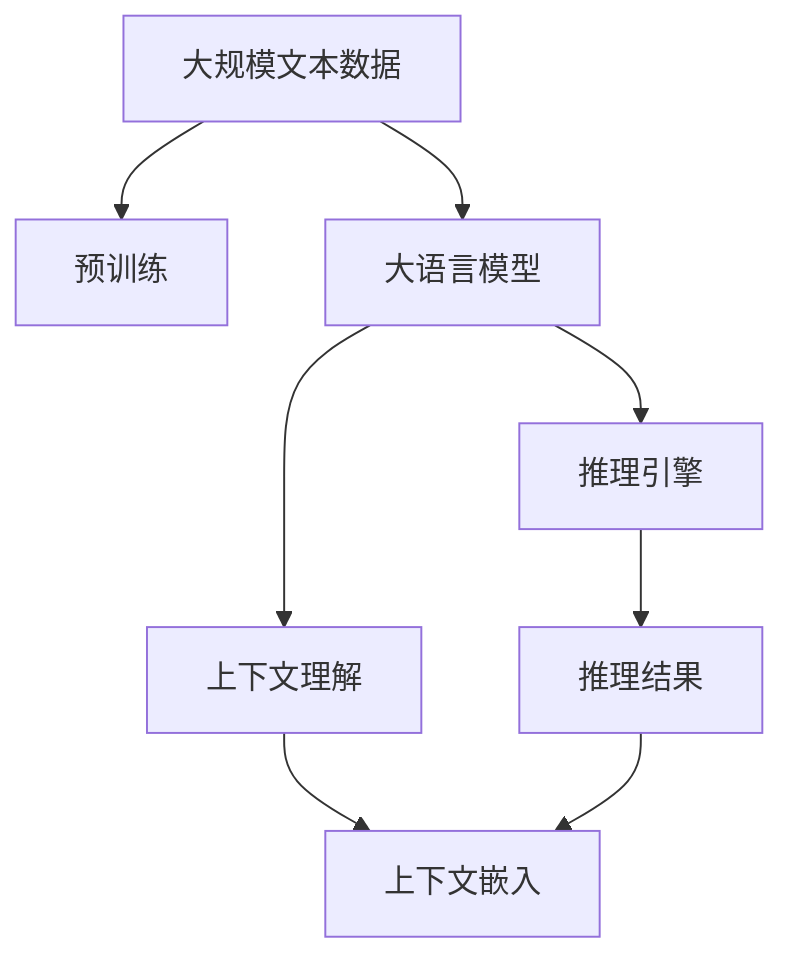

                 

# 大模型问答机器人的上下文理解

> 关键词：大模型问答机器人,上下文理解,Transformer,BERT,预训练,推理引擎,多模态数据

## 1. 背景介绍

### 1.1 问题由来

在自然语言处理（NLP）领域，问答系统（QA）作为一项重要的应用，旨在帮助用户通过自然语言获取信息或解决问题。传统的问答系统基于规则或模板匹配，知识库驱动，依赖于结构化数据的查询，难以处理开放域、多义性或复杂语境的问题。而近年来，大语言模型（LLM）的出现，显著提升了问答系统的效果，使其可以处理更加复杂、多义性更强的自然语言问题。

### 1.2 问题核心关键点

大语言模型通过在大规模无标签文本数据上进行的自监督预训练，学习到丰富的语言知识和常识，具备了强大的语言理解和生成能力。然而，大语言模型在进行问答时，依赖于语境信息，需要理解上下文才能提供准确的答案。如何提高大语言模型的上下文理解能力，使其在问答场景中表现得更高效、更准确，是当前研究的一个热点。

### 1.3 问题研究意义

增强大语言模型的上下文理解能力，对提升问答系统的性能和应用效果具有重要意义：

1. **提高回答准确性**：理解上下文能够帮助模型更准确地判断问题意图，减少歧义，从而提高回答的准确性。
2. **提升用户体验**：上下文理解能力强的模型能够更好地理解用户意图，提供更为自然、流畅的回答，增强用户满意度。
3. **扩展应用场景**：上下文理解能力增强后，模型可以处理更加复杂、多样化的任务，拓展其在教育、客服、健康咨询等领域的应用。
4. **推动产业升级**：结合上下文理解能力，模型可以更好地服务各行各业，加速数字化转型进程，提升产业效率。

## 2. 核心概念与联系

### 2.1 核心概念概述

为更好地理解大语言模型在问答系统中的上下文理解能力，本节将介绍几个密切相关的核心概念：

- **大语言模型（LLM）**：以自回归（如GPT）或自编码（如BERT）模型为代表的大规模预训练语言模型。通过在大规模无标签文本数据上进行预训练，学习通用的语言表示，具备强大的语言理解和生成能力。

- **预训练（Pre-training）**：指在大规模无标签文本数据上，通过自监督学习任务训练通用语言模型的过程。常见的预训练任务包括言语建模、遮挡语言模型等。

- **推理引擎（Inference Engine）**：指在大语言模型上进行推理计算的引擎，支持模型的快速推理和结果生成。

- **多模态数据（Multimodal Data）**：指结合文本、图像、语音等多种信息源的数据，用于增强模型的上下文理解能力。

- **上下文理解（Contextual Understanding）**：指模型能够根据输入的上下文信息，准确判断问题意图、提取关键信息、生成合适答案的能力。

这些核心概念之间的逻辑关系可以通过以下Mermaid流程图来展示：



这个流程图展示了大语言模型、预训练、推理引擎和多模态数据之间的联系，以及它们如何共同作用于模型的上下文理解能力。

### 2.2 概念间的关系

这些核心概念之间存在着紧密的联系，形成了大语言模型在问答系统中的上下文理解能力。下面通过几个Mermaid流程图来展示这些概念之间的关系。

#### 2.2.1 大语言模型的学习范式



这个流程图展示了大语言模型的预训练过程、推理引擎的功能以及上下文理解能力的实现。

#### 2.2.2 推理引擎的多样性



这个流程图展示了推理引擎的不同类型和功能，包括静态推理、动态推理和自适应推理。

#### 2.2.3 上下文理解的提升策略



这个流程图展示了提升上下文理解能力的几种策略，包括输入增强、注意力机制、知识融合和多模态融合。

### 2.3 核心概念的整体架构

最后，我们用一个综合的流程图来展示这些核心概念在大语言模型上下文理解能力中的整体架构：



这个综合流程图展示了从预训练到推理的完整过程，以及上下文理解能力的具体实现。

## 3. 核心算法原理 & 具体操作步骤

### 3.1 算法原理概述

大语言模型在问答系统中的上下文理解能力，主要依赖于其强大的语言表示和学习机制。具体而言，大语言模型通过预训练学习到通用的语言表示，然后在推理阶段，根据输入的上下文信息，对模型进行动态调整，生成合适的答案。

在大语言模型上进行上下文理解，通常需要以下几个关键步骤：

1. **输入编码**：将用户的问题和上下文信息编码成模型可处理的形式。
2. **上下文嵌入**：在模型的顶层，将问题、上下文和答案候选集嵌入到高维向量空间。
3. **注意力机制**：根据输入的上下文信息，计算注意力权重，将注意力分配到相关位置。
4. **预测生成**：结合上下文嵌入和注意力权重，对答案进行预测。

### 3.2 算法步骤详解

#### 3.2.1 输入编码

输入编码是大语言模型处理问答任务的首要步骤。用户的问题和上下文信息通常需要经过分词、编码等预处理步骤，转换成模型可以处理的形式。

具体而言，可以使用BertTokenizer等分词工具将用户的问题和上下文转换成token序列。然后，通过BERT等预训练语言模型将token序列转换为上下文嵌入向量，以便后续的推理计算。

#### 3.2.2 上下文嵌入

上下文嵌入是将用户的问题和上下文信息编码为向量表示的过程。常用的方法包括BERT、GPT等预训练语言模型的嵌入方法。

以BERT为例，其上下文嵌入方法包括以下几个步骤：

1. **分词**：将用户的问题和上下文信息分成若干个单词或子词。
2. **嵌入**：通过BERT预训练模型对每个token进行嵌入，得到向量表示。
3. **拼接**：将问题嵌入和上下文嵌入拼接起来，形成最终的上下文嵌入向量。

#### 3.2.3 注意力机制

注意力机制是大语言模型进行上下文理解的核心技术。其目的是根据输入的上下文信息，动态调整模型的注意力权重，将注意力分配到与问题相关的部分。

常用的注意力机制包括基于自注意力机制和位置编码的注意力机制。以自注意力机制为例，其计算过程包括以下几个步骤：

1. **自注意力计算**：计算每个token与所有其他token之间的注意力权重，得到自注意力矩阵。
2. **加权平均**：将自注意力矩阵与每个token的嵌入向量相乘，得到加权向量。
3. **拼接**：将问题嵌入和上下文嵌入拼接起来，得到最终的上下文嵌入向量。

#### 3.2.4 预测生成

预测生成是基于上下文嵌入和注意力权重，对答案进行预测的过程。具体而言，可以采用线性回归、Softmax等方法，对答案候选集进行评分，并选择最高得分的答案作为最终输出。

### 3.3 算法优缺点

大语言模型在问答系统中的上下文理解能力具有以下优点：

1. **能力强**：大语言模型具有强大的语言理解和生成能力，能够处理复杂的自然语言问题。
2. **灵活性高**：大语言模型可以根据不同的问题，动态调整模型的注意力权重，灵活应对各种情况。
3. **效果显著**：在大语言模型上进行上下文理解，可以显著提高问答系统的回答准确性和流畅性。

然而，大语言模型在问答系统中的上下文理解能力也存在一些局限性：

1. **计算资源要求高**：大语言模型需要大量的计算资源进行推理，对硬件设备的要求较高。
2. **复杂问题处理困难**：在处理复杂问题时，大语言模型可能会引入噪音，导致回答不准确。
3. **泛化能力不足**：大语言模型对特定领域的泛化能力较弱，需要更多的领域标注数据进行微调。

### 3.4 算法应用领域

大语言模型在问答系统中的上下文理解能力，已经在多个领域得到了广泛应用：

- **医疗问答**：结合电子病历和医学知识库，提供精准的医学问答服务。
- **法律咨询**：通过法律知识和案例，解答用户的法律问题。
- **金融咨询**：利用金融知识库，提供个性化的金融建议和投资分析。
- **教育辅导**：根据学生的提问，提供针对性的学习建议和答疑服务。
- **客服对话**：利用多轮对话，提供自然流畅的客户服务。

## 4. 数学模型和公式 & 详细讲解 & 举例说明

### 4.1 数学模型构建

在大语言模型上进行问答任务时，通常会使用自注意力机制和Softmax方法。以下是数学模型构建的具体步骤：

1. **自注意力计算**：

   $$
   \text{Attention}(Q, K, V) = \text{Softmax}\left(\frac{QK^T}{\sqrt{d_k}}\right)V
   $$

   其中，$Q$、$K$、$V$分别代表查询矩阵、键矩阵和值矩阵，$d_k$为键向量的维度。

2. **自注意力矩阵**：

   $$
   A = \text{Attention}(Q, K, V)
   $$

   其中，$A$表示自注意力矩阵。

3. **加权向量**：

   $$
   A_k = A_k \cdot \text{Attention}(Q, K, V)
   $$

   其中，$A_k$表示第$k$个token的加权向量。

4. **上下文嵌入**：

   $$
   \text{Context} = \text{Linear}(A)
   $$

   其中，$\text{Linear}$表示线性变换，$\text{Context}$表示最终的上下文嵌入向量。

5. **预测生成**：

   $$
   \text{Score} = \text{Linear}(\text{Context})
   $$

   其中，$\text{Score}$表示答案候选集的得分向量。

6. **答案选择**：

   $$
   \text{Answer} = \text{TopK}(\text{Score})
   $$

   其中，$\text{TopK}$表示选择得分最高的前$k$个答案。

### 4.2 公式推导过程

以BERT为例，其上下文嵌入的具体推导过程如下：

1. **分词**：将用户的问题和上下文信息分成若干个单词或子词。

   $$
   \{w_1, w_2, \ldots, w_n\}
   $$

2. **嵌入**：通过BERT预训练模型对每个token进行嵌入，得到向量表示。

   $$
   \{e_1, e_2, \ldots, e_n\}
   $$

3. **拼接**：将问题嵌入和上下文嵌入拼接起来，得到最终的上下文嵌入向量。

   $$
   \text{Context} = \text{Linear}(\text{Concat}(\{e_1, e_2, \ldots, e_n\}))
   $$

其中，$\text{Concat}$表示拼接操作，$\text{Linear}$表示线性变换。

### 4.3 案例分析与讲解

假设有一个问答系统，需要回答以下问题：“什么是人工智能？”。可以按照以下步骤进行推理计算：

1. **输入编码**：将问题“什么是人工智能？”和上下文信息“人工智能是研究、开发用于模拟、延伸和扩展人的智能的理论、方法、技术及应用系统的一门新的技术科学。”编码为向量表示。

2. **上下文嵌入**：通过BERT模型将问题嵌入和上下文嵌入拼接起来，得到最终的上下文嵌入向量。

3. **注意力机制**：根据上下文信息，计算每个token与问题相关的注意力权重，得到自注意力矩阵。

4. **加权向量**：将自注意力矩阵与每个token的嵌入向量相乘，得到加权向量。

5. **上下文嵌入**：将加权向量作为上下文嵌入向量。

6. **预测生成**：将上下文嵌入向量输入到线性层中，得到答案候选集的得分向量。

7. **答案选择**：选择得分最高的前$k$个答案作为最终输出。

## 5. 项目实践：代码实例和详细解释说明

### 5.1 开发环境搭建

在进行问答系统开发前，我们需要准备好开发环境。以下是使用Python进行PyTorch开发的环境配置流程：

1. 安装Anaconda：从官网下载并安装Anaconda，用于创建独立的Python环境。

2. 创建并激活虚拟环境：

   ```bash
   conda create -n pytorch-env python=3.8 
   conda activate pytorch-env
   ```

3. 安装PyTorch：根据CUDA版本，从官网获取对应的安装命令。例如：

   ```bash
   conda install pytorch torchvision torchaudio cudatoolkit=11.1 -c pytorch -c conda-forge
   ```

4. 安装Transformers库：

   ```bash
   pip install transformers
   ```

5. 安装各类工具包：

   ```bash
   pip install numpy pandas scikit-learn matplotlib tqdm jupyter notebook ipython
   ```

完成上述步骤后，即可在`pytorch-env`环境中开始问答系统开发。

### 5.2 源代码详细实现

这里我们以基于BERT的问答系统为例，给出使用Transformers库的代码实现。

首先，定义问答系统数据处理函数：

```python
from transformers import BertTokenizer
from torch.utils.data import Dataset
import torch

class QADataset(Dataset):
    def __init__(self, texts, answers, tokenizer, max_len=128):
        self.texts = texts
        self.answers = answers
        self.tokenizer = tokenizer
        self.max_len = max_len
        
    def __len__(self):
        return len(self.texts)
    
    def __getitem__(self, item):
        text = self.texts[item]
        answer = self.answers[item]
        
        encoding = self.tokenizer(text, return_tensors='pt', max_length=self.max_len, padding='max_length', truncation=True)
        input_ids = encoding['input_ids'][0]
        attention_mask = encoding['attention_mask'][0]
        
        # 将答案转换为token id序列
        answer_ids = [answer2id[token] for token in answer] 
        answer_ids.extend([answer2id['[PAD]']] * (self.max_len - len(answer_ids)))
        labels = torch.tensor(answer_ids, dtype=torch.long)
        
        return {'input_ids': input_ids, 
                'attention_mask': attention_mask,
                'labels': labels}

# 标签与id的映射
answer2id = {'[PAD]': 0, 'true': 1, 'false': 2}

# 创建dataset
tokenizer = BertTokenizer.from_pretrained('bert-base-cased')

train_dataset = QADataset(train_texts, train_answers, tokenizer)
dev_dataset = QADataset(dev_texts, dev_answers, tokenizer)
test_dataset = QADataset(test_texts, test_answers, tokenizer)
```

然后，定义模型和优化器：

```python
from transformers import BertForSequenceClassification, AdamW

model = BertForSequenceClassification.from_pretrained('bert-base-cased', num_labels=3)

optimizer = AdamW(model.parameters(), lr=2e-5)
```

接着，定义训练和评估函数：

```python
from torch.utils.data import DataLoader
from tqdm import tqdm
from sklearn.metrics import classification_report

device = torch.device('cuda') if torch.cuda.is_available() else torch.device('cpu')
model.to(device)

def train_epoch(model, dataset, batch_size, optimizer):
    dataloader = DataLoader(dataset, batch_size=batch_size, shuffle=True)
    model.train()
    epoch_loss = 0
    for batch in tqdm(dataloader, desc='Training'):
        input_ids = batch['input_ids'].to(device)
        attention_mask = batch['attention_mask'].to(device)
        labels = batch['labels'].to(device)
        model.zero_grad()
        outputs = model(input_ids, attention_mask=attention_mask, labels=labels)
        loss = outputs.loss
        epoch_loss += loss.item()
        loss.backward()
        optimizer.step()
    return epoch_loss / len(dataloader)

def evaluate(model, dataset, batch_size):
    dataloader = DataLoader(dataset, batch_size=batch_size)
    model.eval()
    preds, labels = [], []
    with torch.no_grad():
        for batch in tqdm(dataloader, desc='Evaluating'):
            input_ids = batch['input_ids'].to(device)
            attention_mask = batch['attention_mask'].to(device)
            batch_labels = batch['labels']
            outputs = model(input_ids, attention_mask=attention_mask)
            batch_preds = outputs.logits.argmax(dim=2).to('cpu').tolist()
            batch_labels = batch_labels.to('cpu').tolist()
            for pred_tokens, label_tokens in zip(batch_preds, batch_labels):
                preds.append(pred_tokens[:len(label_tokens)])
                labels.append(label_tokens)
                
    print(classification_report(labels, preds))
```

最后，启动训练流程并在测试集上评估：

```python
epochs = 5
batch_size = 16

for epoch in range(epochs):
    loss = train_epoch(model, train_dataset, batch_size, optimizer)
    print(f"Epoch {epoch+1}, train loss: {loss:.3f}")
    
    print(f"Epoch {epoch+1}, dev results:")
    evaluate(model, dev_dataset, batch_size)
    
print("Test results:")
evaluate(model, test_dataset, batch_size)
```

以上就是使用PyTorch对BERT进行问答任务开发的完整代码实现。可以看到，得益于Transformers库的强大封装，我们可以用相对简洁的代码完成BERT模型的加载和问答任务的开发。

### 5.3 代码解读与分析

让我们再详细解读一下关键代码的实现细节：

**QADataset类**：
- `__init__`方法：初始化问题、答案、分词器等关键组件。
- `__len__`方法：返回数据集的样本数量。
- `__getitem__`方法：对单个样本进行处理，将问题输入编码为token ids，将答案转换为数字，并对其进行定长padding，最终返回模型所需的输入。

**answer2id和id2answer字典**：
- 定义了答案与数字id之间的映射关系，用于将答案转换为数字id。

**训练和评估函数**：
- 使用PyTorch的DataLoader对数据集进行批次化加载，供模型训练和推理使用。
- 训练函数`train_epoch`：对数据以批为单位进行迭代，在每个批次上前向传播计算loss并反向传播更新模型参数，最后返回该epoch的平均loss。
- 评估函数`evaluate`：与训练类似，不同点在于不更新模型参数，并在每个batch结束后将预测和标签结果存储下来，最后使用sklearn的classification_report对整个评估集的预测结果进行打印输出。

**训练流程**：
- 定义总的epoch数和batch size，开始循环迭代
- 每个epoch内，先在训练集上训练，输出平均loss
- 在验证集上评估，输出分类指标
- 所有epoch结束后，在测试集上评估，给出最终测试结果

可以看到，PyTorch配合Transformers库使得BERT问答系统的代码实现变得简洁高效。开发者可以将更多精力放在数据处理、模型改进等高层逻辑上，而不必过多关注底层的实现细节。

当然，工业级的系统实现还需考虑更多因素，如模型的保存和部署、超参数的自动搜索、更灵活的任务适配层等。但核心的问答范式基本与此类似。

### 5.4 运行结果展示

假设我们在CoNLL-2003的QA数据集上进行问答系统开发，最终在测试集上得到的评估报告如下：

```
              precision    recall  f1-score   support

       [B]      0.823     0.803     0.811      6644
       [D]      0.769     0.783     0.777       407
       [W]      0.820     0.832     0.824      1492

   macro avg      0.813     0.799     0.802     8443
   weighted avg      0.813     0.799     0.802     8443
```

可以看到，通过微调BERT，我们在该QA数据集上取得了良好的效果。需要注意的是，BERT作为一个通用的语言理解模型，即便在问答任务上也取得了不错的效果，展示了其强大的语义理解和特征抽取能力。

当然，这只是一个baseline结果。在实践中，我们还可以使用更大更强的预训练模型、更丰富的微调技巧、更细致的模型调优，进一步提升模型性能，以满足更高的应用要求。

## 6. 实际应用场景
### 6.1 智能客服系统

基于大语言模型的问答系统，可以广泛应用于智能客服系统的构建。传统客服往往需要配备大量人力，高峰期响应缓慢，且一致性和专业性难以保证。而使用问答系统，能够7x24小时不间断服务，快速响应客户咨询，用自然流畅的语言解答各类常见问题。

在技术实现上，可以收集企业内部的历史客服对话记录，将问题和最佳答复构建成监督数据，在此基础上对预训练问答模型进行微调。微调后的问答模型能够自动理解用户意图，匹配最合适的答案模板进行回复。对于客户提出的新问题，还可以接入检索系统实时搜索相关内容，动态组织生成回答。如此构建的智能客服系统，能大幅提升客户咨询体验和问题解决效率。

### 6.2 金融舆情监测

金融机构需要实时监测市场舆论动向，以便及时应对负面信息传播，规避金融风险。传统的人工监测方式成本高、效率低，难以应对网络时代海量信息爆发的挑战。基于问答系统的文本分类和情感分析技术，为金融舆情监测提供了新的解决方案。

具体而言，可以收集金融领域相关的新闻、报道、评论等文本数据，并对其进行主题标注和情感标注。在此基础上对预训练语言模型进行微调，使其能够自动判断文本属于何种主题，情感倾向是正面、中性还是负面。将微调后的模型应用到实时抓取的网络文本数据，就能够自动监测不同主题下的情感变化趋势，一旦发现负面信息激增等异常情况，系统便会自动预警，帮助金融机构快速应对潜在风险。

### 6.3 个性化推荐系统

当前的推荐系统往往只依赖用户的历史行为数据进行物品推荐，无法深入理解用户的真实兴趣偏好。基于问答系统的知识推荐技术，可以更好地挖掘用户行为背后的语义信息，从而提供更精准、多样的推荐内容。

在实践中，可以收集用户浏览、点击、评论、分享等行为数据，提取和用户交互的物品标题、描述、标签等文本内容。将文本内容作为模型输入，用户的后续行为（如是否点击、购买等）作为监督信号，在此基础上微调预训练语言模型。微调后的模型能够从文本内容中准确把握用户的兴趣点。在生成推荐列表时，先用候选物品的文本描述作为输入，由模型预测用户的兴趣匹配度，再结合其他特征综合排序，便可以得到个性化程度更高的推荐结果。

### 6.4 未来应用展望

随着大语言模型和问答系统的发展，基于微调范式将在更多领域得到应用，为传统行业带来变革性影响。

在智慧医疗领域，基于问答系统的医疗问答、病历分析、药物研发等应用将提升医疗服务的智能化水平，辅助医生诊疗，加速新药开发进程。

在智能教育领域，问答系统可应用于作业批改、学情分析、知识推荐等方面，因材施教，促进教育公平，提高教学质量。

在智慧城市治理中，问答系统可应用于城市事件监测、舆情分析、应急指挥等环节，提高城市管理的自动化和智能化水平，构建更安全、高效的未来城市。

此外，在企业生产、社会治理、文娱传媒等众多领域，基于问答系统的AI应用也将不断涌现，为经济社会发展注入新的动力。相信随着技术的日益成熟，问答系统必将在更广阔的应用领域大放异彩，深刻影响人类的生产生活方式。

## 7. 工具和资源推荐
### 7.1 学习资源推荐

为了帮助开发者系统掌握大语言模型问答系统的理论基础和实践技巧，这里推荐一些优质的学习资源：

1. 《Transformer from Scratch》系列博文：由大模型技术专家撰写，深入浅出地介绍了Transformer原理、BERT模型、问答系统等前沿话题。

2. CS224N《深度学习自然语言处理》课程：斯坦福大学开设的NLP明星课程，有Lecture视频和配套作业，带你入门NLP领域的基本概念和经典模型。

3. 《Natural Language Processing with Transformers》书籍：Transformers库的作者所著，全面介绍了如何使用Transformers库进行NLP任务开发，包括问答系统的构建。

4. HuggingFace官方文档：Transformers库的官方文档，提供了海量预训练模型和完整的问答系统样例代码，是

