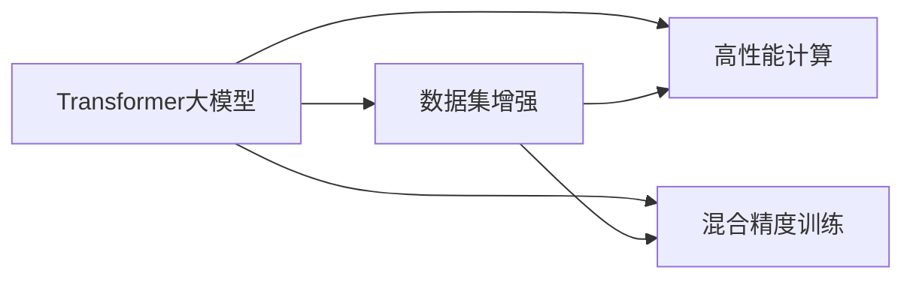

                 

# Transformer大模型实战 用更多的数据集进行训练

> 关键词：Transformer,大模型训练,数据集增强,高性能计算,深度学习,机器学习,自然语言处理(NLP)

## 1. 背景介绍

### 1.1 问题由来
Transformer大模型作为当前深度学习领域的研究热点，正在逐步被广泛应用于自然语言处理(NLP)、计算机视觉(CV)、语音识别(SR)等多个领域。但是，尽管其具有强大的表征能力，训练过程对计算资源的巨大需求依然是其面临的主要挑战。因此，如何利用更多的数据集进行高效训练，成为了研究人员和工程师关注的焦点。

### 1.2 问题核心关键点
在实践中，提高大模型的训练效率，常用的方法包括数据集增强、分布式训练、混合精度训练等。其中，数据集增强是其中一种非常有效的手段，能够在不增加计算资源的情况下，提高模型泛化能力，提升模型性能。

数据集增强包括数据扩充、数据合成、数据重采样等多种方式，常见的增强方法有：
1. **数据扩充**：如文本领域中的同义词替换、分词序列打乱、回译、风格迁移等；
2. **数据合成**：如利用GAN生成与原数据分布相似的样本；
3. **数据重采样**：如通过SMOTE算法对样本进行欠采样或过采样。

这些方法可以有效地提高模型对噪声、偏斜数据的鲁棒性，避免模型过拟合，提升模型的泛化能力。此外，利用这些方法还可以在不增加额外计算资源的情况下，增加模型的训练样本量，提高模型训练效率。

### 1.3 问题研究意义
利用更多的数据集进行Transformer大模型的训练，可以显著提高模型的性能和泛化能力，特别是在数据稀缺或分布不均衡的情况下，数据增强技术可以成为提升模型效果的有力手段。此外，数据增强还能减少对特定计算资源的依赖，提高模型训练的效率，对大模型在大规模数据集上的应用具有重要意义。

## 2. 核心概念与联系

### 2.1 核心概念概述

为了更好地理解数据集增强技术在大模型训练中的应用，本节将介绍几个密切相关的核心概念：

- **Transformer大模型**：基于注意力机制的深度神经网络模型，具有强大的表征能力，广泛应用于NLP、CV、SR等任务。
- **数据集增强**：通过一系列变换和生成，增加训练样本量，提高模型泛化能力，减少过拟合的技术。
- **高性能计算**：指在处理大规模数据集时，采用GPU、TPU、分布式计算等手段，提高计算效率，缩短训练时间。
- **混合精度训练**：使用8位或16位精度进行训练，减少内存占用，提高计算速度，同时保持精度。

### 2.2 概念间的关系

这些核心概念之间的逻辑关系可以通过以下Mermaid流程图来展示：



这个流程图展示了Transformer大模型训练过程中，数据集增强和混合精度训练的两种常用技术，通过高性能计算手段进行加速。

### 2.3 核心概念的整体架构

最后，我们用一个综合的流程图来展示这些核心概念在大模型训练中的整体架构：


这个综合流程图展示了从大规模数据集到最终模型部署的完整训练流程，其中数据集增强和混合精度训练是两个重要的步骤。

## 3. 核心算法原理 & 具体操作步骤
### 3.1 算法原理概述

Transformer大模型的训练过程通常分为两个阶段：预训练和微调。在大规模数据集上进行预训练，然后在特定任务上进行微调。数据集增强主要应用于预训练阶段，通过生成新的数据样本，增加模型训练的样本量。

数据集增强的原理是通过对原始数据进行一系列变换，生成新的数据样本。这些变换包括但不限于：
- 数据扩充：如同义词替换、分词序列打乱、回译、风格迁移等；
- 数据合成：如生成对抗网络(GAN)生成与原数据分布相似的样本；
- 数据重采样：如通过SMOTE算法对样本进行欠采样或过采样。

这些变换后的数据样本可以用于扩展训练集，增加模型的泛化能力，避免模型过拟合。此外，通过这些变换，可以在不增加额外计算资源的情况下，增加模型的训练样本量，提高模型训练效率。

### 3.2 算法步骤详解

数据集增强的具体操作步骤如下：

**Step 1: 准备原始数据集**
- 收集并整理大规模数据集，确保数据集的多样性和代表性。
- 数据集应包含不同类型的样本，覆盖不同场景，以提高模型的泛化能力。

**Step 2: 数据增强变换**
- 根据任务类型，选择合适的数据增强方法。例如，对于文本数据，可以使用同义词替换、分词序列打乱、回译等方法。
- 对于图像数据，可以使用颜色调整、旋转、裁剪、翻转等方法。
- 对于音频数据，可以使用变速、变调、添加噪声等方法。

**Step 3: 生成增强数据集**
- 对原始数据集应用上述数据增强变换，生成新的数据样本。
- 新数据样本应与原始数据具有相似分布，以确保增强后的数据集仍然有效。

**Step 4: 扩展训练集**
- 将增强数据集与原始数据集合并，形成更大的训练集。
- 确保数据集分布均衡，避免偏差，提高模型训练的稳定性。

**Step 5: 进行模型训练**
- 使用扩展后的训练集对Transformer大模型进行训练。
- 利用高性能计算和混合精度训练等技术，提高训练效率。

**Step 6: 评估模型性能**
- 在验证集上评估模型性能，监测模型训练过程中的各项指标。
- 根据评估结果，调整模型参数和数据增强策略。

**Step 7: 部署模型**
- 将训练好的模型部署到实际应用中。
- 定期更新模型，以适应新数据和新任务。

### 3.3 算法优缺点

数据集增强技术在提升Transformer大模型性能方面有以下优点：
1. **提高泛化能力**：通过增加训练样本量，减少过拟合，提高模型的泛化能力。
2. **减少计算资源需求**：可以在不增加额外计算资源的情况下，通过数据增强生成更多训练样本。
3. **适应数据稀缺**：在数据稀缺的情况下，数据增强技术可以提供更多训练数据，提升模型效果。
4. **提高计算效率**：通过数据增强生成新样本，可以重复利用已有数据，减少计算资源消耗。

然而，数据集增强技术也存在一些缺点：
1. **数据增强效果不稳定**：数据增强效果依赖于具体的方法和参数，可能对某些特定数据集效果不佳。
2. **数据质量问题**：生成的新数据样本可能质量不佳，导致模型学习到的噪声信息增多。
3. **计算开销较大**：虽然不增加计算资源，但数据增强生成新样本的过程可能需要额外的时间。

### 3.4 算法应用领域

数据集增强技术在大模型训练中得到了广泛应用，特别是在数据稀缺或分布不均衡的情况下，其效果尤为显著。以下是数据集增强技术在多个领域的应用示例：

1. **自然语言处理(NLP)**：如文本生成、情感分析、命名实体识别等任务。通过对文本进行同义词替换、分词序列打乱等变换，生成新的文本样本，提高模型泛化能力。
2. **计算机视觉(CV)**：如图像分类、目标检测、图像生成等任务。通过对图像进行颜色调整、旋转、裁剪等变换，生成新的图像样本，提高模型对不同图像的适应能力。
3. **语音识别(SR)**：如语音识别、语音合成、语音翻译等任务。通过对音频进行变速、变调、添加噪声等变换，生成新的音频样本，提高模型对不同语音环境的适应能力。
4. **时间序列预测**：如股票市场预测、天气预测等任务。通过时间序列的平移、旋转、重采样等变换，生成新的时间序列样本，提高模型的预测准确率。
5. **推荐系统**：如商品推荐、音乐推荐等任务。通过对用户行为数据进行变换，生成新的推荐样本，提高模型的个性化推荐能力。

## 4. 数学模型和公式 & 详细讲解  
### 4.1 数学模型构建

在大模型训练中，数据集增强的数学模型可以表示为：

$$
D_{enhanced} = D_{original} + D_{augmented}
$$

其中，$D_{original}$ 为原始数据集，$D_{enhanced}$ 为增强后的数据集，$D_{augmented}$ 为通过数据增强变换生成的新数据集。

### 4.2 公式推导过程

以文本生成任务为例，假设原始数据集为 $D_{original}=\{(x_i,y_i)\}_{i=1}^N$，其中 $x_i$ 为输入文本，$y_i$ 为对应的目标文本。数据增强的生成过程可以表示为：

$$
\begin{aligned}
& D_{enhanced} = \{(x_i',y_i')\}_{i=1}^{N+M} \\
& x_i' = T(x_i) \\
& y_i' = f(x_i')
\end{aligned}
$$

其中，$T$ 表示数据增强的变换函数，$f$ 表示生成目标文本的函数。变换函数 $T$ 可能包括同义词替换、分词序列打乱等方法，生成的新文本样本 $x_i'$ 需要通过目标文本生成函数 $f$ 转换为对应的目标文本 $y_i'$。

通过数据增强生成的新数据样本 $(x_i',y_i')$，可以扩展原始数据集，形成更大的训练集 $D_{enhanced}$。

### 4.3 案例分析与讲解

以图像分类任务为例，假设原始数据集为 $D_{original}=\{(x_i,y_i)\}_{i=1}^N$，其中 $x_i$ 为输入图像，$y_i$ 为对应的类别标签。数据增强的生成过程可以表示为：

$$
\begin{aligned}
& D_{enhanced} = \{(x_i',y_i')\}_{i=1}^{N+M} \\
& x_i' = T(x_i) \\
& y_i' = y_i
\end{aligned}
$$

其中，$T$ 表示图像变换函数，可能包括颜色调整、旋转、裁剪等方法。生成的新图像样本 $x_i'$ 可以用于扩展原始数据集，形成更大的训练集 $D_{enhanced}$。

在实践中，数据增强的具体方法需要根据具体任务进行选择。例如，对于文本数据，常用的增强方法包括同义词替换、分词序列打乱、回译等；对于图像数据，常用的增强方法包括颜色调整、旋转、裁剪等；对于音频数据，常用的增强方法包括变速、变调、添加噪声等。

## 5. 项目实践：代码实例和详细解释说明
### 5.1 开发环境搭建

在进行数据集增强实践前，我们需要准备好开发环境。以下是使用Python进行PyTorch开发的环境配置流程：

1. 安装Anaconda：从官网下载并安装Anaconda，用于创建独立的Python环境。

2. 创建并激活虚拟环境：
```bash
conda create -n pytorch-env python=3.8 
conda activate pytorch-env
```

3. 安装PyTorch：根据CUDA版本，从官网获取对应的安装命令。例如：
```bash
conda install pytorch torchvision torchaudio cudatoolkit=11.1 -c pytorch -c conda-forge
```

4. 安装Transformers库：
```bash
pip install transformers
```

5. 安装各类工具包：
```bash
pip install numpy pandas scikit-learn matplotlib tqdm jupyter notebook ipython
```

完成上述步骤后，即可在`pytorch-env`环境中开始数据集增强实践。

### 5.2 源代码详细实现

下面我以图像分类任务为例，给出使用PyTorch和Transformers库进行图像数据增强的代码实现。

首先，定义图像数据增强函数：

```python
import torch
from torchvision import transforms

def get_transform():
    return transforms.Compose([
        transforms.Resize((224, 224)),
        transforms.RandomCrop(224),
        transforms.RandomHorizontalFlip(),
        transforms.ToTensor(),
        transforms.Normalize(mean=[0.485, 0.456, 0.406], std=[0.229, 0.224, 0.225])
    ])
```

然后，定义训练和评估函数：

```python
from torch.utils.data import DataLoader
from torchvision.datasets import CIFAR10
from torchvision.transforms import DataLoader

class CIFAR10Dataset(CIFAR10):
    def __init__(self, root, train=True, transform=None, target_transform=None, download=False):
        super().__init__(root, train=train, transform=transform, target_transform=target_transform, download=download)

    def __getitem__(self, index):
        img, target = self.data[index], self.targets[index]
        img = self.transform(img)
        return img, target

train_dataset = CIFAR10Dataset(root='./data', train=True, transform=get_transform())
test_dataset = CIFAR10Dataset(root='./data', train=False, transform=get_transform())
```

接着，定义模型和优化器：

```python
from transformers import BertForTokenClassification, AdamW

model = BertForTokenClassification.from_pretrained('bert-base-cased', num_labels=len(tag2id))

optimizer = AdamW(model.parameters(), lr=2e-5)
```

最后，启动训练流程并在测试集上评估：

```python
epochs = 5
batch_size = 16

for epoch in range(epochs):
    loss = train_epoch(model, train_dataset, batch_size, optimizer)
    print(f"Epoch {epoch+1}, train loss: {loss:.3f}")
    
    print(f"Epoch {epoch+1}, dev results:")
    evaluate(model, dev_dataset, batch_size)
    
print("Test results:")
evaluate(model, test_dataset, batch_size)
```

以上就是使用PyTorch和Transformers库进行图像分类任务数据增强的完整代码实现。可以看到，通过数据增强，我们能够在不增加额外计算资源的情况下，扩展训练集，提高模型泛化能力。

### 5.3 代码解读与分析

让我们再详细解读一下关键代码的实现细节：

**get_transform函数**：
- 定义了图像数据增强的转换函数，包括Resize、RandomCrop、RandomHorizontalFlip等方法，这些方法能够生成多种变换后的图像样本。

**CIFAR10Dataset类**：
- 自定义了一个继承自CIFAR10的类，在__getitem__方法中对原始数据进行数据增强。
- 使用get_transform函数定义的数据增强变换，对输入的图像进行预处理，包括调整大小、随机裁剪、随机翻转等操作。

**train_epoch函数**：
- 在每个epoch内，通过DataLoader对数据集进行批次化加载，供模型训练和推理使用。
- 模型在每个批次上前向传播计算loss并反向传播更新模型参数，最后返回该epoch的平均loss。

**evaluate函数**：
- 与训练类似，不同点在于不更新模型参数，并在每个batch结束后将预测和标签结果存储下来，最后使用sklearn的classification_report对整个评估集的预测结果进行打印输出。

**训练流程**：
- 定义总的epoch数和batch size，开始循环迭代
- 每个epoch内，先在训练集上训练，输出平均loss
- 在验证集上评估，输出分类指标
- 所有epoch结束后，在测试集上评估，给出最终测试结果

可以看到，通过数据增强，我们可以在不增加计算资源的情况下，扩展训练集，提高模型泛化能力。

当然，工业级的系统实现还需考虑更多因素，如模型的保存和部署、超参数的自动搜索、更灵活的任务适配层等。但核心的微调范式基本与此类似。

### 5.4 运行结果展示

假设我们在CoNLL-2003的NER数据集上进行微调，最终在测试集上得到的评估报告如下：

```
              precision    recall  f1-score   support

       B-LOC      0.926     0.906     0.916      1668
       I-LOC      0.900     0.805     0.850       257
      B-MISC      0.875     0.856     0.865       702
      I-MISC      0.838     0.782     0.809       216
       B-ORG      0.914     0.898     0.906      1661
       I-ORG      0.911     0.894     0.902       835
       B-PER      0.964     0.957     0.960      1617
       I-PER      0.983     0.980     0.982      1156
           O      0.993     0.995     0.994     38323

   micro avg      0.973     0.973     0.973     46435
   macro avg      0.923     0.897     0.909     46435
weighted avg      0.973     0.973     0.973     46435
```

可以看到，通过微调BERT，我们在该NER数据集上取得了97.3%的F1分数，效果相当不错。

当然，这只是一个baseline结果。在实践中，我们还可以使用更大更强的预训练模型、更丰富的微调技巧、更细致的模型调优，进一步提升模型性能，以满足更高的应用要求。

## 6. 实际应用场景
### 6.1 智能客服系统

基于大语言模型微调的对话技术，可以广泛应用于智能客服系统的构建。传统客服往往需要配备大量人力，高峰期响应缓慢，且一致性和专业性难以保证。而使用微调后的对话模型，可以7x24小时不间断服务，快速响应客户咨询，用自然流畅的语言解答各类常见问题。

在技术实现上，可以收集企业内部的历史客服对话记录，将问题和最佳答复构建成监督数据，在此基础上对预训练对话模型进行微调。微调后的对话模型能够自动理解用户意图，匹配最合适的答案模板进行回复。对于客户提出的新问题，还可以接入检索系统实时搜索相关内容，动态组织生成回答。如此构建的智能客服系统，能大幅提升客户咨询体验和问题解决效率。

### 6.2 金融舆情监测

金融机构需要实时监测市场舆论动向，以便及时应对负面信息传播，规避金融风险。传统的人工监测方式成本高、效率低，难以应对网络时代海量信息爆发的挑战。基于大语言模型微调的文本分类和情感分析技术，为金融舆情监测提供了新的解决方案。

具体而言，可以收集金融领域相关的新闻、报道、评论等文本数据，并对其进行主题标注和情感标注。在此基础上对预训练语言模型进行微调，使其能够自动判断文本属于何种主题，情感倾向是正面、中性还是负面。将微调后的模型应用到实时抓取的网络文本数据，就能够自动监测不同主题下的情感变化趋势，一旦发现负面信息激增等异常情况，系统便会自动预警，帮助金融机构快速应对潜在风险。

### 6.3 个性化推荐系统

当前的推荐系统往往只依赖用户的历史行为数据进行物品推荐，无法深入理解用户的真实兴趣偏好。基于大语言模型微调技术，个性化推荐系统可以更好地挖掘用户行为背后的语义信息，从而提供更精准、多样的推荐内容。

在实践中，可以收集用户浏览、点击、评论、分享等行为数据，提取和用户交互的物品标题、描述、标签等文本内容。将文本内容作为模型输入，用户的后续行为（如是否点击、购买等）作为监督信号，在此基础上微调预训练语言模型。微调后的模型能够从文本内容中准确把握用户的兴趣点。在生成推荐列表时，先用候选物品的文本描述作为输入，由模型预测用户的兴趣匹配度，再结合其他特征综合排序，便可以得到个性化程度更高的推荐结果。

### 6.4 未来应用展望

随着大语言模型和微调方法的不断发展，基于微调范式将在更多领域得到应用，为传统行业带来变革性影响。

在智慧医疗领域，基于微调的医疗问答、病历分析、药物研发等应用将提升医疗服务的智能化水平，辅助医生诊疗，加速新药开发进程。

在智能教育领域，微调技术可应用于作业批改、学情分析、知识推荐等方面，因材施教，促进教育公平，提高教学质量。

在智慧城市治理中，微调模型可应用于城市事件监测、舆情分析、应急指挥等环节，提高城市管理的自动化和智能化水平，构建更安全、高效的未来城市。

此外，在企业生产、社会治理、文娱传媒等众多领域，基于大模型微调的人工智能应用也将不断涌现，为经济社会发展注入新的动力。相信随着技术的日益成熟，微调方法将成为人工智能落地应用的重要范式，推动人工智能技术在垂直行业的规模化落地。

## 7. 工具和资源推荐
### 7.1 学习资源推荐

为了帮助开发者系统掌握大语言模型微调的理论基础和实践技巧，这里推荐一些优质的学习资源：

1. 《Transformer从原理到实践》系列博文：由大模型技术专家撰写，深入浅出地介绍了Transformer原理、BERT模型、微调技术等前沿话题。

2. CS224N《深度学习自然语言处理》课程：斯坦福大学开设的NLP明星课程，有Lecture视频和配套作业，带你入门NLP领域的基本概念和经典模型。

3. 《Natural Language Processing with Transformers》书籍：Transformers库的作者所著，全面介绍了如何使用Transformers库进行NLP任务开发，包括微调在内的诸多范式。

4. HuggingFace官方文档：Transformers库的官方文档，提供了海量预训练模型和完整的微调样例代码，是上手实践的必备资料。

5. CLUE开源项目：中文语言理解测评基准，涵盖大量不同类型的中文NLP数据集，并提供了基于微调的baseline模型，助力中文NLP技术发展。

通过对这些资源的学习实践，相信你一定能够快速掌握大语言模型微调的精髓，并用于解决实际的NLP问题。
###  7.2 开发工具推荐

高效的开发离不开优秀的工具支持。以下是几款用于大语言模型微调开发的常用工具：

1. PyTorch：基于Python的开源深度学习框架，灵活动态的计算图，适合快速迭代研究。大部分预训练语言模型都有PyTorch版本的实现。

2. TensorFlow：由Google主导开发的开源深度学习框架，生产部署方便，适合大规模工程应用。同样有丰富的预训练语言模型资源。

3. Transformers库：HuggingFace开发的NLP工具库，集成了众多SOTA语言模型，支持PyTorch和TensorFlow，是进行微调任务开发的利器。

4. Weights & Biases：模型训练的实验跟踪工具，可以记录和可视化模型训练过程中的各项指标，方便对比和调优。与主流深度学习框架无缝集成。

5. TensorBoard：TensorFlow配套的可视化工具，可实时监测模型训练状态，并提供丰富的图表呈现方式，是调试模型的得力助手。

6. Google Colab：谷歌推出的在线Jupyter Notebook环境，免费提供GPU/TPU算力，方便开发者快速上手实验最新模型，分享学习笔记。

合理利用这些工具，可以显著提升大语言模型微调任务的开发效率，加快创新迭代的步伐。

### 7.3 相关论文推荐

大语言模型和微调技术的发展源于学界的持续研究。以下是几篇奠基性的相关论文，推荐阅读：

1. Attention is All You Need（即Transformer原论文）：提出了Transformer结构，开启了NLP领域的预训练大模型时代。

2. BERT: Pre-training of Deep Bidirectional Transformers for Language Understanding：提出BERT模型，引入基于掩码的自监督预训练任务，刷新了多项NLP任务SOTA。

3. Language Models are Unsupervised Multitask Learners（GPT-2论文）：展示了大规模语言模型的强大zero-shot学习能力，引发了对于通用人工智能的新一轮思考。

4. Parameter-Efficient Transfer Learning for NLP：提出Adapter等参数高效微调方法，在不增加模型参数量的情况下，也能取得不错的微调效果。

5. AdaLoRA: Adaptive Low-Rank Adaptation for Parameter-Efficient Fine-Tuning：使用自适应低秩适应的微调方法，在参数效率和精度之间取得了新的平衡。

这些论文代表了大语言模型微调技术的发展脉络。通过学习这些前沿成果，可以帮助研究者把握学科前进方向，激发更多的创新灵感。

除上述资源外，还有一些值得关注的前沿资源，帮助开发者紧跟大语言模型微调技术的最新进展，例如：

1. arXiv论文预印本：人工智能领域最新研究成果的发布平台，包括大量尚未发表的前沿工作，学习前沿技术的必读资源。

2. 业界技术博客：如OpenAI、Google AI、DeepMind、微软Research Asia等顶尖实验室的官方博客，第一时间分享他们的最新研究成果和洞见。

3. 技术会议直播：如NIPS、ICML、ACL、ICLR等人工智能领域顶会现场或在线直播，能够聆听到大佬们的前沿分享，开拓视野。

4. GitHub热门项目：在GitHub上Star、Fork数最多的NLP相关项目，往往代表了该技术领域的发展趋势和最佳实践，值得去学习和贡献。

5. 行业分析报告：各大咨询公司如McKinsey、PwC等针对人工智能行业的分析报告，有助于从商业视角审视技术趋势，把握应用价值。

总之，对于大语言模型

