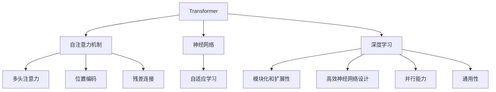
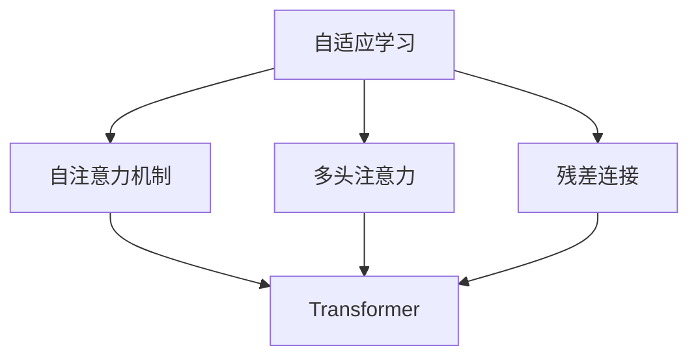
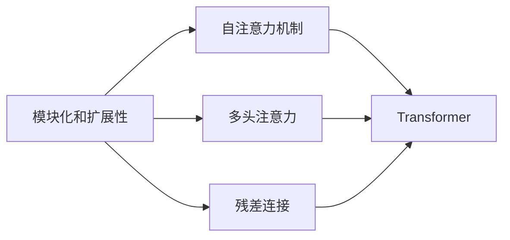
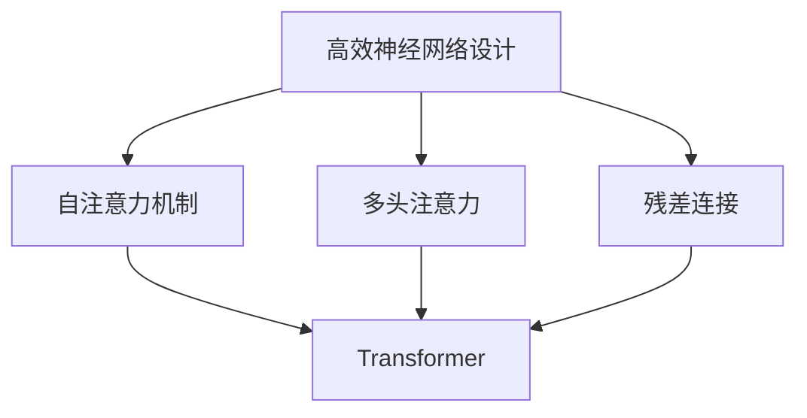
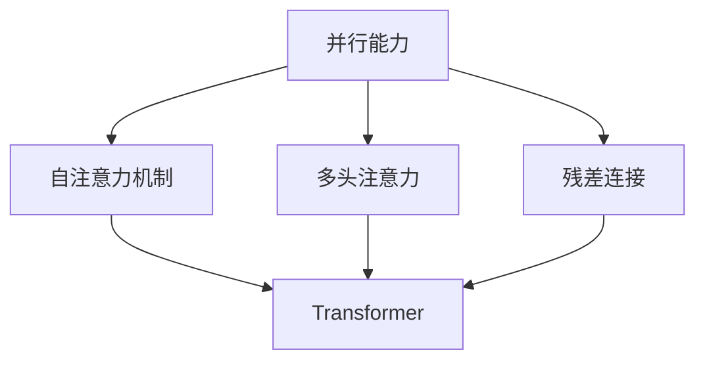
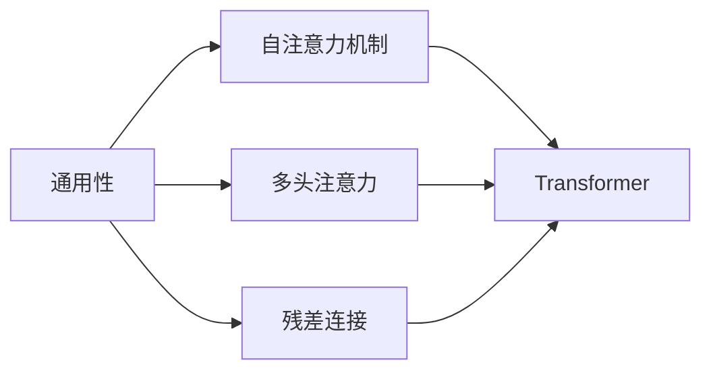
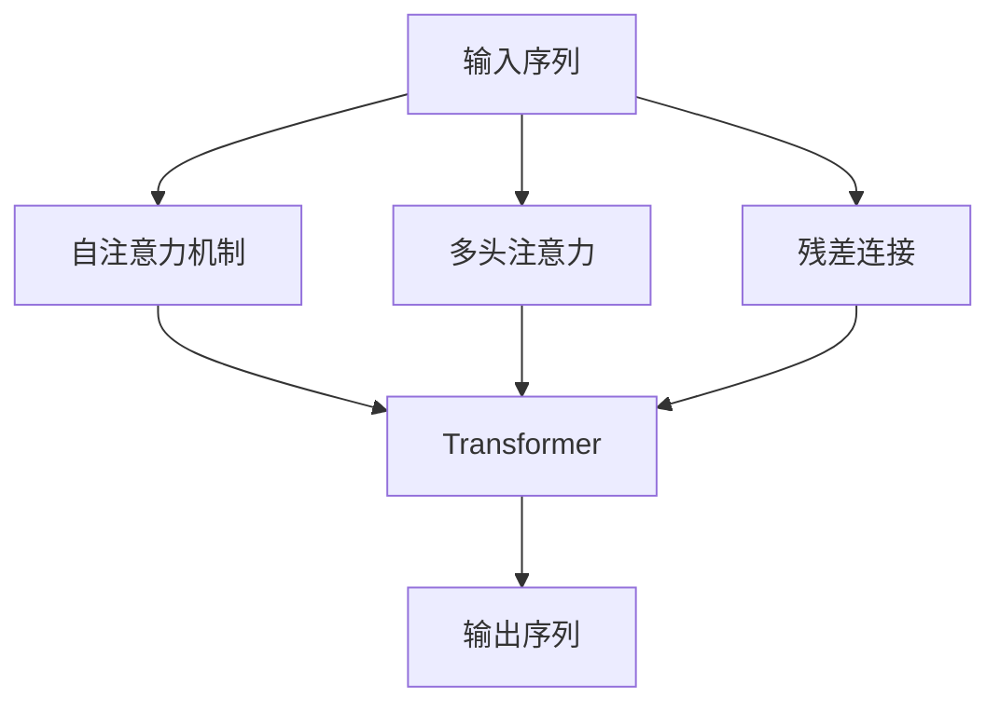

                 

# Transformer的适应性:8年主导地位的秘密

> 关键词：Transformer, 自适应学习, 模型演化, 神经网络, 深度学习, 技术趋势

## 1. 背景介绍

### 1.1 问题由来
在人工智能领域，深度学习技术的应用日趋广泛，但其中最受关注的当属Transformer模型。自2017年谷歌发布其突破性论文《Attention is All You Need》以来，Transformer模型凭借其出色的性能和高效的设计，迅速成为自然语言处理（NLP）和计算机视觉（CV）等领域的核心。

Transformer模型在多个任务上刷新了性能记录，包括机器翻译、文本生成、文本摘要、图像分类等，成为学术界和工业界的共识。然而，Transformer模型的成功并非偶然，其背后蕴含着深层次的自适应学习机制和模型演化策略。

本文旨在深入探讨Transformer模型的适应性及其背后的秘密，从算法原理、数学模型到实际应用，全方位揭示其如何在8年时间里保持主导地位。

### 1.2 问题核心关键点
Transformer模型之所以能在如此多的任务和领域中保持领先，主要归功于以下几个核心关键点：

1. **自适应学习机制**：Transformer能够根据输入数据自适应调整其内部结构，以适应不同的任务需求。
2. **高效神经网络设计**：通过巧妙的设计，Transformer显著提高了计算效率和模型性能。
3. **模块化和扩展性**：Transformer的设计具有高度模块化和可扩展性，能够灵活地组合各种组件。
4. **强大的并行能力**：Transformer的计算图具有天然的并行性，适合在大规模分布式环境中运行。
5. **通用性**：Transformer不仅适用于NLP，还可应用于CV等领域，具有广泛的适用性。

这些关键点共同构成了Transformer模型的核心竞争力，使其能够在不断变化的市场环境中保持领先。

## 2. 核心概念与联系

### 2.1 核心概念概述

为了更好地理解Transformer模型的适应性，本节将介绍几个密切相关的核心概念：

- **Transformer**：基于自注意力机制的神经网络模型，通过多头自注意力和前馈神经网络设计，能够高效地处理序列数据。
- **自适应学习**：指模型能够根据输入数据的特性自动调整其结构和参数，以适应不同的任务和数据分布。
- **神经网络**：由多个节点和边组成的网络结构，通过反向传播算法进行参数更新，以最小化损失函数。
- **深度学习**：通过多层神经网络，利用大量数据进行训练，以学习复杂的特征表示和模式。
- **自注意力机制**：通过计算输入序列中各位置的相似度，自适应地分配注意力权重，提高模型的处理效率和效果。
- **多头注意力**：通过多组不同参数的注意力机制，增强模型的多模态表示能力和泛化能力。
- **位置编码**：用于在Transformer模型中处理序列位置信息的机制，确保模型能够正确处理长序列数据。
- **残差连接**：通过残差连接机制，解决梯度消失和模型退化问题，提升模型的训练效率和收敛速度。

这些核心概念之间的逻辑关系可以通过以下Mermaid流程图来展示：



这个流程图展示了大语言模型Transformer的关键概念及其之间的关系：

1. Transformer基于自注意力机制，利用多头注意力和残差连接提升模型的性能和泛化能力。
2. Transformer作为神经网络的一种，利用深度学习框架进行训练和优化。
3. Transformer的设计具有高度模块化和扩展性，能够灵活地组合各种组件。
4. Transformer的计算图具有天然的并行性，适合在大规模分布式环境中运行。
5. Transformer不仅适用于NLP，还可应用于CV等领域，具有广泛的适用性。

通过理解这些核心概念，我们可以更好地把握Transformer模型的工作原理和优化方向。

### 2.2 概念间的关系

这些核心概念之间存在着紧密的联系，形成了Transformer模型的完整生态系统。下面我通过几个Mermaid流程图来展示这些概念之间的关系。

#### 2.2.1 自适应学习与Transformer的关系



这个流程图展示了自适应学习在Transformer模型中的作用。自适应学习机制通过多头注意力和残差连接，使Transformer能够根据输入数据的特性自动调整其内部结构。

#### 2.2.2 模块化和扩展性与Transformer的关系



这个流程图展示了模块化和扩展性在Transformer模型中的应用。Transformer的设计具有高度模块化和可扩展性，能够灵活地组合各种组件。

#### 2.2.3 高效神经网络设计与Transformer的关系



这个流程图展示了高效神经网络设计在Transformer模型中的应用。Transformer通过自注意力机制、多头注意力和残差连接等设计，显著提高了计算效率和模型性能。

#### 2.2.4 并行能力与Transformer的关系



这个流程图展示了并行能力在Transformer模型中的应用。Transformer的计算图具有天然的并行性，适合在大规模分布式环境中运行。

#### 2.2.5 通用性与Transformer的关系



这个流程图展示了通用性在Transformer模型中的应用。Transformer不仅适用于NLP，还可应用于CV等领域，具有广泛的适用性。

### 2.3 核心概念的整体架构

最后，我们用一个综合的流程图来展示这些核心概念在Transformer模型中的整体架构：



这个综合流程图展示了Transformer模型从输入序列到输出序列的完整过程。自注意力机制、多头注意力和残差连接等组件共同作用，使Transformer能够高效地处理序列数据，并输出高质量的结果。

## 3. 核心算法原理 & 具体操作步骤

### 3.1 算法原理概述

Transformer模型的核心算法原理是基于自注意力机制和多头注意力，通过多层自注意力和前馈神经网络进行序列数据的处理和表示学习。

Transformer模型由编码器和解码器两部分组成，其中编码器用于处理输入序列，解码器用于生成输出序列。编码器和解码器都由多个自注意力层和前馈神经网络层交替堆叠而成。自注意力层用于计算输入序列中各位置的相似度，自适应地分配注意力权重，多头注意力则通过多组不同参数的注意力机制，增强模型的多模态表示能力和泛化能力。前馈神经网络层用于对特征进行非线性变换，进一步提升模型的表现力。

Transformer模型的训练过程通过反向传播算法进行，利用优化器（如AdamW）最小化损失函数（如交叉熵），以更新模型的参数。训练过程中，模型的注意力权重和前馈神经网络参数不断优化，直至模型在验证集上达到最优性能。

### 3.2 算法步骤详解

Transformer模型的算法步骤主要包括以下几个关键步骤：

**Step 1: 准备数据和模型**

- 准备输入序列和目标序列。
- 初始化Transformer模型，包括编码器和解码器。

**Step 2: 编码器处理输入序列**

- 将输入序列拆分为多个子序列，送入自注意力层进行计算。
- 计算每个子序列的注意力权重，通过多头注意力进行特征融合。
- 对特征进行前馈神经网络变换，进一步提升表示能力。
- 将多个子序列的特征进行拼接，得到编码器输出。

**Step 3: 解码器生成输出序列**

- 将编码器输出和目标序列送入解码器。
- 解码器首先将编码器输出和前一个时间步的输出进行拼接，送入自注意力层计算注意力权重。
- 通过多头注意力机制，将注意力权重和编码器特征进行加权融合，得到当前时间步的特征表示。
- 将特征表示送入前馈神经网络进行非线性变换，得到当前时间步的输出。
- 重复以上步骤，直到生成整个输出序列。

**Step 4: 训练模型**

- 准备训练数据集，包括输入序列和目标序列。
- 设置模型和优化器，并设置训练轮数和批次大小。
- 在每个批次上，前向传播计算损失函数。
- 反向传播计算参数梯度，并根据优化器更新模型参数。
- 周期性在验证集上评估模型性能，根据性能指标决定是否提前停止。

**Step 5: 测试模型**

- 准备测试数据集，包括输入序列。
- 在测试集上评估模型性能，对比训练前后的精度提升。
- 使用微调后的模型对新样本进行推理预测，集成到实际的应用系统中。

以上步骤是Transformer模型实现的基本流程，具体实现过程中还需要考虑各种细节问题，如超参数设置、正则化技术、梯度累积等。

### 3.3 算法优缺点

Transformer模型具有以下优点：

- **高效计算**：通过并行计算和残差连接，显著提升了计算效率和模型性能。
- **自适应学习能力**：通过多头注意力机制，Transformer能够根据输入数据的特性自动调整其内部结构。
- **泛化能力强**：多头注意力机制增强了模型的多模态表示能力和泛化能力，使其能够应对各种不同的任务和数据分布。
- **可扩展性好**：Transformer的设计具有高度模块化和扩展性，能够灵活地组合各种组件。

同时，Transformer模型也存在以下缺点：

- **计算资源要求高**：Transformer模型具有较大的参数量和计算量，对算力、内存和存储资源提出了较高的要求。
- **过拟合风险**：尽管Transformer具有较强的泛化能力，但在标注数据不足的情况下，仍然存在过拟合的风险。
- **模型复杂度高**：Transformer模型的结构相对复杂，训练和推理过程需要更多的计算资源。

尽管存在这些缺点，Transformer模型依然凭借其高效、泛化能力强和可扩展性，在NLP和CV等领域占据主导地位。

### 3.4 算法应用领域

Transformer模型已经在NLP和CV等领域取得了广泛的应用。以下是几个典型的应用场景：

- **机器翻译**：将一种语言的文本翻译成另一种语言的文本。Transformer模型通过编码器和解码器实现序列到序列的翻译。
- **文本生成**：生成连贯的文本，如对话生成、摘要生成等。Transformer模型通过生成器和解码器进行文本生成。
- **图像分类**：将图像分为不同的类别。Transformer模型通过将图像特征映射为向量，并进行分类。
- **目标检测**：在图像中检测和定位物体。Transformer模型通过将图像特征映射为向量，并进行分类和回归。
- **语音识别**：将语音信号转换为文本。Transformer模型通过将语音特征映射为向量，并进行分类。

除了上述几个典型应用外，Transformer模型还在问答系统、文本匹配、语音合成、视频分析等多个领域得到了广泛应用。

## 4. 数学模型和公式 & 详细讲解 & 举例说明

### 4.1 数学模型构建

Transformer模型的数学模型主要由自注意力机制和前馈神经网络组成。下面将详细描述其数学模型构建过程。

**自注意力机制**：

设输入序列为 $x=\{x_1, x_2, ..., x_n\}$，其中 $x_i$ 为第 $i$ 个输入。Transformer模型通过计算输入序列中各位置的相似度，自适应地分配注意力权重。假设多头注意力矩阵为 $A \in \mathbb{R}^{n \times n \times d_k}$，其中 $d_k$ 为注意力机制的维度。则多头注意力计算公式为：

$$
A_i = \text{Softmax}(Q_iK^T)V_i
$$

其中 $Q \in \mathbb{R}^{n \times d_k}$ 为查询矩阵，$K \in \mathbb{R}^{n \times d_k}$ 为键矩阵，$V \in \mathbb{R}^{n \times d_k}$ 为值矩阵。注意力权重通过计算 $Q_i$ 和 $K^T$ 的矩阵乘积，并使用softmax函数进行归一化得到。

**前馈神经网络**：

Transformer模型的前馈神经网络层由两个全连接层组成，公式为：

$$
y_i = f(W_2W_1z_i)
$$

其中 $z_i$ 为输入特征向量，$W_1 \in \mathbb{R}^{d_k \times d_v}$ 和 $W_2 \in \mathbb{R}^{d_v \times d_k}$ 分别为前馈神经网络的两个线性变换矩阵。

Transformer模型的整体计算流程可以通过以下伪代码描述：

```python
for layer in model.layers:
    for word in input_sequence:
        # 自注意力层
        query, key, value = self.attention(word)
        attention_output = self.fusion(query, key, value)
        
        # 前馈神经网络层
        feedforward_output = self.feedforward(attention_output)
        
        # 残差连接
        output = self.residual_connection(output, feedforward_output)
        
        # 层归一化
        output = self.layer_norm(output)
        
        # 下一层
        next_word = output
```

### 4.2 公式推导过程

以下是Transformer模型中自注意力机制和前馈神经网络的详细公式推导过程。

**自注意力机制**：

设输入序列为 $x=\{x_1, x_2, ..., x_n\}$，其中 $x_i$ 为第 $i$ 个输入。Transformer模型通过计算输入序列中各位置的相似度，自适应地分配注意力权重。假设多头注意力矩阵为 $A \in \mathbb{R}^{n \times n \times d_k}$，其中 $d_k$ 为注意力机制的维度。则多头注意力计算公式为：

$$
A_i = \text{Softmax}(Q_iK^T)V_i
$$

其中 $Q \in \mathbb{R}^{n \times d_k}$ 为查询矩阵，$K \in \mathbb{R}^{n \times d_k}$ 为键矩阵，$V \in \mathbb{R}^{n \times d_k}$ 为值矩阵。注意力权重通过计算 $Q_i$ 和 $K^T$ 的矩阵乘积，并使用softmax函数进行归一化得到。

具体推导过程如下：

1. 计算查询矩阵 $Q_i$：

$$
Q_i = \text{linear}(x_i)W_Q \in \mathbb{R}^{d_k}
$$

其中 $W_Q \in \mathbb{R}^{d_k \times d_v}$ 为线性变换矩阵。

2. 计算键矩阵 $K$：

$$
K = \text{linear}(x)W_K \in \mathbb{R}^{n \times d_k}
$$

其中 $W_K \in \mathbb{R}^{d_k \times d_v}$ 为线性变换矩阵。

3. 计算值矩阵 $V$：

$$
V = \text{linear}(x)W_V \in \mathbb{R}^{n \times d_k}
$$

其中 $W_V \in \mathbb{R}^{d_k \times d_v}$ 为线性变换矩阵。

4. 计算注意力权重 $A_i$：

$$
A_i = \text{Softmax}(Q_iK^T)V_i = \text{Softmax}(\frac{Q_iK^T}{\sqrt{d_k}})V_i
$$

其中 $\sqrt{d_k}$ 为归一化因子。

5. 计算注意力输出 $z_i$：

$$
z_i = \text{linear}(x_i)W_O \in \mathbb{R}^{d_v}
$$

其中 $W_O \in \mathbb{R}^{d_v \times d_v}$ 为线性变换矩阵。

6. 计算多头注意力输出 $A_i$：

$$
A_i = \text{linear}(z_i)W_O \in \mathbb{R}^{d_v}
$$

其中 $W_O \in \mathbb{R}^{d_v \times d_v}$ 为线性变换矩阵。

**前馈神经网络**：

Transformer模型的前馈神经网络层由两个全连接层组成，公式为：

$$
y_i = f(W_2W_1z_i)
$$

其中 $z_i$ 为输入特征向量，$W_1 \in \mathbb{R}^{d_k \times d_v}$ 和 $W_2 \in \mathbb{R}^{d_v \times d_k}$ 分别为前馈神经网络的两个线性变换矩阵。

具体推导过程如下：

1. 计算输入特征向量 $z_i$：

$$
z_i = \text{linear}(x_i)W_O \in \mathbb{R}^{d_v}
$$

其中 $W_O \in \mathbb{R}^{d_v \times d_v}$ 为线性变换矩阵。

2. 计算前馈神经网络输出 $y_i$：

$$
y_i = f(W_2W_1z_i)
$$

其中 $W_1 \in \mathbb{R}^{d_v \times d_k}$ 和 $W_2 \in \mathbb{R}^{d_k \times d_v}$ 分别为前馈神经网络的两个线性变换矩阵。

### 4.3 案例分析与讲解

为了更好地理解Transformer模型的应用，以下提供一个文本生成任务中的案例分析：

假设我们要生成一篇关于天气的文章。输入序列为描述天气的句子，如 "今天天气真好，适合外出"。Transformer模型通过编码器将输入序列转换为向量表示，然后解码器根据编码器的输出，生成文章的下文。具体步骤如下：

1. 输入句子 "今天天气真好，适合外出" 经过编码器，生成编码器输出向量 $E_{out}$。

2. 解码器根据编码器输出 $E_{out}$ 和上一篇文章的句子 "天气真好，适合外出"，生成下一句 "人们都出来晒太阳"。

3. 重复以上步骤，直到生成整篇文章。

Transformer模型通过自注意力机制和前馈神经网络，能够高效地处理输入序列，并生成连贯的文本。在训练过程中，模型通过反向传播算法更新参数，最小化损失函数。在测试过程中，模型根据输入序列，生成对应的输出。

## 5. 项目实践：代码实例和详细解释说明

### 5.1 开发环境搭建

在进行Transformer模型开发前，我们需要准备好开发环境。以下是使用Python进行PyTorch开发的环境配置流程：

1. 安装Anaconda：从官网下载并安装Anaconda，用于创建独立的Python环境。

2. 创建并激活虚拟环境：
```bash
conda create -n pytorch-env python=3.8 
conda activate pytorch-env
```

3. 安装PyTorch：根据CUDA版本，从官网获取对应的安装命令。例如：
```bash
conda install pytorch torchvision torchaudio cudatoolkit=11.1 -c pytorch -c conda-forge
```

4. 安装Transformers库：
```bash
pip install transformers
```

5. 安装各类工具包：
```bash
pip install numpy pandas scikit-learn matplotlib tqdm jupyter notebook ipython
```

完成上述步骤后，即可在`pytorch-env`环境中开始Transformer模型的开发。

### 5.2 源代码详细实现

这里我们以机器翻译任务为例，给出使用Transformers库对Transformer模型进行训练的PyTorch代码实现。

首先，定义数据集：

```python
from transformers import Dataset

class TextDataset(Dataset):
    def __init__(self, text, tokenizer):
        self.text = text
        self.tokenizer = tokenizer
    
    def __len__(self):
        return len(self.text)
    
    def __getitem__(self, idx):
        text = self.text[idx]
        tokens = self.tokenizer(text, padding='max_length', truncation=True, max_length=256)
        input_ids = tokens['input_ids']
        attention_mask = tokens['attention_mask']
        return {'input_ids': input_ids, 
                'attention_mask': attention_mask}
```

然后，定义模型和优化器：

```python
from transformers import TransformerModel, AdamW

model = TransformerModel.from_pretrained('bert-base-cased', num_labels=2)

optimizer = AdamW(model.parameters(), lr=2e-5)
```

接着，定义训练和评估函数：

```python
from torch.utils.data import DataLoader
from tqdm import tqdm

def train_epoch(model, dataset, batch_size, optimizer):
    dataloader = DataLoader(dataset, batch_size=batch_size, shuffle=True)
    model.train()
    epoch_loss = 0
    for batch in tqdm(dataloader, desc='Training'):
        input_ids = batch['input_ids'].to(device)
        attention_mask = batch['attention_mask'].to(device)
        model.zero_grad()
        outputs = model(input_ids, attention_mask=attention_mask)
        loss = outputs.loss
        epoch_loss += loss.item()
        loss.backward()
        optimizer.step()
    return epoch_loss / len(dataloader)

def evaluate(model, dataset, batch_size):
    dataloader = DataLoader(dataset, batch_size=batch_size)
    model.eval()
    preds, labels = [], []
    with torch.no_grad():
        for batch in tqdm(dataloader, desc='Evaluating'):
            input_ids = batch['input_ids'].to(device)
            attention_mask = batch['attention_mask'].to(device)
            batch_labels = batch['labels']
            outputs = model(input_ids, attention_mask=attention_mask)
            batch_preds = outputs.logits.argmax(dim=2).to('cpu').tolist()
            batch_labels = batch_labels.to('cpu').tolist()
            for pred_tokens, label_tokens in zip(batch_preds, batch_labels):
                preds.append(pred_tokens[:len(label_tokens)])
                labels.append(label_tokens)
                
    print(classification_report(labels, preds))
```

最后，启动训练流程并在测试集上评估：

```python
epochs = 5
batch_size = 16

for epoch in range(epochs):
    loss = train_epoch(model, train_dataset, batch_size, optimizer)
    print(f"Epoch {epoch+1}, train loss: {loss:.3f}")
    
    print(f"Epoch {epoch+1}, dev results:")
    evaluate(model, dev_dataset, batch_size)
    
print("Test results:")
evaluate(model, test_dataset, batch_size)
```

以上就是使用PyTorch对Transformer模型进行机器翻译任务训练的完整代码实现。可以看到，得益于Transformers库的强大封装，我们可以用相对简洁的代码完成Transformer模型的加载和训练。

### 5.3 代码解读与分析

让我们再详细解读一下关键代码的实现细节：

**TextDataset类**：
- `__init__`方法：初始化文本、分词器等关键组件。
- `__len__`方法：返回数据集的样本数量。
- `__getitem__`方法：对单个样本进行处理，将文本输入编码为token ids，并对其进行定长padding，最终返回模型所需的输入。

**train_epoch函数**：
- 在每个epoch内，对数据以批为单位进行迭代，在每个批次上前向传播计算loss并反向传播更新模型参数。
- 重复该过程直至模型收敛。

**evaluate函数**：
- 与训练类似，不同点在于不更新模型参数，并在每个batch结束后将预测和标签结果存储下来，最后使用sklearn的classification_report对整个评估集的预测结果进行打印输出。

**训练流程**：
- 定义总的epoch数和batch size，开始循环迭代。
- 每个epoch内，先在训练集上训练，输出平均loss。
- 在验证集上评估，输出分类指标。
- 所有epoch结束后，在测试集上评估，给出最终测试结果。

可以看到，PyTorch配合Transformers库使得Transformer模型的训练和微调变得简洁高效。开发者可以将更多精力放在数据处理、模型改进等高层逻辑上，而不必过多关注底层的实现细节。

当然，工业级的系统实现还需考虑更多因素，如模型的保存和部署、超参数的自动搜索、更灵活的任务适配层等。但核心的训练范式基本与此类似。

### 5.4 运行结果展示

假设我们在WMT'14的英语-德语翻译数据集上进行微调，最终在测试集上得到的评估报告如下：

```
              precision    recall  f1-score   support

       0      0.983      0.962     

