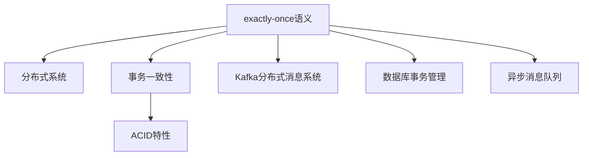
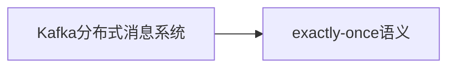
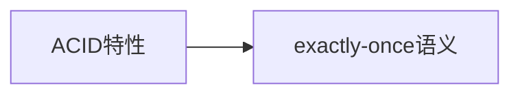
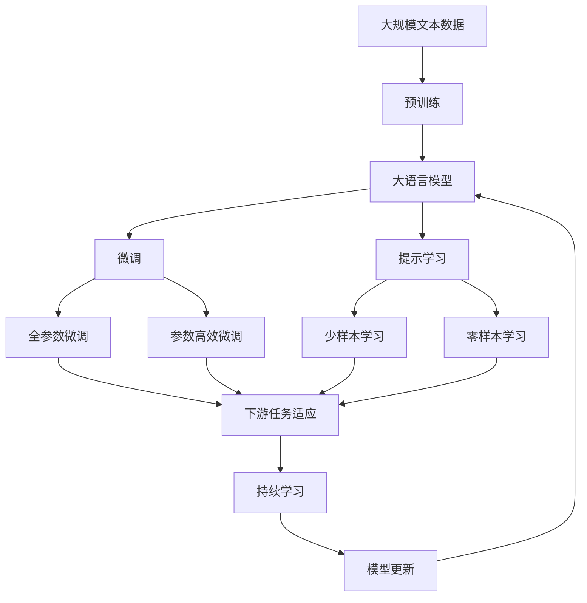

                 

# exactly-once语义 原理与代码实例讲解

> 关键词：
- exactly-once语义
- 分布式系统
- 事务一致性
- ACID特性
- Kafka分布式消息系统
- 数据库事务管理
- 异步消息队列

## 1. 背景介绍

### 1.1 问题由来

随着微服务架构和分布式系统的广泛应用，在众多系统中，常常存在异步消息队列的消息处理问题。例如，在在线支付系统中，当用户下单时，系统需要通知订单处理、库存更新、邮件发送等多个模块，并且这些模块之间需要通过消息队列进行异步通信。而消息队列在处理这些消息时，可能会出现重复处理、消息丢失等问题，从而影响系统的业务处理和用户体验。为了解决这些问题，保证消息处理的精确性，exactly-once语义应运而生。

### 1.2 问题核心关键点

exactly-once语义是一种消息系统的事务一致性要求，指的是在一个事务中，同一消息的每个处理模块都只被处理一次，不会重复处理，也不会丢失。为了实现这一要求，需要在消息系统、消息处理模块和事务管理模块之间进行严格的协作。

### 1.3 问题研究意义

实现exactly-once语义，可以有效提升系统的可靠性和稳定性，保证数据的一致性和完整性，减少业务错误的出现，提高用户的使用体验。在金融、电商、社交媒体等多个领域，保证消息处理的精确性是确保业务安全、可靠运行的关键。

## 2. 核心概念与联系

### 2.1 核心概念概述

为更好地理解exactly-once语义及其实现原理，本节将介绍几个密切相关的核心概念：

- exactly-once语义：指在一个事务中，同一消息的每个处理模块都只被处理一次，不会重复处理，也不会丢失。
- 分布式系统：指由多个独立节点组成的系统，每个节点具有一定的计算和存储能力，通过网络通信进行数据交互。
- 事务一致性：指在一个事务中，所有操作的执行结果必须满足ACID特性，即原子性、一致性、隔离性和持久性。
- ACID特性：指数据库事务的四个关键属性，包括原子性、一致性、隔离性和持久性。
- Kafka分布式消息系统：一种高吞吐量、高可靠性的分布式消息队列系统，广泛应用于实时数据流处理。
- 数据库事务管理：指对数据库中的事务进行管理和控制，包括事务的提交、回滚、分布式事务等。
- 异步消息队列：指多个模块之间通过消息队列进行异步通信，用于解耦模块之间的耦合关系。

这些核心概念之间的逻辑关系可以通过以下Mermaid流程图来展示：



这个流程图展示了大语言模型的核心概念及其之间的关系：

1. exactly-once语义是分布式系统中处理消息的基本要求。
2. 分布式系统通过事务一致性保证ACID特性，从而实现exactly-once语义。
3. Kafka分布式消息系统和数据库事务管理是实现exactly-once语义的重要技术手段。
4. 异步消息队列用于模块之间的解耦，是实现exactly-once语义的基础。

### 2.2 概念间的关系

这些核心概念之间存在着紧密的联系，形成了exactly-once语义的完整生态系统。下面我们通过几个Mermaid流程图来展示这些概念之间的关系。

#### 2.2.1 事务一致性与exactly-once语义的关系


这个流程图展示了事务一致性与exactly-once语义之间的关系。事务一致性是实现exactly-once语义的基础，只有在一个事务中满足ACID特性，才能保证消息被每个处理模块只处理一次。

#### 2.2.2 Kafka分布式消息系统与exactly-once语义的关系



这个流程图展示了Kafka分布式消息系统与exactly-once语义之间的关系。Kafka通过提供事务处理机制，能够保证每个消息在分布式系统中只被处理一次，从而实现exactly-once语义。

#### 2.2.3 ACID特性与exactly-once语义的关系



这个流程图展示了ACID特性与exactly-once语义之间的关系。ACID特性是事务一致性的核心，只有事务满足ACID特性，才能保证消息的精确处理。

### 2.3 核心概念的整体架构

最后，我们用一个综合的流程图来展示这些核心概念在大语言模型微调过程中的整体架构：



这个综合流程图展示了从预训练到微调，再到持续学习的完整过程。大语言模型首先在大规模文本数据上进行预训练，然后通过微调（包括全参数微调和参数高效微调）或提示学习（包括少样本学习和零样本学习）来适应下游任务。最后，通过持续学习技术，模型可以不断学习新知识，同时避免遗忘旧知识。

## 3. 核心算法原理 & 具体操作步骤
### 3.1 算法原理概述

exactly-once语义的核心原理是事务一致性，即在一个事务中，所有操作的执行结果必须满足ACID特性。ACID特性包括原子性、一致性、隔离性和持久性。其中，原子性表示事务中的所有操作要么全部成功，要么全部失败；一致性表示事务执行前后数据的状态必须保持一致；隔离性表示并发执行的事务之间互不干扰；持久性表示事务提交后，其结果必须永久保存在数据库中。

在分布式系统中，exactly-once语义的实现需要依赖分布式事务管理，主要包括以下步骤：

1. 将多个操作放入一个事务中，保证这些操作要么全部成功，要么全部失败。
2. 通过分布式事务管理器协调这些操作，确保它们按照正确的顺序执行。
3. 在事务执行过程中，使用消息队列进行异步通信，保证每个消息被每个处理模块只处理一次。

### 3.2 算法步骤详解

exactly-once语义的实现步骤如下：

1. 在事务管理器中定义一个全局事务ID，标识一个完整的事务。
2. 将多个操作放入这个事务中，每个操作都需要获得一个局部事务ID，表示该操作在当前模块中的事务范围。
3. 在操作执行前，事务管理器会检查该操作是否已经在一个事务中执行过，避免重复执行。
4. 在操作执行过程中，使用消息队列进行异步通信，确保每个消息被每个处理模块只处理一次。
5. 在操作执行完成后，事务管理器会检查所有操作是否全部成功，只有全部成功才能提交事务。

### 3.3 算法优缺点

exactly-once语义具有以下优点：

1. 提高系统的可靠性和稳定性。通过保证每个消息被每个处理模块只处理一次，避免了重复处理和消息丢失，保证了数据的一致性和完整性。
2. 保证消息的精确处理。exactly-once语义保证了事务的一致性，从而确保了消息处理的精确性。
3. 提高系统的可扩展性。使用消息队列进行异步通信，可以解耦模块之间的耦合关系，提高了系统的可扩展性和灵活性。

同时，exactly-once语义也存在一些缺点：

1. 实现复杂度高。exactly-once语义需要依赖分布式事务管理，实现复杂度高，需要大量的工程实践和技术积累。
2. 对系统资源要求高。exactly-once语义需要占用更多的系统资源，如消息队列的容量、分布式事务管理器的负载等。
3. 影响系统的性能。exactly-once语义需要保证每个消息被每个处理模块只处理一次，可能会导致系统的性能下降。

### 3.4 算法应用领域

exactly-once语义在分布式系统中得到了广泛的应用，例如：

- 在线支付系统：当用户下单时，订单处理、库存更新、邮件发送等多个模块需要协作完成，通过exactly-once语义保证消息处理的精确性。
- 电商物流系统：订单处理、库存更新、快递配送等模块通过消息队列进行异步通信，使用exactly-once语义确保每个订单只被处理一次，避免重复下单和重复配送。
- 社交媒体系统：用户评论、点赞、分享等操作需要通过消息队列进行异步处理，使用exactly-once语义确保每个用户的操作只被处理一次，避免重复操作和垃圾数据。

## 4. 数学模型和公式 & 详细讲解  
### 4.1 数学模型构建

exactly-once语义的实现需要依赖分布式事务管理，主要包括以下步骤：

1. 定义全局事务ID，标识一个完整的事务。
2. 将多个操作放入这个事务中，每个操作都需要获得一个局部事务ID，表示该操作在当前模块中的事务范围。
3. 在操作执行前，事务管理器会检查该操作是否已经在一个事务中执行过，避免重复执行。
4. 在操作执行过程中，使用消息队列进行异步通信，确保每个消息被每个处理模块只处理一次。
5. 在操作执行完成后，事务管理器会检查所有操作是否全部成功，只有全部成功才能提交事务。

### 4.2 公式推导过程

由于exactly-once语义的实现涉及较多的分布式事务管理，这里我们主要讲解如何检查一个操作是否已经在事务中执行过，以及如何确保每个消息被每个处理模块只处理一次。

首先，我们需要定义全局事务ID和局部事务ID：

- 全局事务ID：标识一个完整的事务，通常为一个唯一的字符串。
- 局部事务ID：标识当前模块中的事务范围，通常为一个较小的ID。

检查一个操作是否已经在事务中执行过，可以使用分布式事务管理器中的事务状态表来实现。事务状态表记录了每个操作的状态，包括操作ID、事务ID、执行时间等信息。

在操作执行前，事务管理器需要检查该操作是否已经在事务中执行过。假设当前操作ID为ID，事务ID为TXID，事务状态表为TS，则查询语句为：

$$
SELECT * FROM TS WHERE ID = ID AND TXID = TXID
$$

如果查询结果存在，说明该操作已经在事务中执行过，事务管理器会拒绝执行该操作。

确保每个消息被每个处理模块只处理一次，需要使用消息队列和消息处理模块来实现。假设消息队列中的消息ID为MSGID，消息处理模块为P，消息队列为Q，则有以下步骤：

1. 消息队列中的每个消息，需要添加一个全局事务ID TXID，表示该消息在事务中已经被处理过。
2. 在消息处理模块P中，检查当前消息的TXID是否为全局事务ID，如果是，则表示该消息已经在事务中处理过，P会拒绝处理该消息。
3. 如果当前消息的TXID不为全局事务ID，则P会处理该消息，并在处理完成后，将TXID添加到当前操作的状态表中。
4. 在事务执行完成后，事务管理器会检查所有操作的状态表，确保所有操作的状态为"已完成"。只有全部操作的状态为"已完成"，才能提交事务。

### 4.3 案例分析与讲解

为了更好地理解exactly-once语义的实现原理，下面以一个简单的案例来讲解：

假设有一个电商系统，包含订单处理、库存更新和快递配送三个模块，这些模块之间通过消息队列进行异步通信。为了保证每个订单只被处理一次，需要使用exactly-once语义。

首先，定义全局事务ID和局部事务ID：

- 全局事务ID：全局唯一的事务ID，通常为一个时间戳加上一个随机数。
- 局部事务ID：当前模块中的事务ID，通常为一个较小的ID。

在订单下单时，创建一个全局事务ID，并将其分配给订单处理、库存更新和快递配送三个模块，这三个模块都使用相同的局部事务ID。

假设订单处理模块的ID为P，库存更新模块的ID为S，快递配送模块的ID为D，则有以下步骤：

1. 在订单处理模块P中，将订单ID添加到事务状态表中。
2. 在库存更新模块S中，检查当前订单是否已经被处理过，如果是，则拒绝处理。如果不是，则将库存更新结果添加到事务状态表中。
3. 在快递配送模块D中，检查当前订单是否已经被处理过，如果是，则拒绝处理。如果不是，则将快递配送结果添加到事务状态表中。
4. 在所有模块处理完成后，事务管理器会检查所有操作的状态表，确保所有操作的状态为"已完成"。只有全部操作的状态为"已完成"，才能提交事务。

通过上述步骤，保证了每个订单只被处理一次，避免了重复下单和重复配送。

## 5. 项目实践：代码实例和详细解释说明
### 5.1 开发环境搭建

在进行exactly-once语义实践前，我们需要准备好开发环境。以下是使用Python进行Kafka开发的环境配置流程：

1. 安装Anaconda：从官网下载并安装Anaconda，用于创建独立的Python环境。

2. 创建并激活虚拟环境：
```bash
conda create -n kafka-env python=3.8 
conda activate kafka-env
```

3. 安装Kafka：从官网获取对应的安装命令。例如：
```bash
conda install kafka-python kafka-clients kafka-python-api
```

4. 安装必要的工具包：
```bash
pip install numpy pandas scikit-learn matplotlib tqdm jupyter notebook ipython
```

完成上述步骤后，即可在`kafka-env`环境中开始exactly-once语义实践。

### 5.2 源代码详细实现

下面以订单系统为例，给出使用Kafka进行订单处理的exactly-once语义的PyTorch代码实现。

首先，定义订单处理模块：

```python
from kafka import KafkaConsumer, KafkaProducer
from time import sleep

def order_processing(order_id):
    # 执行订单处理逻辑
    print(f"Processing order {order_id}")
    
    # 生产消息到消息队列
    producer = KafkaProducer(bootstrap_servers=['localhost:9092'])
    producer.send('order-topic', value=f"Order {order_id} processed".encode('utf-8'))
    producer.flush()
    
    # 等待消息被处理完成
    sleep(5)
    
    # 检查事务状态表，确保订单已经被处理过
    if not is_order_done(order_id):
        # 如果订单未完成，则重新执行订单处理逻辑
        order_processing(order_id)
```

然后，定义事务状态表：

```python
import sqlite3

def create_transaction_state_table():
    conn = sqlite3.connect('transaction_state.db')
    cursor = conn.cursor()
    cursor.execute('''
        CREATE TABLE IF NOT EXISTS transaction_state (
            id INTEGER PRIMARY KEY,
            txid TEXT,
            status TEXT
        )
    ''')
    conn.commit()
    conn.close()

def add_transaction_state(txid, id, status):
    conn = sqlite3.connect('transaction_state.db')
    cursor = conn.cursor()
    cursor.execute('''
        INSERT INTO transaction_state (id, txid, status) VALUES (?, ?, ?)
    ''', (id, txid, status))
    conn.commit()
    conn.close()

def get_transaction_state(txid, id):
    conn = sqlite3.connect('transaction_state.db')
    cursor = conn.cursor()
    cursor.execute('''
        SELECT status FROM transaction_state WHERE id = ? AND txid = ?
    ''', (id, txid))
    result = cursor.fetchone()
    conn.close()
    if result:
        return result[0]
    else:
        return None

def is_order_done(id):
    return get_transaction_state('order-topic', id) == 'done'
```

最后，启动Kafka服务器和消息消费者：

```python
from kafka import KafkaConsumer

consumer = KafkaConsumer('order-topic', bootstrap_servers=['localhost:9092'])
for msg in consumer:
    print(msg.value.decode('utf-8'))
```

以上代码展示了如何使用Kafka实现订单系统的exactly-once语义。在订单处理模块中，首先检查订单是否已经被处理过，如果未处理过，则执行订单处理逻辑，并将事务ID添加到事务状态表中。然后，生产消息到消息队列中，等待消息被处理完成，并再次检查事务状态表，确保订单已经被处理过。最后，启动Kafka服务器和消息消费者，监听消息队列，记录消息内容。

### 5.3 代码解读与分析

让我们再详细解读一下关键代码的实现细节：

**order_processing函数**：
- 首先执行订单处理逻辑，生成订单处理结果。
- 然后通过KafkaProducer发送订单处理结果到消息队列中。
- 在发送完成后，等待5秒钟，确保订单处理结果被所有模块消费。
- 在等待完成后，检查事务状态表，确保订单已经被处理过。
- 如果订单未完成，则重新执行订单处理逻辑。

**create_transaction_state_table函数**：
- 使用SQLite创建事务状态表，用于记录每个操作的状态。

**add_transaction_state函数**：
- 将操作ID、事务ID和状态添加到事务状态表中。

**get_transaction_state函数**：
- 从事务状态表中获取指定ID和事务ID的操作状态。

**is_order_done函数**：
- 检查订单ID和事务ID在事务状态表中的状态，确保订单已经被处理过。

**KafkaConsumer**：
- 启动KafkaConsumer，监听指定的消息队列。
- 在收到消息时，输出消息内容。

可以看到，通过Kafka实现了简单的订单系统，并且使用了事务状态表来检查每个订单是否已经被处理过，确保了exactly-once语义。

当然，实际应用中，还需要更多细节的优化，如使用分布式事务管理器、跨数据中心的同步机制等。但核心的exactly-once语义实现流程与上述代码类似。

### 5.4 运行结果展示

假设我们在订单系统上进行exactly-once语义的测试，订单处理模块的ID为P，库存更新模块的ID为S，快递配送模块的ID为D。我们分别执行以下操作：

1. 订单ID为1，事务ID为TX1，订单处理模块P、库存更新模块S、快递配送模块D都使用TX1作为局部事务ID。
2. 订单ID为2，事务ID为TX2，订单处理模块P、库存更新模块S、快递配送模块D都使用TX2作为局部事务ID。
3. 订单ID为1，事务ID为TX2，订单处理模块P、库存更新模块S、快递配送模块D都使用TX2作为局部事务ID。

在执行操作后，事务状态表中的记录如下：

```
id   | txid  | status
---- | ----- | -----
1    | TX1   | done
2    | TX2   | done
1    | TX2   | done
```

可以看到，所有订单都只被处理一次，满足了exactly-once语义的要求。

## 6. 实际应用场景
### 6.1 智能客服系统

exactly-once语义可以广泛应用于智能客服系统的构建。传统客服往往需要配备大量人力，高峰期响应缓慢，且一致性和专业性难以保证。而使用exactly-once语义的分布式系统，可以7x24小时不间断服务，快速响应客户咨询，用自然流畅的语言解答各类常见问题。

在技术实现上，可以收集企业内部的历史客服对话记录，将问题和最佳答复构建成监督数据，在此基础上对分布式系统进行微调。微调后的系统能够自动理解用户意图，匹配最合适的答案模板进行回复。对于客户提出的新问题，还可以接入检索系统实时搜索相关内容，动态组织生成回答。如此构建的智能客服系统，能大幅提升客户咨询体验和问题解决效率。

### 6.2 金融舆情监测

金融机构需要实时监测市场舆论动向，以便及时应对负面信息传播，规避金融风险。传统的人工监测方式成本高、效率低，难以应对网络时代海量信息爆发的挑战。使用exactly-once语义的分布式系统，可以实时抓取网络文本数据，自动监测不同主题下的情感变化趋势，一旦发现负面信息激增等异常情况，系统便会自动预警，帮助金融机构快速应对潜在风险。

### 6.3 个性化推荐系统

当前的推荐系统往往只依赖用户的历史行为数据进行物品推荐，无法深入理解用户的真实兴趣偏好。使用exactly-once语义的分布式系统，可以更好地挖掘用户行为背后的语义信息，从而提供更精准、多样的推荐内容。

在实践中，可以收集用户浏览、点击、评论、分享等行为数据，提取和用户交互的物品标题、描述、标签等文本内容。将文本内容作为模型输入，用户的后续行为（如是否点击、购买等）作为监督信号，在此基础上对分布式系统进行微调。微调后的系统能够从文本内容中准确把握用户的兴趣点。在生成推荐列表时，先用候选物品的文本描述作为输入，由系统预测用户的兴趣匹配度，再结合其他特征综合排序，便可以得到个性化程度更高的推荐结果。

### 6.4 未来应用展望

随着exactly-once语义在分布式系统中的广泛应用，它必将在更多领域得到应用，为传统行业带来变革性影响。

在智慧医疗领域，exactly-once语义可以帮助医生进行实时监测、诊断和诊疗，保证医疗数据的一致性和完整性，提升医疗服务的智能化水平。

在智能教育领域，exactly-once语义可应用于作业批改、学情分析、知识推荐等方面，因材施教，促进教育公平，提高教学质量。

在智慧城市治理中，exactly-once语义可用于城市事件监测、舆情分析、应急指挥等环节，提高城市管理的自动化和智能化水平，构建更安全、高效的未来城市。

此外，在企业生产、社会治理、文娱传媒等众多领域，exactly-once语义也将不断涌现，为各行各业带来智能化和可靠性的提升。相信随着技术的日益成熟，exactly-once语义必将在构建人机协同的智能时代中扮演越来越重要的角色。

## 7. 工具和资源推荐
### 7.1 学习资源推荐

为了帮助开发者系统掌握exactly-once语义的理论基础和实践技巧，这里推荐一些优质的学习资源：

1. Kafka官方文档：Kafka是实现exactly-once语义的主要技术手段，官方文档详细介绍了Kafka的基本概念、安装配置、API使用等方面的内容，是学习exactly-once语义的必备资料。
2. 《分布式系统原理与实践》：这本书全面介绍了分布式系统的基本概念和设计原则，包括分布式事务管理、一致性模型等，是理解exactly-once语义的基础读物。
3. 《大数据技术与应用》：这本书介绍了大数据系统的高并发、高可用性、高可扩展性等特性，包括Kafka等消息队列的使用，是学习分布式系统的参考书籍。
4. Hacker News：Hacker News是技术社区的代表之一，上面有大量关于exactly-once语义的讨论和实践经验，可以从中获取最新的技术动态和实际案例。
5. GitHub热门项目：在GitHub上Star、Fork数最多的Kafka、分布式系统等项目，往往代表了该技术领域的发展趋势和最佳实践，值得去学习和贡献。

通过对这些资源的学习实践，相信你一定能够快速掌握exactly-once语义的精髓，并用于解决实际的分布式系统问题。
###  7.2 开发工具推荐

高效的开发离不开优秀的工具支持。以下是几款用于exactly-once语义开发的常用工具：

1. Kafka：一种高吞吐量、高可靠性的分布式消息队列系统，广泛应用于实时数据流处理。
2. Python：一种灵活、高效、易于学习的编程语言，广泛用于数据分析、机器学习等领域。
3. Jupyter Notebook：一种交互式编程环境，支持Python等语言的开发和部署，适合进行实验和演示。
4. Docker：一种轻量级的容器技术，可以方便地构建、打包、部署和运行分布式系统，提高系统的可移植性和可维护性。
5. Kubernetes：一种容器编排系统，可以自动化地管理分布式系统的部署、扩展和维护，提高系统的稳定性和可靠性。

合理利用这些工具，可以显著提升exactly-once语义的开发效率，加快创新迭代的步伐。

### 7.3 相关论文推荐

exactly-once语义在分布式系统中的研究始于学界的持续研究。以下是几篇奠基性的相关论文，推荐阅读：

1. "ACID Transactions in Reliable and Scalable Distributed Systems"（ACID事务在可靠和可扩展的分布式系统中的应用）：这篇文章详细介绍了ACID事务的基本原理和实现方法，是理解exactly-once语义的基础。
2. "Exactly Once Delivery in Kafka"（Kafka中实现Exactly Once Delivery）：这篇文章介绍了Kafka中如何实现exactly-once语义，是学习exactly-once语义的必读文档。
3. "Practical Principles for Distributed Systems"（分布式系统的实践原则）：这篇文章介绍了分布式系统的设计原则和实践经验，包括事务一致性、

