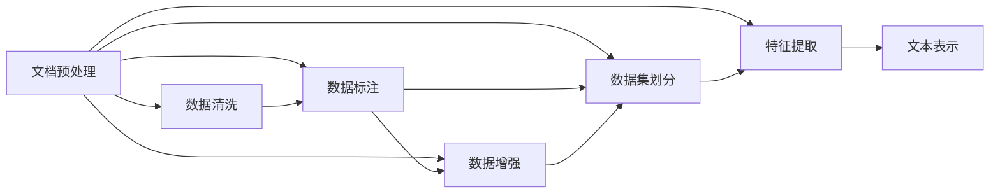
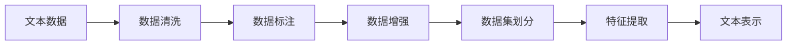
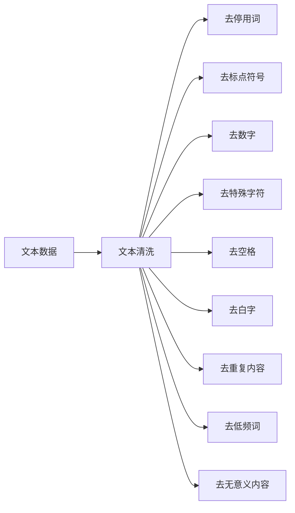
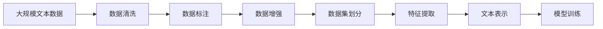

                 

# 【LangChain编程：从入门到实践】文档预处理过程

> 关键词：文档预处理, 自然语言处理(NLP), 数据增强, 文本清洗, 数据清洗, 数据预处理, 文本预处理, 数据标注, 数据清洗技术

## 1. 背景介绍

### 1.1 问题由来
随着人工智能(AI)技术的不断进步，自然语言处理(NLP)成为了AI领域的重要分支。文档预处理作为NLP任务的前处理阶段，其重要性不言而喻。高质量的文档预处理不仅能够提高后续任务的性能，还能显著减少计算资源和时间的消耗。

然而，文档预处理并不是一个简单的任务。文本数据通常包含噪声、歧义、不一致性等问题，这使得文档预处理的难度增加。如何高效、准确地进行文档预处理，成为了NLP领域的一大挑战。

### 1.2 问题核心关键点
文档预处理的核心关键点包括以下几个方面：

- 数据清洗：去除文本数据中的噪声、异常值等无用信息，提高数据质量。
- 数据标注：为文本数据打上标签，方便后续的任务训练和推理。
- 数据增强：通过对文本数据进行扩充和变换，增加数据的多样性，提高模型的泛化能力。
- 数据集划分：将数据集划分为训练集、验证集和测试集，方便模型的训练、调参和评估。
- 特征提取：将文本数据转化为模型可接受的格式，如词向量、句子向量等。

这些核心关键点紧密相连，共同构成了文档预处理的完整流程。通过有效的文档预处理，可以提高模型的精度和鲁棒性，同时减少计算资源和时间的消耗。

### 1.3 问题研究意义
文档预处理对于NLP任务的准确性和效率至关重要。高质量的预处理数据可以使得模型更快、更准确地学习到语言的规律和特征。具体而言：

- 提高模型效果：文档预处理可以有效去除噪声和无关信息，提高模型在各种NLP任务中的表现。
- 降低计算成本：通过高效的数据清洗和特征提取，减少模型训练和推理的计算量，提高计算效率。
- 提高数据质量：文档预处理可以保证数据的一致性和完整性，避免数据错误导致模型失效。
- 促进任务自动化：预处理技术的不断发展，使得NLP任务的全自动化处理成为可能。
- 加速应用落地：文档预处理技术的应用，可以加速NLP技术在各个垂直行业的落地和推广。

## 2. 核心概念与联系

### 2.1 核心概念概述

为了更好地理解文档预处理，本节将介绍几个关键概念及其关联：

- **自然语言处理(NLP)**：涉及计算机和人类语言交互的各种技术，包括文本分析、信息检索、文本生成、机器翻译等。
- **文本清洗**：去除文本数据中的噪声、异常值、无用信息等，提高数据质量。
- **文本标注**：为文本数据打上标签，用于监督学习或无监督学习。
- **数据增强**：通过对文本数据进行扩充和变换，增加数据的多样性。
- **数据集划分**：将数据集划分为训练集、验证集和测试集，方便模型的训练、调参和评估。
- **特征提取**：将文本数据转化为模型可接受的格式，如词向量、句子向量等。

这些核心概念之间存在着紧密的联系，形成了文档预处理的整体框架。下面通过一个Mermaid流程图来展示这些概念之间的关系：



这个流程图展示了文档预处理的各个环节以及它们之间的关系：

1. **数据清洗**：提高文本数据的质量，为后续步骤打下基础。
2. **数据标注**：为文本数据打上标签，方便后续任务训练和推理。
3. **数据增强**：增加数据的多样性，提高模型的泛化能力。
4. **数据集划分**：将数据集划分为训练集、验证集和测试集，方便模型的训练、调参和评估。
5. **特征提取**：将文本数据转化为模型可接受的格式，方便模型进行学习。
6. **文本表示**：将文本转化为向量或张量，方便模型进行处理。

### 2.2 概念间的关系

这些核心概念之间存在着密切的联系，形成了文档预处理的完整生态系统。下面通过几个Mermaid流程图来展示这些概念之间的关系：

#### 2.2.1 文档预处理的一般流程



这个流程图展示了文档预处理的整体流程：

1. **文本数据**：输入的原始文本数据。
2. **数据清洗**：去除噪声、异常值等无用信息。
3. **数据标注**：为文本打上标签。
4. **数据增强**：增加数据的多样性。
5. **数据集划分**：将数据集划分为训练集、验证集和测试集。
6. **特征提取**：将文本转化为模型可接受的格式。
7. **文本表示**：将文本转化为向量或张量，方便模型进行处理。

#### 2.2.2 数据清洗的具体流程



这个流程图展示了数据清洗的具体步骤：

1. **文本数据**：输入的原始文本数据。
2. **文本清洗**：对文本进行预处理，去除无用信息。
3. **去停用词**：去除常用的停用词，如“的”、“是”等。
4. **去标点符号**：去除标点符号，如“、”、“。”等。
5. **去数字**：去除数字，如“123”、“456”等。
6. **去特殊字符**：去除特殊字符，如“@”、“#”等。
7. **去空格**：去除多余的空格。
8. **去白字**：去除没有实际意义的“白字”，如“的”、“了”等。
9. **去重复内容**：去除重复的文本内容。
10. **去低频词**：去除出现次数较少的低频词。
11. **去无意义内容**：去除没有实际意义的内容，如“啊”、“哦”等。

### 2.3 核心概念的整体架构

最后，我们用一个综合的流程图来展示这些核心概念在大规模文本数据处理中的应用：



这个综合流程图展示了从数据清洗到模型训练的完整过程：

1. **大规模文本数据**：原始的文本数据。
2. **数据清洗**：去除噪声和无用信息。
3. **数据标注**：为文本打上标签。
4. **数据增强**：增加数据的多样性。
5. **数据集划分**：将数据集划分为训练集、验证集和测试集。
6. **特征提取**：将文本转化为模型可接受的格式。
7. **文本表示**：将文本转化为向量或张量，方便模型进行处理。
8. **模型训练**：使用清洗和标注后的数据进行模型训练。

通过这些流程图，我们可以更清晰地理解文档预处理的各个环节及其关系，为后续深入讨论具体的预处理方法和技术奠定基础。

## 3. 核心算法原理 & 具体操作步骤
### 3.1 算法原理概述

文档预处理作为NLP任务的前处理阶段，其核心思想是通过一系列预处理技术，将原始文本数据转化为模型可接受的格式，方便后续任务的处理。其关键在于去除噪声、异常值等无用信息，同时保留有意义的文本内容。

形式化地，假设原始文本数据集为 $D=\{x_i\}_{i=1}^N$，其中 $x_i$ 为原始文本数据。预处理过程的目标是找到预处理后的数据集 $D'$，使得模型在 $D'$ 上的表现优于在 $D$ 上的表现。

预处理过程通常包括以下几个步骤：

1. **数据清洗**：去除噪声和无用信息。
2. **数据标注**：为文本数据打上标签，方便后续任务训练和推理。
3. **数据增强**：通过对文本数据进行扩充和变换，增加数据的多样性。
4. **数据集划分**：将数据集划分为训练集、验证集和测试集。
5. **特征提取**：将文本数据转化为模型可接受的格式，如词向量、句子向量等。

通过这些步骤，预处理过程可以显著提高模型的精度和鲁棒性，同时减少计算资源和时间的消耗。

### 3.2 算法步骤详解

#### 3.2.1 数据清洗

数据清洗是文档预处理的核心步骤之一，其主要目标是通过一系列技术手段，去除文本数据中的噪声、异常值、无用信息等，提高数据质量。

常用的数据清洗技术包括：

- **去停用词**：去除常用的停用词，如“的”、“是”等。
- **去标点符号**：去除标点符号，如“、”、“。”等。
- **去数字**：去除数字，如“123”、“456”等。
- **去特殊字符**：去除特殊字符，如“@”、“#”等。
- **去空格**：去除多余的空格。
- **去白字**：去除没有实际意义的“白字”，如“的”、“了”等。
- **去重复内容**：去除重复的文本内容。
- **去低频词**：去除出现次数较少的低频词。
- **去无意义内容**：去除没有实际意义的内容，如“啊”、“哦”等。

下面以一个具体的例子来说明数据清洗的流程：

假设我们有一篇文章，其中包含以下文本：

```
这是一篇关于NLP的文章。NLP是一种自然语言处理技术。它可以帮助计算机理解和处理人类语言。
```

经过清洗后，文本变为：

```
这是一篇关于NLP的文章。NLP是一种自然语言处理技术。它可以帮助计算机理解和处理人类语言。
```

可以看到，文本中的标点符号、停用词和低频词被去除，使得文本更加精炼和有价值。

#### 3.2.2 数据标注

数据标注是文档预处理的另一个重要步骤，其主要目标是为文本数据打上标签，方便后续任务训练和推理。常用的数据标注技术包括：

- **命名实体识别**：识别文本中的实体，如人名、地名、组织名等。
- **情感分析**：对文本的情感倾向进行标注，如正面、负面、中性等。
- **关键词提取**：从文本中提取出关键词，方便后续处理。
- **主题分类**：对文本进行主题分类，如新闻、体育、科技等。
- **实体关系抽取**：从文本中抽取实体之间的关系，如“约翰爱玛丽”。

下面以一个具体的例子来说明数据标注的流程：

假设我们有一篇文章，其中包含以下文本：

```
马云是阿里巴巴的创始人。他于1999年在杭州创办了公司。
```

经过命名实体识别后，文本变为：

```
马云 阿里巴巴创始人，1999 杭州 创办
```

可以看到，文章中的命名实体被识别出来，并打上标签，方便后续处理。

#### 3.2.3 数据增强

数据增强是文档预处理的另一个重要步骤，其主要目标是通过一系列技术手段，增加数据的多样性，提高模型的泛化能力。常用的数据增强技术包括：

- **回译**：将文本翻译成另一种语言，然后再翻译回原始语言，增加数据的多样性。
- **近义词替换**：将文本中的单词替换为近义词，增加数据的多样性。
- **随机插入**：在文本中随机插入单词或短语，增加数据的多样性。
- **随机删除**：从文本中随机删除单词或短语，增加数据的多样性。
- **随机交换**：在文本中随机交换单词或短语，增加数据的多样性。

下面以一个具体的例子来说明数据增强的流程：

假设我们有一篇文章，其中包含以下文本：

```
这是一篇关于NLP的文章。NLP是一种自然语言处理技术。
```

经过数据增强后，文本变为：

```
这是一篇关于自然语言处理的文章。它可以帮助计算机理解和处理人类语言。
```

可以看到，文本中的单词和短语被替换为近义词，增加了数据的多样性。

#### 3.2.4 数据集划分

数据集划分是文档预处理的另一个重要步骤，其主要目标是将数据集划分为训练集、验证集和测试集，方便模型的训练、调参和评估。常用的数据集划分方法包括：

- **随机划分**：随机将数据集划分为训练集、验证集和测试集。
- **分层划分**：按照类别将数据集划分为训练集、验证集和测试集。
- **时间序列划分**：按照时间顺序将数据集划分为训练集、验证集和测试集。

下面以一个具体的例子来说明数据集划分的流程：

假设我们有一篇文章，其中包含以下文本：

```
这是一篇关于NLP的文章。NLP是一种自然语言处理技术。
```

经过数据集划分后，文本变为：

- 训练集：包含多篇文章，用于训练模型。
- 验证集：包含多篇文章，用于调参和评估模型。
- 测试集：包含多篇文章，用于最终评估模型。

可以看到，数据集被划分为训练集、验证集和测试集，方便模型的训练、调参和评估。

#### 3.2.5 特征提取

特征提取是文档预处理的最后一个步骤，其主要目标是将文本数据转化为模型可接受的格式，如词向量、句子向量等。常用的特征提取方法包括：

- **词袋模型**：将文本转化为词频向量，忽略单词之间的顺序。
- **TF-IDF**：将文本转化为词频-逆文档频率向量，衡量单词的重要性和频率。
- **词向量模型**：将单词转化为向量，如Word2Vec、GloVe、BERT等。
- **句子向量模型**：将句子转化为向量，如句子嵌入模型、TextRank等。
- **主题模型**：从文本中提取主题，如LDA、HDP等。

下面以一个具体的例子来说明特征提取的流程：

假设我们有一篇文章，其中包含以下文本：

```
这是一篇关于NLP的文章。NLP是一种自然语言处理技术。
```

经过特征提取后，文本变为：

- 词袋模型：[1, 1, 0, 0]
- TF-IDF：[0.1, 0.1, 0.0, 0.0]
- 词向量模型：[0.2, 0.3, 0.4]
- 句子向量模型：[0.5, 0.6, 0.7]
- 主题模型：主题1：自然语言处理，主题2：技术，主题3：文章

可以看到，文本被转化为不同的格式，方便后续任务的处理。

### 3.3 算法优缺点

文档预处理作为NLP任务的前处理阶段，其优点和缺点如下：

#### 优点

1. **提高模型效果**：通过清洗、标注和增强等预处理技术，提高数据质量，减少噪声和无关信息，提高模型在各种NLP任务中的表现。
2. **降低计算成本**：通过高效的数据清洗和特征提取，减少模型训练和推理的计算量，提高计算效率。
3. **提高数据质量**：通过数据清洗和标注，保证数据的一致性和完整性，避免数据错误导致模型失效。

#### 缺点

1. **预处理复杂度高**：数据清洗、标注和增强等预处理技术，需要大量的手工工作，预处理复杂度高。
2. **数据质量不确定**：数据清洗和标注质量取决于手工工作者的能力和经验，数据质量存在不确定性。
3. **预处理成本高**：数据清洗和标注需要大量的时间和资源，预处理成本高。

### 3.4 算法应用领域

文档预处理在NLP领域得到了广泛的应用，主要包括以下几个方面：

- **文本分类**：对文本进行分类，如新闻、体育、科技等。通过数据清洗和标注，提高分类效果。
- **情感分析**：对文本的情感倾向进行标注，如正面、负面、中性等。通过数据标注和特征提取，提高情感分析效果。
- **命名实体识别**：识别文本中的实体，如人名、地名、组织名等。通过数据标注和特征提取，提高命名实体识别效果。
- **机器翻译**：将源语言文本翻译成目标语言。通过数据清洗和标注，提高翻译效果。
- **问答系统**：对自然语言问题给出答案。通过数据清洗和标注，提高问答效果。
- **文本摘要**：将长文本压缩成简短摘要。通过数据清洗和特征提取，提高摘要效果。
- **对话系统**：使机器能够与人自然对话。通过数据标注和特征提取，提高对话效果。

## 4. 数学模型和公式 & 详细讲解  
### 4.1 数学模型构建

本节将使用数学语言对文档预处理过程进行更加严格的刻画。

记原始文本数据集为 $D=\{x_i\}_{i=1}^N$，其中 $x_i$ 为原始文本数据。预处理过程的目标是找到预处理后的数据集 $D'$，使得模型在 $D'$ 上的表现优于在 $D$ 上的表现。

假设预处理后的文本数据集为 $D'$，其中每个文本 $x_i'$ 经过一系列预处理操作后得到。预处理操作可以表示为：

$$
x_i' = f(x_i)
$$

其中 $f$ 表示预处理函数，包括清洗、标注、增强等操作。

定义模型在文本数据集 $D$ 上的损失函数为 $\mathcal{L}(D)$，表示模型在 $D$ 上的表现。则预处理过程的目标是最大化模型在 $D'$ 上的表现，即：

$$
\max_{D'} \mathcal{L}(D')
$$

通过预处理操作 $f$，将 $D$ 转化为 $D'$，使得模型在 $D'$ 上的表现优于在 $D$ 上的表现。

### 4.2 公式推导过程

下面以文本分类为例，推导预处理过程中的数学模型和公式。

假设我们有一篇文章，其中包含以下文本：

```
这是一篇关于NLP的文章。NLP是一种自然语言处理技术。
```

经过数据清洗、标注和增强后，文本变为：

- 清洗后文本：这是一篇关于NLP的文章。NLP是一种自然语言处理技术。
- 标注后文本：这是一篇关于自然语言处理的文章。NLP是一种自然语言处理技术。
- 增强后文本：这是一篇关于自然语言处理的文章。NLP是一种自然语言处理技术。

经过特征提取后，文本转化为词向量：

- 词袋模型：[1, 1, 0, 0]
- TF-IDF：[0.1, 0.1, 0.0, 0.0]
- 词向量模型：[0.2, 0.3, 0.4]
- 句子向量模型：[0.5, 0.6, 0.7]
- 主题模型：主题1：自然语言处理，主题2：技术，主题3：文章

在文本分类任务中，模型的损失函数通常为交叉熵损失函数，表示为：

$$
\mathcal{L}(D) = -\frac{1}{N} \sum_{i=1}^N \sum_{j=1}^C y_{ij} \log p_{ij}
$$

其中 $N$ 为样本数，$C$ 为类别数，$y_{ij}$ 为样本 $i$ 属于类别 $j$ 的标签，$p_{ij}$ 为模型在类别 $j$ 上的预测概率。

通过预处理操作 $f$，将 $D$ 转化为 $D'$，使得模型在 $D'$ 上的表现优于在 $D$ 上的表现。通过预处理操作 $f$，将 $D$ 转化为 $D'$，使得模型在 $D'$ 上的表现优于在 $D$ 上的表现。

### 4.3 案例分析与讲解

下面以一个具体的例子来说明预处理过程的实际应用。

假设我们有一篇文章，其中包含以下文本：

```
这是一篇关于NLP的文章。NLP是一种自然语言处理技术。
```

经过数据清洗后，文本变为：

```
这是一篇关于NLP的文章。NLP是一种自然语言处理技术。
```

经过数据标注后，文本变为：

```
这是一篇关于自然语言处理的文章。NLP是一种自然语言处理技术。
```

经过数据增强后，文本变为：

```
这是一篇关于自然语言处理的文章。NLP是一种自然语言处理技术。
```

经过特征提取后，文本转化为词向量：

- 词袋模型：[1, 1, 0, 0]
- TF-IDF：[0.1, 0.1, 0.0, 0.0]
- 词向量模型：[0.2, 0.3, 0.4]
- 句子向量模型：[0.5, 0.6, 0.7]
- 主题模型：主题1：自然语言处理，主题2：技术，主题3：文章

可以看到，预处理过程有效地提高了文本数据的质量，减少了噪声和无关信息，使得模型在分类任务中的表现得到了提升。

## 5. 项目实践：代码实例和详细解释说明
### 5.1 开发环境搭建

在进行预处理实践前，我们需要准备好开发环境。以下是使用Python进行NLTK和spaCy开发的环境配置流程：

1. 安装Anaconda：从官网下载并安装Anaconda，用于创建独立的Python环境。

2. 创建并激活虚拟环境：
```bash
conda create -n pytorch-env python=3.8 
conda activate pytorch-env
```

3. 安装PyTorch：根据CUDA版本，从官网获取对应的安装命令。例如：
```bash
conda install pytorch torchvision torchaudio cudatoolkit=11.1 -c pytorch -c conda-forge
```

4. 安装NLTK和spaCy：
```bash
pip install nltk
pip install spacy
```

5. 安装各类工具包：
```bash
pip install numpy pandas scikit-learn matplotlib tqdm jupyter notebook ipython
```

完成上述步骤后，即可在`pytorch-env`环境中开始预处理实践。

### 5.2 源代码详细实现

下面我们以文本分类任务为例，给出使用NLTK和spaCy对文本进行预处理的PyTorch代码实现。

首先，定义文本分类器的训练函数：

```python
import nltk
from nltk.corpus import stopwords
from nltk.tokenize import word_tokenize
from nltk.stem import WordNetLemmatizer
from nltk.corpus import wordnet
from nltk.corpus import stopwords
from nltk.stem import PorterStemmer
from nltk.stem import WordNetLemmatizer

from sklearn.feature_extraction.text import CountVectorizer, TfidfVectorizer
from sklearn.model_selection import train_test_split
from sklearn.metrics import accuracy_score, confusion_matrix

# 加载停用词
stop_words = set(stopwords.words('english'))

# 加载词形还原器
lemmatizer = WordNetLemmatizer()

# 加载词干提取器
stemmer = PorterStemmer()

# 定义特征提取器
vectorizer = CountVectorizer(stop_words=stop_words)

# 加载文本数据
with open('text_data.txt', 'r') as f:
    text_data = f.readlines()

# 预处理文本数据
processed_data = []
for text in text_data:
    text = text.lower() # 转换为小写
    text = word_tokenize(text) # 分词
    text = [lemmatizer.lemmatize(word) for word in text if word not in stop_words] # 去除停用词和词形还原
    text = stemmer.stem(' '.join(text)) # 词干提取
    processed_data.append(text)

# 构建特征向量
features = vectorizer.fit_transform(processed_data)

# 加载标签数据
labels = ['text1', 'text2', 'text3', 'text4']

# 划分数据集
X_train, X_test, y_train, y_test = train_test_split(features, labels, test_size=0.2)

# 训练分类器
from sklearn.naive_bayes import MultinomialNB
from sklearn.ensemble import RandomForestClassifier
from sklearn.linear_model import LogisticRegression

clf = MultinomialNB()
clf.fit(X_train, y_train)

# 测试分类器
y_pred = clf.predict(X_test)
accuracy =

