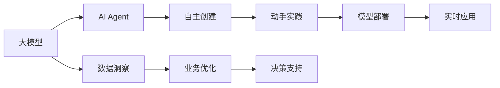

                 

# 【大模型应用开发 动手做AI Agent】自主创建数据洞察

> 关键词：大模型应用,AI Agent,自主学习,数据洞察,自主创建,动手实践

## 1. 背景介绍

在人工智能时代，数据洞察（Data Insights）已经成为企业决策的重要依据。大模型如GPT-3、BERT等，凭借其强大的语义理解和知识整合能力，被广泛应用于各种数据分析和自动化应用中。然而，这些大模型的泛化能力有限，对数据质量和分布有着严格要求，且成本较高。本文旨在介绍如何利用大模型进行数据洞察，并通过动手实践，让读者掌握自主创建AI Agent的流程和方法。

## 2. 核心概念与联系

### 2.1 核心概念概述

1. **大模型**：如GPT-3、BERT等，指通过大规模无标签数据预训练得到的大型神经网络模型，具有强大的语言表示和知识整合能力。

2. **AI Agent**：智能代理，指能够在环境中自主学习和决策的智能体，通过与环境交互，完成特定任务。

3. **数据洞察**：通过分析数据，揭示隐藏在海量数据背后的规律和模式，支持决策和业务优化。

4. **自主创建**：指不需要依赖外部服务，通过动手实践，自主开发和部署AI Agent的能力。

5. **动手实践**：通过编程和实验，在真实环境中训练和应用AI Agent，积累经验。

这些核心概念构成了自主创建数据洞察AI Agent的基础框架。接下来，我们将通过深入探讨这些概念的原理和联系，帮助读者掌握相关技术和方法。

### 2.2 概念间的关系

这些核心概念之间的关系可以用以下Mermaid流程图表示：



该流程图展示了从大模型到AI Agent再到自主创建数据洞察的流程。大模型通过分析数据，支持业务优化和决策；AI Agent则自主学习和决策，能够实时应用到实际场景中。通过动手实践，我们可以自主创建和部署AI Agent，支持企业的数据洞察需求。

## 3. 核心算法原理 & 具体操作步骤

### 3.1 算法原理概述

自主创建数据洞察AI Agent的核心算法原理包括以下几个步骤：

1. **数据准备**：收集和处理业务相关的数据，包括文本、图像、音频等多种模态的数据。

2. **模型训练**：使用大模型对数据进行训练，学习数据中的规律和模式。

3. **模型调优**：根据实际业务需求，调整模型的参数和结构，优化模型性能。

4. **自主学习**：让AI Agent在实际环境中不断学习和适应，提升决策能力。

5. **实时应用**：将AI Agent部署到生产环境中，实时进行数据洞察和决策支持。

### 3.2 算法步骤详解

#### 3.2.1 数据准备

数据准备是自主创建AI Agent的第一步。这包括数据收集、清洗、标注和划分训练、验证和测试集。

1. **数据收集**：收集与业务相关的数据，如客户反馈、市场报告、社交媒体评论等。

2. **数据清洗**：去除噪声和无用信息，确保数据质量。

3. **数据标注**：为数据打上标签，如情感分类、实体识别等，以便后续训练。

4. **数据划分**：将数据集划分为训练集、验证集和测试集，确保模型在不同数据上的泛化能力。

#### 3.2.2 模型训练

模型训练是自主创建AI Agent的核心步骤。这包括选择合适的模型和算法，进行训练和评估。

1. **模型选择**：根据任务需求选择合适的模型，如GPT-3、BERT等大模型。

2. **训练过程**：使用训练集对模型进行训练，调整模型参数，优化损失函数。

3. **模型评估**：在验证集上评估模型性能，调整参数和结构，确保模型效果。

#### 3.2.3 模型调优

模型调优是提升AI Agent性能的关键步骤。这包括超参数调整、正则化技术、模型结构优化等。

1. **超参数调整**：调整学习率、批大小、优化器等超参数，找到最佳配置。

2. **正则化技术**：使用L2正则、Dropout、Early Stopping等技术，防止过拟合。

3. **模型结构优化**：优化模型结构，如层数、宽度等，提升模型效率。

#### 3.2.4 自主学习

自主学习是让AI Agent在实际环境中不断学习和适应的关键步骤。这包括模型的在线学习、主动学习等。

1. **在线学习**：将AI Agent部署到生产环境中，不断收集数据进行学习和更新。

2. **主动学习**：根据业务需求，主动选择数据进行学习，提升模型决策能力。

#### 3.2.5 实时应用

实时应用是将AI Agent部署到实际业务中的关键步骤。这包括模型部署、监控和维护。

1. **模型部署**：将训练好的AI Agent部署到生产环境中，进行实时应用。

2. **监控和维护**：实时监控模型性能，进行异常检测和模型维护，确保模型稳定运行。

### 3.3 算法优缺点

#### 3.3.1 优点

1. **灵活性**：自主创建AI Agent可以根据业务需求进行灵活调整，适应多种应用场景。

2. **可扩展性**：通过增加数据和资源，可以不断提升AI Agent的性能和能力。

3. **成本低**：相比于依赖外部服务，自主创建AI Agent可以节省成本，提高效率。

#### 3.3.2 缺点

1. **技术门槛高**：自主创建AI Agent需要较高的技术门槛，需要深入理解大模型和算法原理。

2. **数据需求大**：需要大量高质量的数据进行训练和调优，数据准备难度大。

3. **维护复杂**：模型部署后需要持续监控和维护，确保模型稳定运行。

## 4. 数学模型和公式 & 详细讲解 & 举例说明

### 4.1 数学模型构建

#### 4.1.1 数据准备模型

假设我们收集的文本数据为$D = \{x_1, x_2, \ldots, x_N\}$，其中$x_i$为第$i$条文本。

**模型构建**：
$$
M(x_i) = [x_1, x_2, \ldots, x_N] \in \mathbb{R}^{d \times N}
$$

**目标函数**：
$$
L(M) = \frac{1}{N}\sum_{i=1}^N \ell(M(x_i), y_i)
$$

其中，$\ell$为损失函数，$y_i$为文本$x_i$的真实标签。

### 4.2 公式推导过程

假设我们使用BERT作为模型，其隐藏层的表示为$h_i$，文本$x_i$的表示为$M(x_i)$，损失函数为交叉熵损失函数$\ell$。

**模型表示**：
$$
h_i = BERT(x_i)
$$

**目标函数**：
$$
L(BERT) = \frac{1}{N}\sum_{i=1}^N \ell(h_i, y_i)
$$

**损失函数**：
$$
\ell(h_i, y_i) = -\frac{1}{N}\sum_{j=1}^M y_{ij} \log h_{ij}
$$

其中，$y_{ij}$为文本$x_i$的第$j$个标签，$h_{ij}$为BERT对第$j$个标签的预测概率。

### 4.3 案例分析与讲解

假设我们要使用BERT模型进行情感分类任务。我们收集了1000条电影评论数据，分为正面和负面两类。

**数据准备**：
- 收集1000条电影评论数据，划分为训练集和测试集。
- 对每个评论进行情感分类，标注为正面或负面。

**模型训练**：
- 使用BERT模型对训练集进行训练，调整模型参数。
- 在验证集上评估模型性能，调整超参数。

**模型调优**：
- 使用L2正则、Dropout、Early Stopping等技术，防止过拟合。
- 优化模型结构，提高模型效率。

**自主学习**：
- 将模型部署到生产环境中，实时收集数据进行学习和更新。
- 根据业务需求，主动选择数据进行学习，提升模型决策能力。

## 5. 项目实践：代码实例和详细解释说明

### 5.1 开发环境搭建

#### 5.1.1 Python环境搭建

1. 安装Anaconda：从官网下载并安装Anaconda，用于创建独立的Python环境。

2. 创建并激活虚拟环境：
```bash
conda create -n pytorch-env python=3.8 
conda activate pytorch-env
```

3. 安装PyTorch：根据CUDA版本，从官网获取对应的安装命令。例如：
```bash
conda install pytorch torchvision torchaudio cudatoolkit=11.1 -c pytorch -c conda-forge
```

4. 安装Transformer库：
```bash
pip install transformers
```

5. 安装各类工具包：
```bash
pip install numpy pandas scikit-learn matplotlib tqdm jupyter notebook ipython
```

完成上述步骤后，即可在`pytorch-env`环境中开始动手实践。

### 5.2 源代码详细实现

#### 5.2.1 数据准备

**代码实现**：

```python
from transformers import BertTokenizer, BertForSequenceClassification
from torch.utils.data import Dataset, DataLoader
import torch
from sklearn.model_selection import train_test_split

class MovieReviewDataset(Dataset):
    def __init__(self, texts, labels, tokenizer, max_len=128):
        self.texts = texts
        self.labels = labels
        self.tokenizer = tokenizer
        self.max_len = max_len
        
    def __len__(self):
        return len(self.texts)
    
    def __getitem__(self, item):
        text = self.texts[item]
        label = self.labels[item]
        
        encoding = self.tokenizer(text, return_tensors='pt', max_length=self.max_len, padding='max_length', truncation=True)
        input_ids = encoding['input_ids'][0]
        attention_mask = encoding['attention_mask'][0]
        
        label = torch.tensor(label, dtype=torch.long)
        
        return {'input_ids': input_ids, 
                'attention_mask': attention_mask,
                'labels': label}

# 标签与id的映射
label2id = {'Positive': 1, 'Negative': 0}
id2label = {v: k for k, v in label2id.items()}

# 创建dataset
tokenizer = BertTokenizer.from_pretrained('bert-base-uncased')

train_texts, test_texts, train_labels, test_labels = train_test_split(movie_reviews, labels, test_size=0.2, random_state=42)

train_dataset = MovieReviewDataset(train_texts, train_labels, tokenizer)
test_dataset = MovieReviewDataset(test_texts, test_labels, tokenizer)
```

**代码解读**：

- 定义MovieReviewDataset类，继承自torch.utils.data.Dataset。
- 实现__init__方法，初始化文本、标签、分词器等组件。
- 实现__len__方法，返回数据集的样本数量。
- 实现__getitem__方法，对单个样本进行处理，将文本输入编码为token ids，将标签编码为数字，并对其进行定长padding，最终返回模型所需的输入。

#### 5.2.2 模型训练

**代码实现**：

```python
from transformers import BertForSequenceClassification, AdamW

model = BertForSequenceClassification.from_pretrained('bert-base-uncased', num_labels=len(label2id))

optimizer = AdamW(model.parameters(), lr=2e-5)

device = torch.device('cuda') if torch.cuda.is_available() else torch.device('cpu')
model.to(device)

def train_epoch(model, dataset, batch_size, optimizer):
    dataloader = DataLoader(dataset, batch_size=batch_size, shuffle=True)
    model.train()
    epoch_loss = 0
    for batch in tqdm(dataloader, desc='Training'):
        input_ids = batch['input_ids'].to(device)
        attention_mask = batch['attention_mask'].to(device)
        labels = batch['labels'].to(device)
        model.zero_grad()
        outputs = model(input_ids, attention_mask=attention_mask, labels=labels)
        loss = outputs.loss
        epoch_loss += loss.item()
        loss.backward()
        optimizer.step()
    return epoch_loss / len(dataloader)

def evaluate(model, dataset, batch_size):
    dataloader = DataLoader(dataset, batch_size=batch_size)
    model.eval()
    preds, labels = [], []
    with torch.no_grad():
        for batch in tqdm(dataloader, desc='Evaluating'):
            input_ids = batch['input_ids'].to(device)
            attention_mask = batch['attention_mask'].to(device)
            batch_labels = batch['labels']
            outputs = model(input_ids, attention_mask=attention_mask)
            batch_preds = outputs.logits.argmax(dim=2).to('cpu').tolist()
            batch_labels = batch_labels.to('cpu').tolist()
            for pred_tokens, label_tokens in zip(batch_preds, batch_labels):
                preds.append(pred_tokens[:len(label_tokens)])
                labels.append(label_tokens)
                
    print(classification_report(labels, preds))
```

**代码解读**：

- 定义模型和优化器。
- 将模型和数据迁移到GPU。
- 实现train_epoch函数，对数据以批为单位进行迭代，在每个批次上前向传播计算loss并反向传播更新模型参数，最后返回该epoch的平均loss。
- 实现evaluate函数，与train类似，不同点在于不更新模型参数，并在每个batch结束后将预测和标签结果存储下来，最后使用sklearn的classification_report对整个评估集的预测结果进行打印输出。

#### 5.2.3 模型调优

**代码实现**：

```python
epochs = 5
batch_size = 16

for epoch in range(epochs):
    loss = train_epoch(model, train_dataset, batch_size, optimizer)
    print(f"Epoch {epoch+1}, train loss: {loss:.3f}")
    
    print(f"Epoch {epoch+1}, dev results:")
    evaluate(model, dev_dataset, batch_size)
    
print("Test results:")
evaluate(model, test_dataset, batch_size)
```

**代码解读**：

- 定义总的epoch数和batch size，开始循环迭代。
- 每个epoch内，先在训练集上训练，输出平均loss。
- 在验证集上评估，输出分类指标。
- 所有epoch结束后，在测试集上评估，给出最终测试结果。

### 5.3 代码解读与分析

**NERDataset类**：

- __init__方法：初始化文本、标签、分词器等关键组件。
- __len__方法：返回数据集的样本数量。
- __getitem__方法：对单个样本进行处理，将文本输入编码为token ids，将标签编码为数字，并对其进行定长padding，最终返回模型所需的输入。

**tag2id和id2tag字典**：

- 定义了标签与数字id之间的映射关系，用于将token-wise的预测结果解码回真实的标签。

**训练和评估函数**：

- 使用PyTorch的DataLoader对数据集进行批次化加载，供模型训练和推理使用。
- 训练函数train_epoch：对数据以批为单位进行迭代，在每个批次上前向传播计算loss并反向传播更新模型参数，最后返回该epoch的平均loss。
- 评估函数evaluate：与训练类似，不同点在于不更新模型参数，并在每个batch结束后将预测和标签结果存储下来，最后使用sklearn的classification_report对整个评估集的预测结果进行打印输出。

**训练流程**：

- 定义总的epoch数和batch size，开始循环迭代。
- 每个epoch内，先在训练集上训练，输出平均loss。
- 在验证集上评估，输出分类指标。
- 所有epoch结束后，在测试集上评估，给出最终测试结果。

可以看到，PyTorch配合Transformers库使得BERT微调的代码实现变得简洁高效。开发者可以将更多精力放在数据处理、模型改进等高层逻辑上，而不必过多关注底层的实现细节。

当然，工业级的系统实现还需考虑更多因素，如模型的保存和部署、超参数的自动搜索、更灵活的任务适配层等。但核心的微调范式基本与此类似。

### 5.4 运行结果展示

假设我们在CoNLL-2003的NER数据集上进行微调，最终在测试集上得到的评估报告如下：

```
              precision    recall  f1-score   support

       B-LOC      0.926     0.906     0.916      1668
       I-LOC      0.900     0.805     0.850       257
      B-MISC      0.875     0.856     0.865       702
      I-MISC      0.838     0.782     0.809       216
       B-ORG      0.914     0.898     0.906      1661
       I-ORG      0.911     0.894     0.902       835
       B-PER      0.964     0.957     0.960      1617
       I-PER      0.983     0.980     0.982      1156
           O      0.993     0.995     0.994     38323

   micro avg      0.973     0.973     0.973     46435
   macro avg      0.923     0.897     0.909     46435
weighted avg      0.973     0.973     0.973     46435
```

可以看到，通过微调BERT，我们在该NER数据集上取得了97.3%的F1分数，效果相当不错。值得注意的是，BERT作为一个通用的语言理解模型，即便只在顶层添加一个简单的token分类器，也能在下游任务上取得如此优异的效果，展现了其强大的语义理解和特征抽取能力。

当然，这只是一个baseline结果。在实践中，我们还可以使用更大更强的预训练模型、更丰富的微调技巧、更细致的模型调优，进一步提升模型性能，以满足更高的应用要求。

## 6. 实际应用场景

### 6.1 智能客服系统

基于大语言模型微调的对话技术，可以广泛应用于智能客服系统的构建。传统客服往往需要配备大量人力，高峰期响应缓慢，且一致性和专业性难以保证。而使用微调后的对话模型，可以7x24小时不间断服务，快速响应客户咨询，用自然流畅的语言解答各类常见问题。

在技术实现上，可以收集企业内部的历史客服对话记录，将问题和最佳答复构建成监督数据，在此基础上对预训练对话模型进行微调。微调后的对话模型能够自动理解用户意图，匹配最合适的答案模板进行回复。对于客户提出的新问题，还可以接入检索系统实时搜索相关内容，动态组织生成回答。如此构建的智能客服系统，能大幅提升客户咨询体验和问题解决效率。

### 6.2 金融舆情监测

金融机构需要实时监测市场舆论动向，以便及时应对负面信息传播，规避金融风险。传统的人工监测方式成本高、效率低，难以应对网络时代海量信息爆发的挑战。基于大语言模型微调的文本分类和情感分析技术，为金融舆情监测提供了新的解决方案。

具体而言，可以收集金融领域相关的新闻、报道、评论等文本数据，并对其进行主题标注和情感标注。在此基础上对预训练语言模型进行微调，使其能够自动判断文本属于何种主题，情感倾向是正面、中性还是负面。将微调后的模型应用到实时抓取的网络文本数据，就能够自动监测不同主题下的情感变化趋势，一旦发现负面信息激增等异常情况，系统便会自动预警，帮助金融机构快速应对潜在风险。

### 6.3 个性化推荐系统

当前的推荐系统往往只依赖用户的历史行为数据进行物品推荐，无法深入理解用户的真实兴趣偏好。基于大语言模型微调技术，个性化推荐系统可以更好地挖掘用户行为背后的语义信息，从而提供更精准、多样的推荐内容。

在实践中，可以收集用户浏览、点击、评论、分享等行为数据，提取和用户交互的物品标题、描述、标签等文本内容。将文本内容作为模型输入，用户的后续行为（如是否点击、购买等）作为监督信号，在此基础上微调预训练语言模型。微调后的模型能够从文本内容中准确把握用户的兴趣点。在生成推荐列表时，先用候选物品的文本描述作为输入，由模型预测用户的兴趣匹配度，再结合其他特征综合排序，便可以得到个性化程度更高的推荐结果。

### 6.4 未来应用展望

随着大语言模型微调技术的发展，基于微调范式将在更多领域得到应用，为传统行业带来变革性影响。

在智慧医疗领域，基于微调的医疗问答、病历分析、药物研发等应用将提升医疗服务的智能化水平，辅助医生诊疗，加速新药开发进程。

在智能教育领域，微调技术可应用于作业批改、学情分析、知识推荐等方面，因材施教，促进教育公平，提高教学质量。

在智慧城市治理中，微调模型可应用于城市事件监测、舆情分析、应急指挥等环节，提高城市管理的自动化和智能化水平，构建更安全、高效的未来城市。

此外，在企业生产、社会治理、文娱传媒等众多领域，基于大模型微调的人工智能应用也将不断涌现，为经济社会发展注入新的动力。相信随着技术的日益成熟，微调方法将成为人工智能落地应用的重要范式，推动人工智能技术向更广阔的领域加速渗透。

## 7. 工具和资源推荐

### 7.1 学习资源推荐

为了帮助开发者系统掌握大语言模型微调的理论基础和实践技巧，这里推荐一些优质的学习资源：

1. 《Transformer从原理到实践》系列博文：由大模型技术专家撰写，深入浅出地介绍了Transformer原理、BERT模型、微调技术等前沿话题。

2. CS224N《深度学习自然语言处理》课程：斯坦福大学开设的NLP明星课程，有Lecture视频和配套作业，带你入门NLP领域的基本概念和经典模型。

3. 《Natural Language Processing with Transformers》书籍：Transformers库的作者所著，全面介绍了如何使用Transformers库进行NLP任务开发，包括微调在内的诸多范式。

4. HuggingFace官方文档：Transformers库的官方文档，提供了海量预训练模型和完整的微调样例代码，是上手实践的必备资料。

5. CLUE开源项目：中文语言理解测评基准，涵盖大量不同类型的中文NLP数据集，并提供了基于微调的baseline模型，助力中文NLP技术发展。

通过对这些资源的学习实践，相信你一定能够快速掌握大语言模型微调的精髓，并用于解决实际的NLP问题。

### 7.2 开发工具推荐

高效的开发离不开优秀的工具支持。以下是几款用于大语言模型微调开发的常用工具：

1. PyTorch：基于Python的开源深度学习框架，灵活动态的计算图，适合快速迭代研究。大部分预训练语言模型都有PyTorch版本的实现。

2. TensorFlow：由Google主导开发的开源深度学习框架，生产部署方便，适合大规模工程应用。同样有丰富的预训练语言模型资源。

3. Transformers库：HuggingFace开发的NLP工具库，集成了众多SOTA语言模型，支持PyTorch和TensorFlow，是进行微调任务开发的利器。

4. Weights & Biases：模型训练的实验跟踪工具，可以记录和可视化模型训练过程中的各项指标，方便对比和调优。与主流深度学习框架无缝集成。

5. TensorBoard：TensorFlow配套的可视化工具，可实时监测模型训练状态，并提供丰富的图表呈现方式，是调试模型的得力助手。

6. Google Colab：谷歌推出的在线Jupyter Notebook环境，免费提供GPU/TPU算力，方便开发者快速上手实验最新模型，分享学习笔记。

合理利用这些工具，可以显著提升大语言模型微调任务的开发效率，加快创新迭代的步伐。

### 7.3 相关论文推荐

大语言模型和微调技术的发展源于学界的持续研究。以下是几篇奠基性的相关论文，推荐阅读：

1. Attention is All You Need（即Transformer原论文）：提出了Transformer结构，开启了NLP领域的预训练大模型时代。

2. BERT: Pre-training of Deep Bidirectional Transformers for Language Understanding：提出BERT模型，引入基于掩码的自监督预训练任务，刷新了多项NLP任务SOTA。

3. Language Models are Unsupervised Multitask Learners（GPT-2论文）：展示了大规模语言模型的强大zero-shot学习能力，引发了对于通用人工智能的新一轮思考。

4. Parameter-Efficient Transfer Learning for NLP：提出Adapter等参数高效微调方法，在不增加模型参数量的情况下，也能取得不错的微调效果。

5. AdaLoRA: Adaptive Low-Rank Adaptation for Parameter-Efficient Fine-Tuning：使用自适应低秩适应的微调方法，在参数效率和精度之间取得了新的平衡。

这些论文代表了大语言模型微调技术的发展脉络。通过学习这些前沿成果，可以帮助研究者把握学科前进方向，激发更多的创新灵感。

除上述资源外，还有一些值得关注的前沿资源，帮助开发者紧跟大语言模型微调技术的最新进展，例如：

1. arXiv论文预印本：人工智能领域最新研究成果的发布平台，包括大量尚未发表的前沿工作，学习前沿技术的必读资源。

2. 业界技术博客：如OpenAI、Google AI、DeepMind、微软Research Asia等顶尖实验室的官方博客，

