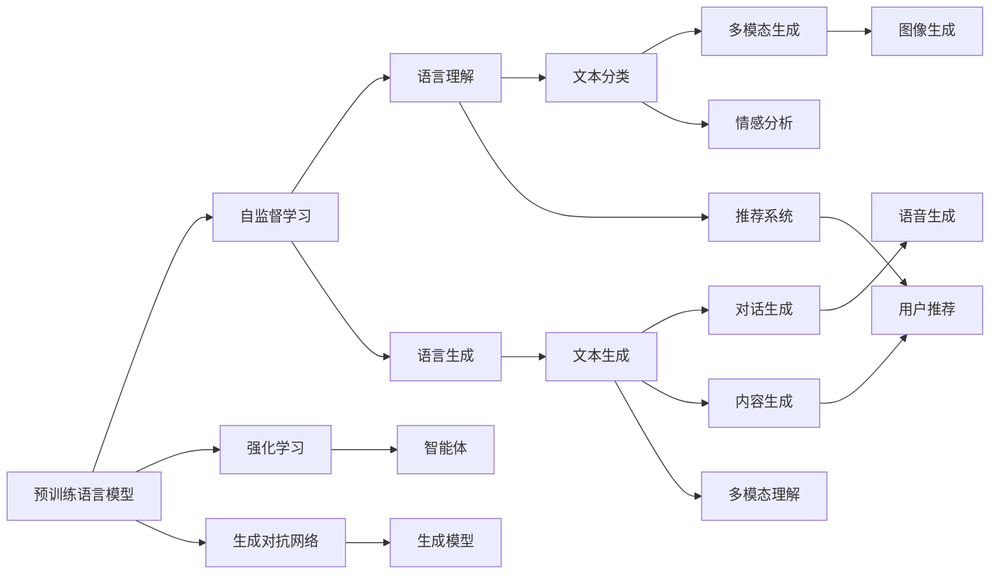

                 

# 【大模型应用开发 动手做AI Agent】说说OpenAI这家公司

在人工智能快速发展的今天，OpenAI这个名词在NLP、机器学习等领域变得家喻户晓，也逐渐成为公众和学术界关注的焦点。OpenAI作为领先的人工智能研究机构，通过一系列开源模型、论文和公开数据，为全球科研人员提供了丰富的学习资源。本文将从OpenAI的核心技术、重要贡献、发展历程、开源文化等多个角度，深入探讨这家公司的现状、影响和未来发展趋势。

## 1. 背景介绍

### 1.1 OpenAI的创立

OpenAI的创办初衷是致力于创建通用的人工智能（AGI），并促进开放、透明和可扩展的人工智能研究。OpenAI于2015年由Elon Musk、Samuel Altman等知名人士联合创立，并在2019年引入Yann LeCun、Fei-Fei Li等世界顶级AI专家作为首席科学家。该机构不仅拥有雄厚的科研实力，还持续吸引和培养了大量优秀人才，致力于推动AI技术的发展。

### 1.2 OpenAI的发展历程

OpenAI自成立以来，一直专注于自然语言处理（NLP）、机器学习、计算机视觉等前沿领域，并在这些方向上取得了诸多突破性进展。2018年，OpenAI发布了GPT-1模型，刷新了多项NLP任务上的记录；2020年，发布了GPT-3模型，以其巨大的参数量和强大的泛化能力，再度引领AI研究的热潮。2022年，发布了文本生成、代码生成等任务的强大工具GPT-4，进一步提升了AI应用的智能水平。

OpenAI不仅通过发布预训练模型和开源工具，推动AI技术的发展，还积极参与各类国际合作，推动AI伦理、公平和透明的研究，对全球AI领域的进步做出了重要贡献。

## 2. 核心概念与联系

### 2.1 核心概念概述

OpenAI的核心技术可以归结为以下几个方面：

- **预训练语言模型**：OpenAI通过自监督学习任务（如语言模型、掩码语言模型等）预训练出强大而通用的语言模型，如GPT系列、BERT等。这些模型在文本生成、理解、分类等任务上具备卓越的表现。
- **强化学习**：OpenAI使用强化学习算法训练智能体，解决复杂的决策问题，如AlphaGo、OpenAI Five等。
- **生成对抗网络（GANs）**：OpenAI在生成式模型领域不断创新，推出了DALL·E、GPT-4等具有强大生成能力的模型。
- **公平性和安全性**：OpenAI注重AI技术的公平性和安全性，致力于防止模型偏见、恶意利用等风险，推动AI技术的健康发展。

这些核心技术之间相互关联，形成了OpenAI强大的技术生态。预训练语言模型作为基础，强化学习和生成对抗网络作为高级技术，而公平性和安全性则保障了AI技术的应用边界。

### 2.2 核心概念的关系

OpenAI的技术架构可以通过以下Mermaid流程图来展示：



这个流程图展示了OpenAI核心技术的相互关系和应用场景：

- 预训练语言模型通过自监督学习得到强大的语言理解能力。
- 强化学习通过智能体在复杂决策环境中的互动，提升AI的自主决策能力。
- 生成对抗网络通过生成模型，提升了文本、图像、语音等多种媒体形式的生成能力。
- 公平性和安全性贯穿整个AI研究过程，保障了AI技术的稳定性和可靠性。

## 3. 核心算法原理 & 具体操作步骤

### 3.1 算法原理概述

OpenAI的核心算法原理主要包括以下几个方面：

- **自监督预训练**：通过大规模无标签数据，如Wikipedia、新闻等，对预训练语言模型进行自监督预训练，学习语言的通用表示。
- **强化学习**：通过智能体在特定环境中进行交互，获取环境反馈，优化决策策略，解决复杂的决策问题。
- **生成对抗网络**：通过两个神经网络相互博弈，提升生成模型的生成质量和多样性。

这些算法原理共同构成了OpenAI的核心技术体系，通过不断迭代和优化，推动AI技术的前沿进展。

### 3.2 算法步骤详解

这里以OpenAI的GPT-3模型为例，详细讲解其算法步骤：

1. **数据预处理**：从大规模无标签文本数据中，构建语言模型和掩码语言模型，用于自监督预训练。
2. **模型训练**：在自监督预训练的基础上，对模型进行微调，训练多轮以提升模型性能。
3. **生成能力提升**：引入生成对抗网络，对生成的文本进行微调，提升生成质量。
4. **优化策略**：使用强化学习算法优化智能体的决策策略，提升模型在特定任务上的表现。
5. **公平性和安全性分析**：对模型进行公平性、安全性测试，确保AI技术在实际应用中的可靠性和伦理安全性。

### 3.3 算法优缺点

OpenAI的核心算法具有以下优点：

- **强大的泛化能力**：通过自监督预训练，OpenAI的模型具备强大的泛化能力，能够处理各种语言表达。
- **高效的生成能力**：生成对抗网络使得OpenAI模型能够生成高质量的文本、图像等媒体形式。
- **灵活的决策策略**：强化学习使得OpenAI模型能够适应复杂的决策环境，提升智能体的自主决策能力。

同时，这些算法也存在以下缺点：

- **高计算资源需求**：大规模无标签数据的预训练和强化学习的训练，需要大量的计算资源。
- **模型可解释性不足**：生成对抗网络和强化学习的复杂性，使得模型决策过程缺乏可解释性。
- **伦理和安全问题**：强大模型的应用，可能带来一定的伦理和安全风险，需要更多的监管和指导。

### 3.4 算法应用领域

OpenAI的核心算法在多个领域得到广泛应用，具体包括：

- **自然语言处理**：文本生成、理解、分类、对话等任务。
- **计算机视觉**：图像生成、分类、检测、分割等任务。
- **游戏AI**：AlphaGo、OpenAI Five等，在围棋、星际争霸等复杂游戏中展现出了卓越的表现。
- **机器人控制**：OpenAI通过控制机器人完成复杂的物理任务，推动机器人技术的进展。
- **音乐和艺术**：DALL·E等模型能够创作出高质量的音乐和艺术品。

这些应用领域充分展示了OpenAI技术的多样性和先进性，推动了人工智能技术的广泛应用和发展。

## 4. 数学模型和公式 & 详细讲解

### 4.1 数学模型构建

OpenAI的预训练语言模型基于自监督学习任务，如掩码语言模型（Masked Language Model, MLM）和自回归语言模型（Autoregressive Language Model, ALM）。这些模型通过最大化模型在掩码单词预测上的概率，学习到语言的语义表示。

以MLM为例，模型在输入句子中随机掩码一些单词，预测被掩码单词，训练过程如下：

1. 将输入句子中每个单词转换为标记序列，通过BERT等词嵌入表示。
2. 掩码部分单词，得到一个被掩码的序列。
3. 将掩码序列输入模型，预测被掩码的单词。
4. 通过损失函数计算预测错误，并更新模型参数。

### 4.2 公式推导过程

以GPT-3模型为例，其公式推导如下：

1. **输入表示**：将输入的文本序列 $X$ 通过词嵌入表示为 $E(X)$。
2. **生成过程**：
   - 通过 $H_{i-1}$ 和当前位置的单词 $x_i$，生成当前位置的单词 $x_i^*$。
   - 更新隐藏状态 $H_i$，即 $H_i = \text{MLP}(\text{Self-Attention}(H_{i-1}, x_i^*)$。
3. **损失函数**：使用交叉熵损失函数 $\ell(y, \hat{y})$，其中 $y$ 为真实标签，$\hat{y}$ 为模型预测结果。

通过上述过程，OpenAI的模型能够在语言生成、理解、分类等任务上取得优异表现。

### 4.3 案例分析与讲解

OpenAI的GPT-3模型在各种NLP任务上均取得了出色的成绩，以文本生成为例：

1. **基本思路**：在给定文本 $X$ 的基础上，生成一个新文本 $Y$。
2. **模型训练**：
   - 在训练阶段，模型以语言模型的方式训练，学习文本的分布。
   - 在生成阶段，模型使用温度调参技术，控制生成结果的多样性。
3. **应用场景**：
   - 自动摘要：生成文章的简洁摘要。
   - 对话生成：自动回答用户的问题。
   - 机器翻译：将一种语言的文本翻译成另一种语言。

## 5. 项目实践：代码实例和详细解释说明

### 5.1 开发环境搭建

要使用OpenAI的GPT-3模型，需要先安装OpenAI的API，并创建一个账号。安装OpenAI的Python库，并进行API认证，以获取模型的访问权限。具体步骤如下：

1. 访问OpenAI官网，创建一个API账号，获取API密钥。
2. 在Python中安装OpenAI库：
   ```python
   pip install openai
   ```
3. 认证API密钥：
   ```python
   from openai import OpenAI, OpenAIError
   api_key = 'YOUR_API_KEY'
   openai = OpenAI(api_key)
   ```

### 5.2 源代码详细实现

下面是一个使用GPT-3模型进行文本生成的Python代码示例：

```python
import openai

openai.api_key = 'YOUR_API_KEY'

def generate_text(prompt, max_tokens):
    response = openai.Completion.create(
        engine="davinci-codex",
        prompt=prompt,
        max_tokens=max_tokens
    )
    return response.choices[0].text

# 生成一段文本
text = generate_text("前有古人栽树", 50)
print(text)
```

该代码通过OpenAI的Completion API，使用GPT-3模型生成了一段文本。

### 5.3 代码解读与分析

OpenAI的API提供了一系列接口，包括文本生成、图像生成、模型训练等。这些API的调用方式类似，需先设置API密钥，然后通过指定模型引擎和参数，调用相应接口生成结果。

**prompt**参数：输入的文本提示，用于引导模型生成结果。
**max_tokens**参数：生成的文本长度，用于控制生成结果的长度。

### 5.4 运行结果展示

通过调用上述代码，可以获得一段具有一定连贯性和意义的文本输出，展示了GPT-3模型强大的文本生成能力。

## 6. 实际应用场景

### 6.4 未来应用展望

OpenAI的未来应用场景将涵盖多个领域，包括：

- **多模态交互**：将文本、图像、语音等多种形式的数据进行融合，提升AI的交互体验。
- **自主决策**：通过强化学习和智能体的进一步发展，实现更加复杂的自主决策任务。
- **跨领域应用**：将AI技术应用于更多垂直领域，如医疗、金融、教育等，推动行业智能化进程。
- **通用人工智能**：通过不断积累和整合更多领域的专业知识，实现通用人工智能的目标。

未来，OpenAI将不断扩展其技术边界，推动AI技术在更多场景中的应用，为人类社会的进步提供强大助力。

## 7. 工具和资源推荐

### 7.1 学习资源推荐

- **OpenAI官方文档**：详细介绍了OpenAI的API接口、使用示例和最佳实践。
- **OpenAI GitHub项目**：包含了OpenAI的源代码、研究论文和工具库，是深入学习和研究OpenAI技术的宝贵资源。
- **arXiv预印本**：最新的人工智能研究成果发布平台，OpenAI的研究论文常常第一时间发表在此处。
- **AI博客和社区**：如Towards Data Science、Medium等，经常有OpenAI的研究人员发布技术文章和心得，值得关注。

### 7.2 开发工具推荐

- **Jupyter Notebook**：轻量级的交互式开发环境，适合进行模型调试和可视化分析。
- **PyTorch和TensorFlow**：流行的深度学习框架，支持分布式训练和GPU加速，便于大规模模型开发。
- **Weights & Biases**：实验跟踪工具，可实时记录和可视化模型训练过程，便于调参和优化。

### 7.3 相关论文推荐

- **Attention is All You Need**：Transformer模型的原论文，奠定了自注意力机制在深度学习中的应用基础。
- **Language Models are Unsupervised Multitask Learners**：提出自监督学习训练语言模型的方法，开启了预训练语言模型的时代。
- **GPT-3: Language Models are Few-Shot Learners**：介绍GPT-3模型的构建和训练过程，展示了其强大的语言生成和理解能力。
- **Generating Instructions with Transformer Models**：介绍使用预训练语言模型生成任务描述的方法，提升模型的可解释性和任务适配性。

## 8. 总结：未来发展趋势与挑战

### 8.1 研究成果总结

OpenAI作为AI领域的领先机构，通过持续的科研创新和开源文化，推动了全球AI技术的发展。在预训练语言模型、生成对抗网络、强化学习等领域取得了诸多突破性进展，引领了AI技术的前沿方向。

### 8.2 未来发展趋势

未来，OpenAI将持续在以下几个方向上进行探索：

- **大规模模型**：通过更大规模的预训练，提升模型的泛化能力和生成质量。
- **多模态融合**：将文本、图像、语音等形式的数据进行融合，提升AI的交互体验。
- **自主决策**：通过强化学习和智能体的进一步发展，实现更加复杂的自主决策任务。
- **跨领域应用**：将AI技术应用于更多垂直领域，推动行业智能化进程。
- **通用人工智能**：通过不断积累和整合更多领域的专业知识，实现通用人工智能的目标。

### 8.3 面临的挑战

尽管OpenAI在AI领域取得了显著成就，但也面临诸多挑战：

- **计算资源需求高**：大规模模型的训练和优化需要大量的计算资源，如何提高训练效率和模型性能仍需进一步探索。
- **伦理和安全问题**：强大模型的应用可能带来一定的伦理和安全风险，需要更多的监管和指导。
- **公平性和可解释性**：AI模型的决策过程和结果缺乏可解释性，需要更多的公平性和透明度。

### 8.4 研究展望

未来，OpenAI需要在以下方向上寻求新的突破：

- **无监督和半监督学习**：探索不依赖大规模标注数据的学习方法，推动AI技术的普适性。
- **参数高效和计算高效的微调方法**：开发更加参数高效的微调方法，提升微调模型的推理速度和资源利用效率。
- **模型压缩和稀疏化**：研究模型压缩和稀疏化技术，降低模型的存储空间和计算成本。
- **伦理和安全保障**：在模型训练和应用过程中，引入伦理和安全约束，确保AI技术的安全性和可靠性。

总之，OpenAI作为全球领先的AI研究机构，不仅在技术上不断创新，还积极推动AI伦理和公平性的研究，为全球AI技术的健康发展贡献力量。相信在未来的发展中，OpenAI将继续引领AI技术的前沿方向，推动人工智能技术的广泛应用和深入研究。

## 9. 附录：常见问题与解答

**Q1：OpenAI的API访问限制有哪些？**

A: OpenAI的API访问受到一定的限制，主要体现在：
- **请求速率限制**：每个账号每天有一定数量的免费请求次数，超出部分需购买API令牌。
- **API密钥安全性**：API密钥需妥善保管，防止泄露。
- **多用户管理**：可通过组织和用户管理，对不同用户设置权限，方便团队协作。

**Q2：OpenAI的模型部署和推理如何实现？**

A: OpenAI的模型部署和推理主要通过API接口实现，具体步骤如下：
- **模型训练**：在本地或云端进行模型训练。
- **模型导出**：将训练好的模型导出为TensorFlow或PyTorch格式。
- **部署服务**：通过AWS、GCP等云服务提供商进行模型部署。
- **推理调用**：通过API接口，将待推理的输入数据发送给OpenAI服务器，获取输出结果。

**Q3：如何提高OpenAI模型的推理效率？**

A: 提高OpenAI模型的推理效率，可以通过以下方法实现：
- **模型压缩**：使用模型剪枝、量化等技术，减少模型参数和计算量。
- **分布式训练**：使用分布式训练技术，提升模型训练速度。
- **硬件加速**：使用GPU、TPU等高性能硬件设备，加速模型推理。
- **优化API调用**：优化API调用方式，减少数据传输和处理时间。

**Q4：OpenAI的模型如何更新和迭代？**

A: OpenAI的模型更新和迭代主要通过以下几个步骤实现：
- **收集数据**：从大量无标签数据中收集和标注数据。
- **模型微调**：在收集的数据上对模型进行微调，提升模型的泛化能力。
- **模型部署**：将微调后的模型部署到生产环境中，进行大规模测试。
- **模型评估**：对模型性能进行评估，收集用户反馈，进行持续优化。

通过不断更新和迭代模型，OpenAI能够保持技术领先，不断提升AI模型的性能和实用性。

---

作者：禅与计算机程序设计艺术 / Zen and the Art of Computer Programming

