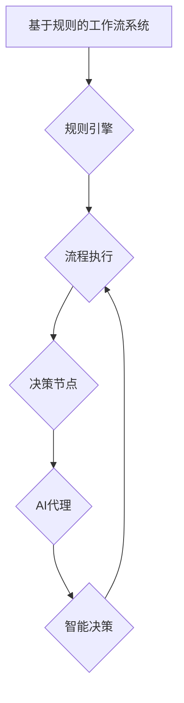

## 基于规则的工作流设计与AI代理的集成应用

> 关键词：工作流设计、AI代理、规则引擎、流程自动化、智能化决策、机器学习、自然语言处理

## 1. 背景介绍

随着数字化转型和智能化浪潮的不断深入，企业对业务流程自动化和智能化决策的需求日益迫切。传统的工作流系统主要依赖于预先定义的规则和流程，难以适应复杂多变的业务场景和不断变化的需求。而人工智能（AI）技术的快速发展为打破这一局限性提供了新的机遇。

AI代理作为一种智能化的自动化技术，能够学习和理解人类的行为模式，并根据上下文信息做出智能决策。将AI代理与基于规则的工作流系统集成，可以实现以下优势：

* **增强流程灵活性:** AI代理可以根据实际情况动态调整流程执行路径，适应复杂和非结构化的业务场景。
* **提升决策效率:** AI代理可以利用机器学习算法分析历史数据，识别模式和趋势，为决策提供数据支持，提高决策效率和准确性。
* **降低人工成本:** AI代理可以自动化执行重复性任务，减轻人工负担，降低运营成本。
* **提升用户体验:** AI代理可以提供个性化服务，根据用户的需求和偏好定制流程，提升用户体验。

## 2. 核心概念与联系

### 2.1 工作流设计

工作流设计是指定义和组织业务流程的活动、步骤和决策，以实现特定目标的过程。传统的基于规则的工作流系统通常采用流程图的形式来描述流程，并使用规则引擎来执行流程。

### 2.2 AI代理

AI代理是一种能够自主学习、决策和执行任务的智能化软件系统。它通常基于机器学习、自然语言处理等人工智能技术，能够理解人类指令和自然语言，并根据上下文信息做出智能决策。

### 2.3 集成架构

将基于规则的工作流系统与AI代理集成，可以构建一个更加灵活、智能化的流程自动化系统。



**架构说明:**

* 基于规则的工作流系统定义了流程的活动、步骤和决策。
* 规则引擎根据预定义的规则执行流程。
* 流程执行过程中，会遇到一些需要智能决策的节点。
* AI代理接管这些决策节点，利用机器学习算法分析数据，做出智能决策。
* AI代理的决策结果反馈到流程执行环节，继续执行流程。

## 3. 核心算法原理 & 具体操作步骤

### 3.1 算法原理概述

AI代理在工作流系统中的应用主要依赖于以下核心算法：

* **机器学习算法:** 用于分析历史数据，识别模式和趋势，为决策提供数据支持。常见的机器学习算法包括决策树、支持向量机、神经网络等。
* **自然语言处理算法:** 用于理解人类指令和自然语言，并将其转换为机器可理解的格式。常见的自然语言处理算法包括词性标注、依存句法分析、文本分类等。
* **强化学习算法:** 用于训练AI代理，使其能够在不断交互的过程中学习最佳决策策略。

### 3.2 算法步骤详解

**AI代理在工作流系统中的应用步骤如下:**

1. **数据收集和预处理:** 收集相关业务数据，并进行清洗、转换和特征工程等预处理操作。
2. **模型训练:** 利用机器学习算法训练AI代理模型，使其能够识别模式和趋势，并做出智能决策。
3. **部署和集成:** 将训练好的AI代理模型部署到工作流系统中，并将其集成到需要智能决策的节点。
4. **流程执行和决策:** 当流程执行到需要AI代理决策的节点时，AI代理会接管该节点，根据上下文信息和历史数据分析，做出智能决策。
5. **结果反馈和评估:** AI代理的决策结果反馈到流程执行环节，继续执行流程。定期评估AI代理的决策效果，并根据评估结果进行模型调整和优化。

### 3.3 算法优缺点

**优点:**

* **提高决策效率和准确性:** AI代理可以利用数据分析和机器学习算法，识别模式和趋势，为决策提供数据支持，提高决策效率和准确性。
* **增强流程灵活性:** AI代理可以根据实际情况动态调整流程执行路径，适应复杂和非结构化的业务场景。
* **降低人工成本:** AI代理可以自动化执行重复性任务，减轻人工负担，降低运营成本。

**缺点:**

* **数据依赖性:** AI代理的决策效果依赖于训练数据的质量和数量。如果训练数据不足或质量差，AI代理的决策效果可能会受到影响。
* **解释性问题:** 一些机器学习算法的决策过程难以解释，这可能会导致决策结果的可信度降低。
* **安全风险:** AI代理的决策可能会受到恶意攻击的影响，导致系统安全风险。

### 3.4 算法应用领域

AI代理与基于规则的工作流系统集成，可以应用于以下领域:

* **金融服务:** 自动化贷款审批、风险评估、欺诈检测等流程。
* **医疗保健:** 自动化病历分析、诊断辅助、预约管理等流程。
* **制造业:** 自动化生产调度、质量控制、设备维护等流程。
* **电商:** 自动化订单处理、客户服务、推荐系统等流程。

## 4. 数学模型和公式 & 详细讲解 & 举例说明

### 4.1 数学模型构建

AI代理的决策过程可以抽象为一个数学模型，其中输入是上下文信息和历史数据，输出是智能决策。

**数学模型:**

```latex
y = f(x_1, x_2,..., x_n)
```

其中:

* $y$ 是智能决策
* $x_1, x_2,..., x_n$ 是上下文信息和历史数据

**函数 $f$** 可以是任何机器学习算法，例如决策树、支持向量机、神经网络等。

### 4.2 公式推导过程

具体的公式推导过程取决于所使用的机器学习算法。例如，决策树算法的决策过程可以表示为一系列的条件判断，每个条件判断都对应一个数学公式。

### 4.3 案例分析与讲解

**举例说明:**

假设我们使用决策树算法训练一个AI代理，用于自动审批贷款申请。

**决策树规则:**

* 如果申请人的信用评分大于 700，则审批通过。
* 否则，如果申请人的收入大于 50000 美元，则审批通过。
* 否则，审批拒绝。

**数学公式:**

```latex
y = \begin{cases}
    通过 & \text{if } score > 700 \\
    通过 & \text{if } income > 50000 \text{ and } score \leq 700 \\
    拒绝 & \text{otherwise}
\end{cases}
```

其中:

* $y$ 是贷款审批结果（通过或拒绝）
* $score$ 是申请人的信用评分
* $income$ 是申请人的收入

## 5. 项目实践：代码实例和详细解释说明

### 5.1 开发环境搭建

* 操作系统: Ubuntu 20.04
* Python 版本: 3.8
* 依赖库:

```
pip install pandas numpy scikit-learn
```

### 5.2 源代码详细实现

```python
import pandas as pd
from sklearn.tree import DecisionTreeClassifier

# 加载贷款申请数据
data = pd.read_csv("loan_data.csv")

# 划分训练集和测试集
X = data.drop("approved", axis=1)
y = data["approved"]
from sklearn.model_selection import train_test_split
X_train, X_test, y_train, y_test = train_test_split(X, y, test_size=0.2, random_state=42)

# 训练决策树模型
model = DecisionTreeClassifier()
model.fit(X_train, y_train)

# 预测测试集数据
y_pred = model.predict(X_test)

# 评估模型性能
from sklearn.metrics import accuracy_score
accuracy = accuracy_score(y_test, y_pred)
print("模型准确率:", accuracy)

# 使用模型进行贷款审批
new_data = pd.DataFrame({
    "score": [750],
    "income": [60000]
})
prediction = model.predict(new_data)
print("新申请的贷款审批结果:", prediction)
```

### 5.3 代码解读与分析

* 代码首先加载贷款申请数据，并划分训练集和测试集。
* 然后，使用决策树算法训练一个贷款审批模型。
* 训练完成后，使用测试集数据评估模型性能。
* 最后，使用训练好的模型对新申请的贷款进行审批。

### 5.4 运行结果展示

运行代码后，会输出模型的准确率和新申请的贷款审批结果。

## 6. 实际应用场景

### 6.1 案例分析

**金融服务:**

一家银行可以使用AI代理自动审批贷款申请，根据申请人的信用评分、收入、资产等信息，智能决策是否审批贷款。

**医疗保健:**

一家医院可以使用AI代理自动分析病历，识别潜在的疾病风险，并推荐相应的治疗方案。

### 6.2 未来应用展望

随着人工智能技术的不断发展，AI代理与基于规则的工作流系统集成将有更广泛的应用场景:

* **个性化服务:** AI代理可以根据用户的需求和偏好，定制个性化的流程，提供更加人性化的服务体验。
* **跨部门协作:** AI代理可以帮助不同部门之间进行协作，自动协调流程，提高工作效率。
* **智能决策支持:** AI代理可以为决策者提供数据分析和智能建议，帮助他们做出更加明智的决策。

## 7. 工具和资源推荐

### 7.1 学习资源推荐

* **书籍:**

    * 《深度学习》
    * 《机器学习实战》
    * 《自然语言处理入门》

* **在线课程:**

    * Coursera: 深度学习、机器学习
    * edX: 自然语言处理、人工智能

### 7.2 开发工具推荐

* **Python:** 广泛应用于人工智能开发，拥有丰富的库和工具。
* **TensorFlow:** 开源深度学习框架，用于训练和部署机器学习模型。
* **PyTorch:** 开源深度学习框架，灵活易用，适合研究和开发。

### 7.3 相关论文推荐

* **Attention Is All You Need:** https://arxiv.org/abs/1706.03762
* **BERT: Pre-training of Deep Bidirectional Transformers for Language Understanding:** https://arxiv.org/abs/1810.04805

## 8. 总结：未来发展趋势与挑战

### 8.1 研究成果总结

AI代理与基于规则的工作流系统集成，为流程自动化和智能化决策提供了新的解决方案。

### 8.2 未来发展趋势

* **更强大的AI模型:** 随着人工智能技术的不断发展，AI代理将拥有更强大的决策能力，能够处理更加复杂和多变的业务场景。
* **更广泛的应用场景:** AI代理将应用于更多领域，例如教育、交通、能源等，推动各行各业的智能化转型。
* **更人性化的交互体验:** AI代理将更加智能化，能够理解和响应用户的自然语言指令，提供更加人性化的交互体验。

### 8.3 面临的挑战

* **数据安全和隐私保护:** AI代理的训练和应用需要大量数据，如何保证数据安全和隐私保护是一个重要的挑战。
* **算法可解释性和透明度:** 一些机器学习算法的决策过程难以解释，这可能会导致决策结果的可信度降低。
* **伦理和社会影响:** AI代理的应用可能会带来一些伦理和社会影响，例如就业岗位的减少、算法偏见等，需要引起重视和关注。

### 8.4 研究展望

未来，