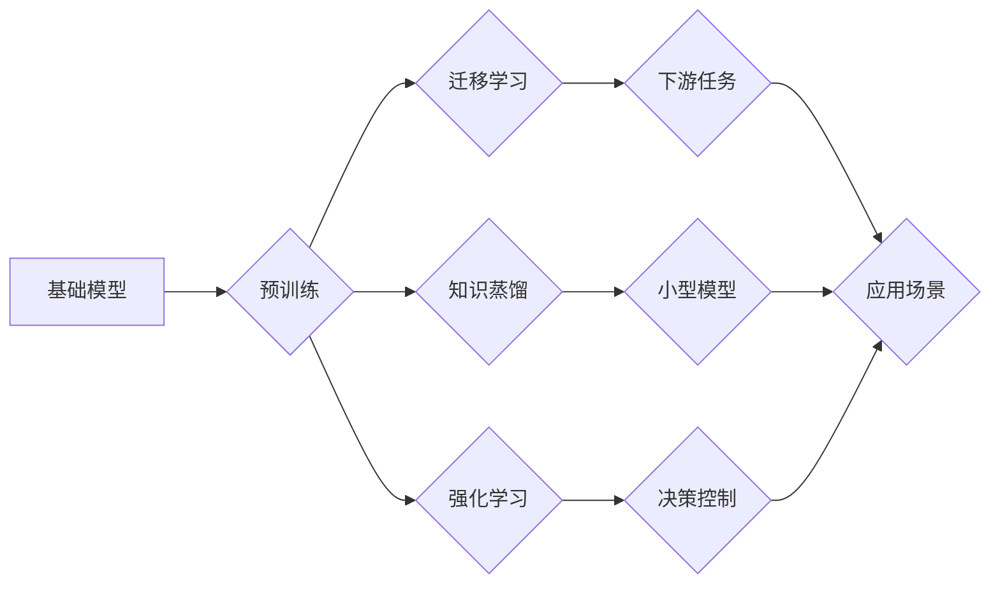

## 基础模型与其他技术的结合

> 关键词：基础模型、大模型、迁移学习、微调、应用场景、技术融合、未来趋势

## 1. 背景介绍

### 1.1  问题的由来

近年来，深度学习领域取得了令人瞩目的进展，尤其是基础模型（Foundation Models）的出现，为人工智能发展带来了新的机遇。基础模型通常是指在海量数据上预训练的大规模神经网络模型，具备强大的泛化能力和表示能力，能够在多种下游任务中表现出色。然而，基础模型的应用并非一帆风顺，其在特定领域或任务上的表现仍然存在局限性。

### 1.2  研究现状

目前，研究者们主要通过以下两种方式来解决基础模型在特定领域应用的挑战：

* **微调（Fine-tuning）：** 将预训练好的基础模型在特定领域的数据上进行进一步训练，以提高其在该领域的任务性能。
* **组合（Ensemble）：** 将多个基础模型组合起来，通过融合不同模型的优势来提升整体性能。

尽管这些方法取得了一定的成果，但仍然存在一些问题，例如微调需要大量的标注数据，组合方法的复杂度较高，难以实现高效的部署。

### 1.3  研究意义

探索基础模型与其他技术的结合，能够有效提升基础模型在特定领域应用的性能，降低其应用门槛，推动人工智能技术向更广泛的应用场景拓展。

### 1.4  本文结构

本文将首先介绍基础模型的概念和特点，然后探讨基础模型与其他技术的结合方式，包括迁移学习、知识蒸馏、强化学习等。接着，我们将深入分析具体的算法原理和操作步骤，并结合数学模型和代码实例进行详细讲解。最后，我们将展望基础模型与其他技术的未来发展趋势和挑战。

## 2. 核心概念与联系

### 2.1  基础模型

基础模型是指在海量数据上预训练的大规模神经网络模型，其特点包括：

* **规模庞大：** 基础模型通常拥有数亿甚至数十亿个参数。
* **泛化能力强：** 在海量数据预训练的基础上，基础模型具备强大的泛化能力，能够应用于多种下游任务。
* **表示能力强：** 基础模型能够学习到丰富的语义表示，为下游任务提供更有效的输入。

### 2.2  其他技术

除了微调和组合，基础模型还可以与其他技术相结合，例如：

* **迁移学习：** 将预训练好的基础模型在新的任务或领域上进行迁移，利用已有知识加速学习。
* **知识蒸馏：** 将知识从大型基础模型转移到小型模型，以提高小型模型的性能和效率。
* **强化学习：** 使用强化学习算法对基础模型进行训练，使其能够在动态环境中进行决策和控制。

### 2.3  Mermaid 流程图



## 3. 核心算法原理 & 具体操作步骤

### 3.1  算法原理概述

迁移学习的核心思想是利用预训练模型在源任务上的知识，迁移到目标任务中，从而提高目标任务的学习效率。

### 3.2  算法步骤详解

1. **预训练：** 在源任务上训练一个大型基础模型，使其学习到丰富的语义表示。
2. **特征提取：** 将预训练好的基础模型作为特征提取器，提取源任务和目标任务的数据特征。
3. **微调：** 在目标任务数据上对基础模型进行微调，调整模型参数，使其能够更好地适应目标任务。

### 3.3  算法优缺点

**优点：**

* 能够利用已有知识，减少目标任务的训练数据需求。
* 能够提高目标任务的学习效率和性能。

**缺点：**

* 源任务和目标任务之间存在一定的差异，迁移效果可能不理想。
* 需要对基础模型进行微调，增加了训练成本。

### 3.4  算法应用领域

迁移学习广泛应用于自然语言处理、计算机视觉、语音识别等领域，例如：

* **文本分类：** 将预训练好的语言模型迁移到新的文本分类任务中。
* **图像识别：** 将预训练好的图像识别模型迁移到新的图像识别任务中。
* **语音识别：** 将预训练好的语音识别模型迁移到新的语音识别任务中。

## 4. 数学模型和公式 & 详细讲解 & 举例说明

### 4.1  数学模型构建

假设我们有一个预训练好的基础模型 $f_{\theta}$，其输入为数据 $x$，输出为特征向量 $h$。目标任务的模型为 $g_{\phi}$，其输入为特征向量 $h$，输出为预测结果 $y$。

迁移学习的目标是学习一个新的模型参数 $\phi$，使得 $g_{\phi}(f_{\theta}(x))$ 在目标任务上的性能最佳。

### 4.2  公式推导过程

可以使用梯度下降算法来优化模型参数 $\phi$。目标函数为目标任务上的损失函数 $L(y, g_{\phi}(f_{\theta}(x)))$。

梯度下降算法的更新公式为：

$$\phi = \phi - \eta \frac{\partial L(y, g_{\phi}(f_{\theta}(x)))}{\partial \phi}$$

其中 $\eta$ 为学习率。

### 4.3  案例分析与讲解

例如，在文本分类任务中，我们可以将预训练好的语言模型BERT作为特征提取器，提取文本的特征向量。然后，将特征向量作为输入，训练一个新的分类模型。

### 4.4  常见问题解答

* **如何选择合适的源任务？**

源任务的选择应该与目标任务有一定的相关性，例如，如果目标任务是文本分类，可以选择使用预训练在文本分类任务上训练的语言模型。

* **如何进行微调？**

微调的策略取决于目标任务和基础模型的结构。一般来说，可以冻结基础模型的部分参数，只微调目标任务模型的参数。

## 5. 项目实践：代码实例和详细解释说明

### 5.1  开发环境搭建

* Python 3.6+
* TensorFlow/PyTorch
* CUDA

### 5.2  源代码详细实现

```python
# 使用BERT作为特征提取器
from transformers import BertTokenizer, BertModel

# 加载预训练模型
tokenizer = BertTokenizer.from_pretrained('bert-base-uncased')
model = BertModel.from_pretrained('bert-base-uncased')

# 对文本进行编码
text = "This is a sample text."
inputs = tokenizer(text, return_tensors='pt')
outputs = model(**inputs)

# 获取特征向量
feature_vector = outputs.last_hidden_state[:, 0, :]

# 训练分类模型
from sklearn.linear_model import LogisticRegression

# 训练分类模型
classifier = LogisticRegression()
classifier.fit(feature_vector, labels)

# 预测结果
new_text = "This is another sample text."
new_inputs = tokenizer(new_text, return_tensors='pt')
new_outputs = model(**new_inputs)
new_feature_vector = new_outputs.last_hidden_state[:, 0, :]
prediction = classifier.predict(new_feature_vector)
```

### 5.3  代码解读与分析

* 使用`transformers`库加载预训练的BERT模型和词典。
* 对输入文本进行编码，获取特征向量。
* 使用`sklearn`库训练一个简单的逻辑回归分类模型。
* 使用训练好的模型对新文本进行预测。

### 5.4  运行结果展示

运行结果将显示对新文本的分类预测结果。

## 6. 实际应用场景

基础模型与其他技术的结合在各个领域都有着广泛的应用场景，例如：

* **医疗诊断：** 将预训练好的医学图像识别模型迁移到新的疾病诊断任务中。
* **金融风险评估：** 将预训练好的文本分析模型迁移到新的金融风险评估任务中。
* **个性化推荐：** 将预训练好的用户行为分析模型迁移到新的个性化推荐任务中。

### 6.4  未来应用展望

随着基础模型的不断发展和完善，其与其他技术的结合将更加深入，应用场景也将更加广泛。例如：

* **多模态学习：** 将基础模型应用于多模态数据，例如文本、图像、音频等数据的融合学习。
* **联邦学习：** 将基础模型应用于联邦学习，实现数据隐私保护下的模型训练和部署。
* **边缘计算：** 将基础模型部署到边缘设备，实现高效的本地推理和决策。

## 7. 工具和资源推荐

### 7.1  学习资源推荐

* **论文：**
    * [BERT: Pre-training of Deep Bidirectional Transformers for Language Understanding](https://arxiv.org/abs/1810.04805)
    * [GPT-3: Language Models are Few-Shot Learners](https://arxiv.org/abs/2005.14165)
    * [DALL-E: Creating Images from Text](https://openai.com/blog/dall-e/)
* **书籍：**
    * Deep Learning
    * Hands-On Machine Learning with Scikit-Learn, Keras & TensorFlow

### 7.2  开发工具推荐

* **TensorFlow:** https://www.tensorflow.org/
* **PyTorch:** https://pytorch.org/
* **Hugging Face Transformers:** https://huggingface.co/docs/transformers/index

### 7.3  相关论文推荐

* [Transfer Learning](https://arxiv.org/abs/1503.02936)
* [Knowledge Distillation](https://arxiv.org/abs/1503.02531)
* [Reinforcement Learning: An Introduction](https://www.deepmind.com/research/open-source/deep-q-network)

### 7.4  其他资源推荐

* **Kaggle:** https://www.kaggle.com/
* **GitHub:** https://github.com/

## 8. 总结：未来发展趋势与挑战

### 8.1  研究成果总结

基础模型与其他技术的结合取得了显著的成果，在多个领域实现了性能提升和应用拓展。

### 8.2  未来发展趋势

未来，基础模型与其他技术的结合将朝着以下方向发展：

* **更强大的基础模型：** 模型规模将继续扩大，模型能力将进一步提升。
* **更有效的结合方式：** 研究者将探索更有效的结合方式，例如多模态学习、联邦学习等。
* **更广泛的应用场景：** 基础模型将应用于更多领域，例如科学研究、教育、医疗等。

### 8.3  面临的挑战

基础模型与其他技术的结合仍然面临一些挑战，例如：

* **数据获取和标注：** 训练和微调基础模型需要大量的标注数据，数据获取和标注成本较高。
* **模型解释性和可解释性：** 基础模型的决策过程复杂，难以解释和理解，这限制了其在一些领域应用的推广。
* **模型安全性和可靠性：** 基础模型可能存在安全漏洞和可靠性问题，需要进一步研究和解决。

### 8.4  研究展望

未来，研究者将继续探索基础模型与其他技术的结合，以解决上述挑战，推动人工智能技术向更广泛的应用场景拓展。

## 9. 附录：常见问题与解答

* **Q：基础模型的训练成本很高吗？**

A：是的，训练大型基础模型需要大量的计算资源和时间，成本较高。

* **Q：基础模型的应用场景有哪些？**

A：基础模型的应用场景非常广泛，例如自然语言处理、计算机视觉、语音识别等。

* **Q：如何选择合适的基础模型？**

A：选择合适的基础模型需要根据具体的应用场景和任务需求进行选择。

* **Q：基础模型的未来发展趋势是什么？**

A：基础模型的未来发展趋势是模型规模更大、能力更强、应用场景更广泛。


作者：禅与计算机程序设计艺术 / Zen and the Art of Computer Programming