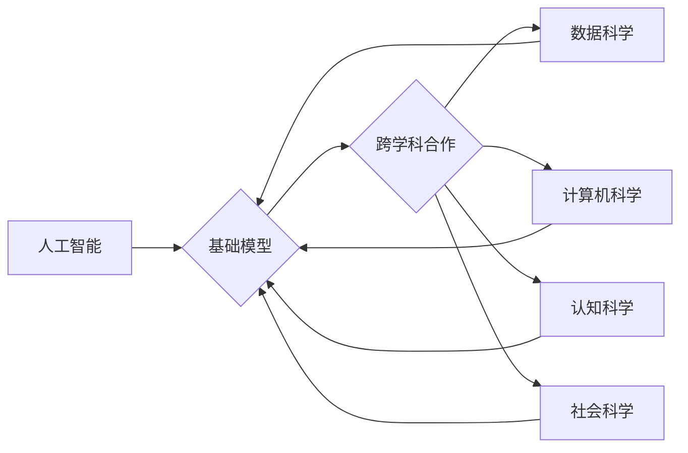

## 基础模型的跨学科合作研究

> 关键词：基础模型、跨学科合作、人工智能、机器学习、深度学习、自然语言处理、计算机视觉、科学发现

### 1. 背景介绍

人工智能（AI）近年来取得了令人瞩目的进展，这得益于基础模型的蓬勃发展。基础模型是指在海量数据上预训练的大规模深度学习模型，具有强大的泛化能力和可迁移性，能够应用于各种下游任务，如自然语言处理、计算机视觉、语音识别等。

然而，基础模型的训练和应用仍然面临着诸多挑战：

* **数据获取和标注**: 训练高性能基础模型需要海量高质量数据，而获取和标注这些数据成本高昂且耗时。
* **计算资源**: 基础模型的训练需要大量的计算资源，这对于个人开发者和小型研究机构来说是一个巨大的障碍。
* **模型解释性和可控性**: 基础模型通常是黑盒模型，难以解释其决策过程，这限制了其在安全关键领域中的应用。
* **伦理和社会影响**: 基础模型的应用可能带来伦理和社会问题，例如算法偏见、隐私泄露等，需要引起足够的重视。

为了克服这些挑战，跨学科合作研究显得尤为重要。将人工智能与其他学科的知识和方法相结合，可以从多个角度提升基础模型的性能、安全性、可解释性和社会责任感。

### 2. 核心概念与联系

基础模型的跨学科合作研究涉及多个核心概念和联系，主要包括：

* **人工智能 (AI)**：指模拟人类智能的计算机系统，包括机器学习、深度学习、自然语言处理等领域。
* **机器学习 (ML)**：指通过算法学习数据模式，并根据这些模式进行预测或决策。
* **深度学习 (DL)**：一种基于多层神经网络的机器学习方法，能够学习更复杂的特征表示。
* **基础模型 (Foundation Model)**：在海量数据上预训练的大规模深度学习模型，具有强大的泛化能力和可迁移性。
* **跨学科合作**: 将不同学科的知识和方法相结合，解决复杂问题。

**Mermaid 流程图**



### 3. 核心算法原理 & 具体操作步骤

#### 3.1  算法原理概述

基础模型的训练主要基于深度学习算法，其中最常用的算法是**Transformer**。Transformer是一种基于注意力机制的神经网络架构，能够有效地处理序列数据，例如文本和音频。

Transformer的注意力机制允许模型关注输入序列中与当前任务相关的部分，从而提高学习效率和准确性。

#### 3.2  算法步骤详解

1. **数据预处理**: 将原始数据转换为模型可理解的格式，例如将文本数据转换为词向量。
2. **模型架构设计**: 根据任务需求选择合适的Transformer架构，例如BERT、GPT、T5等。
3. **预训练**: 在海量数据上训练模型，学习语言的语法和语义知识。
4. **下游任务微调**: 将预训练模型应用于特定下游任务，例如文本分类、机器翻译、问答系统等，通过少量标注数据进行微调。

#### 3.3  算法优缺点

**优点**:

* **强大的泛化能力**: 预训练模型在海量数据上学习到的知识能够应用于各种下游任务。
* **可迁移性**: 预训练模型可以迁移到不同的任务和领域。
* **效率**: 预训练模型的微调过程比从头训练模型更加高效。

**缺点**:

* **数据依赖**: 预训练模型的性能取决于训练数据的质量和数量。
* **计算资源**: 预训练模型的训练需要大量的计算资源。
* **模型解释性**: Transformer模型通常是黑盒模型，难以解释其决策过程。

#### 3.4  算法应用领域

Transformer算法在自然语言处理、计算机视觉、语音识别等领域都有广泛的应用，例如：

* **自然语言处理**: 文本分类、机器翻译、问答系统、文本生成等。
* **计算机视觉**: 图像分类、目标检测、图像分割等。
* **语音识别**: 语音转文本、语音合成等。

### 4. 数学模型和公式 & 详细讲解 & 举例说明

#### 4.1  数学模型构建

Transformer模型的核心是**注意力机制**，它通过计算输入序列中每个词与其他词之间的相关性，来学习词之间的语义关系。

注意力机制可以表示为以下公式：

$$
Attention(Q, K, V) = softmax(\frac{QK^T}{\sqrt{d_k}})V
$$

其中：

* $Q$：查询矩阵
* $K$：键矩阵
* $V$：值矩阵
* $d_k$：键向量的维度
* $softmax$：softmax函数

#### 4.2  公式推导过程

注意力机制的公式推导过程可以分为以下几个步骤：

1. 计算查询矩阵 $Q$ 与键矩阵 $K$ 的点积，并进行归一化处理。
2. 应用softmax函数将点积结果转换为概率分布。
3. 将概率分布与值矩阵 $V$ 进行加权求和，得到最终的注意力输出。

#### 4.3  案例分析与讲解

例如，在机器翻译任务中，Transformer模型可以将源语言句子中的每个词作为查询，将目标语言句子中的每个词作为键，并将目标语言词典作为值。通过计算注意力机制，模型可以学习源语言句子中每个词与目标语言句子中哪些词相关，从而进行准确的翻译。

### 5. 项目实践：代码实例和详细解释说明

#### 5.1  开发环境搭建

为了实现基础模型的跨学科合作研究，需要搭建一个合适的开发环境。

* **操作系统**: Linux 或 macOS
* **编程语言**: Python
* **深度学习框架**: TensorFlow 或 PyTorch
* **硬件**: GPU 

#### 5.2  源代码详细实现

以下是一个使用PyTorch实现Transformer模型的简单代码示例：

```python
import torch
import torch.nn as nn

class Transformer(nn.Module):
    def __init__(self, input_size, hidden_size, num_layers, num_heads):
        super(Transformer, self).__init__()
        self.encoder = nn.TransformerEncoder(nn.TransformerEncoderLayer(d_model=hidden_size, nhead=num_heads), num_layers)
        self.decoder = nn.TransformerDecoder(nn.TransformerDecoderLayer(d_model=hidden_size, nhead=num_heads), num_layers)
        self.linear = nn.Linear(hidden_size, input_size)

    def forward(self, src, tgt, src_mask, tgt_mask):
        src = self.encoder(src, src_mask)
        tgt = self.decoder(tgt, src, tgt_mask)
        output = self.linear(tgt)
        return output
```

#### 5.3  代码解读与分析

* `__init__` 方法初始化模型参数，包括输入尺寸、隐藏尺寸、层数和注意力头数。
* `forward` 方法定义模型的正向传播过程，包括编码器、解码器和线性层。
* `nn.TransformerEncoder` 和 `nn.TransformerDecoder` 是PyTorch提供的Transformer编码器和解码器模块。
* `src_mask` 和 `tgt_mask` 用于屏蔽输入和输出序列中不必要的元素，防止模型学习到不必要的依赖关系。

#### 5.4  运行结果展示

运行上述代码可以训练一个简单的Transformer模型，并评估其在特定下游任务上的性能。

### 6. 实际应用场景

基础模型的跨学科合作研究在多个实际应用场景中展现出巨大潜力：

* **科学发现**: 基于基础模型的知识图谱和推理能力，可以帮助科学家更快地发现新的科学规律和知识。
* **医疗诊断**: 基于基础模型的图像识别和自然语言处理能力，可以帮助医生更快、更准确地诊断疾病。
* **教育教学**: 基于基础模型的个性化学习和智能辅导能力，可以帮助学生更好地理解知识和提高学习效率。
* **社会治理**: 基于基础模型的文本分析和预测能力，可以帮助政府更好地了解社会问题和制定政策。

### 6.4  未来应用展望

随着基础模型技术的不断发展，其跨学科合作研究将带来更多创新应用，例如：

* **跨模态理解**: 基于基础模型的跨模态理解能力，可以帮助机器理解和生成不同模态的数据，例如文本、图像、音频等。
* **个性化服务**: 基于基础模型的个性化学习能力，可以提供更加个性化的服务，例如推荐系统、智能客服等。
* **自动代码生成**: 基于基础模型的代码生成能力，可以帮助程序员更快地编写代码，提高开发效率。

### 7. 工具和资源推荐

#### 7.1  学习资源推荐

* **书籍**:
    * 《深度学习》 - Ian Goodfellow, Yoshua Bengio, Aaron Courville
    * 《Transformer 详解》 - Jay Alammar
* **在线课程**:
    * Coursera: Deep Learning Specialization
    * fast.ai: Practical Deep Learning for Coders
* **博客**:
    * Jay Alammar's Blog: https://jalammar.github.io/
    * Google AI Blog: https://ai.googleblog.com/

#### 7.2  开发工具推荐

* **深度学习框架**: TensorFlow, PyTorch
* **自然语言处理库**: NLTK, spaCy
* **计算机视觉库**: OpenCV, Pillow

#### 7.3  相关论文推荐

* **Attention Is All You Need**: https://arxiv.org/abs/1706.03762
* **BERT: Pre-training of Deep Bidirectional Transformers for Language Understanding**: https://arxiv.org/abs/1810.04805
* **GPT-3: Language Models are Few-Shot Learners**: https://arxiv.org/abs/2005.14165

### 8. 总结：未来发展趋势与挑战

#### 8.1  研究成果总结

基础模型的跨学科合作研究取得了显著成果，例如：

* **模型性能提升**: 基于跨学科合作的模型在多个任务上取得了更好的性能。
* **模型解释性增强**: 将认知科学和社会科学的知识融入模型设计，可以提高模型的解释性和可控性。
* **应用场景拓展**: 基础模型的跨学科合作研究拓展了其应用场景，例如科学发现、医疗诊断、教育教学等。

#### 8.2  未来发展趋势

未来基础模型的跨学科合作研究将朝着以下方向发展：

* **更强大的模型**: 训练更大规模、更复杂的模型，例如多模态基础模型、跨语言基础模型等。
* **更广泛的应用**: 将基础模型应用于更多领域，例如自动驾驶、机器人、金融等。
* **更安全的模型**: 提高模型的安全性、可靠性和可解释性，解决模型偏见、隐私泄露等问题。

#### 8.3  面临的挑战

基础模型的跨学科合作研究也面临着一些挑战：

* **数据获取和标注**: 获取高质量、跨学科的训练数据仍然是一个难题。
* **算法设计**: 设计能够有效地融合不同学科知识的算法仍然是一个挑战。
* **伦理和社会影响**: 基础模型的应用可能带来伦理和社会问题，需要引起足够的重视。

#### 8.4  研究展望

尽管面临挑战，但基础模型的跨学科合作研究仍然充满希望。随着人工智能技术的不断发展，以及跨学科合作的深入，基础模型将发挥越来越重要的作用，推动人类社会进步。

### 9. 附录：常见问题与解答

* **什么是基础模型？**

基础模型是指在海量数据上预训练的大规模深度学习模型，具有强大的泛化能力和可迁移性。

* **基础模型的跨学科合作研究有什么意义？**

基础模型的