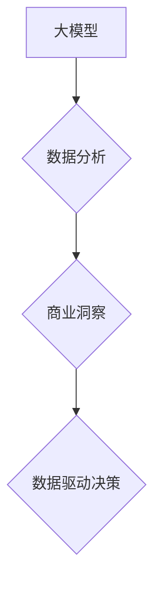

## 大模型：商业智能的新引擎

> 关键词：大模型、深度学习、自然语言处理、计算机视觉、商业智能、数据分析、预测建模

### 1. 背景介绍

近年来，人工智能（AI）技术取得了飞速发展，其中大模型作为AI领域的重要突破，正在深刻地改变着商业智能（BI）的格局。大模型是指参数规模庞大、训练数据海量的人工智能模型，其强大的学习能力和泛化能力使其能够处理复杂的数据分析任务，并提供更精准、更深入的商业洞察。

传统BI系统主要依赖于结构化数据和预先定义的规则，难以应对海量非结构化数据的分析需求。而大模型能够处理各种类型的数据，包括文本、图像、音频等，并从中提取有价值的信息。例如，大模型可以分析客户评论、社交媒体数据、市场报告等，识别潜在的市场趋势、客户需求和竞争对手动向，为企业决策提供更全面的支持。

### 2. 核心概念与联系

大模型的核心概念是深度学习，它是一种模仿人类大脑学习机制的机器学习方法。深度学习模型由多层神经网络组成，每层神经元都连接着上一层的输出，通过层层传递和学习，最终能够提取数据的抽象特征和模式。

大模型的训练需要海量数据和强大的计算资源。通过对大量数据的训练，大模型能够学习到复杂的知识和规律，并将其应用于新的数据分析任务。

**大模型与商业智能的联系**



大模型为商业智能提供了强大的数据分析能力，能够帮助企业从海量数据中挖掘出有价值的洞察，并将其转化为数据驱动的决策。

### 3. 核心算法原理 & 具体操作步骤

#### 3.1  算法原理概述

大模型的核心算法是Transformer，它是一种基于注意力机制的神经网络架构。Transformer能够有效地处理序列数据，例如文本和时间序列数据，并捕捉数据之间的长距离依赖关系。

注意力机制的核心思想是让模型关注输入序列中与当前任务最相关的部分。通过计算每个词与其他词之间的相关性，Transformer能够识别出句子中的关键信息，并将其用于预测下一个词或完成其他任务。

#### 3.2  算法步骤详解

1. **输入编码:** 将输入序列（例如文本句子）转换为向量表示。
2. **多头注意力:** 使用多个注意力头并行处理输入序列，捕捉不同层次的语义信息。
3. **前馈网络:** 对每个词的向量表示进行非线性变换，进一步提取特征。
4. **位置编码:** 添加位置信息，使模型能够理解词语在序列中的顺序关系。
5. **输出解码:** 将编码后的序列转换为输出序列（例如翻译文本或生成文本）。

#### 3.3  算法优缺点

**优点:**

* 能够处理长序列数据，捕捉长距离依赖关系。
* 训练效率高，能够在大型数据集上进行高效训练。
* 表现优异，在许多自然语言处理任务中取得了state-of-the-art的结果。

**缺点:**

* 参数量大，需要大量的计算资源进行训练和推理。
* 训练数据对模型性能影响较大，需要大量高质量的数据进行训练。
* 训练过程复杂，需要专业的技术人员进行操作。

#### 3.4  算法应用领域

Transformer算法在自然语言处理领域有着广泛的应用，例如：

* 机器翻译
* 文本摘要
* 问答系统
* 情感分析
* 代码生成

### 4. 数学模型和公式 & 详细讲解 & 举例说明

#### 4.1  数学模型构建

Transformer模型的核心是多头注意力机制，其数学模型可以表示为：

$$
Attention(Q, K, V) = softmax(\frac{QK^T}{\sqrt{d_k}})V
$$

其中：

* $Q$：查询矩阵
* $K$：键矩阵
* $V$：值矩阵
* $d_k$：键向量的维度
* $softmax$：softmax函数

#### 4.2  公式推导过程

注意力机制的目的是计算每个词与其他词之间的相关性，并根据相关性权重来加权求和。

1. 计算查询矩阵 $Q$ 与键矩阵 $K$ 的点积，得到一个得分矩阵。
2. 对得分矩阵进行归一化，使用softmax函数将得分转换为概率分布。
3. 将概率分布与值矩阵 $V$ 进行加权求和，得到每个词的注意力输出。

#### 4.3  案例分析与讲解

例如，在机器翻译任务中，Transformer模型可以将源语言句子转换为向量表示，然后使用注意力机制计算每个词与目标语言词语之间的相关性。根据相关性权重，模型可以将源语言句子中的信息映射到目标语言句子中，从而实现翻译。

### 5. 项目实践：代码实例和详细解释说明

#### 5.1  开发环境搭建

* Python 3.7+
* PyTorch 或 TensorFlow
* CUDA 和 cuDNN

#### 5.2  源代码详细实现

```python
import torch
import torch.nn as nn

class Attention(nn.Module):
    def __init__(self, d_model, num_heads):
        super(Attention, self).__init__()
        self.d_model = d_model
        self.num_heads = num_heads
        self.head_dim = d_model // num_heads

        self.query = nn.Linear(d_model, d_model)
        self.key = nn.Linear(d_model, d_model)
        self.value = nn.Linear(d_model, d_model)
        self.fc_out = nn.Linear(d_model, d_model)

    def forward(self, query, key, value, mask=None):
        batch_size = query.size(0)

        # Linear projections
        Q = self.query(query).view(batch_size, -1, self.num_heads, self.head_dim).transpose(1, 2)
        K = self.key(key).view(batch_size, -1, self.num_heads, self.head_dim).transpose(1, 2)
        V = self.value(value).view(batch_size, -1, self.num_heads, self.head_dim).transpose(1, 2)

        # Scaled dot-product attention
        scores = torch.matmul(Q, K.transpose(-2, -1)) / torch.sqrt(torch.tensor(self.head_dim, dtype=torch.float))
        if mask is not None:
            scores = scores.masked_fill(mask == 0, -1e9)
        attention = torch.softmax(scores, dim=-1)

        # Weighted sum of values
        context = torch.matmul(attention, V)

        # Concatenate heads and project
        context = context.transpose(1, 2).contiguous().view(batch_size, -1, self.d_model)
        output = self.fc_out(context)

        return output
```

#### 5.3  代码解读与分析

这段代码实现了Transformer模型中的多头注意力机制。

* `__init__` 方法初始化模型参数，包括模型维度、注意力头数等。
* `forward` 方法实现注意力机制的计算过程，包括线性投影、缩放点积注意力、加权求和等步骤。

#### 5.4  运行结果展示

运行上述代码可以得到注意力机制的输出结果，例如每个词的注意力权重分布。

### 6. 实际应用场景

大模型在商业智能领域有着广泛的应用场景，例如：

* **客户关系管理 (CRM):** 分析客户数据，识别客户行为模式，预测客户 churn，提供个性化服务。
* **市场营销:** 分析市场趋势，识别潜在客户，优化营销策略，提高营销效果。
* **财务分析:** 分析财务数据，预测财务风险，优化投资决策。
* **供应链管理:** 分析供应链数据，优化库存管理，提高供应链效率。

### 6.4  未来应用展望

随着大模型技术的不断发展，其在商业智能领域的应用将更加广泛和深入。例如：

* **更精准的预测:** 大模型能够处理更复杂的数据，并进行更精准的预测，为企业决策提供更可靠的依据。
* **更个性化的服务:** 大模型能够根据用户的个人特征和行为模式，提供更个性化的服务，提升用户体验。
* **更智能的自动化:** 大模型能够自动完成一些重复性的数据分析任务，解放人力资源，提高工作效率。

### 7. 工具和资源推荐

#### 7.1  学习资源推荐

* **书籍:**
    * 《深度学习》
    * 《自然语言处理》
    * 《Transformer模型详解》
* **在线课程:**
    * Coursera: 深度学习
    * Udacity: 自然语言处理
    * fast.ai: 深度学习

#### 7.2  开发工具推荐

* **PyTorch:** 开源深度学习框架
* **TensorFlow:** 谷歌开源深度学习框架
* **Hugging Face Transformers:** 提供预训练的Transformer模型和工具

#### 7.3  相关论文推荐

* 《Attention Is All You Need》
* 《BERT: Pre-training of Deep Bidirectional Transformers for Language Understanding》
* 《GPT-3: Language Models are Few-Shot Learners》

### 8. 总结：未来发展趋势与挑战

#### 8.1  研究成果总结

大模型在商业智能领域取得了显著的成果，例如在客户关系管理、市场营销、财务分析等方面展现出强大的应用潜力。

#### 8.2  未来发展趋势

* **模型规模进一步扩大:** 随着计算资源的不断提升，大模型的规模将继续扩大，模型能力将进一步增强。
* **模型训练效率提升:** 研究人员将继续探索新的训练方法和算法，提高大模型的训练效率。
* **模型应用场景更加广泛:** 大模型将应用于更多商业智能场景，为企业提供更全面的解决方案。

#### 8.3  面临的挑战

* **数据安全和隐私:** 大模型的训练需要海量数据，如何保证数据安全和隐私是一个重要的挑战。
* **模型解释性和可信度:** 大模型的决策过程往往是复杂的，如何提高模型的解释性和可信度是一个重要的研究方向。
* **模型部署和维护:** 大模型的部署和维护需要强大的计算资源和技术支持，这对企业来说是一个挑战。

#### 8.4  研究展望

未来，大模型研究将继续朝着更强大、更智能、更安全的方向发展。

### 9. 附录：常见问题与解答

* **什么是大模型？** 大模型是指参数规模庞大、训练数据海量的人工智能模型。
* **大模型有哪些应用场景？** 大模型在商业智能领域有着广泛的应用场景，例如客户关系管理、市场营销、财务分析等。
* **如何训练大模型？** 训练大模型需要大量的计算资源和数据，通常使用深度学习框架和分布式训练技术。


作者：禅与计算机程序设计艺术 / Zen and the Art of Computer Programming 
