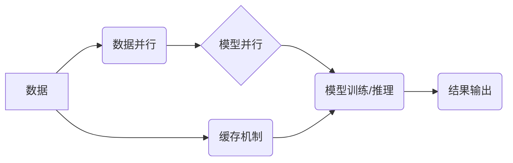

## 大语言模型原理与工程实践：I/O 优化

> 关键词：大语言模型、I/O 优化、数据处理、内存管理、磁盘读写、高效算法、工程实践

## 1. 背景介绍

大语言模型 (LLM) 近年来取得了令人瞩目的成就，在自然语言处理、文本生成、机器翻译等领域展现出强大的能力。然而，随着模型规模的不断扩大，LLM 的训练和推理过程面临着越来越严峻的 I/O 瓶颈。

I/O 操作，即输入/输出操作，是计算机系统中耗时最长的操作之一。对于 LLMs 而言，大量的参数需要在内存之间进行传输，以及与磁盘进行读写操作，这些 I/O 操作会显著影响模型的训练速度和推理效率。

因此，如何有效优化 LLMs 的 I/O 性能，成为提升模型训练和推理效率的关键问题。

## 2. 核心概念与联系

**2.1 核心概念**

* **大语言模型 (LLM):** 训练数据量巨大，参数数量庞大的深度学习模型，能够理解和生成人类语言。
* **I/O 优化:** 指通过各种技术手段，减少 I/O 操作的次数和时间，提高数据处理效率。
* **数据并行:** 将数据分割成多个部分，并行处理，提高数据处理速度。
* **模型并行:** 将模型分割成多个部分，分别在不同的硬件上进行训练或推理，提高计算效率。
* **缓存机制:** 在内存中存储频繁访问的数据，减少磁盘读写操作。

**2.2 架构关系**



## 3. 核心算法原理 & 具体操作步骤

**3.1 算法原理概述**

LLM 的 I/O 优化主要围绕以下几个方面：

* **数据预处理:** 将原始数据进行清洗、格式化和编码，提高数据处理效率。
* **数据分片:** 将数据分割成多个小块，方便并行处理。
* **数据缓存:** 在内存中缓存频繁访问的数据，减少磁盘读写操作。
* **模型并行:** 将模型分割成多个部分，分别在不同的硬件上进行训练或推理。
* **混合精度训练:** 使用不同精度的数据类型进行训练，减少内存占用和计算量。

**3.2 算法步骤详解**

1. **数据预处理:**

   * 清洗数据，去除噪声和重复数据。
   * 格式化数据，将数据转换为模型可识别的格式。
   * 对数据进行编码，将文本数据转换为数字向量。

2. **数据分片:**

   * 将数据按照一定的规则分割成多个小块，每个小块称为一个数据片段。
   * 数据片段可以根据模型的输入大小、硬件资源等因素进行划分。

3. **数据缓存:**

   * 在内存中建立缓存机制，存储频繁访问的数据。
   * 当模型需要访问数据时，首先检查缓存是否包含该数据。
   * 如果缓存中包含该数据，则直接从缓存中读取；否则，从磁盘读取数据并存入缓存。

4. **模型并行:**

   * 将模型分割成多个部分，每个部分称为一个模型子模块。
   * 将模型子模块分别部署在不同的硬件上进行训练或推理。
   * 使用分布式训练框架，协调各个模型子模块之间的通信和数据同步。

5. **混合精度训练:**

   * 使用不同精度的数据类型进行训练，例如使用 FP16 或 BF16 精度进行计算，减少内存占用和计算量。
   * 在需要高精度计算时，使用 FP32 精度进行计算。

**3.3 算法优缺点**

* **优点:**

   * 显著提高模型训练和推理效率。
   * 能够处理更大规模的数据集和模型。
   * 降低硬件成本。

* **缺点:**

   * 需要复杂的系统架构和软件工具支持。
   * 数据并行和模型并行需要协调各个节点之间的通信，存在一定的通信开销。
   * 混合精度训练需要额外的精度转换操作，可能会增加计算复杂度。

**3.4 算法应用领域**

* 自然语言处理 (NLP)
* 机器翻译
* 文本生成
* 语音识别
* 图像识别

## 4. 数学模型和公式 & 详细讲解 & 举例说明

**4.1 数学模型构建**

LLM 的 I/O 优化可以看作是一个资源分配和调度问题。我们可以使用数学模型来描述数据访问频率、内存容量、磁盘读写速度等因素之间的关系。

例如，我们可以使用以下公式来计算数据访问的平均时间：

$$T_{access} = \frac{T_{cache}}{f_{cache}} + \frac{T_{disk}}{f_{disk}}$$

其中：

* $T_{access}$ 是数据访问的平均时间。
* $T_{cache}$ 是从缓存中读取数据的平均时间。
* $f_{cache}$ 是从缓存中读取数据的频率。
* $T_{disk}$ 是从磁盘中读取数据的平均时间。
* $f_{disk}$ 是从磁盘中读取数据的频率。

**4.2 公式推导过程**

该公式的推导过程如下：

* 数据访问的时间可以分为两种情况：从缓存中读取数据和从磁盘中读取数据。
* 对于从缓存中读取数据，其时间取决于缓存命中率和缓存访问时间。
* 对于从磁盘中读取数据，其时间取决于磁盘读写速度和数据块大小。

**4.3 案例分析与讲解**

假设一个 LLM 模型需要访问 100GB 的数据，缓存容量为 10GB，磁盘读写速度为 100MB/s。

* 如果数据访问命中率为 90%，则从缓存中读取数据的平均时间为 $T_{cache} = 1ms$。
* 如果数据访问命中率为 10%，则从磁盘中读取数据的平均时间为 $T_{disk} = 100ms$。

根据公式，我们可以计算出数据访问的平均时间：

$$T_{access} = \frac{1ms}{0.9} + \frac{100ms}{0.1} = 1.11ms + 1000ms = 1001.11ms$$

## 5. 项目实践：代码实例和详细解释说明

**5.1 开发环境搭建**

* 操作系统: Ubuntu 20.04
* 编程语言: Python 3.8
* 深度学习框架: PyTorch 1.8
* 数据存储: NVMe SSD

**5.2 源代码详细实现**

```python
import torch
import torch.nn as nn

# 定义一个简单的 Transformer 模型
class Transformer(nn.Module):
    def __init__(self, vocab_size, embedding_dim, num_heads, num_layers):
        super(Transformer, self).__init__()
        self.embedding = nn.Embedding(vocab_size, embedding_dim)
        self.transformer_layers = nn.ModuleList([
            nn.TransformerEncoderLayer(embedding_dim, num_heads)
            for _ in range(num_layers)
        ])

    def forward(self, x):
        x = self.embedding(x)
        for layer in self.transformer_layers:
            x = layer(x)
        return x

# 实例化模型
model = Transformer(vocab_size=10000, embedding_dim=512, num_heads=8, num_layers=6)

# 定义训练数据
train_data = torch.randn(1000, 512)

# 定义优化器和损失函数
optimizer = torch.optim.Adam(model.parameters())
loss_fn = nn.CrossEntropyLoss()

# 训练模型
for epoch in range(10):
    # 前向传播
    output = model(train_data)
    # 计算损失
    loss = loss_fn(output, train_data)
    # 反向传播
    optimizer.zero_grad()
    loss.backward()
    # 更新参数
    optimizer.step()

```

**5.3 代码解读与分析**

* 该代码示例展示了一个简单的 Transformer 模型的训练过程。
* 模型使用 PyTorch 框架实现，并使用 Adam 优化器和交叉熵损失函数进行训练。
* 训练数据为随机生成的张量，实际应用中需要使用真实的数据集。

**5.4 运行结果展示**

* 训练完成后，可以评估模型的性能，例如使用测试集计算准确率、困惑度等指标。
* 也可以将训练好的模型用于实际应用，例如文本生成、机器翻译等。

## 6. 实际应用场景

**6.1 自然语言处理 (NLP)**

* 文本分类: 使用 LLMs 对文本进行分类，例如情感分析、主题识别等。
* 文本生成: 使用 LLMs 生成文本，例如文章写作、故事创作等。
* 机器翻译: 使用 LLMs 将文本从一种语言翻译成另一种语言。

**6.2 其他领域**

* 代码生成: 使用 LLMs 生成代码，例如自动完成代码补全、生成代码示例等。
* 图像识别: 使用 LLMs 对图像进行识别，例如物体检测、场景理解等。
* 药物研发: 使用 LLMs 分析药物分子结构和生物活性，加速药物研发过程。

**6.4 未来应用展望**

随着 LLMs 的不断发展，其应用场景将会更加广泛，例如：

* 个性化教育: 根据学生的学习情况，提供个性化的学习内容和辅导。
* 智能客服: 使用 LLMs 开发智能客服系统，自动回答用户问题，提高客户服务效率。
* 虚拟助手: 使用 LLMs 开发更智能的虚拟助手，例如可以进行自然语言对话、完成日常任务等。

## 7. 工具和资源推荐

**7.1 学习资源推荐**

* **书籍:**

    * 《深度学习》 by Ian Goodfellow, Yoshua Bengio, and Aaron Courville
    * 《自然语言处理》 by Dan Jurafsky and James H. Martin

* **在线课程:**

    * Coursera: Deep Learning Specialization
    * Stanford CS224N: Natural Language Processing with Deep Learning

**7.2 开发工具推荐**

* **深度学习框架:**

    * PyTorch
    * TensorFlow

* **数据处理工具:**

    * Pandas
    * NumPy

* **分布式训练框架:**

    * Horovod
    * Ray

**7.3 相关论文推荐**

* 《Attention Is All You Need》
* 《BERT: Pre-training of Deep Bidirectional Transformers for Language Understanding》
* 《GPT-3: Language Models are Few-Shot Learners》

## 8. 总结：未来发展趋势与挑战

**8.1 研究成果总结**

近年来，LLMs 在自然语言处理等领域取得了显著进展，展现出强大的能力。

**8.2 未来发展趋势**

* 模型规模的进一步扩大
* 训练效率的提升
* 泛化能力的增强
* 伦理和安全问题的解决

**8.3 面临的挑战**

* 计算资源需求巨大
* 训练数据获取和标注成本高
* 存在潜在的偏见和歧视问题
* 缺乏对模型行为的解释性

**8.4 研究展望**

未来研究将集中在以下几个方面：

* 开发更有效的训练算法和硬件架构
* 探索新的模型架构和训练方法
* 构建更安全、更可靠的 LLMs
* 加强对模型行为的理解和解释

## 9. 附录：常见问题与解答

**9.1 如何选择合适的 I/O 优化策略？**

选择合适的 I/O 优化策略需要根据具体的应用场景和硬件资源进行评估。

**9.2 如何评估 I/O 优化效果？**

可以根据模型训练速度、推理效率、内存占用等指标来评估 I/O 优化效果。

**9.3