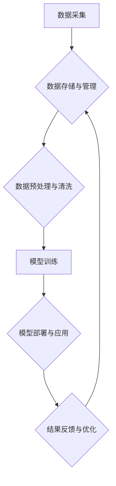

## 如何在AI经济中把握商业大势

> 关键词：人工智能、AI经济、商业模式、数据驱动、机器学习、深度学习、算法优化、可解释性AI

### 1. 背景介绍

我们正处在一个由人工智能（AI）驱动的经济转型期，也被称为“AI经济”。  AI技术的飞速发展，正在深刻地改变着各个行业和领域，为商业模式创新带来了前所未有的机遇。从自动驾驶到个性化推荐，从医疗诊断到金融风险评估，AI正在渗透到生活的方方面面，并不断拓展新的应用场景。

然而，AI经济的浪潮也带来了挑战。企业需要快速适应新的技术环境，探索新的商业模式，并应对数据安全、算法偏见等伦理问题。如何在AI经济中把握商业大势，成为企业家和决策者的关键课题。

### 2. 核心概念与联系

**2.1 AI经济的概念**

AI经济是指以人工智能技术为核心驱动的经济体系。在这个体系中，AI技术被广泛应用于生产、消费、流通等各个环节，推动着经济的智能化、自动化和数据化发展。

**2.2 AI经济的特征**

* **数据驱动:** AI经济的核心是数据。海量数据是AI算法训练和优化的基础，也是企业洞察市场趋势、了解用户需求的重要资源。
* **算法为王:**  AI算法的性能直接决定着AI应用的效率和效果。算法的优化和创新是推动AI经济发展的关键动力。
* **智能化转型:** AI技术正在改变着传统产业的生产模式和商业模式，推动着企业向智能化转型。
* **新兴产业兴起:** AI技术催生了新的产业和商业模式，例如AI芯片、AI服务、AI教育等。

**2.3 AI经济的架构**



**2.4 AI经济对商业的影响**

AI经济正在深刻地改变着商业模式，例如：

* **个性化定制:** AI可以根据用户的行为数据和偏好，提供个性化的产品和服务推荐。
* **自动化运营:** AI可以自动化完成许多重复性任务，提高运营效率。
* **精准营销:** AI可以分析用户的行为数据，精准地进行营销推广。
* **智能客服:** AI可以提供24小时在线客服，提高客户服务效率。

### 3. 核心算法原理 & 具体操作步骤

**3.1 算法原理概述**

机器学习（ML）是AI的核心技术之一，它通过算法学习数据中的模式，并根据这些模式进行预测或决策。常见的机器学习算法包括：

* **监督学习:**  利用标记数据训练模型，例如分类和回归问题。
* **无监督学习:**  利用未标记数据发现数据中的隐藏结构，例如聚类和降维。
* **强化学习:**  通过试错学习，让智能体在环境中获得最大奖励。

**3.2 算法步骤详解**

以监督学习为例，其基本步骤如下：

1. **数据收集和预处理:** 收集相关数据，并进行清洗、转换和特征工程等预处理工作。
2. **模型选择:** 根据具体问题选择合适的机器学习算法模型。
3. **模型训练:** 利用训练数据训练模型，调整模型参数，使其能够准确地预测或分类。
4. **模型评估:** 利用测试数据评估模型的性能，例如准确率、召回率、F1-score等。
5. **模型调优:** 根据评估结果，调整模型参数或选择其他算法模型，提高模型性能。
6. **模型部署:** 将训练好的模型部署到实际应用场景中，用于预测或决策。

**3.3 算法优缺点**

不同的机器学习算法具有不同的优缺点，需要根据具体问题选择合适的算法。例如，决策树算法易于理解和解释，但泛化能力较弱；支持向量机算法具有较好的泛化能力，但训练时间较长。

**3.4 算法应用领域**

机器学习算法广泛应用于各个领域，例如：

* **图像识别:**  识别物体、场景、人脸等。
* **自然语言处理:**  理解和生成自然语言，例如机器翻译、文本摘要、情感分析等。
* **推荐系统:**  根据用户的行为数据推荐产品或服务。
* **预测分析:**  预测未来趋势，例如销售预测、风险评估等。

### 4. 数学模型和公式 & 详细讲解 & 举例说明

**4.1 数学模型构建**

机器学习算法通常基于数学模型构建。例如，线性回归模型假设数据之间存在线性关系，可以用以下公式表示：

$$y = w_0 + w_1x_1 + w_2x_2 +... + w_nx_n + \epsilon$$

其中：

* $y$ 是预测值
* $w_0, w_1, w_2,..., w_n$ 是模型参数
* $x_1, x_2,..., x_n$ 是输入特征
* $\epsilon$ 是误差项

**4.2 公式推导过程**

模型参数的学习过程通常使用梯度下降算法。梯度下降算法通过不断调整模型参数，使模型预测值与真实值之间的误差最小化。

**4.3 案例分析与讲解**

例如，假设我们想要预测房价，输入特征包括房屋面积、房间数量、地理位置等。我们可以使用线性回归模型，并通过梯度下降算法训练模型。训练完成后，我们可以使用模型预测新房子的价格。

### 5. 项目实践：代码实例和详细解释说明

**5.1 开发环境搭建**

* Python 3.x
* TensorFlow 或 PyTorch 等深度学习框架
* Jupyter Notebook 或 VS Code 等代码编辑器

**5.2 源代码详细实现**

```python
import tensorflow as tf

# 定义模型
model = tf.keras.models.Sequential([
  tf.keras.layers.Dense(64, activation='relu', input_shape=(4,)),
  tf.keras.layers.Dense(1)
])

# 编译模型
model.compile(optimizer='adam', loss='mse')

# 训练模型
model.fit(X_train, y_train, epochs=10)

# 评估模型
loss = model.evaluate(X_test, y_test)
print('Loss:', loss)

# 预测新数据
predictions = model.predict(new_data)
```

**5.3 代码解读与分析**

* 代码首先定义了一个简单的线性回归模型，包含两个全连接层。
* 然后，模型使用Adam优化器和均方误差损失函数进行编译。
* 接着，模型使用训练数据进行训练，训练10个epochs。
* 最后，模型使用测试数据进行评估，并预测新数据的房价。

**5.4 运行结果展示**

运行结果会显示模型的训练损失和测试损失，以及对新数据的预测结果。

### 6. 实际应用场景

**6.1 个性化推荐系统**

AI可以根据用户的行为数据和偏好，推荐个性化的产品或服务。例如，电商平台可以利用AI推荐用户可能感兴趣的商品，提高用户购买率。

**6.2 自动化客服系统**

AI可以提供24小时在线客服，回答用户常见问题，提高客户服务效率。例如，银行可以利用AI客服系统处理简单的账户查询和转账请求。

**6.3 医疗诊断辅助系统**

AI可以辅助医生进行医疗诊断，提高诊断准确率。例如，AI可以分析患者的影像数据，辅助医生诊断肿瘤。

**6.4 金融风险评估系统**

AI可以分析用户的财务数据，评估用户的信用风险。例如，银行可以利用AI系统评估贷款申请者的信用风险，降低贷款风险。

**6.5 未来应用展望**

AI技术的未来应用前景广阔，例如：

* **自动驾驶:** AI将推动自动驾驶技术的普及，改变交通出行方式。
* **智能制造:** AI将提高制造业的自动化程度和效率，推动智能制造的发展。
* **个性化教育:** AI将提供个性化的教育方案，提高教育效率。
* **科学研究:** AI将加速科学研究的进程，推动科技创新。

### 7. 工具和资源推荐

**7.1 学习资源推荐**

* **在线课程:** Coursera、edX、Udacity 等平台提供丰富的AI课程。
* **书籍:** 《深度学习》、《机器学习实战》等书籍是学习AI的基础教材。
* **开源项目:** TensorFlow、PyTorch 等开源项目可以帮助你实践AI算法。

**7.2 开发工具推荐**

* **Python:**  AI开发的主要编程语言。
* **Jupyter Notebook:**  交互式代码编辑器，方便AI算法开发和调试。
* **TensorFlow/PyTorch:**  深度学习框架，用于训练和部署AI模型。

**7.3 相关论文推荐**

* **《ImageNet Classification with Deep Convolutional Neural Networks》**
* **《Attention Is All You Need》**
* **《BERT: Pre-training of Deep Bidirectional Transformers for Language Understanding》**

### 8. 总结：未来发展趋势与挑战

**8.1 研究成果总结**

近年来，AI技术取得了长足的进步，在各个领域都取得了突破性进展。例如，图像识别、自然语言处理、语音识别等领域都取得了显著的成果。

**8.2 未来发展趋势**

* **模型规模化:**  未来AI模型将更加庞大，拥有更多的参数和训练数据。
* **算法效率提升:**  研究人员将继续探索更有效的AI算法，提高算法训练和推理效率。
* **可解释性AI:**  研究人员将更加关注AI模型的可解释性，使AI决策更加透明和可理解。
* **边缘计算:**  AI计算将更加靠近数据源，实现更实时和高效的AI应用。

**8.3 面临的挑战**

* **数据安全和隐私保护:**  AI算法依赖于大量数据，如何保障数据安全和隐私是重要的挑战。
* **算法偏见:**  AI算法可能存在偏见，导致不公平的结果。如何解决算法偏见是重要的伦理问题。
* **人才短缺:**  AI领域人才需求量大，如何培养更多AI人才是重要的挑战。

**8.4 研究展望**

未来，AI研究将继续朝着更智能、更安全、更可解释的方向发展。AI技术将深刻地改变我们的生活和工作方式，为人类社会带来更多福祉。

### 9. 附录：常见问题与解答

**9.1 什么是AI经济？**

AI经济是指以人工智能技术为核心驱动的经济体系。

**9.2 AI经济对商业有什么影响？**

AI经济正在深刻地改变着商业模式，例如个性化定制、自动化运营、精准营销等。

**9.3 如何把握AI经济的商业大势？**

企业需要快速适应新的技术环境，探索新的商业模式，并应对数据安全、算法偏见等伦理问题。

**9.4 学习AI需要哪些资源？**

可以参考在线课程、书籍、开源项目等资源。

**9.5 未来AI技术的发展趋势是什么？**

未来AI技术将更加智能、安全、可解释，并朝着模型规模化、算法效率提升、边缘计算等方向发展。


作者：禅与计算机程序设计艺术 / Zen and the Art of Computer Programming 
