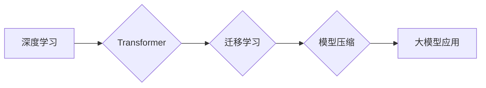

## 如何让更多人用上大模型

> 关键词：大模型、可解释性、模型压缩、边缘计算、民主化AI、开源、应用场景

### 1. 背景介绍

近年来，大模型（Large Language Models，LLMs）在自然语言处理、计算机视觉、代码生成等领域取得了令人瞩目的成就。这些模型拥有庞大的参数量和海量数据训练，能够完成复杂的任务，展现出强大的智能能力。然而，大模型的应用仍然面临着一些挑战，例如：

* **高计算资源需求:** 训练和部署大模型需要大量的计算资源，这对于个人开发者和小型企业来说是一个巨大的门槛。
* **模型可解释性不足:** 大模型的决策过程往往是复杂的，难以理解其背后的逻辑，这限制了人们对模型的信任和应用。
* **数据隐私和安全问题:** 大模型的训练需要大量数据，如何保证数据的隐私和安全是一个重要的考量。

为了让更多人能够利用大模型的强大能力，我们需要解决这些挑战，降低大模型的门槛，提高其可解释性和安全性。

### 2. 核心概念与联系

大模型的应用涉及到多个核心概念，包括：

* **深度学习:** 大模型基于深度神经网络架构，通过多层神经元进行特征提取和学习。
* **Transformer:** Transformer是一种新型的神经网络架构，能够有效处理序列数据，是构建大语言模型的基础。
* **迁移学习:** 迁移学习是指利用预训练模型在新的任务上进行微调，可以有效降低训练成本和数据需求。
* **模型压缩:** 模型压缩是指通过各种技术手段减少模型的大小，降低其计算资源需求。

这些概念相互关联，共同构成了大模型应用的生态系统。

**Mermaid 流程图:**



### 3. 核心算法原理 & 具体操作步骤

#### 3.1  算法原理概述

大模型的训练主要基于深度学习算法，特别是Transformer架构。Transformer通过自注意力机制（Self-Attention）和多头注意力机制（Multi-Head Attention）能够捕捉序列数据中的长距离依赖关系，从而实现更准确的语言理解和生成。

#### 3.2  算法步骤详解

1. **数据预处理:** 将文本数据进行清洗、分词、标记等预处理操作，使其能够被模型理解。
2. **模型构建:** 根据Transformer架构构建模型，包括编码器（Encoder）、解码器（Decoder）和注意力机制等模块。
3. **模型训练:** 使用预训练数据集训练模型，通过反向传播算法优化模型参数，使其能够生成更准确的输出。
4. **模型评估:** 使用测试数据集评估模型的性能，例如准确率、困惑度等指标。
5. **模型部署:** 将训练好的模型部署到服务器或云平台，使其能够为用户提供服务。

#### 3.3  算法优缺点

**优点:**

* 能够处理复杂的任务，例如文本生成、翻译、问答等。
* 具有强大的泛化能力，能够应用于不同的领域。

**缺点:**

* 训练成本高，需要大量的计算资源和数据。
* 模型可解释性不足，难以理解其背后的决策过程。

#### 3.4  算法应用领域

大模型的应用领域非常广泛，包括：

* **自然语言处理:** 文本生成、机器翻译、问答系统、情感分析等。
* **计算机视觉:** 图像识别、物体检测、图像生成等。
* **代码生成:** 自动生成代码、代码修复等。
* **科学研究:** 药物研发、材料科学等。

### 4. 数学模型和公式 & 详细讲解 & 举例说明

#### 4.1  数学模型构建

大模型的数学模型主要基于深度神经网络，其核心是多层感知机（Multi-Layer Perceptron，MLP）和注意力机制。

* **多层感知机:** MLP由多个全连接层组成，每一层都包含多个神经元。每个神经元接收上一层的输出作为输入，并通过激活函数进行处理，输出到下一层。

* **注意力机制:** 注意力机制能够学习到输入序列中重要信息的位置，并赋予其更高的权重。

#### 4.2  公式推导过程

注意力机制的计算公式如下：

$$
Attention(Q, K, V) = softmax(\frac{QK^T}{\sqrt{d_k}})V
$$

其中：

* $Q$：查询矩阵
* $K$：键矩阵
* $V$：值矩阵
* $d_k$：键向量的维度
* $softmax$：softmax函数

#### 4.3  案例分析与讲解

例如，在机器翻译任务中，查询矩阵 $Q$ 来自源语言的词嵌入，键矩阵 $K$ 来自目标语言的词嵌入，值矩阵 $V$ 也来自目标语言的词嵌入。注意力机制能够学习到源语言中哪些词与目标语言中的哪些词相关，从而生成更准确的翻译结果。

### 5. 项目实践：代码实例和详细解释说明

#### 5.1  开发环境搭建

* **操作系统:** Linux 或 macOS
* **编程语言:** Python
* **深度学习框架:** TensorFlow 或 PyTorch
* **硬件:** GPU 

#### 5.2  源代码详细实现

```python
import tensorflow as tf

# 定义 Transformer 模型
class Transformer(tf.keras.Model):
    def __init__(self, vocab_size, embedding_dim, num_heads, num_layers):
        super(Transformer, self).__init__()
        self.embedding = tf.keras.layers.Embedding(vocab_size, embedding_dim)
        self.transformer_layers = tf.keras.layers.StackedRNNCells([
            tf.keras.layers.Attention(num_heads=num_heads)
            for _ in range(num_layers)
        ])

    def call(self, inputs):
        # Embedding 层
        embedded = self.embedding(inputs)
        # Transformer 层
        output = self.transformer_layers(embedded)
        return output

# 实例化模型
model = Transformer(vocab_size=10000, embedding_dim=128, num_heads=8, num_layers=6)

# 训练模型
model.compile(optimizer='adam', loss='mse')
model.fit(x_train, y_train, epochs=10)
```

#### 5.3  代码解读与分析

* **Embedding 层:** 将输入的词索引转换为词向量。
* **Transformer 层:** 由多个注意力层和前馈神经网络层组成，用于学习序列数据中的长距离依赖关系。
* **训练模型:** 使用训练数据训练模型，并使用均方误差（MSE）作为损失函数。

#### 5.4  运行结果展示

训练完成后，可以使用测试数据评估模型的性能，例如计算准确率、困惑度等指标。

### 6. 实际应用场景

大模型在各个领域都有着广泛的应用场景：

* **聊天机器人:** 大模型可以用于构建更智能、更自然的聊天机器人，能够理解用户的意图并提供更准确的回复。
* **文本生成:** 大模型可以用于生成各种类型的文本，例如文章、故事、诗歌等。
* **机器翻译:** 大模型可以实现更准确、更流畅的机器翻译。
* **代码生成:** 大模型可以自动生成代码，提高开发效率。

### 6.4  未来应用展望

随着大模型技术的不断发展，其应用场景将会更加广泛，例如：

* **个性化教育:** 根据学生的学习情况，提供个性化的学习内容和辅导。
* **医疗诊断:** 辅助医生进行疾病诊断，提高诊断准确率。
* **科学发现:** 加速科学研究，帮助科学家发现新的知识。

### 7. 工具和资源推荐

#### 7.1  学习资源推荐

* **书籍:**
    * 《深度学习》
    * 《自然语言处理》
* **在线课程:**
    * Coursera
    * edX
* **博客和论坛:**
    * TensorFlow Blog
    * PyTorch Forum

#### 7.2  开发工具推荐

* **深度学习框架:** TensorFlow, PyTorch
* **编程语言:** Python
* **云平台:** Google Cloud Platform, Amazon Web Services, Microsoft Azure

#### 7.3  相关论文推荐

* **Attention Is All You Need:** https://arxiv.org/abs/1706.03762
* **BERT: Pre-training of Deep Bidirectional Transformers for Language Understanding:** https://arxiv.org/abs/1810.04805

### 8. 总结：未来发展趋势与挑战

#### 8.1  研究成果总结

近年来，大模型取得了显著的进展，在多个领域展现出强大的能力。

#### 8.2  未来发展趋势

* **模型规模的进一步扩大:** 随着计算资源的不断提升，大模型的规模将会进一步扩大，从而提升其性能。
* **模型可解释性的增强:** 研究人员将致力于开发更可解释的大模型，使其决策过程更加透明。
* **模型安全性的提升:** 针对大模型的潜在风险，例如数据隐私泄露和恶意攻击，研究人员将开发更安全的模型。

#### 8.3  面临的挑战

* **计算资源需求:** 训练和部署大模型需要大量的计算资源，这对于个人开发者和小型企业来说是一个挑战。
* **数据隐私和安全问题:** 大模型的训练需要大量数据，如何保证数据的隐私和安全是一个重要的考量。
* **模型可解释性:** 大模型的决策过程往往是复杂的，难以理解其背后的逻辑，这限制了人们对模型的信任和应用。

#### 8.4  研究展望

未来，大模型研究将继续朝着更强大、更安全、更可解释的方向发展，并将在更多领域发挥重要作用。

### 9. 附录：常见问题与解答

* **Q: 如何降低大模型的训练成本？**

A: 可以使用迁移学习技术，利用预训练模型在新的任务上进行微调，从而降低训练成本和数据需求。

* **Q: 如何提高大模型的可解释性？**

A: 可以使用可解释性分析工具，例如LIME和SHAP，来解释大模型的决策过程。

* **Q: 如何保证大模型的安全性？**

A: 可以使用对抗训练和模型剪枝等技术，来提高大模型的安全性。


作者：禅与计算机程序设计艺术 / Zen and the Art of Computer Programming 
