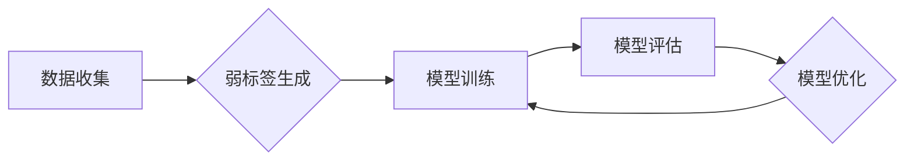

## 弱监督学习 原理与代码实例讲解

> 关键词：弱监督学习、半监督学习、数据标注、迁移学习、深度学习、图像分类、自然语言处理

## 1. 背景介绍

在机器学习领域，训练高性能模型通常需要大量高质量的标注数据。然而，获取大量标注数据往往成本高昂、耗时费力。弱监督学习 (Weakly Supervised Learning) 应运而生，它旨在利用少量标注数据或其他形式的辅助信息，例如图像的边界框、文本的关键词等，来训练更强大的模型。

弱监督学习相对于监督学习 (Supervised Learning) 和无监督学习 (Unsupervised Learning) 而言，处于一个中间状态。它既不需要像监督学习那样大量的标注数据，也不需要像无监督学习那样明确的学习目标。

近年来，随着深度学习的兴起，弱监督学习取得了显著进展。它在图像识别、自然语言处理、语音识别等领域展现出巨大的潜力，并逐渐成为机器学习研究的热点方向之一。

## 2. 核心概念与联系

弱监督学习的核心概念是利用**弱标签**来训练模型。弱标签比强标签 (Strong Label) 更加松散，例如：

* **图像分类:**  强标签是图像的类别名称，而弱标签可能是图像中物体的大致位置或类别描述。
* **文本分类:** 强标签是文本的类别，而弱标签可能是文本中关键词或主题。

弱监督学习的流程可以概括为以下步骤：



**弱标签生成** 是弱监督学习的关键步骤，它需要根据任务需求设计合适的策略，例如：

* **图像边界框:** 利用图像的边界框信息，可以进行粗略的物体分类。
* **文本关键词:** 利用文本的关键词信息，可以进行主题分类。
* **图像 Caption:** 利用图像的 Caption 信息，可以进行图像描述和分类。

## 3. 核心算法原理 & 具体操作步骤

### 3.1  算法原理概述

弱监督学习算法主要分为以下几类：

* **基于概率的算法:**  例如，**概率图模型 (Probabilistic Graphical Models)** 和 **贝叶斯网络 (Bayesian Networks)**，它们可以利用弱标签信息来学习数据之间的概率关系。
* **基于损失函数的算法:**  例如，**自监督学习 (Self-Supervised Learning)** 和 **迁移学习 (Transfer Learning)**，它们可以利用弱标签信息来设计更有效的损失函数，从而提高模型的训练效果。
* **基于强化学习的算法:**  例如，**强化学习 (Reinforcement Learning)**，它可以利用弱标签信息来设计奖励机制，从而引导模型学习更有效的策略。

### 3.2  算法步骤详解

以基于损失函数的弱监督学习算法为例，其具体操作步骤如下：

1. **数据预处理:**  对输入数据进行清洗、转换和特征提取等操作。
2. **弱标签生成:**  根据任务需求，生成相应的弱标签信息。
3. **模型构建:**  选择合适的模型架构，例如卷积神经网络 (CNN) 或循环神经网络 (RNN)。
4. **损失函数设计:**  设计一个能够利用弱标签信息进行训练的损失函数。
5. **模型训练:**  利用训练数据和弱标签信息，训练模型参数。
6. **模型评估:**  利用测试数据评估模型的性能。
7. **模型优化:**  根据评估结果，调整模型参数或训练策略，以提高模型性能。

### 3.3  算法优缺点

**优点:**

* **数据效率:**  可以利用少量标注数据进行训练，降低数据标注成本。
* **泛化能力:**  可以学习到更通用的特征，提高模型在未知数据上的泛化能力。

**缺点:**

* **性能受限:**  由于弱标签信息不够精确，模型性能可能低于监督学习。
* **算法设计复杂:**  需要设计合适的弱标签生成策略和损失函数。

### 3.4  算法应用领域

弱监督学习在以下领域具有广泛的应用前景:

* **图像识别:**  例如，物体检测、场景理解、图像分割。
* **自然语言处理:**  例如，文本分类、情感分析、机器翻译。
* **语音识别:**  例如，语音转文本、语音搜索。
* **医疗诊断:**  例如，病灶检测、疾病预测。

## 4. 数学模型和公式 & 详细讲解 & 举例说明

### 4.1  数学模型构建

弱监督学习的数学模型通常基于概率论和统计学，例如：

* **贝叶斯网络:**  用于学习数据之间的概率关系，可以利用弱标签信息来更新节点的概率分布。
* **条件随机场 (CRF):**  用于学习序列标注模型，可以利用弱标签信息来约束序列的标记。

### 4.2  公式推导过程

以贝叶斯网络为例，其核心公式为：

$$P(X|Y) = \frac{P(Y|X)P(X)}{P(Y)}$$

其中：

* $X$ 表示观测数据
* $Y$ 表示隐藏变量 (例如，类别标签)
* $P(X|Y)$ 表示给定隐藏变量 $Y$ 的条件概率分布
* $P(Y|X)$ 表示给定观测数据 $X$ 的条件概率分布
* $P(X)$ 表示观测数据 $X$ 的边缘概率分布
* $P(Y)$ 表示隐藏变量 $Y$ 的边缘概率分布

在弱监督学习中，由于强标签信息有限，我们可以利用弱标签信息来估计 $P(Y|X)$ 的值。

### 4.3  案例分析与讲解

假设我们有一个图像分类任务，目标是识别图像中的动物类别。

* **强标签:**  每个图像都有一个准确的动物类别标签。
* **弱标签:**  每个图像都有一个粗略的动物类别描述，例如“哺乳动物”或“鸟类”。

我们可以利用贝叶斯网络来学习动物类别之间的概率关系，并利用弱标签信息来更新节点的概率分布。

## 5. 项目实践：代码实例和详细解释说明

### 5.1  开发环境搭建

* Python 3.6+
* TensorFlow 2.0+
* PyTorch 1.0+
* 其他必要的库，例如 NumPy、Pandas、Matplotlib 等。

### 5.2  源代码详细实现

以下是一个使用 TensorFlow 实现弱监督图像分类的简单代码示例：

```python
import tensorflow as tf

# 定义模型架构
model = tf.keras.models.Sequential([
    tf.keras.layers.Conv2D(32, (3, 3), activation='relu', input_shape=(224, 224, 3)),
    tf.keras.layers.MaxPooling2D((2, 2)),
    tf.keras.layers.Conv2D(64, (3, 3), activation='relu'),
    tf.keras.layers.MaxPooling2D((2, 2)),
    tf.keras.layers.Flatten(),
    tf.keras.layers.Dense(10, activation='softmax')
])

# 定义损失函数
loss_fn = tf.keras.losses.CategoricalCrossentropy(from_logits=True)

# 定义优化器
optimizer = tf.keras.optimizers.Adam()

# 训练模型
model.compile(optimizer=optimizer, loss=loss_fn, metrics=['accuracy'])
model.fit(x_train, y_train, epochs=10)

# 评估模型
loss, accuracy = model.evaluate(x_test, y_test)
print('Loss:', loss)
print('Accuracy:', accuracy)
```

### 5.3  代码解读与分析

* **模型架构:**  代码中定义了一个简单的卷积神经网络 (CNN) 模型，用于图像分类。
* **损失函数:**  使用交叉熵损失函数 (Categorical Crossentropy) 来衡量模型预测结果与真实标签之间的差异。
* **优化器:**  使用 Adam 优化器来更新模型参数。
* **训练过程:**  使用 `model.fit()` 函数训练模型，输入训练数据和标签，并设置训练轮数 (epochs)。
* **评估过程:**  使用 `model.evaluate()` 函数评估模型在测试数据上的性能，输出损失值和准确率。

### 5.4  运行结果展示

训练完成后，可以将模型应用于新的图像数据进行分类。

## 6. 实际应用场景

### 6.1  图像识别

* **物体检测:**  利用弱标签信息，例如图像边界框，可以训练物体检测模型，识别图像中的物体位置和类别。
* **场景理解:**  利用弱标签信息，例如图像的 Caption，可以训练场景理解模型，识别图像中的场景类别。

### 6.2  自然语言处理

* **文本分类:**  利用弱标签信息，例如文本关键词，可以训练文本分类模型，将文本分类到不同的类别。
* **情感分析:**  利用弱标签信息，例如文本的主题，可以训练情感分析模型，识别文本的情感倾向。

### 6.3  其他领域

* **语音识别:**  利用弱标签信息，例如语音的转录文本，可以训练语音识别模型，将语音转换为文本。
* **医疗诊断:**  利用弱标签信息，例如病历摘要，可以训练医疗诊断模型，辅助医生进行疾病诊断。

### 6.4  未来应用展望

随着深度学习技术的不断发展，弱监督学习在未来将有更广泛的应用前景。例如：

* **自动数据标注:**  利用弱监督学习算法，可以自动生成高质量的标注数据，降低人工标注成本。
* **跨模态学习:**  利用弱监督学习算法，可以学习不同模态数据之间的关系，例如图像和文本，实现跨模态理解。
* **个性化推荐:**  利用弱监督学习算法，可以根据用户的行为数据，学习用户的偏好，实现个性化推荐。

## 7. 工具和资源推荐

### 7.1  学习资源推荐

* **书籍:**
    * "Deep Learning" by Ian Goodfellow, Yoshua Bengio, and Aaron Courville
    * "Pattern Recognition and Machine Learning" by Christopher M. Bishop
* **课程:**
    * Stanford CS231n: Convolutional Neural Networks for Visual Recognition
    * Coursera: Deep Learning Specialization
* **博客:**
    * Towards Data Science
    * Machine Learning Mastery

### 7.2  开发工具推荐

* **TensorFlow:**  开源深度学习框架，提供丰富的模型构建和训练工具。
* **PyTorch:**  开源深度学习框架，以其灵活性和易用性而闻名。
* **Keras:**  高层深度学习 API，可以方便地构建和训练深度学习模型。

### 7.3  相关论文推荐

* "Semi-Supervised Learning" by Christopher M. Bishop
* "Weakly Supervised Learning" by  Richard S. Sutton
* "Transfer Learning" by  Yoshua Bengio

## 8. 总结：未来发展趋势与挑战

### 8.1  研究成果总结

弱监督学习近年来取得了显著进展，在图像识别、自然语言处理等领域展现出巨大的潜力。

### 8.2  未来发展趋势

* **更有效的弱标签生成策略:**  探索更有效的弱标签生成策略，以提高模型的训练效果。
* **更强大的模型架构:**  设计更强大的模型架构，能够更好地利用弱标签信息进行学习。
* **跨模态弱监督学习:**  探索跨模态弱监督学习，例如图像和文本的联合学习。

### 8.3  面临的挑战

* **弱标签的噪声:**  弱标签信息往往存在噪声，需要开发更鲁棒的算法来应对噪声的影响。
* **数据分布的差异:**  弱监督学习模型在训练数据和测试数据之间可能存在分布差异，需要开发更有效的迁移学习方法。
* **算法的可解释性:**  弱监督学习算法的决策过程往往难以解释，需要开发更可解释的算法。

### 8.