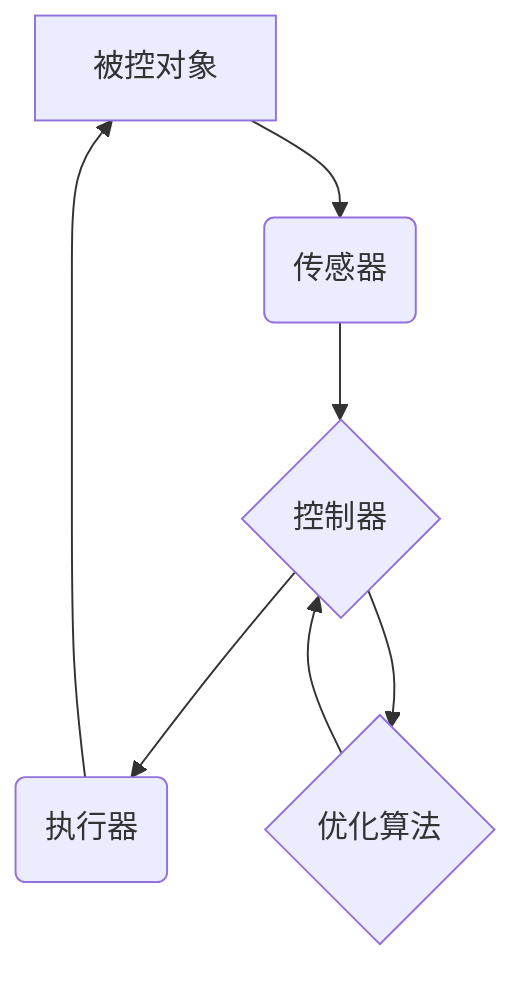

## 控制论与最优化的现代研究

> 关键词：控制论、优化算法、动态系统、机器学习、深度学习、人工智能、系统控制、最优控制

## 1. 背景介绍

控制论和优化理论是现代科学和工程领域的基础，它们在人工智能、机器人技术、自动控制、经济学、生物学等众多领域有着广泛的应用。控制论研究的是如何设计系统，使其能够根据预定的目标和反馈信息进行调节和控制。优化理论则致力于寻找最优解，即在给定的约束条件下，使目标函数达到最大或最小值。

近年来，随着人工智能和深度学习的快速发展，控制论和优化理论的研究也取得了长足的进步。深度学习算法能够学习复杂的非线性关系，为控制系统的设计提供了新的思路。同时，优化算法也在不断改进，能够解决更复杂、更规模庞大的优化问题。

## 2. 核心概念与联系

### 2.1 控制论

控制论的核心概念是闭环反馈系统。闭环反馈系统通过传感器获取系统状态信息，并将信息反馈到控制器，控制器根据反馈信息调整系统输入，从而实现对系统的控制。

控制论的基本组成部分包括：

* **被控对象:** 需要被控制的系统。
* **传感器:** 测量被控对象的输出信号。
* **控制器:** 根据传感器反馈信息，计算出控制信号。
* **执行器:** 将控制信号转化为实际的控制动作。

### 2.2 优化理论

优化理论的核心概念是目标函数和约束条件。目标函数描述了系统想要达到的目标，约束条件限制了系统的可行解空间。优化算法的目标是找到目标函数在约束条件下的最优解。

常见的优化算法包括：

* **梯度下降法:** 通过迭代更新参数，逐步逼近最优解。
* **牛顿法:** 利用二阶导数信息，更快地收敛到最优解。
* **遗传算法:** 借鉴生物进化机制，通过选择、交叉和变异操作，搜索最优解。

### 2.3 控制论与优化理论的联系

控制论和优化理论密切相关。在许多控制系统中，优化算法被用于设计控制器，以实现系统性能的优化。例如，在机器人控制中，可以使用优化算法来规划机器人运动轨迹，以最小化运动时间或能量消耗。

**Mermaid 流程图**



## 3. 核心算法原理 & 具体操作步骤

### 3.1 算法原理概述

本文将重点介绍一种常用的最优控制算法——动态规划算法。动态规划算法是一种解决复杂优化问题的有效方法，它将问题分解成一系列子问题，并通过递归的方式求解子问题，最终得到全局最优解。

### 3.2 算法步骤详解

1. **状态空间划分:** 将系统状态空间划分为多个离散状态。
2. **状态转移方程:** 建立描述系统状态转移的方程。
3. **目标函数定义:** 定义系统目标函数，该函数描述了系统想要达到的目标。
4. **Bellman方程:** 利用动态规划原理，建立Bellman方程，该方程描述了在每个状态下，选择最佳控制策略所能获得的最大累积回报。
5. **递归求解:** 从最终状态开始，递归地求解Bellman方程，逐步回溯到初始状态，得到最优控制策略。

### 3.3 算法优缺点

**优点:**

* 能够解决复杂的多阶段决策问题。
* 能够找到全局最优解。

**缺点:**

* 计算复杂度较高，对于大规模系统可能难以实现。
* 需要事先知道系统的状态转移方程和目标函数。

### 3.4 算法应用领域

动态规划算法广泛应用于以下领域:

* **机器人控制:** 规划机器人运动轨迹、控制机器人运动姿态。
* **经济学:** 优化资源分配、制定投资策略。
* **生物学:** 模拟生物系统行为、预测疾病传播。

## 4. 数学模型和公式 & 详细讲解 & 举例说明

### 4.1 数学模型构建

假设一个离散时间系统，其状态空间为 $S = \{s_1, s_2,..., s_N\}$, 控制输入为 $U = \{u_1, u_2,..., u_M\}$, 目标函数为 $J(u_0, u_1,..., u_{T-1})$, 其中 $u_i$ 为时刻 $i$ 的控制输入， $T$ 为系统运行时间。

### 4.2 公式推导过程

Bellman方程描述了在每个状态下，选择最佳控制策略所能获得的最大累积回报:

$$
V(s_t) = \max_{u_t \in U} \{R(s_t, u_t) + \gamma V(s_{t+1})\}
$$

其中:

* $V(s_t)$ 为时刻 $t$ 状态 $s_t$ 下的最大累积回报。
* $R(s_t, u_t)$ 为时刻 $t$ 状态 $s_t$ 下，控制输入 $u_t$ 所带来的即时回报。
* $\gamma$ 为折扣因子，控制未来回报的权重。

### 4.3 案例分析与讲解

**举例说明:**

考虑一个简单的机器人导航问题，机器人需要从起点移动到终点。

* 状态空间: $S = \{起点, 位置1, 位置2,..., 终点\}$
* 控制输入: $U = \{向左移动, 向右移动\}$
* 目标函数: 最小化机器人移动的总步数。

利用动态规划算法，可以构建Bellman方程，并通过递归的方式求解，得到机器人最优的导航策略。

## 5. 项目实践：代码实例和详细解释说明

### 5.1 开发环境搭建

本项目使用 Python 语言进行开发，所需的库包括 NumPy、Matplotlib 等。

### 5.2 源代码详细实现

```python
import numpy as np

# 定义状态转移方程
def transition_function(state, action):
    #...

# 定义目标函数
def reward_function(state):
    #...

# 定义动态规划算法
def dynamic_programming(initial_state, discount_factor):
    #...

# 实例化系统
initial_state = '起点'
discount_factor = 0.9

# 调用动态规划算法
optimal_policy = dynamic_programming(initial_state, discount_factor)

# 打印最优策略
print(optimal_policy)
```

### 5.3 代码解读与分析

* `transition_function`: 描述系统状态转移的函数。
* `reward_function`: 描述系统目标函数的函数。
* `dynamic_programming`: 实现动态规划算法的核心函数。
* `initial_state`: 系统初始状态。
* `discount_factor`: 折扣因子。

### 5.4 运行结果展示

运行代码后，将输出机器人最优的导航策略。

## 6. 实际应用场景

### 6.1 自动驾驶

动态规划算法可以用于自动驾驶系统的路径规划和决策控制。

### 6.2 机器人控制

动态规划算法可以用于机器人运动规划、抓取控制等任务。

### 6.3 金融投资

动态规划算法可以用于优化投资组合、制定投资策略。

### 6.4 未来应用展望

随着人工智能和深度学习的发展，动态规划算法将在更多领域得到应用，例如医疗诊断、能源管理、交通运输等。

## 7. 工具和资源推荐

### 7.1 学习资源推荐

* **书籍:**
    * 《Reinforcement Learning: An Introduction》 by Richard S. Sutton and Andrew G. Barto
    * 《Dynamic Programming and Optimal Control》 by Bertsekas and Tsitsiklis
* **在线课程:**
    * Coursera: Reinforcement Learning Specialization
    * edX: Introduction to Artificial Intelligence

### 7.2 开发工具推荐

* **Python:** 广泛用于机器学习和人工智能开发。
* **NumPy:** 用于数值计算和数组操作。
* **Matplotlib:** 用于数据可视化。

### 7.3 相关论文推荐

* **Bellman, R. (1957). Dynamic Programming.**
* **Sutton, R. S., & Barto, A. G. (2018). Reinforcement Learning: An Introduction (2nd ed.).**

## 8. 总结：未来发展趋势与挑战

### 8.1 研究成果总结

控制论和优化理论取得了长足的进步，为人工智能、机器人技术等领域的发展提供了重要的理论基础和技术支撑。

### 8.2 未来发展趋势

* **深度强化学习:** 将深度学习与强化学习相结合，提高控制系统的学习能力和适应性。
* **分布式控制:** 研究分布式控制系统的设计和优化方法，解决大规模复杂系统的控制问题。
* **鲁棒控制:** 研究能够应对系统不确定性和干扰的鲁棒控制方法。

### 8.3 面临的挑战

* **计算复杂度:** 对于大规模系统，控制算法的计算复杂度仍然是一个挑战。
* **数据需求:** 深度强化学习算法需要大量的训练数据，数据获取和处理是一个难题。
* **安全性和可靠性:** 控制系统需要保证安全性和可靠性，这是控制算法研究的重要方向。

### 8.4 研究展望

未来，控制论和优化理论的研究将继续深入，为人工智能、机器人技术等领域的发展提供更强大的理论工具和技术手段。


## 9. 附录：常见问题与解答

**问题:** 动态规划算法的计算复杂度较高，如何提高算法效率？

**解答:**

* 使用近似算法，例如蒙特卡罗树搜索算法。
* 利用并行计算技术，加速算法执行速度。
* 使用压缩技术，减少状态空间的大小。

**问题:** 动态规划算法需要事先知道系统的状态转移方程和目标函数，如何解决未知系统的情况？

**解答:**

* 使用强化学习算法，通过与环境交互学习系统模型和策略。
* 使用数据驱动方法，从数据中学习系统模型和策略。


作者：禅与计算机程序设计艺术 / Zen and the Art of Computer Programming 
