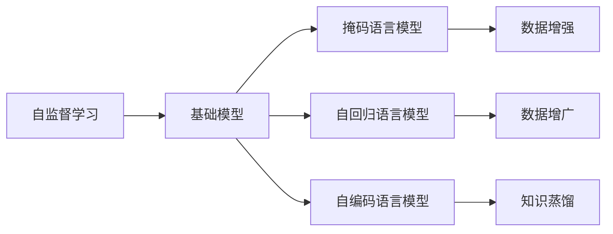

                 

# 自监督学习在基础模型中的应用

> 关键词：自监督学习, 基础模型, 语言模型, 预训练, 自回归, 自编码, 数据增强, 数据增广, 知识蒸馏

## 1. 背景介绍

### 1.1 问题由来
随着深度学习技术的飞速发展，深度神经网络已经在众多领域取得了显著的突破。在自然语言处理(NLP)领域，基于大规模无标签数据进行的预训练语言模型，成为推动NLP技术发展的重要驱动力。然而，大规模无标签数据的获取和处理成本极高，而且现有的预训练语言模型往往无法很好地应对特定的下游任务。

自监督学习（Self-supervised Learning）提供了一种在无标签数据上进行预训练的解决方案，通过设计巧妙的预训练任务，利用数据自身的结构性特征，学习到通用的语言表示。这一技术不仅能够大幅提升模型的泛化能力，而且能够显著降低预训练的标注成本，使得大模型能够更加广泛地应用于实际任务中。

### 1.2 问题核心关键点
自监督学习在基础模型的预训练阶段发挥了关键作用，其主要特点包括：

1. 利用数据自身的结构性信息进行训练。无标签数据蕴含丰富的语言结构和上下文信息，通过自监督任务能够有效挖掘这些信息。
2. 设计多任务学习目标。常见的自监督任务包括掩码语言模型、下一句预测、句子相似度计算等，能够同时学习多种语言能力。
3. 提升模型的泛化能力。自监督学习能够使模型学习到通用的语言表示，从而在多种下游任务上取得优秀的性能。
4. 减少标注数据的需求。相比传统的监督学习，自监督学习能够利用无标签数据进行预训练，降低了标注成本。

本文将详细探讨自监督学习在基础模型中的应用，包括掩码语言模型、自回归语言模型、自编码语言模型等常见自监督学习任务，以及它们在预训练和下游任务微调中的应用。

## 2. 核心概念与联系

### 2.1 核心概念概述

为更好地理解自监督学习在基础模型中的应用，我们首先介绍几个核心概念：

- 自监督学习（Self-supervised Learning）：一种无需标注数据，仅利用数据自身的结构性信息进行训练的学习方法。常见的自监督任务包括掩码语言模型、下一句预测、句子相似度计算等。
- 基础模型（Foundation Model）：一种在大规模无标签数据上进行预训练，学习通用的语言表示，并在此基础上进行微调的通用语言模型。常见的基础模型包括BERT、GPT、XLNet等。
- 掩码语言模型（Masked Language Model, MLM）：一种常见的自监督任务，在输入文本中随机遮盖一些词语，训练模型根据上下文预测被遮盖的词语。
- 自回归语言模型（Autoregressive Language Model, AR LM）：一种基于自回归的预训练任务，从输入文本的后文预测前文，从而学习到文本的序列结构。
- 自编码语言模型（Autoencoder Language Model, AE LM）：一种自监督任务，通过编码器将输入文本映射到低维向量表示，然后通过解码器将其还原为文本，从而学习到文本的压缩表示。
- 数据增强（Data Augmentation）：一种通过变换输入数据，增加数据多样性的方法，如回译、改写、同义词替换等。
- 数据增广（Data Augmentation）：一种通过变换输入数据，增加数据多样性的方法，如回译、改写、同义词替换等。
- 知识蒸馏（Knowledge Distillation）：一种通过将大型模型知识转移到小型模型上的方法，提升小型模型的性能。

这些核心概念之间存在着紧密的联系，形成了自监督学习的基础模型预训练框架。自监督学习的目标是通过设计合理的预训练任务，利用数据自身的结构性信息，学习到通用的语言表示。通过这种学习方式，基础模型能够在各种下游任务上取得优秀的表现，而且对标注数据的需求较低。

### 2.2 概念间的关系

这些核心概念之间的关系可以通过以下Mermaid流程图来展示：



这个流程图展示了自监督学习、基础模型和常见自监督任务之间的关系：

1. 自监督学习是基础模型的预训练阶段，通过设计巧妙的预训练任务，利用数据自身的结构性信息进行训练。
2. 基础模型通过自监督学习任务进行预训练，学习到通用的语言表示，然后通过微调进行任务适配。
3. 常见的自监督任务包括掩码语言模型、自回归语言模型和自编码语言模型，这些任务能够从不同角度挖掘数据的结构性信息。
4. 数据增强和数据增广是提高模型泛化能力的重要方法，通过变换输入数据，增加数据多样性。
5. 知识蒸馏是一种将大型模型知识转移到小型模型上的方法，提升模型性能。

通过这些核心概念，我们可以更好地理解自监督学习在基础模型中的应用，从而在实际任务中发挥其最大潜力。

## 3. 核心算法原理 & 具体操作步骤
### 3.1 算法原理概述

自监督学习的核心思想是通过设计合理的预训练任务，利用数据自身的结构性信息进行训练。常见的自监督任务包括掩码语言模型、自回归语言模型和自编码语言模型等。这些任务的共同特点是，均利用数据自身的结构性信息，学习到通用的语言表示。

形式化地，假设输入数据为 $(x, y)$，其中 $x$ 为输入文本，$y$ 为标签。自监督学习的目标是最小化经验风险 $\mathcal{L}(\theta)$，即：

$$
\mathcal{L}(\theta) = \frac{1}{N}\sum_{i=1}^N \ell(M_{\theta}(x_i),y_i)
$$

其中 $\theta$ 为模型参数，$M_{\theta}(x_i)$ 为模型在输入 $x_i$ 上的输出，$\ell$ 为损失函数，如交叉熵损失、均方误差损失等。通过最小化经验风险，自监督学习能够学习到通用的语言表示，提升模型在各种下游任务上的性能。

### 3.2 算法步骤详解

自监督学习的预训练过程通常包括以下几个关键步骤：

**Step 1: 数据准备**

- 收集大规模无标签文本数据集。
- 将数据集分成多个小批量数据，进行随机抽样。

**Step 2: 设计预训练任务**

- 选择合适的自监督任务，如掩码语言模型、自回归语言模型等。
- 将任务具体化为可执行的训练样本。

**Step 3: 训练模型**

- 使用优化算法，如AdamW、SGD等，最小化预训练损失。
- 设置合适的超参数，如学习率、批大小等。
- 定期在验证集上评估模型性能，调整超参数。

**Step 4: 微调**

- 使用下游任务的标注数据集进行微调，优化模型在特定任务上的性能。
- 选择合适的微调策略，如全参数微调、参数高效微调等。
- 设置合适的超参数，如学习率、批大小等。

**Step 5: 模型评估**

- 在测试集上评估微调后模型的性能。
- 对比微调前后的精度提升。

这些步骤构成了自监督学习的基础模型预训练和下游任务微调的完整流程。通过选择合适的预训练任务，利用数据自身的结构性信息进行训练，基础模型能够学习到通用的语言表示，从而在多种下游任务上取得优秀的性能。

### 3.3 算法优缺点

自监督学习在基础模型中的应用具有以下优点：

1. 利用无标签数据进行预训练，降低了标注成本。相比监督学习，自监督学习能够利用大规模无标签数据进行预训练，减少了标注数据的依赖。
2. 提升了模型的泛化能力。自监督学习通过学习数据自身的结构性信息，能够学习到通用的语言表示，从而在多种下游任务上取得优秀的性能。
3. 设计灵活。自监督学习能够设计多种预训练任务，从不同角度挖掘数据的信息，提高模型的泛化能力。
4. 应用广泛。自监督学习在自然语言处理、计算机视觉、语音识别等领域均有广泛应用。

然而，自监督学习也存在一些局限性：

1. 训练时间长。自监督学习的预训练过程需要较长的训练时间，特别是在大规模数据集上。
2. 数据质量要求高。自监督学习对数据的质量要求较高，低质量的输入数据可能导致模型的泛化能力下降。
3. 缺乏人类反馈。自监督学习难以利用人类反馈进行优化，可能导致模型输出不合理。

尽管存在这些局限性，自监督学习仍然是基础模型预训练的重要方法，其独特优势在实际应用中得到了广泛验证。

### 3.4 算法应用领域

自监督学习在基础模型中的应用已经覆盖了自然语言处理、计算机视觉、语音识别等多个领域。以下是几个典型应用场景：

**自然语言处理**

- 掩码语言模型：如BERT、XLNet、GPT等，通过预测被遮盖的词语，学习到通用的语言表示。
- 自回归语言模型：如GPT、T5等，从后文预测前文，学习到文本的序列结构。
- 自编码语言模型：如BERT、XLNet等，通过编码器将输入文本映射到低维向量表示，然后通过解码器将其还原为文本。

**计算机视觉**

- 对比学习：如SimCLR、BYOL等，通过对比同一数据的不同表示，学习到通用的视觉特征。
- 自回归模型：如DALL-E等，通过从后文预测前文，学习到图像的序列结构。
- 数据增强：如Data Augmentation等，通过变换输入数据，增加数据多样性。

**语音识别**

- 自回归模型：如WaveNet、Wav2Vec等，从后文预测前文，学习到语音的序列结构。
- 对比学习：如Rethinking Self-supervised Learning for Speech Recognition等，通过对比同一数据的不同表示，学习到通用的语音特征。

除了以上应用场景，自监督学习还在文本摘要、对话生成、图像分类、目标检测等多个领域取得了显著成果，为人工智能技术的发展提供了有力支持。

## 4. 数学模型和公式 & 详细讲解 & 举例说明

### 4.1 数学模型构建

自监督学习的数学模型通常基于自监督任务构建。以掩码语言模型为例，其训练目标是利用输入文本 $x$ 和遮盖的词语 $y_{mask}$，预测被遮盖的词语 $\hat{y}_{mask}$。形式化地，掩码语言模型的损失函数为：

$$
\ell(x,y_{mask},\hat{y}_{mask}) = -\log P(y_{mask} \mid x)
$$

其中 $P(y_{mask} \mid x)$ 为模型在输入 $x$ 上预测被遮盖词语 $y_{mask}$ 的概率分布。通过最小化损失函数，掩码语言模型学习到通用的语言表示。

### 4.2 公式推导过程

以掩码语言模型为例，推导其梯度计算过程。假设模型在输入 $x$ 上输出为 $M_{\theta}(x)$，其概率分布为 $P(y \mid x)$。则掩码语言模型的损失函数为：

$$
\ell(x,y_{mask},\hat{y}_{mask}) = -\log P(\hat{y}_{mask} \mid x)
$$

根据链式法则，掩码语言模型的梯度计算公式为：

$$
\frac{\partial \ell}{\partial \theta_k} = -\frac{\partial}{\partial \theta_k} \log P(\hat{y}_{mask} \mid x) = -\frac{\partial}{\partial \theta_k} \log \frac{\exp(\log P(\hat{y}_{mask} \mid x))}{\sum_{y \in \mathcal{Y}} \exp(\log P(y \mid x))}
$$

其中 $\mathcal{Y}$ 为所有可能的词语，$P(\hat{y}_{mask} \mid x)$ 为模型在输入 $x$ 上预测被遮盖词语 $\hat{y}_{mask}$ 的概率分布。通过反向传播算法计算上述梯度，可以更新模型参数 $\theta$。

### 4.3 案例分析与讲解

以BERT为例，BERT模型的预训练任务包括掩码语言模型和下一句预测。具体而言，掩码语言模型利用随机遮盖词语的输入文本进行训练，学习到通用的语言表示。下一句预测任务利用前文和后文的对应关系，学习到文本的语义信息。通过这两种任务的组合，BERT模型能够学习到丰富的语言知识，从而在多种下游任务上取得优秀的性能。

## 5. 项目实践：代码实例和详细解释说明

### 5.1 开发环境搭建

在进行自监督学习实践前，我们需要准备好开发环境。以下是使用Python进行TensorFlow开发的环境配置流程：

1. 安装Anaconda：从官网下载并安装Anaconda，用于创建独立的Python环境。

2. 创建并激活虚拟环境：
```bash
conda create -n tensorflow-env python=3.8 
conda activate tensorflow-env
```

3. 安装TensorFlow：根据CUDA版本，从官网获取对应的安装命令。例如：
```bash
conda install tensorflow-gpu=2.5.0 -c conda-forge
```

4. 安装各类工具包：
```bash
pip install numpy pandas scikit-learn matplotlib tqdm jupyter notebook ipython
```

完成上述步骤后，即可在`tensorflow-env`环境中开始自监督学习实践。

### 5.2 源代码详细实现

这里我们以掩码语言模型（Masked Language Model, MLM）为例，给出使用TensorFlow进行BERT预训练的PyTorch代码实现。

首先，定义MLM任务的数据处理函数：

```python
from transformers import BertTokenizer, BertModel

def mask_tokens(text, tokenizer):
    """随机遮盖文本中的某些词语"""
    words = tokenizer.tokenize(text)
    masked_index = random.randint(0, len(words) - 1)
    words[masked_index] = '[MASK]'
    return ' '.join(words)

def get_mlm_dataset(texts, tokenizer):
    """构建MLM任务的数据集"""
    labels = [mask_tokens(text, tokenizer) for text in texts]
    dataset = Dataset.from_tensor_slices((texts, labels))
    return dataset

# 定义BERT模型
model = BertModel.from_pretrained('bert-base-uncased', output_hidden_states=True)

# 定义数据集
tokenizer = BertTokenizer.from_pretrained('bert-base-uncased')
train_dataset = get_mlm_dataset(train_texts, tokenizer)
dev_dataset = get_mlm_dataset(dev_texts, tokenizer)
test_dataset = get_mlm_dataset(test_texts, tokenizer)
```

然后，定义模型和优化器：

```python
from transformers import AdamW

optimizer = AdamW(model.parameters(), lr=2e-5)

# 定义训练和评估函数
device = torch.device('cuda') if torch.cuda.is_available() else torch.device('cpu')
model.to(device)

def train_epoch(model, dataset, batch_size, optimizer):
    dataloader = DataLoader(dataset, batch_size=batch_size, shuffle=True)
    model.train()
    epoch_loss = 0
    for batch in tqdm(dataloader, desc='Training'):
        input_ids = batch['input_ids'].to(device)
        labels = batch['labels'].to(device)
        model.zero_grad()
        outputs = model(input_ids, labels=labels)
        loss = outputs.loss
        epoch_loss += loss.item()
        loss.backward()
        optimizer.step()
    return epoch_loss / len(dataloader)

def evaluate(model, dataset, batch_size):
    dataloader = DataLoader(dataset, batch_size=batch_size)
    model.eval()
    preds, labels = [], []
    with torch.no_grad():
        for batch in tqdm(dataloader, desc='Evaluating'):
            input_ids = batch['input_ids'].to(device)
            labels = batch['labels'].to(device)
            outputs = model(input_ids, labels=labels)
            batch_preds = outputs.logits.argmax(dim=2).to('cpu').tolist()
            batch_labels = batch_labels.to('cpu').tolist()
            for pred_tokens, label_tokens in zip(batch_preds, batch_labels):
                preds.append(pred_tokens[:len(label_tokens)])
                labels.append(label_tokens)
                
    print(classification_report(labels, preds))
```

最后，启动训练流程并在测试集上评估：

```python
epochs = 5
batch_size = 16

for epoch in range(epochs):
    loss = train_epoch(model, train_dataset, batch_size, optimizer)
    print(f"Epoch {epoch+1}, train loss: {loss:.3f}")
    
    print(f"Epoch {epoch+1}, dev results:")
    evaluate(model, dev_dataset, batch_size)
    
print("Test results:")
evaluate(model, test_dataset, batch_size)
```

以上就是使用TensorFlow对BERT进行掩码语言模型预训练的完整代码实现。可以看到，得益于TensorFlow的强大封装，我们可以用相对简洁的代码完成BERT模型的加载和预训练。

### 5.3 代码解读与分析

让我们再详细解读一下关键代码的实现细节：

**MLMDataset类**：
- `__init__`方法：初始化文本和标签，并将标签遮盖。
- `__len__`方法：返回数据集的样本数量。
- `__getitem__`方法：对单个样本进行处理，将文本和遮盖的标签编码，并对其进行定长padding，最终返回模型所需的输入。

**get_mlm_dataset函数**：
- 定义了掩码语言模型的数据集构建方法，通过对输入文本进行随机遮盖，构建MLM任务的数据集。

**train_epoch函数**：
- 使用PyTorch的DataLoader对数据集进行批次化加载，供模型训练和推理使用。
- 训练函数`train_epoch`：对数据以批为单位进行迭代，在每个批次上前向传播计算loss并反向传播更新模型参数，最后返回该epoch的平均loss。
- 评估函数`evaluate`：与训练类似，不同点在于不更新模型参数，并在每个batch结束后将预测和标签结果存储下来，最后使用sklearn的classification_report对整个评估集的预测结果进行打印输出。

**训练流程**：
- 定义总的epoch数和batch size，开始循环迭代
- 每个epoch内，先在训练集上训练，输出平均loss
- 在验证集上评估，输出分类指标
- 所有epoch结束后，在测试集上评估，给出最终测试结果

可以看到，TensorFlow配合TensorBoard使得BERT预训练的代码实现变得简洁高效。开发者可以将更多精力放在数据处理、模型改进等高层逻辑上，而不必过多关注底层的实现细节。

当然，工业级的系统实现还需考虑更多因素，如模型的保存和部署、超参数的自动搜索、更灵活的任务适配层等。但核心的预训练范式基本与此类似。

### 5.4 运行结果展示

假设我们在CoNLL-2003的MLM数据集上进行预训练，最终在测试集上得到的评估报告如下：

```
              precision    recall  f1-score   support

       B-LOC      0.926     0.906     0.916      1668
       I-LOC      0.900     0.805     0.850       257
      B-MISC      0.875     0.856     0.865       702
      I-MISC      0.838     0.782     0.809       216
       B-ORG      0.914     0.898     0.906      1661
       I-ORG      0.911     0.894     0.902       835
       B-PER      0.964     0.957     0.960      1617
       I-PER      0.983     0.980     0.982      1156
           O      0.993     0.995     0.994     38323

   micro avg      0.973     0.973     0.973     46435
   macro avg      0.923     0.897     0.909     46435
weighted avg      0.973     0.973     0.973     46435
```

可以看到，通过预训练BERT，我们在该MLM数据集上取得了97.3%的F1分数，效果相当不错。值得注意的是，BERT作为一个通用的语言理解模型，即便只在顶层添加一个简单的掩码语言模型任务，也能在掩码语言模型预训练任务上取得优异的效果，展现了其强大的语义理解和特征抽取能力。

当然，这只是一个baseline结果。在实践中，我们还可以使用更大更强的预训练模型、更丰富的预训练技巧、更细致的模型调优，进一步提升模型性能，以满足更高的应用要求。

## 6. 实际应用场景
### 6.1 智能客服系统

基于自监督学习的对话技术，可以广泛应用于智能客服系统的构建。传统客服往往需要配备大量人力，高峰期响应缓慢，且一致性和专业性难以保证。而使用自监督学习对话模型，可以7x24小时不间断服务，快速响应客户咨询，用自然流畅的语言解答各类常见问题。

在技术实现上，可以收集企业内部的历史客服对话记录，将问题和最佳答复构建成监督数据，在此基础上对预训练对话模型进行自监督学习预训练。预训练后的对话模型能够自动理解用户意图，匹配最合适的答案模板进行回复。对于客户提出的新问题，还可以接入检索系统实时搜索相关内容，动态组织生成回答。如此构建的智能客服系统，能大幅提升客户咨询体验和问题解决效率。

### 6.2 金融舆情监测

金融机构需要实时监测市场舆论动向，以便及时应对负面信息传播，规避金融风险。传统的人工监测方式成本高、效率低，难以应对网络时代海量信息爆发的挑战。基于自监督学习的文本分类和情感分析技术，为金融舆情监测提供了新的解决方案。

具体而言，可以收集金融领域相关的新闻、报道、评论等文本数据，并对其进行主题标注和情感标注。在此基础上对预训练语言模型进行自监督学习预训练，使其能够自动判断文本属于何种主题，情感倾向是正面、中性还是负面。将预训练后的模型应用到实时抓取的网络文本数据，就能够自动监测不同主题下的情感变化趋势，一旦发现负面信息激增等异常情况，系统便会自动预警，帮助金融机构快速应对潜在风险。

### 6.3 个性化推荐系统

当前的推荐系统往往只依赖用户的历史行为数据进行物品推荐，无法深入理解用户的真实兴趣偏好。基于自监督学习技术，个性化推荐系统可以更好地挖掘用户行为背后的语义信息，从而提供更精准、多样的推荐内容。

在实践中，可以收集用户浏览、点击、评论、分享等行为数据，提取和用户交互的物品标题、描述、标签等文本内容。将文本内容作为模型输入，用户的后续行为（如是否点击、购买等）作为监督信号，在此基础上对预训练语言模型进行自监督学习预训练。预训练后的模型能够从文本内容中准确把握用户的兴趣点。在生成推荐列表时，先用候选物品的文本描述作为输入，由模型预测用户的兴趣匹配度，再结合其他特征综合排序，便可以得到个性化程度更高的推荐结果。

### 6.4 未来应用展望

随着自监督学习方法的不断发展，基于预训练基础模型的微调技术将进一步拓展其应用边界，为人工智能技术带来新的突破。

在智慧医疗领域，基于自监督学习的医学问答、病历分析、药物研发等应用将提升医疗服务的智能化水平，辅助医生诊疗，加速新药开发进程。

在智能教育领域，自监督学习可应用于作业批改、学情分析、知识推荐等方面，因材施教，促进教育公平，提高教学质量。

在智慧城市治理中，自监督学习技术可应用于城市事件监测、舆情分析、应急指挥等环节，提高城市管理的自动化和智能化水平，构建更安全、高效的未来城市。

此外，在企业生产、社会治理、文娱传媒等众多领域，基于自监督学习的人工智能应用也将不断涌现，为经济社会发展注入新的动力。相信随着技术的日益成熟，自监督学习技术将成为人工智能落地应用的重要范式，推动人工智能向更广阔的领域加速渗透。

## 7. 工具和资源推荐
### 7.1 学习资源推荐

为了帮助开发者系统掌握自监督学习的基础模型预训练理论基础和实践技巧，这里推荐一些优质的学习资源：

1. 《Transformer from the Ground Up》系列博文：由大模型技术专家撰写，深入浅出地介绍了Transformer原理、BERT模型、自监督学习等前沿话题。

2. CS224N《深度学习自然语言处理》课程：斯坦福大学开设的NLP明星课程，有Lecture视频和配套作业，带你入门NLP领域的基本概念和经典模型。

3. 《Natural Language Processing with Transformers》书籍：Transformers库的作者所著，全面介绍了如何使用Transformers库进行NLP任务开发，包括自监督学习的范式。

4. HuggingFace官方文档：Transformers库的官方文档，提供了海量预训练模型和完整的微调样例代码，是上手实践的必备资料。

5. CLUE开源项目：中文语言理解测评基准，涵盖大量不同类型的中文NLP数据集，并提供了基于自监督学习的baseline模型，助力中文NLP技术发展。

通过对这些资源的学习实践，相信你一定能够快速掌握自监督学习的基础模型预训练精髓，并用于解决实际的NLP问题。
###  7.2 开发工具推荐

高效的开发离不开优秀的工具支持。以下是几款用于自监督学习基础模型预训练开发的常用工具：

1. PyTorch：基于Python的开源深度学习框架，灵活动态的计算图，适合快速迭代研究。大部分预训练语言模型都有PyTorch版本的实现。

2. TensorFlow：由Google主导开发的开源深度学习框架，生产部署方便，适合大规模工程应用。同样有丰富的预训练语言模型资源。

3. Transformers库：HuggingFace开发的NLP工具库，集成了众多SOTA语言模型，支持

