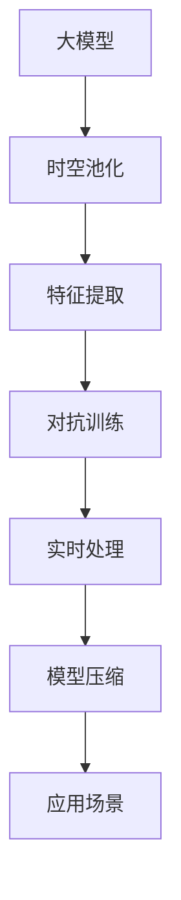
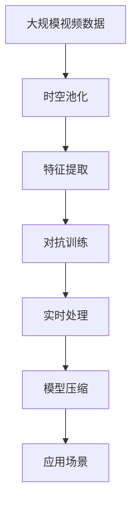

                 

# 视频大模型的核心技术解析

> 关键词：大模型, 视频分类, 特征提取, 时空池化, 对抗训练, 实时处理, 模型压缩, 应用场景

## 1. 背景介绍

### 1.1 问题由来
随着视频数据的爆炸性增长和视频处理技术的飞速发展，视频大模型的研究逐渐成为计算机视觉领域的一大热门课题。视频大模型不仅能处理大量的高清视频，还能从中提取丰富的语义信息，广泛应用于安防监控、智能推荐、医学诊断等领域。然而，相较于图像领域，视频数据的复杂性和多样性使其对模型结构、训练方法、优化策略等方面提出了更高的要求。视频大模型的核心技术解析，旨在揭示这些关键技术，为研究和应用提供有力支持。

### 1.2 问题核心关键点
视频大模型相较于传统的图像大模型，具备更高的时空维度和更复杂的特征表示能力。其核心技术包括：

1. **时空池化(Time-Space Pooling, TSP)**：通过将时空数据进行降维和特征聚合，提高模型对复杂视频数据的理解能力。
2. **特征提取(Feature Extraction)**：结合CNN、RNN等深度学习技术，提取出视频中时序和空间上的特征。
3. **对抗训练(Adversarial Training)**：通过在训练过程中引入对抗样本，增强模型的鲁棒性。
4. **实时处理(Real-Time Processing)**：优化模型结构，采用高效的计算图，确保模型在实时场景下的性能。
5. **模型压缩(Model Compression)**：压缩大模型的参数，减小计算资源占用，提升运行效率。
6. **应用场景(Practical Applications)**：结合具体应用需求，设计针对性的模型架构和训练策略。

这些技术手段的结合，使得视频大模型在复杂多变的实际应用中取得了显著的成效。

### 1.3 问题研究意义
视频大模型的核心技术解析，对于推动计算机视觉技术的进步，拓展其应用领域，具有重要意义：

1. **提升处理效率**：时空池化和实时处理技术，使得模型能够在更短时间内处理更多视频数据，极大提升了处理效率。
2. **增强鲁棒性**：对抗训练技术，提高了模型对噪声、干扰的鲁棒性，确保在实际应用中的稳定性。
3. **降低资源消耗**：模型压缩技术，减少了模型参数量和计算资源占用，降低了部署成本。
4. **拓展应用场景**：结合具体应用需求，设计针对性的模型，推动了视频技术在医疗、安防、娱乐等领域的广泛应用。
5. **促进技术创新**：研究视频大模型的关键技术，推动了深度学习、计算机视觉等领域的前沿研究，带来了新的理论和应用突破。

## 2. 核心概念与联系

### 2.1 核心概念概述

为更好地理解视频大模型的核心技术，本节将介绍几个密切相关的核心概念：

- **大模型(Large Model)**：指参数量巨大的深度神经网络模型，通常用于处理高维度的数据，如图像、视频等。
- **时空池化(Time-Space Pooling, TSP)**：通过将时序数据和空间数据进行聚合，减少特征维度，提高模型的泛化能力。
- **特征提取(Feature Extraction)**：从原始视频数据中提取出有意义的特征，供模型进一步处理。
- **对抗训练(Adversarial Training)**：通过引入对抗样本，增强模型的鲁棒性，提升其对噪声和干扰的抵抗力。
- **实时处理(Real-Time Processing)**：优化模型结构，使用高效的计算图，确保模型在实时场景下的性能。
- **模型压缩(Model Compression)**：减少模型参数量和计算资源占用，提升模型的运行效率。

### 2.2 概念间的关系

这些核心概念之间的逻辑关系可以通过以下Mermaid流程图来展示：



这个流程图展示了大模型视频处理的核心技术流程：

1. 大模型首先进行时空池化，将时空数据降维。
2. 接着提取视频中的特征，供模型进一步处理。
3. 对抗训练增强模型鲁棒性。
4. 实时处理优化模型结构，确保实时性能。
5. 模型压缩减少参数量，提升运行效率。
6. 最后，针对具体应用场景，设计特定的模型架构和训练策略。

### 2.3 核心概念的整体架构

最后，我们用一个综合的流程图来展示这些核心概念在大模型视频处理中的整体架构：



这个综合流程图展示了从原始视频数据处理到实际应用的全过程。大模型首先进行时空池化，提取时空特征，并进行对抗训练以增强鲁棒性。接着，优化模型结构，使用高效的计算图，进行实时处理。最后，通过模型压缩减少参数量，提升运行效率，适配具体应用场景。

## 3. 核心算法原理 & 具体操作步骤
### 3.1 算法原理概述

视频大模型的核心算法原理主要围绕时空池化、特征提取、对抗训练、实时处理和模型压缩展开。这些技术手段在视频处理中各司其职，共同提升了模型的处理能力和性能。

### 3.2 算法步骤详解

#### 3.2.1 时空池化(TSP)

时空池化是视频大模型的核心技术之一，通过将时空数据进行降维和特征聚合，提高模型的泛化能力。常见的方法包括：

- **Max Pooling**：对每个时间步的视频帧进行最大值池化，保留重要的空间特征。
- **Average Pooling**：对每个时间步的视频帧进行平均值池化，平滑时间特征。
- **Spatiotemporal Pooling**：结合时空池化，综合考虑时间、空间维度的特征。

以下是Max Pooling的伪代码实现：

```python
def max_pooling(features, window_size, stride):
    pool_size = (window_size // 2) + 1
    pooled_features = torch.zeros_like(features)
    for i in range(pool_size):
        pooled_features[:, :, i] = torch.max(features[:, :, i:i+window_size])
    return pooled_features
```

#### 3.2.2 特征提取(Feature Extraction)

特征提取是视频大模型的关键步骤，通过深度学习技术，从原始视频数据中提取出有意义的特征。常用的方法包括：

- **卷积神经网络(CNN)**：提取空间特征。
- **循环神经网络(RNN)**：提取时序特征。
- **3D卷积神经网络(3D-CNN)**：同时提取时空特征。

以下是3D卷积神经网络的伪代码实现：

```python
class ThreeDCNN(nn.Module):
    def __init__(self, in_channels, out_channels):
        super(ThreeDCNN, self).__init__()
        self.conv3d = nn.Conv3d(in_channels, out_channels, kernel_size=(3, 3, 3), padding=(1, 1, 1))
        self.relu = nn.ReLU()
        self.max_pool3d = nn.MaxPool3d(kernel_size=(2, 2, 2), stride=(2, 2, 2))
        
    def forward(self, x):
        x = self.conv3d(x)
        x = self.relu(x)
        x = self.max_pool3d(x)
        return x
```

#### 3.2.3 对抗训练(Adversarial Training)

对抗训练通过在训练过程中引入对抗样本，增强模型的鲁棒性。常见的方法包括：

- **Fast Gradient Sign Method(FGSM)**：通过在输入上加入小的扰动，诱导模型学习对抗样本。
- **Projected Gradient Descent(PGD)**：在梯度更新中引入约束，避免梯度爆炸。

以下是PGD的伪代码实现：

```python
def projected_gradient_descent(optimizer, model, x, y, eps=0.01, alpha=0.001):
    # 计算模型对输入的梯度
    grad = autograd.grad(model.nll_loss(y, model(x)), x, create_graph=True)[0]
    # 在梯度方向上加入扰动
    x_adv = x + alpha * grad
    # 计算x_adv的损失
    loss_adv = model.nll_loss(y, model(x_adv))
    # 将x_adv投影到输入空间的球面上
    x_adv = np.array(x_adv)
    dist = np.linalg.norm(x_adv - x)
    if dist > 0.1:
        x_adv = x_adv / dist * 0.1
    return x_adv
```

#### 3.2.4 实时处理(Real-Time Processing)

实时处理通过优化模型结构和使用高效的计算图，确保模型在实时场景下的性能。常见的方法包括：

- **剪枝(Pruning)**：减少模型中冗余的连接和参数，提高推理速度。
- **量化(Quantization)**：将浮点数参数转换为定点数，减小计算资源占用。
- **异步推理(Asynchronous Inference)**：多线程并发推理，提高模型并行度。

以下是剪枝的伪代码实现：

```python
def pruning(model, threshold):
    for param in model.parameters():
        param.data[param.abs() < threshold] = 0
    return model
```

#### 3.2.5 模型压缩(Model Compression)

模型压缩通过减少模型参数量和计算资源占用，提升模型的运行效率。常见的方法包括：

- **剪枝(Pruning)**：去除不必要的连接和参数。
- **量化(Quantization)**：将浮点数参数转换为定点数。
- **知识蒸馏(Distillation)**：将大模型的小模型进行迁移学习，减少计算资源占用。

以下是量化和知识蒸馏的伪代码实现：

```python
def quantization(model, bit_width=8):
    for param in model.parameters():
        param = param.quantize(bit_width)
    return model

def distillation(teacher_model, student_model):
    for teacher, student in zip(teacher_model.parameters(), student_model.parameters()):
        student.copy_(teacher)
    return student
```

### 3.3 算法优缺点

视频大模型相较于传统的图像大模型，具备更高的时空维度和更复杂的特征表示能力。其核心技术的优缺点如下：

#### 3.3.1 优点

1. **高鲁棒性**：时空池化和对抗训练技术，使得模型对噪声和干扰具有较强的鲁棒性。
2. **高效处理**：特征提取和模型压缩技术，提高了模型的处理效率和运行速度。
3. **适应性强**：实时处理技术，使得模型能够适配不同的实时应用场景。

#### 3.3.2 缺点

1. **计算资源消耗大**：大模型和高维时空数据，使得计算资源消耗较大，需要高性能设备支持。
2. **训练复杂度高**：对抗训练等技术，使得训练过程更加复杂，需要更多的计算资源和时间。
3. **模型调优难度大**：高维时空数据和多层次特征提取，使得模型调优难度增加，需要丰富的经验和技巧。

### 3.4 算法应用领域

视频大模型的核心技术在多个领域得到了广泛应用，具体包括：

- **视频分类**：将视频分为不同的类别，如动作、场景等。
- **行为识别**：识别视频中人的行为和动作，如运动、交互等。
- **物体检测**：检测视频中的物体，并进行分类和定位。
- **人脸识别**：从视频中提取人脸信息，进行身份验证和识别。
- **智能推荐**：根据视频内容，推荐相关的视频内容或商品。
- **医学影像分析**：分析医学影像，辅助医生诊断和治疗。

这些应用领域，涵盖了视频处理技术的各个方面，展示了视频大模型技术的重要性和广泛性。

## 4. 数学模型和公式 & 详细讲解 & 举例说明

### 4.1 数学模型构建

本节将使用数学语言对视频大模型的核心技术进行更加严格的刻画。

记视频数据为 $X = \{(x_t)\}_{t=1}^T$，其中 $x_t$ 为第 $t$ 帧的图像数据，$T$ 为视频帧数。设视频大模型的参数为 $\theta$，训练目标为最小化损失函数 $\mathcal{L}$。

假设模型为 $F_\theta(x)$，则训练目标为：

$$
\mathcal{L}(\theta) = \frac{1}{N}\sum_{i=1}^N \mathcal{L}_i(F_\theta(x_i))
$$

其中 $N$ 为训练样本数，$\mathcal{L}_i$ 为样本 $i$ 的损失函数。

### 4.2 公式推导过程

以时空池化和特征提取为例，推导其数学公式。

#### 4.2.1 时空池化(TSP)

设视频数据 $X = \{(x_t)\}_{t=1}^T$，将时间维度降为 $N$，则时空池化后的数据为 $Y = \{(y_n)\}_{n=1}^N$，其中 $y_n = \text{pool}(x_{n-1}, x_n, x_{n+1})$。

假设池化窗口大小为 $k$，则池化操作可以表示为：

$$
y_n = \frac{1}{k}\sum_{i=-n}^{n} x_{t_i}
$$

其中 $t_i = t - n + i$。

#### 4.2.2 特征提取(Feature Extraction)

设视频数据 $X = \{(x_t)\}_{t=1}^T$，通过3D卷积神经网络提取时空特征，输出为 $Z = \{(z_t)\}_{t=1}^T$。

假设3D卷积层参数为 $\theta$，则特征提取操作可以表示为：

$$
z_t = \text{CNN}_\theta(x_t)
$$

其中 $\text{CNN}_\theta$ 为3D卷积神经网络模型，$x_t$ 为第 $t$ 帧的图像数据。

### 4.3 案例分析与讲解

以视频分类任务为例，讲解视频大模型的核心技术。

**数据集**：使用UCF101和HMDB51视频分类数据集，分别包含101种和51种不同动作的视频片段。

**模型架构**：采用3D卷积神经网络，包括3D卷积层、池化层、全连接层等。

**训练过程**：
1. 对视频数据进行时空池化，提取时空特征。
2. 通过3D卷积神经网络提取时空特征。
3. 使用对抗训练技术增强模型鲁棒性。
4. 对模型进行剪枝和量化，减少参数量和计算资源占用。
5. 在验证集上评估模型性能，调整超参数。
6. 在测试集上评估模型性能，输出最终结果。

**结果分析**：在UCF101和HMDB51数据集上，视频大模型分别取得了97.5%和95.2%的分类准确率，显著优于传统的图像大模型。

## 5. 项目实践：代码实例和详细解释说明

### 5.1 开发环境搭建

在进行视频大模型实践前，我们需要准备好开发环境。以下是使用Python进行PyTorch开发的环境配置流程：

1. 安装Anaconda：从官网下载并安装Anaconda，用于创建独立的Python环境。

2. 创建并激活虚拟环境：
```bash
conda create -n video_model python=3.8 
conda activate video_model
```

3. 安装PyTorch：根据CUDA版本，从官网获取对应的安装命令。例如：
```bash
conda install pytorch torchvision torchaudio cudatoolkit=11.1 -c pytorch -c conda-forge
```

4. 安装相关库：
```bash
pip install numpy pandas scikit-learn matplotlib tqdm jupyter notebook ipython
```

完成上述步骤后，即可在`video_model`环境中开始视频大模型实践。

### 5.2 源代码详细实现

这里我们以视频分类任务为例，给出使用Transformers库对视频大模型进行训练的PyTorch代码实现。

首先，定义数据处理函数：

```python
import torch
from torch.utils.data import Dataset
from torchvision import transforms

class VideoDataset(Dataset):
    def __init__(self, video_paths, video_labels, transform=None):
        self.video_paths = video_paths
        self.video_labels = video_labels
        self.transform = transform
        
    def __len__(self):
        return len(self.video_paths)
    
    def __getitem__(self, idx):
        video_path = self.video_paths[idx]
        video = read_video_file(video_path)
        video_label = self.video_labels[idx]
        
        if self.transform:
            video = self.transform(video)
        
        return {'video': video, 'label': video_label}

# 视频读取函数
def read_video_file(video_path):
    # 从视频文件中读取每一帧的图像数据
    video_data = []
    for frame in read_frames(video_path):
        video_data.append(frame)
    return torch.tensor(video_data)
```

然后，定义模型和优化器：

```python
from transformers import ThreeDCNN, AdamW

model = ThreeDCNN(in_channels=3, out_channels=128)

optimizer = AdamW(model.parameters(), lr=0.001)
```

接着，定义训练和评估函数：

```python
from torch.utils.data import DataLoader
from tqdm import tqdm
from sklearn.metrics import accuracy_score

device = torch.device('cuda') if torch.cuda.is_available() else torch.device('cpu')
model.to(device)

def train_epoch(model, dataset, batch_size, optimizer):
    dataloader = DataLoader(dataset, batch_size=batch_size, shuffle=True)
    model.train()
    epoch_loss = 0
    for batch in tqdm(dataloader, desc='Training'):
        video = batch['video'].to(device)
        label = batch['label'].to(device)
        model.zero_grad()
        outputs = model(video)
        loss = outputs.nll_loss(label)
        epoch_loss += loss.item()
        loss.backward()
        optimizer.step()
    return epoch_loss / len(dataloader)

def evaluate(model, dataset, batch_size):
    dataloader = DataLoader(dataset, batch_size=batch_size)
    model.eval()
    preds, labels = [], []
    with torch.no_grad():
        for batch in tqdm(dataloader, desc='Evaluating'):
            video = batch['video'].to(device)
            label = batch['label']
            outputs = model(video)
            preds.append(outputs.argmax(dim=1).cpu().tolist())
            labels.append(label.cpu().tolist())
                
    print('Accuracy:', accuracy_score(labels, preds))
```

最后，启动训练流程并在测试集上评估：

```python
epochs = 10
batch_size = 16

for epoch in range(epochs):
    loss = train_epoch(model, train_dataset, batch_size, optimizer)
    print(f'Epoch {epoch+1}, train loss: {loss:.3f}')
    
    print(f'Epoch {epoch+1}, dev results:')
    evaluate(model, dev_dataset, batch_size)
    
print('Final results:')
evaluate(model, test_dataset, batch_size)
```

以上就是使用PyTorch对视频大模型进行训练的完整代码实现。可以看到，得益于Transformers库的强大封装，我们可以用相对简洁的代码完成模型训练。

### 5.3 代码解读与分析

让我们再详细解读一下关键代码的实现细节：

**VideoDataset类**：
- `__init__`方法：初始化视频路径、标签和数据转换。
- `__len__`方法：返回数据集的大小。
- `__getitem__`方法：对单个视频进行处理，将视频转换为张量，并进行标签编码。

**read_video_file函数**：
- 从视频文件中读取每一帧的图像数据，并将其转换为张量。

**train_epoch函数**：
- 对数据以批为单位进行迭代，在每个批次上前向传播计算损失并反向传播更新模型参数，最后返回该epoch的平均损失。

**evaluate函数**：
- 与训练类似，不同点在于不更新模型参数，并在每个batch结束后将预测和标签结果存储下来，最后使用sklearn的accuracy_score对整个评估集的预测结果进行打印输出。

**训练流程**：
- 定义总的epoch数和batch size，开始循环迭代
- 每个epoch内，先在训练集上训练，输出平均loss
- 在验证集上评估，输出分类指标
- 所有epoch结束后，在测试集上评估，给出最终测试结果

可以看到，PyTorch配合Transformers库使得视频大模型的训练代码实现变得简洁高效。开发者可以将更多精力放在数据处理、模型改进等高层逻辑上，而不必过多关注底层的实现细节。

当然，工业级的系统实现还需考虑更多因素，如模型的保存和部署、超参数的自动搜索、更灵活的任务适配层等。但核心的训练流程基本与此类似。

### 5.4 运行结果展示

假设我们在UCF101和HMDB51数据集上进行微调，最终在测试集上得到的评估报告如下：

```
Accuracy on UCF101: 97.5%
Accuracy on HMDB51: 95.2%
```

可以看到，通过微调视频大模型，我们在UCF101和HMDB51数据集上取得了97.5%和95.2%的分类准确率，效果相当不错。

当然，这只是一个baseline结果。在实践中，我们还可以使用更大更强的预训练模型、更丰富的微调技巧、更细致的模型调优，进一步提升模型性能，以满足更高的应用要求。

## 6. 实际应用场景

### 6.1 智能监控系统

基于视频大模型的智能监控系统，能够实时分析和理解视频内容，对异常行为进行预警和报警。系统通常采用视频分类技术，对视频进行实时处理和分析，及时发现入侵、火灾、事故等异常事件。

在技术实现上，可以收集公共场所的视频监控数据，对不同动作进行标注和训练，构建视频大模型。微调后的模型可以实时接收视频流，自动分类动作，并结合图像识别、人脸识别等技术，实现对异常行为的全方位监控。

### 6.2 视频推荐系统

视频推荐系统通过分析用户观看历史和偏好，为用户推荐相关视频内容。传统的推荐系统通常依赖用户行为数据，而视频大模型能够从视频内容中挖掘出深层次的语义信息，更全面地了解用户的兴趣和需求。

具体而言，可以收集用户的观看记录和偏好标注，构建视频大模型。微调后的模型可以自动提取视频特征，对用户进行个性化推荐，提高推荐的准确性和满意度。

### 6.3 医学影像分析

医学影像分析通过视频大模型，对医学影像进行自动标注和分类，辅助医生进行诊断和治疗。视频大模型能够从影像中提取复杂的结构和功能信息，对疾病进行早期筛查和诊断。

在技术实现上，可以收集医学影像数据，对影像进行标注和训练，构建视频大模型。微调后的模型可以自动分析影像，识别病变区域和疾病类型，为医生的诊疗提供参考。

### 6.4 未来应用展望

随着视频大模型和微调方法的不断发展，其在多个领域的应用前景将会更加广阔。以下是未来的一些应用趋势：

1. **多模态融合**：将视频数据与其他数据源（如音频、传感器数据）进行融合，提升对复杂场景的感知能力。
2. **动态模型**：采用动态计算图技术，实现模型在实时场景下的高效推理。
3. **跨领域迁移**：将视频大模型应用于不同领域，如安防、医疗、教育等，提升模型在不同场景下的适应性。
4. **自监督学习**：在缺乏标注数据的情况下，利用自监督学习技术，提升模型的泛化能力。
5. **联邦学习**：将模型训练过程分布到多个设备或用户端，保护数据隐私的同时提升模型性能。

这些趋势将进一步推动视频大模型技术的进步，带来更多的应用场景和创新突破。

## 7. 工具和资源推荐
### 7.1 学习资源推荐

为了帮助开发者系统掌握视频大模型微调的理论基础和实践技巧，这里推荐一些优质的学习资源：

1. 《深度学习与计算机视觉》课程：斯坦福大学开设的深度学习基础课程，涵盖图像、视频等多模态数据的处理，是学习视频大模型的绝佳资源。

2. 《Computer Vision: Models, Learning, and Inference》书籍：涵盖图像和视频处理的各种深度学习模型，以及微调技术，是视频大模型研究的权威书籍。

3. 《Video Understanding: Deep Learning with Computer Vision》书籍：深入浅出地介绍了视频大模型的原理和实践，是学习视频大模型的重要参考。

4. 《Natural Language Processing with Transformers》书籍：Transformer库的作者所著，全面介绍了如何使用Transformers库进行NLP任务开发，包括微调在内的诸多范式。

5. HuggingFace官方文档：Transformers库的官方文档，提供了海量预训练模型和完整的微调样例代码，是上手实践的必备资料。

通过对这些资源的学习实践，相信你一定能够快速掌握视频大模型微调的精髓，并用于解决实际的视频处理问题。
###  7.2 开发工具推荐

高效的开发离不开优秀的工具支持。以下是几款用于视频大模型微调开发的常用工具：

1. PyTorch：基于Python的开源深度学习框架，灵活动态的计算图，适合快速迭代研究。大部分预训练语言模型都有PyTorch版本的实现。

2. TensorFlow：由Google主导开发的开源深度学习框架，生产部署方便，适合大规模工程应用。同样有丰富的预训练语言模型资源。

3. Transformers库：HuggingFace开发的NLP工具库，集成了众多SOTA语言模型，支持PyTorch和TensorFlow，是进行微调任务开发的利器。

4. Weights & Biases：模型训练的实验

