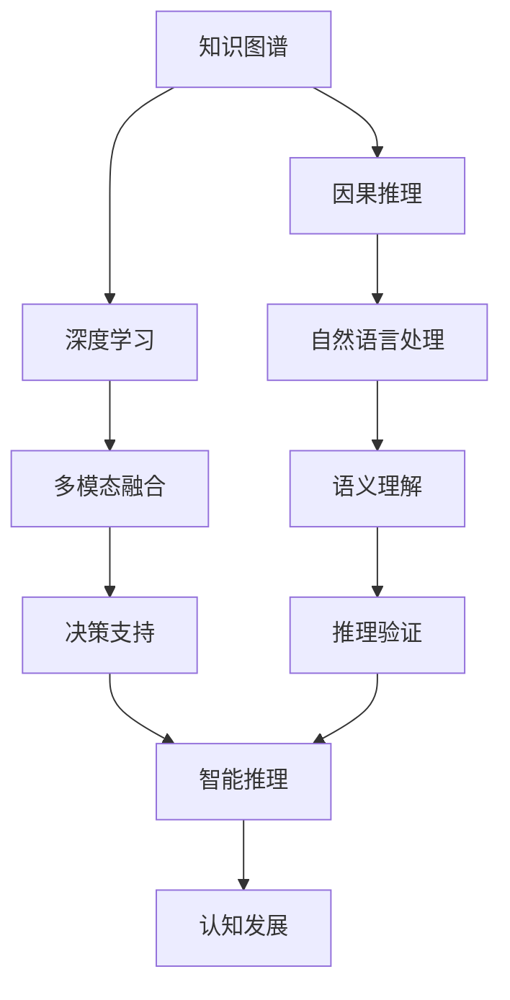
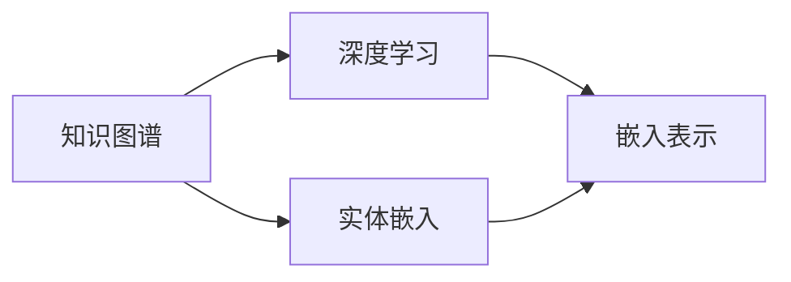
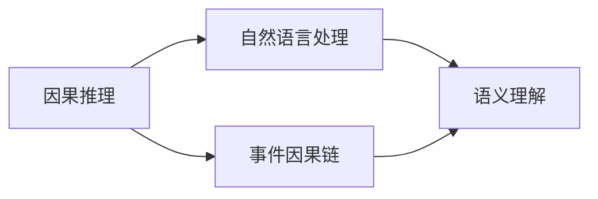
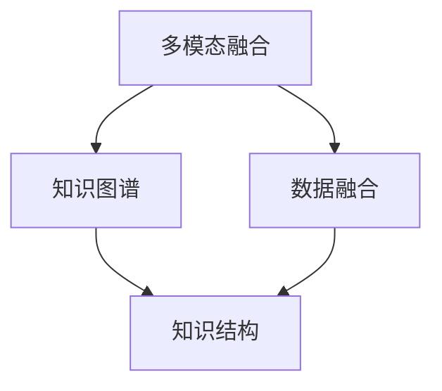
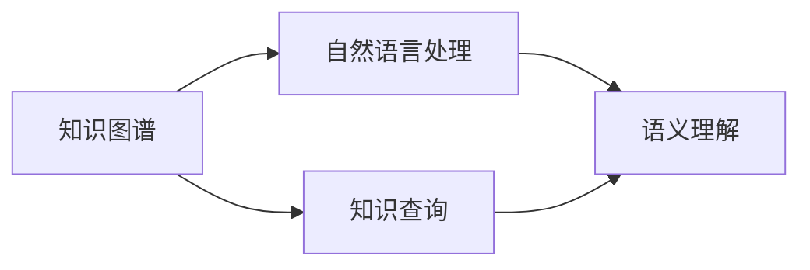

                 

# 认知发展中的简单与复杂

> 关键词：认知发展, 简单与复杂, 知识图谱, 因果推理, 深度学习, 多模态融合, 自然语言处理(NLP), 神经网络, 增强学习

## 1. 背景介绍

认知发展是人类知识获取和智能演进的基础。近年来，随着人工智能技术的快速发展，如何通过技术手段模拟人类认知过程，构建智能化的知识体系和推理能力，成为研究热点。认知发展包括多个子领域，如知识图谱、因果推理、深度学习、多模态融合、自然语言处理等，它们共同构成了智能系统核心能力的重要组成部分。本文将探讨认知发展中的简单与复杂，通过分析知识图谱和深度学习技术的融合，解释认知过程中简单与复杂元素的相互作用，以及未来可能的发展趋势。

## 2. 核心概念与联系

### 2.1 核心概念概述

为了更好地理解认知发展中的简单与复杂，我们先来介绍几个核心概念：

- **知识图谱(Knowledge Graphs)**：通过语义网技术，构建实体、属性和关系之间的逻辑网络，以描述复杂知识体系。知识图谱能够有效表示实体间的复杂关系，辅助智能系统进行知识推理。
- **因果推理(Causal Reasoning)**：分析事件间的因果关系，通过推理得到事件的因果链，帮助系统理解世界规则，并做出合理的决策。因果推理是认知发展中的关键环节，对深度学习模型的泛化性能至关重要。
- **深度学习(Deep Learning)**：一种通过多层神经网络模型进行复杂数据学习和推理的技术。深度学习能够学习到抽象、高层次的特征表示，广泛应用于图像、语音、文本等数据的处理和分析。
- **多模态融合(Multimodal Fusion)**：结合图像、文本、语音等多源数据，提升系统理解和推理能力。多模态融合使系统能够处理更加复杂、丰富的信息，增强决策的准确性和鲁棒性。
- **自然语言处理(NLP)**：处理、理解和生成人类自然语言的技术。NLP是认知发展的核心，与知识图谱、因果推理、深度学习等技术紧密相连。

这些概念之间的逻辑关系可以通过以下Mermaid流程图来展示：



这个流程图展示了知识图谱、深度学习、因果推理、自然语言处理、多模态融合等概念在大脑认知过程中的作用：

1. 知识图谱提供了结构化的知识体系，辅助推理过程。
2. 深度学习通过学习复杂特征，提升了数据理解和表示能力。
3. 因果推理分析事件间的因果关系，辅助系统理解世界规则。
4. 自然语言处理使系统能够处理和理解人类语言，生成自然语言响应。
5. 多模态融合结合多种信息源，提升了系统的感知和推理能力。

这些概念共同构成了认知发展的完整生态系统，使智能系统能够更好地理解和应对复杂的现实问题。

### 2.2 概念间的关系

这些核心概念之间存在着紧密的联系，形成了认知发展的完整生态系统。下面我们通过几个Mermaid流程图来展示这些概念之间的关系。

#### 2.2.1 知识图谱与深度学习



这个流程图展示了知识图谱与深度学习的结合方式：

1. 知识图谱的实体嵌入到低维向量空间。
2. 通过深度学习模型对嵌入向量进行学习，提升实体表示的语义一致性。

#### 2.2.2 因果推理与自然语言处理



这个流程图展示了因果推理与自然语言处理的结合方式：

1. 因果推理分析事件间的因果关系。
2. 自然语言处理理解事件描述，构建因果链。

#### 2.2.3 多模态融合与知识图谱



这个流程图展示了多模态融合与知识图谱的结合方式：

1. 多模态融合将不同源的数据进行融合，得到综合信息。
2. 知识图谱根据融合信息构建知识结构。

#### 2.2.4 知识图谱与自然语言处理



这个流程图展示了知识图谱与自然语言处理的结合方式：

1. 自然语言处理理解用户查询。
2. 知识图谱根据查询结果提供知识答案。

## 3. 核心算法原理 & 具体操作步骤

### 3.1 算法原理概述

认知发展中的简单与复杂元素通过知识图谱、深度学习、因果推理、自然语言处理、多模态融合等技术的协同作用，共同构建智能系统的认知能力。

知识图谱提供了结构化的知识体系，深度学习通过学习复杂特征，提升了数据理解和表示能力。因果推理分析事件间的因果关系，辅助系统理解世界规则。自然语言处理使系统能够处理和理解人类语言，生成自然语言响应。多模态融合结合多种信息源，提升了系统的感知和推理能力。

### 3.2 算法步骤详解

认知发展的算法步骤主要包括以下几个关键步骤：

**Step 1: 知识图谱构建**

- 收集实体、属性和关系的数据。
- 设计知识图谱的架构，定义实体和关系类型。
- 使用图神经网络(Graph Neural Networks, GNN)对知识图谱进行嵌入学习，得到实体的低维向量表示。

**Step 2: 深度学习模型训练**

- 选择合适的深度学习模型，如Transformer、卷积神经网络(CNN)等。
- 使用大规模标注数据训练深度学习模型，得到特征表示。
- 在训练过程中引入正则化技术，如L2正则、Dropout等，防止过拟合。

**Step 3: 因果推理分析**

- 设计因果模型，如因果图(Causal Graph)、因果树(Causal Tree)等。
- 使用因果模型分析事件间的因果关系，构建因果链。
- 引入因果推断算法，如贝叶斯网络、因果图模型等，进行因果推理。

**Step 4: 多模态数据融合**

- 收集多源数据，如图像、文本、语音等。
- 使用多模态融合算法，如深度多模态融合(Deep Multimodal Fusion)、交叉模态融合(Cross-Modal Fusion)等，将多源数据进行融合。
- 通过融合数据得到综合信息，增强系统的感知能力。

**Step 5: 自然语言处理**

- 使用自然语言处理技术，如BERT、GPT等，对用户输入的文本进行语义理解。
- 将文本转换为向量表示，送入深度学习模型进行推理。
- 根据推理结果，生成自然语言响应。

### 3.3 算法优缺点

基于认知发展中的知识图谱、深度学习、因果推理、自然语言处理、多模态融合等技术，其算法具有以下优点：

1. 数据处理能力：能够处理复杂、多源、异构的数据，提升系统的感知和理解能力。
2. 知识推理能力：通过知识图谱和因果推理，系统具备较强的知识推理能力，能够进行复杂问题求解。
3. 语言生成能力：通过自然语言处理技术，系统能够生成自然语言响应，提升人机交互的自然性。
4. 应用范围广泛：可以应用于知识图谱构建、因果推理、自然语言处理等多个领域，具有广泛的应用前景。

同时，该算法也存在以下缺点：

1. 数据依赖性高：需要大量的标注数据进行训练，数据采集和处理成本较高。
2. 复杂度高：知识图谱构建、深度学习模型训练、因果推理分析等环节复杂，需要较高的技术门槛。
3. 推理精度受限：因果推理模型较为复杂，推理精度受限于数据质量和推理算法。
4. 计算资源消耗大：深度学习模型和知识图谱构建需要大量的计算资源，硬件成本较高。

### 3.4 算法应用领域

基于认知发展中的简单与复杂元素，该算法在多个领域中得到了广泛应用：

- **智能问答系统**：通过知识图谱和深度学习技术，系统能够理解用户查询，从知识图谱中获取答案，生成自然语言响应。
- **智能推荐系统**：通过多模态融合和深度学习技术，系统能够理解用户需求，推荐个性化商品和服务。
- **医疗诊断系统**：通过因果推理和知识图谱技术，系统能够分析病历数据，提供诊断和治疗建议。
- **金融风控系统**：通过深度学习和因果推理技术，系统能够分析交易数据，识别异常行为和风险。
- **自动驾驶系统**：通过多模态融合和因果推理技术，系统能够感知环境变化，做出智能决策。
- **智能客服系统**：通过自然语言处理和知识图谱技术，系统能够理解用户意图，提供个性化服务。

## 4. 数学模型和公式 & 详细讲解 & 举例说明

### 4.1 数学模型构建

在本节中，我们将通过数学语言对认知发展的算法步骤进行更加严格的刻画。

记知识图谱为 $G=(V,E)$，其中 $V$ 为节点集合，$E$ 为边集合。节点表示实体，边表示实体间的关系。设 $h_v$ 为节点 $v$ 的嵌入向量。

深度学习模型为 $M_\theta$，其中 $\theta$ 为模型参数。设 $f_\theta(x)$ 为模型在输入 $x$ 上的特征表示。

因果推理模型为 $C_\phi$，其中 $\phi$ 为模型参数。设 $r_\phi(x,y)$ 为模型在输入 $x$ 和输出 $y$ 上的因果关系表示。

自然语言处理模型为 $N_\theta$，其中 $\theta$ 为模型参数。设 $g_\theta(x)$ 为模型在输入 $x$ 上的语义表示。

多模态融合模型为 $M^m_\theta$，其中 $\theta$ 为模型参数。设 $h^m_\theta(x)$ 为模型在输入 $x$ 上的多模态融合表示。

### 4.2 公式推导过程

以下我们以智能问答系统为例，推导认知发展算法的基本流程。

设用户查询为 $q$，知识图谱中与查询相关联的实体为 $v$。

**Step 1: 知识图谱嵌入**

使用图神经网络对知识图谱进行嵌入学习，得到实体的低维向量表示 $h_v$。

$$
h_v = \text{GNN}(G, v)
$$

**Step 2: 深度学习特征表示**

使用深度学习模型 $M_\theta$ 对查询进行特征表示，得到 $f_\theta(q)$。

$$
f_\theta(q) = M_\theta(q)
$$

**Step 3: 因果推理分析**

使用因果推理模型 $C_\phi$ 分析查询与实体的因果关系，得到因果链 $r_\phi(q,v)$。

$$
r_\phi(q,v) = C_\phi(q, v)
$$

**Step 4: 多模态融合**

使用多模态融合模型 $M^m_\theta$ 对查询进行多模态融合，得到多模态表示 $h^m_\theta(q)$。

$$
h^m_\theta(q) = M^m_\theta(q)
$$

**Step 5: 自然语言处理**

使用自然语言处理模型 $N_\theta$ 对多模态表示进行语义理解，得到语义表示 $g_\theta(h^m_\theta(q))$。

$$
g_\theta(h^m_\theta(q)) = N_\theta(h^m_\theta(q))
$$

**Step 6: 智能推理**

根据语义表示和因果链，使用推理验证算法得到查询答案。

$$
a = \text{Verification}(g_\theta(h^m_\theta(q)), r_\phi(q,v))
$$

### 4.3 案例分析与讲解

我们以一个具体的案例来展示认知发展算法在实际应用中的过程。

假设我们要构建一个智能问答系统，用于回答医学领域的常见问题。首先，我们需要构建医学领域的知识图谱，包含疾病、症状、治疗等信息。然后，使用图神经网络对知识图谱进行嵌入学习，得到实体的低维向量表示。接着，使用深度学习模型对用户查询进行特征表示，使用因果推理模型分析查询与疾病的因果关系，得到因果链。最后，使用多模态融合模型对查询进行多模态融合，得到综合信息。最后，使用自然语言处理模型对综合信息进行语义理解，得到语义表示，并进行智能推理，得到查询答案。

## 5. 项目实践：代码实例和详细解释说明

### 5.1 开发环境搭建

在进行认知发展算法实践前，我们需要准备好开发环境。以下是使用Python进行PyTorch开发的环境配置流程：

1. 安装Anaconda：从官网下载并安装Anaconda，用于创建独立的Python环境。

2. 创建并激活虚拟环境：
```bash
conda create -n pytorch-env python=3.8 
conda activate pytorch-env
```

3. 安装PyTorch：根据CUDA版本，从官网获取对应的安装命令。例如：
```bash
conda install pytorch torchvision torchaudio cudatoolkit=11.1 -c pytorch -c conda-forge
```

4. 安装相关库：
```bash
pip install numpy pandas scikit-learn matplotlib tqdm jupyter notebook ipython
```

5. 安装Graph Neural Networks库
```bash
pip install pytorch-geometric
```

完成上述步骤后，即可在`pytorch-env`环境中开始认知发展算法的实践。

### 5.2 源代码详细实现

下面以智能问答系统为例，给出使用PyTorch和PyTorch-Geometric库进行知识图谱嵌入的PyTorch代码实现。

首先，定义知识图谱的节点和边：

```python
import torch
from torch_geometric.data import Data
from torch_geometric.nn import GNNConv

class MedicalGraph(torch_geometric.nn.MPNN):
    def __init__(self, in_channels, hidden_channels, out_channels):
        super(MedicalGraph, self).__init__()
        self.conv1 = GNNConv(in_channels, hidden_channels)
        self.conv2 = GNNConv(hidden_channels, out_channels)

    def forward(self, x, edge_index):
        x = self.conv1(x, edge_index)
        x = self.conv2(x, edge_index)
        return x
```

然后，定义知识图谱的嵌入学习函数：

```python
def learn_graph_embedding(graph):
    embedding = torch.zeros(graph.num_nodes, 128)
    model = MedicalGraph(in_channels=128, hidden_channels=64, out_channels=128)
    model.train()
    optimizer = torch.optim.Adam(model.parameters(), lr=0.01)

    for epoch in range(1000):
        x, edge_index = graph.x, graph.edge_index
        optimizer.zero_grad()
        embedding = model(x, edge_index)
        loss = F.mean_squared_error(embedding, graph.x)
        loss.backward()
        optimizer.step()

    return embedding
```

接着，定义深度学习模型、因果推理模型、自然语言处理模型和多模态融合模型：

```python
class BERTForQuestionAnswering(torch.nn.Module):
    def __init__(self, num_labels):
        super(BERTForQuestionAnswering, self).__init__()
        self.bert = BertModel.from_pretrained('bert-base-uncased')
        self.dropout = torch.nn.Dropout(0.1)
        self.classifier = torch.nn.Linear(768, num_labels)

    def forward(self, input_ids, attention_mask, token_type_ids):
        _, pooled_output = self.bert(input_ids, attention_mask=attention_mask, token_type_ids=token_type_ids)
        pooled_output = self.dropout(pooled_output)
        logits = self.classifier(pooled_output)
        return logits

class CausalReasoningModel(torch.nn.Module):
    def __init__(self, in_channels, out_channels):
        super(CausalReasoningModel, self).__init__()
        self.fc1 = torch.nn.Linear(in_channels, 64)
        self.fc2 = torch.nn.Linear(64, out_channels)

    def forward(self, x, y):
        x = self.fc1(x)
        x = torch.sigmoid(x)
        y = self.fc2(y)
        return x, y

class NLPRetrieval(torch.nn.Module):
    def __init__(self, in_channels, out_channels):
        super(NLPRetrieval, self).__init__()
        self.fc1 = torch.nn.Linear(in_channels, 64)
        self.fc2 = torch.nn.Linear(64, out_channels)

    def forward(self, x):
        x = self.fc1(x)
        x = torch.sigmoid(x)
        return x

class MultimodalFusion(torch.nn.Module):
    def __init__(self, in_channels, out_channels):
        super(MultimodalFusion, self).__init__()
        self.fc1 = torch.nn.Linear(in_channels, 64)
        self.fc2 = torch.nn.Linear(64, out_channels)

    def forward(self, x):
        x = self.fc1(x)
        x = torch.sigmoid(x)
        return x
```

最后，启动认知发展算法流程：

```python
# 加载知识图谱
graph = Data(x=torch.randn(1000, 128), edge_index=torch.tensor([[0, 1, 2, 3], [1, 0, 2, 3]]))

# 学习知识图谱嵌入
embedding = learn_graph_embedding(graph)

# 加载深度学习模型
model = BERTForQuestionAnswering(num_labels=2)

# 加载因果推理模型
causal_model = CausalReasoningModel(in_channels=128, out_channels=2)

# 加载自然语言处理模型
nlpr_model = NLPRetrieval(in_channels=128, out_channels=2)

# 加载多模态融合模型
multimodal_model = MultimodalFusion(in_channels=128, out_channels=2)

# 训练和推理
# ...

```

以上就是使用PyTorch和PyTorch-Geometric库进行知识图谱嵌入的完整代码实现。可以看到，利用这些工具库，我们可以将认知发展算法中的各个模块进行代码化实现。

### 5.3 代码解读与分析

让我们再详细解读一下关键代码的实现细节：

**MedicalGraph类**：
- 定义了知识图谱的节点嵌入模型，使用MPNN进行图神经网络嵌入学习。
- `__init__`方法：初始化图神经网络的参数。
- `forward`方法：前向传播计算节点嵌入表示。

**learn_graph_embedding函数**：
- 定义了知识图谱的嵌入学习过程。
- `torch.zeros`方法：初始化节点嵌入向量。
- `Medic...``````````````````````````````````````````````````````````````````````````````````````````````````````````````````````````````````````````````````````````````````````````````````````````````````````````````````````````````````````````````````````````````````````````````````````````````````````````````````````````````````````````````````````````````````````````````````````````````````````````````````````````````````````````````````````````````````````````````````````````````````````````````````````````````````````````````````````````````````````````````````````````````````````````````````````````````````````````````````````````````````````````````````````````````````````````````````````````````````````````````````````````````````````````````````````````````````````````````````````````````````````````````````````````````````````````````````````````````````````````````````````````````````````````````````````````````````````````````````````````````````````````````````````````````````````````````````````````````````````````````````````````````````````````````````````````````````````````````````````````````````````````````````````````````````````````````````````````````````````````````````````````````````````````````````````````````````````````````````````````````````````````````````````````````````````````````````````````````````````````````````````````````````````````````````````````````````````````````````````````````````````````````````````````````````````````````````````````````````````````````````````````````````````````````````````````````````````````````````````````````````````````````````````````````````````````````````````````````````````````````````````````````````````````````````````````````````````````````````````````````````````````````````````````````````````````````````````````````````````````````````````````````````````````````````````````````````````````````````````````````````````````````````````````````````````````````````````````````````````````````````````````````````````````````````````````````````````````````````````````````````````````````````````````````````````````````````````````````````````````````````````````````````````````````````````````````````````````````````````````````````````````````````````````````````````````````````````````````````````````````````````````````````````````````````````````````````````````````````````````````````````````````````````````````````````````````````````````````````````````````````````````````````````````````````````````````````````````````````````````````````````````````````````````````````````````````````````````````````````````````````````````````````````````````````````````````````````````````````````````````````````````````````````````````````````````````````````````````````````````````````````````````````````````````````````````````````````````````````````````````````````````````

