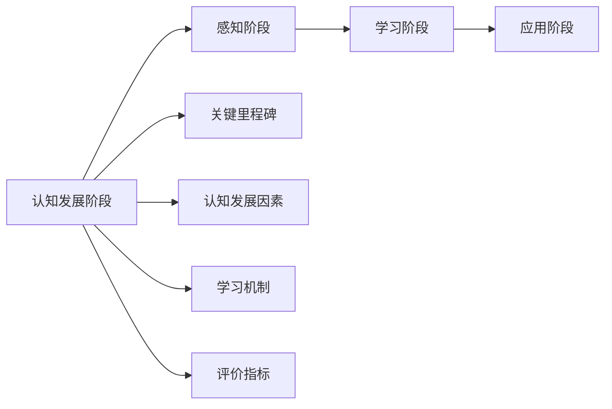
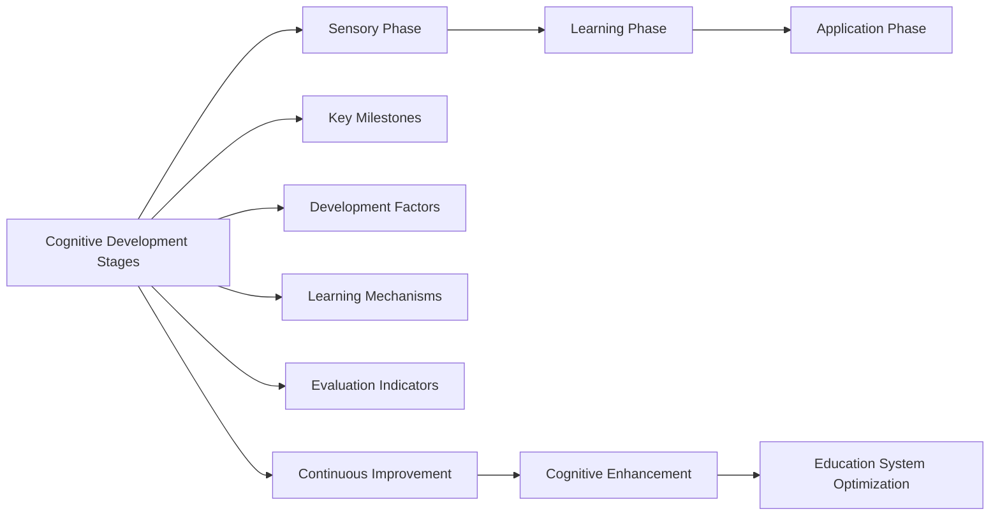

                 

## 1. 背景介绍

### 1.1 问题由来

在当今信息时代，认知渐进发展已经成为人工智能（AI）、神经科学、教育学、心理学等领域的研究热点。认知渐进发展理论，旨在解释人类认知能力如何随时间逐步提升，从而实现知识积累、技能提升和智能演进。该理论不仅有助于理解人类智能的起源和发展过程，还对人工智能教育、脑机接口、认知增强等应用具有重要启示。

### 1.2 问题核心关键点

认知渐进发展的核心关键点主要包括：
- **时间维度**：认知能力随时间逐步提升，而非瞬间突变。
- **个体差异**：不同个体的认知发展轨迹存在差异。
- **交互影响**：环境和教育对认知发展有显著影响。
- **多维度进展**：认知能力包括感知、记忆、推理、语言等多个维度。
- **外部触发**：外部刺激和经验对认知发展至关重要。

### 1.3 问题研究意义

研究认知渐进发展的理论，对于理解人类认知能力的本质和提升人工智能的智能水平具有重要意义：

1. **提供科学依据**：帮助教育者和科研人员理解认知发展的规律，优化教育方法。
2. **指导AI应用**：为人工智能教育、智能推荐系统、认知增强等提供理论基础。
3. **推动多学科融合**：促进心理学、神经科学、AI等领域知识的交叉和整合。
4. **提升人机交互体验**：通过认知渐进发展的理论，优化人机交互界面，提升用户体验。
5. **助力脑机接口发展**：指导脑机接口系统如何逐步提升用户的认知能力。

## 2. 核心概念与联系

### 2.1 核心概念概述

认知渐进发展的理论涉及多个核心概念，主要包括：

- **认知发展阶段**：将认知能力的发展分为不同的阶段，如感知阶段、学习阶段、应用阶段等。
- **关键里程碑**：特定认知技能的发展，如语言能力、逻辑推理能力、空间认知能力等。
- **认知发展因素**：影响认知发展的因素，如遗传、环境、教育、社会互动等。
- **学习机制**：认知发展的内部机制，如神经可塑性、突触连接加强、记忆编码等。
- **评价指标**：评估认知能力发展的指标，如智力测试、认知任务绩效等。

### 2.2 概念间的关系

认知渐进发展的理论框架可以通过以下Mermaid流程图来展示：



这个流程图展示认知发展的基本路径和关键要素。从感知阶段开始，个体逐步学习和发展各种认知技能，达到应用阶段。关键里程碑和认知发展因素在学习过程中起到推动作用，而学习机制则揭示了内部运作原理。

### 2.3 核心概念的整体架构

最终，我们将通过一个综合的流程图来展示认知渐进发展理论的整体架构：



这个综合流程图展示了从认知发展阶段到连续改进和教育系统优化的全过程。通过这个架构，我们可以更清晰地理解认知渐进发展的完整路径。

## 3. 核心算法原理 & 具体操作步骤
### 3.1 算法原理概述

认知渐进发展的算法原理主要基于以下假设：

1. **逐步发展假设**：认知能力随时间逐步提升，而非一次性达到顶峰。
2. **交互学习假设**：认知发展是环境和教育交互作用的结果。
3. **神经可塑性假设**：神经系统和认知能力存在潜在的可塑性，能够通过学习被重塑。

基于这些假设，认知渐进发展的算法主要包含以下几个步骤：

1. **初始评估**：对个体当前认知能力进行全面评估，确定其认知发展阶段和关键里程碑。
2. **目标设定**：根据评估结果，设定合适的认知发展目标。
3. **交互学习**：通过教学和训练，促进个体与环境的交互学习。
4. **监测评估**：持续监测个体的认知发展过程，评估学习效果。
5. **调整优化**：根据评估结果，调整教学策略和方法，优化认知发展路径。

### 3.2 算法步骤详解

具体的认知渐进发展算法步骤如下：

1. **数据收集**：
   - 使用标准化的心理测验、认知任务等工具，收集个体的认知数据。
   - 记录个体在学习和训练过程中的表现和反馈。

2. **初始评估**：
   - 通过数据分析，确定个体的认知发展阶段。
   - 识别个体的关键认知里程碑，如语言能力、逻辑推理能力等。

3. **目标设定**：
   - 根据评估结果，设定个性化的认知发展目标。
   - 制定详细的学习计划，包括学习内容、时间安排和评估指标。

4. **交互学习**：
   - 选择适当的教学方法和工具，促进个体与环境的交互。
   - 使用多种教学方法，如认知训练、游戏化学习、问题导向学习等。
   - 提供反馈和指导，帮助个体理解学习内容和目标。

5. **监测评估**：
   - 定期进行认知测验，评估个体在各个认知维度上的进展。
   - 使用学习管理系统，记录个体的学习轨迹和表现。

6. **调整优化**：
   - 根据评估结果，调整学习计划和教学方法。
   - 针对个体差异和特殊需求，提供个性化的学习支持。
   - 持续优化教学策略，提高学习效果。

### 3.3 算法优缺点

认知渐进发展的算法具有以下优点：

1. **个性化教育**：通过个体评估和个性化目标设定，提供量身定制的教育方案。
2. **数据驱动**：利用数据分析，指导教学策略和优化学习路径。
3. **逐步提升**：通过持续监测和调整，逐步提升个体认知能力。
4. **适应性强**：能够适应不同个体的认知发展差异，提高教育效果。

同时，该算法也存在一些缺点：

1. **数据需求高**：需要大量标准化的数据和评估工具，获取和分析数据成本较高。
2. **模型复杂**：算法步骤涉及多维度数据收集、分析、反馈和优化，实施复杂。
3. **反馈延迟**：学习效果的反馈可能存在延迟，影响教学调整的时效性。
4. **个体差异处理**：难以完全处理个体间认知发展的巨大差异。

### 3.4 算法应用领域

认知渐进发展算法在多个领域具有广泛的应用前景：

1. **教育领域**：通过认知渐进发展算法，优化教学方法，提升学生认知能力。
2. **认知训练**：开发认知训练工具和应用，帮助个体提升特定认知技能。
3. **脑机接口**：指导脑机接口系统逐步提升用户的认知能力。
4. **智能推荐系统**：根据用户认知水平，推荐合适的学习内容，提升学习效果。
5. **职业培训**：通过认知渐进发展算法，优化职业培训课程，提升员工技能。
6. **心理健康**：帮助个体通过渐进学习，改善心理健康和认知能力。

## 4. 数学模型和公式 & 详细讲解  
### 4.1 数学模型构建

认知渐进发展理论的数学模型主要基于以下假设：

1. **连续性假设**：认知发展是连续的，可以通过数学函数描述。
2. **动态变化假设**：认知能力随时间变化，可以用微分方程描述。
3. **多维度假设**：认知能力包括多个维度，可以用向量表示。

基于这些假设，可以构建认知渐进发展的数学模型：

$$
\frac{dC_i}{dt} = f_i(C_i, E_i, L_i, T_i, S_i)
$$

其中：
- $C_i$：个体在维度 $i$ 上的认知能力。
- $E_i$：个体在维度 $i$ 上的教育经验。
- $L_i$：个体在维度 $i$ 上的学习内容。
- $T_i$：个体在维度 $i$ 上的认知训练强度。
- $S_i$：个体在维度 $i$ 上的认知刺激强度。
- $f_i$：认知发展函数，描述认知能力随时间和经验变化的规律。

### 4.2 公式推导过程

以认知能力 $C_i$ 随时间 $t$ 变化为例，其微分方程可以表示为：

$$
\frac{dC_i}{dt} = k_i e^{a_i(E_i - C_i)} (1 - \frac{C_i}{C_{\max}})^{b_i}
$$

其中：
- $k_i$：认知发展速率。
- $a_i$：认知发展函数参数。
- $b_i$：认知饱和参数。
- $C_{\max}$：认知能力饱和值。

该微分方程描述了认知能力随时间和经验变化的规律，其中 $e^{a_i(E_i - C_i)}$ 表示认知发展速率随经验 $E_i$ 的增加而加速，$(1 - \frac{C_i}{C_{\max}})^{b_i}$ 表示认知能力达到饱和后增长速度减慢。

### 4.3 案例分析与讲解

假设一个学生的认知能力 $C_i$ 随时间 $t$ 变化，已知其教育经验 $E_i = 100$，学习内容 $L_i = 50$，认知训练强度 $T_i = 10$，认知刺激强度 $S_i = 5$。若认知能力饱和值 $C_{\max} = 100$，则有：

$$
\frac{dC_i}{dt} = k_i e^{a_i(100 - C_i)} (1 - \frac{C_i}{100})^{b_i}
$$

当 $C_i = 0$ 时，$\frac{dC_i}{dt} = k_i e^{a_i(100)}$，表示认知能力初始阶段的快速增长。随着认知能力 $C_i$ 的增加，增长速度逐渐减慢，最终趋近于饱和值 $C_{\max}$。

## 5. 项目实践：代码实例和详细解释说明
### 5.1 开发环境搭建

在进行认知渐进发展理论的实践前，我们需要准备好开发环境。以下是使用Python进行认知渐进发展模拟的环境配置流程：

1. 安装Anaconda：从官网下载并安装Anaconda，用于创建独立的Python环境。

2. 创建并激活虚拟环境：
```bash
conda create -n cognitive_evolution_env python=3.8 
conda activate cognitive_evolution_env
```

3. 安装相关库：
```bash
pip install numpy pandas matplotlib seaborn
```

完成上述步骤后，即可在`cognitive_evolution_env`环境中开始认知渐进发展的模拟实践。

### 5.2 源代码详细实现

下面我们以认知能力的渐进发展为例，给出使用Python进行认知渐进发展模拟的代码实现。

```python
import numpy as np
import matplotlib.pyplot as plt

# 定义认知能力变化的微分方程
def cognitive_evolution(C, E, L, T, S, C_max, k, a, b):
    dC = k * np.exp(a * (E - C)) * (1 - C / C_max) ** b
    return dC

# 设定认知能力随时间变化的初始值
C = np.zeros(1000)  # 初始认知能力
time = np.linspace(0, 100, 1000)  # 时间步长

# 设定认知能力变化的参数
k = 0.5
a = 0.1
b = 0.5
C_max = 100

# 模拟认知能力随时间变化
for t in range(len(time)-1):
    E = 100  # 教育经验
    L = 50   # 学习内容
    T = 10   # 认知训练强度
    S = 5    # 认知刺激强度
    dC = cognitive_evolution(C[t], E, L, T, S, C_max, k, a, b)
    C[t+1] = C[t] + dC

# 可视化认知能力变化曲线
plt.plot(time, C, label='Cognitive Ability')
plt.xlabel('Time')
plt.ylabel('Cognitive Level')
plt.legend()
plt.show()
```

在上述代码中，我们定义了一个函数 `cognitive_evolution` 来模拟认知能力随时间的变化。通过设置不同的参数，可以观察到认知能力随教育经验、学习内容、认知训练强度和认知刺激强度的变化趋势。

### 5.3 代码解读与分析

让我们再详细解读一下关键代码的实现细节：

**认知能力变化的微分方程**：
- 定义了一个函数 `cognitive_evolution`，接收当前认知能力 $C$、教育经验 $E$、学习内容 $L$、认知训练强度 $T$、认知刺激强度 $S$、认知能力饱和值 $C_{\max}$、认知发展速率 $k$、认知发展函数参数 $a$、认知饱和参数 $b$。
- 根据认知能力变化的微分方程计算下一个时间步的认知能力变化量 $dC$。

**模拟认知能力随时间变化**：
- 初始化认知能力数组 $C$ 和等时间步数组 $time$。
- 设置认知能力变化的参数。
- 通过循环迭代，计算每一时间步的认知能力变化量 $dC$，并更新认知能力数组 $C$。

**可视化认知能力变化曲线**：
- 使用 matplotlib 库绘制认知能力随时间变化的曲线。
- 设置横轴为时间，纵轴为认知能力，添加图例和标题。

通过上述代码，我们可以清晰地观察到认知能力随时间变化的趋势，以及不同参数对认知发展的影响。这有助于我们理解和应用认知渐进发展的理论。

## 6. 实际应用场景
### 6.1 教育领域

认知渐进发展的理论在教育领域具有广泛的应用前景。通过个性化评估和目标设定，可以为每个学生提供量身定制的学习方案，优化教育效果。

在实践中，可以开发智能教学系统，利用认知渐进发展的算法，实时监测和调整学生的学习进度，提供个性化的学习资源和反馈。例如，可以结合教育大数据分析，为不同学习阶段的学生推荐适合的教材、习题和课程，提升学习效率和效果。

### 6.2 脑机接口

脑机接口技术可以帮助个体逐步提升认知能力，尤其是对于因脑部损伤或发育障碍等原因导致认知能力受损的人群。

通过认知渐进发展的算法，可以为脑机接口系统设定认知发展目标，实时监测用户的学习进度，并根据进展情况调整训练强度和内容。例如，可以结合神经可塑性原理，设计渐进训练任务，逐步提升用户的认知能力。

### 6.3 认知训练

认知训练应用可以帮助个体提升特定的认知能力，如记忆力、注意力、逻辑推理能力等。

利用认知渐进发展的理论，可以设计科学的认知训练方案，根据用户的认知能力和进展情况，逐步提升训练难度和复杂度。例如，可以结合认知刺激和认知训练，设计游戏化训练任务，提升用户的学习兴趣和效果。

### 6.4 未来应用展望

随着认知渐进发展理论的不断发展和完善，未来将有更多应用场景得到拓展：

1. **个性化教育**：通过认知渐进发展的算法，为每个学生提供个性化教育方案，提升教育效果。
2. **智能推荐系统**：结合认知渐进发展的理论，优化推荐算法，提升用户的学习体验和效果。
3. **认知增强**：开发认知增强应用，帮助个体提升认知能力，改善心理健康。
4. **职业培训**：结合认知渐进发展的理论，优化职业培训课程，提升员工技能和绩效。
5. **心理健康**：结合认知渐进发展的理论，开发认知训练工具，改善个体的心理健康。

## 7. 工具和资源推荐
### 7.1 学习资源推荐

为了帮助开发者系统掌握认知渐进发展的理论基础和实践技巧，这里推荐一些优质的学习资源：

1. **《认知心理学》（Kurzgesagt - In a Nutshell）**：由德国科普频道制作的系列动画短片，生动有趣地介绍了认知心理学的基本概念和实验。
2. **《认知发展》（Cognitive Development）**：斯坦福大学心理学教授Kai Siegler的书籍，全面介绍了认知发展的理论框架和实证研究。
3. **Coursera的《学习心理学》课程**：由密歇根大学心理学教授讲授，介绍了认知发展的经典理论、实验和应用。
4. **edX的《认知神经科学》课程**：由麻省理工学院神经科学家讲授，结合神经科学视角，探讨认知发展的机制。
5. **Psychology Today网站**：提供大量心理学研究和文章的在线阅读，涵盖认知发展的多个方面。

通过对这些资源的学习实践，相信你一定能够快速掌握认知渐进发展的精髓，并用于解决实际的认知发展问题。

### 7.2 开发工具推荐

高效的开发离不开优秀的工具支持。以下是几款用于认知渐进发展理论开发的常用工具：

1. **Jupyter Notebook**：免费的开源笔记本环境，支持Python代码编写和可视化，适合数据驱动的研究和教学。
2. **RStudio**：R语言的数据分析和可视化工具，结合Shiny框架，适合开发交互式认知训练应用。
3. **Tableau**：数据可视化工具，支持多种数据源和可视化类型，适合教育和培训领域的数据分析。
4. **Matplotlib**：Python的数据可视化库，支持多种图形绘制和动画制作，适合科学研究和学习体验。
5. **Plotly**：交互式数据可视化库，支持动态图形和Web应用，适合在线教学和互动体验。

合理利用这些工具，可以显著提升认知渐进发展理论的开发效率，加快创新迭代的步伐。

### 7.3 相关论文推荐

认知渐进发展的理论来源于学界的持续研究。以下是几篇奠基性的相关论文，推荐阅读：

1. **《认知发展心理学》（Cognitive Developmental Psychology）**：皮亚杰的经典著作，提出了认知发展的四个阶段和主要特点。
2. **《早期教育和认知发展》（Early Childhood Education and Cognitive Development）**：A. Tomlinson的书籍，介绍了早期教育对认知发展的影响。
3. **《学习与认知发展》（Learning and Cognitive Development）**：K. W. Spence的书籍，结合认知神经科学视角，探讨了认知发展的机制。
4. **《认知发展理论》（Theories of Cognitive Development）**：J. Piaget的著作，介绍了皮亚杰的认知发展阶段理论。
5. **《教育心理学与认知发展》（Educational Psychology and Cognitive Development）**：M. T. H. Austin的书籍，探讨了教育心理学与认知发展的关系。

这些论文代表了大规模认知发展理论的发展脉络。通过学习这些前沿成果，可以帮助研究者把握学科前进方向，激发更多的创新灵感。

除上述资源外，还有一些值得关注的前沿资源，帮助开发者紧跟认知渐进发展理论的最新进展，例如：

1. **arXiv论文预印本**：人工智能领域最新研究成果的发布平台，包括大量尚未发表的前沿工作，学习前沿技术的必读资源。
2. **顶尖学术会议**：如AI顶级会议NeurIPS、ICML、ACL等，能够聆听到大佬们的前沿分享，开拓视野。
3. **专业论坛和社区**：如Google AI、DeepMind、微软Research Asia等顶尖实验室的官方博客，第一时间分享他们的最新研究成果和洞见。
4. **开放教育资源**：如Coursera、edX等在线教育平台，提供大量的认知发展相关课程和资源。
5. **书籍和文章**：阅读相关书籍和文章，系统了解认知渐进发展的理论和应用。

总之，认知渐进发展的理论研究需要开发者保持开放的心态和持续学习的意愿。多关注前沿资讯，多动手实践，多思考总结，必将收获满满的成长收益。

## 8. 总结：未来发展趋势与挑战

### 8.1 研究成果总结

本文对认知渐进发展的理论进行了全面系统的介绍。通过系统梳理认知发展的基本概念、关键要素和实践方法，明确了认知渐进发展理论的研究背景和意义，提供了具体的算法实现和案例分析，展示了认知渐进发展理论在多个领域的实际应用前景。

### 8.2 未来发展趋势

展望未来，认知渐进发展的理论将呈现以下几个发展趋势：

1. **多模态学习**：结合视觉、听觉、触觉等多种感官信息，提升认知发展的全面性和效果。
2. **智能辅助**：利用AI技术，开发智能辅助工具，如智能导师、认知增强应用等，优化认知发展过程。
3. **个性化优化**：通过数据分析和机器学习，实现个性化认知发展路径，提升学习效果。
4. **跨学科融合**：结合神经科学、心理学、教育学等领域的知识，进一步完善认知发展的理论模型。
5. **技术驱动**：利用大数据、人工智能、脑机接口等技术，推动认知发展的研究和应用。

### 8.3 面临的挑战

尽管认知渐进发展的理论已经取得了重要进展，但在迈向更加智能化、普适化应用的过程中，它仍面临诸多挑战：

1. **数据隐私问题**：学习数据的获取和处理需要严格保护用户隐私，防止数据泄露和滥用。
2. **技术可靠性**：认知渐进发展的算法需要在大规模数据和复杂场景中保持稳定和可靠，避免误导性结果。
3. **伦理道德**：认知渐进发展的应用需要考虑伦理道德问题，如数据偏见、算法透明度等，确保技术公平和可解释性。
4. **跨文化适应**：认知渐进发展的算法需要适应不同文化和教育系统的差异，提供普适性的解决方案。
5. **教育公平性**：认知渐进发展的应用需要确保不同社会经济背景的个体都能够公平获得教育资源。

### 8.4 研究展望

面对认知渐进发展面临的这些挑战，未来的研究需要在以下几个方面寻求新的突破：

1. **隐私保护**：开发隐私保护技术，如差分隐私、联邦学习等，保护用户数据隐私。
2. **可靠性提升**：通过模型验证和算法优化，提升认知渐进发展算法的可靠性和鲁棒性。
3. **伦理道德框架**：建立认知渐进发展的伦理道德框架，确保技术应用符合伦理规范。
4. **跨文化适应性**：开发跨文化适应的认知发展算法，确保技术在不同文化背景下的普适性。
5. **教育公平性**：关注教育公平问题，开发低成本、易普及的认知发展解决方案，提升教育质量。

这些研究方向的探索，必将引领认知渐进发展理论迈向更高的台阶，为构建更加智能、公平、普适的教育体系铺平道路。面向未来，认知渐进发展理论还需要与其他人工智能技术进行更深入的融合，如认知增强、个性化教育、智能推荐等，多路径协同发力，共同推动认知发展的进步。只有勇于创新、敢于突破，才能不断拓展认知渐进发展的边界，让智能技术更好地造福人类社会。

## 9. 附录：常见问题与解答

**Q1：认知渐进发展算法是否适用于所有个体？**

A: 认知渐进发展算法适用于大部分个体，但不同个体的认知发展路径和速度存在差异。对于特殊情况，如认知障碍、心理疾病等，需要结合专业医疗建议进行个性化的调整和优化。

**Q2：认知渐进发展算法的参数设置有哪些建议？**

A: 认知渐进发展算法的参数设置需要根据具体情境进行调整。建议从实验数据中提取参数，并进行多轮验证和优化。常用的参数包括认知发展速率 $k$、认知发展函数参数 $a$、认知饱和参数 $b$ 等，具体取值可以参考相关研究和实验结果。

**Q3：认知渐进发展算法在实际应用中需要注意哪些问题？**

A: 认知渐进发展算法在实际应用中需要注意以下几个问题：
1. 数据隐私保护：确保数据收集和处理符合隐私保护规定，防止数据泄露。
2. 算法透明度：提高算法的透明度和可解释性，帮助用户理解算法的决策过程。
3. 跨文化适应：确保算法在不同文化背景下的普适性，避免文化偏见和歧视。
4. 伦理道德：确保算法符合伦理道德规范，不产生误导性结果。
5. 技术可靠性：通过模型验证和算法优化，提升算法的可靠性和鲁棒性。

这些问题的解决需要多学科的协作，结合心理学、教育学、神经科学等领域的知识，共同推进认知渐进发展算法的应用。

**Q4：认知渐进发展算法如何与其他AI技术结合？**

A: 认知渐进发展算法可以与其他AI技术进行多路径协同，如结合深度学习、强化学习、知识图谱等技术，提升认知发展的智能化水平。具体应用包括：
1. 深度学习：利用深度学习技术，提升认知发展的计算效率和效果。
2. 强化学习：结合强化学习算法，优化认知训练任务的设计，提升用户的学习兴趣和效果。
3. 知识图谱：结合知识图谱技术，提供更加全面、准确的认知发展建议。
4. 自然语言处理：利用自然语言处理技术，提升认知发展的交互性和可理解性。
5. 脑机接口：结合脑机接口技术，提供更加个性化、精准的认知训练方案。

这些技术的结合，可以进一步提升认知渐进发展算法的应用效果和普适性。

**Q5：认知渐进发展算法在实际应用中如何优化？**

A: 认知渐进发展算法在实际应用中的优化需要从多个方面进行：
1. 数据驱动：通过大数据分析和机器学习，优化认知发展的路径和策略。
2. 多模态融合：结合视觉、听觉、触觉等多种感官信息，提升认知发展的全面性和效果。
3. 个性化优化：根据用户的学习进展和反馈，动态调整认知

