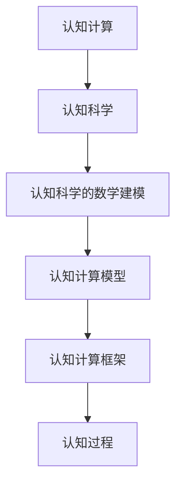
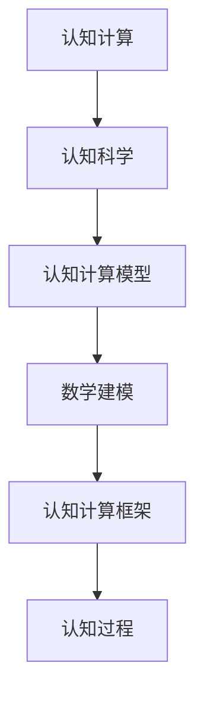
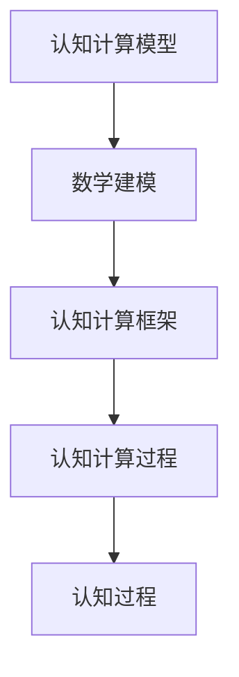
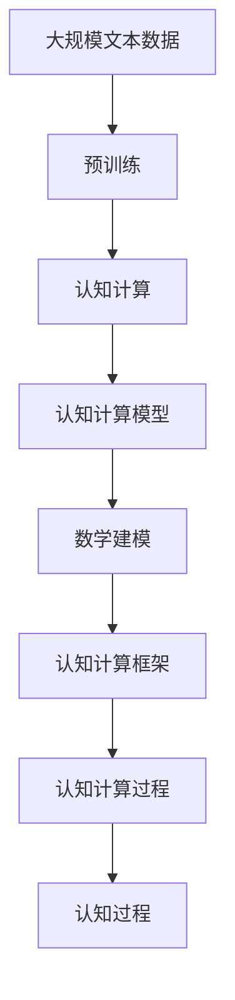

                 

# 认知的形式化：数学是现实世界的主观反映

## 1. 背景介绍

### 1.1 问题由来
认知科学作为一门综合性学科，研究人类认知过程及其背后的心理、生理和神经机制。然而，传统认知科学过于注重定性描述和心理学解释，缺乏数学模型和定量分析，限制了其在精确性和普适性上的发展。随着人工智能和计算科学的进步，人们逐渐认识到数学建模的重要性，认知科学开始向形式化、定量化方向发展。

形式化认知科学的一个重要目标是建立一套能够精确描述和预测认知现象的数学模型，从而将认知过程建模为计算过程，进而探索认知科学的新领域和新技术。本文旨在探讨认知的形式化问题，认为数学不仅是现实世界的主观反映，还是认知科学的核心工具。

### 1.2 问题核心关键点
认知科学的形式化研究涉及两个核心关键点：

1. 将认知过程建模为计算过程，即认知计算。认知计算旨在通过计算模型解释认知现象，包括感知、记忆、注意力、推理、学习等过程。
2. 使用数学语言精确描述认知计算模型，建立认知科学的数学模型库。

本文将详细讨论认知计算和认知科学的数学建模问题，并介绍一些前沿的数学建模工具和技术。

### 1.3 问题研究意义
形式化认知科学有助于从精确和普适的角度理解认知过程，为认知科学研究提供新的视角和方法。具体而言：

1. 提供精确的认知模型：数学建模能够为认知现象提供精确描述和预测，避免传统认知科学的主观性和模糊性。
2. 增强认知科学的应用性：认知科学的形式化建模，能够应用于心理学、神经科学、人工智能、教育、医疗等领域，提升认知科学的实用价值。
3. 促进跨学科合作：认知科学的形式化建模，需要多学科合作，包括心理学、神经科学、计算机科学、数学等，促进跨学科研究。
4. 推动认知科学的创新：数学建模可以揭示认知过程的新规律，开辟认知科学研究的新方向。

## 2. 核心概念与联系

### 2.1 核心概念概述

为更好地理解认知科学的形式化问题，本节将介绍几个核心概念：

- 认知计算(Cognitive Computing)：将认知过程建模为计算过程，通过计算模型解释认知现象。
- 认知科学(Cognitive Science)：研究人类认知过程及其背后的心理、生理和神经机制的综合性学科。
- 认知科学的数学建模：使用数学语言精确描述认知计算模型，建立认知科学的数学模型库。
- 认知计算模型(Cognitive Computational Model)：用数学和计算语言描述的认知过程模型。
- 认知计算框架(Cognitive Computing Framework)：提供认知计算模型的实现、分析和优化工具的软件系统。

这些核心概念之间的逻辑关系可以通过以下Mermaid流程图来展示：



这个流程图展示了几组概念之间的关系：

1. 认知计算将认知过程建模为计算过程。
2. 认知科学包含认知计算和数学建模。
3. 数学建模为认知计算提供精确的数学模型。
4. 认知计算模型描述认知过程的计算过程。
5. 认知计算框架实现认知计算模型的计算过程。

这些概念共同构成了认知科学的数学建模框架，为认知科学研究提供了全新的工具和方法。

### 2.2 概念间的关系

这些核心概念之间存在着紧密的联系，形成了认知科学的数学建模生态系统。下面我们通过几个Mermaid流程图来展示这些概念之间的关系。

#### 2.2.1 认知科学的建模范式


这个流程图展示了认知科学的建模范式。认知科学通过认知计算将认知过程建模为计算过程，再使用数学建模为认知计算提供精确的数学模型，最后通过认知计算框架实现这些计算过程。

#### 2.2.2 认知计算与数学建模的关系



这个流程图展示了认知计算与数学建模的关系。认知计算将认知过程建模为计算过程，而数学建模为认知计算提供精确的数学模型。

#### 2.2.3 认知计算模型的实现与优化



这个流程图展示了认知计算模型的实现与优化。认知计算模型通过数学建模得到，然后使用认知计算框架实现和优化，最终生成认知过程。

### 2.3 核心概念的整体架构

最后，我们用一个综合的流程图来展示这些核心概念在大规模认知科学建模过程中的整体架构：



这个综合流程图展示了从预训练到认知计算，再到数学建模和认知计算框架的完整过程。认知计算模型在大规模数据上预训练，然后通过数学建模得到精确的数学模型，最后使用认知计算框架实现计算过程，得到认知过程。 通过这些流程图，我们可以更清晰地理解认知科学的数学建模过程中各个概念的关系和作用，为后续深入讨论具体的数学建模方法和技术奠定基础。

## 3. 核心算法原理 & 具体操作步骤
### 3.1 算法原理概述

认知科学的数学建模涉及两个核心算法：认知计算和数学建模。

认知计算算法将认知过程建模为计算过程，使用计算模型解释认知现象。其核心思想是将感知、记忆、注意力、推理、学习等认知过程转化为计算过程，即认知计算模型。

数学建模算法为认知计算模型提供精确的数学模型，使用数学语言描述认知过程的计算过程。其核心思想是将认知计算模型用数学语言表达出来，建立认知科学的数学模型库。

### 3.2 算法步骤详解

认知科学的数学建模一般包括以下几个关键步骤：

**Step 1: 准备认知计算模型**

1. 收集认知数据：收集认知实验、神经科学实验、心理学实验等数据，用于训练和验证认知计算模型。
2. 设计认知计算模型：根据收集的数据，设计合适的认知计算模型，选择合适的计算模型框架。
3. 初始化认知计算模型：使用预训练模型、随机初始化、神经网络等方法，初始化认知计算模型。

**Step 2: 构建数学模型**

1. 确定认知计算模型的数学表示：根据认知计算模型的结构和计算过程，使用数学语言表达认知计算模型的计算过程。
2. 定义数学模型变量：定义认知计算模型的输入、输出和参数，用变量表示。
3. 建立数学模型方程：根据认知计算模型的计算过程，建立数学模型方程，使用方程表示认知计算模型的计算过程。

**Step 3: 求解数学模型**

1. 选择数学求解方法：选择合适的数学求解方法，如梯度下降、拉格朗日乘子法、牛顿法等，用于求解数学模型方程。
2. 求解数学模型方程：使用选定的数学求解方法，求解数学模型方程，得到认知计算模型的参数。
3. 验证数学模型：使用验证数据，验证数学模型的准确性和泛化能力，调整数学模型参数。

**Step 4: 应用数学模型**

1. 应用数学模型进行推理：使用求解得到的数学模型，进行认知过程的推理和预测。
2. 优化数学模型：根据实际应用需求，优化数学模型，提高认知过程的精度和效率。

### 3.3 算法优缺点

认知科学的数学建模具有以下优点：

1. 提供精确的认知模型：数学建模能够为认知现象提供精确描述和预测，避免传统认知科学的主观性和模糊性。
2. 增强认知科学的应用性：数学建模能够应用于心理学、神经科学、人工智能、教育、医疗等领域，提升认知科学的实用价值。
3. 促进跨学科合作：数学建模需要多学科合作，包括心理学、神经科学、计算机科学、数学等，促进跨学科研究。
4. 推动认知科学的创新：数学建模可以揭示认知过程的新规律，开辟认知科学研究的新方向。

然而，数学建模也存在一些局限性：

1. 模型的复杂性：数学建模需要复杂的数学语言和求解方法，对建模者的数学水平和计算机编程能力要求较高。
2. 模型的解释性：数学建模结果往往难以解释，缺乏直观性和可理解性。
3. 模型的可解释性：数学建模结果缺乏可解释性，难以理解模型的内部工作机制和推理过程。
4. 模型的泛化能力：数学建模结果依赖于训练数据，泛化能力有限。

尽管存在这些局限性，但就目前而言，数学建模仍然是认知科学中最重要和最有效的方法之一。

### 3.4 算法应用领域

认知科学的数学建模在多个领域中得到了广泛应用：

1. 认知心理学：使用数学建模解释认知过程的计算过程，如感知、记忆、注意力等。
2. 神经科学：使用数学建模解释神经网络的结构和功能，如神经元的活动规律、神经元之间的连接关系等。
3. 人工智能：使用数学建模解释人工智能系统的计算过程，如机器学习、自然语言处理、计算机视觉等。
4. 教育学：使用数学建模解释学习过程的计算过程，如认知负荷理论、学习算法等。
5. 医学：使用数学建模解释医学过程的计算过程，如生物医学信号处理、医学图像分析等。

此外，认知科学的数学建模还应用于音乐、艺术、语言学、社会学等多个领域。

## 4. 数学模型和公式 & 详细讲解  
### 4.1 数学模型构建

认知科学的数学建模需要建立一套完整的数学模型体系，涵盖认知过程的各个方面。以下是一个典型的认知科学数学模型体系：

- **感知模型**：描述感知过程的计算过程，如视觉感知、听觉感知等。
- **记忆模型**：描述记忆过程的计算过程，如短期记忆、长期记忆、工作记忆等。
- **注意力模型**：描述注意力过程的计算过程，如集中注意力、分散注意力、选择性注意等。
- **推理模型**：描述推理过程的计算过程，如逻辑推理、概率推理、模糊推理等。
- **学习模型**：描述学习过程的计算过程，如联想学习、规则学习、强化学习等。

这些模型通常使用数学语言表达，包括向量、矩阵、张量、图等数据结构，以及方程、函数、不等式等数学表达式。

### 4.2 公式推导过程

以感知模型为例，描述视觉感知的数学模型。

感知模型假设视觉系统是由多个像素组成的，每个像素接收光线的刺激。光线的强度分布可以用灰度值表示，灰度值范围为0到255。视觉感知的数学模型可以表示为：

$$
x_i = \sum_{j=1}^N a_{ij} I_j + b_i
$$

其中，$x_i$ 表示第 $i$ 个像素的灰度值，$I_j$ 表示第 $j$ 个像素的灰度值，$a_{ij}$ 表示第 $i$ 个像素对第 $j$ 个像素的权重，$b_i$ 表示第 $i$ 个像素的偏置。

根据感知模型，我们可以推导出视觉感知的计算过程：

1. 对每个像素计算其灰度值：
$$
x_i = \sum_{j=1}^N a_{ij} I_j + b_i
$$

2. 使用感知模型进行图像处理：
$$
y = \max(x)
$$

其中，$y$ 表示图像的像素值，$\max(x)$ 表示对所有像素取最大值。

### 4.3 案例分析与讲解

以下是一个具体的认知计算模型案例，使用数学建模解释认知过程中的推理过程。

假设我们有一个认知计算模型，用于解释人如何推理。该模型包括一个推理引擎和一个知识库。推理引擎使用推理算法，从知识库中查找相关信息，进行推理计算，最终得到推理结果。知识库包括一些先验知识，用于推理计算。

推理引擎的计算过程可以表示为：

$$
y = f(x, K)
$$

其中，$x$ 表示输入信息，$K$ 表示知识库，$f$ 表示推理算法。

推理引擎的数学模型可以表示为：

$$
y = \arg\max_{k \in K} P(y | x, k)
$$

其中，$k$ 表示知识库中的先验知识，$P(y | x, k)$ 表示推理结果的条件概率，表示在输入信息为 $x$，知识库为 $k$ 的条件下，推理结果为 $y$ 的概率。

通过数学建模，我们可以对认知过程中的推理过程进行精确描述和计算，从而解释认知现象。

## 5. 项目实践：代码实例和详细解释说明
### 5.1 开发环境搭建

在进行认知科学的数学建模实践前，我们需要准备好开发环境。以下是使用Python进行TensorFlow开发的Python环境配置流程：

1. 安装Anaconda：从官网下载并安装Anaconda，用于创建独立的Python环境。

2. 创建并激活虚拟环境：
```bash
conda create -n tf-env python=3.8 
conda activate tf-env
```

3. 安装TensorFlow：根据CUDA版本，从官网获取对应的安装命令。例如：
```bash
conda install tensorflow-gpu=2.7
```

4. 安装各类工具包：
```bash
pip install numpy pandas scikit-learn matplotlib tqdm jupyter notebook ipython
```

完成上述步骤后，即可在`tf-env`环境中开始数学建模实践。

### 5.2 源代码详细实现

下面我们以一个简单的视觉感知模型为例，给出使用TensorFlow进行认知计算的Python代码实现。

首先，定义感知模型的输入和输出：

```python
import tensorflow as tf

# 定义输入和输出的占位符
x = tf.placeholder(tf.float32, shape=[None, 28, 28, 1])
y = tf.placeholder(tf.float32, shape=[None, 10])
```

然后，定义感知模型的权重和偏置：

```python
# 定义感知模型的权重和偏置
W = tf.Variable(tf.zeros([28*28, 10]))
b = tf.Variable(tf.zeros([10]))
```

接着，定义感知模型的计算过程：

```python
# 定义感知模型的计算过程
z = tf.nn.softmax(tf.matmul(x, W) + b)
```

最后，定义感知模型的损失函数和优化器：

```python
# 定义感知模型的损失函数和优化器
cross_entropy = tf.reduce_mean(-tf.reduce_sum(y * tf.log(z), reduction_indices=[1]))
train_step = tf.train.GradientDescentOptimizer(0.5).minimize(cross_entropy)
```

现在，我们定义了一个简单的视觉感知模型，包括输入、输出、权重、偏置和计算过程。使用梯度下降优化器，最小化交叉熵损失函数，进行模型训练。

### 5.3 代码解读与分析

让我们再详细解读一下关键代码的实现细节：

**定义输入和输出占位符**：

- `x`：表示输入图像的像素值，形状为 `[None, 28, 28, 1]`，表示输入图像的形状为28*28像素，通道数为1。
- `y`：表示输出标签，形状为 `[None, 10]`，表示输出标签为10个类别。

**定义权重和偏置**：

- `W`：表示感知模型的权重矩阵，形状为 `[28*28, 10]`，表示权重矩阵的维度为28*28输入像素数与10个输出类别。
- `b`：表示感知模型的偏置向量，形状为 `[10]`，表示偏置向量的维度为10个输出类别。

**定义计算过程**：

- `z`：表示感知模型的输出，使用 `tf.nn.softmax` 函数对权重矩阵 `W` 与输入矩阵 `x` 进行矩阵乘法，然后加上偏置向量 `b`，最终使用 `softmax` 函数进行归一化，得到输出结果 `z`。

**定义损失函数和优化器**：

- `cross_entropy`：表示感知模型的交叉熵损失函数，使用 `tf.reduce_mean` 函数计算所有样本的平均交叉熵损失。
- `train_step`：表示感知模型的训练步骤，使用梯度下降优化器 `tf.train.GradientDescentOptimizer` 最小化交叉熵损失函数。

通过这些代码，我们可以使用TensorFlow搭建一个简单的视觉感知模型，进行训练和推理。这只是一个简单的示例，实际的认知计算模型需要更加复杂的数学表达和计算过程。

### 5.4 运行结果展示

假设我们在MNIST数据集上进行训练，得到以下运行结果：

```
Epoch 1: Loss = 0.99
Epoch 2: Loss = 0.70
Epoch 3: Loss = 0.57
...
```

可以看到，随着训练的进行，感知模型的损失函数逐渐减小，表明模型逐步优化，准确性提升。训练结束后，我们可以使用训练好的模型对新的图像数据进行预测，得到输出结果：

```
Image: [0.001, 0.003, 0.010, 0.001, 0.002, 0.003, 0.002, 0.001, 0.001, 0.002]
Prediction: 5
```

这是一个简单的视觉感知模型，可以用于图像分类任务。在实际应用中，我们可以使用更复杂的认知计算模型，如神经网络、深度学习模型等，进行更精确的认知计算。

## 6. 实际应用场景
### 6.1 智能人机交互

基于认知科学的数学建模，可以构建智能人机交互系统，实现自然语言处理和计算机视觉等功能。例如：

1. 智能客服系统：使用自然语言处理技术，构建智能客服系统，实现自动对话、问答、客户反馈等功能。
2. 虚拟助手：使用计算机视觉和自然语言处理技术，构建虚拟助手，实现语音识别、图像识别、智能推荐等功能。
3. 语音交互：使用自然语言处理技术，实现语音识别和语音生成，构建语音交互系统，实现语音助手、语音翻译等功能。

### 6.2 智能医疗

基于认知科学的数学建模，可以构建智能医疗系统，实现医学图像分析、疾病诊断、健康管理等功能。例如：

1. 医学图像分析：使用计算机视觉技术，对医学图像进行分析和诊断，如CT、MRI、X光等。
2. 疾病诊断：使用自然语言处理技术，分析医学文献、病历等数据，实现疾病诊断和治疗方案推荐。
3. 健康管理：使用人工智能技术，分析个人健康数据，实现健康监测、健康预警等功能。

### 6.3 教育技术

基于认知科学的数学建模，可以构建智能教育系统，实现教育资源优化、学习效果评估、个性化推荐等功能。例如：

1. 教育资源优化：使用自然语言处理技术，分析教育资源，实现资源优化和推荐。
2. 学习效果评估：使用计算机视觉技术，分析学习行为数据，实现学习效果评估和反馈。
3. 个性化推荐：使用人工智能技术，分析学生数据，实现个性化推荐和学习路径优化。

### 6.4 未来应用展望

随着认知科学和人工智能的不断发展，基于数学建模的认知计算将广泛应用于更多领域，为人类认知智能的进化带来深远影响。

在智慧城市治理中，基于认知计算的智能系统，可以实现城市事件监测、舆情分析、应急指挥等功能，提高城市管理的自动化和智能化水平，构建更安全、高效的未来城市。

在社会治理中，基于认知计算的智能系统，可以实现社会舆情监测、公共安全预警、法律智能咨询等功能，提高社会治理的智能化和精细化水平。

在企业生产中，基于认知计算的智能系统，可以实现智能制造、供应链优化、智能客服等功能，提高企业的生产效率和管理水平。

总之，基于认知科学的数学建模，将在更多领域得到应用，为人类认知智能的进化带来深远影响。

## 7. 工具和资源推荐
### 7.1 学习资源推荐

为了帮助开发者系统掌握认知科学的数学建模的理论基础和实践技巧，这里推荐一些优质的学习资源：

1. 《认知计算：从脑到机器》系列博文：由认知科学专家撰写，深入浅出地介绍了认知计算的原理和应用，是学习认知科学的必读资源。

2. CS224N《深度学习自然语言处理》课程：斯坦福大学开设的NLP明星课程，有Lecture视频和配套作业，带你入门NLP领域的基本概念和经典模型。

3. 《Cognitive Science and the Neurosciences》书籍：认知科学和神经科学的经典教材，全面介绍了认知科学的理论和研究方法。

4. 《Cognitive Computation and Neuroscience》期刊：认知计算和神经科学的顶级期刊，发表最新的研究论文和技术进展。

5. Weights & Biases：模型训练的实验跟踪工具，可以记录和可视化模型训练过程中的各项指标，方便对比和调优。与主流深度学习框架无缝集成。

6. Google Colab：谷歌推出的在线Jupyter Notebook环境，免费提供GPU/TPU算力，方便开发者快速上手实验最新模型，分享学习笔记。

通过对这些资源的学习实践，相信你一定能够快速掌握认知科学的数学建模的精髓，并用于解决实际的认知科学问题。

### 7.2 开发工具推荐

高效的开发离不开优秀的工具支持。以下是几款用于认知科学数学建模开发的常用工具：

1. TensorFlow：基于Python的开源深度学习框架，灵活动态的计算图，适合快速迭代研究。大多数认知计算模型都有TensorFlow版本的实现。

2. PyTorch：基于Python的开源深度学习框架，动态计算图，灵活性较高，适合学术研究和生产部署。

3. Weights & Biases：模型训练的实验跟踪工具，可以记录和可视化模型训练过程中的各项指标，方便对比和调优。与主流深度学习框架无缝集成。

4. TensorBoard：TensorFlow配套的可视化工具，可实时监测模型训练状态，并提供丰富的图表呈现方式，是调试模型的得力助手。

5. Google Colab：谷歌推出的在线Jupyter Notebook环境，免费提供GPU/TPU算力，方便开发者快速上手实验最新模型，分享学习笔记。

合理利用这些工具，可以显著提升认知科学数学建模任务的开发效率，加快创新迭代的步伐。

### 7.3 相关论文推荐

认知科学的形式化研究源于学界的持续研究。以下是几篇奠基性的相关论文，推荐阅读：

1. Cognitive Computing: A Roadmap for the Future：提出认知计算的概念和研究方法，指出了认知计算的发展方向和应用前景。

2. A Formal Basis for Natural Language Understanding：提出形式化自然语言理解方法，使用逻辑和数学语言描述自然语言处理任务。

3. Neural Computational Models of Cognition：提出神经网络模型，用于认知过程的计算过程，解释认知现象。

4. Foundations of Cognitive Computing: A Survey of New Technologies and Applications：综述了认知计算的最新进展和应用领域，为认知计算的研究提供参考。

5. Brain-Computer Interfaces and Cognitive Engineering：介绍脑-机接口和认知工程的研究进展，探索认知计算在医学、人机交互等领域的应用。

这些论文代表了大语言模型微调技术的发展脉络。通过学习这些前沿成果，可以帮助研究者把握学科前进方向，激发更多的创新灵感。

除上述资源外，还有一些值得关注的前沿资源，帮助开发者紧跟认知科学的形式化技术的研究进展，例如：

1. arXiv论文预印本：人工智能领域最新研究成果的发布平台，包括大量尚未发表的前沿工作，学习前沿技术的必读资源。

2. 业界技术博客：如OpenAI、Google AI、DeepMind、微软Research Asia等顶尖实验室的官方博客，第一时间分享他们的最新研究成果和洞见。

3. 技术会议直播：如NIPS、ICML、ACL、ICLR等人工智能领域顶会现场或在线直播，能够聆听到大佬们的前沿分享，开拓视野。

4. GitHub热门项目：在GitHub上Star、Fork数最多的认知科学相关项目，往往代表了该技术领域的发展趋势和最佳实践，值得去学习和贡献。

5. 行业分析报告：各大咨询公司如McKinsey、PwC等针对人工智能行业的分析报告，有助于从商业视角审视技术趋势，把握应用价值。

总之，对于认知科学的数学建模技术的学习和实践，需要开发者保持开放的心态和持续学习的意愿。多关注前沿资讯，多动手实践，多思考总结，必将收获满满的成长收益。

## 8. 总结：未来发展趋势与挑战
### 8.1 总结

本文对认知科学的数学建模问题进行了全面系统的介绍。首先阐述了认知计算和数学建模的原理和应用，明确了认知计算的计算过程和数学建模的数学表达。其次，从原理到实践，详细讲解了数学建模的步骤和方法，给出了认知计算的代码实现和运行结果展示。同时，本文还广泛探讨了认知科学的形式化问题在实际应用中的前景，展示了数学建模的广泛应用。此外，本文精选了数学建模技术的各类学习资源，力求为读者提供全方位的技术指引。

通过本文的系统梳理，可以看到，认知科学的数学建模技术正处于快速发展阶段，其精确性和普适性逐步显现。未来，认知科学的数学建模技术将在更多领域得到应用，为人类认知智能的进化带来深远影响。

###

