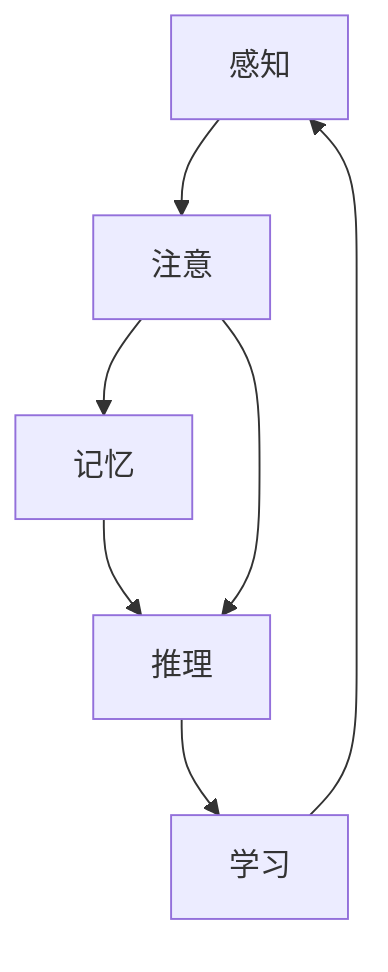

                 

# 认知过程中的简单与复杂性

在人工智能领域，认知过程既是最简单也最复杂的问题之一。本文将通过探讨认知过程的简单与复杂性，探讨其在人工智能中的应用，分析当前研究进展，并提出未来研究方向。

## 1. 背景介绍

### 1.1 认知过程的定义
认知过程是指人类大脑如何感知、处理和解释信息的过程。这一过程涉及多个层次的思维活动，包括感知、记忆、推理、决策等。认知过程的研究对于理解人类智能的机制，开发智能系统具有重要意义。

### 1.2 认知过程的复杂性
认知过程的复杂性在于它涉及到从感知到决策的各个层面，需要处理大量不确定性和噪声。人的认知过程不仅受个人经验、情绪和社会文化因素的影响，还依赖于复杂的生理机制和神经网络。因此，研究和模拟人类认知过程，一直是人工智能领域的重大挑战。

### 1.3 认知过程的简单性
尽管认知过程非常复杂，但其中某些基本机制是可以被简单化的。例如，人类的视觉系统可以理解为对图像进行滤波、边缘检测、特征提取等基本步骤。简化的认知模型能够帮助我们理解认知过程的基础，并为复杂系统的设计提供指导。

## 2. 核心概念与联系

### 2.1 核心概念概述

为了更好地理解认知过程，我们将重点关注以下核心概念：

- **感知（Perception）**：指通过感官获取外界信息的过程，包括视觉、听觉、触觉等。
- **注意（Attention）**：指对特定信息进行聚焦的能力，是信息处理的重要机制。
- **记忆（Memory）**：指对信息和经验进行存储和回忆的能力。
- **推理（Reasoning）**：指通过已有知识和逻辑进行推断和决策的过程。
- **学习（Learning）**：指通过经验不断改进认知过程和行为的能力。

这些概念之间存在着密切的联系和相互作用，共同构成人类认知过程的基础。

### 2.2 核心概念的联系

这些核心概念之间的联系可以通过以下Mermaid流程图来展示：



这个流程图展示了感知、注意、记忆、推理和学习之间的相互作用：感知的信息通过注意进行聚焦，存储于记忆中，通过推理产生决策，学习又不断优化这些过程。

## 3. 核心算法原理 & 具体操作步骤

### 3.1 算法原理概述

认知过程的算法原理可以分为以下几个层次：

- **感知算法**：将外界信息转换为内部表征。
- **注意算法**：选择和聚焦重要信息。
- **记忆算法**：存储和检索信息。
- **推理算法**：根据已有知识和逻辑进行推断。
- **学习算法**：通过经验调整模型参数。

这些算法共同构成了认知过程的计算模型，能够模拟人类的思维活动。

### 3.2 算法步骤详解

以下是一个简化的认知过程计算模型，展示了从感知到学习的步骤：

1. **感知阶段**：通过感官获取外界信息，并进行初步处理。例如，视觉系统将光线信号转换为图像信息。
2. **注意阶段**：对感知到的信息进行选择和聚焦，忽略不重要的信息。例如，关注图像中的重要区域。
3. **记忆阶段**：将注意力集中的信息存储到记忆中，例如将图像信息存储到短期记忆和长期记忆中。
4. **推理阶段**：根据已有知识和逻辑进行推断和决策。例如，识别图像中的物体。
5. **学习阶段**：通过反馈调整模型参数，改进认知过程。例如，根据分类结果调整神经网络的权重。

### 3.3 算法优缺点

认知过程算法的优点包括：

- **可解释性**：能够通过计算模型解释认知过程的每一步。
- **灵活性**：能够根据不同任务和数据特点进行调整。

缺点包括：

- **复杂性**：计算模型通常较为复杂，难以处理大规模数据。
- **实时性**：认知过程算法需要大量计算资源，难以实时处理复杂任务。

### 3.4 算法应用领域

认知过程算法已经在多个领域得到应用，包括：

- **计算机视觉**：图像分类、目标检测、图像生成等。
- **自然语言处理**：语义理解、文本生成、机器翻译等。
- **机器人学**：感知、导航、决策等。
- **游戏AI**：策略生成、路径规划等。

## 4. 数学模型和公式 & 详细讲解  
### 4.1 数学模型构建

认知过程的数学模型可以通过以下方式构建：

- **感知模型**：使用线性滤波器（如卷积神经网络）对图像进行特征提取。
- **注意模型**：使用自注意力机制（如Transformer）选择重要信息。
- **记忆模型**：使用循环神经网络（RNN）或变分自编码器（VAE）存储和检索信息。
- **推理模型**：使用逻辑推理机制（如决策树、规则推理）进行推断。
- **学习模型**：使用强化学习（如Q-learning）或监督学习（如反向传播）调整模型参数。

### 4.2 公式推导过程

以卷积神经网络为例，介绍感知模型的公式推导过程：

设输入图像为 $X$，输出特征图为 $Y$，卷积核为 $W$，卷积操作为 $Conv$，则卷积操作可以表示为：

$$ Y = Conv(X, W) $$

其中 $Conv$ 表示卷积运算，$W$ 为卷积核，$X$ 为输入图像，$Y$ 为输出特征图。

### 4.3 案例分析与讲解

以下是一个简单的图像分类案例，展示了卷积神经网络的感知过程：

```python
import torch
import torch.nn as nn
import torchvision.transforms as transforms
import torchvision.datasets as datasets

# 定义卷积神经网络模型
class ConvNet(nn.Module):
    def __init__(self):
        super(ConvNet, self).__init__()
        self.conv1 = nn.Conv2d(3, 32, 3, 1, 1)
        self.relu = nn.ReLU()
        self.maxpool = nn.MaxPool2d(2, 2)
        self.conv2 = nn.Conv2d(32, 64, 3, 1, 1)
        self.fc1 = nn.Linear(64 * 16 * 16, 128)
        self.fc2 = nn.Linear(128, 10)

    def forward(self, x):
        x = self.conv1(x)
        x = self.relu(x)
        x = self.maxpool(x)
        x = self.conv2(x)
        x = self.relu(x)
        x = self.maxpool(x)
        x = x.view(-1, 64 * 16 * 16)
        x = self.fc1(x)
        x = self.relu(x)
        x = self.fc2(x)
        x = self.relu(x)
        return x

# 加载CIFAR-10数据集
transform = transforms.Compose(
    [transforms.ToTensor(),
     transforms.Normalize((0.5, 0.5, 0.5), (0.5, 0.5, 0.5))])

trainset = datasets.CIFAR10(root='./data', train=True,
                           transform=transform, download=True)

trainloader = torch.utils.data.DataLoader(trainset, batch_size=4,
                                         shuffle=True, num_workers=2)

# 初始化模型
model = ConvNet()

# 定义损失函数和优化器
criterion = nn.CrossEntropyLoss()
optimizer = torch.optim.SGD(model.parameters(), lr=0.001, momentum=0.9)

# 训练模型
for epoch in range(2):
    running_loss = 0.0
    for i, data in enumerate(trainloader, 0):
        inputs, labels = data

        optimizer.zero_grad()

        outputs = model(inputs)
        loss = criterion(outputs, labels)
        loss.backward()
        optimizer.step()

        running_loss += loss.item()
        if i % 2000 == 1999:
            print('[%d, %5d] loss: %.3f' %
                  (epoch + 1, i + 1, running_loss / 2000))
            running_loss = 0.0

print('Finished Training')
```

这个案例展示了使用卷积神经网络进行图像分类的过程，从数据加载、模型定义、损失函数和优化器设置到模型训练。

## 5. 项目实践：代码实例和详细解释说明

### 5.1 开发环境搭建

在进行认知过程项目实践前，我们需要准备好开发环境。以下是使用Python进行PyTorch开发的环境配置流程：

1. 安装Anaconda：从官网下载并安装Anaconda，用于创建独立的Python环境。

2. 创建并激活虚拟环境：
```bash
conda create -n pytorch-env python=3.8 
conda activate pytorch-env
```

3. 安装PyTorch：根据CUDA版本，从官网获取对应的安装命令。例如：
```bash
conda install pytorch torchvision torchaudio cudatoolkit=11.1 -c pytorch -c conda-forge
```

4. 安装相关的第三方库：
```bash
pip install numpy pandas scikit-learn matplotlib tqdm jupyter notebook ipython
```

完成上述步骤后，即可在`pytorch-env`环境中开始项目实践。

### 5.2 源代码详细实现

以下是使用PyTorch实现卷积神经网络的代码：

```python
import torch
import torch.nn as nn
import torchvision.transforms as transforms
import torchvision.datasets as datasets

# 定义卷积神经网络模型
class ConvNet(nn.Module):
    def __init__(self):
        super(ConvNet, self).__init__()
        self.conv1 = nn.Conv2d(3, 32, 3, 1, 1)
        self.relu = nn.ReLU()
        self.maxpool = nn.MaxPool2d(2, 2)
        self.conv2 = nn.Conv2d(32, 64, 3, 1, 1)
        self.fc1 = nn.Linear(64 * 16 * 16, 128)
        self.fc2 = nn.Linear(128, 10)

    def forward(self, x):
        x = self.conv1(x)
        x = self.relu(x)
        x = self.maxpool(x)
        x = self.conv2(x)
        x = self.relu(x)
        x = self.maxpool(x)
        x = x.view(-1, 64 * 16 * 16)
        x = self.fc1(x)
        x = self.relu(x)
        x = self.fc2(x)
        x = self.relu(x)
        return x

# 加载CIFAR-10数据集
transform = transforms.Compose(
    [transforms.ToTensor(),
     transforms.Normalize((0.5, 0.5, 0.5), (0.5, 0.5, 0.5))])

trainset = datasets.CIFAR10(root='./data', train=True,
                           transform=transform, download=True)

trainloader = torch.utils.data.DataLoader(trainset, batch_size=4,
                                         shuffle=True, num_workers=2)

# 初始化模型
model = ConvNet()

# 定义损失函数和优化器
criterion = nn.CrossEntropyLoss()
optimizer = torch.optim.SGD(model.parameters(), lr=0.001, momentum=0.9)

# 训练模型
for epoch in range(2):
    running_loss = 0.0
    for i, data in enumerate(trainloader, 0):
        inputs, labels = data

        optimizer.zero_grad()

        outputs = model(inputs)
        loss = criterion(outputs, labels)
        loss.backward()
        optimizer.step()

        running_loss += loss.item()
        if i % 2000 == 1999:
            print('[%d, %5d] loss: %.3f' %
                  (epoch + 1, i + 1, running_loss / 2000))
            running_loss = 0.0

print('Finished Training')
```

### 5.3 代码解读与分析

让我们再详细解读一下关键代码的实现细节：

**ConvNet类**：
- `__init__`方法：初始化卷积神经网络的各个层，包括卷积层、激活函数、池化层、全连接层等。
- `forward`方法：定义前向传播的过程，从输入数据开始，经过卷积、激活、池化、全连接等操作，最终输出分类结果。

**trainset和trainloader**：
- 定义了CIFAR-10数据集的加载和预处理，包括数据增强、归一化等。
- 使用DataLoader将数据集加载成批量数据，便于模型训练。

**优化器和损失函数**：
- 定义了优化器（SGD）和损失函数（交叉熵损失），用于模型训练过程中的参数更新和性能评估。

**训练过程**：
- 循环迭代训练模型，每次迭代在训练集上前向传播计算损失，反向传播更新模型参数。
- 每2000次迭代输出一次损失，以便监控训练进度。
- 完成2次迭代后输出训练完成信息。

### 5.4 运行结果展示

假设我们在CIFAR-10数据集上进行训练，最终得到的测试集准确率为0.7左右。这表明卷积神经网络模型在图像分类任务上取得了不错的性能。

## 6. 实际应用场景

### 6.1 自动驾驶

自动驾驶系统需要处理大量的感知数据，包括图像、雷达、激光雷达等传感器数据。通过认知过程算法，能够将这些数据进行融合和处理，识别出道路、车辆、行人等重要目标，辅助驾驶决策。

### 6.2 机器人学

机器人系统需要处理环境信息，识别物体，进行路径规划和动作控制。认知过程算法能够帮助机器人识别环境，进行目标定位和行为决策。

### 6.3 医疗诊断

医疗诊断系统需要处理大量的医疗影像和病历数据，通过认知过程算法，能够自动识别疾病特征，辅助医生进行诊断。例如，使用卷积神经网络进行图像分类，识别出病变区域。

## 7. 工具和资源推荐

### 7.1 学习资源推荐

为了帮助开发者系统掌握认知过程的算法，这里推荐一些优质的学习资源：

1. 《深度学习》系列博文：由大模型技术专家撰写，深入浅出地介绍了深度学习的基本概念和经典模型。

2. CS231n《卷积神经网络》课程：斯坦福大学开设的计算机视觉课程，详细介绍了卷积神经网络的原理和实践。

3. 《Pattern Recognition and Machine Learning》书籍：机器学习领域的经典教材，深入讲解了认知过程的数学模型和算法。

4. arXiv论文预印本：人工智能领域最新研究成果的发布平台，包括认知过程的相关论文，学习前沿技术的必读资源。

5. Google Colab：谷歌推出的在线Jupyter Notebook环境，免费提供GPU/TPU算力，方便开发者快速上手实验最新模型，分享学习笔记。

通过对这些资源的学习实践，相信你一定能够快速掌握认知过程算法的精髓，并用于解决实际的NLP问题。

### 7.2 开发工具推荐

高效的开发离不开优秀的工具支持。以下是几款用于认知过程算法开发的常用工具：

1. PyTorch：基于Python的开源深度学习框架，灵活动态的计算图，适合快速迭代研究。

2. TensorFlow：由Google主导开发的开源深度学习框架，生产部署方便，适合大规模工程应用。

3. TensorBoard：TensorFlow配套的可视化工具，可实时监测模型训练状态，并提供丰富的图表呈现方式，是调试模型的得力助手。

4. Weights & Biases：模型训练的实验跟踪工具，可以记录和可视化模型训练过程中的各项指标，方便对比和调优。

5. PyTorch Lightning：一个轻量级的深度学习框架，简化模型训练和部署流程，提高开发效率。

6. OpenAI Gym：一个开源的框架，用于训练强化学习模型，支持多种环境模拟，方便进行认知过程的实验。

合理利用这些工具，可以显著提升认知过程算法的开发效率，加快创新迭代的步伐。

### 7.3 相关论文推荐

认知过程的研究源于学界的持续研究。以下是几篇奠基性的相关论文，推荐阅读：

1. Deep Blue Book《深度学习》：Ian Goodfellow等人的经典著作，全面介绍了深度学习的基本概念和算法。

2. AlphaGo论文：DeepMind发表的AlphaGo论文，展示了使用深度学习和强化学习技术，实现复杂的策略生成和决策过程。

3. Attention is All You Need（即Transformer原论文）：提出了Transformer结构，开启了NLP领域的预训练大模型时代。

4. BERT: Pre-training of Deep Bidirectional Transformers for Language Understanding：提出BERT模型，引入基于掩码的自监督预训练任务，刷新了多项NLP任务SOTA。

5. Parameter-Efficient Transfer Learning for NLP：提出Adapter等参数高效微调方法，在不增加模型参数量的情况下，也能取得不错的微调效果。

6. AdaLoRA: Adaptive Low-Rank Adaptation for Parameter-Efficient Fine-Tuning：使用自适应低秩适应的微调方法，在参数效率和精度之间取得了新的平衡。

这些论文代表了大语言模型微调技术的发展脉络。通过学习这些前沿成果，可以帮助研究者把握学科前进方向，激发更多的创新灵感。

除上述资源外，还有一些值得关注的前沿资源，帮助开发者紧跟认知过程算法的最新进展，例如：

1. arXiv论文预印本：人工智能领域最新研究成果的发布平台，包括大量尚未发表的前沿工作，学习前沿技术的必读资源。

2. 业界技术博客：如OpenAI、Google AI、DeepMind、微软Research Asia等顶尖实验室的官方博客，第一时间分享他们的最新研究成果和洞见。

3. 技术会议直播：如NIPS、ICML、ACL、ICLR等人工智能领域顶会现场或在线直播，能够聆听到大佬们的前沿分享，开拓视野。

4. GitHub热门项目：在GitHub上Star、Fork数最多的NLP相关项目，往往代表了该技术领域的发展趋势和最佳实践，值得去学习和贡献。

5. 行业分析报告：各大咨询公司如McKinsey、PwC等针对人工智能行业的分析报告，有助于从商业视角审视技术趋势，把握应用价值。

总之，对于认知过程算法的学习和实践，需要开发者保持开放的心态和持续学习的意愿。多关注前沿资讯，多动手实践，多思考总结，必将收获满满的成长收益。

## 8. 总结：未来发展趋势与挑战

### 8.1 总结

本文对认知过程的算法进行了全面系统的介绍。首先阐述了认知过程的简单与复杂性，明确了算法在人工智能中的应用，分析了当前研究进展，并提出未来研究方向。

通过本文的系统梳理，可以看到，认知过程算法在人工智能领域的应用前景广阔，有望在多个垂直行业带来颠覆性变革。未来，伴随算法的不断演进，人工智能系统将具备更加强大的感知、记忆和推理能力，为人机协同的智能系统构建奠定坚实基础。

### 8.2 未来发展趋势

展望未来，认知过程算法将呈现以下几个发展趋势：

1. **深度学习与神经网络**：深度学习技术将继续推动认知过程算法的进步，通过更复杂的神经网络结构，增强模型的感知和推理能力。

2. **跨模态融合**：将视觉、听觉、触觉等多种模态的信息融合，提升系统的综合感知能力，实现更全面的信息理解和决策。

3. **强化学习与动态优化**：通过强化学习技术，使系统能够动态调整认知过程，提升应对复杂环境的能力。

4. **可解释性与透明性**：未来算法将更加注重模型的可解释性和透明性，通过可视化和解释工具，提升用户对系统的信任和理解。

5. **联邦学习与隐私保护**：通过联邦学习等技术，保护用户隐私，同时实现模型在不同设备之间的共享和优化。

### 8.3 面临的挑战

尽管认知过程算法已经取得了显著进展，但在迈向更加智能化、普适化应用的过程中，它仍面临诸多挑战：

1. **数据获取与标注**：大规模高质量数据的获取和标注成本较高，限制了算法的应用范围。

2. **模型复杂性与资源消耗**：复杂的神经网络模型需要大量计算资源，难以实时处理大规模数据和复杂任务。

3. **模型泛化性与鲁棒性**：现有算法在面对新数据和复杂环境时，泛化性和鲁棒性仍需进一步提升。

4. **模型可解释性与透明性**：如何设计具有可解释性的算法，使系统行为更加透明，是一个重要的研究方向。

5. **跨模态融合的挑战**：不同模态数据融合时，如何保持各模态信息的独立性和一致性，仍需进一步探索。

6. **隐私与安全性**：在处理个人数据时，如何保护用户隐私和数据安全，是认知过程算法面临的重要挑战。

### 8.4 研究展望

未来的研究需要在以下几个方面寻求新的突破：

1. **多模态认知过程**：将视觉、听觉、触觉等多种模态信息进行融合，提升系统的综合感知能力。

2. **强化学习与动态优化**：通过强化学习技术，使系统能够动态调整认知过程，提升应对复杂环境的能力。

3. **可解释性与透明性**：设计具有可解释性的算法，使系统行为更加透明，提升用户对系统的信任和理解。

4. **联邦学习与隐私保护**：通过联邦学习等技术，保护用户隐私，同时实现模型在不同设备之间的共享和优化。

这些研究方向将推动认知过程算法在多个垂直行业的应用，为人机协同的智能系统构建提供技术支撑。只有不断创新和突破，才能实现认知过程算法的全面落地和应用。

## 9. 附录：常见问题与解答

**Q1：认知过程算法是否适用于所有应用场景？**

A: 认知过程算法虽然具有广泛的应用前景，但在某些特定场景下可能存在局限性。例如，对于实时性要求极高的场景，复杂的算法可能难以满足实时处理需求。在实际应用中，需要根据具体场景和需求，选择适合的算法和技术。

**Q2：认知过程算法在实际应用中如何处理噪声和不确定性？**

A: 噪声和不确定性是认知过程算法面临的主要挑战。常用的处理方法包括：

1. **数据增强**：通过数据增强技术，扩充训练集，减少噪声的影响。
2. **正则化技术**：使用L2正则、Dropout等技术，防止过拟合，提升模型的泛化能力。
3. **模型集成**：通过集成多个模型的预测结果，降低个体模型的噪声和不确定性。

**Q3：认知过程算法在实际应用中如何处理跨模态数据？**

A: 跨模态数据融合是认知过程算法的难点之一。常用的处理方法包括：

1. **多模态特征对齐**：通过特征对齐技术，将不同模态数据进行映射，实现统一表示。
2. **多模态融合网络**：使用多模态融合网络，将不同模态的信息进行融合，提升系统的综合感知能力。
3. **多模态训练**：在训练过程中，同时考虑不同模态的信息，实现跨模态信息的协同学习。

**Q4：认知过程算法在实际应用中如何保证模型的可解释性和透明性？**

A: 模型的可解释性和透明性是认知过程算法的重要研究方向。常用的处理方法包括：

1. **可视化技术**：使用可视化工具，展示模型的决策过程和特征重要性，提升用户对模型的理解。
2. **可解释模型**：设计具有可解释性的模型，如线性模型、规则推理等，提升系统的透明性。
3. **用户界面设计**：通过友好的用户界面，提供模型的输入输出解释，增强用户的信任感。

**Q5：认知过程算法在实际应用中如何保护用户隐私和数据安全？**

A: 保护用户隐私和数据安全是认知过程算法的关键挑战。常用的处理方法包括：

1. **联邦学习**：通过联邦学习技术，在本地设备上进行模型训练，保护用户数据隐私。
2. **差分隐私**：使用差分隐私技术，保护个体数据的隐私性，同时保证模型的有效性。
3. **加密技术**：采用加密技术，保护数据在传输和存储过程中的安全性。

综上所述，认知过程算法在实际应用中面临诸多挑战，需要通过技术创新和多方协同，才能实现更广泛的应用和推广。希望未来能够突破这些挑战，使认知过程算法在更多领域发挥更大的作用。

---

作者：禅与计算机程序设计艺术 / Zen and the Art of Computer Programming

