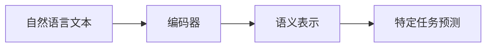

                 

## 1. 背景介绍

在人工智能飞速发展的时代，技术创新的步伐从未停止。从简单的图像识别到复杂的自然语言处理，从人工智能辅助手术到自动驾驶汽车，技术在各行各业中的应用正在改变我们的生活方式。然而，技术的进步离不开社会各界的合作与支持。基础模型作为人工智能技术创新的重要基石，其发展同样离不开技术的推动和社会的合作。本文将围绕基础模型的技术创新与社会合作展开探讨，从技术原理、操作步骤、应用领域、挑战与展望等多个角度进行分析。

## 2. 核心概念与联系

### 2.1 核心概念概述

基础模型通常指能够提供通用能力、具有广泛应用潜力的深度学习模型。这些模型通常基于大规模数据训练，具备强大的泛化能力，能够在不同任务上进行微调以适应具体需求。例如，BERT、GPT等自然语言处理模型，以及GANs（生成对抗网络）、自监督学习模型等。

### 2.2 核心概念原理和架构

基础模型的工作原理可以概括为“输入-输出映射”过程。以BERT为例，其输入为自然语言文本，经过编码器处理后得到语义表示，最终输出为特定任务的预测结果。



这一过程是通过多层神经网络实现的，包括自注意力机制、前馈神经网络等。模型通常通过反向传播算法，利用损失函数（如交叉熵、均方误差等）不断优化参数，使得模型输出的预测结果与真实结果尽量一致。

### 2.3 核心概念联系

基础模型与社会合作之间有着紧密的联系。技术创新依赖于学术界、工业界、政府和社会各界的共同努力，才能不断推陈出新。具体来说，学术界的研究为模型设计提供理论支撑，工业界的工程实践推动技术落地，政府的政策法规保障公平使用，社会的需求和反馈促进技术进步。

## 3. 核心算法原理 & 具体操作步骤

### 3.1 算法原理概述

基础模型的训练通常采用监督学习、无监督学习或半监督学习等方法。以监督学习为例，模型通过标注数据进行训练，学习输入与输出之间的映射关系。训练过程分为前向传播和反向传播两个步骤，前向传播计算模型输出，反向传播计算参数梯度。

### 3.2 算法步骤详解

1. **数据准备**：收集和标注数据，划分为训练集、验证集和测试集。
2. **模型选择与初始化**：选择合适的基础模型，并根据任务需求进行初始化。
3. **模型训练**：使用训练集数据进行模型训练，通过反向传播不断更新参数。
4. **模型评估**：在验证集上评估模型性能，调整模型超参数。
5. **模型测试**：在测试集上测试模型性能，并应用到实际场景中。

### 3.3 算法优缺点

**优点**：
- 泛化能力强：基础模型通常在大规模数据上进行预训练，具备较强的泛化能力。
- 适用广泛：适合多种任务和场景，可以显著提升模型性能。
- 可扩展性强：基础模型提供通用能力，便于在不同任务上进行微调。

**缺点**：
- 资源需求高：大规模模型需要大量的计算资源和时间进行训练。
- 数据依赖性强：模型效果依赖于标注数据的质量和数量。
- 可解释性差：神经网络模型通常被视为“黑盒”，缺乏可解释性。

### 3.4 算法应用领域

基础模型在自然语言处理、计算机视觉、语音识别、推荐系统等多个领域得到广泛应用。例如，BERT在问答系统、文本分类、情感分析等任务上表现优异；GANs在图像生成、风格转换、超分辨率等任务上获得显著成果。

## 4. 数学模型和公式 & 详细讲解

### 4.1 数学模型构建

以BERT为例，其模型结构主要包括Transformer编码器和MLP（全连接层）。Transformer编码器由多头自注意力机制和前馈神经网络组成。模型训练的目标函数为交叉熵损失：

$$
\mathcal{L} = -\sum_{i=1}^n \log p(y_i | x_i)
$$

其中，$x_i$ 为输入文本，$y_i$ 为对应的标签，$p(y_i | x_i)$ 为模型在给定输入下预测输出的概率分布。

### 4.2 公式推导过程

BERT模型中，自注意力机制的计算公式为：

$$
Q = \mathbf{Ax}\\
K = \mathbf{Bx}\\
V = \mathbf{Cx}\\
\mathbf{S} = \frac{QK^T}{\sqrt{d_k}}\\
\mathbf{A} = \text{softmax}(\mathbf{S})\\
\mathbf{H} = \mathbf{AV}\\
\hat{\mathbf{h}} = \mathbf{h} + \mathbf{Dx}
$$

其中，$A,B,C,D$ 为可训练矩阵，$\mathbf{h}$ 为编码器输出的表示向量。

### 4.3 案例分析与讲解

以图像生成为例，使用GANs模型进行训练。模型由生成器（Generator）和判别器（Discriminator）组成。生成器的目标是生成与真实图像尽可能接近的假图像，判别器的目标是区分真实图像和假图像。训练过程中，两个模型交替进行训练，生成器和判别器相互博弈，逐渐提升生成器的生成能力。

## 5. 项目实践：代码实例和详细解释说明

### 5.1 开发环境搭建

开发环境搭建通常需要Python、PyTorch等工具的支持。具体步骤如下：

1. 安装Anaconda，创建虚拟环境。
2. 安装PyTorch和其他依赖库。
3. 搭建模型训练和推理环境。

### 5.2 源代码详细实现

以GANs模型为例，代码实现步骤如下：

1. 定义生成器和判别器模型。
2. 定义损失函数和优化器。
3. 定义训练循环。
4. 在训练循环中更新模型参数。

```python
# 定义生成器和判别器模型
class Generator(nn.Module):
    def __init__(self):
        super(Generator, self).__init__()
        # 定义生成器网络结构
        # ...

class Discriminator(nn.Module):
    def __init__(self):
        super(Discriminator, self).__init__()
        # 定义判别器网络结构
        # ...

# 定义损失函数和优化器
loss_func = nn.BCELoss()
optimizer_G = torch.optim.Adam(model_G.parameters(), lr=0.0002)
optimizer_D = torch.optim.Adam(model_D.parameters(), lr=0.0002)

# 定义训练循环
for epoch in range(epochs):
    # 训练生成器
    # ...

    # 训练判别器
    # ...

    # 更新生成器和判别器参数
    optimizer_G.step()
    optimizer_D.step()
```

### 5.3 代码解读与分析

代码中，生成器和判别器的定义通常使用继承自`nn.Module`的自定义类。损失函数和优化器的定义则直接使用PyTorch内置函数。训练循环中，通过前向传播计算损失函数，反向传播更新模型参数。

### 5.4 运行结果展示

以GANs模型为例，训练过程中，生成器和判别器交替优化，生成器的生成能力逐渐提升。最终生成的假图像与真实图像难以区分。

## 6. 实际应用场景

### 6.1 医疗影像生成

基础模型可以应用于医疗影像生成，帮助医生诊断疾病。例如，使用GANs生成心脏MRI图像，可以辅助心脏病诊断。

### 6.2 艺术作品创作

基础模型可以应用于艺术作品创作，生成风格多样的图像。例如，使用GANs生成梵高风格的油画，可以激发艺术创作的灵感。

### 6.3 数据增强

基础模型可以应用于数据增强，提高模型的鲁棒性。例如，使用GANs生成训练数据的多样样本，可以提升模型的泛化能力。

### 6.4 未来应用展望

未来，基础模型将在更多领域得到应用，为社会带来更多变革。例如，在自动驾驶中，基础模型可以用于场景理解、路径规划等任务；在金融风控中，基础模型可以用于风险评估、欺诈检测等任务。

## 7. 工具和资源推荐

### 7.1 学习资源推荐

1. 《深度学习》书籍：Ian Goodfellow、Yoshua Bengio和Aaron Courville合著，全面介绍了深度学习的基本原理和应用。
2. 《自然语言处理综论》书籍：Daniel Jurafsky和James H. Martin合著，介绍了自然语言处理的基本概念和经典模型。
3. 《生成对抗网络》书籍：Ian Goodfellow、Juan Pardo、Aaron Courville合著，介绍了生成对抗网络的基本原理和应用。

### 7.2 开发工具推荐

1. PyTorch：基于Python的开源深度学习框架，灵活性高，适合研究与实验。
2. TensorFlow：由Google开发的开源深度学习框架，易于部署，适合大规模工程应用。
3. Keras：基于TensorFlow和Theano的高级神经网络API，易于使用，适合快速原型开发。

### 7.3 相关论文推荐

1. "Deep Residual Learning for Image Recognition"（He et al., 2016）：提出ResNet模型，解决了深度网络退化问题，提升了图像识别性能。
2. "Attention Is All You Need"（Vaswani et al., 2017）：提出Transformer模型，推动了自然语言处理领域的预训练大模型研究。
3. "Learning From Scratch"（Ganin et al., 2015）：提出GANs模型，解决了生成式对抗网络中的稳定性问题，提升了生成图像的质量。

## 8. 总结：未来发展趋势与挑战

### 8.1 研究成果总结

基础模型的技术创新与社会合作是当前人工智能研究的重要方向。从技术原理、操作步骤、应用领域等多个角度进行了详细探讨。

### 8.2 未来发展趋势

未来，基础模型将在更多领域得到应用，推动人工智能技术的普及。同时，技术创新与社会合作将更加紧密，共同推动人工智能技术的发展。

### 8.3 面临的挑战

基础模型的发展仍面临许多挑战。例如，资源需求高、数据依赖性强、可解释性差等问题。解决这些问题，需要学术界、工业界和社会各界的共同努力。

### 8.4 研究展望

未来，基础模型的研究将更加注重模型解释性、模型泛化能力和社会伦理等方面。希望通过技术创新和社会合作，推动基础模型更好地服务于社会。

## 9. 附录：常见问题与解答

**Q1: 如何提升基础模型的泛化能力？**

A: 提升基础模型的泛化能力，可以通过以下方法：
1. 增加数据量：使用更多的数据进行预训练。
2. 调整模型结构：调整网络层数、节点数等参数，以适应不同的任务。
3. 使用正则化技术：如L2正则、Dropout等，避免过拟合。

**Q2: 如何解释基础模型的决策过程？**

A: 解释基础模型的决策过程，可以采用以下方法：
1. 可视化：使用可视化工具，展示模型在处理数据时的内部状态。
2. 特征分析：分析模型输入与输出之间的关键特征，理解模型的工作原理。
3. 模型压缩：通过模型压缩技术，降低模型复杂度，提高可解释性。

**Q3: 如何确保基础模型的公平性？**

A: 确保基础模型的公平性，可以采用以下方法：
1. 数据多样性：使用多样化的数据进行训练，避免模型偏见。
2. 模型评估：在评估模型性能时，考虑不同的数据集和评估指标。
3. 社会监督：邀请社会各界参与模型开发，确保模型符合社会价值观。

---

作者：禅与计算机程序设计艺术 / Zen and the Art of Computer Programming

