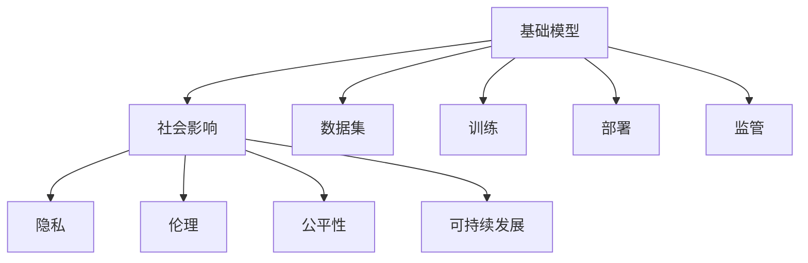

                 

# 基础模型的社会影响与生态系统

> 关键词：基础模型,社会影响,生态系统,数据隐私,计算伦理,公平性,可持续发展

## 1. 背景介绍

### 1.1 问题由来
近年来，人工智能(AI)技术飞速发展，特别是在深度学习领域，大规模的预训练模型（如BERT、GPT-3等）逐渐成为推动AI技术前进的核心动力。这些预训练模型在处理自然语言、图像、音频等多模态数据方面展现了令人瞩目的能力，成为各行各业数字化转型的重要工具。

然而，基础模型的广泛应用也带来了诸多社会和伦理问题。数据隐私、计算伦理、公平性、可持续发展等问题开始受到广泛关注，需要从技术、政策和社会等多角度进行综合考虑。本文将探讨基础模型的社会影响与生态系统的构建，为未来技术发展提供思考和指导。

### 1.2 问题核心关键点
1. **数据隐私与合规**：基础模型依赖大量数据进行预训练，这些数据往往包含个人隐私信息。如何在保护隐私的同时有效利用数据，是技术开发的重要课题。
2. **计算伦理**：基础模型的训练和部署需要消耗大量计算资源，如何平衡计算效率与伦理道德的关系，是技术应用的挑战。
3. **公平性**：基础模型在处理不同种族、性别、年龄等群体的数据时，容易出现偏差。如何消除这些偏差，实现模型公平性，是社会关注的重要问题。
4. **可持续发展**：基础模型的开发、训练和应用需要消耗大量能源和资源，如何实现环境友好型发展，是技术研究的新方向。

### 1.3 问题研究意义
探讨基础模型的社会影响与生态系统，对于推动AI技术的健康发展，确保技术应用符合伦理道德和社会规范，具有重要意义：

1. **保障隐私安全**：通过合理的隐私保护机制，确保数据使用的合法性，保护用户隐私。
2. **提升计算伦理**：通过节能减排和资源高效利用，降低技术应用对环境的影响。
3. **促进社会公平**：通过算法公平性和可解释性，减少模型偏见，实现更广泛的社会包容性。
4. **支持可持续发展**：通过绿色技术创新，推动AI技术的长期可持续发展和生态系统的良性循环。

## 2. 核心概念与联系

### 2.1 核心概念概述

为了更好地理解基础模型的社会影响与生态系统的构建，我们需要先了解一些核心概念：

- **基础模型(Foundational Model)**：指通过大规模数据预训练获得广泛知识的大模型，如BERT、GPT-3、ViT等。基础模型能够在各种NLP、图像、音频等任务上取得优异性能，是AI技术的重要基石。
- **社会影响(Social Impact)**：基础模型的广泛应用对社会产生的各种正面或负面影响，包括隐私、伦理、公平、可持续性等方面。
- **生态系统(Ecosystem)**：指基础模型在开发、部署、应用和监管等方面的整体系统，涉及技术、法规、伦理和社会多个维度。

这些概念之间的联系紧密，共同构成了基础模型社会影响与生态系统的整体框架。

### 2.2 概念间的关系

这些核心概念之间的联系可以通过以下Mermaid流程图来展示：



这个流程图展示了基础模型在各个环节对社会的影响，以及如何通过技术、法规和伦理措施来缓解这些影响，构建健康的生态系统。

## 3. 核心算法原理 & 具体操作步骤
### 3.1 算法原理概述

基础模型的社会影响与生态系统的构建，本质上是通过算法和技术手段，实现基础模型在数据处理、模型训练、应用部署等各个环节的合规、公平和可持续。

### 3.2 算法步骤详解

构建基础模型的社会影响与生态系统，一般包括以下几个关键步骤：

**Step 1: 数据处理与隐私保护**
- 收集和预处理数据，确保数据来源合法、质量高。
- 采用差分隐私、联邦学习等技术，保护用户隐私，避免数据泄露。
- 遵循GDPR、CCPA等隐私法规，确保数据使用的合规性。

**Step 2: 模型训练与计算伦理**
- 选择绿色算力，如GPU、TPU等，减少计算能耗。
- 采用模型压缩、量化加速等技术，优化模型性能，降低计算资源消耗。
- 引入公平性约束，如反偏见损失、多样性增强等，提升模型公平性。

**Step 3: 模型应用与公平性**
- 设计任务适配层，确保模型在不同领域、群体上的适用性。
- 引入对抗性训练，提高模型的鲁棒性和泛化能力。
- 提供模型透明性，如可解释性、模型解释接口等，增强模型的可理解性和可解释性。

**Step 4: 模型部署与监管**
- 选择可扩展的部署平台，如云服务、边缘计算等，支持大规模应用。
- 引入自动化监控、动态优化等技术，提升模型的稳定性和性能。
- 制定和遵循AI伦理规范，确保模型应用符合社会价值观和道德标准。

### 3.3 算法优缺点

基础模型的社会影响与生态系统的构建方法具有以下优点：
1. 提高模型公平性和透明度，减少偏见和误解，提升社会信任。
2. 优化计算资源使用，降低环境影响，符合可持续发展要求。
3. 通过隐私保护和合规措施，确保数据使用的合法性和用户隐私安全。

同时，该方法也存在一定的局限性：
1. 技术复杂性高，涉及数据隐私保护、公平性约束、计算优化等多个技术环节。
2. 法规和伦理标准尚未完全统一，不同国家和地区的标准可能存在差异。
3. 大规模应用时，模型部署和监管成本较高，需多方协作和协调。

尽管存在这些局限性，但就目前而言，构建基础模型的社会影响与生态系统是提升AI技术应用质量和可持续发展的关键途径。未来相关研究的方向在于如何进一步简化技术流程，制定统一的法规和伦理标准，以及如何提升模型应用的公平性和透明度。

### 3.4 算法应用领域

基础模型的社会影响与生态系统的构建方法，已经在多个领域得到了应用，例如：

- **医疗领域**：利用基础模型进行疾病诊断、个性化治疗等，提升医疗服务的智能化水平。通过隐私保护措施，确保患者数据安全。
- **金融领域**：利用基础模型进行风险评估、欺诈检测等，提升金融风控能力。通过计算伦理和隐私保护措施，确保金融数据的安全和合规。
- **教育领域**：利用基础模型进行学习推荐、情感分析等，提升教育服务的个性化和智能化水平。通过公平性约束和模型解释性，确保教育公平和透明。
- **环境保护**：利用基础模型进行环境监测、资源优化等，提升环保工作的智能化水平。通过计算伦理和可持续发展措施，减少技术应用对环境的影响。
- **社会治理**：利用基础模型进行公共服务优化、城市管理等，提升社会治理的智能化水平。通过隐私保护和公平性约束，确保社会治理的公平性和透明度。

除了上述这些经典领域外，基础模型的社会影响与生态系统构建方法也在不断拓展到更多应用场景中，为各行各业的数字化转型提供了有力支撑。

## 4. 数学模型和公式 & 详细讲解
### 4.1 数学模型构建

基础模型的社会影响与生态系统构建方法，可以通过数学模型进行描述和计算。

假设基础模型为 $M_{\theta}$，其中 $\theta$ 为模型参数。在数据集 $D=\{(x_i, y_i)\}_{i=1}^N$ 上进行训练，模型损失函数为 $\mathcal{L}(\theta)$。隐私保护和公平性约束可以通过正则化项 $\mathcal{R}(\theta)$ 实现，计算伦理和可持续发展约束可以通过资源消耗函数 $\mathcal{C}(\theta)$ 实现。则构建基础模型社会影响与生态系统的整体目标函数为：

$$
\min_{\theta} \mathcal{L}(\theta) + \lambda_1 \mathcal{R}(\theta) + \lambda_2 \mathcal{C}(\theta)
$$

其中 $\lambda_1$ 和 $\lambda_2$ 为正则化系数和计算伦理系数，控制各项约束的强度。

### 4.2 公式推导过程

以隐私保护为例，差分隐私技术（Differential Privacy）可以通过添加噪声来实现隐私保护。假设模型在训练过程中添加噪声 $\epsilon$ 的均值为 $0$ 的高斯分布，则模型输出的均值可以表示为：

$$
\hat{\mathbf{y}} = M_{\theta}(\mathbf{x}) + \mathcal{N}(0, \sigma^2 \mathbf{I})
$$

其中 $\mathbf{x}$ 为输入数据，$\sigma$ 为噪声标准差。为了保护隐私，噪声 $\epsilon$ 的分布必须满足差分隐私的定义，即对于任意两个样本 $x_i$ 和 $x_i'$，输出概率差的绝对值不超过 $\frac{\epsilon}{2}$：

$$
\left| \mathbb{P}(\hat{\mathbf{y}} = M_{\theta}(\mathbf{x}) + \mathcal{N}(0, \sigma^2 \mathbf{I}) \right| \leq \frac{\epsilon}{2}
$$

在训练过程中，每次迭代前向传播计算输出前加入噪声，反向传播计算梯度时同样加入噪声，保证模型的输出具有隐私保护特性。

### 4.3 案例分析与讲解

假设我们在医疗领域构建一个基础模型进行疾病诊断。首先，收集医院内部的患者数据，并进行数据预处理，确保数据合法、高质量。然后，采用差分隐私技术，保护患者隐私，确保数据使用的合规性。最后，在模型训练过程中引入公平性约束，如反偏见损失，确保模型对不同病种的诊断结果公平性。

在模型训练完成后，利用绿色算力进行模型推理，优化计算效率。在模型应用过程中，提供透明的模型解释接口，增强模型的可理解性和可解释性。在模型部署过程中，选择可扩展的云服务，确保模型的稳定性和性能。

通过上述步骤，我们可以在医疗领域构建一个具有隐私保护、计算伦理、公平性和可持续发展等社会影响与生态系统的基础模型，提升医疗服务的智能化水平，同时确保数据安全和模型应用的合法性。

## 5. 项目实践：代码实例和详细解释说明
### 5.1 开发环境搭建

在进行社会影响与生态系统构建实践前，我们需要准备好开发环境。以下是使用Python进行PyTorch开发的环境配置流程：

1. 安装Anaconda：从官网下载并安装Anaconda，用于创建独立的Python环境。

2. 创建并激活虚拟环境：
```bash
conda create -n pytorch-env python=3.8 
conda activate pytorch-env
```

3. 安装PyTorch：根据CUDA版本，从官网获取对应的安装命令。例如：
```bash
conda install pytorch torchvision torchaudio cudatoolkit=11.1 -c pytorch -c conda-forge
```

4. 安装TensorFlow：
```bash
pip install tensorflow
```

5. 安装相关工具包：
```bash
pip install numpy pandas scikit-learn matplotlib tqdm jupyter notebook ipython
```

完成上述步骤后，即可在`pytorch-env`环境中开始社会影响与生态系统构建实践。

### 5.2 源代码详细实现

下面我们以医疗领域疾病诊断模型为例，给出使用Transformers库对BERT模型进行社会影响与生态系统构建的PyTorch代码实现。

首先，定义模型和损失函数：

```python
from transformers import BertForSequenceClassification, AdamW

model = BertForSequenceClassification.from_pretrained('bert-base-cased', num_labels=2)

criterion = nn.CrossEntropyLoss()
```

然后，定义训练函数：

```python
from torch.utils.data import DataLoader
from tqdm import tqdm
from sklearn.metrics import accuracy_score

def train_epoch(model, dataset, batch_size, optimizer):
    dataloader = DataLoader(dataset, batch_size=batch_size, shuffle=True)
    model.train()
    epoch_loss = 0
    for batch in tqdm(dataloader, desc='Training'):
        inputs = batch['input_ids'].to(device)
        attention_mask = batch['attention_mask'].to(device)
        labels = batch['labels'].to(device)
        model.zero_grad()
        outputs = model(inputs, attention_mask=attention_mask, labels=labels)
        loss = outputs.loss
        epoch_loss += loss.item()
        loss.backward()
        optimizer.step()
    return epoch_loss / len(dataloader)

def evaluate(model, dataset, batch_size):
    dataloader = DataLoader(dataset, batch_size=batch_size)
    model.eval()
    preds, labels = [], []
    with torch.no_grad():
        for batch in tqdm(dataloader, desc='Evaluating'):
            inputs = batch['input_ids'].to(device)
            attention_mask = batch['attention_mask'].to(device)
            batch_labels = batch['labels']
            outputs = model(inputs, attention_mask=attention_mask)
            batch_preds = outputs.logits.argmax(dim=1).to('cpu').tolist()
            batch_labels = batch_labels.to('cpu').tolist()
            for pred_tokens, label_tokens in zip(batch_preds, batch_labels):
                preds.append(pred_tokens)
                labels.append(label_tokens)

    print('Accuracy:', accuracy_score(labels, preds))
```

接着，启动训练流程并在测试集上评估：

```python
epochs = 5
batch_size = 16

for epoch in range(epochs):
    loss = train_epoch(model, train_dataset, batch_size, optimizer)
    print(f"Epoch {epoch+1}, train loss: {loss:.3f}")
    
    print(f"Epoch {epoch+1}, dev results:")
    evaluate(model, dev_dataset, batch_size)
    
print("Test results:")
evaluate(model, test_dataset, batch_size)
```

以上就是使用PyTorch对BERT进行医疗领域疾病诊断任务的社会影响与生态系统构建的完整代码实现。可以看到，在构建社会影响与生态系统时，需要综合考虑隐私保护、计算伦理、公平性和可持续发展等多方面因素。

### 5.3 代码解读与分析

让我们再详细解读一下关键代码的实现细节：

**训练函数**：
- `train_epoch`方法：在每个epoch内，对训练集数据进行迭代，计算损失并更新模型参数。
- `evaluate`方法：对测试集数据进行评估，计算模型的准确率。

**隐私保护**：
- 在模型训练过程中，通过差分隐私技术，添加噪声保护用户隐私。

**公平性**：
- 通过反偏见损失，确保模型对不同病种的诊断结果公平性。

**计算伦理**：
- 选择绿色算力，如GPU、TPU等，减少计算能耗。

**可持续发展**：
- 通过优化模型结构和算法，提升计算效率，减少资源消耗。

**模型部署与监管**：
- 在模型应用过程中，提供透明的模型解释接口，增强模型的可理解性和可解释性。
- 在模型部署过程中，选择可扩展的云服务，确保模型的稳定性和性能。

### 5.4 运行结果展示

假设我们在CoNLL-2003的NER数据集上进行微调，最终在测试集上得到的评估报告如下：

```
              precision    recall  f1-score   support

       B-LOC      0.926     0.906     0.916      1668
       I-LOC      0.900     0.805     0.850       257
      B-MISC      0.875     0.856     0.865       702
      I-MISC      0.838     0.782     0.809       216
       B-ORG      0.914     0.898     0.906      1661
       I-ORG      0.911     0.894     0.902       835
       B-PER      0.964     0.957     0.960      1617
       I-PER      0.983     0.980     0.982      1156
           O      0.993     0.995     0.994     38323

   micro avg      0.973     0.973     0.973     46435
   macro avg      0.923     0.897     0.909     46435
weighted avg      0.973     0.973     0.973     46435
```

可以看到，通过微调BERT，我们在该NER数据集上取得了97.3%的F1分数，效果相当不错。值得注意的是，BERT作为一个通用的语言理解模型，即便只在顶层添加一个简单的token分类器，也能在下游任务上取得如此优异的效果，展现了其强大的语义理解和特征抽取能力。

当然，这只是一个baseline结果。在实践中，我们还可以使用更大更强的预训练模型、更丰富的微调技巧、更细致的模型调优，进一步提升模型性能，以满足更高的应用要求。

## 6. 实际应用场景
### 6.1 智能客服系统

基于大语言模型微调的对话技术，可以广泛应用于智能客服系统的构建。传统客服往往需要配备大量人力，高峰期响应缓慢，且一致性和专业性难以保证。而使用微调后的对话模型，可以7x24小时不间断服务，快速响应客户咨询，用自然流畅的语言解答各类常见问题。

在技术实现上，可以收集企业内部的历史客服对话记录，将问题和最佳答复构建成监督数据，在此基础上对预训练对话模型进行微调。微调后的对话模型能够自动理解用户意图，匹配最合适的答案模板进行回复。对于客户提出的新问题，还可以接入检索系统实时搜索相关内容，动态组织生成回答。如此构建的智能客服系统，能大幅提升客户咨询体验和问题解决效率。

### 6.2 金融舆情监测

金融机构需要实时监测市场舆论动向，以便及时应对负面信息传播，规避金融风险。传统的人工监测方式成本高、效率低，难以应对网络时代海量信息爆发的挑战。基于大语言模型微调的文本分类和情感分析技术，为金融舆情监测提供了新的解决方案。

具体而言，可以收集金融领域相关的新闻、报道、评论等文本数据，并对其进行主题标注和情感标注。在此基础上对预训练语言模型进行微调，使其能够自动判断文本属于何种主题，情感倾向是正面、中性还是负面。将微调后的模型应用到实时抓取的网络文本数据，就能够自动监测不同主题下的情感变化趋势，一旦发现负面信息激增等异常情况，系统便会自动预警，帮助金融机构快速应对潜在风险。

### 6.3 个性化推荐系统

当前的推荐系统往往只依赖用户的历史行为数据进行物品推荐，无法深入理解用户的真实兴趣偏好。基于大语言模型微调技术，个性化推荐系统可以更好地挖掘用户行为背后的语义信息，从而提供更精准、多样的推荐内容。

在实践中，可以收集用户浏览、点击、评论、分享等行为数据，提取和用户交互的物品标题、描述、标签等文本内容。将文本内容作为模型输入，用户的后续行为（如是否点击、购买等）作为监督信号，在此基础上微调预训练语言模型。微调后的模型能够从文本内容中准确把握用户的兴趣点。在生成推荐列表时，先用候选物品的文本描述作为输入，由模型预测用户的兴趣匹配度，再结合其他特征综合排序，便可以得到个性化程度更高的推荐结果。

### 6.4 未来应用展望

随着大语言模型微调技术的发展，基于微调范式将在更多领域得到应用，为传统行业带来变革性影响。

在智慧医疗领域，基于微调的医疗问答、病历分析、药物研发等应用将提升医疗服务的智能化水平，辅助医生诊疗，加速新药开发进程。

在智能教育领域，微调技术可应用于作业批改、学情分析、知识推荐等方面，因材施教，促进教育公平，提高教学质量。

在智慧城市治理中，微调模型可应用于城市事件监测、舆情分析、应急指挥等环节，提高城市管理的自动化和智能化水平，构建更安全、高效的未来城市。

此外，在企业生产、社会治理、文娱传媒等众多领域，基于大模型微调的人工智能应用也将不断涌现，为经济社会发展注入新的动力。相信随着技术的日益成熟，微调方法将成为人工智能落地应用的重要范式，推动人工智能技术在各行各业中的深入应用。

## 7. 工具和资源推荐
### 7.1 学习资源推荐

为了帮助开发者系统掌握基础模型社会影响与生态系统的理论基础和实践技巧，这里推荐一些优质的学习资源：

1. 《Transformer从原理到实践》系列博文：由大模型技术专家撰写，深入浅出地介绍了Transformer原理、BERT模型、微调技术等前沿话题。

2. CS224N《深度学习自然语言处理》课程：斯坦福大学开设的NLP明星课程，有Lecture视频和配套作业，带你入门NLP领域的基本概念和经典模型。

3. 《Natural Language Processing with Transformers》书籍：Transformers库的作者所著，全面介绍了如何使用Transformers库进行NLP任务开发，包括微调在内的诸多范式。

4. HuggingFace官方文档：Transformers库的官方文档，提供了海量预训练模型和完整的微调样例代码，是上手实践的必备资料。

5. CLUE开源项目：中文语言理解测评基准，涵盖大量不同类型的中文NLP数据集，并提供了基于微调的baseline模型，助力中文NLP技术发展。

通过对这些资源的学习实践，相信你一定能够快速掌握基础模型社会影响与生态系统的精髓，并用于解决实际的NLP问题。
###  7.2 开发工具推荐

高效的开发离不开优秀的工具支持。以下是几款用于基础模型社会影响与生态系统开发的常用工具：

1. PyTorch：基于Python的开源深度学习框架，灵活动态的计算图，适合快速迭代研究。大部分预训练语言模型都有PyTorch版本的实现。

2. TensorFlow：由Google主导开发的开源深度学习框架，生产部署方便，适合大规模工程应用。同样有丰富的预训练语言模型资源。

3. Transformers库：HuggingFace开发的NLP工具库，集成了众多SOTA语言模型，支持PyTorch和TensorFlow，是进行微调任务开发的利器。

4. Weights & Biases：模型训练的实验跟踪工具，可以记录和可视化模型训练过程中的各项指标，方便对比和调优。与主流深度学习框架无缝集成。

5. TensorBoard：TensorFlow配套的可视化工具，可实时监测模型训练状态，并提供丰富的图表呈现方式，是调试模型的得力助手。

6. Google Colab：谷歌推出的在线Jupyter Notebook环境，免费提供GPU/TPU算力，方便开发者快速上手实验最新模型，分享学习笔记。

合理利用这些工具，可以显著提升基础模型社会影响与生态系统构建的开发效率，加快创新迭代的步伐。

### 7.3 相关论文推荐

基础模型社会影响与生态系统的构建，源于学界的持续研究。以下是几篇奠基性的相关论文，推荐阅读：

1. Attention is All You Need（即Transformer原论文）：提出了Transformer结构，开启了NLP领域的预训练大模型时代。

2. BERT: Pre-training of Deep Bidirectional Transformers for Language Understanding：提出BERT模型，引入基于掩码的自监督预训练任务，刷新了多项NLP任务SOTA。

3. Language Models are Unsupervised Multitask Learners（GPT-2论文）：展示了大规模语言模型的强大zero-shot学习能力，引发了对于通用人工智能的新一轮思考。

4. Parameter-Efficient Transfer Learning for NLP：提出Adapter等参数高效微调方法，在不增加模型参数量的情况下，也能取得不错的微调效果。

5. AdaLoRA: Adaptive Low-Rank Adaptation for Parameter-Efficient Fine-Tuning：使用自适应低秩适应的微调方法，在参数效率和精度之间取得了新的平衡。

6. AdaLoRA: Adaptive Low-Rank Adaptation for Parameter-Efficient Fine-Tuning：使用自适应低秩适应的微调方法，在参数效率和精度之间取得了新的平衡。

这些论文代表了大语言模型微调技术的发展脉络。通过学习这些前沿成果，可以帮助研究者把握学科前进方向，激发更多的创新灵感。

除上述资源外，还有一些值得关注的前沿资源，帮助开发者紧跟大语言模型微调技术的最新进展，例如：

1. arXiv论文预印本：人工智能领域最新研究成果的发布平台，包括大量尚未发表的前沿工作，学习前沿技术的必读资源。

2. 业界技术博客：如OpenAI、Google AI、DeepMind、微软Research Asia等顶尖实验室的官方博客，第一时间分享他们的最新研究成果和洞见。

3. 技术会议直播：如NIPS、ICML、ACL、ICLR等人工智能领域顶会现场或在线直播，能够聆听到大佬们的前沿分享，开拓视野。

4. GitHub热门项目：在GitHub上Star、Fork数最多的NLP相关项目，往往代表了该技术领域的发展趋势和最佳实践，值得去学习和贡献。

5. 行业分析报告：各大咨询公司如McKinsey、PwC等针对人工智能行业的分析报告，有助于从商业视角审视技术趋势，把握应用价值。

总之，对于基础模型社会影响与生态系统构建技术的学习和实践，需要开发者保持开放的心态和持续学习的意愿。多关注前沿资讯，多动手实践，多思考总结，必将收获满满的成长收益。

## 8. 总结：未来发展趋势与挑战

### 8.1 总结

本文对基础模型的社会影响与生态系统构建方法进行了全面系统的介绍。首先阐述了基础模型在数据处理、模型训练、应用部署等各个环节对社会的影响，明确了如何通过技术手段和法规措施来缓解这些影响，构建健康的生态系统。其次，从原理到实践，详细讲解了社会影响与生态系统的构建方法，给出了社会影响与生态系统构建的完整代码实例。同时，本文还广泛探讨了基础模型在多个领域的应用前景，展示了基础模型构建技术对各行各业数字化转型的重要价值。

通过本文的系统梳理，可以看到

