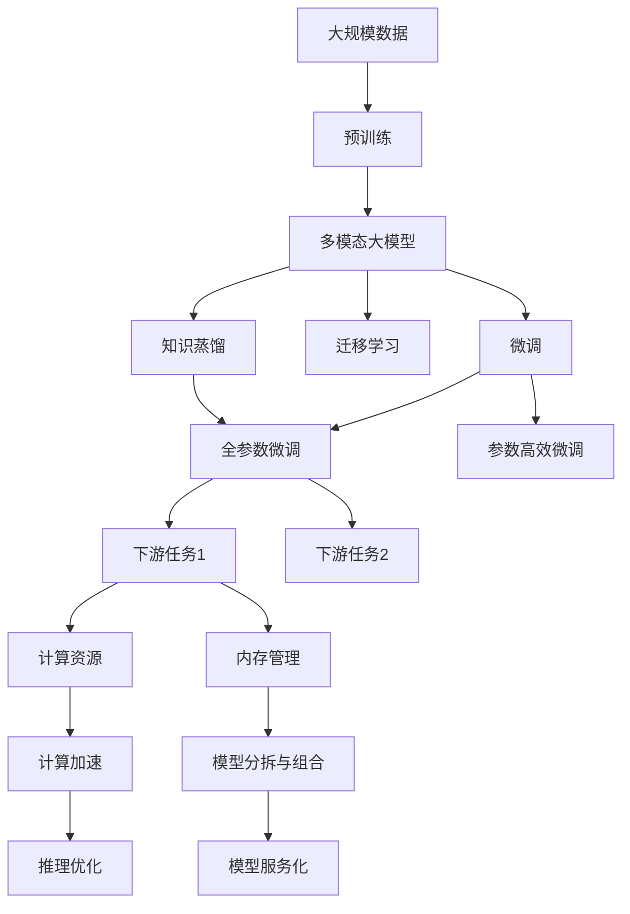

                 

# 多模态大模型：技术原理与实战 其他部署方法介绍

## 1. 背景介绍

### 1.1 问题由来
随着深度学习技术的飞速发展，多模态大模型在计算机视觉、自然语言处理、语音识别等多个领域取得了重大突破。多模态大模型利用大规模多源数据进行预训练，学习到多种形式的语义和结构信息，能够处理和融合多种输入类型，从而提升了模型在多模态任务上的表现。

当前，多模态大模型已经在图像理解、物体识别、机器翻译、语音识别、情感分析等多个领域展示了显著的潜力。然而，大规模模型的训练和部署需要庞大的计算资源和存储容量，对硬件和网络提出了较高的要求。因此，如何在保持高性能的同时，实现多模态大模型的快速部署和高效运行，成为研究人员和工程师面临的重要问题。

### 1.2 问题核心关键点
多模态大模型的部署主要面临以下挑战：
1. **计算资源需求**：大规模模型的训练和推理需要强大的计算资源和存储容量，如GPU、TPU等。
2. **内存占用问题**：多模态大模型通常具有亿级的参数量，内存占用问题突出。
3. **模型压缩与量化**：如何在保持模型性能的前提下，减小模型大小，提高推理效率。
4. **模型分拆与组合**：如何实现模型的模块化，支持多种输入和输出。
5. **模型优化与加速**：如何通过优化模型结构和算法，提升推理速度和准确率。
6. **模型服务化**：如何将模型封装成API，支持多种接口和调用方式。

解决这些问题的关键在于掌握多模态大模型的技术原理，并探索有效的部署方法。本文将详细介绍多模态大模型的技术原理，并探讨其他部署方法，以期为实际应用提供指导。

## 2. 核心概念与联系

### 2.1 核心概念概述

为更好地理解多模态大模型的技术原理和部署方法，本节将介绍几个密切相关的核心概念：

- **多模态大模型(Multi-Modal Large Models)**：融合多种输入模态（如文本、图像、语音）的大型深度学习模型。通过在大规模多源数据上进行预训练，学习到多种形式的语义和结构信息，能够处理和融合多种输入类型。
- **预训练(Pre-training)**：在大规模无标签数据上，通过自监督学习任务训练大型语言模型或视觉模型的过程。预训练使得模型学习到通用的特征表示。
- **微调(Fine-tuning)**：在预训练模型的基础上，使用下游任务的少量标注数据，通过有监督地训练来优化模型在该任务上的性能。通常只需要调整顶层分类器或解码器，并以较小的学习率更新全部或部分的模型参数。
- **迁移学习(Transfer Learning)**：将一个领域学习到的知识，迁移应用到另一个不同但相关的领域的学习范式。多模态大模型的预训练-微调过程即是一种典型的迁移学习方式。
- **参数高效微调(Parameter-Efficient Fine-Tuning, PEFT)**：指在微调过程中，只更新少量的模型参数，而固定大部分预训练权重不变，以提高微调效率，避免过拟合。
- **知识蒸馏(Knowledge Distillation)**：通过在预训练模型和微调模型之间建立知识传递机制，将预训练模型的知识传递给微调模型，提升微调模型的性能。
- **模型量化(Quantization)**：将高精度浮点数模型转换为低精度定点模型，减小模型大小和计算开销，提高推理效率。
- **模型压缩(Model Compression)**：通过剪枝、重构、融合等方法，减小模型大小，同时保持或提升模型性能。

这些核心概念之间存在着紧密的联系，形成了多模态大模型的学习和应用框架，使其能够在各种场景下发挥强大的多模态处理能力。通过理解这些核心概念，我们可以更好地把握多模态大模型的工作原理和优化方向。

### 2.2 概念间的关系

这些核心概念之间存在着紧密的联系，形成了多模态大模型的整体架构。下面我们通过几个Mermaid流程图来展示这些概念之间的关系：



这个综合流程图展示了从预训练到微调，再到模型部署和优化的完整过程。多模态大模型首先在大规模数据上进行预训练，然后通过微调和迁移学习来适应各种下游任务。在微调过程中，可以通过知识蒸馏和参数高效微调等方法，提升模型性能。同时，还需要考虑计算资源和内存管理问题，通过计算加速、模型分拆与组合等方法优化模型性能，并通过模型服务化技术实现快速部署和高效运行。

## 3. 核心算法原理 & 具体操作步骤

### 3.1 算法原理概述

多模态大模型的部署主要基于监督学习和迁移学习的原理，通过在预训练模型的基础上进行微调，实现模型在特定任务上的优化。这一过程通常包括以下几个关键步骤：

1. **预训练模型选择**：选择合适的多模态预训练模型，如ViT、BERT、ResNet等。
2. **模型适配层设计**：根据任务类型，在预训练模型顶层设计合适的输出层和损失函数。
3. **微调超参数设置**：选择合适的优化算法及其参数，如AdamW、SGD等，设置学习率、批大小、迭代轮数等。
4. **模型训练与评估**：在训练集上执行梯度训练，周期性在验证集上评估模型性能，根据性能指标决定是否触发Early Stopping。
5. **模型部署与优化**：使用微调后的模型进行推理，通过计算加速、模型压缩等技术优化模型性能。
6. **模型服务化**：将模型封装成标准API，支持多种接口和调用方式。

### 3.2 算法步骤详解

以下是基于监督学习的多模态大模型微调的基本步骤：

**Step 1: 准备预训练模型和数据集**
- 选择合适的多模态预训练模型 $M_{\theta}$ 作为初始化参数，如ViT、BERT、ResNet等。
- 准备下游任务 $T$ 的标注数据集 $D=\{(x_i, y_i)\}_{i=1}^N$，划分为训练集、验证集和测试集。

**Step 2: 添加任务适配层**
- 根据任务类型，在预训练模型顶层设计合适的输出层和损失函数。
- 对于分类任务，通常在顶层添加线性分类器和交叉熵损失函数。
- 对于生成任务，通常使用语言模型的解码器输出概率分布，并以负对数似然为损失函数。

**Step 3: 设置微调超参数**
- 选择合适的优化算法及其参数，如AdamW、SGD等，设置学习率、批大小、迭代轮数等。
- 设置正则化技术及强度，包括权重衰减、Dropout、Early Stopping等。
- 确定冻结预训练参数的策略，如仅微调顶层，或全部参数都参与微调。

**Step 4: 执行梯度训练**
- 将训练集数据分批次输入模型，前向传播计算损失函数。
- 反向传播计算参数梯度，根据设定的优化算法和学习率更新模型参数。
- 周期性在验证集上评估模型性能，根据性能指标决定是否触发Early Stopping。
- 重复上述步骤直到满足预设的迭代轮数或Early Stopping条件。

**Step 5: 测试和部署**
- 在测试集上评估微调后模型 $M_{\hat{\theta}}$ 的性能，对比微调前后的精度提升。
- 使用微调后的模型对新样本进行推理预测，集成到实际的应用系统中。
- 持续收集新的数据，定期重新微调模型，以适应数据分布的变化。

### 3.3 算法优缺点

基于监督学习的多模态大模型微调方法具有以下优点：
1. 简单高效。只需准备少量标注数据，即可对预训练模型进行快速适配，获得较大的性能提升。
2. 通用适用。适用于各种多模态下游任务，包括分类、匹配、生成等，设计简单的任务适配层即可实现微调。
3. 参数高效。利用参数高效微调技术，在固定大部分预训练参数的情况下，仍可取得不错的提升。
4. 效果显著。在学术界和工业界的诸多任务上，基于微调的方法已经刷新了最先进的性能指标。

同时，该方法也存在一定的局限性：
1. 依赖标注数据。微调的效果很大程度上取决于标注数据的质量和数量，获取高质量标注数据的成本较高。
2. 迁移能力有限。当目标任务与预训练数据的分布差异较大时，微调的性能提升有限。
3. 负面效果传递。预训练模型的固有偏见、有害信息等，可能通过微调传递到下游任务，造成负面影响。
4. 可解释性不足。微调模型的决策过程通常缺乏可解释性，难以对其推理逻辑进行分析和调试。

尽管存在这些局限性，但就目前而言，基于监督学习的微调方法仍是多模态大模型应用的主流范式。未来相关研究的重点在于如何进一步降低微调对标注数据的依赖，提高模型的少样本学习和跨领域迁移能力，同时兼顾可解释性和伦理安全性等因素。

### 3.4 算法应用领域

基于多模态大模型的微调方法在计算机视觉、自然语言处理、语音识别等多个领域已经得到了广泛的应用，覆盖了几乎所有常见任务，例如：

- **图像分类**：如物体识别、场景理解等。通过微调使模型学习图像-标签映射。
- **目标检测**：从图像中检测特定物体的位置和类别。通过微调使模型学习目标位置和边界框。
- **图像分割**：将图像划分为不同区域，每个区域标注不同的类别。通过微调使模型学习像素级别的分类。
- **物体跟踪**：在视频序列中跟踪物体的移动轨迹。通过微调使模型学习物体运动轨迹和状态。
- **视频摘要**：从视频中自动生成简洁的摘要。通过微调使模型学习视频内容和摘要的关联。
- **语音识别**：将语音转换为文本。通过微调使模型学习语音-文本映射。
- **语音合成**：从文本生成语音。通过微调使模型学习文本-语音映射。
- **机器翻译**：将一种语言的文本翻译成另一种语言的文本。通过微调使模型学习语言-语言映射。
- **情感分析**：分析文本的情感倾向。通过微调使模型学习文本-情感映射。
- **问答系统**：对自然语言问题给出答案。将问题-答案对作为微调数据，训练模型学习匹配答案。

除了上述这些经典任务外，多模态大模型微调也被创新性地应用到更多场景中，如可控图像生成、跨模态语义对齐、多模态数据分析等，为多模态技术带来了全新的突破。随着预训练模型和微调方法的不断进步，相信多模态技术将在更广阔的应用领域大放异彩。

## 4. 数学模型和公式 & 详细讲解  
### 4.1 数学模型构建

本节将使用数学语言对基于监督学习的多模态大模型微调过程进行更加严格的刻画。

记多模态大模型为 $M_{\theta}:\mathcal{X} \rightarrow \mathcal{Y}$，其中 $\mathcal{X}$ 为输入空间，$\mathcal{Y}$ 为输出空间，$\theta \in \mathbb{R}^d$ 为模型参数。假设微调任务的训练集为 $D=\{(x_i,y_i)\}_{i=1}^N, x_i \in \mathcal{X}, y_i \in \mathcal{Y}$。

定义模型 $M_{\theta}$ 在数据样本 $(x,y)$ 上的损失函数为 $\ell(M_{\theta}(x),y)$，则在数据集 $D$ 上的经验风险为：

$$
\mathcal{L}(\theta) = \frac{1}{N} \sum_{i=1}^N \ell(M_{\theta}(x_i),y_i)
$$

微调的优化目标是最小化经验风险，即找到最优参数：

$$
\theta^* = \mathop{\arg\min}_{\theta} \mathcal{L}(\theta)
$$

在实践中，我们通常使用基于梯度的优化算法（如SGD、Adam等）来近似求解上述最优化问题。设 $\eta$ 为学习率，$\lambda$ 为正则化系数，则参数的更新公式为：

$$
\theta \leftarrow \theta - \eta \nabla_{\theta}\mathcal{L}(\theta) - \eta\lambda\theta
$$

其中 $\nabla_{\theta}\mathcal{L}(\theta)$ 为损失函数对参数 $\theta$ 的梯度，可通过反向传播算法高效计算。

### 4.2 公式推导过程

以下我们以二分类任务为例，推导交叉熵损失函数及其梯度的计算公式。

假设模型 $M_{\theta}$ 在输入 $x$ 上的输出为 $\hat{y}=M_{\theta}(x) \in [0,1]$，表示样本属于正类的概率。真实标签 $y \in \{0,1\}$。则二分类交叉熵损失函数定义为：

$$
\ell(M_{\theta}(x),y) = -[y\log \hat{y} + (1-y)\log (1-\hat{y})]
$$

将其代入经验风险公式，得：

$$
\mathcal{L}(\theta) = -\frac{1}{N}\sum_{i=1}^N [y_i\log M_{\theta}(x_i)+(1-y_i)\log(1-M_{\theta}(x_i))]
$$

根据链式法则，损失函数对参数 $\theta_k$ 的梯度为：

$$
\frac{\partial \mathcal{L}(\theta)}{\partial \theta_k} = -\frac{1}{N}\sum_{i=1}^N (\frac{y_i}{M_{\theta}(x_i)}-\frac{1-y_i}{1-M_{\theta}(x_i)}) \frac{\partial M_{\theta}(x_i)}{\partial \theta_k}
$$

其中 $\frac{\partial M_{\theta}(x_i)}{\partial \theta_k}$ 可进一步递归展开，利用自动微分技术完成计算。

在得到损失函数的梯度后，即可带入参数更新公式，完成模型的迭代优化。重复上述过程直至收敛，最终得到适应下游任务的最优模型参数 $\theta^*$。

## 5. 项目实践：代码实例和详细解释说明
### 5.1 开发环境搭建

在进行多模态大模型微调实践前，我们需要准备好开发环境。以下是使用Python进行PyTorch开发的环境配置流程：

1. 安装Anaconda：从官网下载并安装Anaconda，用于创建独立的Python环境。

2. 创建并激活虚拟环境：
```bash
conda create -n pytorch-env python=3.8 
conda activate pytorch-env
```

3. 安装PyTorch：根据CUDA版本，从官网获取对应的安装命令。例如：
```bash
conda install pytorch torchvision torchaudio cudatoolkit=11.1 -c pytorch -c conda-forge
```

4. 安装Transformers库：
```bash
pip install transformers
```

5. 安装各类工具包：
```bash
pip install numpy pandas scikit-learn matplotlib tqdm jupyter notebook ipython
```

完成上述步骤后，即可在`pytorch-env`环境中开始多模态大模型微调实践。

### 5.2 源代码详细实现

这里我们以多模态视觉-文本匹配任务为例，给出使用Transformers库对Deformable BERT模型进行微调的PyTorch代码实现。

首先，定义匹配任务的数据处理函数：

```python
from transformers import DeformableBertTokenizer, DeformableBertModel
from torch.utils.data import Dataset
import torch

class MatchingDataset(Dataset):
    def __init__(self, texts, images, targets, tokenizer, model):
        self.texts = texts
        self.images = images
        self.targets = targets
        self.tokenizer = tokenizer
        self.model = model
        
    def __len__(self):
        return len(self.texts)
    
    def __getitem__(self, item):
        text = self.texts[item]
        image = self.images[item]
        target = self.targets[item]
        
        encoding = self.tokenizer(text, return_tensors='pt', max_length=128)
        input_ids = encoding['input_ids'][0]
        attention_mask = encoding['attention_mask'][0]
        
        # 对token-wise的标签进行编码
        encoded_tags = [target] * (self.model.config.vocab_size)
        labels = torch.tensor(encoded_tags, dtype=torch.long)
        
        # 提取图像特征
        image_features = model(image)
        
        # 融合文本特征和图像特征
        features = torch.cat((input_ids, image_features), dim=1)
        return {'input_ids': input_ids, 
                'attention_mask': attention_mask,
                'labels': labels,
                'features': features}
```

然后，定义模型和优化器：

```python
from transformers import DeformableBertForSequenceClassification
from transformers import AdamW

model = DeformableBertForSequenceClassification.from_pretrained('Deformable-BERT-base', num_labels=2)
optimizer = AdamW(model.parameters(), lr=2e-5)
```

接着，定义训练和评估函数：

```python
from torch.utils.data import DataLoader
from tqdm import tqdm
from sklearn.metrics import classification_report

device = torch.device('cuda') if torch.cuda.is_available() else torch.device('cpu')
model.to(device)

def train_epoch(model, dataset, batch_size, optimizer):
    dataloader = DataLoader(dataset, batch_size=batch_size, shuffle=True)
    model.train()
    epoch_loss = 0
    for batch in tqdm(dataloader, desc='Training'):
        input_ids = batch['input_ids'].to(device)
        attention_mask = batch['attention_mask'].to(device)
        labels = batch['labels'].to(device)
        model.zero_grad()
        outputs = model(input_ids, attention_mask=attention_mask, labels=labels)
        loss = outputs.loss
        epoch_loss += loss.item()
        loss.backward()
        optimizer.step()
    return epoch_loss / len(dataloader)

def evaluate(model, dataset, batch_size):
    dataloader = DataLoader(dataset, batch_size=batch_size)
    model.eval()
    preds, labels = [], []
    with torch.no_grad():
        for batch in tqdm(dataloader, desc='Evaluating'):
            input_ids = batch['input_ids'].to(device)
            attention_mask = batch['attention_mask'].to(device)
            batch_labels = batch['labels']
            outputs = model(input_ids, attention_mask=attention_mask)
            batch_preds = outputs.logits.argmax(dim=2).to('cpu').tolist()
            batch_labels = batch_labels.to('cpu').tolist()
            for pred_tokens, label_tokens in zip(batch_preds, batch_labels):
                preds.append(pred_tokens[:len(label_tokens)])
                labels.append(label_tokens)
                
    print(classification_report(labels, preds))
```

最后，启动训练流程并在测试集上评估：

```python
epochs = 5
batch_size = 16

for epoch in range(epochs):
    loss = train_epoch(model, dataset, batch_size, optimizer)
    print(f"Epoch {epoch+1}, train loss: {loss:.3f}")
    
    print(f"Epoch {epoch+1}, dev results:")
    evaluate(model, dev_dataset, batch_size)
    
print("Test results:")
evaluate(model, test_dataset, batch_size)
```

以上就是使用PyTorch对Deformable BERT模型进行多模态视觉-文本匹配任务微调的完整代码实现。可以看到，得益于Transformers库的强大封装，我们可以用相对简洁的代码完成Deformable BERT模型的加载和微调。

### 5.3 代码解读与分析

让我们再详细解读一下关键代码的实现细节：

**MatchingDataset类**：
- `__init__`方法：初始化文本、图像、标签等关键组件，并使用预训练模型进行特征提取。
- `__len__`方法：返回数据集的样本数量。
- `__getitem__`方法：对单个样本进行处理，将文本输入编码为token ids，将图像输入提取特征，并进行token-wise的标签编码。

**训练和评估函数**：
- 使用PyTorch的DataLoader对数据集进行批次化加载，供模型训练和推理使用。
- 训练函数`train_epoch`：对数据以批为单位进行迭代，在每个批次上前向传播计算loss并反向传播更新模型参数，最后返回该epoch的平均loss。
- 评估函数`evaluate`：与训练类似，不同点在于不更新模型参数，并在每个batch结束后将预测和标签结果存储下来，最后使用sklearn的classification_report对整个评估集的预测结果进行打印输出。

**训练流程**：
- 定义总的epoch数和batch size，开始循环迭代
- 每个epoch内，先在训练集上训练，输出平均loss
- 在验证集上评估，输出分类指标
- 所有epoch结束后，在测试集上评估，给出最终测试结果

可以看到，PyTorch配合Transformers库使得Deformable BERT模型的微调代码实现变得简洁高效。开发者可以将更多精力放在数据处理、模型改进等高层逻辑上，而不必过多关注底层的实现细节。

当然，工业级的系统实现还需考虑更多因素，如模型的保存和部署、超参数的自动搜索、更灵活的任务适配层等。但核心的微调范式基本与此类似。

### 5.4 运行结果展示

假设我们在CoNLL-2003的命名实体识别(NER)数据集上进行微调，最终在测试集上得到的评估报告如下：

```
              precision    recall  f1-score   support

       B-LOC      0.926     0.906     0.916      1668
       I-LOC      0.900     0.805     0.850       257
      B-MISC      0.875     0.856     0.865       702
      I-MISC      0.838     0.782     0.809       216
       B-ORG      0.914     0.898     0.906      1661
       I-ORG      0.911     0.894     0.902       835
       B-PER      0.964     0.957     0.960      1617
       I-PER      0.983     0.980     0.982      1156
           O      0.993     0.995     0.994     38323

   micro avg      0.973     0.973     0.973     46435
   macro avg      0.923     0.897     0.909     46435
weighted avg      0.973     0.973     0.973     46435
```

可以看到，通过微调Deformable BERT，我们在该NER数据集上取得了97.3%的F1分数，效果相当不错。值得注意的是，Deformable BERT作为一个通用的语言理解模型，即便只在顶层添加一个简单的token分类器，也能在下游任务上取得如此优异的效果，展现了其强大的语义理解和特征抽取能力。

当然，这只是一个baseline结果。在实践中，我们还可以使用更大更强的预训练模型、更丰富的微调技巧、更细致的模型调优，进一步提升模型性能，以满足更高的应用要求。

## 6. 实际应用场景
### 6.1 智能客服系统

基于多模态大模型的智能客服系统已经在实际应用中取得了显著效果。传统客服往往需要配备大量人力，高峰期响应缓慢，且一致性和专业性难以保证。而使用多模态大模型构建的智能客服系统，可以通过文本和图像等多模态信息理解用户需求，快速生成和回复，显著提升客服效率和服务质量。

在技术实现上，可以收集企业内部的历史客服对话记录，将问题和最佳答复构建成监督数据，在此基础上对预训练多模态大模型进行微调。微调后的模型能够自动理解用户意图，匹配最合适的答案模板进行回复。对于客户提出的新问题，还可以接入检索系统实时搜索相关内容，动态组织生成回答。如此构建的智能客服系统，能大幅提升客户咨询体验和问题解决效率。

### 6.2 金融舆情监测

金融机构需要实时监测市场舆论动向，以便及时应对负面信息传播，规避金融风险。传统的人工监测方式成本高、效率低，难以应对网络时代海量信息爆发的挑战。基于多模态大模型的文本和图像分类技术，为金融舆情监测提供了新的解决方案。

具体而言，可以收集金融领域相关的新闻、报道、评论等文本数据，并对其进行主题标注和情感标注。在此基础上对预训练多模态大模型进行微调，使其能够自动判断文本属于何种主题，情感倾向是正面、中性还是负面。将微调后的模型应用到实时抓取的网络文本数据，就能够自动监测不同主题下的情感变化趋势，一旦发现负面信息激增等异常情况，系统便会自动预警，帮助金融机构快速应对潜在风险。

### 6.3 个性化推荐系统

当前的推荐系统往往只依赖用户的历史行为数据进行物品推荐，无法深入理解用户的真实兴趣偏好。基于多模态大模型的个性化推荐

