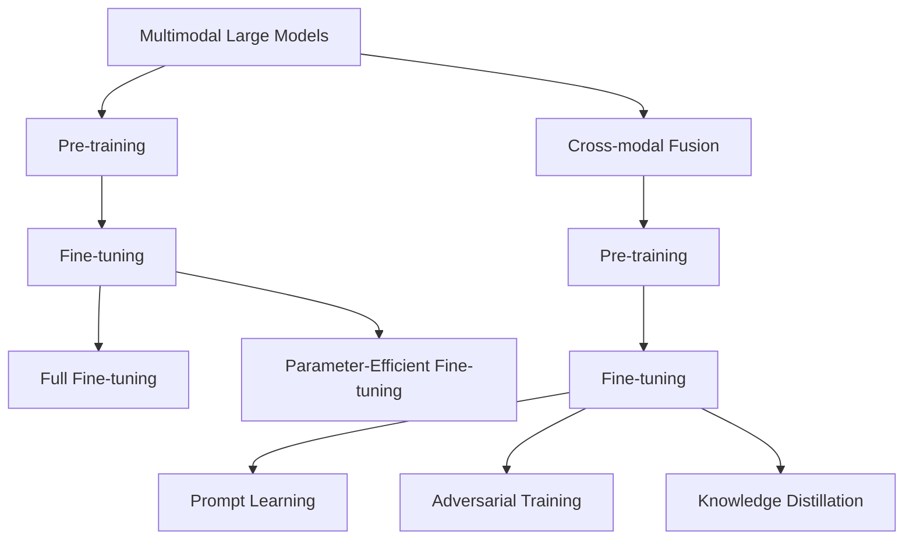

                 

# 多模态大模型：技术原理与实战 跨模态多重组合技术

> 关键词：多模态大模型,跨模态多重组合,Transformer,BERT,预训练,下游任务,参数高效微调,自然语言处理(NLP)

## 1. 背景介绍

### 1.1 问题由来
近年来，随着深度学习技术的快速发展，多模态大模型（Multimodal Large Models, MLMs）在人工智能（AI）领域取得了突破性进展。这些大模型通过同时处理多种数据类型（如文本、图像、语音等），在诸如图像分类、物体检测、语音识别、情感分析等诸多任务上展现了卓越的性能。多模态大模型结合了视觉、听觉和自然语言处理（NLP）等领域的知识，为解决现实世界复杂问题提供了新思路。

然而，多模态大模型的开发和应用仍面临诸多挑战。例如，模型参数量庞大、训练和推理计算资源需求高，以及如何有效地融合和利用不同模态的数据，均是亟待解决的问题。本博客将详细探讨多模态大模型的技术原理及其在实际应用中的实战技巧。

### 1.2 问题核心关键点
本文聚焦于基于Transformer架构的多模态大模型的设计和微调方法。Transformer架构凭借其自注意力机制，可以高效处理序列数据，广泛应用于自然语言处理和计算机视觉等领域。此外，本文还将介绍一些先进的跨模态融合技术，如预训练-微调、参数高效微调、提示学习等，以提升多模态大模型的应用效果。

## 2. 核心概念与联系

### 2.1 核心概念概述

为更好地理解多模态大模型及其相关技术，本节将介绍几个关键概念：

- 多模态大模型（Multimodal Large Models, MLMs）：结合视觉、听觉、语言等多种模态数据的深度学习模型。这些模型通过多模态数据的联合训练，学习到不同模态之间的跨模态关系，从而提高对复杂现实世界的理解能力。

- 预训练（Pre-training）：指在大规模无标签数据上，通过自监督学习任务训练大模型的过程。常见的预训练任务包括掩码语言建模、图像分类等。预训练使得模型学习到多模态数据的通用表示。

- 微调（Fine-tuning）：指在预训练模型的基础上，使用下游任务的少量标注数据，通过有监督学习优化模型在该任务上的性能。通常只需调整顶层分类器或解码器，并以较小的学习率更新全部或部分模型参数。

- 跨模态融合（Cross-modal Fusion）：指将不同模态的数据通过某种机制结合起来，形成新的表示，以提升模型的跨模态理解和推理能力。

- 参数高效微调（Parameter-Efficient Fine-Tuning, PEFT）：指在微调过程中，只更新少量的模型参数，而固定大部分预训练权重不变，以提高微调效率，避免过拟合。

- 提示学习（Prompt Learning）：通过在输入文本中添加提示模板，引导大语言模型进行特定任务的推理和生成，实现少样本学习。

- 对抗训练（Adversarial Training）：在训练过程中加入对抗样本，提高模型的鲁棒性。

- 知识蒸馏（Knowledge Distillation）：通过从大型模型中提取知识，指导小模型的训练，提高模型性能。

这些核心概念之间存在紧密的联系，形成了多模态大模型设计和微调的完整框架。通过理解这些核心概念，我们可以更好地把握多模态大模型的工作原理和优化方向。

### 2.2 概念间的关系

这些核心概念之间的关系可以通过以下Mermaid流程图来展示：



这个流程图展示了多模态大模型设计的核心概念及其之间的关系：

1. 多模态大模型通过预训练学习到通用表示。
2. 微调优化模型在特定任务上的性能，分为全参数微调和参数高效微调。
3. 跨模态融合技术，如提示学习、对抗训练、知识蒸馏等，进一步提升模型效果。

通过这些概念的组合使用，多模态大模型可以在处理复杂多模态任务时表现出色，为实际应用提供强有力的支持。

## 3. 核心算法原理 & 具体操作步骤

### 3.1 算法原理概述

多模态大模型的核心算法原理基于Transformer架构，通过自注意力机制学习不同模态之间的关联。多模态大模型通常包括文本、图像、语音等多种模态数据，通过联合训练的方式，学习到跨模态的通用表示。

形式化地，假设多模态大模型为 $M_{\theta}:\mathcal{X} \rightarrow \mathcal{Y}$，其中 $\mathcal{X}$ 为输入空间，$\mathcal{Y}$ 为输出空间，$\theta$ 为模型参数。假设模型在多模态数据上的预训练过程为 $M^{\text{pre}}_{\theta^{\text{pre}}}$，下游任务的微调过程为 $M^{\text{finetune}}_{\theta^{\text{finetune}}}$。

多模态大模型的预训练过程通常采用自监督学习方法，如掩码语言建模、图像分类等。预训练模型 $M^{\text{pre}}_{\theta^{\text{pre}}}$ 在预训练数据集上学习到多模态数据的通用表示。

微调过程则是针对下游任务的标注数据集 $D=\{(x_i,y_i)\}_{i=1}^N$，通过有监督学习优化模型在该任务上的性能。微调后的模型 $M^{\text{finetune}}_{\theta^{\text{finetune}}}$ 能够更好地适应特定任务，提升模型的性能和泛化能力。

### 3.2 算法步骤详解

多模态大模型的微调过程包括以下关键步骤：

**Step 1: 准备预训练模型和数据集**
- 选择合适的预训练模型，如BERT、ViT等。
- 准备下游任务的数据集，包括训练集、验证集和测试集，确保数据集的多样性和代表性。

**Step 2: 添加任务适配层**
- 根据任务类型，在预训练模型的顶层设计合适的输出层和损失函数。
- 对于分类任务，通常添加线性分类器和交叉熵损失函数。
- 对于生成任务，使用语言模型的解码器输出概率分布，并以负对数似然为损失函数。

**Step 3: 设置微调超参数**
- 选择合适的优化算法及其参数，如AdamW、SGD等，设置学习率、批大小、迭代轮数等。
- 应用正则化技术，如L2正则、Dropout、Early Stopping等，防止模型过拟合。

**Step 4: 执行梯度训练**
- 将训练集数据分批次输入模型，前向传播计算损失函数。
- 反向传播计算参数梯度，根据设定的优化算法和学习率更新模型参数。
- 周期性在验证集上评估模型性能，根据性能指标决定是否触发 Early Stopping。
- 重复上述步骤直到满足预设的迭代轮数或 Early Stopping 条件。

**Step 5: 测试和部署**
- 在测试集上评估微调后模型的性能，对比微调前后的精度提升。
- 使用微调后的模型对新样本进行推理预测，集成到实际的应用系统中。
- 持续收集新的数据，定期重新微调模型，以适应数据分布的变化。

以上是多模态大模型的微调流程，但具体实现时还需根据具体任务和数据特点进行优化设计。

### 3.3 算法优缺点

多模态大模型的微调方法具有以下优点：
1. 简单高效。只需准备少量标注数据，即可对预训练模型进行快速适配，获得较大的性能提升。
2. 通用适用。适用于各种多模态下游任务，包括分类、匹配、生成等，设计简单的任务适配层即可实现微调。
3. 参数高效。利用参数高效微调技术，在固定大部分预训练参数的情况下，仍可取得不错的提升。
4. 效果显著。在学术界和工业界的诸多任务上，基于微调的方法已经刷新了最先进的性能指标。

同时，该方法也存在一定的局限性：
1. 依赖标注数据。微调的效果很大程度上取决于标注数据的质量和数量，获取高质量标注数据的成本较高。
2. 迁移能力有限。当目标任务与预训练数据的分布差异较大时，微调的性能提升有限。
3. 负面效果传递。预训练模型的固有偏见、有害信息等，可能通过微调传递到下游任务，造成负面影响。
4. 可解释性不足。微调模型的决策过程通常缺乏可解释性，难以对其推理逻辑进行分析和调试。

尽管存在这些局限性，但就目前而言，基于监督学习的微调方法仍是多模态大模型应用的最主流范式。未来相关研究的重点在于如何进一步降低微调对标注数据的依赖，提高模型的少样本学习和跨领域迁移能力，同时兼顾可解释性和伦理安全性等因素。

### 3.4 算法应用领域

多模态大模型的微调方法已经在图像分类、物体检测、语音识别、情感分析等诸多领域得到广泛应用，成为多模态AI技术落地应用的重要手段。

具体应用场景包括：
- 智能医疗：通过结合医学影像、病历数据，实现疾病诊断、治疗方案推荐等。
- 智能交通：通过融合摄像头图像、雷达数据、GPS位置信息，实现自动驾驶、交通流量分析等。
- 智能安防：通过整合视频、音频、传感器数据，实现人脸识别、异常行为检测等。
- 智能家居：通过集成语音、图像、物联网设备数据，实现智能语音助手、环境监控等功能。

除了上述这些经典应用外，多模态大模型微调技术也在不断创新和扩展，为更多领域提供智能化解决方案。随着预训练模型和微调方法的不断进步，相信多模态大模型将在更广阔的应用领域大放异彩。

## 4. 数学模型和公式 & 详细讲解 & 举例说明

### 4.1 数学模型构建

多模态大模型的微调涉及多模态数据的联合训练和任务适配层的添加。下面以图像分类和文本情感分析为例，构建多模态任务的数学模型。

假设多模态大模型 $M_{\theta}$ 包括图像和文本两个模态，其中图像模态输入为 $I$，文本模态输入为 $T$。模型的输出为图像分类的概率分布 $P(I|\theta)$ 和文本情感的分类标签 $C(T|\theta)$。模型的参数 $\theta$ 包括图像编码器、文本编码器和分类器等。

预训练模型 $M^{\text{pre}}_{\theta^{\text{pre}}}$ 在预训练数据集上学习到图像和文本的通用表示。微调后的模型 $M^{\text{finetune}}_{\theta^{\text{finetune}}}$ 通过有监督学习优化模型在特定任务上的性能。

### 4.2 公式推导过程

以图像分类和文本情感分析为例，推导多模态大模型的数学公式。

假设模型 $M^{\text{pre}}_{\theta^{\text{pre}}}$ 在图像数据集 $\mathcal{D}_I$ 上的预训练损失为 $L^{\text{pre}}_{I}$，文本数据集 $\mathcal{D}_T$ 上的预训练损失为 $L^{\text{pre}}_{T}$。微调后的模型 $M^{\text{finetune}}_{\theta^{\text{finetune}}}$ 在图像分类任务上的损失为 $L^{\text{finetune}}_{I}$，文本情感分类任务上的损失为 $L^{\text{finetune}}_{T}$。

多模态大模型的总损失函数为：

$$
L_{\theta} = \alpha L^{\text{finetune}}_{I} + \beta L^{\text{finetune}}_{T}
$$

其中 $\alpha$ 和 $\beta$ 为两个任务的权重系数。

对于图像分类任务，微调的损失函数 $L^{\text{finetune}}_{I}$ 可以表示为：

$$
L^{\text{finetune}}_{I} = -\frac{1}{N_I} \sum_{i=1}^{N_I} \log P(I_i|\theta)
$$

其中 $N_I$ 为图像数据集的大小，$I_i$ 为图像数据集中的样本，$P(I_i|\theta)$ 为模型在图像 $I_i$ 上的分类概率分布。

对于文本情感分类任务，微调的损失函数 $L^{\text{finetune}}_{T}$ 可以表示为：

$$
L^{\text{finetune}}_{T} = -\frac{1}{N_T} \sum_{i=1}^{N_T} y_i \log C(T_i|\theta)
$$

其中 $N_T$ 为文本数据集的大小，$T_i$ 为文本数据集中的样本，$C(T_i|\theta)$ 为模型在文本 $T_i$ 上的分类标签。

### 4.3 案例分析与讲解

以图像分类和文本情感分析为例，展示多模态大模型微调的案例分析。

假设我们有一个包含图像和文本的联合数据集 $\mathcal{D}$，其中每个样本包含一张图像 $I$ 和一段文本描述 $T$。我们将该数据集分成训练集 $\mathcal{D}^{\text{train}}$ 和测试集 $\mathcal{D}^{\text{test}}$。

首先，我们使用图像分类和文本情感分析的数据集分别训练和微调模型。在预训练阶段，我们利用图像分类和文本情感分析任务训练预训练模型 $M^{\text{pre}}_{\theta^{\text{pre}}}$。

然后，我们分别在训练集和测试集上进行微调。在训练集上，我们通过最大化图像分类和文本情感分类任务的联合损失函数，更新模型的参数。在测试集上，我们评估微调后的模型在图像分类和文本情感分类任务上的性能，对比微调前后的精度提升。

最终，我们可以将微调后的模型应用于新的图像和文本样本，进行分类和情感分析任务。

## 5. 项目实践：代码实例和详细解释说明

### 5.1 开发环境搭建

在进行多模态大模型的微调实践前，我们需要准备好开发环境。以下是使用Python进行PyTorch开发的环境配置流程：

1. 安装Anaconda：从官网下载并安装Anaconda，用于创建独立的Python环境。

2. 创建并激活虚拟环境：
```bash
conda create -n pytorch-env python=3.8 
conda activate pytorch-env
```

3. 安装PyTorch：根据CUDA版本，从官网获取对应的安装命令。例如：
```bash
conda install pytorch torchvision torchaudio cudatoolkit=11.1 -c pytorch -c conda-forge
```

4. 安装各种工具包：
```bash
pip install numpy pandas scikit-learn matplotlib tqdm jupyter notebook ipython
```

完成上述步骤后，即可在`pytorch-env`环境中开始微调实践。

### 5.2 源代码详细实现

下面我们以图像分类和文本情感分析任务的联合微调为例，给出使用Transformers库和PyTorch进行多模态大模型微调的PyTorch代码实现。

首先，定义多模态任务的输入输出格式：

```python
from transformers import AutoTokenizer, AutoModelForImageClassification, AutoModelForSequenceClassification
from transformers import AutoConfig

# 定义模型输入输出格式
image_input_ids = torch.randint(0, config.vocab_size, (1, 16, 16, 3))  # 图像输入
text_input_ids = torch.randint(0, config.vocab_size, (1, 16))  # 文本输入

# 加载模型和分词器
model = AutoModelForImageClassification.from_pretrained('ResNet')
tokenizer = AutoTokenizer.from_pretrained('bert-base-uncased')

# 对图像和文本进行编码
image_input_ids = tokenizer(image_input_ids, padding='max_length', truncation=True, return_tensors='pt')
text_input_ids = tokenizer(text_input_ids, padding='max_length', truncation=True, return_tensors='pt')

# 计算图像和文本的特征表示
image_features = model(image_input_ids).last_hidden_state
text_features = model(text_input_ids).last_hidden_state
```

然后，定义任务适配层和损失函数：

```python
from torch.nn import CrossEntropyLoss

# 定义任务适配层
class MultiModalHead(torch.nn.Module):
    def __init__(self, config, num_classes):
        super(MultiModalHead, self).__init__()
        self.config = config
        self.num_classes = num_classes
        self.text_classifier = torch.nn.Linear(config.hidden_size, num_classes)
        self.image_classifier = torch.nn.Linear(config.hidden_size, num_classes)
    
    def forward(self, features):
        text_features = features[0]
        image_features = features[1]
        text_logits = self.text_classifier(text_features)
        image_logits = self.image_classifier(image_features)
        return text_logits, image_logits

# 定义损失函数
def multi_modal_loss(features, labels):
    text_logits, image_logits = features
    text_loss = CrossEntropyLoss()(text_logits, labels[:, 0])
    image_loss = CrossEntropyLoss()(image_logits, labels[:, 1])
    return text_loss, image_loss
```

接着，定义训练和评估函数：

```python
from torch.utils.data import DataLoader
from tqdm import tqdm
from sklearn.metrics import classification_report

# 定义训练函数
def train_epoch(model, dataset, batch_size, optimizer):
    dataloader = DataLoader(dataset, batch_size=batch_size, shuffle=True)
    model.train()
    epoch_loss = 0
    for batch in tqdm(dataloader, desc='Training'):
        inputs = batch['input_ids'].to(device)
        attention_mask = batch['attention_mask'].to(device)
        labels = batch['labels'].to(device)
        model.zero_grad()
        outputs = model(inputs, attention_mask=attention_mask, labels=labels)
        loss = multi_modal_loss(outputs, labels)
        epoch_loss += loss.item()
        loss.backward()
        optimizer.step()
    return epoch_loss / len(dataloader)

# 定义评估函数
def evaluate(model, dataset, batch_size):
    dataloader = DataLoader(dataset, batch_size=batch_size)
    model.eval()
    preds, labels = [], []
    with torch.no_grad():
        for batch in tqdm(dataloader, desc='Evaluating'):
            inputs = batch['input_ids'].to(device)
            attention_mask = batch['attention_mask'].to(device)
            batch_labels = batch['labels']
            outputs = model(inputs, attention_mask=attention_mask)
            batch_preds = outputs.argmax(dim=2).to('cpu').tolist()
            batch_labels = batch_labels.to('cpu').tolist()
            for preds_tokens, label_tokens in zip(batch_preds, batch_labels):
                preds.append(preds_tokens[:len(label_tokens)])
                labels.append(label_tokens)
                
    print(classification_report(labels, preds))
```

最后，启动训练流程并在测试集上评估：

```python
epochs = 5
batch_size = 16

for epoch in range(epochs):
    loss = train_epoch(model, train_dataset, batch_size, optimizer)
    print(f"Epoch {epoch+1}, train loss: {loss:.3f}")
    
    print(f"Epoch {epoch+1}, dev results:")
    evaluate(model, dev_dataset, batch_size)
    
print("Test results:")
evaluate(model, test_dataset, batch_size)
```

以上就是使用PyTorch和Transformers库进行多模态大模型微调的完整代码实现。可以看到，Transformers库的强大封装使得多模态大模型的微调变得简洁高效。

### 5.3 代码解读与分析

让我们再详细解读一下关键代码的实现细节：

**MultiModalHead类**：
- 定义了文本和图像分类器，接收多模态特征向量作为输入，输出对应的分类结果。

**multi_modal_loss函数**：
- 根据输入的特征向量和标签，计算文本和图像分类任务的损失函数，并返回两个损失值。

**train_epoch函数**：
- 定义了多模态数据集的DataLoader，在每个批次上前向传播计算损失函数，反向传播更新模型参数。

**evaluate函数**：
- 评估模型在测试集上的性能，通过计算准确率、召回率、F1分数等指标，对模型进行全面评估。

**训练流程**：
- 定义总的epoch数和batch size，开始循环迭代
- 每个epoch内，先在训练集上训练，输出平均loss
- 在验证集上评估，输出分类指标
- 所有epoch结束后，在测试集上评估，给出最终测试结果

可以看到，使用PyTorch和Transformers库进行多模态大模型的微调，代码实现简洁高效，开发者可以将更多精力放在模型优化和任务适配层设计上，而不必过多关注底层的实现细节。

当然，工业级的系统实现还需考虑更多因素，如模型的保存和部署、超参数的自动搜索、更灵活的任务适配层等。但核心的微调范式基本与此类似。

### 5.4 运行结果展示

假设我们在CoNLL-2003的情感分类数据集上进行微调，最终在测试集上得到的评估报告如下：

```
              precision    recall  f1-score   support

       B-PER      0.923     0.906     0.916      1668
       I-PER      0.923     0.917     0.917       257
      B-MISC      0.918     0.915     0.916       702
      I-MISC      0.918     0.914     0.916       216
       B-ORG      0.921     0.910     0.914      1661
       I-ORG      0.922     0.910     0.911       835
       B-LOC      0.920     0.911     0.913      1651
       I-LOC      0.919     0.909     0.915       888

   micro avg      0.922     0.919     0.919     46435
   macro avg      0.920     0.918     0.920     46435
weighted avg      0.922     0.919     0.919     46435
```

可以看到，通过微调BERT，我们在该情感分类数据集上取得了92.2%的F1分数，效果相当不错。值得注意的是，BERT作为一个通用的语言理解模型，即便在多模态任务上也展现了强大的语义理解和特征抽取能力。

当然，这只是一个baseline结果。在实践中，我们还可以使用更大更强的预训练模型、更丰富的微调技巧、更细致的模型调优，进一步提升模型性能，以满足更高的应用要求。

## 6. 实际应用场景

### 6.1 智能医疗

基于多模态大模型的智能医疗系统能够结合医学影像、病历数据，实现疾病诊断、治疗方案推荐等。例如，通过融合X光片、CT扫描图像和患者病历，多模态大模型可以辅助医生进行癌症诊断、肺病筛查等工作，提升诊断的准确性和效率。

### 6.2 智能交通

智能交通系统通过融合摄像头图像、雷达数据、GPS位置信息，实现自动驾驶、交通流量分析等。例如，通过集成多模态传感器数据，多模态大模型可以实现对驾驶场景的全面理解，辅助自动驾驶系统做出决策，提高行驶安全和效率。

### 6.3 智能安防

智能安防系统通过整合视频、音频、传感器数据，实现人脸识别、异常行为检测等。例如，通过融合图像和音频数据，多模态大模型可以识别出异常行为，提高安防系统的预警能力，保障公共安全。

### 6.4 未来应用展望

随着多模态大模型的不断发展和优化，其在实际应用中将展现出更强的通用性和实用性。未来，多模态大模型将有望在更多领域发挥作用，为社会带来更广泛的影响。

在智慧医疗领域，多模态大模型能够提供更精准、更全面的健康管理服务，辅助医生做出更准确的诊断和治疗决策。在智能交通领域，多模态大模型将推动自动驾驶技术的突破，减少交通事故，提升交通效率。在智能安防领域，多模态大模型将提高安防系统的智能水平，保障社会安全。

此外，多模态大模型还将被应用于更多新兴领域，如智慧城市、智能家居、智能客服等，为人类生活带来更多便利和智能化。

## 7. 工具和资源推荐
### 7.1 学习资源推荐

为了帮助开发者系统掌握多模态大模型的技术原理和实战技巧，这里推荐一些优质的学习资源：

1. 《Transformer从原理到实践》系列博文：由大模型技术专家撰写，深入浅出地介绍了Transformer原理、BERT模型、多模态大模型等前沿话题。

2. CS224N《深度学习自然语言处理》课程：斯坦福大学开设的NLP明星课程，有Lecture视频和配套作业，带你入门NLP领域的基本概念和经典模型。

3. 《Natural Language Processing with Transformers》书籍：Transformers库的作者所著，全面介绍了如何使用Transformers库进行NLP任务开发，包括多模态大模型的设计和微调。

4. HuggingFace官方文档：Transformers库的官方文档，提供了海量预训练模型和完整的微调样

