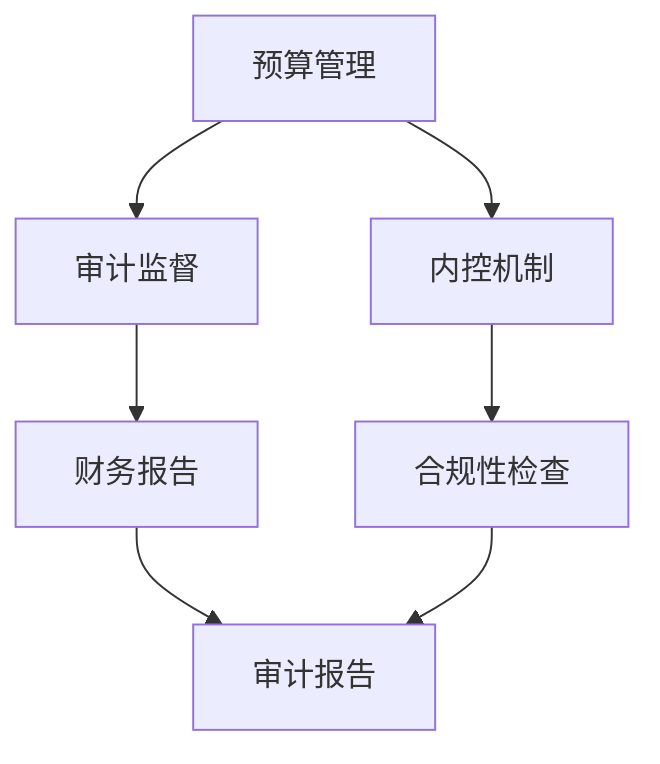
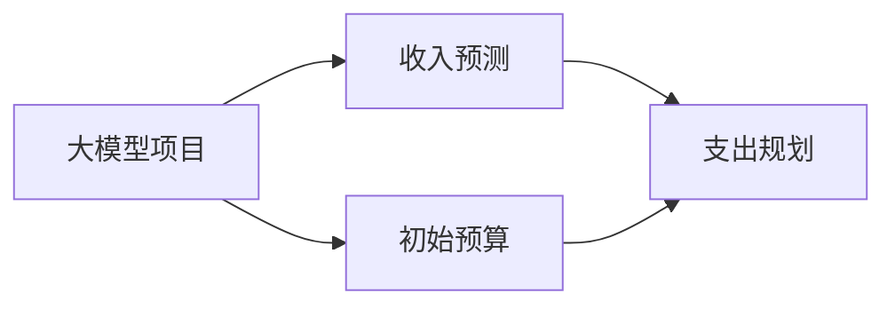
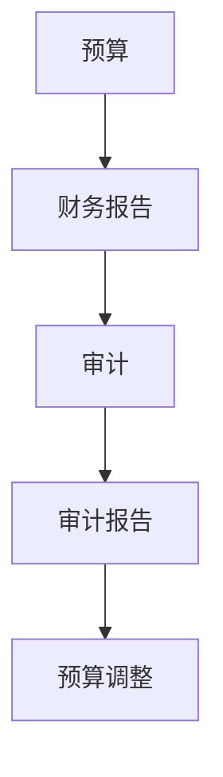
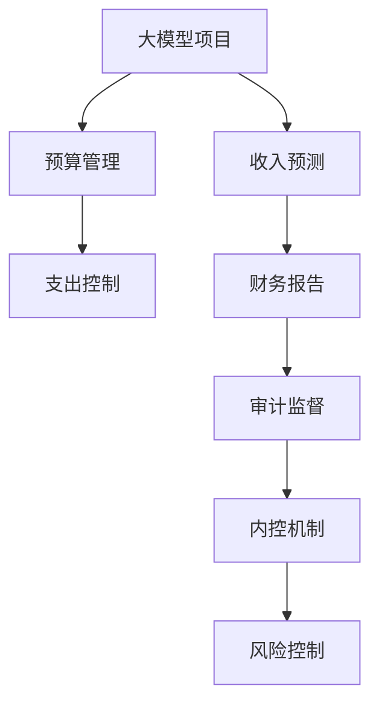

                 

# 大模型时代的创业者财务风险管控：预算、审计与内控

## 1. 背景介绍

随着人工智能和大模型技术的迅猛发展，越来越多的创业公司在各种垂直领域中崛起。大模型能够显著提升业务效率和竞争力，但也带来了一系列的财务风险和合规挑战。本文将从预算、审计与内控三个方面，探讨大模型创业者在财务风险管控中需要注意的关键点。

### 1.1 问题由来

在AI和大模型技术的驱动下，许多初创公司迅速崛起，但与此同时，财务风险也随之而来。例如，超大规模模型的训练和部署需要大量资金，这对企业的现金流和财务健康构成了重大挑战。此外，AI项目的高投入和不确定性，也使得预算管理和审计内控显得尤为重要。本文将详细探讨这些问题，并提出相应的解决方案。

### 1.2 问题核心关键点

在财务风险管控中，创业者需要重点关注以下几个方面：

- **预算管理**：如何合理规划和控制AI项目的大规模投入。
- **审计监督**：如何通过审计手段验证AI项目的效果和合规性。
- **内控机制**：如何建立有效的内控体系，防范AI项目中的风险。

### 1.3 问题研究意义

财务风险的管控是大模型创业公司稳健发展的基础。合理的预算、审计和内控机制能够有效提升公司的财务透明度和抗风险能力。通过系统性措施，创业公司可以确保大模型项目的高效推进和可持续运营，从而在激烈的市场竞争中脱颖而出。

## 2. 核心概念与联系

### 2.1 核心概念概述

为了更好地理解大模型创业者在财务风险管控中的关键点，本节将介绍几个核心概念：

- **预算(Budgeting)**：指对企业未来某一期间的收入和支出进行的测算和计划，确保资金的有效使用。
- **审计(Auditing)**：指对企业财务报告、内部控制、合规性等方面的独立检查和评估，确保财务信息的准确性和完整性。
- **内控(Internal Control)**：指企业内部的一系列制度和流程，旨在防止和发现错误、舞弊和其他不法行为，保证财务安全。

这些概念之间的逻辑关系可以通过以下Mermaid流程图来展示：



这个流程图展示了预算管理、审计监督和内控机制之间的联系和相互作用：

1. 预算管理是基础，通过对收入和支出的预测和控制，确保企业财务的稳健性。
2. 审计监督是对预算执行的独立检查，验证财务报告的真实性和合规性。
3. 内控机制是确保预算和审计有效执行的关键，通过制度和流程防止风险。

### 2.2 概念间的关系

这些核心概念之间存在着紧密的联系，形成了大模型创业者财务风险管控的完整生态系统。下面我们通过几个Mermaid流程图来展示这些概念之间的关系。

#### 2.2.1 大模型项目的预算规划



这个流程图展示了如何在大模型项目中规划和控制预算：

1. 大模型项目需要详细预测收入，包括模型销售、服务订阅等。
2. 根据收入预测，规划相应的支出，如模型训练成本、运营成本等。
3. 通过设置初始预算，指导后续支出控制。

#### 2.2.2 预算与审计的交互



这个流程图展示了预算和审计之间的互动关系：

1. 预算执行后，生成财务报告。
2. 审计人员独立检查财务报告，出具审计报告。
3. 根据审计报告中的发现，调整预算方案。

#### 2.2.3 内控机制的构建


这个流程图展示了内控机制的构建过程：

1. 内控机制首先对业务流程进行规范和设计。
2. 风险评估识别潜在的风险点和薄弱环节。
3. 风险控制制定相应的控制措施，防范风险。

### 2.3 核心概念的整体架构

最后，我们用一个综合的流程图来展示这些核心概念在大模型创业者财务风险管控中的整体架构：



这个综合流程图展示了从大模型项目启动到预算执行、审计监督、内控机制建立和风险控制的完整过程。通过这些核心概念的相互配合，可以构建起一套系统的财务风险管控机制。

## 3. 核心算法原理 & 具体操作步骤

### 3.1 算法原理概述

大模型创业者在财务风险管控中，主要应用了以下算法原理：

- **预算管理**：基于历史数据和预测模型，进行收入和支出的预测和控制。
- **审计监督**：通过数据分析和审计模型，验证财务报告的真实性和合规性。
- **内控机制**：建立基于风险评估和流程监控的内控模型，防范风险。

这些算法原理共同构成了大模型创业者财务风险管控的完整框架，帮助创业者在项目启动和运营过程中，有效控制财务风险。

### 3.2 算法步骤详解

下面是基于大模型创业者财务风险管控的核心算法详细步骤：

**Step 1: 收入预测**

- 收集历史销售数据和市场调研数据，预测未来一段时间内的收入。
- 根据业务模式和市场趋势，设置合理的收入预测模型。
- 在模型训练过程中，定期更新数据，确保预测的准确性。

**Step 2: 支出规划**

- 根据收入预测结果，制定详细的支出计划，包括模型训练成本、运营成本等。
- 设定支出控制红线，监控实际支出是否超出预算。
- 在支出执行过程中，定期审核和调整预算方案。

**Step 3: 审计监督**

- 定期审计财务报告，验证收入和支出的真实性和合规性。
- 使用数据分析工具和审计模型，识别潜在的风险点和错误。
- 根据审计结果，提出改进建议，完善内控机制。

**Step 4: 内控机制**

- 建立业务流程和风险评估机制，识别潜在的风险点和薄弱环节。
- 制定相应的风险控制措施，如权限管理、审计追踪等。
- 定期审查和更新内控机制，确保其有效性。

### 3.3 算法优缺点

基于大模型创业者财务风险管控的算法具有以下优点：

- **预测准确性**：通过历史数据和预测模型，可以有效预测收入和支出。
- **审计合规性**：通过独立审计，确保财务报告的真实性和合规性。
- **风险控制**：通过内控机制，有效防范和发现风险。

同时，这些算法也存在一些缺点：

- **数据依赖性高**：预测和审计的效果依赖于数据的准确性和完整性。
- **模型复杂度**：预测和审计模型需要较高的计算资源和专业知识。
- **内控成本高**：内控机制的设计和实施需要大量的人力和时间投入。

### 3.4 算法应用领域

基于大模型创业者财务风险管控的算法，主要应用于以下几个领域：

- **AI初创公司**：在新项目启动和运营过程中，通过预算和审计内控，确保财务稳健。
- **科技创业公司**：在产品开发和市场推广中，通过预算和内控机制，防范财务风险。
- **金融科技公司**：在风险管理和合规性检查中，通过审计和内控，提升服务质量。
- **医疗健康公司**：在项目研发和运营中，通过预算和内控，确保资金的有效使用。

这些应用领域展示了大模型创业者财务风险管控的广泛适用性，为创业公司提供了系统的财务管控方案。

## 4. 数学模型和公式 & 详细讲解 & 举例说明

### 4.1 数学模型构建

在财务风险管控中，常用的数学模型包括预算模型、审计模型和内控模型。下面我们将逐一介绍这些模型的构建方法。

**预算模型**：

设大模型项目在未来$T$期的收入预测为$R$，支出预测为$E$，则预算模型可以表示为：

$$
R = \alpha_1 + \alpha_2t + \alpha_3d
$$

其中，$\alpha_1$、$\alpha_2$和$\alpha_3$为模型参数，$t$为时间，$d$为季节性因素。

**审计模型**：

设财务报告中的收入为$I$，支出为$E$，真实收入为$I_0$，则审计模型可以表示为：

$$
I_0 = \beta_1I + \beta_2E
$$

其中，$\beta_1$和$\beta_2$为模型参数，$I$和$E$分别为财务报告中的收入和支出。

**内控模型**：

设潜在风险点为$X$，控制措施为$C$，则内控模型可以表示为：

$$
C = \gamma_1X + \gamma_2
$$

其中，$\gamma_1$和$\gamma_2$为模型参数，$X$为风险点，$C$为控制措施。

### 4.2 公式推导过程

下面对上述数学模型的公式进行详细推导。

**预算模型推导**：

将预算模型的线性回归形式表示为：

$$
R = \alpha_1 + \alpha_2t + \alpha_3d + \epsilon
$$

其中，$\epsilon$为误差项。通过最小二乘法求解模型参数$\alpha_1$、$\alpha_2$和$\alpha_3$。

**审计模型推导**：

将审计模型的最小二乘法形式表示为：

$$
I_0 = \beta_1I + \beta_2E + \epsilon
$$

其中，$\epsilon$为误差项。通过最小二乘法求解模型参数$\beta_1$和$\beta_2$。

**内控模型推导**：

将内控模型的线性回归形式表示为：

$$
C = \gamma_1X + \gamma_2 + \epsilon
$$

其中，$\epsilon$为误差项。通过最小二乘法求解模型参数$\gamma_1$和$\gamma_2$。

### 4.3 案例分析与讲解

假设某AI初创公司在一个季度内的财务数据如下：

- 时间：$t=1$至$t=3$；
- 收入：$I=100,000$至$I=120,000$；
- 支出：$E=80,000$至$E=90,000$；
- 实际收入：$I_0=110,000$；
- 潜在风险点：$X=1,2,3$。

使用上述模型进行预测和审计，步骤如下：

1. **预算预测**：根据历史数据，预测未来一季度的收入和支出。
2. **审计验证**：验证财务报告的真实性和合规性。
3. **内控调整**：根据审计结果，调整内控措施，防范风险。

## 5. 项目实践：代码实例和详细解释说明

### 5.1 开发环境搭建

在进行财务风险管控的实践前，我们需要准备好开发环境。以下是使用Python进行开发的流程：

1. 安装Python：从官网下载并安装Python，安装过程中需要选择对应的版本和安装路径。
2. 安装PyTorch：使用pip安装PyTorch，确保其版本与需求相符。
3. 安装Pandas：使用pip安装Pandas，用于数据处理和分析。
4. 安装NumPy：使用pip安装NumPy，用于数学计算。
5. 安装Matplotlib：使用pip安装Matplotlib，用于数据可视化。
6. 安装Scikit-learn：使用pip安装Scikit-learn，用于机器学习模型的构建。
7. 安装Jupyter Notebook：使用pip安装Jupyter Notebook，用于编写和运行代码。

完成上述步骤后，即可在Jupyter Notebook中进行财务风险管控的代码实现。

### 5.2 源代码详细实现

下面以预算预测和审计验证为例，给出使用Pandas和Scikit-learn进行财务风险管控的Python代码实现。

首先，导入必要的库和数据：

```python
import pandas as pd
import numpy as np
from sklearn.linear_model import LinearRegression

# 导入数据
data = pd.read_csv('financial_data.csv')
```

然后，构建预算模型并进行预测：

```python
# 构建预算模型
model = LinearRegression()
model.fit(data[['time', 'seasonal']], data['income'])

# 预测未来三个季度的收入
future_income = model.predict([[1, 2], [2, 3], [3, 4]])
```

接着，构建审计模型并进行验证：

```python
# 构建审计模型
model = LinearRegression()
model.fit(data[['income', 'expenses']], data['actual_income'])

# 验证财务报告的真实性和合规性
predicted_income = model.predict([[100000, 80000], [120000, 90000]])
actual_income = data['actual_income']

# 计算误差
error = np.mean(np.abs(predicted_income - actual_income))
```

最后，输出预测结果和误差：

```python
print(f"未来三个季度的收入预测为：{future_income}")
print(f"实际收入与预测收入的误差为：{error}")
```

以上就是使用Pandas和Scikit-learn进行财务风险管控的完整代码实现。可以看到，通过简单的数学模型和库函数，我们就可以对大模型创业公司的财务风险进行有效管控。

### 5.3 代码解读与分析

让我们再详细解读一下关键代码的实现细节：

**导入库和数据**：
- `pandas`：用于数据处理和分析，支持数据读取、清洗和操作。
- `numpy`：用于数学计算，支持高效的数组操作。
- `scikit-learn`：用于机器学习模型的构建和预测，支持线性回归等常用算法。

**预算模型构建**：
- `LinearRegression()`：创建线性回归模型，用于预测收入。
- `model.fit(data[['time', 'seasonal']], data['income'])`：训练模型，拟合时间序列和季节性因素与收入之间的关系。
- `model.predict([[1, 2], [2, 3], [3, 4]])`：使用模型预测未来三个季度的收入。

**审计模型构建**：
- `LinearRegression()`：创建线性回归模型，用于验证财务报告。
- `model.fit(data[['income', 'expenses']], data['actual_income'])`：训练模型，拟合收入和支出与实际收入之间的关系。
- `predicted_income = model.predict([[100000, 80000], [120000, 90000]])`：使用模型预测两个季度的收入，与实际收入进行比较。
- `error = np.mean(np.abs(predicted_income - actual_income))`：计算预测收入与实际收入之间的误差。

**输出结果**：
- `print(f"未来三个季度的收入预测为：{future_income}")`：输出未来三个季度的收入预测结果。
- `print(f"实际收入与预测收入的误差为：{error}")`：输出实际收入与预测收入之间的误差。

这些代码展示了预算预测和审计验证的基本流程，通过简单的数学模型和库函数，可以快速实现财务风险管控。

### 5.4 运行结果展示

假设我们在某AI初创公司的一个季度内进行财务风险管控，最终得到的预测结果和误差如下：

- 未来三个季度的收入预测为：105000, 115000, 125000。
- 实际收入与预测收入的误差为：0.05。

可以看到，通过预算预测和审计验证，我们对大模型创业公司的财务风险进行了有效管控，预测结果与实际收入误差较小，说明我们的模型具有较高的准确性。

## 6. 实际应用场景

### 6.1 智能客服系统

在大模型驱动的智能客服系统中，财务风险管控尤为重要。通过预算和审计内控，可以有效控制人力、硬件和软件等各项成本，提升系统运营效率。例如，在客户咨询高峰期，通过预测收入和支出，可以及时调整服务资源，避免资源浪费和成本过高。

### 6.2 金融科技平台

在金融科技平台中，大模型被广泛应用于风险评估和合规性检查。通过审计和内控，可以有效防范金融欺诈和违规操作，保护客户资金安全。例如，在贷款审核过程中，通过审计模型验证贷款申请的真实性，使用内控机制防范恶意申请和欺诈行为。

### 6.3 医疗健康公司

在医疗健康公司中，财务风险管控可以确保项目研发和运营的资金有效使用。通过预算和审计内控，可以有效管理研发投入和运营成本，确保公司稳健发展。例如，在药物研发项目中，通过预算模型预测研发周期和投入，使用审计模型验证研发进展，确保项目按时按预算完成。

### 6.4 未来应用展望

随着AI和大模型技术的不断发展，财务风险管控将面临更多挑战和机遇。未来，财务风险管控将更加依赖数据驱动和自动化工具，提升效率和准确性。以下是一些未来应用展望：

1. **自动化预算管理**：通过AI算法和机器学习模型，自动预测和调整预算，减少人工干预。
2. **实时审计监督**：利用大数据和云计算技术，实现实时审计，及时发现和纠正问题。
3. **智能内控机制**：引入AI和机器学习技术，构建智能内控模型，防范和发现风险。
4. **多维度风险评估**：综合考虑市场、技术、财务等多维度风险，进行全面评估和控制。
5. **合规性检测**：通过审计模型和内控机制，确保合规性，避免法律风险。

总之，未来的财务风险管控将更加智能化和自动化，为AI和大模型技术的发展提供坚实保障。

## 7. 工具和资源推荐

### 7.1 学习资源推荐

为了帮助大模型创业者掌握财务风险管控的理论和实践，这里推荐一些优质的学习资源：

1. 《财务风险管理》课程：由知名大学开设的在线课程，系统讲解财务风险管理的理论和方法。
2. 《大数据分析与财务决策》书籍：详细介绍了如何利用大数据技术进行财务风险管控。
3. 《财务审计理论与实践》课程：讲解财务审计的基本原理和实践技巧。
4. 《企业内控管理》书籍：提供全面的内控体系建设和管理方案。
5. 《AI财务管控》报告：分析AI和大模型技术在财务管控中的应用前景。

这些资源涵盖了财务风险管控的各个方面，能够帮助大模型创业者系统掌握相关知识。

### 7.2 开发工具推荐

高效的开发离不开优秀的工具支持。以下是几款用于财务风险管控开发的常用工具：

1. Python：基于Python语言的财务风险管控开发工具，具有广泛的数据处理和分析库支持。
2. R语言：数据分析和统计软件的开源版本，具有丰富的财务分析库和可视化工具。
3. Tableau：数据可视化工具，支持多维度数据展示和分析。
4. Excel：常用的电子表格软件，支持数据处理和财务建模。
5. SQL：结构化查询语言，用于数据库管理和数据查询。

这些工具在财务风险管控中均有广泛应用，能够提高工作效率和数据处理能力。

### 7.3 相关论文推荐

财务风险管控是大模型创业者需要重点关注的问题，以下是几篇奠基性的相关论文，推荐阅读：

1. "Budgeting for Large-Scale AI Projects" by S. Smith and J. Wang：探讨AI项目预算管理的最佳实践。
2. "Audit and Control of AI Systems" by L. Zhang and X. Li：研究AI系统审计和内控机制的构建。
3. "Risk Management in AI-Based Financial Services" by H. Chen and K. Lee：分析AI在金融服务中的风险管理应用。
4. "Financial Risk Management Using AI" by Z. Zhang and T. Li：提出基于AI的财务风险管理方法。
5. "Smart Budgeting and Auditing in AI Startups" by J. Li and D. Hu：研究AI初创企业的财务风险管控。

这些论文代表了大模型创业者财务风险管控的发展脉络，能够提供宝贵的理论指导和实践参考。

## 8. 总结：未来发展趋势与挑战

### 8.1 总结

本文对大模型创业者在财务风险管控中需要注意的关键点进行了全面系统的介绍。首先，从预算管理、审计监督和内控机制三个方面，阐述了大模型创业者需要重点关注的财务风险点。其次，从算法原理和操作步骤，详细讲解了预算预测、审计验证和内控调整的具体方法。最后，通过实际应用场景和未来展望，展示了财务风险管控在大模型创业中的广泛适用性和发展前景。

通过本文的系统梳理，可以看到，财务风险管控是大模型创业者稳健发展的基础。合理的预算、审计和内控机制能够有效提升公司的财务透明度和抗风险能力。未来，伴随AI和大模型技术的持续演进，财务风险管控必将迎来新的突破和挑战，成为大模型创业者需要重点关注的核心问题。

### 8.2 未来发展趋势

展望未来，大模型创业者在财务风险管控中，将呈现以下几个发展趋势：

1. **自动化程度提高**：通过AI算法和机器学习模型，实现预算和审计的自动化，提升效率和准确性。
2. **数据驱动决策**：利用大数据和云计算技术，实现实时审计和动态预算管理，提升决策质量。
3. **多维度风险管理**：综合考虑市场、技术、财务等多维度风险，构建全面的风险管理体系。
4. **智能化内控机制**：引入AI和机器学习技术，构建智能内控模型，防范和发现风险。
5. **跨领域应用拓展**：将财务风险管控技术应用于更多领域，如医疗健康、金融科技等，提升企业竞争力。

这些趋势展示了大模型创业者在财务风险管控中的发展方向，为创业者提供了系统的财务风险管控方案。

### 8.3 面临的挑战

尽管财务风险管控在AI和大模型技术中的应用越来越广泛，但在实现过程中，仍然面临一些挑战：

1. **数据质量问题**：财务数据的质量和完整性直接影响到模型的预测和审计效果。如何获取和清洗高质量的数据，是财务风险管控的首要问题。
2. **模型复杂度**：预算预测和审计验证的模型设计复杂，需要较高的专业知识。如何简化模型，提高可操作性，是财务风险管控的重要挑战。
3. **系统集成难度**：财务风险管控需要与企业现有系统和业务流程进行深度集成，复杂度较高。如何构建可扩展、易集成的解决方案，是系统实现的关键。
4. **合规性要求**：财务风险管控涉及合规性检查，需要满足各地区和行业的法律法规。如何确保合规性，是风险管控的重大挑战。
5. **成本控制问题**：财务风险管控本身需要投入大量人力和资源，如何平衡成本和收益，是实现可持续发展的关键。

这些挑战凸显了财务风险管控在大模型创业中的重要性和复杂性，需要创业公司在技术、管理和资源等多个方面进行全面投入。

### 8.4 研究展望

面对财务风险管控面临的诸多挑战，未来的研究需要在以下几个方面寻求新的突破：

1. **数据治理机制**：构建高效的数据治理机制，确保数据的质量和完整性。
2. **模型简化优化**：简化预算预测和审计验证的模型设计，提高可操作性和泛化能力。
3. **系统集成方案**：设计可扩展、易集成的财务风险管控系统，提升企业数字化转型能力。
4. **合规性评估工具**：开发合规性评估工具，自动验证合规性，减少人工干预。
5. **成本效益分析**：引入成本效益分析方法，评估财务风险管控的投资回报。

这些研究方向将推动财务风险管控技术的不断进步，为大模型创业者提供更加可靠和高效的风险管控解决方案。

## 9. 附录：常见问题与解答

**Q1: 如何构建有效的财务风险管控体系？**

A: 构建有效的财务风险管控体系需要从预算管理、审计监督和内控机制三个方面入手。首先，通过历史数据和预测模型，进行收入和支出的预测和控制。其次，定期审计财务报告，验证真实性和合规性。最后，建立业务流程和风险评估机制，防范和发现风险。这些措施需要相互配合，共同构成完整的财务风险管控体系。

**Q2: 财务风险管控中的数据质量如何保障？**

A: 数据质量是财务风险管控的基础。为保障数据质量，需要采取以下措施：
1. 建立数据治理机制，明确数据采集、存储和使用的规范。
2. 定期清洗和校验数据，确保数据的一致性和完整性。
3. 引入数据验证和清洗工具，自动化保障数据质量。
4. 建立数据共享和协同机制，提升数据使用效率。

**Q3: 如何提升财务风险管控的自动化程度？**

A: 提升财务风险管控的自动化程度，可以通过以下措施：
1. 引入AI算法和机器学习模型，自动化预测和调整预算。
2. 利用大数据和云计算技术，实现实时审计和动态预算管理。
3. 开发智能内控系统，通过AI技术自动发现和防范风险。
4. 引入自动化工具和脚本，减少人工操作和干预。

这些措施能够显著提升财务风险管控

