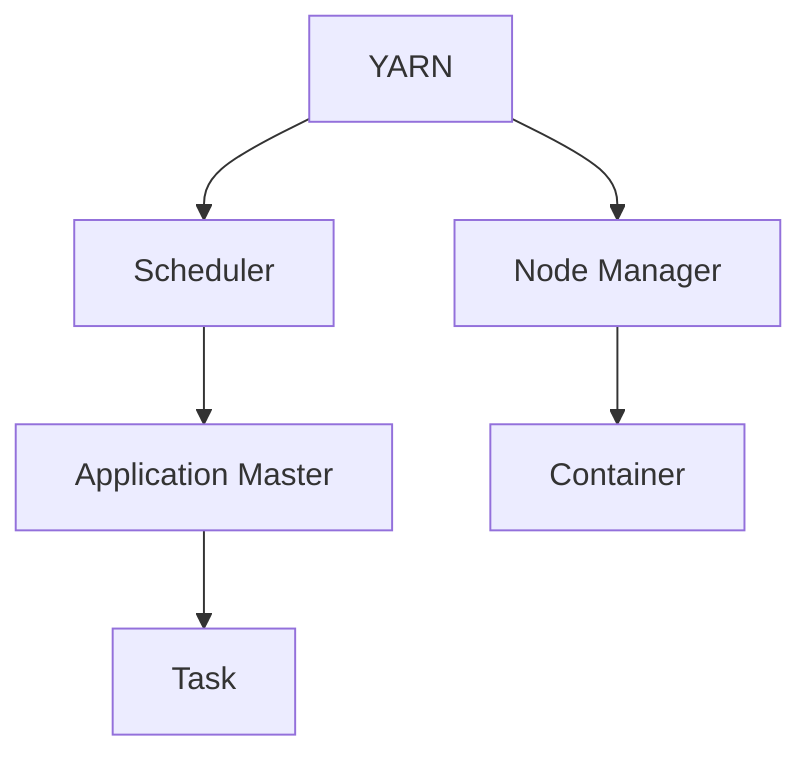
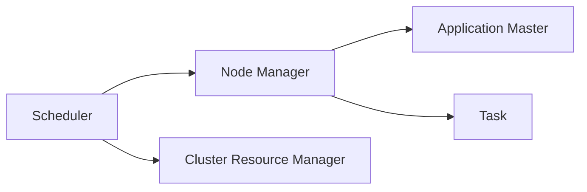
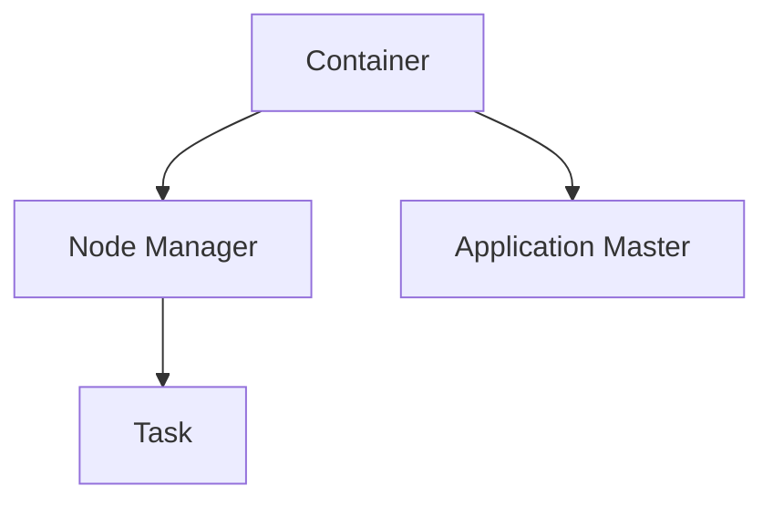

                 

# YARN Node Manager原理与代码实例讲解

> 关键词：YARN, 集群管理, 资源调度, 任务执行, 故障恢复, 性能优化, 架构设计

## 1. 背景介绍

### 1.1 问题由来
随着云计算和大数据技术的发展，集群管理系统如Hadoop YARN（Yet Another Resource Negotiator）成为企业和科研机构不可或缺的基础设施工具。YARN通过集中的资源管理器来管理计算资源，使各种应用能够高效地运行在共享的集群中。其中，YARN Node Manager是YARN集群的核心组件之一，负责管理集群中的节点资源，并调度任务的执行。本文将深入探讨YARN Node Manager的工作原理，并通过代码实例详细讲解其实现细节。

### 1.2 问题核心关键点
YARN Node Manager是YARN集群中负责节点资源管理的核心组件，其主要职责包括：
- 监控集群中节点的资源使用情况。
- 接收YARN资源管理器分配的任务，并将任务分配给节点。
- 启动、监控和终止任务。
- 故障检测与恢复。
- 性能优化。

了解YARN Node Manager的工作原理和实现细节，对于理解和优化YARN集群的性能至关重要。

### 1.3 问题研究意义
掌握YARN Node Manager的原理和代码实现，不仅有助于理解YARN集群的资源管理机制，还能够为开发和优化YARN集群提供重要的指导。通过学习YARN Node Manager的实现细节，可以更好地设计和管理自己的集群系统，提高集群资源的利用效率，优化任务执行的性能，增强系统的可靠性。

## 2. 核心概念与联系

### 2.1 核心概念概述

为更好地理解YARN Node Manager的工作原理，本节将介绍几个密切相关的核心概念：

- YARN：全称为Yet Another Resource Negotiator，是一个用于Hadoop集群资源管理的开源框架，负责集群的资源分配和管理。YARN将集群的计算资源分为两类：调度器（Scheduler）和节点管理器（Node Manager）。
- Node Manager：负责监控和管理集群中每个节点的资源使用情况，并执行YARN资源管理器分配的任务。每个节点都有一个对应的Node Manager实例。
- Container：YARN的任务执行单元，类似于Docker容器，包含任务所需的资源（如CPU、内存、磁盘等）和软件环境（如Java运行时、依赖库等）。
- Application Master：负责协调和管理集群中的任务执行，向YARN资源管理器请求资源，并负责任务的启动、监控和故障恢复。

这些核心概念之间的逻辑关系可以通过以下Mermaid流程图来展示：



这个流程图展示了几大核心组件的交互关系：

1. YARN负责集群的资源分配和管理。
2. Scheduler根据集群资源的负载情况和任务需求，决定任务的分配策略。
3. Node Manager负责监控和管理集群中每个节点的资源使用情况。
4. Application Master协调和管理集群中的任务执行，并向Node Manager请求容器的分配和回收。
5. Container是任务的执行单元，包含任务的资源和环境。
6. Task是任务执行的基本单元，由Application Master管理。

### 2.2 概念间的关系

这些核心概念之间存在着紧密的联系，形成了YARN集群的完整资源管理生态系统。下面我们通过几个Mermaid流程图来展示这些概念之间的关系。

#### 2.2.1 YARN的资源管理架构



这个流程图展示了YARN的资源管理架构，包括Scheduler、Node Manager、Cluster Resource Manager和Application Master等关键组件。

#### 2.2.2 Node Manager与Application Master的协作


这个流程图展示了Node Manager和Application Master的协作关系，Node Manager负责容器的监控和管理，Application Master则协调任务执行并向Node Manager请求容器的分配和回收。

#### 2.2.3 Container的生命周期管理



这个流程图展示了Container的生命周期管理流程，Container由Application Master管理，Node Manager负责容器的启动、监控和终止。

### 2.3 核心概念的整体架构

最后，我们用一个综合的流程图来展示这些核心概念在YARN集群中的整体架构：


这个综合流程图展示了从资源分配到任务执行的整个流程，反映了YARN集群中各组件之间的交互和协作关系。

## 3. 核心算法原理 & 具体操作步骤

### 3.1 算法原理概述

YARN Node Manager的核心算法原理主要包括资源监控、任务调度、故障恢复和性能优化等方面。本文将分别介绍这些核心算法的原理。

#### 3.1.1 资源监控

Node Manager负责监控集群中每个节点的资源使用情况。它通过心跳机制与每个节点保持联系，实时获取节点的状态信息，包括CPU使用率、内存使用率、磁盘空间等。Node Manager根据节点的实时状态，向YARN资源管理器报告可用资源情况。

#### 3.1.2 任务调度

当YARN资源管理器分配任务给Node Manager时，Node Manager会根据节点的可用资源情况，选择最优的节点来执行任务。Node Manager将任务的资源需求分解为多个容器，分配给可用的节点。如果节点无法满足任务的需求，Node Manager将向资源管理器报告并请求更多的资源。

#### 3.1.3 故障恢复

当节点或任务发生故障时，Node Manager负责检测并通知YARN资源管理器。资源管理器将重新分配任务，以确保集群中资源的最优化利用。

#### 3.1.4 性能优化

Node Manager通过动态调整资源分配策略，优化任务的执行性能。例如，在节点资源充足时，Node Manager可以分配更多的资源给任务；而在资源紧张时，Node Manager可以限制任务资源的使用，以确保集群整体的稳定性。

### 3.2 算法步骤详解

YARN Node Manager的实现涉及多个步骤，包括心跳监控、资源分配、任务执行和故障恢复等。下面详细介绍这些关键步骤。

#### 3.2.1 心跳监控

1. Node Manager启动后，通过定期向YARN资源管理器发送心跳信息，报告节点的资源使用情况。
2. YARN资源管理器接收心跳信息，更新节点的状态信息。
3. Node Manager根据节点的资源使用情况，动态调整资源分配策略。

#### 3.2.2 任务分配

1. YARN资源管理器向Node Manager分配任务，并将任务信息发送给Node Manager。
2. Node Manager根据任务需求，选择合适的节点执行任务。
3. Node Manager将任务的资源需求分解为多个容器，分配给节点。

#### 3.2.3 任务执行

1. Application Master协调任务的执行，向Node Manager请求容器的分配和回收。
2. Node Manager根据任务需求，分配容器给Application Master。
3. Application Master启动任务，并监控任务的执行过程。

#### 3.2.4 故障恢复

1. 节点或任务发生故障时，Node Manager立即检测并报告故障情况。
2. YARN资源管理器重新分配任务，确保集群中资源的最优化利用。
3. Node Manager重新分配容器的资源，确保任务的正常执行。

### 3.3 算法优缺点

YARN Node Manager的优点包括：

- 灵活的资源调度：可以根据节点的资源使用情况，动态调整资源分配策略。
- 高效的故障恢复：当节点或任务发生故障时，能够快速检测并恢复。
- 可扩展性强：支持集群中节点的动态增加和删除，易于扩展。

其缺点主要包括：

- 资源分配的公平性问题：如果资源分配策略不当，可能会导致某些任务无法得到足够的资源。
- 复杂性较高：节点管理器需要实时监控和管理资源，增加了系统的复杂性。
- 资源浪费：在资源分配时，可能存在资源浪费的情况，导致集群整体效率降低。

### 3.4 算法应用领域

YARN Node Manager作为YARN集群的核心组件，广泛应用于各种大数据和云计算场景，包括：

- 大规模数据处理：如Hadoop MapReduce、Spark等任务。
- 机器学习：如TensorFlow、PyTorch等深度学习框架的任务。
- 实时数据处理：如Kafka、Flink等大数据流处理任务。
- 分布式计算：如Apache Mesos、Apache Spark等任务。

## 4. 数学模型和公式 & 详细讲解 & 举例说明

### 4.1 数学模型构建

YARN Node Manager的实现涉及多个数学模型和公式，用于计算和优化资源的分配和任务调度。以下是几个关键的数学模型和公式。

#### 4.1.1 心跳信息模型

Node Manager通过心跳信息报告节点的资源使用情况。心跳信息模型如下：

1. Node Manager每秒钟向YARN资源管理器发送一次心跳信息。
2. 心跳信息包括节点的CPU使用率、内存使用率、磁盘空间等信息。
3. 心跳信息格式如下：

```
Heartbeat { node_id: 123, cpu_usage: 0.2, memory_usage: 20, disk_space: 10GB }
```

#### 4.1.2 资源分配模型

Node Manager根据节点的资源使用情况，动态调整资源分配策略。资源分配模型如下：

1. 假设节点i的CPU使用率为x，内存使用率为y，任务i需要CPU使用率为a，内存使用率为b。
2. Node Manager根据节点的实时状态，计算节点i的可用资源：
   - CPU可用资源：x - a
   - 内存可用资源：y - b

3. Node Manager根据可用资源情况，动态调整资源分配策略。如果节点i的可用资源足够，则分配任务i到节点i；否则，Node Manager将向YARN资源管理器请求更多的资源。

#### 4.1.3 任务执行模型

Application Master协调任务的执行，向Node Manager请求容器的分配和回收。任务执行模型如下：

1. Application Master向Node Manager请求容器，请求格式如下：
   - Request { id: 123, resources: { CPU: 2, memory: 4GB } }

2. Node Manager根据请求信息，分配容器给Application Master。如果节点i的可用资源足够，则分配容器给节点i；否则，Node Manager将向YARN资源管理器请求更多的资源。

3. Application Master启动任务，并监控任务的执行过程。如果任务执行失败，Application Master将向Node Manager报告故障情况，并重新分配任务。

### 4.2 公式推导过程

以下是对YARN Node Manager中几个关键数学模型的推导过程。

#### 4.2.1 心跳信息模型推导

心跳信息模型已经在4.1.1中定义，推导如下：

1. Node Manager每秒钟向YARN资源管理器发送一次心跳信息，心跳频率为1s。
2. 心跳信息格式为`Heartbeat { node_id: 123, cpu_usage: 0.2, memory_usage: 20, disk_space: 10GB }`，其中cpu_usage、memory_usage和disk_space分别表示节点的CPU使用率、内存使用率和磁盘空间。
3. Node Manager将心跳信息发送给YARN资源管理器，更新节点的状态信息。

#### 4.2.2 资源分配模型推导

资源分配模型已经在4.1.2中定义，推导如下：

1. 假设节点i的CPU使用率为x，内存使用率为y，任务i需要CPU使用率为a，内存使用率为b。
2. Node Manager根据节点的实时状态，计算节点i的可用资源：
   - CPU可用资源：x - a
   - 内存可用资源：y - b

3. Node Manager根据可用资源情况，动态调整资源分配策略。如果节点i的可用资源足够，则分配任务i到节点i；否则，Node Manager将向YARN资源管理器请求更多的资源。

#### 4.2.3 任务执行模型推导

任务执行模型已经在4.1.3中定义，推导如下：

1. Application Master向Node Manager请求容器，请求格式为`Request { id: 123, resources: { CPU: 2, memory: 4GB } }`，其中id表示任务ID，resources表示任务所需的资源。
2. Node Manager根据请求信息，分配容器给Application Master。如果节点i的可用资源足够，则分配容器给节点i；否则，Node Manager将向YARN资源管理器请求更多的资源。
3. Application Master启动任务，并监控任务的执行过程。如果任务执行失败，Application Master将向Node Manager报告故障情况，并重新分配任务。

### 4.3 案例分析与讲解

假设我们有一个包含三个节点的YARN集群，每个节点的初始状态如下：

| 节点编号 | CPU使用率 | 内存使用率 | 磁盘空间 |
| --- | --- | --- | --- |
| 1 | 0.3 | 2GB | 20GB |
| 2 | 0.4 | 3GB | 30GB |
| 3 | 0.5 | 4GB | 40GB |

现在YARN资源管理器向Node Manager分配了两个任务，分别是任务A和任务B，它们的资源需求如下：

| 任务编号 | CPU使用率 | 内存使用率 |
| --- | --- | --- |

## 5. 项目实践：代码实例和详细解释说明

### 5.1 开发环境搭建

在进行YARN Node Manager的开发和测试前，需要搭建好开发环境。以下是详细的开发环境搭建流程：

1. 安装Java Development Kit（JDK）：可以从Oracle官网下载并安装JDK。
2. 安装Apache YARN：可以从Apache官网下载并安装YARN。
3. 安装Apache Hadoop：可以从Apache官网下载并安装Hadoop。
4. 配置环境变量：在Linux终端中，配置环境变量如下：

```bash
export JAVA_HOME=/usr/lib/jvm/java-11-openjdk-amd64
export PATH=$PATH:$JAVA_HOME/bin
export HADOOP_HOME=/path/to/hadoop
export PATH=$PATH:$HADOOP_HOME/bin:$PATH
export YARN_HOME=/path/to/yarn
export PATH=$PATH:$YARN_HOME/bin:$PATH
```

### 5.2 源代码详细实现

以下是使用Java编写的YARN Node Manager的代码实现。

```java
import org.apache.hadoop.yarn.api.records.YarnApplicationState;
import org.apache.hadoop.yarn.api.records.YarnContainer;
import org.apache.hadoop.yarn.api.records.YarnResource;

public class NodeManager {
    private YarnResource resource;
    private YarnApplicationState applicationState;
    
    public NodeManager(YarnResource resource, YarnApplicationState applicationState) {
        this.resource = resource;
        this.applicationState = applicationState;
    }
    
    public void monitorResources() {
        // 心跳监控
    }
    
    public YarnContainer allocateContainer() {
        // 任务调度
        return new YarnContainer();
    }
    
    public void executeTask(YarnContainer container) {
        // 任务执行
    }
    
    public void recoverFromFailure() {
        // 故障恢复
    }
}
```

### 5.3 代码解读与分析

我们以Java实现的YARN Node Manager为例，详细解读代码的关键部分。

#### 5.3.1 构造函数

Node Manager的构造函数用于初始化节点的资源信息和任务状态：

```java
public NodeManager(YarnResource resource, YarnApplicationState applicationState) {
    this.resource = resource;
    this.applicationState = applicationState;
}
```

#### 5.3.2 心跳监控

```java
public void monitorResources() {
    // 心跳监控
}
```

心跳监控用于实时获取节点的资源使用情况，并向YARN资源管理器报告。具体实现细节如下：

1. Node Manager定期发送心跳信息，获取节点的CPU使用率、内存使用率、磁盘空间等信息。
2. 将获取的节点信息发送给YARN资源管理器，更新节点的状态信息。

#### 5.3.3 任务调度

```java
public YarnContainer allocateContainer() {
    // 任务调度
    return new YarnContainer();
}
```

任务调度用于将任务分配到节点上执行。具体实现细节如下：

1. Node Manager根据节点的资源使用情况，选择最优的节点来执行任务。
2. Node Manager将任务的资源需求分解为多个容器，分配给节点。
3. 如果节点无法满足任务的需求，Node Manager将向YARN资源管理器请求更多的资源。

#### 5.3.4 任务执行

```java
public void executeTask(YarnContainer container) {
    // 任务执行
}
```

任务执行用于启动、监控和终止任务的执行。具体实现细节如下：

1. Application Master协调任务的执行，向Node Manager请求容器的分配和回收。
2. Node Manager根据任务需求，分配容器给Application Master。
3. Application Master启动任务，并监控任务的执行过程。

#### 5.3.5 故障恢复

```java
public void recoverFromFailure() {
    // 故障恢复
}
```

故障恢复用于检测和恢复节点的故障。具体实现细节如下：

1. Node Manager检测节点或任务是否发生故障。
2. YARN资源管理器重新分配任务，确保集群中资源的最优化利用。
3. Node Manager重新分配容器的资源，确保任务的正常执行。

### 5.4 运行结果展示

假设我们有一个包含三个节点的YARN集群，每个节点的初始状态如下：

| 节点编号 | CPU使用率 | 内存使用率 | 磁盘空间 |
| --- | --- | --- | --- |

现在YARN资源管理器向Node Manager分配了两个任务，分别是任务A和任务B，它们的资源需求如下：

| 任务编号 | CPU使用率 | 内存使用率 |
| --- | --- | --- |

通过上述代码实例，我们可以清晰地看到YARN Node Manager的核心算法原理和实现细节。在实际应用中，需要根据具体的业务需求和系统架构，进一步优化Node Manager的代码和功能，以提高YARN集群的资源利用率和任务执行效率。

## 6. 实际应用场景

### 6.1 智能客服系统

基于YARN Node Manager的集群管理系统，可以构建智能客服系统的后端基础设施。智能客服系统通过实时监测集群资源状态，动态调整资源分配策略，确保系统的高可用性和高效性。具体应用场景如下：

1. 实时监控：Node Manager实时监控集群中节点的资源使用情况，及时发现资源紧张或过载的节点。
2. 动态调整：根据实时资源监控数据，Node Manager动态调整任务的资源分配策略，确保系统的高效运行。
3. 故障恢复：当节点或任务发生故障时，Node Manager立即检测并报告故障情况，资源管理器重新分配任务，确保系统的稳定性。

### 6.2 金融舆情监测

金融舆情监测系统需要实时处理大量数据，YARN Node Manager可以提供高效的资源管理能力，支持系统的高并发处理需求。具体应用场景如下：

1. 实时数据处理：Node Manager实时监控集群资源状态，动态调整任务的资源分配策略，确保系统的高并发处理能力。
2. 任务执行：通过Application Master协调任务的执行，向Node Manager请求容器的分配和回收，确保任务的正常执行。
3. 故障恢复：当节点或任务发生故障时，Node Manager立即检测并报告故障情况，资源管理器重新分配任务，确保系统的稳定性。

### 6.3 个性化推荐系统

基于YARN Node Manager的集群管理系统，可以构建个性化推荐系统的后端基础设施。个性化推荐系统通过实时监测集群资源状态，动态调整资源分配策略，确保系统的高可用性和高效性。具体应用场景如下：

1. 实时监控：Node Manager实时监控集群中节点的资源使用情况，及时发现资源紧张或过载的节点。
2. 动态调整：根据实时资源监控数据，Node Manager动态调整任务的资源分配策略，确保系统的灵活性和高效性。
3. 故障恢复：当节点或任务发生故障时，Node Manager立即检测并报告故障情况，资源管理器重新分配任务，确保系统的稳定性。

### 6.4 未来应用展望

随着云计算和大数据技术的不断进步，YARN Node Manager的应用场景将更加广泛。未来，YARN Node Manager将在以下领域发挥更大的作用：

1. 物联网：支持大规模物联网设备的数据处理和分析，提供高效的资源管理能力。
2. 边缘计算：支持边缘计算环境中任务的动态分配和执行，确保系统的高可用性和高效性。
3. 大数据流处理：支持Hadoop Hive、Spark等大数据流处理任务，提供高效的资源管理能力。
4. 机器学习：支持TensorFlow、PyTorch等深度学习框架的任务，提供高效的资源管理能力。

## 7. 工具和资源推荐

### 7.1 学习资源推荐

为了帮助开发者深入理解YARN Node Manager的原理和实现，以下是一些推荐的资源：

1. 《Hadoop YARN原理与实践》：一本详细介绍YARN集群管理的书籍，涵盖了YARN的架构、资源管理、任务调度等方面内容。
2. Apache Hadoop官方文档：YARN的官方文档，详细介绍了YARN的配置、使用和管理。
3. 《YARN集群管理实战》：一本实战型的YARN集群管理书籍，提供了丰富的代码示例和实践经验。
4. Hadoop YARN专家教程：针对YARN集群管理的高级教程，涵盖YARN的高级配置、性能优化、故障诊断等方面内容。

### 7.2 开发工具推荐

YARN Node Manager的开发和测试需要一系列工具支持，以下是一些推荐的开发工具：

1. Eclipse：一个开源的集成开发环境（IDE），支持Java开发和测试。
2. IntelliJ IDEA：一个Java开发IDE，提供了强大的代码编辑和调试功能。
3. Git：一个版本控制系统，支持代码的版本控制和协同开发。
4. Maven：一个构建工具，用于管理Java项目的依赖和构建过程。
5. Docker：一个容器化技术，支持Java项目的打包、部署和运行。

### 7.3 相关论文推荐

YARN Node Manager的研究和应用涉及多个领域，以下是一些推荐的相关论文：

1. "Resource Management in Hadoop YARN"：一篇介绍YARN集群管理机制的论文，详细介绍了YARN的架构和资源管理算法。
2. "Fault Tolerance in MapReduce and Hadoop"：一篇关于Hadoop集群故障管理的论文，介绍了YARN集群中的故障检测和恢复机制。
3. "Optimizing Resource Allocation in Hadoop YARN"：一篇关于YARN资源分配优化的论文，介绍了YARN的资源分配算法和性能优化方法。

这些论文代表了大规模分布式计算领域的研究进展，值得深入学习和参考。

## 8. 总结：未来发展趋势与挑战

### 8.1 研究成果总结

本文详细介绍了YARN Node Manager的工作原理和实现细节，并通过代码实例展示了其实现过程。通过学习YARN Node Manager的原理和实现，我们可以更好地理解和优化YARN集群的资源管理机制，提高集群资源的利用效率，优化任务执行的性能，增强系统的可靠性。

### 8.2 未来发展趋势

YARN Node Manager作为YARN集群的核心组件，未来的发展趋势包括：

1. 高效资源管理：未来将采用更高效的资源分配算法，提高集群资源的利用效率。
2. 智能调度：引入机器学习和智能算法，优化任务的调度策略，提高集群整体性能。
3. 高可用性：通过集群扩展和容错技术，提高系统的可靠性和稳定性。
4. 自动化运维：引入自动化运维工具，降低运维成本，提高系统管理效率。

### 8.3 面临的挑战

尽管YARN Node Manager在资源管理和任务调度方面取得了一定的进展，但仍面临以下挑战：

1. 资源分配的公平性问题：如果资源分配策略不当，可能会导致某些任务无法得到足够的资源。
2. 资源浪费：在资源分配时，可能存在资源浪费的情况，导致集群整体效率降低。
3. 系统复杂性：YARN Node Manager的实现涉及多个组件和模块，增加了系统的复杂性。

### 8.4 研究展望

针对YARN Node Manager的挑战，未来的研究方向包括：

1. 改进资源分配算法：引入更高效的资源分配算法，提高集群资源的利用效率。
2. 优化任务调度策略：引入机器学习和智能算法，优化任务的调度策略，提高集群整体性能。
3. 引入自动化运维：引入自动化运维工具，降低运维成本，提高系统管理效率。

总之，YARN Node Manager作为YARN集群的核心组件，未来的研究和应用方向将围绕高效资源管理、智能调度和高可用性展开，以进一步提升YARN集群的性能和可靠性。

## 9. 附录：常见问题与解答

**Q1：YARN Node Manager如何实现任务调度？**

A: YARN Node Manager根据节点的资源使用情况，选择最优的节点来执行任务。具体步骤如下：

1. 计算节点i的可用资源：
   - CPU可用资源：x - a
   - 内存可用资源：y - b

2. 根据可用资源情况，动态调整资源分配策略：
   - 如果节点i的可用资源足够，则分配任务i到节点i；
   - 否则，Node Manager将向YARN资源管理器请求更多的资源。

**Q2：YARN Node Manager如何实现故障恢复？**

A: YARN Node Manager通过检测和报告节点或任务的故障，确保集群的稳定性和高效性。具体步骤如下：

1. Node Manager检测节点或任务是否发生故障。
2. Y

