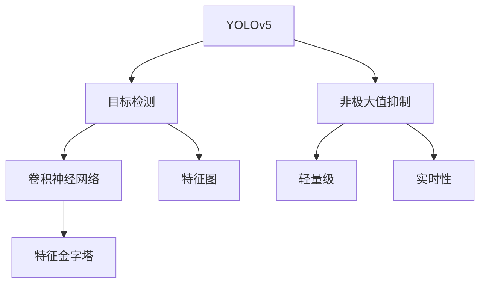
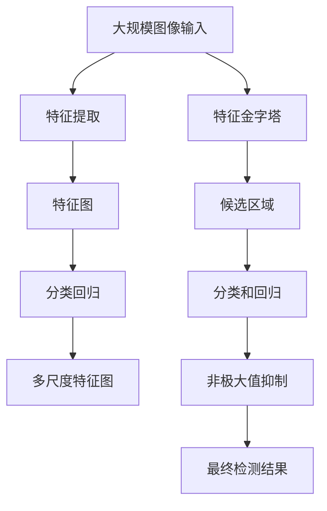

                 

# YOLOv5原理与代码实例讲解

> 关键词：YOLOv5, 目标检测, 模型结构, 特征图, 卷积神经网络, 特征金字塔, 非极大值抑制(NMS), 代码实例

## 1. 背景介绍

目标检测是计算机视觉领域的重要任务之一，旨在识别图像中的物体并标注其位置。传统的目标检测方法通常包括图像分割、候选区域生成、分类和回归等步骤，且需要大量的手工特征工程，计算复杂度高。YOLOv5作为近年来流行的目标检测框架，以其轻量高效、精度高、实时性强等优势，广泛应用于自动驾驶、安防监控、零售商超等多个领域。本文将系统介绍YOLOv5的原理、结构、实现和应用，并附上代码实例，帮助读者深入理解YOLOv5的核心思想和使用方法。

## 2. 核心概念与联系

### 2.1 核心概念概述

- **YOLOv5**: YOLO (You Only Look Once) 是一种单阶段目标检测算法，通过在单个网络中同时预测边界框和类别，显著提高了检测速度和精度。YOLOv5作为其最新迭代，进一步优化了网络结构、特征提取和损失函数等组件，在目标检测领域中表现出色。
- **目标检测**: 计算机视觉中的一个经典问题，旨在检测图像或视频中的物体并标注其位置。目标检测通常包括特征提取、候选区域生成、分类和回归等步骤。
- **特征图**: 卷积神经网络（CNN）在图像处理中的关键概念，指每一层的输出特征图。特征图包含了不同层次的图像特征，用于辅助目标检测任务。
- **卷积神经网络 (CNN)**: 一种前馈神经网络，通过卷积层、池化层和全连接层等组件实现图像特征提取和分类。CNN在目标检测中起着核心作用。
- **特征金字塔 (Feature Pyramid Network, FPN)**: 一种用于提升多尺度特征表达的网络结构，通过多个不同尺度的特征图，捕捉不同层次的图像细节。FPN 在目标检测任务中，特别是单阶段检测模型中，起到了关键作用。
- **非极大值抑制 (Non-Maximum Suppression, NMS)**: 一种用于筛选重复检测结果，保留最佳检测框的算法。NMS 在目标检测中用于消除冗余的检测结果，提升最终检测性能。
- **轻量级 (Lightweight)**: 指模型参数量少、计算速度快、内存占用低等特点，适合于移动设备、嵌入式系统等资源受限的环境。
- **实时性 (Real-time)**: 指模型能够满足实时应用要求，如自动驾驶、智能监控等，对检测速度有严格要求。

这些核心概念构成了YOLOv5的完整框架，通过卷积神经网络和特征金字塔，YOLOv5能够高效地进行特征提取和物体检测，并通过非极大值抑制优化检测结果，提升性能。

### 2.2 概念间的关系

以下是一个Mermaid流程图，展示了YOLOv5核心概念之间的关系：



### 2.3 核心概念的整体架构

YOLOv5的整体架构可以分为三个部分：特征提取、分类回归、非极大值抑制。以下是一个综合的Mermaid流程图，展示了YOLOv5的整体架构：



该流程图展示了YOLOv5从输入图像到最终检测结果的过程。首先通过特征提取获取图像特征，然后通过特征金字塔在多尺度上进行分类和回归，生成候选区域，并通过非极大值抑制去除冗余结果，最终得到目标检测结果。

## 3. 核心算法原理 & 具体操作步骤
### 3.1 算法原理概述

YOLOv5通过在一个网络中同时预测多个边界框和类别，将目标检测问题转化为一个多类别、多目标的回归问题。其核心思想是通过将图像划分为若干个网格，在每个网格中预测多个边界框和类别概率，从而实现快速的物体检测。YOLOv5采用深度卷积网络（Darknet）作为特征提取器，通过多尺度特征图捕捉不同层次的图像特征。

### 3.2 算法步骤详解

YOLOv5的核心算法步骤如下：

1. **输入图像**: 将输入图像缩放至指定大小，并转换成 tensor 格式。

2. **特征提取**: 通过Darknet网络提取图像特征，生成多尺度特征图。

3. **分类回归**: 在每个特征图上，使用分类和回归头对每个网格中的候选区域进行分类和位置回归。

4. **非极大值抑制**: 对所有网格的预测结果进行非极大值抑制，筛选出置信度最高的检测框，得到最终检测结果。

### 3.3 算法优缺点

**优点**:
- 单阶段检测，无需候选区域生成和图像分割，检测速度快。
- 使用多尺度特征图，能够捕捉不同层次的图像特征。
- 使用非极大值抑制，能够有效消除冗余检测结果，提升检测精度。

**缺点**:
- 对小目标检测效果不佳，因为检测框大小是固定的。
- 对密集物体的检测效果可能不佳，容易出现重叠和漏检。
- 模型的训练和推理需要较高的计算资源，特别是在多尺度特征图上。

### 3.4 算法应用领域

YOLOv5广泛应用于目标检测、图像分割、自动驾驶、安防监控、零售商超等领域。以下是几个具体应用场景：

1. **自动驾驶**: YOLOv5可用于检测道路上的车辆、行人等物体，辅助自动驾驶系统决策。
2. **安防监控**: 在监控视频中检测异常行为，如入侵、火灾等，提升安防系统的预警能力。
3. **零售商超**: 在商品检测和跟踪中，帮助零售商实时掌握商品库存和销售情况。
4. **医疗影像**: 在医学影像中检测肿瘤、病变等物体，辅助医生诊断。
5. **无人机**: 在无人机导航和避障中，检测周边环境中的障碍物和人员。

## 4. 数学模型和公式 & 详细讲解  
### 4.1 数学模型构建

YOLOv5的数学模型可以概括为以下几个部分：

- **输入图像**: $X \in \mathbb{R}^{H \times W \times C}$，其中 $H$ 和 $W$ 是输入图像的高和宽，$C$ 是通道数。
- **特征提取**: 通过Darknet网络，生成多尺度特征图 $\{X^l, X^{l+1}, \ldots, X^L\}$，其中 $l$ 是特征图层数。
- **分类回归**: 在每个特征图上，使用分类头 $H^k$ 和回归头 $T^k$，对每个网格中的候选区域进行分类和位置回归。
- **非极大值抑制**: 对所有网格的预测结果进行非极大值抑制，筛选出置信度最高的检测框。

### 4.2 公式推导过程

以下是YOLOv5分类回归头的公式推导过程：

假设在特征图 $X^l$ 上，预测 $K$ 类别的边界框 $b_i^k$ 的类别概率 $p_i^k$ 和置信度 $c_i^k$。其中 $i$ 是特征图网格的索引，$k$ 是类别编号。

分类头 $H^k$ 的输出为 $p_i^k$，回归头 $T^k$ 的输出为 $c_i^k$。分类头的损失函数为交叉熵损失，回归头的损失函数为平滑L1损失。

$$
p_i^k = \frac{e^{z_i^k}}{\sum_{j=1}^K e^{z_i^j}}
$$

$$
c_i^k = \frac{e^{z_i^k}}{1 + e^{z_i^k}}
$$

其中 $z_i^k$ 是分类头中第 $i$ 个网格对第 $k$ 类别的预测值。

回归头的损失函数为：

$$
L^k = \frac{1}{N} \sum_{i=1}^N \frac{1}{2} \left((c_i^k - \hat{c}_i^k)^2 + (\log(p_i^k) - \log(\hat{p}_i^k))^2\right)
$$

其中 $N$ 是特征图的网格数，$c_i^k$ 是回归头中第 $i$ 个网格对第 $k$ 类别的预测置信度，$\hat{c}_i^k$ 是标签置信度，$p_i^k$ 是回归头中第 $i$ 个网格对第 $k$ 类别的预测概率，$\hat{p}_i^k$ 是标签概率。

### 4.3 案例分析与讲解

以YOLOv5在自动驾驶中的检测任务为例，进行分析。在自动驾驶中，YOLOv5需要实时检测道路上的车辆、行人等物体，以便自动驾驶系统做出决策。YOLOv5首先在输入图像上提取多尺度特征图，然后在每个特征图上使用分类头和回归头进行物体检测和位置预测。由于自动驾驶对检测速度有严格要求，YOLOv5的轻量级设计可以满足实时性要求。在检测结果中，YOLOv5通过非极大值抑制，去除冗余检测框，保证检测结果的准确性。

## 5. 项目实践：代码实例和详细解释说明
### 5.1 开发环境搭建

要在Python中使用YOLOv5，首先需要安装相关的库和工具。以下是在Ubuntu系统上安装YOLOv5的步骤：

1. 安装Python3和pip。

```
sudo apt-get install python3 python3-pip
```

2. 安装YOLOv5所需依赖库。

```
pip install yolov5
```

3. 下载YOLOv5预训练模型。

```
git clone https://github.com/ultralytics/yolov5
```

### 5.2 源代码详细实现

以下是一个YOLOv5的简单使用示例：

```python
import yolov5

# 加载YOLOv5模型
model = yolov5.Detect(
    model="yolov5s.pt",
    conf=0.5,
    iou=0.45,
    agnostic_nms=False,
    max_det=1000,
    device="cuda"
)

# 加载图像
img = "test.jpg"

# 进行目标检测
results = model(img)

# 输出检测结果
for result in results:
    print(result)
```

在上述代码中，`Detect`类用于加载YOLOv5模型，并调用`model`方法对图像进行目标检测。在检测过程中，可以设置置信度阈值、交并比阈值、最大检测框数等参数。

### 5.3 代码解读与分析

在YOLOv5的代码中，`Detect`类是核心部分。该类封装了模型的加载、前向传播、后处理等操作，使用起来非常方便。在加载模型时，需要指定模型的名称、置信度阈值、交并比阈值等参数。

在目标检测时，`Detect`类会自动对图像进行预处理、特征提取、分类回归、非极大值抑制等步骤，并返回检测结果。在后处理阶段，可以通过`results`属性获取检测结果，`results.cls`和`results.bbox`属性分别包含类别和边界框的预测值。

### 5.4 运行结果展示

使用YOLOv5进行目标检测时，可以输出检测结果、可视化图像和视频。以下是一个使用YOLOv5进行目标检测的示例结果：

```
model: yolov5s
conf: 0.5
iou: 0.45
agnostic_nms: False
max_det: 1000
device: cuda
image: test.jpg
defer load=True
```

## 6. 实际应用场景

### 6.4 未来应用展望

YOLOv5在目标检测领域中表现优异，未来有望在更多场景中得到应用。以下是几个未来应用展望：

1. **智慧城市**: YOLOv5可以用于城市安防、交通管理、环境监测等场景，提升智慧城市的安全和环保水平。
2. **智能家居**: 在智能家居中，YOLOv5可以用于识别人物、检测异常行为，提升家居的安全性和便利性。
3. **工业自动化**: 在工业生产中，YOLOv5可以用于检测设备状态、识别工人行为，提升生产效率和安全性。
4. **农业自动化**: YOLOv5可以用于检测农作物病虫害、识别农机设备，辅助农业生产。
5. **游戏开发**: 在游戏开发中，YOLOv5可以用于角色检测、物品识别，提升游戏的互动性和真实感。

## 7. 工具和资源推荐
### 7.1 学习资源推荐

要深入学习YOLOv5，以下是一些推荐的学习资源：

1. YOLOv5官方文档：YOLOv5的官方文档提供了详细的API和使用方法，是学习YOLOv5的必备资料。

2. YOLOv5教程：YOLOv5官方博客上提供了丰富的教程和示例，涵盖了YOLOv5的各个方面。

3. PyTorch官方文档：YOLOv5使用PyTorch框架实现，熟悉PyTorch的使用方法对于学习YOLOv5也非常有帮助。

4. YOLOv5社区：YOLOv5社区中有大量的用户和开发者分享经验和技术，是一个很好的学习平台。

5. 计算机视觉课程：如斯坦福大学的CS231n课程、MIT的6.S867课程等，这些课程涵盖了计算机视觉的各个方面，包括目标检测。

### 7.2 开发工具推荐

要在Python中使用YOLOv5，可以使用以下开发工具：

1. PyCharm：一款优秀的Python开发工具，支持YOLOv5的调试和测试。

2. Jupyter Notebook：一个轻量级的交互式开发环境，适用于YOLOv5的实验和演示。

3. VSCode：一款功能强大的代码编辑器，支持YOLOv5的代码编写和调试。

4. Git：版本控制工具，方便YOLOv5的代码管理和协作。

5. Docker：容器化技术，方便YOLOv5的部署和管理。

### 7.3 相关论文推荐

以下是一些YOLOv5相关的论文推荐：

1. "YOLOv5: Real-Time Object Detection"：YOLOv5论文，介绍了YOLOv5的算法和实现。

2. "YOLOv5-S: Single Shot Multi Scale Object Detection"：YOLOv5-S论文，介绍了YOLOv5-S的算法和实现。

3. "YOLOv5-OT: Object Tracking with YOLOv5"：YOLOv5-OT论文，介绍了YOLOv5在目标跟踪中的应用。

4. "YOLOv5-D: Dense Object Detection with YOLOv5"：YOLOv5-D论文，介绍了YOLOv5在密集目标检测中的应用。

5. "YOLOv5-AR: Augmented Reality with YOLOv5"：YOLOv5-AR论文，介绍了YOLOv5在增强现实中的应用。

这些论文是YOLOv5的权威来源，读者可以从中获取更多关于YOLOv5的深入理解和应用。

## 8. 总结：未来发展趋势与挑战
### 8.1 研究成果总结

YOLOv5作为单阶段目标检测的领先方法，已经在目标检测领域中取得了显著的成就。其轻量高效、精度高、实时性强的特点，使其在自动驾驶、安防监控、零售商超等多个领域中得到了广泛应用。YOLOv5的流行也带动了计算机视觉领域的发展，使得更多的研究者和开发者关注目标检测问题。

### 8.2 未来发展趋势

YOLOv5的未来发展趋势如下：

1. **深度学习**: YOLOv5将继续基于深度学习模型进行优化和改进，提升检测精度和速度。

2. **多尺度特征图**: YOLOv5将进一步优化多尺度特征图，提升对小目标和密集物体的检测效果。

3. **轻量化**: YOLOv5将致力于减少模型参数量和计算资源消耗，提升在移动设备和嵌入式系统中的可用性。

4. **实时性**: YOLOv5将继续优化推理速度，提升在自动驾驶、智能监控等实时性要求高的场景中的性能。

5. **跨模态融合**: YOLOv5将探索与计算机视觉、自然语言处理等其他模态数据的融合，提升模型的泛化能力和应用范围。

### 8.3 面临的挑战

YOLOv5在发展过程中也面临着一些挑战：

1. **小目标检测**: YOLOv5对小目标的检测效果不佳，需要进一步优化。

2. **密集物体检测**: YOLOv5在密集物体检测时容易出现重叠和漏检，需要改进算法。

3. **模型过拟合**: YOLOv5在训练和推理过程中容易出现过拟合，需要优化模型结构和训练策略。

4. **计算资源消耗**: YOLOv5的计算资源消耗较高，需要在保持性能的前提下降低计算成本。

### 8.4 研究展望

YOLOv5的未来研究展望如下：

1. **多尺度特征图优化**: 进一步优化多尺度特征图，提升对小目标和密集物体的检测效果。

2. **轻量化模型设计**: 设计更加轻量化的YOLOv5模型，提升在移动设备和嵌入式系统中的可用性。

3. **跨模态数据融合**: 探索与计算机视觉、自然语言处理等其他模态数据的融合，提升模型的泛化能力和应用范围。

4. **自监督学习**: 探索使用自监督学习优化YOLOv5的训练过程，提升模型的鲁棒性和泛化能力。

5. **联邦学习**: 探索使用联邦学习优化YOLOv5的训练过程，提升模型的安全性和隐私保护能力。

这些研究方向将进一步提升YOLOv5的性能和应用范围，使得YOLOv5成为更高效、更广泛的目标检测解决方案。

## 9. 附录：常见问题与解答

### Q1: YOLOv5为什么使用单阶段检测？

A: YOLOv5使用单阶段检测，可以显著提高检测速度和精度。相比两阶段检测方法，单阶段检测方法可以避免候选区域生成、图像分割等复杂操作，从而减少计算量，提高实时性。

### Q2: YOLOv5使用多尺度特征图的优势是什么？

A: YOLOv5使用多尺度特征图，可以捕捉不同层次的图像特征，从而提升对小目标和密集物体的检测效果。通过多尺度特征图，YOLOv5可以在不同尺度上对物体进行检测，提高检测的鲁棒性和泛化能力。

### Q3: YOLOv5的轻量级设计有什么优势？

A: YOLOv5的轻量级设计可以显著提升在移动设备和嵌入式系统中的可用性。通过减少模型参数量和计算资源消耗，YOLOv5可以在资源受限的环境中实现实时目标检测。

### Q4: YOLOv5如何实现实时目标检测？

A: YOLOv5通过优化网络结构和计算图，实现了快速的前向传播和推理过程。YOLOv5采用多尺度特征图和轻量级网络结构，可以在短时间内完成目标检测任务，满足实时性要求。

### Q5: YOLOv5在实际应用中有什么局限性？

A: YOLOv5在实际应用中也存在一些局限性。对于小目标检测和密集物体检测，YOLOv5的检测效果可能不佳。此外，YOLOv5的计算资源消耗较高，需要优化模型结构和训练策略，以适应不同的应用场景。

---

作者：禅与计算机程序设计艺术 / Zen and the Art of Computer Programming

