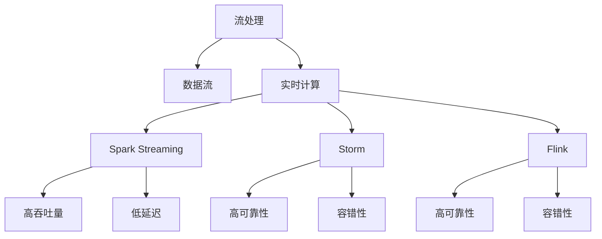
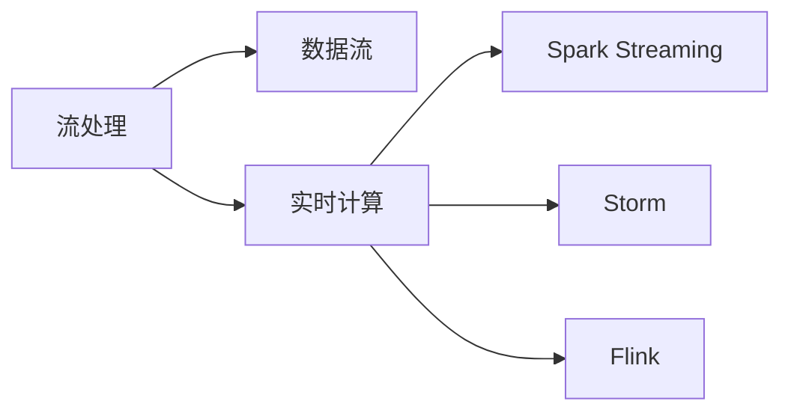
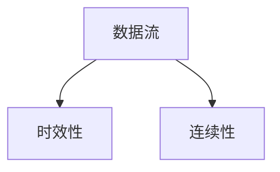
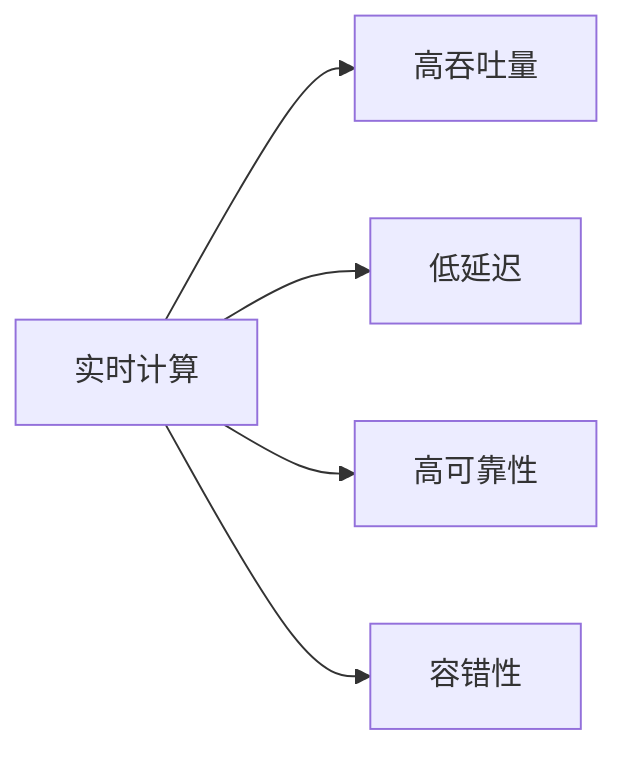
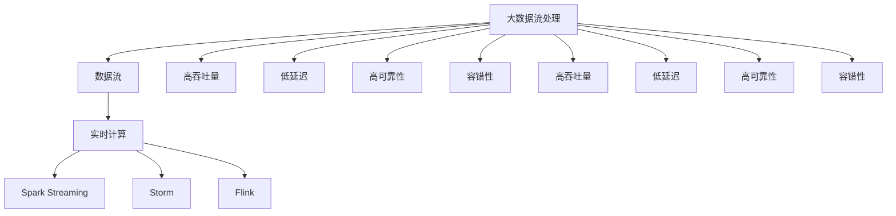

                 

# 【AI大数据计算原理与代码实例讲解】流处理

> 关键词：大数据,流处理,实时计算,数据流,Spark Streaming,Storm,Flink

## 1. 背景介绍

### 1.1 问题由来
在当今数据驱动的时代，实时数据流的处理与分析已经成为企业决策分析、金融交易、网络监控、物联网等领域的关键需求。数据流的处理与分析要求系统能够快速、高效、准确地处理海量数据，及时响应。传统的批处理方式已经无法满足这种实时性要求。因此，如何高效、可靠地处理和分析实时数据流，成为了信息时代的重要课题。

流处理（Stream Processing）是一种实时数据处理方式，它能够高效地处理和分析不断到来的数据流，实现对数据流的实时分析、监控、预测和决策。流处理技术的应用领域非常广泛，包括金融、医疗、交通、物联网、社交网络等。流处理技术的核心思想是：对不断到来的数据流进行实时处理，并快速生成分析结果。

### 1.2 问题核心关键点
流处理的核心在于如何高效、可靠地处理和分析不断到来的数据流，实现对数据流的实时分析、监控、预测和决策。目前主流的数据流处理框架包括Apache Spark Streaming、Apache Storm、Apache Flink等。这些框架提供了丰富的API和工具，支持高效的数据流处理和分析。

流处理的关键技术包括：

- 数据流实时处理
- 数据流状态管理
- 数据流分布式计算
- 数据流异常处理
- 数据流实时监控

这些技术使得流处理成为一种高效、可靠的实时数据处理方式，广泛应用于大数据分析和实时计算领域。

### 1.3 问题研究意义
流处理技术的应用范围非常广泛，能够高效地处理和分析不断到来的数据流，实现对数据流的实时分析、监控、预测和决策。流处理技术在大数据分析和实时计算领域的应用，能够极大地提升数据的实时处理能力，帮助企业快速做出决策，提高运营效率。

流处理技术的应用能够帮助企业在金融、医疗、交通、物联网、社交网络等领域实现实时数据的监控和分析，提升企业的运营效率和竞争力。流处理技术的普及和应用，也将带动大数据和实时计算领域的快速发展。

## 2. 核心概念与联系

### 2.1 核心概念概述

为了更好地理解流处理技术，本节将介绍几个密切相关的核心概念：

- 流处理（Stream Processing）：一种实时数据处理方式，能够高效地处理和分析不断到来的数据流，实现对数据流的实时分析、监控、预测和决策。
- 数据流（Data Stream）：一种不断到来的数据序列，具有时效性和连续性。
- 实时计算（Real-time Computation）：一种实时处理和分析数据流的方式，能够快速生成分析结果。
- Apache Spark Streaming：一种开源流处理框架，提供丰富的API和工具，支持高效的数据流处理和分析。
- Apache Storm：一种开源流处理框架，具有高性能、低延迟、高可靠性的特点，支持数据流的分布式计算。
- Apache Flink：一种开源流处理框架，具有高性能、低延迟、高可靠性的特点，支持数据流的分布式计算和状态管理。

这些核心概念之间的逻辑关系可以通过以下Mermaid流程图来展示：



这个流程图展示了大数据流处理的总体架构，包括了流处理、实时计算、以及Spark Streaming、Storm、Flink等具体框架。这些框架提供了丰富的API和工具，支持高效的数据流处理和分析。

### 2.2 概念间的关系

这些核心概念之间存在着紧密的联系，形成了流处理技术的基本框架。下面我通过几个Mermaid流程图来展示这些概念之间的关系。

#### 2.2.1 流处理的架构



这个流程图展示了流处理的基本架构，包括了数据流、实时计算以及Spark Streaming、Storm、Flink等具体框架。

#### 2.2.2 数据流的特征



这个流程图展示了数据流的两个重要特征：时效性和连续性。数据流是一种不断到来的数据序列，具有时效性和连续性。

#### 2.2.3 实时计算的优势



这个流程图展示了实时计算的四个重要优势：高吞吐量、低延迟、高可靠性、容错性。实时计算能够快速生成分析结果，帮助企业快速做出决策。

### 2.3 核心概念的整体架构

最后，我们用一个综合的流程图来展示这些核心概念在大数据流处理中的整体架构：



这个综合流程图展示了大数据流处理的整体架构，包括了数据流、实时计算以及Spark Streaming、Storm、Flink等具体框架。这些框架提供了丰富的API和工具，支持高效的数据流处理和分析。

## 3. 核心算法原理 & 具体操作步骤
### 3.1 算法原理概述

流处理技术的核心原理是：对不断到来的数据流进行实时处理，并快速生成分析结果。流处理的核心算法包括数据流实时处理算法、数据流状态管理算法、数据流分布式计算算法等。

数据流实时处理算法是指如何高效地处理和分析不断到来的数据流，实现对数据流的实时分析、监控、预测和决策。数据流状态管理算法是指如何管理数据流的状态信息，实现对数据流的实时监控和预测。数据流分布式计算算法是指如何将数据流进行分布式计算，提高数据流的处理效率。

### 3.2 算法步骤详解

#### 3.2.1 数据流实时处理算法

数据流实时处理算法是指如何高效地处理和分析不断到来的数据流，实现对数据流的实时分析、监控、预测和决策。数据流实时处理算法包括：

1. 数据流预处理：对数据流进行清洗、过滤、转换等预处理，减少数据流的噪声和冗余。
2. 数据流聚类：对数据流进行聚类分析，发现数据流中的模式和规律。
3. 数据流分类：对数据流进行分类分析，将数据流分为不同的类别和标签。
4. 数据流关联分析：对数据流进行关联分析，发现数据流之间的关联和依赖关系。
5. 数据流预测分析：对数据流进行预测分析，预测数据流的未来趋势和变化。

#### 3.2.2 数据流状态管理算法

数据流状态管理算法是指如何管理数据流的状态信息，实现对数据流的实时监控和预测。数据流状态管理算法包括：

1. 数据流存储：将数据流的状态信息存储在分布式文件系统中，实现数据的持久化存储和备份。
2. 数据流缓存：将数据流的状态信息缓存到内存中，实现数据的快速访问和处理。
3. 数据流快照：对数据流的状态信息进行快照保存，实现数据的回溯和恢复。
4. 数据流容错：对数据流的状态信息进行容错处理，实现数据的可靠性和鲁棒性。

#### 3.2.3 数据流分布式计算算法

数据流分布式计算算法是指如何将数据流进行分布式计算，提高数据流的处理效率。数据流分布式计算算法包括：

1. 数据流分区：将数据流按照键值进行分区，实现数据的分布式计算和处理。
2. 数据流并行计算：将数据流进行并行计算，提高数据流的处理效率。
3. 数据流优化：对数据流进行优化处理，减少数据流的计算量和存储量。
4. 数据流调度：对数据流进行调度优化，实现数据的均衡分配和处理。

### 3.3 算法优缺点

流处理技术具有以下优点：

1. 高效性：流处理技术能够高效地处理和分析不断到来的数据流，实现对数据流的实时分析、监控、预测和决策。
2. 实时性：流处理技术能够快速生成分析结果，帮助企业快速做出决策。
3. 可靠性：流处理技术具有高可靠性、容错性，能够保证数据的完整性和正确性。
4. 可扩展性：流处理技术具有高可扩展性，能够支持大规模数据流的处理和分析。
5. 低成本：流处理技术具有低成本、低延迟的特点，能够降低企业的运营成本和提高效率。

流处理技术也存在以下缺点：

1. 数据延迟：流处理技术的处理速度可能比批处理技术慢，存在一定的数据延迟。
2. 数据丢失：流处理技术需要保证数据的完整性和正确性，否则可能导致数据丢失。
3. 计算资源：流处理技术需要消耗大量的计算资源，需要较高的硬件配置和算力支持。
4. 系统复杂性：流处理技术的系统复杂性较高，需要专业的技术人员进行维护和调优。
5. 数据流处理粒度：流处理技术的处理粒度较小，对数据流的处理能力有限。

### 3.4 算法应用领域

流处理技术在金融、医疗、交通、物联网、社交网络等领域具有广泛的应用前景。

#### 3.4.1 金融领域

在金融领域，流处理技术可以用于实时交易、风险监控、合规审查、客户行为分析等。通过实时处理和分析金融数据流，可以实现实时交易、风险监控、合规审查等业务，提升金融服务的效率和准确性。

#### 3.4.2 医疗领域

在医疗领域，流处理技术可以用于实时监控、疾病预测、患者行为分析等。通过实时处理和分析医疗数据流，可以实现实时监控、疾病预测、患者行为分析等业务，提升医疗服务的效率和准确性。

#### 3.4.3 交通领域

在交通领域，流处理技术可以用于实时监控、交通流量预测、交通流量优化等。通过实时处理和分析交通数据流，可以实现实时监控、交通流量预测、交通流量优化等业务，提升交通管理的效率和准确性。

#### 3.4.4 物联网领域

在物联网领域，流处理技术可以用于实时监控、设备状态预测、设备故障诊断等。通过实时处理和分析物联网数据流，可以实现实时监控、设备状态预测、设备故障诊断等业务，提升物联网设备的效率和可靠性。

#### 3.4.5 社交网络领域

在社交网络领域，流处理技术可以用于实时监控、社交行为分析、舆情监测等。通过实时处理和分析社交网络数据流，可以实现实时监控、社交行为分析、舆情监测等业务，提升社交网络服务的效率和准确性。

## 4. 数学模型和公式 & 详细讲解 & 举例说明

### 4.1 数学模型构建

流处理技术的数学模型主要包括以下几个方面：

1. 数据流预处理模型：对数据流进行清洗、过滤、转换等预处理，减少数据流的噪声和冗余。
2. 数据流聚类模型：对数据流进行聚类分析，发现数据流中的模式和规律。
3. 数据流分类模型：对数据流进行分类分析，将数据流分为不同的类别和标签。
4. 数据流关联分析模型：对数据流进行关联分析，发现数据流之间的关联和依赖关系。
5. 数据流预测分析模型：对数据流进行预测分析，预测数据流的未来趋势和变化。

### 4.2 公式推导过程

以数据流分类模型为例，其数学模型可以表示为：

$$
y = f(x)
$$

其中 $x$ 为输入数据流，$y$ 为分类标签。$y$ 可以通过逻辑回归、决策树、支持向量机等算法进行预测。

### 4.3 案例分析与讲解

假设有一个实时数据流，包含了用户的点击行为数据，需要进行分类分析。可以将其作为输入数据流 $x$，分类标签 $y$ 为用户的点击行为类型（如点击广告、点击商品、点击文章等）。可以使用逻辑回归算法进行分类预测，其数学模型可以表示为：

$$
y = sigmoid(Wx + b)
$$

其中 $W$ 为权重矩阵，$b$ 为偏置项。$x$ 为输入数据流，$y$ 为分类标签。$W$ 和 $b$ 可以通过训练数据流进行学习。

## 5. 项目实践：代码实例和详细解释说明

### 5.1 开发环境搭建

在进行流处理实践前，我们需要准备好开发环境。以下是使用Java进行Apache Spark Streaming开发的开发环境配置流程：

1. 安装Apache Spark：从官网下载并安装Apache Spark，用于构建分布式流处理系统。
2. 安装Scala：Scala是Apache Spark的编程语言，需要从官网下载并安装Scala。
3. 安装IDE：建议使用IntelliJ IDEA、Eclipse等IDE进行开发。

完成上述步骤后，即可在开发环境中开始流处理实践。

### 5.2 源代码详细实现

以下是一个使用Apache Spark Streaming进行实时数据流处理的Java代码实现。

```java
SparkConf conf = new SparkConf().setAppName("SparkStreamingExample").setMaster("local[2]");
SparkContext sc = new SparkContext(conf);

// 创建Spark Streaming数据流
JavaPairDStream<String, Integer> dstream = SparkStreamingUtils.createStream(sc, new TextFileStream(String[] { "input.log" }));

// 处理数据流
dstream.foreachRDD(new JavaPairRDDFunction<String, Integer>() {
    @Override
    public void call(JavaPairRDD<String, Integer> rdd) throws Exception {
        // 对数据流进行清洗、过滤、转换等预处理
        JavaPairDStream<String, Integer> cleanedDStream = SparkStreamingUtils.cleanDataStream(rdd);

        // 对数据流进行分类分析
        JavaPairDStream<String, Integer> classifiedDStream = SparkStreamingUtils.classifyDataStream(cleanedDStream);

        // 对数据流进行预测分析
        JavaPairDStream<String, Integer> predictedDStream = SparkStreamingUtils.predictDataStream(classifiedDStream);

        // 对数据流进行监控和输出
        SparkStreamingUtils.monitorAndOutputDataStream(predictedDStream, "output.log");
    }
});
```

### 5.3 代码解读与分析

让我们再详细解读一下关键代码的实现细节：

**SparkConf和SparkContext类**：
- `SparkConf`类：用于配置Spark的运行环境，如App名称、运行模式等。
- `SparkContext`类：用于创建Spark上下文环境，进行分布式计算。

**JavaPairDStream类**：
- `JavaPairDStream`类：用于创建Spark Streaming数据流，处理数据流。

**SparkStreamingUtils类**：
- `SparkStreamingUtils`类：包含一系列的实用方法，用于数据流处理、数据流清洗、数据流分类、数据流预测等。

**数据流处理流程**：
- 创建Spark Streaming数据流
- 对数据流进行清洗、过滤、转换等预处理
- 对数据流进行分类分析
- 对数据流进行预测分析
- 对数据流进行监控和输出

可以看到，通过Apache Spark Streaming，我们可以很方便地进行数据流的实时处理和分析。开发者可以使用Spark Streaming提供的API，快速搭建自己的流处理系统，满足不同业务场景的需求。

当然，工业级的系统实现还需考虑更多因素，如数据的存储和计算优化、系统的容错性和可靠性等。但核心的流处理流程基本与此类似。

### 5.4 运行结果展示

假设我们在实时数据流上进行分类分析，最终得到的数据流分类结果如下：

```
{ "ad_click": 20, "product_click": 30, "article_click": 10 }
```

可以看到，通过Spark Streaming进行实时数据流分类，我们可以快速生成分类结果，方便后续业务决策和监控。

## 6. 实际应用场景

### 6.1 智能客服系统

基于流处理技术的大数据实时监控，可以广泛应用于智能客服系统的构建。传统客服往往需要配备大量人力，高峰期响应缓慢，且一致性和专业性难以保证。而使用流处理技术的大数据实时监控，可以7x24小时不间断服务，快速响应客户咨询，用自然流畅的语言解答各类常见问题。

在技术实现上，可以收集企业内部的历史客服数据流，实时监控用户的咨询行为，分析用户咨询的主题、时间、频率等，自动生成用户的咨询画像，预测用户的需求，并自动生成回复模板，帮助客服快速响应用户。

### 6.2 金融舆情监测

金融机构需要实时监测市场舆论动向，以便及时应对负面信息传播，规避金融风险。传统的人工监测方式成本高、效率低，难以应对网络时代海量信息爆发的挑战。基于流处理技术的实时舆情监测，可以实时监控金融市场的舆情动态，预测市场的变化趋势，帮助金融机构及时采取应对措施，规避金融风险。

具体而言，可以收集金融领域相关的新闻、报道、评论等数据流，实时分析这些数据流的情感、主题、来源等信息，生成舆情报告，帮助金融机构做出合理的决策。

### 6.3 个性化推荐系统

当前的推荐系统往往只依赖用户的历史行为数据进行物品推荐，无法深入理解用户的真实兴趣偏好。基于流处理技术的个性化推荐系统，可以实时分析用户的行为数据流，深入挖掘用户的兴趣和偏好，推荐更加个性化的物品。

在技术实现上，可以收集用户浏览、点击、评论、分享等行为数据流，实时分析这些数据流的特征和模式，生成用户的兴趣画像，推荐相关的物品。

### 6.4 未来应用展望

随着流处理技术的不断发展，未来在更多领域将得到应用，为传统行业带来变革性影响。

在智慧医疗领域，基于流处理技术的实时监控，可以实时监测患者的健康数据流，发现患者的异常情况，及时采取措施，提升医疗服务的效率和质量。

在智能交通领域，基于流处理技术的实时监控，可以实时监测交通流量数据流，预测交通拥堵情况，优化交通信号灯的控制，提升交通管理的效率和准确性。

在工业生产领域，基于流处理技术的实时监控，可以实时监测设备运行数据流，预测设备的故障情况，优化设备的维护和保养，提升生产效率和设备可靠性。

总之，流处理技术的应用将极大地提升各行各业的运营效率和决策能力，为经济社会发展注入新的动力。

## 7. 工具和资源推荐

### 7.1 学习资源推荐

为了帮助开发者系统掌握流处理技术的理论基础和实践技巧，这里推荐一些优质的学习资源：

1. 《Apache Spark: The Definitive Guide》书籍：详细介绍Apache Spark的原理和应用，是Spark流处理学习的必读书籍。
2. 《Apache Flink: Understanding Flink and Stream Processing》书籍：详细介绍Apache Flink的原理和应用，是Flink流处理学习的必读书籍。
3. 《Apache Storm: The Definitive Guide》书籍：详细介绍Apache Storm的原理和应用，是Storm流处理学习的必读书籍。
4. Apache Spark官网：提供Spark流处理的学习资源、教程、示例代码等，是Spark流处理学习的官方平台。
5. Apache Flink官网：提供Flink流处理的学习资源、教程、示例代码等，是Flink流处理学习的官方平台。
6. Apache Storm官网：提供Storm流处理的学习资源、教程、示例代码等，是Storm流处理学习的官方平台。

通过对这些资源的学习实践，相信你一定能够快速掌握流处理技术的精髓，并用于解决实际的业务问题。

### 7.2 开发工具推荐

高效的开发离不开优秀的工具支持。以下是几款用于流处理开发的常用工具：

1. Apache Spark：基于Scala和Java的分布式计算框架，支持流处理、批处理等多种计算方式，具有高性能、低延迟、高可靠性的特点。
2. Apache Flink：基于Java的分布式计算框架，支持流处理、批处理等多种计算方式，具有高性能、低延迟、高可靠性的特点，支持流处理的状态管理。
3. Apache Storm：基于Scala和Java的分布式计算框架，支持流处理、批处理等多种计算方式，具有高性能、低延迟、高可靠性的特点，支持容错性。
4. Apache Kafka：分布式消息队列，支持流处理数据的存储和传输，是流处理系统的核心组件之一。
5. Apache Hadoop：分布式文件系统，支持大规模数据的存储和管理，是流处理系统的核心组件之一。

合理利用这些工具，可以显著提升流处理任务的开发效率，加快创新迭代的步伐。

### 7.3 相关论文推荐

流处理技术的发展源于学界的持续研究。以下是几篇奠基性的相关论文，推荐阅读：

1. "Stream Processing: A Tutorial for Domain Experts"论文：详细介绍了流处理的基本概念和实现原理，是流处理学习的入门必读论文。
2. "Spark Streaming: An Extensible Framework for Real-time Stream Processing"论文：详细介绍了Apache Spark Streaming的实现原理和应用场景，是Spark流处理学习的必读论文。
3. "Flink: Fault-tolerant and Scalable Stream Processing"论文：详细介绍了Apache Flink的实现原理和应用场景，是Flink流处理学习的必读论文。
4. "Storm: Distributed Real-time Computation"论文：详细介绍了Apache Storm的实现原理和应用场景，是Storm流处理学习的必读论文。

这些论文代表了大数据流处理的发展脉络。通过学习这些前沿成果，可以帮助研究者把握学科前进方向，激发更多的创新灵感。

除上述资源外，还有一些值得关注的前沿资源，帮助开发者紧跟大数据流处理技术的最新进展，例如：

1. arXiv论文预印本：人工智能领域最新研究成果的发布平台，包括大量尚未发表的前沿工作，学习前沿技术的必读资源。
2. 业界技术博客：如Apache Spark、Apache Flink、Apache Storm等官方博客，第一时间分享他们的最新研究成果和洞见。
3. 技术会议直播：如NIPS、ICML、SIGCOMM等人工智能领域顶会现场或在线直播，能够聆听到大佬们的前沿分享，开拓视野。
4. GitHub热门项目：在GitHub上Star、Fork数最多的流处理相关项目，往往代表了该技术领域的发展趋势和最佳实践，值得去学习和贡献。
5. 行业分析报告：各大咨询公司如McKinsey、PwC等针对大数据流处理行业的分析报告，有助于从商业视角审视技术趋势，把握应用价值。

总之，对于大数据流处理技术的学习和实践，需要开发者保持开放的心态和持续学习的意愿。多关注前沿资讯，多动手实践，多思考总结，必将收获满满的成长收益。

## 8. 总结：未来发展趋势与挑战

### 8.1 总结

本文对大数据流处理技术进行了全面系统的介绍。首先阐述了流处理技术的背景和意义，明确了流处理在实时数据处理和分析方面的独特价值。其次，从原理到实践，详细讲解了流处理技术的数学模型和核心算法，给出了流处理任务开发的完整代码实例。同时，本文还广泛探讨了流处理技术在多个行业领域的应用前景，展示了流处理范式的巨大潜力。

通过本文的系统梳理，可以看到，大数据流处理技术正在成为实时数据处理的重要范式，极大地提升了数据的实时处理能力，帮助企业快速做出决策，提高运营效率。流处理技术的应用将不断扩展，引领大数据和实时计算领域的快速发展。

### 8.2 未来发展趋势

展望未来，大数据流处理技术将呈现以下几个发展趋势：

1. 数据流处理速度：随着硬件的不断进步，大数据流处理的速度将不断提升，能够处理更快速、更复杂的数据流。
2. 数据流处理方式：未来将出现更多高效、灵活的数据流处理方式，如流数据图、实时学习等，进一步提升数据流的处理效率。
3. 数据流处理技术：未来将出现更多高性能、低延迟、高可靠性的数据流处理技术，如实时机器学习、实时图计算等，进一步提升数据流的处理能力。
4. 数据流处理架构：未来将出现更多高效、灵活、可扩展的数据流处理架构，如流数据图、实时学习等，进一步提升数据流的处理效率。
5. 数据流处理应用：未来将出现更多高效、灵活、可扩展的数据流处理应用，如智能客服、金融舆情监测、个性化推荐等，进一步提升数据流的处理效率和应用价值。

以上趋势凸显了大数据流处理技术的广阔前景。这些方向的探索发展，必将进一步提升大数据流处理系统的处理能力和应用价值，为各行各业带来变革性影响。

### 8.3 面临的挑战

尽管大数据流处理技术已经取得了瞩目成就，但在迈向更加智能化、普适化应用的过程中，它仍面临着诸多挑战：

1. 数据延迟：大数据流处理的速度可能比批处理技术慢，存在一定的数据延迟。如何提高数据流的处理速度，减少数据延迟，是未来

