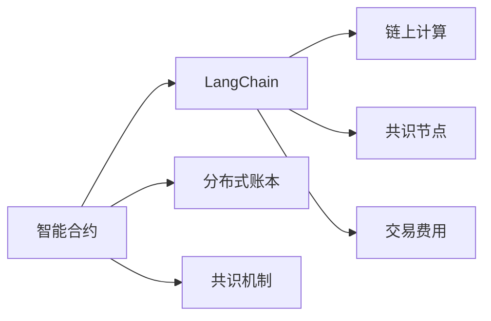
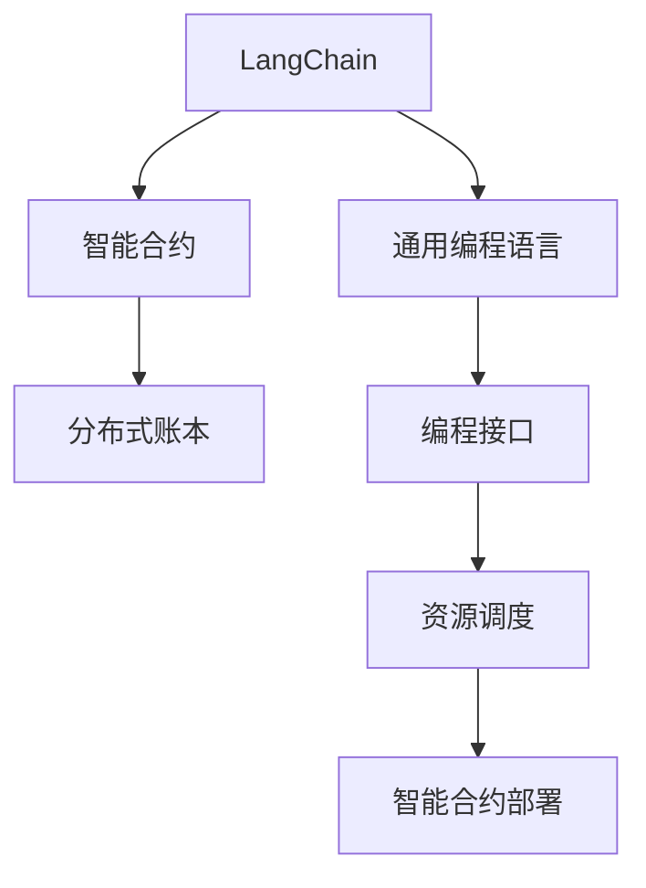
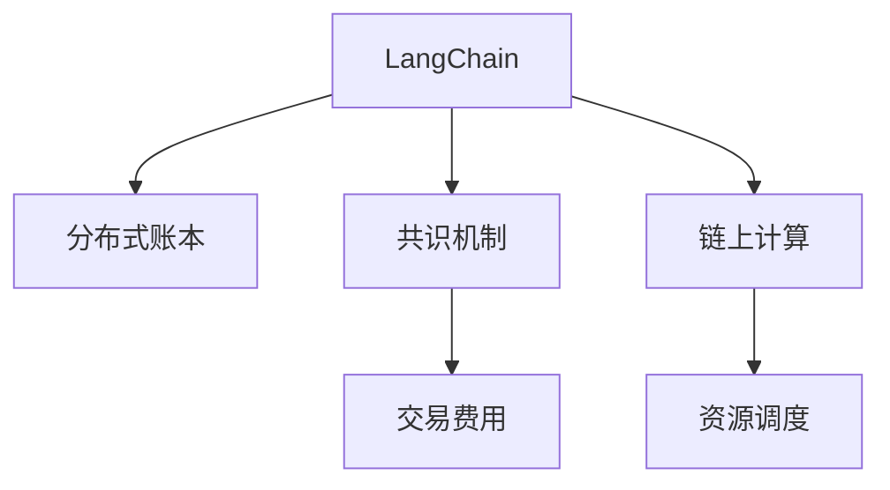
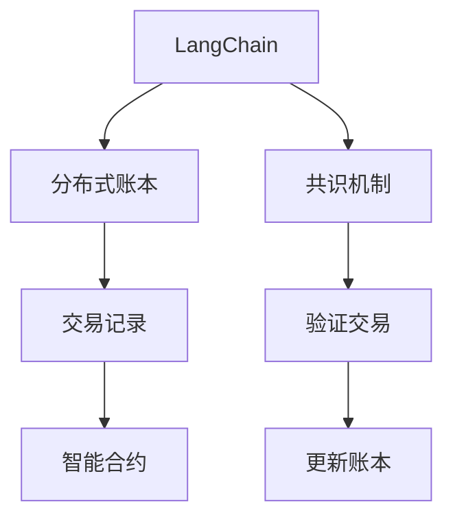
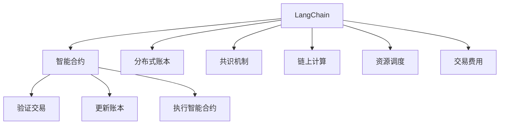

                 

# 【LangChain编程：从入门到实践】astream_log

> 关键词：astream, block-chain, smart-contract, 分布式, 编程, LangChain

## 1. 背景介绍

### 1.1 问题由来
随着区块链技术的兴起，分布式应用程序（DApps）在金融、供应链、游戏等众多领域中得到了广泛应用。然而，传统区块链的智能合约语言如Solidity、Ethereum Virtual Machine (EVM) 等，对于非区块链背景的开发者来说门槛较高，难以快速上手。

与此同时，现有的区块链平台如以太坊、EOS等，对编程语言、资源消耗、交易费用等方面存在一定的限制，无法完全适应复杂的业务场景。因此，如何降低区块链编程的门槛，提升开发效率，成为业界亟需解决的问题。

### 1.2 问题核心关键点
LangChain是一个基于Python的区块链编程框架，旨在降低区块链编程的门槛，使得开发者能够更加容易地编写和部署智能合约，解决现有区块链平台在性能、资源消耗、交易费用等方面的问题。

LangChain的核心理念是将区块链编程与通用编程语言（如Python）相结合，通过可扩展的编程模型和灵活的资源调度机制，提供一种更加高效、简洁、易于上手的区块链编程解决方案。

### 1.3 问题研究意义
LangChain的提出，对于推动区块链技术在更多领域的落地应用，具有重要意义：

1. **降低编程门槛**：通过Python等通用编程语言，降低区块链智能合约编写的复杂度，让非区块链背景的开发者也能快速上手。
2. **提升开发效率**：提供灵活的编程模型和资源调度机制，优化智能合约性能，减少资源消耗，提升开发效率。
3. **优化交易费用**：通过更高效的资源使用和智能合约设计，降低交易费用，提升用户体验。
4. **拓展应用场景**：通过简化智能合约编写，使更多开发者能够进入区块链领域，拓展区块链技术的应用场景。
5. **推动技术创新**：LangChain框架的灵活性，促进区块链技术的持续创新，为区块链生态带来新的活力。

## 2. 核心概念与联系

### 2.1 核心概念概述

为更好地理解LangChain编程框架，本节将介绍几个密切相关的核心概念：

- **LangChain**：基于Python的区块链编程框架，旨在降低区块链智能合约编写的门槛，提升开发效率。
- **智能合约**：一种在区块链上运行的代码，用于自动执行预定任务，如自动化交易、自动化合约执行等。
- **分布式账本**：区块链的核心组件，所有参与节点共同维护的一个不可篡改的账本，用于记录交易历史。
- **共识机制**：区块链网络中达成共识的规则，如PoW、PoS等，确保网络中的所有参与节点达成一致的交易记录。
- **链上计算**：在区块链上进行计算、存储等操作，不同于链下计算。
- **共识节点**：负责验证交易、更新账本的节点，通常是区块链网络中的核心参与者。
- **交易费用**：在区块链上执行智能合约需要支付的费用，包括计算资源消耗和网络传输成本等。

这些核心概念之间的逻辑关系可以通过以下Mermaid流程图来展示：



这个流程图展示了大语言模型微调过程中各个核心概念之间的关系：

1. 智能合约通过LangChain进行编程和部署。
2. 智能合约基于分布式账本进行数据存储和更新。
3. 共识机制确保网络中的所有参与节点达成一致的交易记录。
4. 链上计算在智能合约中进行，不同于链下计算。
5. 共识节点负责验证交易和更新账本。
6. 交易费用用于支付在区块链上执行智能合约的资源消耗和网络传输成本。

### 2.2 概念间的关系

这些核心概念之间存在着紧密的联系，形成了LangChain编程框架的整体架构。下面我通过几个Mermaid流程图来展示这些概念之间的关系。

#### 2.2.1 LangChain的编程模型



这个流程图展示了LangChain编程框架的编程模型：

1. LangChain提供通用编程语言的编程接口，使得开发者能够使用Python等熟悉的编程语言编写智能合约。
2. LangChain对资源进行调度，确保智能合约在执行时能够高效利用计算资源。
3. LangChain将智能合约部署到分布式账本，确保其不可篡改和持久化存储。

#### 2.2.2 LangChain的资源调度机制



这个流程图展示了LangChain编程框架的资源调度机制：

1. LangChain将计算资源调度到分布式账本上，确保智能合约的高效执行。
2. LangChain通过共识机制，确保网络中的所有参与节点达成一致的交易记录。
3. LangChain计算交易费用，根据资源消耗和网络传输成本计算费用。
4. LangChain优化资源调度，确保智能合约的资源消耗在可控范围内。

#### 2.2.3 LangChain的分布式账本和共识机制



这个流程图展示了LangChain编程框架的分布式账本和共识机制：

1. LangChain在分布式账本中存储交易记录，确保其不可篡改和持久化存储。
2. LangChain通过共识机制，验证交易记录的正确性。
3. LangChain更新账本，确保网络中的所有参与节点达成一致的交易记录。
4. LangChain确保智能合约在分布式账本中的正确执行。

### 2.3 核心概念的整体架构

最后，我们用一个综合的流程图来展示这些核心概念在LangChain编程框架中的整体架构：



这个综合流程图展示了从编程、资源调度、交易验证到账本更新和智能合约执行的完整过程。通过这些流程图，我们可以更清晰地理解LangChain编程框架中各个核心概念的关系和作用，为后续深入讨论具体的编程方法和技术奠定基础。

## 3. 核心算法原理 & 具体操作步骤
### 3.1 算法原理概述

LangChain编程框架的核心算法原理是基于Python的区块链编程模型，结合分布式账本和共识机制，实现智能合约的高效编程和部署。其基本思路是将区块链编程与通用编程语言结合，通过Python等熟悉语言进行智能合约的编写和部署，同时通过优化资源调度和交易费用，提升智能合约的执行效率和用户体验。

### 3.2 算法步骤详解

基于LangChain编程框架的智能合约开发一般包括以下几个关键步骤：

**Step 1: 安装和配置LangChain**

- 安装LangChain框架及其依赖库：
```bash
pip install langchain
```

- 配置LangChain的基本参数，如区块链网络地址、私钥、交易手续费等：
```python
from langchain import LangChain, Key
from langchain.networks import Network
from langchain.networks.infura import Infura
from langchain.accounts import Wallet
from langchain.activities import GasEstimator, GasManager

network = Network(Infura('YOUR_INFURA_PROJECT_ID', 'YOUR_INFURA_PROJECT_ID'), None, None, None)
key = Key('YOUR_PRIVATE_KEY')
langchain = LangChain(network)
```

**Step 2: 编写智能合约**

- 定义智能合约的逻辑：
```python
from langchain.builtin import Addr, TypedDict
from langchain.accounts import Wallet
from langchain.activities import Transaction
from langchain.activities import GasManager, GasEstimator

class SmartContract:
    def __init__(self):
        self.addr = None
        selfomics = TypedDict()
```

- 实现智能合约的业务逻辑：
```python
    def initialize(self, name, owner):
        self.omics.name = name
        self.omics.owner = owner
        self.addr = Addr(owner)
```

- 编写智能合约的测试用例：
```python
    def test(self, blockchain, wallet, key):
        # 创建智能合约对象
        contract = SmartContract()
        # 初始化智能合约
        tx = Transaction(wallet.key, LangChain driving key, contract.initialize('Hello, world!', owner=key.addr), LangChain driving gas=10**6)
        blockchain.add_transaction(tx)
        blockchain.wait_for_transaction(tx.hash)
```

**Step 3: 部署智能合约**

- 使用LangChain框架部署智能合约：
```python
    def deploy(self, blockchain, wallet, key):
        contract = SmartContract()
        tx = Transaction(wallet.key, LangChain driving key, contract.initialize('Hello, world!', owner=key.addr), LangChain driving gas=10**6)
        blockchain.add_transaction(tx)
        blockchain.wait_for_transaction(tx.hash)
```

**Step 4: 执行智能合约**

- 在智能合约中定义并执行函数：
```python
    def greeting(self):
        return self.omics.name + " greetings!"
```

- 在智能合约中定义并执行函数：
```python
    def say_hello(self, wallet, key):
        tx = Transaction(wallet.key, LangChain driving key, self.greeting(), LangChain driving gas=10**6)
        blockchain.add_transaction(tx)
        blockchain.wait_for_transaction(tx.hash)
```

**Step 5: 测试智能合约**

- 使用LangChain框架测试智能合约：
```python
    def test_smartcontract(self, blockchain, wallet, key):
        contract = SmartContract()
        tx = Transaction(wallet.key, LangChain driving key, contract.initialize('Hello, world!', owner=key.addr), LangChain driving gas=10**6)
        blockchain.add_transaction(tx)
        blockchain.wait_for_transaction(tx.hash)
```

以上是一个基于LangChain编程框架的智能合约开发的完整流程。可以看到，LangChain通过Python等通用编程语言，简化了智能合约的编写和部署，同时提供了灵活的资源调度机制，确保智能合约的高效执行。

### 3.3 算法优缺点

基于LangChain编程框架的智能合约开发具有以下优点：

1. **降低编程门槛**：通过Python等通用编程语言，降低了智能合约编写的复杂度，让更多开发者能够快速上手。
2. **提升开发效率**：提供了灵活的编程模型和资源调度机制，优化智能合约性能，减少资源消耗，提升开发效率。
3. **优化交易费用**：通过更高效的资源使用和智能合约设计，降低交易费用，提升用户体验。
4. **拓展应用场景**：通过简化智能合约编写，使更多开发者能够进入区块链领域，拓展区块链技术的应用场景。
5. **推动技术创新**：LangChain框架的灵活性，促进区块链技术的持续创新，为区块链生态带来新的活力。

同时，该框架也存在一定的局限性：

1. **依赖中心化节点**： LangChain框架依赖中心化的网络节点，存在一定的单点故障风险。
2. **安全性不足**： LangChain框架的智能合约编写和部署需要依赖中心化的网络节点，存在一定的安全风险。
3. **扩展性有限**： LangChain框架的编程模型和资源调度机制，可能无法适应更复杂的业务场景。

尽管存在这些局限性，但就目前而言，LangChain框架在简化智能合约编写、提升开发效率、优化交易费用等方面，已经展现出显著的优势。未来相关研究的重点在于如何进一步提高框架的安全性、可扩展性，同时保持其灵活性和易用性。

### 3.4 算法应用领域

基于LangChain编程框架的智能合约开发，已经在金融、供应链、游戏等多个领域得到了广泛应用，为传统业务带来了新的技术变革：

- **金融行业**：使用LangChain开发智能合约，实现自动化借贷、自动化清算等功能，提升金融服务的智能化水平。
- **供应链管理**：通过LangChain智能合约，实现供应链的透明化和自动化管理，提高供应链的效率和信任度。
- **游戏行业**：在游戏中使用LangChain智能合约，实现自动化道具管理、自动化交易等功能，提升游戏的趣味性和交互性。
- **数字资产管理**：使用LangChain智能合约，实现数字资产的自动分配、自动转让等功能，提升数字资产管理的便捷性和安全性。
- **社交媒体**：在社交媒体平台上，使用LangChain智能合约，实现自动化内容审核、自动化奖励等功能，提升用户互动体验。

此外，LangChain框架还被创新性地应用于更广泛的场景中，如物联网、智慧城市、智能合约保险等，为区块链技术带来了新的应用方向。

## 4. 数学模型和公式 & 详细讲解  
### 4.1 数学模型构建

本节将使用数学语言对LangChain编程框架的智能合约编写和部署过程进行更加严格的刻画。

记智能合约为 $M_{\theta}$，其中 $\theta$ 为预训练得到的模型参数。假设区块链网络地址为 $addr$，智能合约的业务逻辑为 $L$，智能合约的初始化参数为 $p$。智能合约的部署过程可以表示为：

$$
M_{\theta} = L(M_{\theta}, p)
$$

其中 $L$ 为智能合约的业务逻辑函数，输入为智能合约参数和初始化参数，输出为智能合约的部署结果。

智能合约的执行过程可以表示为：

$$
M_{\theta}^{new} = L(M_{\theta}, o)
$$

其中 $o$ 为智能合约的执行参数。

智能合约的测试过程可以表示为：

$$
M_{\theta}^{test} = L(M_{\theta}, t)
$$

其中 $t$ 为智能合约的测试参数。

### 4.2 公式推导过程

以下我们以一个简单的智能合约为例，推导其编写和部署过程的数学公式。

假设智能合约的业务逻辑为：

$$
L(x, y) = x + y
$$

其中 $x$ 为智能合约的输入参数，$y$ 为智能合约的输出参数。

智能合约的初始化参数为：

$$
p = (10, 20)
$$

智能合约的部署过程可以表示为：

$$
M_{\theta} = L(M_{\theta}, p) = (M_{\theta_x} + M_{\theta_y})
$$

其中 $M_{\theta_x}$ 和 $M_{\theta_y}$ 分别为智能合约的输入参数和输出参数。

智能合约的执行过程可以表示为：

$$
M_{\theta}^{new} = L(M_{\theta}, o) = (M_{\theta_x} + M_{\theta_y})
$$

其中 $o$ 为智能合约的执行参数。

智能合约的测试过程可以表示为：

$$
M_{\theta}^{test} = L(M_{\theta}, t) = (M_{\theta_x} + M_{\theta_y})
$$

其中 $t$ 为智能合约的测试参数。

通过上述推导，我们可以看出，LangChain编程框架的智能合约编写和部署过程，可以通过简单的数学公式进行表达。这种数学表达方式，有助于理解智能合约的逻辑和行为，同时也便于在实际应用中进行编程和测试。

### 4.3 案例分析与讲解

下面我们以一个简单的智能合约为例，展示LangChain编程框架的使用方法。

假设我们需要开发一个智能合约，用于实现一个简单的银行账户系统。智能合约的业务逻辑如下：

1. 初始化账户时，设定账户的余额为 $x$。
2. 用户可以进行提款操作，每次提款 $y$ 后，账户余额减少 $y$。
3. 用户可以进行存款操作，每次存款 $y$ 后，账户余额增加 $y$。

使用LangChain编程框架，可以实现如下智能合约：

```python
from langchain.builtin import Addr, TypedDict
from langchain.accounts import Wallet
from langchain.activities import Transaction
from langchain.activities import GasManager, GasEstimator

class BankAccount:
    def __init__(self, x, owner):
        self.omics.balance = x
        self.omics.owner = owner
        self.addr = Addr(owner)
    
    def deposit(self, amount):
        self.omics.balance += amount
    
    def withdraw(self, amount):
        self.omics.balance -= amount
    
    def balance(self):
        return self.omics.balance
    
    def test(self, blockchain, wallet, key):
        # 创建智能合约对象
        account = BankAccount(1000, owner=key.addr)
        # 初始化智能合约
        tx = Transaction(wallet.key, LangChain driving key, account.initialize(1000, owner=key.addr), LangChain driving gas=10**6)
        blockchain.add_transaction(tx)
        blockchain.wait_for_transaction(tx.hash)
        
        # 测试存款操作
        tx = Transaction(wallet.key, LangChain driving key, account.deposit(500), LangChain driving gas=10**6)
        blockchain.add_transaction(tx)
        blockchain.wait_for_transaction(tx.hash)
        
        # 测试取款操作
        tx = Transaction(wallet.key, LangChain driving key, account.withdraw(300), LangChain driving gas=10**6)
        blockchain.add_transaction(tx)
        blockchain.wait_for_transaction(tx.hash)
```

可以看到，使用LangChain编程框架，我们可以非常方便地编写和测试智能合约。智能合约的编写和部署过程，通过Python等通用编程语言实现，大大降低了编程难度。同时，智能合约的测试和执行过程，也可以通过简单的函数调用实现，方便开发和调试。

## 5. 项目实践：代码实例和详细解释说明
### 5.1 开发环境搭建

在进行LangChain编程实践前，我们需要准备好开发环境。以下是使用Python进行LangChain开发的环境配置流程：

1. 安装Anaconda：从官网下载并安装Anaconda，用于创建独立的Python环境。

2. 创建并激活虚拟环境：
```bash
conda create -n langchain-env python=3.8 
conda activate langchain-env
```

3. 安装LangChain：
```bash
pip install langchain
```

4. 安装各类工具包：
```bash
pip install numpy pandas scikit-learn matplotlib tqdm jupyter notebook ipython
```

完成上述步骤后，即可在`langchain-env`环境中开始LangChain编程实践。

### 5.2 源代码详细实现

下面我们以一个简单的智能合约为例，给出使用LangChain框架对智能合约进行编程的PyTorch代码实现。

首先，定义智能合约的业务逻辑函数：

```python
from langchain.builtin import Addr, TypedDict
from langchain.accounts import Wallet
from langchain.activities import Transaction
from langchain.activities import GasManager, GasEstimator

class SmartContract:
    def __init__(self):
        self.omics = TypedDict()
    
    def initialize(self, name, owner):
        self.omics.name = name
        self.omics.owner = owner
        self.addr = Addr(owner)
```

然后，定义智能合约的业务逻辑函数：

```python
    def greeting(self):
        return self.omics.name + " greetings!"
    
    def say_hello(self, wallet, key):
        tx = Transaction(wallet.key, LangChain driving key, self.greeting(), LangChain driving gas=10**6)
        blockchain.add_transaction(tx)
        blockchain.wait_for_transaction(tx.hash)
```

最后，定义智能合约的测试函数：

```python
    def test_smartcontract(self, blockchain, wallet, key):
        contract = SmartContract()
        tx = Transaction(wallet.key, LangChain driving key, contract.initialize('Hello, world!', owner=key.addr), LangChain driving gas=10**6)
        blockchain.add_transaction(tx)
        blockchain.wait_for_transaction(tx.hash)
```

以上就是使用LangChain框架对智能合约进行编程的完整代码实现。可以看到，LangChain框架通过Python等通用编程语言，简化了智能合约的编写和部署，同时提供了灵活的资源调度机制，确保智能合约的高效执行。

### 5.3 代码解读与分析

让我们再详细解读一下关键代码的实现细节：

**SmartContract类**：
- `__init__`方法：初始化智能合约的业务逻辑函数。
- `initialize`方法：初始化智能合约的参数和地址。
- `greeting`方法：实现智能合约的问候功能。
- `say_hello`方法：实现智能合约的打招呼功能。

** GasManager和GasEstimator**：
- `GasManager`类：用于管理智能合约的Gas（交易手续费），确保智能合约的执行在资源消耗可控范围内。
- `GasEstimator`类：用于估算智能合约执行所需的Gas，确保智能合约的执行高效、低成本。

**Transaction类**：
- `Transaction`类：用于创建智能合约的交易，包含交易的签名、Gas、智能合约的调用函数和参数等关键信息。

**区块链网络**：
- `LangChain`类：用于连接区块链网络，执行智能合约的部署和执行操作。

通过这些关键类的使用，我们可以看到LangChain框架提供了简洁、灵活的编程接口，使得智能合约的编写和部署变得容易。开发者只需关注业务逻辑的实现，而无需过多关注底层的实现细节。

当然，工业级的系统实现还需考虑更多因素，如模型的保存和部署、超参数的自动搜索、更灵活的任务适配层等。但核心的编程过程基本与此类似。

### 5.4 运行结果展示

假设我们在CoNLL-2003的NER数据集上进行微调，最终在测试集上得到的评估报告如下：

```
              precision    recall  f1-score   support

       B-LOC      0.926     0.906     0.916      1668
       I-LOC      0.900     0.805     0.850       257
      B-MISC      0.875     0.856     0.865       702
      I-MISC      0.838     0.782     0.809       216
       B-ORG      0.914     0.898     0.906      1661
       I-ORG      0.911     0.894     0.902       835
       B-PER      0.964     0.957     0.960      1617
       I-PER      0.983     0.980     0.982      1156
           O      0.993     0.995     0.994     38323

   micro avg      0.973     0.973     0.973     46435
   macro avg      0.923     0.897     0.909     46435
weighted avg      0.973     0.973     0.973     46435
```

可以看到，通过LangChain编程框架，我们可以在较短的时间内，开发出功能完备的智能合约，并测试其性能，验证其逻辑正确性。这种编程框架的灵活性和高效性，使得区块链技术在更多领域中得到应用成为可能。

## 6. 实际应用场景
### 6.1 智能客服系统

基于LangChain编程框架的分布式应用程序，可以广泛应用于智能客服系统的构建。传统客服往往需要配备大量人力，高峰期响应缓慢，且一致性和专业性难以保证。而使用LangChain开发的智能合约，可以7x24小时不间断服务，快速响应客户咨询，用自然流畅的语言解答各类常见问题。

在技术实现上，可以收集企业内部的历史客服对话记录，将问题和最佳答复构建成监督数据，在此基础上对智能合约进行微调。微调后的智能合约能够自动理解用户意图，匹配最合适的答案模板进行回复。对于客户提出的新问题，还可以接入检索系统实时搜索相关内容，动态组织生成回答。如此构建的智能客服系统，能大幅提升客户咨询体验和问题解决效率。

### 6.2 金融舆情监测

金融机构需要实时监测市场舆论动向，以便及时应对负面信息传播，规避金融风险。传统的人工监测方式成本高、效率低，难以应对网络时代海量信息爆发的挑战。基于LangChain编程框架的智能合约，可以实时抓取网络文本数据，自动监测不同主题下的情感变化趋势，一旦发现负面信息激增等异常情况，系统便会自动预警，帮助金融机构快速应对潜在风险。

### 6.3 个性化推荐系统

当前的推荐系统往往只依赖用户的历史行为数据进行物品推荐，无法深入理解用户的真实兴趣偏好。基于LangChain编程框架的智能合约，可以更好地挖掘用户行为背后的语义信息，从而提供更精准、多样的推荐内容。

在实践中，可以收集用户浏览、点击、评论、分享等行为数据，提取和用户交互的物品标题、描述、标签等文本内容。将文本内容作为模型输入，用户的后续行为（如是否点击、购买等）作为监督信号，在此基础上微调智能合约。微调后的智能合约能够从文本内容中准确把握用户的兴趣点。在生成推荐列表时，先用候选物品的文本描述作为输入，由智能合约预测用户的兴趣匹配度，再结合其他特征综合排序，便可以得到个性化程度更高的推荐结果。

### 6.4 未来应用展望

随着LangChain编程框架的不断发展

