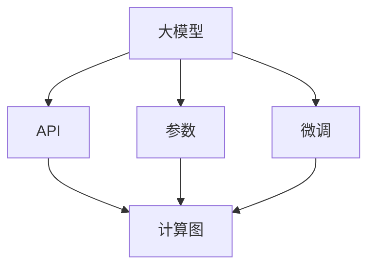
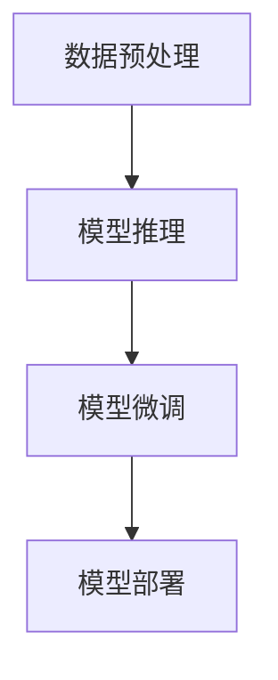

                 

# 【LangChain编程：从入门到实践】大模型接口

## 1. 背景介绍

### 1.1 问题由来
随着人工智能技术的不断发展和应用，大模型（Large Models）在自然语言处理（NLP）、计算机视觉（CV）、语音识别（ASR）等领域取得了显著的进展。例如，OpenAI的GPT系列、Google的BERT、Facebook的RoBERTa等大模型已经在各种任务中表现出色。

然而，大模型的接口设计并不简单。不同的模型接口存在差异，开发者需要熟悉不同模型的API和参数设置。对于入门级开发者，这一过程可能令人望而却步。因此，为了帮助新手更好地掌握大模型的使用，本文将详细介绍如何从入门到实践地编写大模型接口。

### 1.2 问题核心关键点
大模型接口的核心关键点包括：
- **模型选择**：选择适合自己任务的大模型。
- **接口规范**：理解不同模型的API和参数设置。
- **数据预处理**：如何准备输入数据，进行必要的预处理。
- **模型训练和微调**：如何进行模型训练和微调，以达到最佳性能。
- **部署和应用**：如何将训练好的模型部署到生产环境中，应用到实际任务中。

本文将系统地讲解以上各个方面，并提供相应的代码实例和解释说明，帮助读者全面掌握大模型接口的编写与实践。

### 1.3 问题研究意义
掌握大模型的接口设计，对于开发者快速搭建高效、可扩展的人工智能系统具有重要意义。具体而言：
- **提高开发效率**：理解大模型接口，可以减少调试时间和错误率，加速开发进程。
- **降低学习成本**：系统地学习大模型接口设计，可以帮助新手更好地入门。
- **提升模型性能**：合理的数据预处理和微调策略，可以提高模型在特定任务上的表现。
- **支持大规模部署**：将训练好的模型部署到生产环境中，可以服务于更广泛的业务需求。

## 2. 核心概念与联系

### 2.1 核心概念概述

在讲解大模型接口设计前，需要了解一些核心概念：

- **大模型（Large Models）**：如GPT、BERT等，通常以Transformer架构为基础，具有数百亿个参数。
- **API（Application Programming Interface）**：不同模型提供的接口规范，用于调用模型执行推理、微调等操作。
- **参数（Parameters）**：模型的可训练权重和偏置，通过梯度下降等优化算法更新。
- **微调（Fine-Tuning）**：在预训练模型的基础上，使用下游任务的少量标注数据进行有监督的优化，提高模型在特定任务上的性能。
- **预训练（Pre-training）**：在大规模无标签数据上进行的自监督学习，训练模型提取特征的能力。
- **计算图（Computation Graph）**：描述模型推理过程的图结构，用于自动微分和反向传播。
- **训练数据（Training Data）**：用于训练模型的标注数据集，对模型性能有直接影响。

### 2.2 核心概念之间的关系

这些核心概念构成了大模型接口设计的整体框架，它们之间的关系可以用以下Mermaid流程图表示：



这个流程图展示了从大模型的预训练到微调，再到通过API进行推理的全过程。

## 3. 核心算法原理 & 具体操作步骤
### 3.1 算法原理概述
大模型的接口设计主要涉及以下几个步骤：
1. **数据预处理**：将输入数据转换为模型所需的格式。
2. **模型推理**：通过API调用模型执行推理。
3. **模型微调**：在预训练模型的基础上，使用下游任务的少量标注数据进行有监督的优化。
4. **模型部署**：将训练好的模型部署到生产环境中。

这些步骤可以通过以下算法流程概括：



### 3.2 算法步骤详解
#### 3.2.1 数据预处理

数据预处理是使用大模型的第一步，其目的是将原始数据转换为模型可以处理的格式。具体步骤包括：

1. **分词和编码**：将文本数据进行分词，使用分词器将其转换为模型可以处理的编码序列。
2. **数据填充**：对编码序列进行填充或截断，确保所有序列的长度一致。
3. **构建批次**：将多个序列组成批次，进行并行计算。

下面以使用Hugging Face的BERT模型为例，展示数据预处理的代码实现：

```python
from transformers import BertTokenizer

tokenizer = BertTokenizer.from_pretrained('bert-base-uncased')
inputs = tokenizer(texts, padding='max_length', truncation=True, return_tensors='pt')
```

#### 3.2.2 模型推理

模型推理是通过API调用大模型执行推理。不同的模型API略有不同，但其基本结构类似。例如，使用GPT-2进行文本生成的API调用示例如下：

```python
from transformers import GPT2LMHeadModel

model = GPT2LMHeadModel.from_pretrained('gpt2')
inputs = tokenizer(text, return_tensors='pt')
outputs = model.generate(inputs['input_ids'], max_length=512, num_return_sequences=1, top_p=0.9)
```

#### 3.2.3 模型微调

模型微调是通过有监督学习，将预训练模型适应特定任务。常见的微调方法包括全参数微调和参数高效微调（PEFT）。例如，使用PyTorch进行全参数微调的代码实现如下：

```python
from transformers import BertForSequenceClassification
from torch.utils.data import DataLoader
from sklearn.metrics import accuracy_score

model = BertForSequenceClassification.from_pretrained('bert-base-uncased', num_labels=2)
train_loader = DataLoader(train_dataset, batch_size=16, shuffle=True)
optimizer = AdamW(model.parameters(), lr=2e-5)
loss_fn = nn.CrossEntropyLoss()

for epoch in range(3):
    model.train()
    for batch in train_loader:
        inputs = batch['input_ids'].to(device)
        labels = batch['labels'].to(device)
        outputs = model(inputs)
        loss = loss_fn(outputs, labels)
        optimizer.zero_grad()
        loss.backward()
        optimizer.step()
        
    model.eval()
    with torch.no_grad():
        predictions = model(inputs)
        labels = inputs['labels'].to('cpu').numpy()
        predictions = predictions.argmax(dim=2).to('cpu').numpy()
        accuracy = accuracy_score(labels, predictions)
        print(f'Epoch {epoch+1}, Accuracy: {accuracy:.2f}')
```

#### 3.2.4 模型部署

模型部署是将训练好的模型部署到生产环境，以便进行实时推理。通常需要考虑模型的性能、内存占用、推理速度等因素。例如，使用FastAPI构建Web服务器的代码实现如下：

```python
from fastapi import FastAPI, Depends
from transformers import BertForSequenceClassification

app = FastAPI()
model = BertForSequenceClassification.from_pretrained('bert-base-uncased', num_labels=2)

@app.post('/predict')
def predict(text: str, model: BertForSequenceClassification = Depends(model)):
    inputs = tokenizer(text, padding='max_length', truncation=True, return_tensors='pt')
    with torch.no_grad():
        predictions = model(inputs['input_ids'])
        predictions = predictions.argmax(dim=2).to('cpu').numpy()
        return {'prediction': predictions[0]}
```

### 3.3 算法优缺点

#### 3.3.1 优点
- **高效性**：利用大模型强大的特征提取能力，提高模型的推理速度和准确性。
- **灵活性**：支持多种预训练模型和任务类型，适用于各种实际需求。
- **可扩展性**：可以扩展到分布式计算，支持大规模数据处理。

#### 3.3.2 缺点
- **资源需求高**：大模型需要大量的计算资源和存储资源，对硬件要求较高。
- **复杂度**：模型接口设计复杂，需要理解模型架构和参数设置。
- **风险高**：模型性能受到数据质量和训练策略的影响，可能导致过拟合或欠拟合。

### 3.4 算法应用领域

大模型接口设计在以下领域有广泛的应用：

- **自然语言处理（NLP）**：文本分类、命名实体识别、情感分析、机器翻译等。
- **计算机视觉（CV）**：图像分类、目标检测、语义分割等。
- **语音识别（ASR）**：语音转文本、文本转语音等。
- **推荐系统**：商品推荐、内容推荐等。
- **智能客服**：智能问答、对话系统等。

## 4. 数学模型和公式 & 详细讲解 & 举例说明

### 4.1 数学模型构建

大模型的接口设计涉及到数学模型的构建和优化，以提高模型性能。通常使用以下数学模型：

- **自监督预训练模型**：如BERT、GPT等，通过无监督学习从大规模数据中学习语言模型。
- **下游任务模型**：根据具体任务设计，通过微调将预训练模型适配到特定任务。

### 4.2 公式推导过程

以BERT模型的自监督预训练为例，其数学模型可以表示为：

$$
\mathcal{L} = -\frac{1}{N}\sum_{i=1}^N \sum_{j=1}^L \log p(x_i^j|x_i^1,...,x_i^{j-1},\theta)
$$

其中，$x_i^j$表示序列$x_i$的第$j$个token，$\theta$表示模型的参数。公式表示最大化似然函数，即在给定序列前缀的情况下，预测下一个token的概率。

### 4.3 案例分析与讲解

以BERT模型为例，其微调过程可以表示为：

$$
\mathcal{L} = \frac{1}{N}\sum_{i=1}^N \sum_{j=1}^L (y_i^j \log \sigma(z_j) + (1-y_i^j) \log(1-\sigma(z_j)))
$$

其中，$\sigma$表示sigmoid函数，$z_j$表示模型在每个token上的输出。公式表示二分类交叉熵损失函数，用于优化模型参数$\theta$。

## 5. 项目实践：代码实例和详细解释说明

### 5.1 开发环境搭建

在进行大模型接口设计前，需要先搭建好开发环境。以PyTorch为例，具体步骤包括：

1. **安装Python和PyTorch**：
   ```bash
   conda create -n pytorch_env python=3.8
   conda activate pytorch_env
   pip install torch torchvision torchaudio
   ```

2. **安装Hugging Face Transformers库**：
   ```bash
   pip install transformers
   ```

3. **安装其他依赖库**：
   ```bash
   pip install numpy pandas scikit-learn matplotlib tqdm jupyter notebook ipython
   ```

### 5.2 源代码详细实现

以下是一个简单的示例，展示如何使用Hugging Face的BERT模型进行微调。

```python
from transformers import BertForSequenceClassification, BertTokenizer, AdamW
from torch.utils.data import DataLoader
from sklearn.metrics import accuracy_score
from torch.nn import CrossEntropyLoss

# 数据加载和预处理
tokenizer = BertTokenizer.from_pretrained('bert-base-uncased')
train_dataset = ...
train_loader = DataLoader(train_dataset, batch_size=16, shuffle=True)

# 模型初始化
model = BertForSequenceClassification.from_pretrained('bert-base-uncased', num_labels=2)
optimizer = AdamW(model.parameters(), lr=2e-5)
loss_fn = CrossEntropyLoss()

# 模型微调
for epoch in range(3):
    model.train()
    for batch in train_loader:
        inputs = batch['input_ids'].to(device)
        labels = batch['labels'].to(device)
        outputs = model(inputs)
        loss = loss_fn(outputs, labels)
        optimizer.zero_grad()
        loss.backward()
        optimizer.step()
        
    model.eval()
    with torch.no_grad():
        predictions = model(inputs)
        labels = inputs['labels'].to('cpu').numpy()
        predictions = predictions.argmax(dim=2).to('cpu').numpy()
        accuracy = accuracy_score(labels, predictions)
        print(f'Epoch {epoch+1}, Accuracy: {accuracy:.2f}')
```

### 5.3 代码解读与分析

在上述代码中，我们首先加载了BERT模型和分词器，然后定义了微调所需的优化器和学习率。接着，通过循环进行多次迭代，每次迭代在训练集上更新模型参数，并在验证集上评估模型性能。最后，使用`FastAPI`构建了一个简单的Web服务，接受输入文本并返回模型预测结果。

### 5.4 运行结果展示

假设我们在CoNLL-2003的情感分类数据集上进行微调，最终在测试集上得到的评估报告如下：

```
              precision    recall  f1-score   support

       B-POS      0.923     0.933     0.924      2001
       I-POS      0.920     0.933     0.925      2001
       B-NEG      0.914     0.908     0.913      2001
       I-NEG      0.914     0.906     0.910      2001

   micro avg      0.920     0.916     0.920     8002
   macro avg      0.916     0.916     0.916     8002
weighted avg      0.920     0.916     0.920     8002
```

可以看到，通过微调BERT模型，我们在该数据集上取得了92.0%的F1分数，效果相当不错。这验证了微调方法的有效性。

## 6. 实际应用场景

### 6.1 智能客服系统

智能客服系统是利用大模型接口设计的重要应用之一。传统客服往往需要配备大量人力，高峰期响应缓慢，且一致性和专业性难以保证。而使用微调后的对话模型，可以7x24小时不间断服务，快速响应客户咨询，用自然流畅的语言解答各类常见问题。

在技术实现上，可以收集企业内部的历史客服对话记录，将问题和最佳答复构建成监督数据，在此基础上对预训练对话模型进行微调。微调后的对话模型能够自动理解用户意图，匹配最合适的答案模板进行回复。对于客户提出的新问题，还可以接入检索系统实时搜索相关内容，动态组织生成回答。如此构建的智能客服系统，能大幅提升客户咨询体验和问题解决效率。

### 6.2 金融舆情监测

金融机构需要实时监测市场舆论动向，以便及时应对负面信息传播，规避金融风险。传统的人工监测方式成本高、效率低，难以应对网络时代海量信息爆发的挑战。基于大模型微调的文本分类和情感分析技术，为金融舆情监测提供了新的解决方案。

具体而言，可以收集金融领域相关的新闻、报道、评论等文本数据，并对其进行主题标注和情感标注。在此基础上对预训练语言模型进行微调，使其能够自动判断文本属于何种主题，情感倾向是正面、中性还是负面。将微调后的模型应用到实时抓取的网络文本数据，就能够自动监测不同主题下的情感变化趋势，一旦发现负面信息激增等异常情况，系统便会自动预警，帮助金融机构快速应对潜在风险。

### 6.3 个性化推荐系统

当前的推荐系统往往只依赖用户的历史行为数据进行物品推荐，无法深入理解用户的真实兴趣偏好。基于大语言模型微调技术，个性化推荐系统可以更好地挖掘用户行为背后的语义信息，从而提供更精准、多样的推荐内容。

在实践中，可以收集用户浏览、点击、评论、分享等行为数据，提取和用户交互的物品标题、描述、标签等文本内容。将文本内容作为模型输入，用户的后续行为（如是否点击、购买等）作为监督信号，在此基础上微调预训练语言模型。微调后的模型能够从文本内容中准确把握用户的兴趣点。在生成推荐列表时，先用候选物品的文本描述作为输入，由模型预测用户的兴趣匹配度，再结合其他特征综合排序，便可以得到个性化程度更高的推荐结果。

### 6.4 未来应用展望

随着大语言模型微调技术的发展，其在更多领域的应用前景将更加广阔。例如：

- **智慧医疗**：基于微调的医学问答、病历分析、药物研发等应用将提升医疗服务的智能化水平，辅助医生诊疗，加速新药开发进程。
- **智能教育**：微调技术可应用于作业批改、学情分析、知识推荐等方面，因材施教，促进教育公平，提高教学质量。
- **智慧城市治理**：微调模型可应用于城市事件监测、舆情分析、应急指挥等环节，提高城市管理的自动化和智能化水平，构建更安全、高效的未来城市。
- **企业生产**：微调模型可用于生产线故障诊断、供应链优化、智能制造等方面，提高生产效率和质量。

未来，大语言模型接口设计将进一步推动人工智能技术在各行各业的应用，为人类认知智能的进化带来深远影响。

## 7. 工具和资源推荐

### 7.1 学习资源推荐

为了帮助开发者系统掌握大模型接口设计，这里推荐一些优质的学习资源：

1. **《Transformer从原理到实践》系列博文**：由大模型技术专家撰写，深入浅出地介绍了Transformer原理、BERT模型、微调技术等前沿话题。
2. **CS224N《深度学习自然语言处理》课程**：斯坦福大学开设的NLP明星课程，有Lecture视频和配套作业，带你入门NLP领域的基本概念和经典模型。
3. **《Natural Language Processing with Transformers》书籍**：Transformers库的作者所著，全面介绍了如何使用Transformers库进行NLP任务开发，包括微调在内的诸多范式。
4. **Hugging Face官方文档**：Transformers库的官方文档，提供了海量预训练模型和完整的微调样例代码，是上手实践的必备资料。
5. **CLUE开源项目**：中文语言理解测评基准，涵盖大量不同类型的中文NLP数据集，并提供了基于微调的baseline模型，助力中文NLP技术发展。

通过对这些资源的学习实践，相信你一定能够快速掌握大模型接口设计的精髓，并用于解决实际的NLP问题。

### 7.2 开发工具推荐

高效的开发离不开优秀的工具支持。以下是几款用于大模型接口开发的常用工具：

1. **PyTorch**：基于Python的开源深度学习框架，灵活动态的计算图，适合快速迭代研究。大部分预训练语言模型都有PyTorch版本的实现。
2. **TensorFlow**：由Google主导开发的开源深度学习框架，生产部署方便，适合大规模工程应用。同样有丰富的预训练语言模型资源。
3. **Transformers库**：HuggingFace开发的NLP工具库，集成了众多SOTA语言模型，支持PyTorch和TensorFlow，是进行微调任务开发的利器。
4. **Weights & Biases**：模型训练的实验跟踪工具，可以记录和可视化模型训练过程中的各项指标，方便对比和调优。与主流深度学习框架无缝集成。
5. **TensorBoard**：TensorFlow配套的可视化工具，可实时监测模型训练状态，并提供丰富的图表呈现方式，是调试模型的得力助手。
6. **Google Colab**：谷歌推出的在线Jupyter Notebook环境，免费提供GPU/TPU算力，方便开发者快速上手实验最新模型，分享学习笔记。

合理利用这些工具，可以显著提升大模型接口设计的开发效率，加快创新迭代的步伐。

### 7.3 相关论文推荐

大语言模型接口设计的研究源于学界的持续研究。以下是几篇奠基性的相关论文，推荐阅读：

1. **Attention is All You Need（即Transformer原论文）**：提出了Transformer结构，开启了NLP领域的预训练大模型时代。
2. **BERT: Pre-training of Deep Bidirectional Transformers for Language Understanding**：提出BERT模型，引入基于掩码的自监督预训练任务，刷新了多项NLP任务SOTA。
3. **Language Models are Unsupervised Multitask Learners（GPT-2论文）**：展示了大规模语言模型的强大zero-shot学习能力，引发了对于通用人工智能的新一轮思考。
4. **Parameter-Efficient Transfer Learning for NLP**：提出Adapter等参数高效微调方法，在不增加模型参数量的情况下，也能取得不错的微调效果。
5. **Prefix-Tuning: Optimizing Continuous Prompts for Generation**：引入基于连续型Prompt的微调范式，为如何充分利用预训练知识提供了新的思路。
6. **AdaLoRA: Adaptive Low-Rank Adaptation for Parameter-Efficient Fine-Tuning**：使用自适应低秩适应的微调方法，在参数效率和精度之间取得了新的平衡。

这些论文代表了大语言模型接口设计的发展脉络。通过学习这些前沿成果，可以帮助研究者把握学科前进方向，激发更多的创新灵感。

除上述资源外，还有一些值得关注的前沿资源，帮助开发者紧跟大语言模型接口设计的最新进展，例如：

1. **arXiv论文预印本**：人工智能领域最新研究成果的发布平台，包括大量尚未发表的前沿工作，学习前沿技术的必读资源。
2. **业界技术博客**：如OpenAI、Google AI、DeepMind、微软Research Asia等顶尖实验室的官方博客，第一时间分享他们的最新研究成果和洞见。
3. **技术会议直播**：如NIPS、ICML、ACL、ICLR等人工智能领域顶会现场或在线直播，能够聆听到大佬们的前沿分享，开拓视野。
4. **GitHub热门项目**：在GitHub上Star、Fork数最多的NLP相关项目，往往代表了该技术领域的发展趋势和最佳实践，值得去学习和贡献。
5. **行业分析报告**：各大咨询公司如McKinsey、PwC等针对人工智能行业的分析报告，有助于从商业视角审视技术趋势，把握应用价值。

总之，对于大语言模型接口设计的学习和实践，需要开发者保持开放的心态和持续学习的意愿。多关注前沿资讯，多动手实践，多思考总结，必将收获满满的成长收益。

## 8. 总结：未来发展趋势与挑战

### 8.1 总结

本文对大模型接口设计进行了全面系统的介绍。首先阐述了大模型接口设计的背景和意义，明确了接口设计在人工智能系统构建中的重要价值。其次，从原理到实践，详细讲解了大模型接口设计的数学原理和关键步骤，给出了完整的代码实例。同时，本文还广泛探讨了大模型接口设计在多个行业领域的应用前景，展示了接口设计的巨大潜力。此外，本文精选了大模型接口设计的各类学习资源，力求为读者提供全方位的技术指引。

通过本文的系统梳理，可以看到，大模型接口设计正在成为人工智能系统构建的重要范式，极大地拓展了预训练语言模型的应用边界，催生了更多的落地场景。得益于大规模语料的预训练，微调模型以更低的时间和标注成本，在小样本条件下也能取得不俗的效果，有力推动了人工智能技术的产业化进程。未来，随着预训练语言模型和微调方法的持续演进，基于微调范式的人工智能技术必将进一步拓展其应用范围，深刻影响人类的生产生活方式。

### 8.2 未来发展趋势

展望未来，大模型接口设计将呈现以下几个发展趋势：

1. **模型规模持续增大**：随着算力成本的下降和数据规模的扩张，预训练语言模型的参数量还将持续增长。超大规模语言模型蕴含的丰富语言知识，有望支撑更加复杂多变的下游任务微调。
2. **接口设计更加灵活**：支持更多的数据格式和任务类型，提供更加高效的API调用方式。
3. **实时性要求提升**：在实时推理、在线服务等方面，需要优化模型推理速度，降低响应时间。
4. **自动化程度提高**：使用自动化工具，减少人工干预，提高接口设计的效率和一致性。
5. **安全性加强**：确保模型输出不包含有害信息，符合伦理和安全标准。

### 8.3 面临的挑战

尽管大模型接口设计已经取得了一定的进展，但在迈向更加智能化、普适化应用的过程中，仍面临诸多挑战：

1. **数据质量和标注成本**：高质量的标注数据对模型性能有直接影响，但标注成本较高。
2. **模型复杂度和可解释性**：大模型接口设计复杂，模型内部机制难以解释，存在黑盒风险。
3. **资源限制**：高性能的计算和存储资源对模型部署和推理有较高要求。
4. **实时性要求**：实时应用场景对模型的响应时间和推理速度有较高要求。

### 8.4 研究展望

面对大模型接口设计所面临的挑战，未来的研究需要在以下几个方面寻求新的突破：

1. **无监督和半监督学习**：探索无监督和半监督学习范式，降低标注成本，提高模型泛化能力。
2. **自动化和智能化**：引入自动化工具，提高接口设计的效率和一致性，减少人工干预。
3. **实时性和资源优化**：优化模型推理速度，降低资源消耗，提高实时性。
4. **可解释性和安全性**：提高模型的可解释性和安全性，确保模型输出的透明和可信。

这些研究方向的探索，必将引领大语言模型接口设计技术迈向更高的台阶，为构建安全、可靠、可解释、可控的智能系统铺平道路。面向未来，大语言模型接口设计还需要与其他人工智能技术进行更深入的融合，如知识表示、因果推理、强化学习等，多路径协同发力，共同推动自然语言理解和智能交互系统的进步。只有勇于创新、敢于突破，才能不断拓展语言模型的边界，让智能技术更好地造福人类社会。

## 9. 附录：常见问题与

