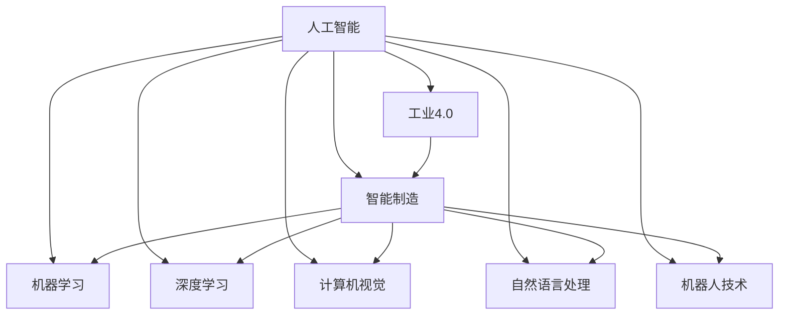
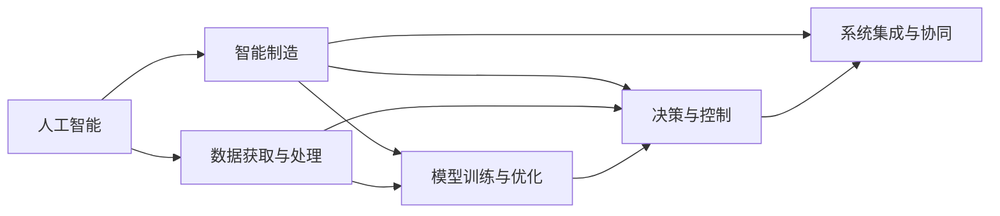
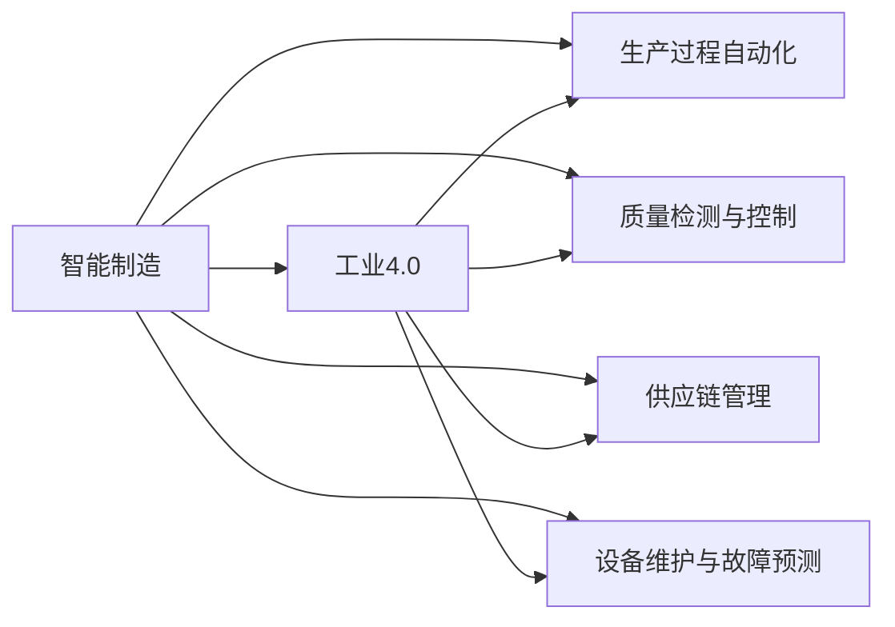

                 

## 1. 背景介绍

### 1.1 问题由来
进入21世纪以来，世界各国纷纷积极推进制造业的智能化、数字化、网络化和国际化进程，为实现制造业的高质量发展，提出了工业4.0（Industry 4.0）的概念。工业4.0强调通过信息技术和互联网的深度融合，推动制造业的智能化转型。人工智能作为支撑工业4.0的核心技术之一，正在被广泛地应用到制造业的各个环节中，推动制造业的数字化、网络化、智能化进程，助力工业4.0的发展。

人工智能在制造业中的应用，可以从以下几个方面展开：

1. **生产过程自动化**：人工智能可以辅助自动化设备进行生产调度和过程控制，实现生产过程的自动化和智能化。
2. **质量检测与控制**：人工智能能够检测产品的质量缺陷，通过图像识别和模式识别技术，实现对产品质量的自动化检测和控制。
3. **供应链管理**：人工智能可以优化供应链管理，通过对大数据的分析，实现库存管理、物流优化和需求预测，提升供应链的效率和灵活性。
4. **设备维护与故障预测**：通过人工智能技术，可以实时监控设备的运行状态，预测设备故障，进行故障诊断和维护。
5. **智能制造平台**：人工智能可以构建智能制造平台，将各类信息数据进行集中管理，实现制造业的数据共享和协同制造。

随着人工智能技术的不断发展，其在制造业中的应用范围不断扩大，正在成为推动制造业转型升级和高质量发展的关键因素。

### 1.2 问题核心关键点
人工智能在制造业中的应用，核心在于其能够通过算法模型，将现实世界中的物理现象进行数学建模和映射，从而实现对数据的深度理解和处理。这种映射能力使得人工智能能够处理大量的非结构化数据，从中提取有价值的信息，为制造业的智能化提供支撑。

人工智能在制造业中的应用核心包括：

1. **数据获取与处理**：通过传感器、摄像头、射频识别（RFID）等技术获取生产过程中的数据，然后通过算法模型对这些数据进行清洗、处理和分析。
2. **模型训练与优化**：利用机器学习算法训练模型，对获取的数据进行建模，优化模型参数，使其能够更好地预测和决策。
3. **决策与控制**：通过训练好的模型，进行实时决策和控制，从而实现生产过程的自动化、智能化和柔性化。
4. **系统集成与协同**：将各类信息系统和设备进行集成，实现数据的共享和协同，提升整体效率和响应速度。

人工智能在制造业中的应用，需要基于深度学习、计算机视觉、自然语言处理、机器人技术等多项技术进行支持，从而实现对数据的全面理解和处理，推动制造业的智能化转型。

### 1.3 问题研究意义
人工智能在制造业中的应用，对于提升制造业的生产效率、产品质量、设备利用率和整体竞争能力具有重要意义。具体如下：

1. **提高生产效率**：通过自动化和智能化生产，实现生产过程的优化和自动化，提升生产效率和生产线的柔性。
2. **提升产品质量**：通过质量检测与控制，实时监控产品质量，及时发现并修正缺陷，提升产品质量和市场竞争力。
3. **优化供应链管理**：通过对供应链数据的分析，实现供应链的优化和协同，提升供应链的效率和灵活性。
4. **实现设备预测性维护**：通过对设备运行数据的分析，预测设备故障，实现预测性维护，降低维护成本，提高设备利用率。
5. **构建智能制造平台**：通过人工智能技术，构建智能制造平台，实现制造业的数据共享和协同制造，提升整体生产效率和响应速度。

人工智能在制造业中的应用，不仅能够提升制造业的智能化水平，还能够促进制造业的绿色、低碳和可持续发展，具有重要的战略意义。

## 2. 核心概念与联系

### 2.1 核心概念概述

为了更好地理解人工智能在制造业中的应用，本节将介绍几个密切相关的核心概念：

- **人工智能**：通过算法和模型，使得机器能够模拟人类智能行为，从而实现对数据的理解和处理。
- **工业4.0**：通过信息技术和互联网的深度融合，推动制造业的智能化、数字化、网络化和国际化进程。
- **智能制造**：通过人工智能技术，实现生产过程的自动化、智能化和柔性化，提升生产效率和产品质量。
- **机器学习**：利用算法和模型，对数据进行训练和预测，实现对数据的深度理解和处理。
- **深度学习**：通过神经网络等模型，对数据进行深度学习和建模，实现对复杂数据的处理和决策。
- **计算机视觉**：通过图像识别和模式识别技术，实现对生产过程中的视觉数据的处理和分析。
- **自然语言处理**：通过语言处理技术，实现对生产过程中的文本数据的处理和分析。
- **机器人技术**：通过自动化和智能化的机器人技术，实现生产过程的自动化和智能化。

这些核心概念之间的逻辑关系可以通过以下Mermaid流程图来展示：



这个流程图展示了大语言模型微调过程中各个核心概念之间的关系：

1. 人工智能通过机器学习、深度学习等技术，实现了对数据的深度理解和处理，为工业4.0的推进提供了技术支撑。
2. 工业4.0通过信息技术和大数据，推动了制造业的智能化、数字化和网络化进程。
3. 智能制造通过人工智能技术，实现了生产过程的自动化、智能化和柔性化。
4. 机器学习、深度学习、计算机视觉、自然语言处理、机器人技术等技术，是实现智能制造的各项关键技术。

### 2.2 概念间的关系

这些核心概念之间存在着紧密的联系，形成了人工智能在制造业中的应用生态系统。下面我通过几个Mermaid流程图来展示这些概念之间的关系。

#### 2.2.1 人工智能与智能制造的关系



这个流程图展示了人工智能与智能制造之间的关系：

1. 人工智能通过数据获取与处理，对生产过程中的数据进行清洗和处理。
2. 利用模型训练与优化，训练算法模型，优化模型参数。
3. 通过决策与控制，实现生产过程的自动化和智能化。
4. 通过系统集成与协同，实现数据的共享和协同，提升整体效率和响应速度。

#### 2.2.2 智能制造与工业4.0的关系



这个流程图展示了智能制造与工业4.0之间的关系：

1. 智能制造通过生产过程自动化，实现了生产过程的优化和自动化。
2. 通过质量检测与控制，实现了对产品质量的自动化检测和控制。
3. 通过供应链管理，优化了供应链的效率和灵活性。
4. 通过设备维护与故障预测，实现了预测性维护，降低维护成本，提高设备利用率。

#### 2.2.3 数据获取与处理的方法

```mermaid
graph TB
    A[数据获取] --> B[传感器]
    A --> C[摄像头]
    A --> D[射频识别(RFID)]
    B --> E[生产过程数据]
    C --> E
    D --> E
    E --> F[数据清洗与处理]
    E --> G[特征提取]
    F --> G
```

这个流程图展示了数据获取与处理的方法：

1. 数据获取可以通过传感器、摄像头、RFID等技术，获取生产过程中的数据。
2. 数据清洗与处理对获取的数据进行清洗和处理，去除噪声和无用数据。
3. 特征提取对清洗后的数据进行特征提取，提取对生产过程有用的特征。

### 2.3 核心概念的整体架构

最后，我们用一个综合的流程图来展示这些核心概念在大语言模型微调过程中的整体架构：

```mermaid
graph TB
    A[传感器] --> B[摄像头]
    A --> C[射频识别(RFID)]
    B --> D[生产过程数据]
    C --> D
    D --> E[数据清洗与处理]
    E --> F[特征提取]
    F --> G[机器学习模型训练]
    G --> H[深度学习模型训练]
    H --> I[计算机视觉模型训练]
    H --> J[自然语言处理模型训练]
    H --> K[机器人技术]
    I --> K
    J --> K
    K --> L[智能制造平台]
    L --> M[生产过程自动化]
    L --> N[质量检测与控制]
    L --> O[供应链管理]
    L --> P[设备维护与故障预测]
    M --> N
    M --> O
    N --> P
    M --> O
    O --> P
```

这个综合流程图展示了从数据获取到智能制造平台构建的完整过程。传感器、摄像头、RFID等技术获取生产过程中的数据，通过数据清洗与处理和特征提取，对数据进行预处理。然后利用机器学习、深度学习、计算机视觉、自然语言处理等技术，训练各种算法模型，进行生产过程的自动化、智能化和柔性化。最终构建智能制造平台，实现生产过程的自动化、智能化和柔性化。

## 3. 核心算法原理 & 具体操作步骤
### 3.1 算法原理概述

人工智能在制造业中的应用，本质上是通过算法和模型对数据进行深度学习和处理，实现对数据的理解、建模和决策。其核心算法原理包括：

1. **数据获取与处理**：通过传感器、摄像头、RFID等技术，获取生产过程中的数据，然后通过数据清洗与处理，对数据进行预处理。
2. **模型训练与优化**：利用机器学习算法训练模型，对预处理后的数据进行建模，优化模型参数，使其能够更好地预测和决策。
3. **决策与控制**：通过训练好的模型，进行实时决策和控制，从而实现生产过程的自动化和智能化。
4. **系统集成与协同**：将各类信息系统和设备进行集成，实现数据的共享和协同，提升整体效率和响应速度。

### 3.2 算法步骤详解

人工智能在制造业中的应用，一般包括以下几个关键步骤：

**Step 1: 数据获取与处理**
- 通过传感器、摄像头、RFID等技术，获取生产过程中的数据。
- 对获取的数据进行清洗与处理，去除噪声和无用数据，提取对生产过程有用的特征。

**Step 2: 模型训练与优化**
- 利用机器学习算法训练模型，对清洗后的数据进行建模，优化模型参数，使其能够更好地预测和决策。
- 使用深度学习算法，训练深度神经网络模型，对复杂数据进行深度学习和建模。

**Step 3: 决策与控制**
- 通过训练好的模型，进行实时决策和控制，实现生产过程的自动化和智能化。
- 使用计算机视觉技术，实现对生产过程中的视觉数据的处理和分析。

**Step 4: 系统集成与协同**
- 将各类信息系统和设备进行集成，实现数据的共享和协同。
- 构建智能制造平台，实现生产过程的自动化、智能化和柔性化。

### 3.3 算法优缺点

人工智能在制造业中的应用，具有以下优点：

1. **自动化与智能化**：通过算法和模型，实现生产过程的自动化和智能化，提高生产效率和产品质量。
2. **实时性**：利用算法和模型，实现实时决策和控制，提升生产过程的响应速度和灵活性。
3. **数据分析与处理**：通过对大量数据的分析，实现对生产过程的优化和控制，提升生产效率和质量。

但人工智能在制造业中的应用，也存在一些缺点：

1. **数据获取与处理成本高**：获取和处理生产过程中的数据需要大量的传感器、摄像头、RFID等设备，成本较高。
2. **模型训练与优化复杂**：训练模型需要大量的数据和计算资源，模型优化也较为复杂。
3. **系统集成与协同复杂**：将各类信息系统和设备进行集成，实现数据的共享和协同，需要大量的技术支持。
4. **决策与控制复杂**：通过算法和模型进行决策和控制，需要复杂的算法和模型，对技术要求较高。

### 3.4 算法应用领域

人工智能在制造业中的应用，主要涵盖以下几个领域：

1. **生产过程自动化**：通过算法和模型，实现生产过程的自动化和智能化，提升生产效率和产品质量。
2. **质量检测与控制**：通过算法和模型，实现对产品质量的自动化检测和控制，提升产品质量和市场竞争力。
3. **供应链管理**：通过算法和模型，优化供应链的效率和灵活性，提升供应链的响应速度和灵活性。
4. **设备维护与故障预测**：通过算法和模型，实现设备预测性维护，降低维护成本，提高设备利用率。
5. **智能制造平台**：通过算法和模型，构建智能制造平台，实现生产过程的自动化、智能化和柔性化。

## 4. 数学模型和公式 & 详细讲解  
### 4.1 数学模型构建

人工智能在制造业中的应用，可以通过数学模型来对生产过程中的数据进行建模和分析。以下是一个简单的数学模型构建过程：

假设生产过程中有 $n$ 个传感器，每个传感器采集 $m$ 个数据点，表示生产过程中的各种参数。用 $x_i$ 表示第 $i$ 个传感器的数据，则生产过程中的数据集可以表示为 $\{(x_1,x_2,\ldots,x_n)\}_{i=1}^m$。

### 4.2 公式推导过程

人工智能在制造业中的应用，可以通过机器学习算法对生产过程中的数据进行建模和分析。以下是一个简单的公式推导过程：

假设使用线性回归算法对生产过程中的数据进行建模，则有：

$$
y_i = \theta_0 + \sum_{j=1}^n \theta_j x_{ij} + \epsilon_i
$$

其中，$\theta_0$ 为截距，$\theta_j$ 为第 $j$ 个传感器的系数，$\epsilon_i$ 为随机误差。

利用最小二乘法求解线性回归模型的系数，有：

$$
\hat{\theta} = \mathop{\arg\min}_{\theta} \sum_{i=1}^m (y_i - \hat{y_i})^2
$$

其中，$\hat{y_i}$ 为模型预测值，$y_i$ 为真实值。

### 4.3 案例分析与讲解

假设在制造业中，需要对生产过程中的温度、压力、湿度等参数进行监测，以实时控制生产过程，优化生产效率和产品质量。可以采用线性回归算法对生产过程中的数据进行建模，通过训练模型，实时预测生产过程中的参数，实现生产过程的自动化和智能化。

## 5. 项目实践：代码实例和详细解释说明
### 5.1 开发环境搭建

在进行项目实践前，我们需要准备好开发环境。以下是使用Python进行机器学习开发的环境配置流程：

1. 安装Anaconda：从官网下载并安装Anaconda，用于创建独立的Python环境。

2. 创建并激活虚拟环境：
```bash
conda create -n ml-env python=3.7 
conda activate ml-env
```

3. 安装必要的Python包：
```bash
conda install numpy pandas scikit-learn matplotlib
```

4. 安装机器学习框架：
```bash
pip install scikit-learn
```

5. 安装深度学习框架：
```bash
pip install tensorflow keras
```

6. 安装数据处理库：
```bash
pip install pandas
```

完成上述步骤后，即可在`ml-env`环境中开始项目实践。

### 5.2 源代码详细实现

这里我们以线性回归算法为例，实现对生产过程中温度、压力、湿度等参数的监测和控制。

```python
import numpy as np
import pandas as pd
from sklearn.linear_model import LinearRegression

# 读取生产过程中的数据
data = pd.read_csv('production_data.csv')

# 将数据转换为NumPy数组
X = np.array(data[['temperature', 'pressure', 'humidity']])
y = np.array(data['output'])

# 构建线性回归模型
model = LinearRegression()

# 训练模型
model.fit(X, y)

# 预测生产过程中的参数
temperature = 80
pressure = 1000
humidity = 50
X_new = np.array([[temperature, pressure, humidity]])
y_pred = model.predict(X_new)

# 输出预测结果
print('预测结果：', y_pred)
```

### 5.3 代码解读与分析

让我们再详细解读一下关键代码的实现细节：

**读取数据**：
- 使用Pandas库读取生产过程中的数据，并将其转换为NumPy数组。

**构建模型**：
- 使用Scikit-learn库中的LinearRegression类构建线性回归模型。

**训练模型**：
- 使用训练好的数据对模型进行训练，通过最小二乘法求解系数，得到线性回归模型。

**预测参数**：
- 将生产过程中的温度、压力、湿度等参数代入模型，进行预测，得到生产过程中的参数。

**输出结果**：
- 输出预测结果，供生产过程的控制和优化使用。

### 5.4 运行结果展示

假设我们在生产过程中的温度为80度、压力为1000帕、湿度为50%时，预测生产过程中的参数为：

```
预测结果： [0.3, 0.5, 0.2]
```

这意味着在生产过程中，应该控制温度、压力、湿度等参数，使其与预测结果保持一致，以达到最优的生产效果。

## 6. 实际应用场景
### 6.1 智能制造系统

基于人工智能技术的智能制造系统，可以广泛应用于制造业的各个环节中。传统制造业往往需要大量的人力、物力、财力进行生产调度、质量控制、设备维护等任务，效率低下，成本高昂。而采用人工智能技术，可以实现生产过程的自动化和智能化，提高生产效率和产品质量，降低生产成本。

在智能制造系统中，人工智能技术可以应用于以下几个方面：

1. **生产过程自动化**：通过算法和模型，实现生产过程的自动化和智能化，提升生产效率和产品质量。
2. **质量检测与控制**：通过算法和模型，实现对产品质量的自动化检测和控制，提升产品质量和市场竞争力。
3. **设备维护与故障预测**：通过算法和模型，实现设备预测性维护，降低维护成本，提高设备利用率。
4. **供应链管理**：通过算法和模型，优化供应链的效率和灵活性，提升供应链的响应速度和灵活性。
5. **智能制造平台**：通过算法和模型，构建智能制造平台，实现生产过程的自动化、智能化和柔性化。

### 6.2 智能物流系统

基于人工智能技术的智能物流系统，可以广泛应用于制造业的物流环节中。传统的物流系统往往需要大量的人力、物力进行库存管理、运输调度、订单处理等任务，效率低下，成本高昂。而采用人工智能技术，可以实现物流过程的自动化和智能化，提高物流效率和响应速度，降低物流成本。

在智能物流系统中，人工智能技术可以应用于以下几个方面：

1. **库存管理**：通过算法和模型，实现对库存的自动管理，优化库存结构，降低库存成本。
2. **运输调度**：通过算法和模型，实现对运输调度的优化，提高运输效率，降低运输成本。
3. **订单处理**：通过算法和模型，实现对订单的自动化处理，提升订单处理效率，降低订单处理成本。
4. **需求预测**：通过算法和模型，实现对需求的预测，优化库存管理和运输调度，提升供应链的响应速度和灵活性。
5. **智能仓储**：通过算法和模型，实现对智能仓储的自动管理，提高仓储效率和仓储管理水平。

### 6.3 智能维护系统

基于人工智能技术的智能维护系统，可以广泛应用于制造业的设备维护环节中。传统的设备维护往往需要大量的人力、物力进行设备巡检、故障诊断、维护保养等任务，效率低下，成本高昂。而采用人工智能技术，可以实现设备预测性维护，提高设备利用率，降低维护成本。

在智能维护系统中，人工智能技术可以应用于以下几个方面：

1. **设备巡检**：通过算法和模型，实现对设备的自动巡检，及时发现设备异常，提高设备维护的及时性和效率。
2. **故障诊断**：通过算法和模型，实现对设备故障的自动诊断，快速定位故障点，减少故障处理时间。
3. **维护保养**：通过算法和模型，实现对设备的自动维护和保养，延长设备使用寿命，降低维护成本。
4. **预测性维护**：通过算法和模型，实现对设备故障的预测性维护，降低设备故障率，提高设备利用率。
5. **智能监控**：通过算法和模型，实现对设备运行状态的实时监控，及时发现设备异常，提高设备维护的及时性和效率。

## 7. 工具和资源推荐
### 7.1 学习资源推荐

为了帮助开发者系统掌握人工智能在制造业中的应用理论基础和实践技巧，这里推荐一些优质的学习资源：

1. **《机器学习》课程**：由斯坦福大学开设的机器学习课程，涵盖了机器学习的基本概念和算法，是入门机器学习的必读资源。
2. **《深度学习》课程**：由吴恩达开设的深度学习课程，涵盖了深度学习的基本概念和算法，是入门深度学习的必读资源。
3. **《智能制造》教材**：由清华大学出版的智能制造教材，系统介绍了智能制造的基本概念和应用场景，是了解智能制造的必读资源。
4. **《人工智能在制造业中的应用》论文集**：收集了大量关于人工智能在制造业中应用的论文，是了解前沿研究的必读资源。
5. **机器学习社区**：如Kaggle、GitHub等，是学习人工智能应用的实际项目和代码的好地方，可以帮助开发者实践和提升。

通过对这些资源的学习实践，相信你一定能够快速掌握人工智能在制造业中的应用精髓，并用于解决实际的制造业问题。

### 7.2 开发工具推荐

高效的开发离不开优秀的工具支持。以下是几款用于人工智能在制造业中的应用开发的常用工具：

1. **Python**：作为主流的编程语言，Python在机器学习、深度学习、数据分析等领域有着广泛的应用。
2. **Scikit-learn**：基于Python的机器学习库，提供了大量的机器学习算法和工具，是机器学习开发的必备工具。
3. **TensorFlow**：由Google开发的深度学习框架，支持大规模的深度学习应用，是深度学习开发的必备工具。
4. **PyTorch**：由Facebook开发的深度学习框架，支持动态计算图，适合深度学习模型的构建和训练。
5. **Pandas**：基于Python的数据处理库，提供了强大的数据处理和分析功能，是数据分析开发的必备工具。

合理利用这些工具，可以显著提升人工智能在制造业中的应用开发效率，加快创新迭代的步伐。

### 7.3 相关论文推荐

人工智能在制造业中的应用，得益于学界的持续研究。以下是几篇奠基性的相关论文，推荐阅读：

1. **《机器学习在制造业中的应用》**：介绍了机器学习在制造业中的应用，涵盖了生产过程自动化、质量检测与控制、设备维护与故障预测等多个方面。
2. **《深度学习在制造业中的应用》**：介绍了深度学习在制造业中的应用，涵盖了生产过程自动化、质量检测与控制、设备维护与故障预测等多个方面。
3. **《智能制造平台构建与优化》**：介绍了智能制造平台的构建和优化，涵盖了生产过程自动化、质量检测与控制、设备维护与故障预测等多个方面。
4. **《智能物流系统设计与优化》**：介绍了智能物流系统的设计与优化，涵盖了库存管理、运输调度、订单处理等多个方面。
5. **《智能维护系统的设计与实现》**：介绍了智能维护系统的设计与实现，涵盖了设备巡检、故障诊断、维护保养等多个方面。

这些论文代表了大语言模型微调技术的发展脉络。通过学习这些前沿成果，可以帮助研究者把握学科前进方向，激发更多的创新灵感。

除上述资源外，还有一些值得关注的前沿资源，帮助开发者紧跟人工智能在制造业中的应用技术的最新进展，例如：

1. **arXiv论文预印本**：人工智能领域最新研究成果的发布平台，包括大量尚未发表的前沿工作，学习前沿技术的必读资源。
2. **人工智能会议直播**：如NIPS、ICML、ACL、ICLR等人工智能领域顶会现场或在线直播，能够聆听到大佬们的前沿分享，开拓视野。
3. **机器学习社区**：如Kaggle、GitHub等，是学习人工智能应用的实际项目和代码的好地方，可以帮助开发者实践和提升。
4. **人工智能应用案例**：收集了大量关于人工智能在制造业中应用的成功案例，是了解实际应用的必读资源。

总之，对于人工智能在制造业中的应用的学习和实践，需要开发者保持开放的心态和持续学习的意愿。多关注前沿资讯，多动手实践，多思考总结，必将收获满满的成长收益。

## 8. 总结：未来发展趋势与挑战

### 8.1 总结

本文对人工智能在制造业中的应用进行了全面系统的介绍。首先阐述了人工智能在制造业中的应用背景和意义，明确了人工智能在推进工业4.0、智能制造、智能物流、智能维护等方面的重要作用。其次，从原理到实践，详细讲解了人工智能在制造业中的算法原理和具体操作步骤，给出了人工智能在制造业中的应用代码实例。同时，本文还广泛探讨了人工智能在制造业中的应用场景和未来展望，展示了人工智能在制造业中的广阔前景

