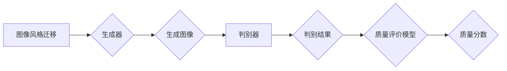

## 基于生成对抗网络的图像风格迁移质量评价模型

> 关键词：图像风格迁移、生成对抗网络（GAN）、质量评价、感知损失、客观评价、主观评价

## 1. 背景介绍

图像风格迁移技术近年来备受关注，它能够将一副图像的内容与另一幅图像的风格融合在一起，生成具有独特艺术效果的图像。该技术在艺术创作、图像编辑、电影特效等领域具有广泛的应用前景。然而，由于风格迁移的结果往往受到多种因素的影响，例如风格迁移算法的复杂度、训练数据的质量以及评价指标的选取等，因此如何客观、准确地评价图像风格迁移的质量成为了一个重要的研究课题。

传统的图像风格迁移质量评价方法主要依赖于主观评价，即由人工评判图像的风格迁移效果。这种方法虽然能够反映出人类的视觉感知，但其结果往往具有主观性、不可重复性和难以量化等问题。近年来，随着深度学习技术的快速发展，基于深度学习的图像风格迁移质量评价模型逐渐成为研究热点。这些模型能够自动学习图像风格迁移的特征，并根据这些特征对图像风格迁移效果进行客观评价。

## 2. 核心概念与联系

### 2.1 生成对抗网络（GAN）

生成对抗网络（GAN）是由Goodfellow等人在2014年提出的一个生成模型。它由两个神经网络组成：生成器（Generator）和判别器（Discriminator）。生成器负责生成新的数据样本，而判别器负责判断数据样本是真实数据还是生成数据。这两个网络在对抗博弈中相互竞争，生成器试图生成越来越逼真的数据样本，而判别器试图更好地区分真实数据和生成数据。

### 2.2 图像风格迁移

图像风格迁移是指将一副图像的内容与另一幅图像的风格融合在一起，生成具有独特艺术效果的图像。常见的风格迁移方法包括神经风格迁移、基于卷积神经网络的风格迁移等。

### 2.3 质量评价模型

质量评价模型是指用于评估图像风格迁移效果的模型。这些模型可以根据不同的评价指标对图像风格迁移效果进行量化评估。常见的质量评价指标包括感知损失、结构相似度、峰值信噪比等。

**Mermaid 流程图**



## 3. 核心算法原理 & 具体操作步骤

### 3.1 算法原理概述

基于生成对抗网络的图像风格迁移质量评价模型通常采用以下原理：

1. **训练生成器：** 使用GAN的训练机制，训练一个生成器网络，该网络能够根据输入的图像内容和风格图像生成具有特定风格的图像。
2. **训练判别器：** 使用GAN的训练机制，训练一个判别器网络，该网络能够区分真实图像和由生成器生成的图像。
3. **质量评价：** 将生成器生成的图像与真实图像进行比较，并使用感知损失等评价指标计算两者之间的差异。该差异值作为图像风格迁移质量的评价分数。

### 3.2 算法步骤详解

1. **数据准备：** 收集大量图像数据，并将其分为内容图像、风格图像和真实图像三类。
2. **网络架构设计：** 设计生成器和判别器网络的架构，并选择合适的激活函数、损失函数和优化算法。
3. **模型训练：** 使用训练数据训练生成器和判别器网络，并通过对抗博弈机制不断优化网络参数。
4. **质量评价：** 将训练好的生成器网络用于生成新的图像，并使用感知损失等评价指标对生成的图像进行质量评价。

### 3.3 算法优缺点

**优点：**

* **客观评价：** 基于深度学习的质量评价模型能够自动学习图像风格迁移的特征，并根据这些特征对图像风格迁移效果进行客观评价。
* **量化评估：** 质量评价模型能够将图像风格迁移效果量化评估，方便进行比较和分析。
* **可扩展性：** 质量评价模型可以根据不同的评价指标和需求进行调整和扩展。

**缺点：**

* **训练数据依赖：** 质量评价模型的性能依赖于训练数据的质量和数量。
* **计算资源消耗：** 训练深度学习模型需要大量的计算资源。
* **评价指标选择：** 选择合适的评价指标对于准确评估图像风格迁移效果至关重要。

### 3.4 算法应用领域

基于生成对抗网络的图像风格迁移质量评价模型在以下领域具有广泛的应用前景：

* **艺术创作：** 用于评估艺术作品的风格迁移效果，帮助艺术家创作更具创意的作品。
* **图像编辑：** 用于评估图像风格迁移效果，帮助用户进行更精准的图像编辑。
* **电影特效：** 用于评估电影特效中的风格迁移效果，提高特效的真实性和美观度。
* **图像检索：** 用于评估图像风格迁移效果，提高图像检索的准确率。

## 4. 数学模型和公式 & 详细讲解 & 举例说明

### 4.1 数学模型构建

基于生成对抗网络的图像风格迁移质量评价模型通常采用以下数学模型：

**生成器网络：**

$$G(x, s)$$

其中，$x$ 是输入图像内容，$s$ 是风格图像特征，$G(x, s)$ 是生成器网络生成的风格迁移图像。

**判别器网络：**

$$D(I)$$

其中，$I$ 是输入图像，$D(I)$ 是判别器网络对输入图像的判别结果，表示该图像是否为真实图像。

**损失函数：**

* **生成器损失函数：**

$$L_G = -E_{x, s} [log(D(G(x, s)))]$$

* **判别器损失函数：**

$$L_D = -E_{x, s} [log(D(G(x, s)))] - E_{x} [log(1 - D(x))]$$

其中，$E_{x, s}$ 表示对输入图像内容和风格图像特征进行期望运算，$E_{x}$ 表示对输入图像进行期望运算。

### 4.2 公式推导过程

生成器损失函数旨在最大化判别器对生成图像的判别结果，即希望生成器生成的图像能够被判别器误判为真实图像。判别器损失函数旨在最小化对真实图像和生成图像的判别错误，即希望判别器能够准确区分真实图像和生成图像。

### 4.3 案例分析与讲解

假设我们使用GAN模型进行图像风格迁移，并使用感知损失作为质量评价指标。

1. **训练生成器：** 使用训练数据训练生成器网络，并使用生成器损失函数进行优化。
2. **训练判别器：** 使用训练数据训练判别器网络，并使用判别器损失函数进行优化。
3. **质量评价：** 将训练好的生成器网络用于生成新的图像，并使用感知损失计算生成图像与真实图像之间的差异。该差异值作为图像风格迁移质量的评价分数。

## 5. 项目实践：代码实例和详细解释说明

### 5.1 开发环境搭建

* **操作系统：** Ubuntu 18.04
* **深度学习框架：** TensorFlow 2.0
* **编程语言：** Python 3.7

### 5.2 源代码详细实现

```python
# 生成器网络
class Generator(tf.keras.Model):
    def __init__(self):
        super(Generator, self).__init__()
        #...

    def call(self, inputs):
        #...

# 判别器网络
class Discriminator(tf.keras.Model):
    def __init__(self):
        super(Discriminator, self).__init__()
        #...

    def call(self, inputs):
        #...

# 损失函数
def loss_function(real_output, fake_output):
    #...

# 优化器
optimizer = tf.keras.optimizers.Adam(learning_rate=0.0002)

# 数据加载器
#...

# 训练循环
for epoch in range(num_epochs):
    for batch in data_loader:
        #...
```

### 5.3 代码解读与分析

* **生成器网络：** 负责将输入图像内容和风格图像特征融合在一起，生成具有特定风格的图像。
* **判别器网络：** 负责区分真实图像和生成图像。
* **损失函数：** 用于衡量生成器和判别器的性能。
* **优化器：** 用于更新生成器和判别器的参数。
* **数据加载器：** 用于加载训练数据。

### 5.4 运行结果展示

训练完成后，可以使用生成器网络生成新的图像，并使用感知损失等评价指标对生成的图像进行质量评价。

## 6. 实际应用场景

### 6.1 艺术创作

基于生成对抗网络的图像风格迁移质量评价模型可以帮助艺术家更精准地控制图像风格迁移效果，创作出更具创意和个性化的艺术作品。

### 6.2 图像编辑

图像编辑软件可以利用该模型对用户上传的图像进行风格迁移，并根据用户反馈进行调整，实现更灵活和个性化的图像编辑功能。

### 6.3 电影特效

电影特效制作中，可以使用该模型将场景背景或人物服装进行风格迁移，实现更逼真的视觉效果。

### 6.4 未来应用展望

随着深度学习技术的不断发展，基于生成对抗网络的图像风格迁移质量评价模型将有更广泛的应用前景，例如：

* **个性化图像生成：** 根据用户的喜好生成具有特定风格的图像。
* **虚拟现实和增强现实：** 在虚拟现实和增强现实场景中，使用该模型对场景进行风格迁移，增强用户体验。
* **医疗图像分析：** 将医学图像进行风格迁移，帮助医生更好地理解和诊断疾病。

## 7. 工具和资源推荐

### 7.1 学习资源推荐

* **论文：**

    * Goodfellow, I., Pouget-Abadie, J., Mirza, M., Xu, B., Warde-Farley, D., Ozair, S.,... & Bengio, Y. (2014). Generative adversarial nets. In Advances in neural information processing systems (pp. 2672-2680).

* **博客文章：**

    * https://blog.keras.io/building-autoencoders-in-keras.html
    * https://towardsdatascience.com/generative-adversarial-networks-gans-explained-with-code-examples-a3949b14421c

### 7.2 开发工具推荐

* **TensorFlow:** https://www.tensorflow.org/
* **PyTorch:** https://pytorch.org/

### 7.3 相关论文推荐

* **Perceptual Losses for Real-Time Style Transfer and Super-Resolution:** https://arxiv.org/abs/1603.08155
* **Deep Learning for Image Style Transfer:** https://arxiv.org/abs/1609.06717

## 8. 总结：未来发展趋势与挑战

### 8.1 研究成果总结

基于生成对抗网络的图像风格迁移质量评价模型取得了显著的成果，能够客观、准确地评估图像风格迁移效果。

### 8.2 未来发展趋势

* **多模态风格迁移：** 将图像风格迁移扩展到多模态数据，例如文本、音频、视频等。
* **个性化风格迁移：** 根据用户的喜好生成具有特定风格的图像。
* **实时风格迁移：** 实现实时图像风格迁移，例如在视频编辑中应用。

### 8.3 面临的挑战

* **评价指标的完善：** 寻找更准确、更全面的评价指标，能够更好地反映图像风格迁移的效果。
* **训练数据的多样性：** 收集更多样化的训练数据，提高模型的泛化能力。
* **计算