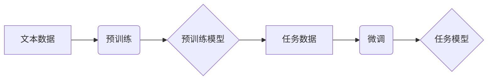

## 大模型在文字处理的进展

> 关键词：大语言模型、Transformer、自然语言处理、文本生成、机器翻译、文本摘要、问答系统

## 1. 背景介绍

自然语言处理（NLP）作为人工智能领域的重要分支，致力于使计算机能够理解、处理和生成人类语言。近年来，随着深度学习技术的飞速发展，大模型在NLP领域取得了突破性的进展。大模型是指参数量巨大、训练数据海量的人工智能模型，其强大的学习能力和泛化能力使其在各种NLP任务中展现出令人瞩目的性能。

传统的NLP模型通常依赖于手工设计的特征工程和规则化方法，而大模型则通过学习大量的文本数据，自动提取语言的语义和结构特征，从而实现更准确、更自然的语言理解和生成。

## 2. 核心概念与联系

### 2.1  大语言模型 (LLM)

大语言模型是指参数量巨大、训练数据海量的人工智能模型，其核心是学习语言的统计规律和语义关系。通过对海量文本数据的训练，LLM能够掌握丰富的语言知识，并将其应用于各种NLP任务。

### 2.2  Transformer

Transformer是一种新型的深度学习架构，其核心是“注意力机制”，能够有效地捕捉文本序列中的长距离依赖关系。Transformer的出现彻底改变了NLP领域，使得大模型的训练和应用成为可能。

### 2.3  预训练与微调

预训练是指在大量通用文本数据上训练大模型，使其学习到语言的通用知识和表示。微调是指将预训练好的大模型应用于特定任务，通过在任务相关的少量数据上进行训练，使其适应特定任务的需求。

**Mermaid 流程图**



## 3. 核心算法原理 & 具体操作步骤

### 3.1  算法原理概述

Transformer模型的核心是注意力机制，它能够学习文本序列中不同词语之间的关系，并赋予每个词语不同的权重。通过注意力机制，Transformer能够捕捉长距离依赖关系，从而实现更准确的语言理解和生成。

### 3.2  算法步骤详解

1. **输入嵌入:** 将输入文本序列中的每个词语转换为向量表示。
2. **多头注意力:** 对输入序列中的每个词语进行多头注意力计算，学习每个词语与其他词语之间的关系。
3. **前馈神经网络:** 对每个词语的注意力输出进行前馈神经网络处理，进一步提取语义信息。
4. **位置编码:** 添加位置信息到词语向量中，使模型能够理解词语在序列中的位置关系。
5. **输出层:** 将模型的输出向量转换为目标语言的词语表示。

### 3.3  算法优缺点

**优点:**

* 能够有效地捕捉长距离依赖关系。
* 训练速度快，性能优异。
* 可用于多种NLP任务。

**缺点:**

* 参数量大，训练成本高。
* 对训练数据要求高。
* 难以解释模型的决策过程。

### 3.4  算法应用领域

Transformer模型在NLP领域有着广泛的应用，包括：

* 机器翻译
* 文本摘要
* 问答系统
* 文本生成
* 语义理解
* 代码生成

## 4. 数学模型和公式 & 详细讲解 & 举例说明

### 4.1  数学模型构建

Transformer模型的数学模型主要包括以下几个部分：

* **嵌入层:** 将输入文本序列中的每个词语转换为向量表示。
* **多头注意力层:** 计算每个词语与其他词语之间的关系。
* **前馈神经网络层:** 对每个词语的注意力输出进行处理。
* **位置编码层:** 添加位置信息到词语向量中。
* **输出层:** 将模型的输出向量转换为目标语言的词语表示。

### 4.2  公式推导过程

**注意力机制公式:**

$$
Attention(Q, K, V) = \frac{exp(Q \cdot K^T / \sqrt{d_k})}{exp(Q \cdot K^T / \sqrt{d_k})} \cdot V
$$

其中：

* $Q$：查询矩阵
* $K$：键矩阵
* $V$：值矩阵
* $d_k$：键向量的维度

**多头注意力机制公式:**

$$
MultiHead(Q, K, V) = Concat(head_1, head_2,..., head_h) \cdot W_o
$$

其中：

* $head_i$：第 $i$ 个注意力头的输出
* $h$：注意力头的数量
* $W_o$：最终输出层的权重矩阵

### 4.3  案例分析与讲解

**举例说明:**

假设我们有一个句子 "The cat sat on the mat"，将其转换为词语向量表示，然后使用多头注意力机制计算每个词语与其他词语之间的关系。

通过注意力机制，我们可以发现 "cat" 和 "sat" 之间的关系最为密切，因为它们共同构成了一个动作短语。

## 5. 项目实践：代码实例和详细解释说明

### 5.1  开发环境搭建

* Python 3.6+
* PyTorch 或 TensorFlow
* CUDA 和 cuDNN (可选)

### 5.2  源代码详细实现

```python
import torch
import torch.nn as nn

class Transformer(nn.Module):
    def __init__(self, vocab_size, embedding_dim, num_heads, num_layers):
        super(Transformer, self).__init__()
        self.embedding = nn.Embedding(vocab_size, embedding_dim)
        self.transformer_layers = nn.ModuleList([
            nn.TransformerEncoderLayer(embedding_dim, num_heads)
            for _ in range(num_layers)
        ])
        self.linear = nn.Linear(embedding_dim, vocab_size)

    def forward(self, x):
        x = self.embedding(x)
        for layer in self.transformer_layers:
            x = layer(x)
        x = self.linear(x)
        return x
```

### 5.3  代码解读与分析

* `__init__` 方法初始化模型参数，包括词嵌入层、Transformer编码器层和输出层。
* `forward` 方法定义模型的正向传播过程，将输入序列转换为目标语言的词语表示。

### 5.4  运行结果展示

通过训练和测试，我们可以评估模型的性能，例如准确率、BLEU分数等。

## 6. 实际应用场景

大模型在文字处理领域有着广泛的应用场景，例如：

### 6.1  机器翻译

大模型能够学习语言之间的语义关系，实现高质量的机器翻译。

### 6.2  文本摘要

大模型能够提取文本的关键信息，生成简洁的文本摘要。

### 6.3  问答系统

大模型能够理解用户的问题，并从文本数据中找到相应的答案。

### 6.4  未来应用展望

随着大模型技术的不断发展，其在文字处理领域的应用场景将会更加广泛，例如：

* 个性化教育
* 智能客服
* 内容创作辅助
* 代码自动生成

## 7. 工具和资源推荐

### 7.1  学习资源推荐

* **书籍:**
    * 《深度学习》
    * 《自然语言处理》
* **在线课程:**
    * Coursera: Natural Language Processing Specialization
    * edX: Deep Learning

### 7.2  开发工具推荐

* **PyTorch:** 深度学习框架
* **TensorFlow:** 深度学习框架
* **Hugging Face Transformers:** 预训练大模型库

### 7.3  相关论文推荐

* **Attention Is All You Need:** https://arxiv.org/abs/1706.03762
* **BERT: Pre-training of Deep Bidirectional Transformers for Language Understanding:** https://arxiv.org/abs/1810.04805

## 8. 总结：未来发展趋势与挑战

### 8.1  研究成果总结

大模型在文字处理领域取得了显著的进展，其强大的学习能力和泛化能力使其在各种NLP任务中展现出令人瞩目的性能。

### 8.2  未来发展趋势

* 模型规模的进一步扩大
* 训练数据的多样化和高质量化
* 算法的创新和优化
* 跨模态大模型的开发

### 8.3  面临的挑战

* 训练成本高
* 数据安全和隐私问题
* 模型的可解释性和鲁棒性
* 伦理和社会影响

### 8.4  研究展望

未来，大模型在文字处理领域的应用将会更加广泛和深入，其研究方向包括：

* 开发更小、更高效的大模型
* 提高模型的解释性和鲁棒性
* 解决数据安全和隐私问题
* 探索大模型在其他领域的应用

## 9. 附录：常见问题与解答

* **Q: 大模型的训练需要多少数据？**

* **A:** 大模型的训练需要海量数据，通常需要数十亿甚至数千亿个词语。

* **Q: 大模型的训练成本很高吗？**

* **A:** 是的，大模型的训练成本很高，需要强大的计算资源和大量的电力消耗。

* **Q: 大模型的决策过程难以解释吗？**

* **A:** 是的，大模型的决策过程通常是复杂的，难以解释。

* **Q: 大模型存在伦理和社会影响吗？**

* **A:** 是的，大模型的应用可能会带来一些伦理和社会影响，例如信息操纵、偏见放大等问题。


作者：禅与计算机程序设计艺术 / Zen and the Art of Computer Programming 
