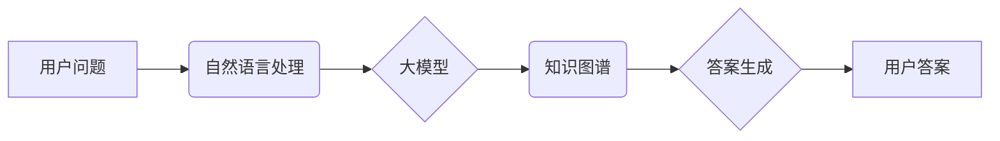

## 大模型问答机器人的智能水平

> 关键词：大模型、问答机器人、自然语言处理、深度学习、Transformer、知识图谱、推理能力、智能水平

## 1. 背景介绍

近年来，深度学习技术取得了飞速发展，特别是Transformer模型的出现，为自然语言处理（NLP）领域带来了革命性的变革。大模型问答机器人作为NLP领域的重要应用之一，利用大规模训练数据和强大的模型能力，能够理解用户自然语言问题，并生成准确、流畅、有针对性的答案。

问答机器人技术的发展历程可以追溯到早期基于规则的系统，这些系统依赖于人工编写的规则和知识库来回答问题。然而，规则系统难以应对复杂、开放式的问答场景，并且维护成本高昂。随着深度学习技术的兴起，基于深度学习的问答机器人逐渐成为主流，它们能够学习语言的语义和结构，并从海量文本数据中提取知识，从而实现更智能、更灵活的回答。

## 2. 核心概念与联系

大模型问答机器人主要包含以下核心概念：

* **大模型 (Large Model):** 指参数量庞大的深度学习模型，通常拥有数十亿甚至千亿个参数。大模型能够学习更复杂的语言模式和知识表示，从而提升问答性能。
* **Transformer:**  一种新型的深度学习架构，能够有效处理序列数据，例如文本。Transformer模型通过自注意力机制学习文本之间的长距离依赖关系，从而实现更准确的理解和生成。
* **自然语言处理 (NLP):**  计算机科学的一个分支，致力于使计算机能够理解、处理和生成人类语言。NLP技术在问答机器人中用于理解用户问题、提取关键信息、生成自然语言答案等。
* **知识图谱 (Knowledge Graph):**  一种结构化的知识表示形式，将实体和关系以图的形式表示。知识图谱能够帮助问答机器人获取更丰富、更准确的知识，从而回答更复杂的问题。

**核心概念架构流程图:**



## 3. 核心算法原理 & 具体操作步骤

### 3.1  算法原理概述

大模型问答机器人的核心算法通常基于Transformer模型，结合了自然语言处理和知识图谱技术。

* **Transformer模型:**  Transformer模型通过自注意力机制学习文本之间的长距离依赖关系，能够捕捉到问题和答案之间的语义关联。
* **编码器-解码器结构:**  Transformer模型通常采用编码器-解码器结构，编码器用于对问题进行编码，生成问题的语义表示；解码器用于根据编码后的问题表示，生成答案。
* **知识图谱融合:**  知识图谱可以提供丰富的背景知识，帮助模型理解问题和生成更准确的答案。知识图谱信息可以融入到Transformer模型的编码器或解码器中，或者作为额外的输入特征。

### 3.2  算法步骤详解

1. **预处理:**  对用户问题进行预处理，例如分词、词性标注、去除停用词等，以便模型更好地理解问题内容。
2. **编码:**  使用Transformer模型的编码器对预处理后的问题进行编码，生成问题的语义表示。
3. **知识图谱查询:**  根据编码后的问题表示，查询知识图谱，获取与问题相关的实体和关系信息。
4. **解码:**  使用Transformer模型的解码器，结合编码后的问题表示和知识图谱信息，生成答案。
5. **后处理:**  对生成的答案进行后处理，例如语法检查、格式化等，使其更加流畅自然。

### 3.3  算法优缺点

**优点:**

* **高准确率:**  大模型和Transformer模型能够学习复杂的语言模式和知识表示，从而实现更高的问答准确率。
* **灵活性和适应性:**  大模型问答机器人能够处理多种类型的问答场景，例如事实问答、推理问答、对话问答等。
* **持续学习:**  大模型可以通过不断学习新的数据来提升问答性能。

**缺点:**

* **计算资源需求高:**  训练和部署大模型需要大量的计算资源。
* **数据依赖性强:**  大模型的性能取决于训练数据的质量和数量。
* **可解释性差:**  大模型的决策过程难以解释，这可能导致模型的信任度降低。

### 3.4  算法应用领域

大模型问答机器人具有广泛的应用领域，例如：

* **客户服务:**  自动回答客户常见问题，提高服务效率。
* **教育:**  提供个性化的学习辅导，帮助学生理解知识。
* **搜索引擎:**  改进搜索结果的准确性和相关性。
* **医疗保健:**  辅助医生诊断疾病，提供患者信息。
* **娱乐:**  开发智能聊天机器人，提供互动娱乐体验。

## 4. 数学模型和公式 & 详细讲解 & 举例说明

### 4.1  数学模型构建

大模型问答机器人的数学模型通常基于Transformer模型，其核心是自注意力机制。自注意力机制可以计算每个词与所有其他词之间的相关性，从而捕捉到文本之间的长距离依赖关系。

### 4.2  公式推导过程

**自注意力机制公式:**

$$
Attention(Q, K, V) = \frac{exp(Q \cdot K^T / \sqrt{d_k})}{exp(Q \cdot K^T / \sqrt{d_k})} \cdot V
$$

其中：

* $Q$:  查询矩阵
* $K$:  键矩阵
* $V$:  值矩阵
* $d_k$:  键向量的维度

**公式解释:**

1. 计算查询矩阵 $Q$ 与键矩阵 $K$ 的点积，并除以键向量的维度 $\sqrt{d_k}$。
2. 将点积结果应用softmax函数，得到每个词与所有其他词之间的相关性分数。
3. 将相关性分数与值矩阵 $V$ 进行加权求和，得到每个词的最终表示。

### 4.3  案例分析与讲解

假设我们有一个句子 "The cat sat on the mat"，我们想要计算 "cat" 与其他词之间的相关性。

1. 将句子转换为词嵌入向量，得到 $Q$, $K$, $V$ 三个矩阵。
2. 计算 $Q$ 与 $K$ 的点积，得到每个词与所有其他词之间的相关性分数。
3. 应用softmax函数，得到每个词与所有其他词之间的归一化相关性分数。
4. 将归一化相关性分数与 $V$ 进行加权求和，得到 "cat" 的最终表示，该表示包含了 "cat" 与其他词之间的语义关联信息。

## 5. 项目实践：代码实例和详细解释说明

### 5.1  开发环境搭建

* Python 3.7+
* PyTorch 或 TensorFlow
* CUDA 和 cuDNN (可选，用于GPU加速)

### 5.2  源代码详细实现

```python
# 使用PyTorch实现简单的Transformer模型

import torch
import torch.nn as nn

class Transformer(nn.Module):
    def __init__(self, vocab_size, embedding_dim, num_heads, num_layers):
        super(Transformer, self).__init__()
        self.embedding = nn.Embedding(vocab_size, embedding_dim)
        self.transformer_layers = nn.ModuleList([
            nn.TransformerEncoderLayer(embedding_dim, num_heads)
            for _ in range(num_layers)
        ])
        self.linear = nn.Linear(embedding_dim, vocab_size)

    def forward(self, x):
        x = self.embedding(x)
        for layer in self.transformer_layers:
            x = layer(x)
        x = self.linear(x)
        return x
```

### 5.3  代码解读与分析

* **embedding层:** 将输入词转换为词嵌入向量。
* **transformer_layers:**  多个Transformer编码器层，用于学习文本之间的长距离依赖关系。
* **linear层:**  将编码后的文本表示转换为输出词的概率分布。

### 5.4  运行结果展示

训练好的Transformer模型可以用于回答问题，例如：

**问题:**  What is the capital of France?

**答案:**  Paris

## 6. 实际应用场景

### 6.1  客户服务

大模型问答机器人可以自动回答客户常见问题，例如产品信息、订单状态、退换货政策等，提高客户服务效率，降低人工成本。

### 6.2  教育

大模型问答机器人可以提供个性化的学习辅导，帮助学生理解知识，解答疑问，提高学习效率。

### 6.3  搜索引擎

大模型问答机器人可以改进搜索结果的准确性和相关性，例如，对于开放式问题，可以生成更详细、更准确的答案。

### 6.4  未来应用展望

未来，大模型问答机器人将应用于更多领域，例如医疗保健、法律咨询、金融服务等，为人们提供更智能、更便捷的服务。

## 7. 工具和资源推荐

### 7.1  学习资源推荐

* **书籍:**
    * 《深度学习》 by Ian Goodfellow, Yoshua Bengio, and Aaron Courville
    * 《Transformer模型详解》 by Jay Alammar
* **在线课程:**
    * Coursera: 深度学习 Specialization
    * fast.ai: Practical Deep Learning for Coders

### 7.2  开发工具推荐

* **PyTorch:**  一个开源的深度学习框架，支持GPU加速。
* **TensorFlow:**  另一个开源的深度学习框架，拥有丰富的生态系统。
* **Hugging Face Transformers:**  一个开源的库，提供预训练的Transformer模型和工具。

### 7.3  相关论文推荐

* **Attention Is All You Need:**  https://arxiv.org/abs/1706.03762
* **BERT: Pre-training of Deep Bidirectional Transformers for Language Understanding:**  https://arxiv.org/abs/1810.04805

## 8. 总结：未来发展趋势与挑战

### 8.1  研究成果总结

大模型问答机器人技术取得了显著进展，能够处理更复杂、更开放式的问答场景，并实现更高的准确率。

### 8.2  未来发展趋势

* **模型规模和能力提升:**  未来将继续开发更大规模、更强大的大模型，提升问答性能。
* **多模态问答:**  将文本、图像、音频等多模态信息融合到问答系统中，实现更丰富的交互体验。
* **可解释性增强:**  研究更有效的模型解释方法，提高模型的透明度和信任度。

### 8.3  面临的挑战

* **数据获取和标注:**  大模型训练需要海量高质量数据，数据获取和标注成本高昂。
* **计算资源需求:**  训练和部署大模型需要大量的计算资源，这对于资源有限的机构或个人来说是一个挑战。
* **伦理和安全问题:**  大模型问答机器人可能存在偏见、误导或攻击性问题，需要加强伦理和安全方面的研究。

### 8.4  研究展望

未来，大模型问答机器人将继续朝着更智能、更安全、更可解释的方向发展，为人们的生活和工作带来更多便利。


## 9. 附录：常见问题与解答

**Q1:  大模型问答机器人与传统规则型问答系统的区别是什么？**

**A1:**  传统规则型问答系统依赖于人工编写的规则和知识库，难以应对复杂、开放式的问答场景，并且维护成本高昂。而大模型问答机器人利用深度学习技术，能够学习语言的语义和结构，从海量文本数据中提取知识，从而实现更智能、更灵活的回答。

**Q2:  大模型问答机器人的训练数据有哪些？**

**A2:**  大模型问答机器人的训练数据通常包括大量的文本数据，例如书籍、文章、网站、对话等。

**Q3:  大