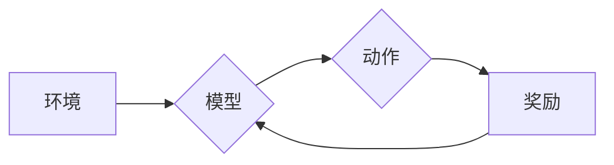

## 大规模语言模型从理论到实践 PPO微调

> 关键词：大规模语言模型、PPO微调、强化学习、自然语言处理、文本生成、模型优化、深度学习

## 1. 背景介绍

近年来，大规模语言模型（LLM）在自然语言处理（NLP）领域取得了令人瞩目的成就。从文本生成、翻译到问答和代码编写，LLM展现出强大的能力，深刻地改变了我们与语言交互的方式。然而，训练这些庞大的模型需要海量数据和计算资源，对于大多数研究者和开发者来说仍然是一个巨大的挑战。

微调技术应运而生，它允许我们利用预训练的LLM，在特定任务上进行更精细的训练，从而获得更好的性能，同时降低训练成本和时间。其中，策略梯度优化算法（PPO）作为一种高效稳定的强化学习算法，在LLM微调领域展现出巨大的潜力。

## 2. 核心概念与联系

### 2.1  大规模语言模型

大规模语言模型是指参数数量庞大的深度学习模型，通过学习海量文本数据，掌握了语言的语法、语义和上下文关系。常见的LLM架构包括Transformer、GPT和BERT等。这些模型通过强大的编码和解码能力，能够生成流畅、连贯的文本，并完成各种自然语言理解和生成任务。

### 2.2  强化学习

强化学习是一种机器学习范式，其中智能体通过与环境交互，学习最优的策略以最大化累积奖励。在LLM微调中，我们可以将文本生成任务视为一个强化学习问题。模型的输出被视为动作，奖励函数则根据输出的质量进行评估。通过不断调整策略，模型最终能够生成高质量的文本。

### 2.3  PPO算法

Proximal Policy Optimization（PPO）是一种基于策略梯度的强化学习算法，它在训练过程中通过限制策略更新的幅度，保证了算法的稳定性和收敛性。PPO算法通过以下步骤进行训练：

1. 收集环境数据和奖励信息。
2. 计算策略梯度，更新策略参数。
3. 通过KL散度惩罚项限制策略更新的幅度。
4. 重复步骤1-3，直到模型收敛。

**Mermaid 流程图**



## 3. 核心算法原理 & 具体操作步骤

### 3.1  算法原理概述

PPO算法的核心思想是通过策略梯度优化，在保证策略更新幅度有限的情况下，最大化累积奖励。它通过以下几个关键步骤实现：

1. **策略网络:** 定义一个策略网络，用于根据输入文本生成下一个词的概率分布。
2. **价值网络:** 定义一个价值网络，用于估计当前状态的价值函数。
3. **策略梯度:** 计算策略网络参数的梯度，方向指向提高奖励的策略。
4. **KL散度惩罚:** 通过KL散度惩罚项限制策略更新的幅度，防止模型过快地更新策略，导致训练不稳定。
5. **优势函数:** 计算优势函数，用于衡量当前策略相对于旧策略的改进程度。
6. **更新策略:** 使用优势函数和策略梯度更新策略网络参数。

### 3.2  算法步骤详解

1. **初始化:** 初始化策略网络和价值网络的参数。
2. **数据收集:** 从环境中收集文本序列和对应的奖励信息。
3. **策略评估:** 使用策略网络生成文本序列，并计算对应的奖励。
4. **价值函数估计:** 使用价值网络估计每个状态的价值函数。
5. **优势函数计算:** 计算优势函数，用于衡量当前策略相对于旧策略的改进程度。
6. **策略梯度计算:** 计算策略网络参数的梯度，方向指向提高奖励的策略。
7. **KL散度惩罚:** 使用KL散度惩罚项限制策略更新的幅度。
8. **策略更新:** 使用优势函数和策略梯度更新策略网络参数。
9. **重复步骤2-8:** 重复以上步骤，直到模型收敛。

### 3.3  算法优缺点

**优点:**

* **稳定性:** PPO算法通过KL散度惩罚项限制策略更新的幅度，提高了算法的稳定性和收敛性。
* **效率:** PPO算法在训练过程中可以利用优势函数，提高了训练效率。
* **通用性:** PPO算法可以应用于各种强化学习任务，包括文本生成、对话系统和游戏AI等。

**缺点:**

* **参数设置:** PPO算法需要一些超参数的设置，例如KL散度惩罚系数，需要进行调优。
* **计算复杂度:** PPO算法在训练过程中需要计算策略梯度和价值函数，计算复杂度较高。

### 3.4  算法应用领域

PPO算法在以下领域具有广泛的应用：

* **文本生成:** 文本摘要、机器翻译、对话系统、代码生成等。
* **游戏AI:** 游戏策略学习、游戏角色控制等。
* **机器人控制:** 机器人运动规划、机器人任务执行等。

## 4. 数学模型和公式 & 详细讲解 & 举例说明

### 4.1  数学模型构建

在PPO算法中，我们使用策略网络$\pi_{\theta}(a|s)$来表示模型在状态$s$下选择动作$a$的概率分布，其中$\theta$是策略网络的参数。价值网络$V_{\phi}(s)$则用来估计状态$s$的价值函数。

### 4.2  公式推导过程

PPO算法的目标是最大化累积奖励，可以使用以下公式表示：

$$
J(\theta) = \mathbb{E}_{\tau \sim \pi_{\theta}} \sum_{t=0}^{T} r_t
$$

其中，$\tau$表示一个轨迹，$r_t$表示时间步$t$的奖励。

为了实现这个目标，PPO算法使用策略梯度优化方法，更新策略网络的参数$\theta$：

$$
\theta \leftarrow \theta + \alpha \nabla_{\theta} J(\theta)
$$

其中，$\alpha$是学习率。

由于直接计算$J(\theta)$的梯度比较困难，PPO算法使用优势函数来近似梯度：

$$
A(s,a) = Q(s,a) - V(s)
$$

其中，$Q(s,a)$是状态$s$下执行动作$a$的期望回报。

使用优势函数，策略梯度可以表示为：

$$
\nabla_{\theta} J(\theta) \approx \mathbb{E}_{\tau \sim \pi_{\theta}} \sum_{t=0}^{T} A(s_t,a_t) \nabla_{\theta} \log \pi_{\theta}(a_t|s_t)
$$

### 4.3  案例分析与讲解

假设我们有一个文本生成任务，目标是生成一段流畅的英文句子。我们可以使用PPO算法来微调一个预训练的LLM，使其能够生成高质量的句子。

在训练过程中，模型会根据输入的文本片段生成下一个词的概率分布。奖励函数可以根据生成的句子的流畅度、语法正确性和语义合理性进行评估。通过不断调整策略网络的参数，模型最终能够生成高质量的英文句子。

## 5. 项目实践：代码实例和详细解释说明

### 5.1  开发环境搭建

为了实现PPO微调，我们需要搭建一个合适的开发环境。

* **操作系统:** Linux或macOS
* **编程语言:** Python
* **深度学习框架:** TensorFlow或PyTorch
* **其他依赖库:** OpenAI Gym、Stable Baselines3等

### 5.2  源代码详细实现

以下是一个使用Stable Baselines3库实现PPO微调的简单代码示例：

```python
from stable_baselines3 import PPO
from stable_baselines3.common.env_checker import check_env

# 定义环境
env =...

# 检查环境
check_env(env)

# 初始化模型
model = PPO("MlpPolicy", env, verbose=1)

# 训练模型
model.learn(total_timesteps=10000)

# 保存模型
model.save("ppo_model")

# 加载模型
loaded_model = PPO.load("ppo_model")

# 使用模型进行预测
obs = env.reset()
for i in range(1000):
    action, _states = loaded_model.predict(obs)
    obs, rewards, done, info = env.step(action)
    if done:
        obs = env.reset()
```

### 5.3  代码解读与分析

* **环境定义:** 首先需要定义一个合适的环境，该环境模拟了我们的文本生成任务。
* **模型初始化:** 使用Stable Baselines3库的PPO类初始化模型，并指定模型策略、环境和训练参数。
* **模型训练:** 使用`model.learn()`方法训练模型，指定训练时间步数。
* **模型保存和加载:** 使用`model.save()`和`PPO.load()`方法保存和加载模型。
* **模型预测:** 使用`model.predict()`方法根据输入文本片段生成下一个词的概率分布。

### 5.4  运行结果展示

训练完成后，我们可以使用模型进行预测，并观察生成的文本质量。

## 6. 实际应用场景

### 6.1  文本生成

PPO微调可以用于各种文本生成任务，例如：

* **机器翻译:** 微调LLM，使其能够将一种语言翻译成另一种语言。
* **文本摘要:** 微调LLM，使其能够生成文本的简洁摘要。
* **对话系统:** 微调LLM，使其能够进行自然流畅的对话。
* **代码生成:** 微调LLM，使其能够根据自然语言描述生成代码。

### 6.2  其他应用场景

除了文本生成，PPO微调还可以应用于其他领域，例如：

* **游戏AI:** 微调LLM，使其能够学习游戏策略，并控制游戏角色。
* **机器人控制:** 微调LLM，使其能够学习机器人运动规划和任务执行策略。

### 6.3  未来应用展望

随着LLM技术的不断发展，PPO微调将在更多领域得到应用，例如：

* **个性化教育:** 根据学生的学习情况，微调LLM生成个性化的学习内容。
* **医疗诊断:** 微调LLM，使其能够辅助医生进行疾病诊断。
* **科学研究:** 微调LLM，使其能够帮助科学家进行数据分析和模型构建。

## 7. 工具和资源推荐

### 7.1  学习资源推荐

* **书籍:**
    * Deep Reinforcement Learning Hands-On
    * Reinforcement Learning: An Introduction
* **在线课程:**
    * Deep Reinforcement Learning Specialization (Coursera)
    * Reinforcement Learning (Udacity)
* **博客和网站:**
    * OpenAI Blog
    * DeepMind Blog
    * Towards Data Science

### 7.2  开发工具推荐

* **深度学习框架:** TensorFlow, PyTorch
* **强化学习库:** Stable Baselines3, Dopamine
* **环境模拟器:** OpenAI Gym

### 7.3  相关论文推荐

* Proximal Policy Optimization Algorithms
* Trust Region Policy Optimization
* Asynchronous Methods for Deep Reinforcement Learning

## 8. 总结：未来发展趋势与挑战

### 8.1  研究成果总结

PPO算法在LLM微调领域取得了显著的成果，能够有效地提高模型性能，并降低训练成本。

### 8.2  未来发展趋势

* **模型效率:** 研究更高效的LLM微调算法，降低训练时间和计算资源需求。
* **数据效率:** 研究利用少量数据进行LLM微调的方法，降低对大量训练数据的依赖。
* **可解释性:** 研究提高LLM微调过程的可解释性，帮助我们更好地理解模型的决策过程。

### 8.3  面临的挑战

* **数据标注:** 高质量的文本数据标注仍然是一个挑战，需要大量的成本和人力投入。
* **模型规模:** LLMs参数数量庞大，训练和部署需要大量的计算资源