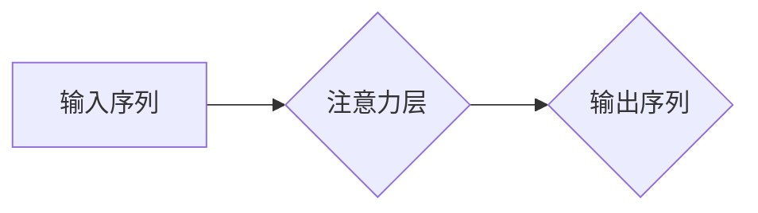

## 大规模语言模型从理论到实践 大语言模型的结构

> 关键词：大规模语言模型、Transformer、深度学习、自然语言处理、文本生成、BERT、GPT、LLM架构

## 1. 背景介绍

近年来，深度学习技术取得了飞速发展，特别是Transformer模型的出现，彻底改变了自然语言处理（NLP）领域的面貌。大规模语言模型（LLM）作为深度学习在NLP领域的顶尖成果，展现出强大的文本理解和生成能力，在机器翻译、文本摘要、对话系统、代码生成等领域取得了突破性进展。

LLM的出现，标志着人工智能迈向更智能、更人性化的方向。它们能够理解复杂的语言结构，生成流畅自然的文本，甚至具备一定的推理和创造能力。然而，LLM的训练和应用也面临着诸多挑战，例如数据规模、计算资源、模型可解释性和伦理问题等。

## 2. 核心概念与联系

### 2.1  大规模语言模型（LLM）

大规模语言模型是指参数量巨大、训练数据海量的人工智能模型，能够处理和生成人类语言。它们通常基于Transformer架构，拥有强大的文本表示能力和上下文理解能力。

### 2.2  Transformer架构

Transformer是一种新型的神经网络架构，专门设计用于处理序列数据，例如文本。它摒弃了传统的循环神经网络（RNN）的顺序处理方式，采用注意力机制，能够并行处理整个序列，从而提高训练效率和模型性能。

### 2.3  注意力机制

注意力机制是Transformer的核心创新点之一。它允许模型关注输入序列中与当前任务最相关的部分，从而提高模型的理解力和生成能力。

**Mermaid 流程图**



## 3. 核心算法原理 & 具体操作步骤

### 3.1  算法原理概述

LLM的训练基于深度学习的监督学习方法。训练数据通常是大量的文本数据，模型通过学习这些数据中的语言规律，并预测下一个词，从而不断优化模型参数。

### 3.2  算法步骤详解

1. **数据预处理:** 将原始文本数据进行清洗、分词、标记等预处理操作，使其能够被模型理解。
2. **模型构建:** 根据Transformer架构构建LLM模型，包括编码器、解码器和注意力层等组件。
3. **模型训练:** 使用预处理后的数据训练模型，通过反向传播算法不断优化模型参数。
4. **模型评估:** 使用测试数据评估模型的性能，例如准确率、困惑度等指标。
5. **模型部署:** 将训练好的模型部署到实际应用场景中，例如文本生成、机器翻译等。

### 3.3  算法优缺点

**优点:**

* 强大的文本理解和生成能力
* 能够处理长序列数据
* 训练效率高

**缺点:**

* 数据规模要求高
* 计算资源消耗大
* 模型可解释性差
* 存在潜在的偏见和风险

### 3.4  算法应用领域

* 机器翻译
* 文本摘要
* 问答系统
* 对话系统
* 代码生成
* 文本创作

## 4. 数学模型和公式 & 详细讲解 & 举例说明

### 4.1  数学模型构建

LLM的数学模型通常基于概率论和统计学，目标是学习一个概率分布，能够生成符合语言规律的文本序列。

### 4.2  公式推导过程

Transformer模型的核心是注意力机制，其计算公式如下：

$$
Attention(Q, K, V) = softmax(\frac{QK^T}{\sqrt{d_k}})V
$$

其中：

* $Q$：查询矩阵
* $K$：键矩阵
* $V$：值矩阵
* $d_k$：键向量的维度
* $softmax$：softmax函数

### 4.3  案例分析与讲解

假设我们有一个句子“我爱学习编程”，将其转换为词向量表示，得到四个词向量：

* 我：[0.1, 0.2, 0.3]
* 爱：[0.4, 0.5, 0.6]
* 学习：[0.7, 0.8, 0.9]
* 编程：[1.0, 1.1, 1.2]

我们可以使用注意力机制计算每个词对其他词的注意力权重，例如，计算“学习”对其他词的注意力权重：

* “我”对“学习”的注意力权重：

$$
Attention(学习, 我, 我) = softmax(\frac{学习 \cdot 我^T}{\sqrt{d_k}}) 我
$$

通过计算所有词对的注意力权重，我们可以得到一个注意力矩阵，该矩阵反映了每个词对其他词的关注程度。

## 5. 项目实践：代码实例和详细解释说明

### 5.1  开发环境搭建

* Python 3.7+
* PyTorch 1.7+
* CUDA 10.2+

### 5.2  源代码详细实现

```python
import torch
import torch.nn as nn

class Transformer(nn.Module):
    def __init__(self, vocab_size, embedding_dim, num_heads, num_layers):
        super(Transformer, self).__init__()
        self.embedding = nn.Embedding(vocab_size, embedding_dim)
        self.transformer_layers = nn.ModuleList([
            nn.TransformerEncoderLayer(embedding_dim, num_heads)
            for _ in range(num_layers)
        ])
        self.linear = nn.Linear(embedding_dim, vocab_size)

    def forward(self, x):
        x = self.embedding(x)
        for layer in self.transformer_layers:
            x = layer(x)
        x = self.linear(x)
        return x
```

### 5.3  代码解读与分析

* `__init__`方法初始化模型参数，包括词嵌入层、Transformer编码器层和输出层。
* `forward`方法定义模型的正向传播过程，将输入序列转换为词向量，然后通过Transformer编码器层进行处理，最后使用输出层生成预测序列。

### 5.4  运行结果展示

训练好的LLM模型可以用于各种自然语言处理任务，例如文本生成、机器翻译等。

## 6. 实际应用场景

### 6.1  文本生成

LLM可以用于生成各种类型的文本，例如小说、诗歌、新闻报道等。

### 6.2  机器翻译

LLM可以用于将一种语言翻译成另一种语言，例如将英文翻译成中文。

### 6.3  对话系统

LLM可以用于构建对话系统，例如聊天机器人、虚拟助手等。

### 6.4  未来应用展望

LLM的应用场景还在不断扩展，未来可能应用于教育、医疗、法律等领域。

## 7. 工具和资源推荐

### 7.1  学习资源推荐

* **书籍:**
    * 《深度学习》
    * 《自然语言处理》
* **在线课程:**
    * Coursera: 自然语言处理
    * edX: 深度学习

### 7.2  开发工具推荐

* **PyTorch:** 深度学习框架
* **TensorFlow:** 深度学习框架
* **HuggingFace:** 预训练模型库

### 7.3  相关论文推荐

* 《Attention Is All You Need》
* 《BERT: Pre-training of Deep Bidirectional Transformers for Language Understanding》
* 《GPT-3: Language Models are Few-Shot Learners》

## 8. 总结：未来发展趋势与挑战

### 8.1  研究成果总结

LLM取得了显著的进展，在文本理解和生成方面展现出强大的能力。

### 8.2  未来发展趋势

* 模型规模进一步扩大
* 训练效率和数据效率提升
* 模型可解释性和安全性增强
* 多模态LLM的开发

### 8.3  面临的挑战

* 数据规模和计算资源限制
* 模型可解释性和安全性问题
* 伦理和社会影响问题

### 8.4  研究展望

未来研究将重点关注解决上述挑战，开发更强大、更安全、更可解释的LLM模型，并将其应用于更多领域。

## 9. 附录：常见问题与解答

* **什么是LLM？**

LLM是指参数量巨大、训练数据海量的人工智能模型，能够处理和生成人类语言。

* **LLM的训练方法是什么？**

LLM的训练基于深度学习的监督学习方法，使用大量的文本数据训练模型，使其能够预测下一个词。

* **LLM有哪些应用场景？**

LLM可以应用于机器翻译、文本摘要、问答系统、对话系统、代码生成等领域。

* **LLM有哪些挑战？**

LLM面临的数据规模、计算资源、模型可解释性和伦理问题等挑战。

作者：禅与计算机程序设计艺术 / Zen and the Art of Computer Programming 


