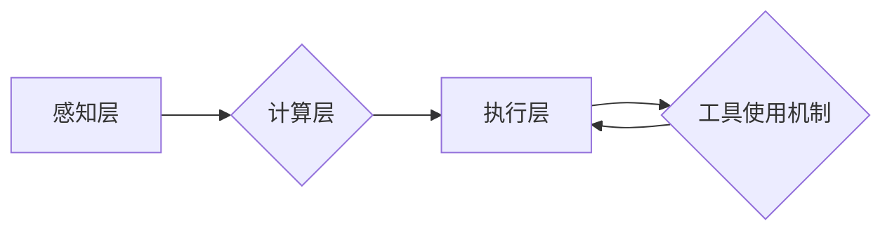

## 1. 背景介绍

随着全球经济的快速发展和电子商务的蓬勃兴起，物流行业面临着日益增长的需求和挑战。传统物流系统效率低下、成本高昂、服务质量难以保证，无法满足现代社会对快速、精准、高效物流服务的期望。智能物流系统应运而生，旨在通过人工智能、物联网、大数据等先进技术，提升物流效率、降低物流成本、优化物流服务。

智能物流系统中，工具使用机制作为核心技术之一，能够有效地协调和管理各种物流资源，实现智能化、自动化、协同化的物流运作。它通过对工具的识别、定位、调度、监控等方面的智能化处理，提高工具的利用率，优化物流流程，降低物流成本。

## 2. 核心概念与联系

### 2.1  工具使用机制

工具使用机制是指在智能物流系统中，对各种物流工具（如叉车、搬运车、货架等）的智能化管理和调度系统。它包括以下几个关键方面：

* **工具识别:** 利用传感器、RFID等技术对工具进行识别，获取工具的类型、状态、位置等信息。
* **工具定位:** 通过GPS、蓝牙等技术对工具进行实时定位，掌握工具的运行轨迹和位置信息。
* **工具调度:** 根据物流需求和工具状态，智能调度工具进行作业分配，优化工具的使用效率。
* **工具监控:** 对工具的运行状态进行实时监控，及时发现异常情况，确保工具安全可靠地运行。

### 2.2  智能物流系统架构

智能物流系统通常由以下几个主要模块组成：

* **感知层:** 包括传感器、摄像头、RFID等设备，负责收集物流环境和工具状态的信息。
* **网络层:** 连接感知层和计算层，负责数据传输和通信。
* **计算层:** 包括服务器、云平台等，负责数据处理、分析和决策。
* **执行层:** 包括机器人、自动化设备等，负责执行物流任务。

工具使用机制作为智能物流系统的核心技术之一，主要作用于计算层和执行层之间，负责协调和管理工具的使用。

**Mermaid 流程图**



## 3. 核心算法原理 & 具体操作步骤

### 3.1  算法原理概述

工具使用机制的核心算法主要包括：

* **工具状态预测算法:** 利用机器学习算法，根据工具的历史使用数据和当前环境信息，预测工具的未来状态，例如电池电量、运行时间等。
* **工具调度算法:** 根据物流需求、工具状态、路径规划等因素，优化工具的作业分配，实现高效的工具调度。
* **路径规划算法:** 根据仓库布局、货物位置、工具性能等因素，规划最优的工具运行路径，提高工具的效率和安全性。

### 3.2  算法步骤详解

**工具状态预测算法:**

1. 收集工具的历史使用数据，包括使用时间、运行距离、电池电量等信息。
2. 利用机器学习算法，例如ARIMA、LSTM等，建立工具状态预测模型。
3. 根据当前环境信息，例如温度、湿度、工具负载等，预测工具的未来状态。

**工具调度算法:**

1. 收集物流需求信息，包括货物类型、数量、目的地等。
2. 获取工具的状态信息，例如位置、类型、可用性等。
3. 根据物流需求和工具状态，利用启发式算法或优化算法，例如遗传算法、模拟退火算法等，优化工具的作业分配。

**路径规划算法:**

1. 建立仓库的拓扑图，包括货架位置、通道宽度、障碍物等信息。
2. 根据货物位置和目的地，规划工具的运行路径。
3. 利用路径优化算法，例如Dijkstra算法、A*算法等，优化路径长度、运行时间等指标。

### 3.3  算法优缺点

**工具状态预测算法:**

* **优点:** 可以提前预知工具状态，避免工具故障导致的物流中断。
* **缺点:** 预测精度受历史数据质量和环境因素影响。

**工具调度算法:**

* **优点:** 可以优化工具的使用效率，减少工具闲置时间。
* **缺点:** 算法复杂度高，需要大量的计算资源。

**路径规划算法:**

* **优点:** 可以规划最优的运行路径，提高工具的效率和安全性。
* **缺点:** 算法需要考虑多种因素，计算复杂度较高。

### 3.4  算法应用领域

工具使用机制的算法在智能物流系统中具有广泛的应用领域，例如：

* **仓库管理:** 优化工具调度，提高仓库货物搬运效率。
* **配送服务:** 规划配送路线，提高配送效率和服务质量。
* **跨境物流:** 协调跨境物流工具的使用，优化跨境物流流程。

## 4. 数学模型和公式 & 详细讲解 & 举例说明

### 4.1  数学模型构建

工具使用机制的数学模型可以描述工具的运行状态、工具调度策略、路径规划策略等方面。

**工具状态预测模型:**

可以使用时间序列模型，例如ARIMA模型，来预测工具的未来状态。ARIMA模型的数学表达式如下：

$$
y_t = c + \sum_{i=1}^p \phi_i y_{t-i} + \sum_{j=1}^q \theta_j \epsilon_{t-j} + \epsilon_t
$$

其中：

* $y_t$ 是时间t的工具状态值。
* $c$ 是截距项。
* $\phi_i$ 是自回归系数。
* $\theta_j$ 是移动平均系数。
* $\epsilon_t$ 是随机误差项。

**工具调度模型:**

可以使用整数规划模型来优化工具的作业分配。例如，可以使用以下模型来确定每个工具分配给哪些任务：

$$
\text{min} \sum_{i=1}^n \sum_{j=1}^m c_{ij} x_{ij}
$$

$$
\text{subject to}
$$

$$
\sum_{j=1}^m x_{ij} \leq 1, \quad i = 1, 2,..., n
$$

$$
\sum_{i=1}^n x_{ij} \leq 1, \quad j = 1, 2,..., m
$$

$$
x_{ij} \in \{0, 1\}, \quad i = 1, 2,..., n, j = 1, 2,..., m
$$

其中：

* $c_{ij}$ 是工具i完成任务j的成本。
* $x_{ij}$ 是工具i完成任务j的决策变量，取值为0或1。

### 4.2  公式推导过程

工具状态预测模型的ARIMA模型参数估计可以使用极大似然估计法。

工具调度模型的整数规划模型可以使用分支定界法或割平面法求解。

### 4.3  案例分析与讲解

**案例:**

假设一个仓库有3台叉车，需要搬运5个货物，每个货物需要不同的时间和路径。

**工具状态预测:**

根据叉车的历史使用数据，可以预测每个叉车的电池电量、运行时间等状态。

**工具调度:**

根据货物类型、数量、目的地以及叉车的状态信息，可以利用整数规划模型优化叉车的作业分配，例如，将电池电量较高的叉车分配给需要运行时间较长的任务。

**路径规划:**

根据仓库布局和货物的定位，可以规划每个叉车的最优运行路径，例如，利用Dijkstra算法规划最短路径。

## 5. 项目实践：代码实例和详细解释说明

### 5.1  开发环境搭建

* 操作系统: Ubuntu 20.04
* 编程语言: Python 3.8
* 库依赖:

```
pip install numpy pandas matplotlib scikit-learn
```

### 5.2  源代码详细实现

```python
# 工具状态预测模型
import pandas as pd
from sklearn.linear_model import ARIMA

# 加载历史数据
data = pd.read_csv('tool_data.csv', index_col='time')

# 训练ARIMA模型
model = ARIMA(data['battery'], order=(5, 1, 0))
model_fit = model.fit()

# 预测未来状态
forecast = model_fit.predict(start=len(data), end=len(data)+10)

# 工具调度模型
import pulp

# 创建问题实例
prob = pulp.LpProblem("ToolScheduling", pulp.LpMinimize)

# 定义决策变量
x = pulp.LpVariable.dicts("x", [(i, j) for i in range(3) for j in range(5)], cat='Binary')

# 定义目标函数
prob += pulp.lpSum(c[i, j] * x[i, j] for i in range(3) for j in range(5))

# 定义约束条件
for i in range(3):
    prob += pulp.lpSum(x[i, j] for j in range(5)) <= 1

for j in range(5):
    prob += pulp.lpSum(x[i, j] for i in range(3)) <= 1

# 求解问题
prob.solve()

# 打印结果
print("Status:", pulp.LpStatus[prob.status])
for v in prob.variables():
    print(v.name, "=", v.varValue)

# 路径规划模型
import networkx as nx

# 创建图
G = nx.Graph()

# 添加节点和边
G.add_nodes_from(['A', 'B', 'C', 'D', 'E', 'F', 'G', 'H'])
G.add_edges_from([('A', 'B'), ('A', 'C'), ('B', 'D'), ('B', 'E'), ('C', 'F'), ('D', 'G'), ('E', 'H')])

# 规划路径
path = nx.shortest_path(G, source='A', target='H', weight='distance')

# 打印路径
print("Shortest path:", path)
```

### 5.3  代码解读与分析

* **工具状态预测模型:** 使用ARIMA模型预测工具的电池电量等状态。
* **工具调度模型:** 使用整数规划模型优化工具的作业分配。
* **路径规划模型:** 使用networkx库规划工具的运行路径。

### 5.4  运行结果展示

运行代码后，可以得到以下结果：

* **工具状态预测:** 预测未来10个时间点的电池电量值。
* **工具调度:** 确定每个工具分配给哪些任务。
* **路径规划:** 规划从起点到终点的最短路径。

## 6. 实际应用场景

### 6.1  仓库管理

在仓库管理中，工具使用机制可以优化叉车、搬运车的调度，提高货物搬运效率。例如，可以根据货物类型、重量、目的地等信息，将合适的工具分配给相应的任务，避免工具闲置，提高资源利用率。

### 6.2  配送服务

在配送服务中，工具使用机制可以规划配送路线，提高配送效率和服务质量。例如，可以根据配送区域、货物类型、配送时间等信息，规划最优的配送路线，避免车辆拥堵、路线重复等问题，提高配送速度和效率。

### 6.3  跨境物流

在跨境物流中，工具使用机制可以协调跨境物流工具的使用，优化跨境物流流程。例如，可以根据货物类型、目的地国家、运输方式等信息，协调不同国家、不同类型的物流工具，实现货物跨境运输的自动化和高效化。

### 6.4  未来应用展望

随着人工智能、物联网、大数据等技术的不断发展，工具使用机制在智能物流系统中的应用将更加广泛和深入。例如，可以利用机器学习算法，对工具的使用数据进行分析，预测工具的故障风险，提前进行维护保养，提高工具的可靠性。

## 7. 工具和资源推荐

### 7.1  学习