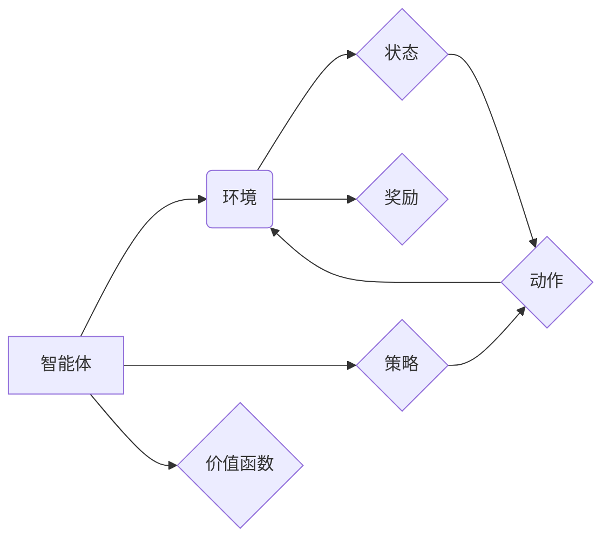

## 强化学习 原理与代码实例讲解

> 关键词：强化学习、Q学习、深度强化学习、环境、状态、动作、奖励、策略、价值函数

## 1. 背景介绍

强化学习 (Reinforcement Learning, RL) 作为机器学习领域的重要分支，近年来取得了显著进展，并在机器人控制、游戏 AI、推荐系统等领域展现出强大的应用潜力。与监督学习和无监督学习不同，强化学习的核心在于让智能体通过与环境的交互学习最优策略，以最大化累积的奖励。

传统的机器学习方法依赖于大量的标记数据，而强化学习则更侧重于学习过程中的探索和利用。智能体在与环境交互的过程中不断尝试不同的动作，并根据环境反馈的奖励信号调整策略，最终学习到能够在特定环境中取得最佳结果的行动方案。

## 2. 核心概念与联系

强化学习的核心概念包括：

* **智能体 (Agent):**  学习和决策的实体，例如机器人、游戏角色等。
* **环境 (Environment):** 智能体所处的外部世界，包括状态和奖励机制。
* **状态 (State):** 环境的当前描述，例如游戏中的棋盘状态、机器人的位置等。
* **动作 (Action):** 智能体可以执行的操作，例如移动、攻击、选择等。
* **奖励 (Reward):** 环境对智能体动作的反馈，可以是正向奖励或负向惩罚。
* **策略 (Policy):** 智能体在不同状态下选择动作的规则，可以是确定性策略或概率性策略。
* **价值函数 (Value Function):**  评估智能体在特定状态下采取特定策略的长期奖励的能力。

**核心概念关系流程图:**



## 3. 核心算法原理 & 具体操作步骤

### 3.1  算法原理概述

Q学习是强化学习领域最经典的算法之一，它通过学习一个Q表来评估在每个状态下采取每个动作的价值。Q表是一个表格，其中每个单元格存储了智能体在特定状态下采取特定动作后获得的期望奖励。

Q学习的核心思想是通过不断地与环境交互，更新Q表的每个单元格，使得智能体能够学习到最优策略。

### 3.2  算法步骤详解

1. **初始化Q表:**  将Q表中的所有单元格初始化为0或一个小随机值。
2. **选择动作:** 根据当前状态和策略选择一个动作。策略可以是贪婪策略（选择Q值最大的动作）或探索策略（随机选择动作）。
3. **执行动作:** 在环境中执行选择的动作，并观察环境反馈的奖励和下一个状态。
4. **更新Q值:** 使用Bellman方程更新Q表中的对应单元格：

 $$Q(s,a) = Q(s,a) + \alpha [r + \gamma \max_{a'} Q(s',a') - Q(s,a)]$$

其中：

* $Q(s,a)$ 是当前状态$s$下采取动作$a$的Q值。
* $\alpha$ 是学习率，控制着学习速度。
* $r$ 是环境反馈的奖励。
* $\gamma$ 是折扣因子，控制着未来奖励的权重。
* $s'$ 是下一个状态。
* $a'$ 是下一个状态下采取的动作。

5. **重复步骤2-4:** 直到智能体达到预设的终止条件，例如达到最大迭代次数或累积奖励达到目标值。

### 3.3  算法优缺点

**优点:**

* 算法简单易懂，易于实现。
* 可以应用于离散状态和动作空间的问题。
* 能够学习到最优策略。

**缺点:**

* 对于连续状态和动作空间的问题，Q表会变得非常庞大，难以存储和更新。
* 学习效率较低，需要大量的交互和训练数据。

### 3.4  算法应用领域

Q学习广泛应用于以下领域：

* **机器人控制:**  训练机器人学习最优的运动策略。
* **游戏 AI:**  训练游戏角色学习最优的游戏策略。
* **推荐系统:**  训练推荐系统学习用户偏好的物品。
* **金融交易:**  训练交易策略学习最优的投资决策。

## 4. 数学模型和公式 & 详细讲解 & 举例说明

### 4.1  数学模型构建

强化学习的数学模型可以概括为一个马尔可夫决策过程 (Markov Decision Process, MDP)。

MDP由以下五个要素组成：

* **状态空间 S:** 所有可能的系统状态的集合。
* **动作空间 A:** 在每个状态下智能体可以执行的动作的集合。
* **转移概率 P(s',r|s,a):**  从状态s执行动作a后转移到状态s'并获得奖励r的概率。
* **奖励函数 R(s,a):**  在状态s执行动作a获得的奖励。
* **折扣因子 γ:** 控制着未来奖励的权重，0 < γ < 1。

### 4.2  公式推导过程

Q学习的目标是学习一个Q函数，即在每个状态s下采取每个动作a的期望累积奖励。

Bellman方程是Q学习的核心公式，用于更新Q函数：

$$Q(s,a) = Q(s,a) + \alpha [r + \gamma \max_{a'} Q(s',a') - Q(s,a)]$$

其中：

* $Q(s,a)$ 是当前状态$s$下采取动作$a$的Q值。
* $\alpha$ 是学习率，控制着学习速度。
* $r$ 是环境反馈的奖励。
* $\gamma$ 是折扣因子，控制着未来奖励的权重。
* $s'$ 是下一个状态。
* $a'$ 是下一个状态下采取的动作。

### 4.3  案例分析与讲解

假设一个智能体在玩一个简单的游戏，游戏中有两个状态：

* $s_1$:  智能体在起点。
* $s_2$:  智能体到达终点。

智能体可以执行两个动作：

* $a_1$: 向右移动。
* $a_2$: 向左移动。

游戏规则如下：

* 从 $s_1$ 状态执行 $a_1$ 动作，可以到达 $s_2$ 状态，获得奖励 $r = 1$。
* 从 $s_1$ 状态执行 $a_2$ 动作，无法到达终点，获得奖励 $r = 0$。

使用Q学习算法，我们可以训练智能体学习最优策略，即在起点状态下选择向右移动的动作。

## 5. 项目实践：代码实例和详细解释说明

### 5.1  开发环境搭建

* Python 3.x
* TensorFlow 或 PyTorch 等深度学习框架

### 5.2  源代码详细实现

```python
import numpy as np

# 定义状态空间和动作空间
states = ['s1','s2']
actions = ['a1', 'a2']

# 初始化Q表
q_table = np.zeros((len(states), len(actions)))

# 设置学习参数
alpha = 0.1
gamma = 0.9

# 训练过程
for episode in range(1000):
    current_state ='s1'
    while current_state!='s2':
        # 选择动作
        action = np.argmax(q_table[states.index(current_state)])

        # 执行动作并获得奖励和下一个状态
        next_state, reward = get_next_state_and_reward(current_state, action)

        # 更新Q值
        q_table[states.index(current_state), actions.index(action)] = q_table[states.index(current_state), actions.index(action)] + alpha * (reward + gamma * np.max(q_table[states.index(next_state)]) - q_table[states.index(current_state), actions.index(action)])

        # 更新当前状态
        current_state = next_state

# 输出Q表
print(q_table)
```

### 5.3  代码解读与分析

* **状态空间和动作空间:**  代码首先定义了智能体所处的状态空间和可执行的动作空间。
* **Q表初始化:**  Q表被初始化为一个全零的矩阵，表示在每个状态下采取每个动作的初始Q值为0。
* **学习参数:**  学习率 $\alpha$ 和折扣因子 $\gamma$ 控制着学习速度和未来奖励的权重。
* **训练过程:**  训练过程是一个循环，每次循环代表一个episode。在每个episode中，智能体从起点状态开始，根据当前状态和Q表选择动作，执行动作并获得奖励和下一个状态。然后，使用Bellman方程更新Q表中的对应单元格。
* **输出Q表:**  训练完成后，输出Q表，可以观察到Q值已经学习到最优策略。

### 5.4  运行结果展示

运行代码后，输出的Q表会显示出每个状态下采取每个动作的期望累积奖励。例如，如果Q表中 $q_table[0, 0]$ 的值大于 $q_table[0, 1]$，则表示在起点状态下采取向右移动的动作的期望累积奖励更高，智能体应该选择向右移动。

## 6. 实际应用场景

### 6.1  机器人控制

强化学习可以用于训练机器人学习最优的运动策略，例如导航、抓取、组装等任务。

### 6.2  游戏 AI

强化学习可以用于训练游戏角色学习最优的游戏策略，例如AlphaGo、AlphaStar等。

### 6.3  推荐系统

强化学习可以用于训练推荐系统学习用户偏好的物品，例如电影推荐、商品推荐等。

### 6.4  未来应用展望

强化学习在未来将有更广泛的应用，例如自动驾驶、医疗诊断、金融交易等领域。

## 7. 工具和资源推荐

### 7.1  学习资源推荐

* **书籍:**
    * Reinforcement Learning: An Introduction by Richard S. Sutton and Andrew G. Barto
    * Deep Reinforcement Learning Hands-On by Maxim Lapan
* **在线课程:**
    * Coursera: Reinforcement Learning Specialization by David Silver
    * Udacity: Deep Reinforcement Learning Nanodegree

### 7.2  开发工具推荐

* **TensorFlow:**  Google开发的开源深度学习框架，支持强化学习算法的实现。
* **PyTorch:**  Facebook开发的开源深度学习框架，也支持强化学习算法的实现。
* **OpenAI Gym:**  一个用于强化学习算法测试和研究的开源环境库。

### 7.3  相关论文推荐

* **Deep Q-Network (DQN):**  Mnih et al., 2015
* **Proximal Policy Optimization (PPO):**  Schulman et al., 2017
* **Trust Region Policy Optimization (TRPO):**  Schulman et al., 2015

## 8. 总结：未来发展趋势与挑战

### 8.1  研究成果总结

强化学习近年来取得了显著进展，在多个领域取得了突破性成果，例如游戏 AI、机器人控制等。

### 8.2  未来发展趋势

* **深度强化学习:**  将深度神经网络与强化学习算法结合，提高算法的学习能力和泛化能力。
* **离线强化学习:**  利用现有数据进行强化学习训练，无需与环境交互。
* **多智能体强化学习:**  训练多个智能体协同合作完成任务。

### 8.3  面临的挑战

* **样本效率:**  强化学习算法通常需要大量的交互数据进行训练，这在现实世界中可能难以实现。
* **探索与利用的平衡:**  强化学习算法需要在探索新策略和利用已知策略之间找到平衡。
* **可解释性:**  强化