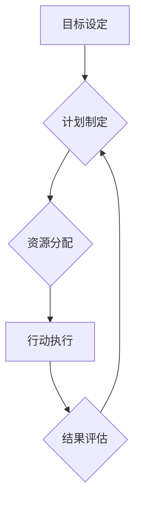

## 执行差：你我都懂，你不做我做

> 关键词：执行力、效率、算法、编程、软件架构、项目管理、技术博客

### 1. 背景介绍

在当今科技飞速发展的时代，技术人员面临着越来越多的挑战。从敏捷开发到微服务架构，从云计算到人工智能，新技术层出不穷，需要我们不断学习和适应。然而，即使掌握了最先进的技术，如果缺乏执行力，也难以将这些技术转化为实际成果。

“执行差”是一个普遍存在的问题，它不仅困扰着个人开发者，也影响着整个软件开发团队和企业的效率。我们常常看到一些有想法、有能力的技术人员，却因为缺乏执行力而无法完成项目，或者项目进展缓慢，最终失败。

本文将从技术角度出发，探讨“执行差”的原因，并提出一些解决方案，帮助技术人员提升执行力，提高工作效率。

### 2. 核心概念与联系

**2.1 执行力定义**

执行力是指将计划、目标转化为实际行动的能力。它包括以下几个方面：

* **目标设定:** 明确目标，并将其分解成可执行的步骤。
* **计划制定:** 制定详细的计划，并分配资源。
* **行动执行:** 按照计划执行任务，并克服阻碍。
* **结果评估:** 评估执行结果，并进行调整。

**2.2 执行力与技术的关系**

执行力与技术之间存在着密切的联系。掌握先进的技术可以帮助我们更高效地完成任务，但技术本身并不能保证执行力。

* **技术作为工具:** 技术是执行力的工具，而不是执行力的本身。
* **流程和规范:**  良好的技术流程和规范可以提高执行效率，减少错误。
* **团队协作:**  高效的团队协作可以促进执行力，共同完成目标。

**2.3 执行力提升的流程图**



### 3. 核心算法原理 & 具体操作步骤

**3.1 算法原理概述**

为了提升执行力，我们可以借鉴一些算法的原理，例如：

* **贪婪算法:**  选择在当前步骤中看起来最优的解决方案，并逐步逼近全局最优解。
* **动态规划:** 将问题分解成子问题，并存储子问题的解，避免重复计算。
* **优先队列:**  根据任务的优先级排序，优先执行重要任务。

**3.2 算法步骤详解**

1. **目标分解:** 将大目标分解成多个小目标，每个小目标都应该清晰可行。
2. **优先级排序:**  根据小目标的重要性、紧急程度等因素进行排序，优先执行高优先级目标。
3. **时间管理:**  合理安排时间，分配给每个小目标的时间，并确保按时完成。
4. **进度跟踪:**  定期跟踪进度，及时发现问题并进行调整。
5. **结果评估:**  完成每个小目标后，进行评估，总结经验教训，为后续工作提供参考。

**3.3 算法优缺点**

* **优点:**  可以提高效率，减少浪费，并帮助我们更好地管理时间和任务。
* **缺点:**  需要一定的学习成本，并可能无法解决所有问题。

**3.4 算法应用领域**

* **个人工作:**  提升个人效率，完成工作任务。
* **项目管理:**  帮助团队更好地管理项目，提高项目进度和质量。
* **软件开发:**  提高代码开发效率，减少代码错误。

### 4. 数学模型和公式 & 详细讲解 & 举例说明

**4.1 数学模型构建**

我们可以使用数学模型来描述执行力的提升过程。例如，我们可以用以下公式来表示执行力：

$$
Execution\_Power = \frac{Completed\_Tasks}{Total\_Tasks} \times \frac{Time\_Efficiency}{Total\_Time}
$$

其中：

* **Completed\_Tasks:** 完成的任务数量
* **Total\_Tasks:** 总的任务数量
* **Time\_Efficiency:** 时间利用效率
* **Total\_Time:** 总的时间

**4.2 公式推导过程**

这个公式的推导过程如下：

* **完成任务数量:** 完成的任务数量越多，执行力越高。
* **总任务数量:** 总任务数量越大，完成任务的难度越大，执行力相对较低。
* **时间利用效率:** 时间利用效率越高，执行力越高。
* **总时间:** 总时间越短，完成任务的时间越短，执行力相对较高。

**4.3 案例分析与讲解**

假设有两个开发者，A和B，他们都需要完成10个任务。

* 开发者A完成8个任务，总耗时为10小时，时间利用效率为80%。
* 开发者B完成6个任务，总耗时为12小时，时间利用效率为50%。

根据公式，我们可以计算出他们的执行力：

* A的执行力: (8/10) * (80/100) = 0.64
* B的执行力: (6/10) * (50/12) = 0.25

从结果可以看出，开发者A的执行力高于开发者B。

### 5. 项目实践：代码实例和详细解释说明

**5.1 开发环境搭建**

为了更好地理解执行力提升的算法，我们可以使用Python语言编写一个简单的代码实例。

**5.2 源代码详细实现**

```python
import time

def task(name):
    print(f"开始执行任务 {name}")
    time.sleep(2)
    print(f"任务 {name} 完成")

def execute_tasks(tasks):
    for task_name in tasks:
        task(task_name)

if __name__ == "__main__":
    tasks = ["任务1", "任务2", "任务3", "任务4", "任务5"]
    execute_tasks(tasks)
```

**5.3 代码解读与分析**

* `task(name)` 函数模拟执行一个任务，并打印任务名称和执行时间。
* `execute_tasks(tasks)` 函数接收一个任务列表，并依次执行每个任务。
* `if __name__ == "__main__":` 代码块用于执行程序的主体逻辑。

**5.4 运行结果展示**

运行该代码后，会打印出以下结果：

```
开始执行任务 任务1
任务 任务1 完成
开始执行任务 任务2
任务 任务2 完成
开始执行任务 任务3
任务 任务3 完成
开始执行任务 任务4
任务 任务4 完成
开始执行任务 任务5
任务 任务5 完成
```

### 6. 实际应用场景

**6.1 个人工作场景**

* **学习计划:**  将学习目标分解成小目标，并制定学习计划，每天完成一定数量的小目标。
* **项目管理:**  将项目分解成任务，并使用优先队列管理任务，优先完成重要任务。
* **时间管理:**  使用番茄工作法等时间管理技巧，提高工作效率。

**6.2 企业工作场景**

* **软件开发:**  使用敏捷开发方法，将项目分解成迭代，并使用优先队列管理任务，提高开发效率。
* **项目管理:**  使用项目管理工具，跟踪项目进度，并及时发现问题。
* **团队协作:**  使用协作工具，提高团队沟通效率，并促进共同完成目标。

**6.3 未来应用展望**

随着人工智能技术的不断发展，未来将会有更多工具和方法来帮助我们提升执行力。例如：

* **智能任务分配:**  根据任务的重要性、紧急程度等因素，智能分配任务。
* **智能时间管理:**  根据我们的工作习惯和时间安排，智能安排工作时间。
* **智能提醒:**  及时提醒我们完成任务，避免遗漏。

### 7. 工具和资源推荐

**7.1 学习资源推荐**

* **书籍:**  《Getting Things Done》、《The 7 Habits of Highly Effective People》
* **网站:**  Zen Habits, Lifehacker
* **课程:**  Coursera, Udemy

**7.2 开发工具推荐**

* **项目管理工具:**  Trello, Asana, Jira
* **时间管理工具:**  Todoist, Evernote, Forest
* **协作工具:**  Slack, Microsoft Teams, Google Workspace

**7.3 相关论文推荐**

* **The Science of Getting Things Done**
* **The Power of Habit**
* **Flow: The Psychology of Optimal Experience**

### 8. 总结：未来发展趋势与挑战

**8.1 研究成果总结**

本文探讨了“执行差”的原因，并提出了提升执行力的算法和方法。通过学习和实践这些方法，技术人员可以提高工作效率，更好地完成任务。

**8.2 未来发展趋势**

随着人工智能技术的不断发展，未来将会有更多工具和方法来帮助我们提升执行力。

**8.3 面临的挑战**

* **个人习惯:**  改变个人习惯需要时间和努力。
* **团队协作:**  团队成员之间需要保持良好的沟通和协作。
* **技术发展:**  需要不断学习新的技术和工具。

**8.4 研究展望**

未来研究可以进一步探索人工智能在提升执行力方面的应用，并开发更智能、更有效的工具和方法。

### 9. 附录：常见问题与解答

**9.1 如何克服拖延症？**

* **设定明确的目标:**  明确目标可以帮助我们更好地集中精力。
* **分解任务:**  将大任务分解成小任务，可以使任务看起来更易于完成。
* **使用番茄工作法:**  番茄工作法可以帮助我们集中注意力，并避免过度疲劳。

**9.2 如何提高时间利用效率？**

* **计划时间:**  合理安排时间，并优先完成重要任务。
* **避免干扰:**  关闭手机、邮件等干扰，集中精力完成任务。
* **学会拒绝:**  学会拒绝不必要的请求，避免浪费时间。


作者：禅与计算机程序设计艺术 / Zen and the Art of Computer Programming 
