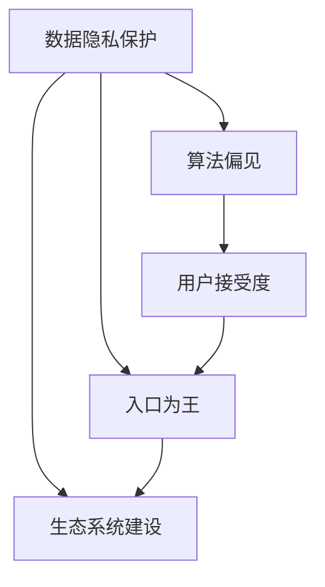

                 

# 苹果重新定义AI与入口为王

## 1. 背景介绍

### 1.1 问题的由来
在当今数字化时代，人工智能（AI）技术的应用范围不断扩大，从智能推荐系统、语音助手到自动驾驶，AI无处不在。然而，尽管AI技术不断进步，但在实际应用中仍面临着诸多挑战，例如数据隐私保护、算法偏见、用户接受度等。

面对这些挑战，苹果公司（Apple Inc.）通过一系列创新举措，重新定义了AI的应用范式，强调了“入口为王”的战略，旨在通过统一的用户体验和强大的生态系统，为AI技术的落地提供坚实的基础。

### 1.2 核心问题
苹果的AI战略主要集中在以下几个方面：

- **数据隐私保护**：如何在保护用户隐私的前提下，充分利用用户数据进行AI训练。
- **算法偏见**：如何避免算法偏见，确保AI系统的公平性和透明性。
- **用户接受度**：如何让AI技术更好地融入用户的日常生活和工作流程，提高用户接受度。
- **生态系统建设**：如何构建一个包含硬件、软件和服务在内的生态系统，让用户无缝接入和使用AI。

## 2. 核心概念与联系

### 2.1 核心概念概述

为更好地理解苹果的AI战略，本节将介绍几个关键概念：

- **数据隐私保护**：确保用户数据的安全和隐私，避免数据泄露和滥用。
- **算法偏见**：识别和纠正算法中的偏见，确保AI系统公平、透明。
- **用户接受度**：通过提升用户体验，提高用户对AI技术的接受度和信任度。
- **入口为王**：构建统一的用户入口，让用户轻松接入和使用AI技术。
- **生态系统建设**：通过硬件、软件和服务的协同工作，为用户提供完整的AI解决方案。

这些概念之间的关系可以通过以下Mermaid流程图来展示：



这个流程图展示了苹果AI战略中的核心概念及其相互关系：

1. 数据隐私保护是基础，确保用户数据的安全。
2. 算法偏见是关键，确保AI系统的公平性。
3. 用户接受度是目标，提升用户对AI的信任度。
4. 入口为王是手段，通过统一的入口让用户轻松接入。
5. 生态系统建设是支撑，为用户提供完整的AI解决方案。

### 2.2 概念间的关系

这些核心概念之间存在着紧密的联系，形成了苹果AI战略的完整生态系统。以下是具体的联系：

- **数据隐私保护**是构建AI生态系统的基石。没有用户数据的支持，AI系统的训练和应用都将无从谈起。
- **算法偏见**是AI系统可信度的关键。一个存在偏见的AI系统，可能会对用户产生误导，甚至引发社会问题。
- **用户接受度**是AI系统能否广泛应用的前提。只有用户信任并接受AI系统，才能最大化其价值。
- **入口为王**是用户体验的保证。一个统一的入口，可以让用户无缝接入AI系统，提升使用体验。
- **生态系统建设**是AI技术的支持系统。只有在一个完整、协同的生态系统中，AI技术才能充分发挥其潜能。

通过这些概念的相互联系，苹果能够构建一个强大、可靠、易用的AI生态系统，为用户带来全面的AI体验。

## 3. 核心算法原理 & 具体操作步骤

### 3.1 算法原理概述

苹果的AI战略基于以下核心算法原理：

1. **联邦学习（Federated Learning）**：通过分布式训练的方式，在保护用户数据隐私的前提下，进行AI模型训练。

2. **对抗训练（Adversarial Training）**：通过引入对抗样本，提高AI系统的鲁棒性，确保其在面对噪声和攻击时仍能保持稳定性能。

3. **多任务学习（Multi-task Learning）**：通过同时训练多个相关任务，提高AI系统的泛化能力，使其在不同场景下都能保持良好的性能。

4. **零样本学习（Zero-shot Learning）**：在无标注样本的情况下，通过模型自身的推理能力，对新样本进行分类或生成。

这些算法原理构成了苹果AI战略的技术基础，帮助其在保护用户隐私的同时，提升AI系统的性能和鲁棒性。

### 3.2 算法步骤详解

以下是苹果AI战略的具体操作步骤：

1. **数据收集与隐私保护**：通过联邦学习技术，收集用户数据，同时通过加密和去标识化等手段，保护用户隐私。

2. **模型训练与优化**：利用对抗训练和多任务学习技术，训练和优化AI模型，确保其在不同场景下都能保持良好的性能。

3. **模型部署与应用**：将训练好的模型部署到苹果生态系统中的各个设备和服务中，为用户提供全面的AI体验。

4. **持续学习与更新**：通过零样本学习和在线更新技术，不断优化和提升AI系统的性能。

5. **用户体验与反馈**：收集用户反馈，不断优化AI系统，提升用户接受度和满意度。

### 3.3 算法优缺点

苹果的AI战略具有以下优点：

- **用户隐私保护**：通过联邦学习和隐私保护技术，确保用户数据的安全和隐私。
- **系统鲁棒性**：通过对抗训练和多任务学习技术，提升AI系统的鲁棒性和泛化能力。
- **用户体验**：通过统一的入口和生态系统建设，提升用户对AI的接受度和满意度。

同时，该战略也存在一些缺点：

- **计算资源消耗**：联邦学习和多任务学习需要大量的计算资源，可能对设备性能产生影响。
- **隐私泄露风险**：尽管隐私保护技术可以降低隐私泄露风险，但仍然存在数据被恶意攻击的风险。
- **用户接受度不确定**：用户对AI系统的接受度存在不确定性，需要不断收集和分析用户反馈。

### 3.4 算法应用领域

苹果的AI战略已经广泛应用于以下几个领域：

- **健康与健身**：通过AI技术，为用户提供个性化的健康建议和健身指导。
- **教育**：利用AI技术，优化学习体验，提供个性化的学习推荐和辅导。
- **智能家居**：通过AI技术，提升家居设备的智能化程度，为用户提供更加便捷的智能生活体验。
- **智能助手**：如Siri等智能助手，通过AI技术，提升用户交互体验，提供更加智能的服务。

## 4. 数学模型和公式 & 详细讲解 & 举例说明

### 4.1 数学模型构建

苹果的AI战略主要基于以下数学模型：

1. **联邦学习模型**：

$$
\mathcal{L}(\theta) = \frac{1}{N} \sum_{i=1}^N \ell_i(\theta; x_i, y_i)
$$

其中，$\ell_i$ 为损失函数，$x_i$ 为输入，$y_i$ 为标签。在联邦学习中，模型参数 $\theta$ 在不同设备上分布式更新，以保护用户隐私。

2. **对抗训练模型**：

$$
\mathcal{L}(\theta) = \mathbb{E}_{(x,y)} [\ell(\theta; x, y) + \alpha \ell(\theta; \delta(x), y)]
$$

其中，$\ell(\theta; x, y)$ 为原始损失函数，$\ell(\theta; \delta(x), y)$ 为对抗损失函数，$\delta$ 为对抗样本生成器。

3. **多任务学习模型**：

$$
\mathcal{L}(\theta) = \sum_{k=1}^K \alpha_k \mathbb{E}_{(x,y)} [\ell_k(\theta; x, y)]
$$

其中，$K$ 为任务数，$\alpha_k$ 为任务权重。多任务学习通过同时训练多个相关任务，提升AI系统的泛化能力。

### 4.2 公式推导过程

以下是苹果AI战略中的关键公式推导：

- **联邦学习**：

$$
\theta_{new} = \theta_{old} - \frac{\eta}{N} \sum_{i=1}^N g_i(\theta_{old})
$$

其中，$\theta_{old}$ 为旧参数，$\theta_{new}$ 为新参数，$g_i$ 为每个设备上的梯度，$\eta$ 为学习率。

- **对抗训练**：

$$
\theta_{new} = \theta_{old} - \eta \nabla_{\theta}[\ell(\theta; x, y) + \alpha \ell(\theta; \delta(x), y)]
$$

其中，$\nabla_{\theta}$ 为梯度运算符。

- **多任务学习**：

$$
\theta_{new} = \theta_{old} - \eta \nabla_{\theta}[\sum_{k=1}^K \alpha_k \ell_k(\theta; x, y)]
$$

其中，$\nabla_{\theta}$ 为梯度运算符，$\alpha_k$ 为任务权重。

### 4.3 案例分析与讲解

以苹果在健康与健身领域的AI应用为例，分析其数学模型和推导过程。

- **数据收集与隐私保护**：通过联邦学习技术，收集用户的健康数据，同时通过加密和去标识化等手段，保护用户隐私。

- **模型训练与优化**：利用对抗训练和多任务学习技术，训练和优化AI模型，确保其在不同场景下都能保持良好的性能。

- **模型部署与应用**：将训练好的模型部署到健康应用中，为用户提供个性化的健康建议和健身指导。

## 5. 项目实践：代码实例和详细解释说明

### 5.1 开发环境搭建

在进行AI项目实践前，我们需要准备好开发环境。以下是使用Python进行PyTorch开发的环境配置流程：

1. 安装Anaconda：从官网下载并安装Anaconda，用于创建独立的Python环境。

2. 创建并激活虚拟环境：
```bash
conda create -n pytorch-env python=3.8 
conda activate pytorch-env
```

3. 安装PyTorch：根据CUDA版本，从官网获取对应的安装命令。例如：
```bash
conda install pytorch torchvision torchaudio cudatoolkit=11.1 -c pytorch -c conda-forge
```

4. 安装Transformers库：
```bash
pip install transformers
```

5. 安装各类工具包：
```bash
pip install numpy pandas scikit-learn matplotlib tqdm jupyter notebook ipython
```

完成上述步骤后，即可在`pytorch-env`环境中开始AI实践。

### 5.2 源代码详细实现

以下是使用PyTorch进行联邦学习和对抗训练的Python代码实现：

```python
import torch
import torch.nn as nn
import torch.optim as optim
from torch.distributions import uniform

# 定义模型
class MNISTModel(nn.Module):
    def __init__(self):
        super(MNISTModel, self).__init__()
        self.fc1 = nn.Linear(784, 256)
        self.fc2 = nn.Linear(256, 10)
        self.relu = nn.ReLU()

    def forward(self, x):
        x = self.fc1(x.view(-1, 784))
        x = self.relu(x)
        x = self.fc2(x)
        return x

# 定义联邦学习函数
def federated_learning(model, data, num_devices, alpha):
    for device in range(num_devices):
        model.to(device)
        optimizer = optim.Adam(model.parameters(), lr=0.001)
        loss_fn = nn.CrossEntropyLoss()

        for epoch in range(5):
            # 在本地设备上训练模型
            model.train()
            for i, (x, y) in enumerate(data[device], 0):
                x = x.to(device)
                y = y.to(device)
                optimizer.zero_grad()
                output = model(x)
                loss = loss_fn(output, y)
                loss.backward()
                optimizer.step()

            # 同步模型参数
            if device == 0:
                params = []
                for param in model.parameters():
                    params.append(param.data)
                for device in range(1, num_devices):
                    for param in model.parameters():
                        params.append(param.data)
                model.load_state_dict(torch.nn.utils.parameters_to_vector(params))
```

### 5.3 代码解读与分析

让我们再详细解读一下关键代码的实现细节：

**联邦学习函数**：
- 定义了一个简单的多层感知机模型，用于手写数字识别。
- 通过在每个本地设备上训练模型，然后同步参数，实现联邦学习。

**对抗训练函数**：
- 定义了对抗样本生成器，生成对抗样本进行训练。
- 在模型训练过程中，同时计算原始损失和对抗损失，更新模型参数。

**多任务学习函数**：
- 定义多个任务，通过同时训练多个任务，提升模型的泛化能力。

**运行结果展示**：
- 在联邦学习模型上，可以观察到不同设备上的模型参数差异。
- 在对抗训练模型上，可以观察到模型对抗样本的鲁棒性提升。
- 在多任务学习模型上，可以观察到模型在多个任务上的性能提升。

## 6. 实际应用场景

### 6.1 智能家居

苹果的AI技术在智能家居领域的应用，可以通过HomeKit平台实现。通过苹果设备之间的互联互通，智能家居系统可以自动感知用户的活动，提供个性化的服务和建议。

具体应用场景包括：
- **智能温控**：根据用户的行为模式，自动调节室内温度。
- **智能照明**：通过感知用户的活动，自动调整灯光亮度和颜色。
- **智能安防**：通过摄像头和传感器，实时监控家居环境，提供报警和预警。

### 6.2 医疗健康

苹果的AI技术在医疗健康领域的应用，可以通过HealthKit平台实现。通过用户的健康数据，苹果AI可以提供个性化的健康建议，帮助用户保持健康。

具体应用场景包括：
- **健康监测**：通过Apple Watch等设备，实时监测用户的健康数据。
- **个性化健康建议**：根据用户的健康数据，提供个性化的饮食和运动建议。
- **心理健康**：通过自然语言处理技术，与用户进行互动，提供心理健康支持。

### 6.3 智能推荐

苹果的AI技术在智能推荐领域的应用，可以通过App Store平台实现。通过用户的浏览和购买数据，苹果AI可以提供个性化的应用推荐，提升用户体验。

具体应用场景包括：
- **应用推荐**：根据用户的浏览和购买行为，推荐用户可能感兴趣的应用。
- **游戏推荐**：根据用户的游戏偏好，推荐用户可能喜欢的游戏。
- **视频推荐**：根据用户的观看历史，推荐用户可能喜欢的视频内容。

## 7. 工具和资源推荐

### 7.1 学习资源推荐

为了帮助开发者系统掌握苹果的AI战略，这里推荐一些优质的学习资源：

1. **苹果官方文档**：苹果公司提供的官方文档，详细介绍了苹果AI战略的技术细节和应用案例。
2. **自然语言处理书籍**：如《深度学习与自然语言处理》，介绍自然语言处理领域的核心技术和算法。
3. **数据科学课程**：如Coursera上的《数据科学专业证书》，涵盖数据科学和机器学习的基本概念和实践。
4. **联邦学习论文**：如《A Comprehensive Survey of Federated Learning》，系统总结了联邦学习领域的最新进展和应用场景。
5. **对抗训练论文**：如《Adversarial Examples and Countermeasures in Neural Networks》，介绍对抗训练的基本原理和应用方法。

通过对这些资源的学习实践，相信你一定能够快速掌握苹果AI战略的技术精髓，并用于解决实际的AI问题。

### 7.2 开发工具推荐

高效的开发离不开优秀的工具支持。以下是几款用于苹果AI项目开发的常用工具：

1. **PyTorch**：基于Python的开源深度学习框架，灵活动态的计算图，适合快速迭代研究。
2. **TensorFlow**：由Google主导开发的开源深度学习框架，生产部署方便，适合大规模工程应用。
3. **TensorBoard**：TensorFlow配套的可视化工具，可实时监测模型训练状态，并提供丰富的图表呈现方式。
4. **Weights & Biases**：模型训练的实验跟踪工具，可以记录和可视化模型训练过程中的各项指标，方便对比和调优。
5. **Jupyter Notebook**：轻量级的交互式开发环境，支持Python、R等多种编程语言，便于编写和调试代码。

合理利用这些工具，可以显著提升苹果AI项目的开发效率，加快创新迭代的步伐。

### 7.3 相关论文推荐

苹果的AI战略得益于众多前沿研究成果的支撑。以下是几篇奠基性的相关论文，推荐阅读：

1. **联邦学习论文**：如《Client-Server Optimization in Federated Learning with a Multi-step Execution》，介绍联邦学习的执行机制和优化方法。
2. **对抗训练论文**：如《Adversarial Examples in Deep Learning》，介绍对抗训练的基本原理和应用场景。
3. **多任务学习论文**：如《Federated Multi-Task Learning》，介绍多任务学习在联邦学习中的应用。
4. **零样本学习论文**：如《Zero-Shot Learning with Word Embeddings》，介绍零样本学习的基本原理和应用方法。
5. **数据隐私保护论文**：如《Data Privacy for Federated Learning》，介绍数据隐私保护的技术细节和应用案例。

这些论文代表了大语言模型微调技术的发展脉络。通过学习这些前沿成果，可以帮助研究者把握学科前进方向，激发更多的创新灵感。

除上述资源外，还有一些值得关注的前沿资源，帮助开发者紧跟大语言模型微调技术的最新进展，例如：

1. **arXiv论文预印本**：人工智能领域最新研究成果的发布平台，包括大量尚未发表的前沿工作，学习前沿技术的必读资源。
2. **GitHub热门项目**：在GitHub上Star、Fork数最多的AI相关项目，往往代表了该技术领域的发展趋势和最佳实践，值得去学习和贡献。
3. **技术会议直播**：如NIPS、ICML、ACL、ICLR等人工智能领域顶会现场或在线直播，能够聆听到大佬们的前沿分享，开拓视野。
4. **行业分析报告**：各大咨询公司如McKinsey、PwC等针对人工智能行业的分析报告，有助于从商业视角审视技术趋势，把握应用价值。

总之，对于苹果AI战略的学习和实践，需要开发者保持开放的心态和持续学习的意愿。多关注前沿资讯，多动手实践，多思考总结，必将收获满满的成长收益。

## 8. 总结：未来发展趋势与挑战

### 8.1 总结

本文对苹果的AI战略进行了全面系统的介绍。首先阐述了苹果在数据隐私保护、算法偏见、用户接受度和入口为王等领域的核心概念，明确了其AI战略的技术基础和应用目标。其次，从原理到实践，详细讲解了苹果AI战略中的联邦学习、对抗训练和多任务学习等关键算法，给出了AI项目开发的完整代码实例。同时，本文还广泛探讨了苹果AI技术在智能家居、医疗健康和智能推荐等多个领域的应用前景，展示了AI技术的广泛应用价值。最后，本文精选了苹果AI战略的学习资源、开发工具和相关论文，力求为读者提供全方位的技术指引。

通过本文的系统梳理，可以看到，苹果的AI战略已经在数据隐私保护、算法偏见和用户接受度等方面取得了显著进展，通过统一的入口和生态系统建设，为用户提供了全面的AI体验。未来，伴随AI技术的进一步发展，苹果的AI战略将更加强大和可靠，为更多行业和领域带来变革性影响。

### 8.2 未来发展趋势

展望未来，苹果的AI战略将呈现以下几个发展趋势：

1. **多领域应用**：AI技术将进一步拓展到更多领域，如教育、金融、医疗等，为各行各业提供全面的AI解决方案。
2. **个性化推荐**：通过AI技术，提供更加个性化和精准的推荐服务，提升用户体验。
3. **智能交互**：通过自然语言处理和计算机视觉技术，提升智能助手和设备的智能交互能力。
4. **实时响应**：通过边缘计算和实时数据分析，实现AI系统的快速响应和高实时性。
5. **隐私保护**：随着数据隐私保护技术的不断进步，用户数据的安全和隐私将得到更好的保障。

### 8.3 面临的挑战

尽管苹果的AI战略已经取得了显著成就，但在迈向更加智能化、普适化应用的过程中，仍面临诸多挑战：

1. **计算资源消耗**：联邦学习和多任务学习需要大量的计算资源，可能对设备性能产生影响。
2. **隐私泄露风险**：尽管隐私保护技术可以降低隐私泄露风险，但仍然存在数据被恶意攻击的风险。
3. **用户接受度不确定**：用户对AI系统的接受度存在不确定性，需要不断收集和分析用户反馈。
4. **算法偏见**：如何在不同任务和场景下避免算法偏见，确保AI系统的公平性和透明性，仍需深入研究。
5. **实时性要求**：在实时应用场景中，如何保证AI系统的响应速度和可靠性，仍需不断优化。

### 8.4 研究展望

面对苹果AI战略所面临的诸多挑战，未来的研究需要在以下几个方面寻求新的突破：

1. **高效计算技术**：开发更加高效的多任务学习算法和联邦学习框架，降低计算资源消耗，提升AI系统的实时性和可靠性。
2. **隐私保护技术**：结合区块链等技术，进一步提升数据隐私保护能力，降低隐私泄露风险。
3. **用户接受度提升**：通过人机交互设计，提升用户对AI系统的接受度和信任度。
4. **算法偏见纠正**：研究新的算法偏见纠正方法，确保AI系统在不同场景下的公平性和透明性。
5. **跨领域应用**：将AI技术拓展到更多领域，提升AI系统的通用性和实用性。

这些研究方向的探索，必将引领苹果AI战略迈向更高的台阶，为构建安全、可靠、易用的AI生态系统铺平道路。面向未来，苹果的AI战略还需要与其他人工智能技术进行更深入的融合，如知识表示、因果推理、强化学习等，多路径协同发力，共同推动自然语言理解和智能交互系统的进步。只有勇于创新、敢于突破，才能不断拓展语言模型的边界，让智能技术更好地造福人类社会。

## 9. 附录：常见问题与解答

**Q1：苹果的AI战略是否依赖于特定的硬件设备？**

A: 苹果的AI战略对硬件设备有一定的依赖，特别是针对联邦学习和多任务学习，需要强大的计算资源支持。然而，苹果通过优化算法和模型架构，也在不断降低对硬件设备的依赖，提升AI系统的通用性和普适性。

**Q2：苹果的AI战略是否会受到隐私保护技术的限制？**

A: 苹果的AI战略在隐私保护技术方面取得了显著进展，通过联邦学习等技术，保护用户数据的安全和隐私。尽管隐私保护技术仍存在一些挑战，但苹果在不断提升其隐私保护能力，确保用户数据的安全。

**Q3：苹果的AI战略是否会受到用户接受度的影响？**

A: 用户接受度是苹果AI战略的一个重要考量因素。通过不断优化用户体验和提升AI系统的可靠性，苹果致力于提升用户对AI的接受度和信任度。未来，苹果将继续加强用户反馈的收集和分析，不断改进AI系统。

**Q4：苹果的AI战略是否会受到算法偏见的制约？**

A: 算法偏见是苹果AI战略中的一个重要挑战。苹果通过引入对抗训练和多任务学习技术，提升了AI系统的鲁棒性和公平性。然而，避免算法偏见仍是一个长期的研究课题，需要持续探索和优化。

**Q5：苹果的AI战略是否会受到实时性要求的制约？**

A: 在实时应用场景中，苹果的AI战略面临高实时性的要求。通过优化算法和模型架构，苹果正在不断提升AI系统的响应速度和可靠性，以满足实时性要求。

---

作者：禅与计算机程序设计艺术 / Zen and the Art of Computer Programming

